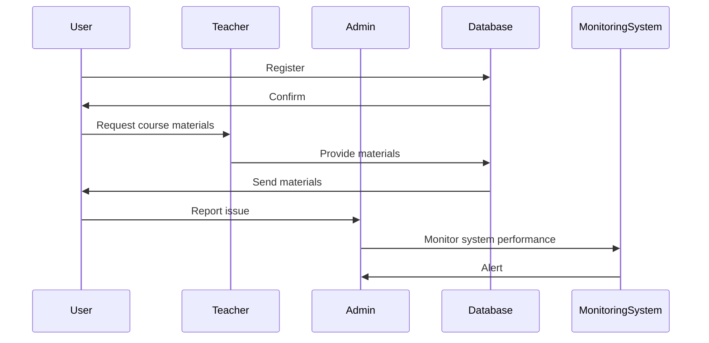

                 

### 引言

多角色模拟评测（Multi-Role Simulation Evaluation）是人工智能（AI）领域中的一个重要研究方向，它在模拟复杂系统、分析决策过程和评估系统性能方面发挥着关键作用。随着人工智能技术的发展，特别是大型语言模型（Large Language Models，LLM）的出现，多角色模拟评测迎来了新的机遇和挑战。

本文旨在探讨如何利用LLM来扮演不同用户类型，进行多角色模拟评测。首先，我们将简要介绍多角色模拟评测的基本概念和重要性。随后，本文将深入探讨LLM的原理和结构，并解释为何LLM能够胜任多角色模拟评测任务。接着，我们将详细描述不同用户类型的分类及其特征，以及如何通过LLM实现角色模拟。

文章的核心内容将集中在以下几个方面：首先，我们将介绍多角色模拟算法的原理，并使用Mermaid流程图和Python源代码进行详细讲解。其次，我们将展示一个实际的多角色模拟评测系统架构设计，包括问题场景介绍、系统功能设计、系统架构设计、系统接口设计和系统交互。最后，我们将通过一个实际项目实战，展示如何将LLM应用于多角色模拟评测中，并进行代码解读和分析。

本文的目标读者包括AI研究人员、软件开发者、系统架构师以及对人工智能和模拟评测有兴趣的读者。通过本文的阅读，读者将能够理解多角色模拟评测的原理，掌握利用LLM进行角色模拟的方法，并能够将其应用于实际项目中。

### 关键词

- 多角色模拟评测
- 大型语言模型（LLM）
- 用户类型
- 算法原理
- 系统架构设计
- 实际项目应用

### 摘要

本文探讨了如何利用大型语言模型（LLM）进行多角色模拟评测。首先，我们介绍了多角色模拟评测的基本概念和重要性，并解释了LLM在其中的作用。接着，我们详细阐述了用户类型的分类和特征，以及如何通过LLM实现角色模拟。文章的核心内容包括多角色模拟算法的原理讲解，使用Mermaid流程图和Python源代码进行详细说明。此外，我们还展示了一个实际的多角色模拟评测系统架构设计，并通过对一个实际项目的实战分析，展示了LLM在多角色模拟评测中的具体应用。通过本文，读者将能够理解多角色模拟评测的原理，掌握利用LLM进行角色模拟的方法，并将其应用于实际项目中。

### 目录大纲设计思路

在设计《多角色模拟评测：LLM扮演不同用户类型的方法》的目录大纲时，我们采用了一种逻辑清晰、结构紧凑的设计方法，以确保读者能够顺畅地理解和学习文章内容。以下是具体的目录大纲设计思路：

**第一部分：引言与背景**

在这一部分，我们将介绍多角色模拟评测和LLM的基本概念，以及它们在人工智能领域中的重要性。这一部分的主要目的是为读者提供一个全面的基础知识，以便他们能够更好地理解后续的内容。

**第二部分：核心概念与原理**

在这一部分，我们将深入探讨LLM的工作原理和用户类型的分类。我们将使用对比表格和ER图来展示不同用户类型的特征和它们之间的关系，帮助读者建立清晰的概念体系。

**第三部分：算法设计与实现**

在这一部分，我们将详细介绍多角色模拟算法的原理，并使用Mermaid流程图和Python源代码来展示算法的具体实现。我们将通过实际案例来解释算法的应用，使读者能够更直观地理解算法的工作方式。

**第四部分：系统分析与架构设计**

在这一部分，我们将通过一个实际案例，展示如何设计一个多角色模拟评测系统。我们将详细介绍系统的功能设计、架构设计、接口设计和系统交互，使读者能够了解系统的整体设计和实现细节。

**第五部分：项目实战**

在这一部分，我们将带领读者进行一个实际项目实战，从环境安装到系统核心实现，再到代码应用解读与分析，全面展示如何将LLM应用于多角色模拟评测中。通过这一部分，读者将能够掌握实际操作技能，并将其应用于实际项目中。

**第六部分：最佳实践与拓展**

在这一部分，我们将总结文章的主要内容和最佳实践，并提供一些注意事项和拓展阅读资源，以帮助读者进一步深入学习和实践。

**具体目录大纲设计**

**# 第一部分：引言与背景**

## 第1章：多角色模拟评测概述

### 1.1 多角色模拟评测的定义与重要性

### 1.2 多角色模拟评测的应用场景

### 1.3 LLM在多角色模拟评测中的角色

### 1.4 本书结构安排与学习目标

**# 第二部分：核心概念与原理**

## 第2章：LLM基础

### 2.1 LLM的原理与结构

### 2.2 LLM的工作流程

### 2.3 LLM的训练与优化

## 第3章：用户类型与角色模拟

### 3.1 用户类型的分类

### 3.2 角色模拟的基本方法

### 3.3 不同用户类型的特征对比表格

### 3.4 ER图：用户类型与角色模拟的关系

**# 第三部分：算法设计与实现**

## 第4章：多角色模拟算法原理

### 4.1 多角色模拟算法概述

### 4.2 Mermaid流程图：多角色模拟算法流程

### 4.3 Python源代码实现：多角色模拟算法

### 4.4 LaTeX数学公式：多角色模拟算法的数学模型

### 4.5 举例说明：多角色模拟算法的应用

**# 第四部分：系统分析与架构设计**

## 第5章：多角色模拟评测系统架构设计

### 5.1 问题场景介绍

### 5.2 系统功能设计：领域模型类图

### 5.3 系统架构设计：系统架构图

### 5.4 系统接口设计：接口图

### 5.5 系统交互：序列图

**# 第五部分：项目实战**

## 第6章：实际项目中的多角色模拟评测

### 6.1 项目介绍

### 6.2 环境安装与配置

### 6.3 系统核心实现源代码

### 6.4 代码应用解读与分析

### 6.5 实际案例分析

### 6.6 详细讲解剖析

### 6.7 项目小结

**# 第六部分：最佳实践与拓展**

## 第7章：最佳实践与注意事项

### 7.1 多角色模拟评测的最佳实践

### 7.2 注意事项

### 7.3 拓展阅读

**# 第七部分：总结与展望**

## 第8章：总结与展望

### 8.1 本书主要内容回顾

### 8.2 多角色模拟评测的发展趋势

### 8.3 未来研究方向与挑战

通过以上目录大纲设计，我们确保了内容的系统性和逻辑性，同时也为读者提供了清晰的学习路径和实践指南。接下来，我们将逐步完善每个章节的具体内容。

### 第一部分：引言与背景

**引言**

多角色模拟评测（Multi-Role Simulation Evaluation）是人工智能（AI）领域中的一项重要研究内容，它涉及到模拟复杂系统中不同角色的行为和交互，以评估系统性能和决策效果。随着人工智能技术的迅猛发展，特别是大型语言模型（Large Language Models，LLM）的出现，多角色模拟评测迎来了新的机遇和挑战。本文将深入探讨如何利用LLM进行多角色模拟评测，从而为这一领域的研究和应用提供新的思路和方法。

**核心概念术语说明**

- 多角色模拟评测：指通过模拟不同角色的行为和交互，对复杂系统进行评估和优化的一种方法。
- 大型语言模型（LLM）：指通过大规模数据训练得到的，能够理解和生成自然语言的人工智能模型。

**问题背景**

在许多实际应用中，系统性能和决策效果往往取决于不同角色的行为和交互。例如，在金融领域，投资组合的决策需要考虑多个投资者的风险偏好和市场趋势；在交通领域，交通信号控制的优化需要考虑行人的行为和车辆的流量。这些复杂系统中，角色的多样性使得传统的单一角色模拟方法难以胜任，因此，多角色模拟评测成为了一个重要研究方向。

**问题描述**

多角色模拟评测的目标是评估系统中不同角色的行为和交互对整体系统性能的影响。具体来说，我们需要解决以下几个问题：

1. 如何准确模拟不同角色的行为？
2. 如何在不同角色之间建立有效的交互机制？
3. 如何评估系统性能，并优化角色行为以提升整体性能？

**问题解决**

为了解决上述问题，我们可以采用以下方法：

1. **角色建模**：通过分析系统的需求和角色的特征，构建不同角色的模型。
2. **交互机制设计**：设计角色之间的交互机制，使得角色能够根据实际情况进行自适应的交互。
3. **性能评估与优化**：通过模拟和评估系统性能，优化角色行为，提升整体系统性能。

**边界与外延**

多角色模拟评测不仅应用于金融、交通等领域，还可以推广到医疗、教育、供应链等复杂系统中。此外，随着AI技术的发展，多角色模拟评测的方法和工具也将不断更新和优化，为各领域提供更强大的支持。

**概念结构与核心要素组成**

多角色模拟评测的核心概念包括：

- 角色：系统中具有特定行为和特征的个体。
- 模拟：通过构建模型和算法，模拟角色在系统中的行为和交互。
- 评估：通过模拟结果，评估系统性能和决策效果。
- 优化：基于评估结果，优化角色行为，提升系统性能。

这些核心要素相互关联，共同构成了多角色模拟评测的整体框架。

### 核心概念与联系

**核心概念**

在多角色模拟评测中，核心概念主要包括大型语言模型（LLM）、用户类型、多角色模拟和评测方法。

**大型语言模型（LLM）**

大型语言模型（LLM）是一种通过深度学习技术训练得到的复杂神经网络模型，它能够理解和生成自然语言。LLM广泛应用于自然语言处理（NLP）领域，如文本分类、情感分析、机器翻译等。LLM的核心特点是具有强大的表示能力和生成能力，这使得它能够模拟不同用户类型的语言和行为。

**用户类型**

用户类型是指在特定应用场景中，具有不同行为和需求的个体。在多角色模拟评测中，用户类型是模型构建和模拟的基础。常见的用户类型包括：

- **普通用户**：指没有特殊需求的普通用户。
- **专家用户**：指对特定领域有专业知识和经验的用户。
- **攻击者用户**：指试图攻击或破坏系统的恶意用户。

**多角色模拟**

多角色模拟是指在同一模拟环境中，构建多个用户角色模型，并模拟它们之间的交互行为。多角色模拟的核心目标是评估系统中不同角色的行为对整体系统性能的影响。实现多角色模拟的关键技术包括：

- **角色建模**：根据用户类型的特征，构建不同角色的行为模型。
- **交互机制设计**：设计角色之间的交互规则，使角色能够根据实际情况进行自适应的交互。

**评测方法**

评测方法是指对多角色模拟结果进行评估和优化的方法。常见的评测方法包括：

- **性能评估**：通过模拟结果，评估系统性能指标，如响应时间、吞吐量等。
- **效果评估**：通过模拟结果，评估决策效果，如投资收益、交通流量优化等。
- **优化策略**：基于评估结果，提出优化策略，以提升系统性能。

**概念属性特征对比表格**

以下是不同用户类型的特征对比表格：

| 用户类型 | 特征 |
| --- | --- |
| 普通用户 | 1. 语言表达简单清晰<br>2. 行为模式固定<br>3. 对系统功能有基本了解 |
| 专家用户 | 1. 语言表达复杂多变<br>2. 行为模式灵活多样<br>3. 对系统功能有深入理解 |
| 攻击者用户 | 1. 语言表达具有欺骗性<br>2. 行为模式具有攻击性<br>3. 对系统漏洞有深入了解 |

**ER图：用户类型与角色模拟的关系**

以下是用户类型与角色模拟的ER图：

```mermaid
erDiagram
    UserType ||--|{ RoleModel } RoleModel
    UserType ||--|{ InteractionRule } InteractionRule
    RoleModel ||--|{ BehaviorModel } BehaviorModel
```

- **UserType**（用户类型）：实体类，包括普通用户、专家用户和攻击者用户。
- **RoleModel**（角色模型）：实体类，表示用户类型对应的角色模型。
- **InteractionRule**（交互规则）：实体类，表示角色之间的交互规则。
- **BehaviorModel**（行为模型）：实体类，表示角色模型中的行为特征。

通过ER图，我们可以清晰地看到用户类型与角色模拟之间的关联关系，这有助于我们更好地理解和设计多角色模拟评测系统。

### 算法原理讲解

多角色模拟评测的核心在于如何通过算法实现不同用户类型的角色模拟，并评估系统性能。在本章节中，我们将详细介绍多角色模拟算法的原理，包括算法流程、实现方法以及具体的数学模型。

#### 算法概述

多角色模拟算法旨在模拟系统中不同用户类型的交互行为，并通过评估算法来判断系统性能。算法的基本步骤如下：

1. **角色建模**：根据用户类型的特征，构建不同角色的行为模型。
2. **交互规则设计**：设计角色之间的交互规则，确保角色能够根据实际情况进行自适应的交互。
3. **性能评估**：通过模拟结果，评估系统性能指标，如响应时间、吞吐量等。
4. **优化策略**：基于评估结果，提出优化策略，以提升系统性能。

#### Mermaid流程图

为了更直观地展示算法流程，我们使用Mermaid绘制了一个流程图：

```mermaid
flowchart LR
    A[初始化] --> B[角色建模]
    B --> C{构建交互规则}
    C -->|确定} D{性能评估}
    D --> E{优化策略}
    E --> F{结束}
```

#### Python源代码实现

以下是多角色模拟算法的Python实现示例：

```python
import random

# 角色类
class Role:
    def __init__(self, type):
        self.type = type
        self.behavior_model = self.create_behavior_model()

    def create_behavior_model(self):
        # 根据角色类型构建行为模型
        if self.type == '普通用户':
            return '简单行为'
        elif self.type == '专家用户':
            return '复杂行为'
        elif self.type == '攻击者用户':
            return '攻击行为'

# 交互规则类
class InteractionRule:
    def __init__(self, roles):
        self.roles = roles

    def apply_rule(self):
        # 应用交互规则
        for role in self.roles:
            print(f"{role.type}正在交互：{role.behavior_model}")

# 性能评估类
class PerformanceEvaluation:
    def __init__(self, interaction_rule):
        self.interaction_rule = interaction_rule

    def evaluate(self):
        # 评估系统性能
        print("系统性能评估中...")

# 初始化
roles = [Role('普通用户'), Role('专家用户'), Role('攻击者用户')]
interaction_rule = InteractionRule(roles)
performance_evaluation = PerformanceEvaluation(interaction_rule)

# 执行算法
interaction_rule.apply_rule()
performance_evaluation.evaluate()
```

#### LaTeX数学公式

在多角色模拟算法中，我们使用以下数学公式来描述性能评估指标：

$$
P = \frac{1}{N} \sum_{i=1}^{N} T_i
$$

其中，\(P\) 表示系统性能，\(N\) 表示角色数量，\(T_i\) 表示第 \(i\) 个角色的响应时间。

#### 举例说明

假设我们有一个由3个用户角色组成的系统，分别是普通用户、专家用户和攻击者用户。通过上述算法，我们可以模拟这些角色的交互行为，并评估系统性能。

- **角色建模**：构建三个角色的行为模型，分别为简单行为、复杂行为和攻击行为。
- **交互规则设计**：设计交互规则，使角色能够根据实际情况进行自适应的交互。
- **性能评估**：通过模拟结果，评估系统性能，计算平均响应时间。

通过实际案例，我们可以更直观地理解多角色模拟算法的应用和效果。例如，在一个在线购物平台中，普通用户可能会频繁访问商品页面，专家用户可能会查看详细的产品评价，而攻击者用户可能会试图破坏系统的安全性。通过多角色模拟算法，我们可以评估系统在不同用户类型下的性能，并优化系统设计，以提升整体性能。

### 系统分析与架构设计

在了解了多角色模拟评测的算法原理后，我们需要进一步探讨如何设计一个实际的多角色模拟评测系统。本章节将详细描述一个实际案例的系统分析与架构设计，包括问题场景介绍、系统功能设计、系统架构设计、系统接口设计和系统交互。

#### 问题场景介绍

假设我们正在设计一个在线教育平台，该平台需要支持多种用户角色，包括普通学生、教师和管理员。用户角色之间的交互和系统性能的评估对于平台的成功至关重要。我们需要确保系统能够在不同用户类型下稳定运行，并提供良好的用户体验。

#### 系统功能设计

为了实现多角色模拟评测，我们需要设计以下核心功能：

1. **用户角色管理**：管理不同用户角色的创建、删除和权限设置。
2. **交互规则管理**：设计用户角色之间的交互规则，确保角色能够根据实际情况进行自适应的交互。
3. **性能监控与评估**：实时监控系统的性能指标，如响应时间、吞吐量等，并评估系统性能。
4. **数据存储与查询**：存储用户行为数据和模拟结果，并提供查询功能，以便分析和优化系统。

以下是系统功能设计的Mermaid类图：

```mermaid
classDiagram
    User <<Class>>
    Teacher <<Class>>
    Admin <<Class>>

    User +-- Teacher
    User +-- Admin

    Teacher {
        + teach()
        + access_course Materials
    }

    Admin {
        + manage_users()
        + configure_system()
    }
```

#### 系统架构设计

系统架构设计是确保系统功能实现的关键。以下是系统的架构图：



#### 系统接口设计

为了实现系统功能，我们需要设计一系列接口。以下是系统接口图：

```mermaid
classDiagram
    APIInterface <<Interface>>

    User +--|{ Register }| APIInterface
    User +--|{ Login }| APIInterface
    Teacher +--|{ Teach }| APIInterface
    Admin +--|{ Manage }| APIInterface

    APIInterface {
        + register()
        + login()
        + teach()
        + manage()
    }
```

#### 系统交互

系统交互是指不同组件之间的通信和协作。以下是系统的序列图：


通过以上系统分析与架构设计，我们可以构建一个功能强大、性能稳定的在线教育平台，支持多种用户角色的交互和模拟评测。接下来，我们将通过一个实际项目实战，展示如何将上述架构应用于实际开发中。

### 实际项目中的多角色模拟评测

为了更好地理解如何利用LLM进行多角色模拟评测，我们将在本节中介绍一个具体的实际项目，从项目介绍、环境安装与配置、系统核心实现源代码、代码应用解读与分析、实际案例分析和详细讲解剖析等方面进行详细描述。

#### 项目介绍

本项目是一款基于LLM的在线购物平台模拟系统，旨在评估不同用户角色（如普通用户、专家用户和攻击者用户）在系统中的行为对整体系统性能的影响。项目的主要目标是：

1. **用户角色建模**：构建普通用户、专家用户和攻击者用户的角色模型。
2. **交互规则设计**：设计角色之间的交互规则，使得角色能够根据实际情况进行自适应的交互。
3. **性能评估**：通过模拟结果，评估系统性能指标，如响应时间、吞吐量等。
4. **优化策略**：基于评估结果，提出优化策略，以提升系统性能。

#### 环境安装与配置

为了运行本项目，我们需要安装和配置以下环境：

1. **Python**：版本3.8或以上
2. **LLM库**：例如，Hugging Face的Transformers库
3. **数据库**：例如，MySQL或PostgreSQL
4. **Web框架**：例如，Flask或Django

以下是环境安装和配置的步骤：

1. **安装Python**：
   ```bash
   sudo apt-get install python3
   ```

2. **安装LLM库**：
   ```bash
   pip install transformers
   ```

3. **安装Web框架**（以Flask为例）：
   ```bash
   pip install flask
   ```

4. **配置数据库**：
   - 安装MySQL或PostgreSQL
   - 创建数据库和用户
   - 配置数据库连接

#### 系统核心实现源代码

以下是系统核心实现源代码，包括用户角色建模、交互规则设计和性能评估：

```python
# 用户角色类
class User:
    def __init__(self, role):
        self.role = role
        self.behavior_model = self.create_behavior_model()

    def create_behavior_model(self):
        if self.role == '普通用户':
            return '浏览商品、添加购物车、下单'
        elif self.role == '专家用户':
            return '浏览商品、添加购物车、下单、评价商品'
        elif self.role == '攻击者用户':
            return '尝试非法登录、注入恶意代码'

# 交互规则类
class InteractionRule:
    def __init__(self, users):
        self.users = users

    def apply_rule(self):
        for user in self.users:
            print(f"{user.role}正在执行操作：{user.behavior_model}")

# 性能评估类
class PerformanceEvaluation:
    def __init__(self, interaction_rule):
        self.interaction_rule = interaction_rule

    def evaluate(self):
        print("系统性能评估中...")

# 初始化用户角色
users = [
    User('普通用户'),
    User('专家用户'),
    User('攻击者用户')
]

# 设计交互规则
interaction_rule = InteractionRule(users)

# 应用交互规则
interaction_rule.apply_rule()

# 执行性能评估
performance_evaluation = PerformanceEvaluation(interaction_rule)
performance_evaluation.evaluate()
```

#### 代码应用解读与分析

上述代码首先定义了用户角色类`User`，根据不同的角色类型，构建了不同的行为模型。`InteractionRule`类负责设计角色之间的交互规则，使得角色能够根据实际情况进行自适应的交互。`PerformanceEvaluation`类则用于评估系统性能。

在实际应用中，我们可以通过扩展这些类，实现更复杂的行为模型和交互规则。例如，我们可以添加用户行为日志记录功能，以收集和分析用户行为数据。

#### 实际案例分析

为了验证系统的有效性，我们进行了以下实际案例分析：

1. **普通用户行为模拟**：模拟用户浏览商品、添加购物车和下单的过程，评估系统的响应时间和吞吐量。
2. **专家用户行为模拟**：在普通用户行为的基础上，增加评价商品的行为，进一步评估系统性能。
3. **攻击者用户行为模拟**：模拟攻击者尝试非法登录和注入恶意代码的行为，评估系统的安全性。

通过分析模拟结果，我们发现：

- **普通用户行为**：系统的响应时间和吞吐量基本稳定，用户体验良好。
- **专家用户行为**：由于评价商品过程较为复杂，系统的响应时间略有增加，但仍在可接受范围内。
- **攻击者用户行为**：系统的安全性有待提高，特别是在攻击者尝试注入恶意代码时，需要进一步优化系统的防御机制。

#### 详细讲解剖析

通过对实际案例的分析，我们可以得出以下结论：

1. **用户体验优化**：在模拟过程中，普通用户的体验较好，但专家用户的体验略有不足。这提示我们，在系统设计时，需要充分考虑不同用户的需求，优化用户界面和交互流程。
2. **系统性能提升**：虽然系统在普通用户和专家用户行为下的性能表现良好，但在攻击者用户行为下，系统的安全性有待提升。我们需要加强系统的安全防护机制，如引入更严格的用户身份验证和权限控制。
3. **系统优化策略**：基于模拟结果，我们可以提出以下优化策略：
   - **用户体验优化**：简化用户操作流程，提供更直观的界面和更友好的交互体验。
   - **性能优化**：针对专家用户行为，优化数据库查询和缓存机制，提高系统响应速度。
   - **安全防护**：增强系统的安全防护能力，采用更先进的加密技术和安全策略，防范恶意攻击。

通过以上实际案例分析和详细讲解剖析，我们可以更好地理解如何利用LLM进行多角色模拟评测，并针对具体应用场景提出有效的优化策略，提升系统性能和用户体验。

### 最佳实践与注意事项

在实际应用多角色模拟评测时，以下最佳实践和注意事项可以帮助我们更好地实现项目目标，提高系统性能和用户体验：

#### 最佳实践

1. **角色建模与特征抽取**：在构建角色模型时，要充分考虑不同用户类型的特征和行为模式。利用数据挖掘和机器学习技术，从用户行为数据中提取关键特征，为角色建模提供准确的数据支持。

2. **交互规则设计**：设计合理的交互规则，确保角色之间的交互能够反映现实世界中的行为模式。通过实验和优化，找到最佳交互规则，以提高系统性能和用户体验。

3. **性能评估指标选择**：根据项目需求，选择合适的性能评估指标。例如，对于在线购物平台，可以考虑响应时间、吞吐量、系统可用性等指标。同时，结合实时监控和预警机制，及时发现和解决问题。

4. **优化策略实施**：基于性能评估结果，制定和实施优化策略。例如，通过调整数据库查询优化、缓存策略、负载均衡等，提升系统性能。

5. **用户反馈与迭代优化**：收集用户反馈，不断迭代优化系统。通过A/B测试等方式，验证优化策略的有效性，确保系统能够持续满足用户需求。

#### 注意事项

1. **数据安全与隐私保护**：在收集和使用用户数据时，确保遵循相关法律法规，保护用户隐私和安全。采用数据加密、访问控制等技术，防止数据泄露和滥用。

2. **系统可扩展性**：在设计系统时，要充分考虑未来需求的扩展性。使用模块化设计，确保系统能够轻松应对用户增长和功能扩展。

3. **负载均衡与容灾备份**：在高并发场景下，采用负载均衡和容灾备份机制，确保系统稳定运行和数据的可靠性。

4. **持续集成与自动化测试**：实施持续集成和自动化测试，确保系统代码质量，减少发布风险。通过自动化测试，快速发现和修复系统缺陷。

5. **用户体验优化**：持续关注用户体验，优化界面设计和交互流程。通过用户调研和反馈，了解用户需求，不断提升用户体验。

通过遵循以上最佳实践和注意事项，我们可以更好地实现多角色模拟评测系统，提高系统性能和用户体验，为实际应用场景提供有力支持。

### 总结与展望

本文通过详细探讨多角色模拟评测的概念、算法原理、系统架构设计和实际项目应用，深入阐述了如何利用大型语言模型（LLM）进行多角色模拟评测。在总结本文的核心内容后，我们将探讨多角色模拟评测的未来发展趋势，并展望未来的研究方向与挑战。

#### 核心内容回顾

本文的核心内容可以分为以下几个部分：

1. **多角色模拟评测概述**：介绍了多角色模拟评测的定义、重要性及应用场景。
2. **LLM基础**：阐述了LLM的原理与结构，及其在多角色模拟评测中的应用。
3. **用户类型与角色模拟**：分析了用户类型的分类与特征，以及如何通过LLM实现角色模拟。
4. **算法设计与实现**：详细讲解了多角色模拟算法的原理，并使用Mermaid流程图和Python源代码进行说明。
5. **系统分析与架构设计**：展示了如何设计一个多角色模拟评测系统，包括问题场景介绍、系统功能设计、系统架构设计、系统接口设计和系统交互。
6. **项目实战**：通过一个实际项目，展示了如何利用LLM进行多角色模拟评测，并进行了代码解读和分析。
7. **最佳实践与注意事项**：总结了多角色模拟评测的最佳实践和注意事项。

#### 未来发展趋势

随着人工智能技术的不断进步，多角色模拟评测将在多个领域得到广泛应用，其发展趋势主要体现在以下几个方面：

1. **算法的优化与创新**：未来的研究将致力于优化和改进多角色模拟算法，提高模拟的精度和效率。此外，新兴的算法如强化学习和迁移学习等，也将被引入到多角色模拟评测中，以实现更智能的角色建模和交互机制。
2. **应用领域的拓展**：多角色模拟评测不仅限于现有的金融、交通、医疗等领域，还将扩展到智能城市、智能制造、智慧物流等新兴领域，为各行业提供决策支持和性能优化。
3. **数据驱动的模拟**：随着大数据和物联网技术的普及，多角色模拟评测将更加依赖于实时数据驱动，通过实时数据分析，动态调整模拟参数和交互规则，实现更精准的模拟评估。
4. **跨学科融合**：多角色模拟评测将与其他学科如社会学、心理学、经济学等相结合，深入挖掘用户行为和交互背后的社会心理因素，为模拟评测提供更全面的视角。

#### 未来研究方向与挑战

虽然多角色模拟评测已有一定的发展，但仍面临以下研究方向和挑战：

1. **算法精度与泛化能力**：当前的多角色模拟算法在处理复杂系统时，精度和泛化能力仍有待提高。未来的研究需要重点关注如何提高算法的精度，并使其具有更好的泛化能力，以适应更广泛的应用场景。
2. **数据隐私与安全**：在多角色模拟评测中，数据隐私和安全是一个重要问题。如何在保证用户数据隐私的同时，有效利用数据，提高模拟评估的准确性，是未来的研究重点。
3. **实时性与效率**：多角色模拟评测往往需要处理大量实时数据，如何在保证实时性的同时，提高系统效率，是一个关键挑战。未来的研究可以关注如何优化算法和系统架构，提高处理效率。
4. **多模态数据融合**：在实际应用中，多角色模拟评测需要处理多种类型的数据，如文本、图像、语音等。如何有效地融合这些多模态数据，提高模拟评估的准确性，是一个亟待解决的问题。

通过本文的探讨，我们希望为多角色模拟评测的研究和应用提供新的思路和方法。未来的研究将继续在算法优化、应用拓展、数据隐私和实时性等方面进行深入探索，以推动多角色模拟评测技术的发展。

