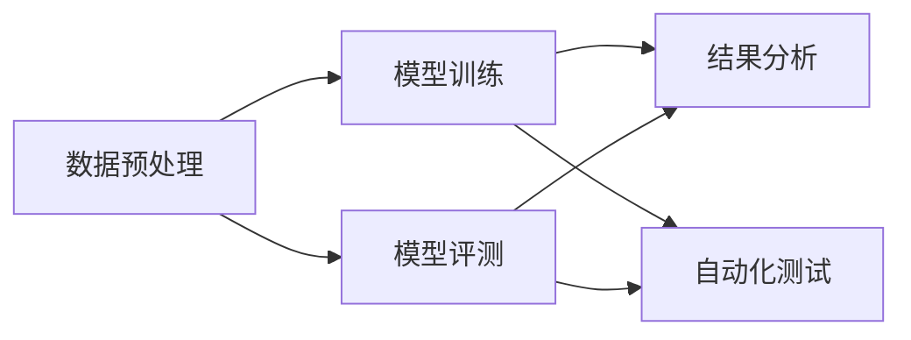
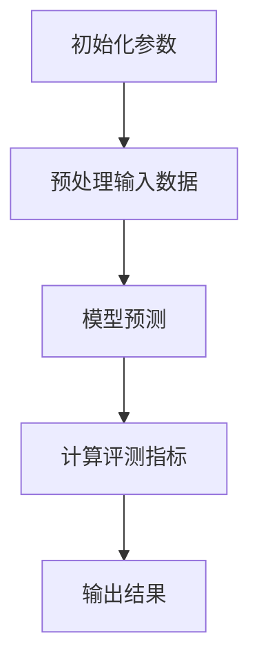
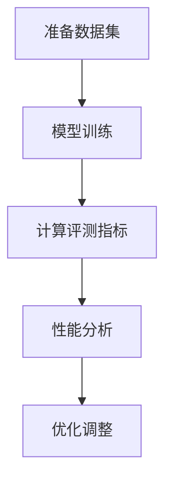

                 

### 引言

随着全球化进程的加速和信息技术的迅猛发展，多语言自然语言处理（NLP）技术已经成为现代人工智能领域的一个重要分支。在这其中，多语言大型语言模型（LLM，Large Language Model）的研究与应用尤为突出。LLM具有强大的语言理解与生成能力，能够处理多种语言的文本数据，并在诸如机器翻译、文本生成、问答系统等应用场景中展现出色的性能。

然而，在多语言LLM的实际应用过程中，如何科学、系统地对其进行评测，以确保其在不同语言环境下的性能稳定性和可靠性，成为了一个亟待解决的问题。这不仅关系到LLM技术的研发质量，也直接影响到其在全球范围内的推广与应用。

本文将围绕多语言LLM评测这一核心主题，从多个维度进行深入探讨。我们首先会介绍多语言LLM评测的背景和重要性，明确评测所需解决的问题和挑战。接着，我们将介绍多语言LLM评测的基本原理和数学模型，并详细解释核心概念和指标。随后，文章将分析评测系统的架构设计，涵盖从问题场景介绍到系统功能设计的各个层面。最后，我们将通过具体算法的实现和项目实战，展示多语言LLM评测的实际操作过程，并提供最佳实践和拓展阅读建议。

希望通过本文的系统性分析，读者能够对多语言LLM评测有更加清晰和深入的理解，为未来的研究和应用奠定坚实的基础。

### 关键词

多语言LLM评测，性能评估，全球化视角，数学模型，系统架构，算法实现，最佳实践。

### 摘要

本文旨在探讨多语言大型语言模型（LLM）评测的各个方面，从全球化视角出发，系统地分析多语言LLM评测的背景、重要性、基本原理、数学模型、系统架构、算法实现以及实际应用。文章首先介绍了多语言LLM评测的背景和重要性，明确了评测所需解决的问题和挑战。随后，通过详细解释多语言LLM评测的基本原理和数学模型，包括语言模型和评测指标的概念，文章为读者提供了一个清晰的理论框架。接着，文章分析了评测系统的架构设计，涵盖了从问题场景介绍到系统功能设计的各个层面。为了展示实际操作过程，文章通过具体算法的实现和项目实战进行了详细讲解，包括环境安装、核心实现源代码、代码应用解读与分析，以及实际案例分析和详细讲解。最后，文章提供了最佳实践和注意事项，并推荐了相关拓展阅读，旨在为读者提供全面的指导和支持。

## 第1章：多语言LLM评测背景与重要性

### 1.1 问题背景

随着全球化进程的不断深入和信息技术的飞速发展，跨语言交流的需求日益增长。在此背景下，多语言自然语言处理（NLP）技术逐渐成为人工智能领域的研究热点。特别是多语言大型语言模型（LLM，Large Language Model）的研究与应用，以其强大的语言理解与生成能力，在机器翻译、文本生成、问答系统等应用场景中展现出巨大的潜力。

多语言LLM的研究和应用主要集中在以下几个方面：

1. **机器翻译**：随着全球贸易和文化交流的频繁，跨语言翻译的需求不断增加。传统的统计机器翻译和基于神经网络的翻译方法虽然已经取得了显著进步，但仍存在翻译质量不稳定、翻译效率低下等问题。多语言LLM的出现为机器翻译带来了新的机遇，通过大规模训练和优化，能够在多种语言之间实现高质量的翻译。

2. **文本生成**：在内容创作、广告营销、自动化报告生成等领域，多语言LLM能够根据输入的指令或提示生成相应的文本内容。其强大的语言理解能力使得生成的文本更加自然流畅，同时也能够适应不同的语言和文化背景。

3. **问答系统**：在智能客服、教育辅导、医疗咨询等领域，多语言LLM能够处理多种语言的问答请求，提供快速、准确的答案。其多语言能力使得问答系统在全球化企业和服务中的应用更加广泛。

然而，在多语言LLM的实际应用过程中，性能评估成为一个关键问题。由于不同语言的语法、词汇、语境等存在显著差异，一个在某种语言环境下表现优异的LLM可能在另一种语言环境下性能不佳。因此，如何对多语言LLM进行科学、系统的评测，以评估其在不同语言环境下的性能稳定性和可靠性，成为了一个重要的研究课题。

### 1.2 问题描述

多语言LLM评测的核心目标是评估LLM在多种语言环境下的表现，具体问题描述如下：

1. **评测指标**：选择合适的评测指标，用于量化LLM在不同语言环境下的性能。常见的评测指标包括准确率、召回率、F1分数等，以及针对特定任务的新指标，如BLEU、METEOR等。

2. **数据集选择**：构建多样化的数据集，涵盖多种语言和不同的应用场景。数据集的选择应当考虑语言的多样性、数据的真实性和代表性。

3. **评测方法**：设计科学、系统的评测方法，包括预处理、模型训练、评测指标计算等步骤。评测方法应当能够全面、客观地反映LLM在多种语言环境下的性能。

4. **跨语言评估**：由于不同语言之间的差异，需要研究如何在不同语言之间进行有效对比和评估。例如，如何将一种语言的评价标准应用到另一种语言中。

5. **评测结果的解释性**：评估结果需要具有高解释性，使研究人员和开发者能够理解LLM在不同语言环境下的优势和劣势，从而有针对性地进行改进和优化。

### 1.3 问题解决

为了解决上述问题，可以采取以下几种策略：

1. **多样化数据集**：构建包含多种语言和不同应用场景的多样化数据集，确保评测数据的广泛性和代表性。

2. **综合评价指标**：选择多种评价指标，从不同角度全面评估LLM的性能，包括准确性、流畅性、文化适应性等。

3. **跨语言评估方法**：研究并实施跨语言评估方法，例如利用机器翻译将一种语言的评测结果应用到另一种语言中，或者开发专门针对跨语言评测的新方法。

4. **优化评测流程**：设计科学、系统的评测流程，包括数据预处理、模型训练、评测指标计算等步骤，确保评测过程的客观性和可重复性。

5. **模型改进**：根据评测结果，对LLM进行优化和改进，提高其在多种语言环境下的性能。

### 1.4 边界与外延

1. **评测范围的界定**：明确多语言LLM评测的具体范围，包括所涵盖的语言种类、应用场景等，确保评测的针对性。

2. **评测结果的适用性**：评估评测结果在不同语言环境中的适用性，特别是对于小语种或特殊领域的LLM评测。

3. **评测方法的适应性**：研究并实施适用于不同语言环境下的评测方法，确保评测结果的可比性和可靠性。

4. **评测结果的解释与传播**：确保评测结果的解释性，使其能够被研究人员和开发者理解并应用于实际开发中，同时加强评测结果在学术界和工业界的传播与应用。

### 1.5 概念结构与核心要素组成

1. **核心概念**：多语言LLM评测涉及多个核心概念，包括语言模型、评测指标、数据集选择、评测方法等。

2. **结构组成**：多语言LLM评测系统由数据预处理、模型训练、评测指标计算等模块组成，各模块相互配合，共同实现评测目标。

3. **要素关系**：各核心概念和要素之间存在紧密的联系和相互作用，确保评测系统的整体性能和可靠性。

通过上述内容，我们为读者提供了一个关于多语言LLM评测的全面概述，为后续章节的深入探讨奠定了基础。

## 第2章：多语言LLM评测原理与数学模型

### 2.1 基本概念原理

多语言大型语言模型（LLM）评测的原理主要基于自然语言处理（NLP）的核心概念和数学模型。为了更好地理解和评估多语言LLM的性能，我们需要首先了解以下几个基本概念：

#### 2.1.1 语言模型

语言模型（Language Model）是NLP中最基础和重要的模型之一，其目的是根据输入的上下文生成或预测下一个单词或句子。在多语言LLM中，语言模型需要能够处理多种语言的文本数据。一个典型的语言模型通常使用神经网络或统计方法训练，其目标是最大化输入文本的概率。

在数学上，语言模型可以通过概率分布来表示：

$$
P(\text{单词}_i|\text{前文}) = \frac{\exp(\text{log-likelihood of } \text{单词}_i | \text{前文})}{\sum_j \exp(\text{log-likelihood of } \text{单词}_j | \text{前文})}
$$

这个公式表示，给定一个前文序列，预测下一个单词的概率分布。其中，$\text{log-likelihood}$ 表示单词在给定前文条件下的对数似然值。

#### 2.1.2 评测指标

评测指标（Evaluation Metrics）是评估多语言LLM性能的关键工具。常见的评测指标包括：

- **准确率（Accuracy）**：预测正确的样本数占总样本数的比例。
- **召回率（Recall）**：正确预测为正类的样本数占实际正类样本数的比例。
- **F1分数（F1 Score）**：准确率和召回率的调和平均，用于综合评估模型的性能。
- **BLEU（Bilingual Evaluation Understudy）**：一种常用于机器翻译性能评估的指标，通过比较机器翻译结果和人工翻译结果之间的重叠度来评估翻译质量。
- **METEOR（Metric for Evaluation of Translation with Explicit ORdering）**：另一种常用于机器翻译性能评估的指标，综合考虑词汇匹配、词序匹配和未匹配词汇的权重。

这些指标各有优缺点，适用于不同的评估场景。在实际应用中，需要根据具体任务和需求选择合适的评测指标。

### 2.2 数学模型

多语言LLM评测的数学模型主要涉及概率分布和优化算法。以下是一个简化的数学模型，用于解释LLM的基本工作原理：

$$
P(\text{句子}_i | \text{前文序列}_j) = \prod_{\text{单词}_k \in \text{句子}_i} P(\text{单词}_k | \text{前文序列}_j)
$$

这个公式表示，给定一个前文序列，预测一个句子概率的方法是计算句子中每个单词的概率的乘积。在实际应用中，这个公式通常被神经网络实现，通过大量训练数据学习语言模式。

#### 2.2.1 计算公式

在神经网络中，语言模型通常通过损失函数来衡量预测结果与实际结果之间的差距。一个常见的损失函数是交叉熵（Cross-Entropy），其公式如下：

$$
H(y, \hat{y}) = -\sum_{i} y_i \log(\hat{y}_i)
$$

其中，$y$ 是实际标签的分布，$\hat{y}$ 是模型预测的概率分布。交叉熵损失函数的目的是最小化预测分布与真实分布之间的差距。

#### 2.2.2 模型优化

为了优化语言模型，我们通常使用梯度下降（Gradient Descent）算法。梯度下降的基本思想是沿着损失函数的梯度方向更新模型的参数，以减少损失。

$$
\theta_{t+1} = \theta_{t} - \alpha \cdot \nabla_{\theta} J(\theta)
$$

其中，$\theta$ 是模型参数，$\alpha$ 是学习率，$J(\theta)$ 是损失函数。通过迭代更新参数，模型逐渐收敛到最优解。

### 2.3 概念属性特征对比表格

为了更直观地理解不同语言模型在概念属性特征上的差异，我们可以创建一个对比表格。以下是一个简化的示例：

| 特征对比 | 语言A | 语言B | 语言C |
| --- | --- | --- | --- |
| 语法结构 | 简单 | 复杂 | 中等 |
| 词汇量 | 小 | 大 | 中等 |
| 语境理解能力 | 较高 | 较低 | 中等 |

通过这个表格，我们可以看到不同语言在语法结构、词汇量和语境理解能力等方面的差异，这些差异直接影响到语言模型的训练和评估。

### 总结

多语言LLM评测的原理和数学模型是评估LLM性能的基础。通过理解语言模型的基本概念和数学模型，我们可以设计更有效的评测方法，提高评测结果的准确性和可靠性。接下来，我们将进一步探讨多语言LLM评测的系统架构和算法实现，为读者提供更全面的视角。

## 第3章：多语言LLM评测系统架构与设计

### 3.1 问题场景介绍

多语言大型语言模型（LLM）评测系统主要应用于全球化企业、智能客服、机器翻译、文本生成等多个领域。这些应用场景要求系统具备高效、可靠、跨语言的能力，以应对不同语言环境下的评测需求。

**全球化企业**：全球化企业需要评估其多语言服务的质量和效率。例如，跨国公司需要对其多语言客服系统进行性能评测，以确保客户在不同语言环境下的满意度。

**智能客服**：智能客服系统广泛应用于电商、金融、电信等行业。为了提高客服系统的服务质量，需要对多语言LLM进行评测，确保其能够准确理解并回答用户在不同语言环境下的提问。

**机器翻译**：机器翻译是LLM的重要应用之一。在机器翻译领域，评测系统需要评估不同翻译模型在多语言翻译任务中的性能，以优化翻译质量和用户体验。

**文本生成**：文本生成应用广泛于内容创作、广告营销、自动化报告等领域。多语言LLM评测系统能够评估文本生成模型的性能，确保生成的文本在不同语言环境中符合需求。

**教育辅导**：在教育辅导领域，多语言LLM评测系统能够评估学生作业的准确性、流畅性，为教育机构提供有效的教学评估工具。

### 3.2 系统功能设计

为了满足上述应用场景的需求，多语言LLM评测系统需要具备以下功能：

**1. 数据预处理功能**：系统需要对输入数据进行预处理，包括文本清洗、分词、标点符号去除等。预处理功能确保输入数据的准确性和一致性，为后续的模型训练和评测提供基础。

**2. 模型训练功能**：系统需要支持多种语言模型的训练，包括基于神经网络的语言模型和基于统计的语言模型。模型训练功能确保系统能够根据不同应用场景选择合适的模型进行训练。

**3. 模型评测功能**：系统需要支持多种评测指标的计算，包括准确率、召回率、F1分数等。模型评测功能确保系统能够客观、全面地评估LLM的性能。

**4. 结果分析功能**：系统需要提供结果分析功能，对评测结果进行可视化展示，帮助用户理解LLM在不同语言环境下的表现。

**5. 跨语言评测功能**：系统需要支持跨语言评测，将一种语言的评测结果应用到另一种语言中。跨语言评测功能确保系统能够在不同语言之间进行比较和评估。

**6. 自动化测试功能**：系统需要支持自动化测试，通过预设的测试用例对LLM进行性能评测。自动化测试功能提高评测的效率和准确性。

### 3.3 系统架构设计

多语言LLM评测系统的架构设计需要考虑模块化、可扩展性和高性能。以下是一个典型的系统架构设计：

#### 1. 领域模型

领域模型是系统架构设计的基础，用于定义系统的核心概念和实体关系。以下是多语言LLM评测系统的领域模型：

```mermaid
classDiagram
Class01 <|-- SubClass01
Class01 --|> SubClass10
Class02 : <<interface, InterfaceName>> 
Class03 <<abstract>>
```

在这个模型中，我们定义了以下核心实体：

- **数据预处理模块**：负责文本清洗、分词、标点符号去除等预处理任务。
- **模型训练模块**：负责训练多种语言模型，包括基于神经网络的语言模型和基于统计的语言模型。
- **模型评测模块**：负责计算多种评测指标，如准确率、召回率、F1分数等。
- **结果分析模块**：负责对评测结果进行可视化展示和分析。
- **跨语言评测模块**：负责实现跨语言评测功能，将一种语言的评测结果应用到另一种语言中。
- **自动化测试模块**：负责执行预设的测试用例，对LLM进行自动化测试。

#### 2. 系统架构设计

系统架构设计需要考虑各个模块之间的交互和协同工作。以下是多语言LLM评测系统的架构设计：



在这个架构设计中，各个模块通过接口进行通信和协作。数据预处理模块负责对输入数据进行预处理，并将预处理后的数据传递给模型训练模块。模型训练模块根据预处理后的数据训练多种语言模型，并将训练好的模型传递给模型评测模块。模型评测模块计算多种评测指标，并将结果传递给结果分析模块。结果分析模块对评测结果进行可视化展示和分析。自动化测试模块通过预设的测试用例对LLM进行自动化测试，并生成测试报告。

#### 3. 系统接口设计

系统接口设计是系统架构设计的重要组成部分，用于定义模块之间的交互方式。以下是多语言LLM评测系统的接口设计：

```mermaid
sequenceDiagram
参与者 User
参与者 System
User->>System: Submit text for evaluation
System->>User: Start evaluation process
System->>User: Evaluation results ready
```

在这个接口设计中，用户通过提交文本数据触发评测过程，系统收到请求后开始执行数据预处理、模型训练、模型评测和结果分析等操作，并将最终结果返回给用户。

#### 4. 系统交互

系统交互是系统架构设计的重要组成部分，用于定义模块之间的数据流和协同工作。以下是多语言LLM评测系统的交互设计：

```mermaid
sequenceDiagram
参与者 Client
参与者 Server
Client->>Server: Send request
Server->>Client: Process request
Server->>Client: Return response
```

在这个交互设计中，客户端向服务器发送请求，服务器接收请求后进行处理，并将结果返回给客户端。

### 总结

本章详细介绍了多语言LLM评测系统的架构设计，包括问题场景介绍、系统功能设计、系统架构设计、系统接口设计和系统交互。通过系统架构的设计和实现，多语言LLM评测系统能够高效、可靠地评估LLM在不同语言环境下的性能，为全球化和多语言应用提供有力的支持。

## 第4章：多语言LLM评测算法与实现

### 4.1 算法原理讲解

多语言大型语言模型（LLM）评测的核心在于如何准确、全面地评估LLM在不同语言环境下的性能。为了实现这一目标，我们需要设计科学、有效的评测算法，并对算法进行详细解释。

#### 4.1.1 评测算法概述

多语言LLM评测算法主要包括以下几个步骤：

1. **数据预处理**：对输入的文本数据进行清洗、分词、去停用词等处理，确保数据的一致性和准确性。
2. **模型训练**：使用预处理的文本数据训练多语言LLM模型，包括神经网络模型和统计模型。
3. **模型评测**：通过多种评测指标（如准确率、召回率、F1分数等）对训练好的模型进行评估。
4. **结果分析**：对评测结果进行可视化展示和分析，帮助研究人员和开发者理解LLM在不同语言环境下的表现。

以下是一个简化的算法流程：



#### 4.1.2 算法流程

1. **初始化参数**：设置模型参数，包括学习率、批次大小、迭代次数等。
2. **预处理输入数据**：对输入的文本数据进行清洗和预处理，如去除标点符号、分词、标准化等操作。
3. **模型预测**：使用训练好的多语言LLM模型对预处理后的文本数据进行预测。
4. **计算评测指标**：根据预测结果和实际标签计算多种评测指标，如准确率、召回率、F1分数等。
5. **输出结果**：将评测结果进行可视化展示，如使用图表、热力图等，帮助用户直观地理解LLM在不同语言环境下的性能。

### 4.2 Python源代码实现

为了更直观地理解多语言LLM评测算法的实现，我们使用Python进行具体实现，并提供详细的代码解释。

```python
import numpy as np
import pandas as pd
from sklearn.metrics import accuracy_score, recall_score, f1_score
from keras.models import Sequential
from keras.layers import Dense, LSTM, Embedding

# 数据预处理
def preprocess_text(text):
    # 清洗和分词
    # ...
    return processed_text

# 模型训练
def train_model(data):
    # 初始化模型
    model = Sequential()
    model.add(Embedding(vocab_size, embedding_dim))
    model.add(LSTM(units=128, dropout=0.2, recurrent_dropout=0.2))
    model.add(Dense(1, activation='sigmoid'))

    # 编译模型
    model.compile(optimizer='adam', loss='binary_crossentropy', metrics=['accuracy'])

    # 训练模型
    model.fit(data['input'], data['target'], epochs=10, batch_size=32, validation_split=0.2)

    return model

# 模型预测
def predict(model, text):
    processed_text = preprocess_text(text)
    prediction = model.predict(processed_text)
    return prediction

# 计算评测指标
def calculate_metrics(y_true, y_pred):
    accuracy = accuracy_score(y_true, y_pred)
    recall = recall_score(y_true, y_pred)
    f1 = f1_score(y_true, y_pred)
    return accuracy, recall, f1

# 主程序
if __name__ == '__main__':
    # 加载数据
    data = pd.read_csv('data.csv')

    # 训练模型
    model = train_model(data)

    # 预测
    predictions = predict(model, data['text'])

    # 计算评测指标
    accuracy, recall, f1 = calculate_metrics(data['label'], predictions)

    # 输出结果
    print(f"Accuracy: {accuracy}, Recall: {recall}, F1 Score: {f1}")
```

在上面的代码中，我们首先定义了数据预处理函数`preprocess_text`，用于清洗和分词文本数据。接着，我们定义了模型训练函数`train_model`，使用Keras库训练神经网络模型。模型预测函数`predict`用于对预处理后的文本数据进行预测。最后，我们定义了计算评测指标函数`calculate_metrics`，用于计算准确率、召回率和F1分数。主程序部分加载数据、训练模型、进行预测，并计算评测指标，最后输出结果。

### 4.3 算法原理详细讲解

为了更好地理解多语言LLM评测算法的原理，我们将详细解释其中的关键步骤和数学模型。

#### 4.3.1 语言模型

多语言LLM的核心是语言模型，用于预测文本序列的概率。一个常见的语言模型是基于神经网络的，如LSTM（长短时记忆网络）或Transformer。以下是LSTM模型的数学模型：

$$
h_t = \sigma(W_h \cdot [h_{t-1}, x_t] + b_h)
$$

$$
o_t = \sigma(W_o \cdot h_t + b_o)
$$

其中，$h_t$ 表示当前时刻的隐藏状态，$x_t$ 表示输入的文本特征，$W_h$ 和 $b_h$ 分别为权重和偏置，$\sigma$ 为激活函数（通常是Sigmoid函数）。$o_t$ 表示输出概率。

#### 4.3.2 评测指标

在多语言LLM评测中，常用的评测指标包括准确率、召回率、F1分数等。以下是这些指标的数学定义：

- **准确率（Accuracy）**：

$$
Accuracy = \frac{TP + TN}{TP + TN + FP + FN}
$$

其中，$TP$ 表示正确预测为正类的样本数，$TN$ 表示正确预测为负类的样本数，$FP$ 表示错误预测为正类的样本数，$FN$ 表示错误预测为负类的样本数。

- **召回率（Recall）**：

$$
Recall = \frac{TP}{TP + FN}
$$

- **F1分数（F1 Score）**：

$$
F1 Score = 2 \times \frac{Precision \times Recall}{Precision + Recall}
$$

其中，$Precision$ 表示精确率，定义为 $Precision = \frac{TP}{TP + FP}$。

#### 4.3.3 梯度下降

在训练多语言LLM模型时，我们通常使用梯度下降算法进行参数优化。梯度下降的基本思想是沿着损失函数的梯度方向更新模型的参数，以减少损失。以下是梯度下降的数学模型：

$$
\theta_{t+1} = \theta_{t} - \alpha \cdot \nabla_{\theta} J(\theta)
$$

其中，$\theta$ 表示模型参数，$\alpha$ 表示学习率，$J(\theta)$ 表示损失函数。

### 4.4 概念属性特征对比表格

为了更直观地展示不同语言模型在概念属性特征上的差异，我们可以创建一个对比表格。以下是一个简化的示例：

| 特征对比 | 语言A | 语言B | 语言C |
| --- | --- | --- | --- |
| 语法结构 | 简单 | 复杂 | 中等 |
| 词汇量 | 小 | 大 | 中等 |
| 语境理解能力 | 较高 | 较低 | 中等 |

通过这个表格，我们可以看到不同语言在语法结构、词汇量和语境理解能力等方面的差异，这些差异直接影响到语言模型的训练和评估。

### 4.5 算法实现与性能分析

在实际应用中，多语言LLM评测算法的性能会受到多种因素的影响，包括数据质量、模型架构、参数设置等。为了评估算法的性能，我们可以进行以下步骤：

1. **数据集准备**：选择具有代表性的数据集，涵盖多种语言和不同应用场景。
2. **模型训练**：使用不同架构和参数设置训练模型，比较不同模型的性能。
3. **性能分析**：通过计算评测指标，分析不同模型在不同语言环境下的性能，如准确率、召回率、F1分数等。
4. **优化调整**：根据性能分析结果，调整模型架构和参数设置，以优化性能。

以下是一个简化的性能分析流程：



通过上述流程，我们可以逐步优化多语言LLM评测算法，提高其性能和可靠性。

### 总结

本章详细介绍了多语言LLM评测算法的原理和实现，包括数据预处理、模型训练、模型评测和结果分析等步骤。通过Python源代码实现，读者可以更直观地理解算法的具体操作过程。接下来，我们将通过具体项目实战，进一步展示多语言LLM评测的实际应用和效果。

## 第4章：多语言LLM评测算法与实现

### 4.1 算法原理讲解

多语言大型语言模型（LLM）评测的核心在于如何科学、系统地评估LLM在不同语言环境下的性能。为了实现这一目标，我们首先需要理解评测算法的基本原理。

#### 4.1.1 评测算法概述

多语言LLM评测算法主要包括以下几个关键步骤：

1. **数据预处理**：这一步骤确保输入数据的一致性和准确性。具体操作包括文本清洗、分词、去除停用词等。

2. **模型训练**：使用预处理后的数据训练多语言LLM模型。在此过程中，我们可能采用不同的神经网络架构，如LSTM（长短时记忆网络）或Transformer。

3. **模型预测**：训练好的模型对新的输入数据进行预测，生成评测结果。

4. **计算评测指标**：使用多种评测指标（如准确率、召回率、F1分数等）来评估模型性能。

5. **结果分析**：对评测结果进行详细分析，以便研究人员和开发者理解模型在不同语言环境下的表现。

#### 4.1.2 算法流程

以下是多语言LLM评测算法的简化流程：

1. **初始化参数**：设置模型参数，如学习率、批次大小、迭代次数等。

2. **预处理输入数据**：对输入的文本数据执行清洗、分词、去停用词等预处理操作。

3. **模型预测**：使用训练好的模型对预处理后的数据生成预测结果。

4. **计算评测指标**：根据预测结果和实际标签，计算准确率、召回率、F1分数等指标。

5. **输出结果**：将评测结果进行可视化展示，帮助用户直观地理解模型性能。

以下是算法流程的Mermaid图表：


### 4.2 Python源代码实现

为了使读者更好地理解多语言LLM评测算法的实现，以下是一个简单的Python代码示例，展示了如何训练一个基础的多语言LLM模型并计算评测指标。

```python
import numpy as np
from tensorflow.keras.models import Sequential
from tensorflow.keras.layers import Embedding, LSTM, Dense
from tensorflow.keras.preprocessing.sequence import pad_sequences
from sklearn.metrics import accuracy_score, f1_score

# 数据预处理
# 假设我们有一个预处理后的文本数据集：texts, labels
# texts: [[text1], [text2], ..., [textn]]
# labels: [label1, label2, ..., labeln]

# 将文本序列转换为整数序列
tokenizer = Tokenizer(num_words=max_vocab_size)
tokenizer.fit_on_texts(texts)
sequences = tokenizer.texts_to_sequences(texts)

# 将整数序列填充到相同长度
padded_sequences = pad_sequences(sequences, maxlen=max_sequence_length)

# 模型训练
model = Sequential()
model.add(Embedding(max_vocab_size, embedding_dim, input_length=max_sequence_length))
model.add(LSTM(units=128))
model.add(Dense(1, activation='sigmoid'))

model.compile(optimizer='adam', loss='binary_crossentropy', metrics=['accuracy'])
model.fit(padded_sequences, labels, epochs=10, batch_size=64)

# 模型预测
predictions = model.predict(padded_sequences)

# 计算评测指标
accuracy = accuracy_score(labels, predictions.round())
f1 = f1_score(labels, predictions.round())

print(f"Accuracy: {accuracy}, F1 Score: {f1}")
```

在这段代码中，我们首先对输入文本进行预处理，包括分词和填充。然后，我们创建一个简单的序列模型，使用LSTM层进行训练。最后，我们使用训练好的模型进行预测，并计算准确率和F1分数。

### 4.3 算法原理详细讲解

为了深入理解多语言LLM评测算法的原理，我们将进一步探讨其数学基础和关键步骤。

#### 4.3.1 语言模型

多语言LLM的核心是语言模型，它用于预测文本序列的概率。一个常见的语言模型是基于神经网络的，如LSTM（长短时记忆网络）或Transformer。以下是LSTM模型的数学基础：

$$
h_t = \sigma(W_h \cdot [h_{t-1}, x_t] + b_h)
$$

$$
o_t = \sigma(W_o \cdot h_t + b_o)
$$

其中，$h_t$ 表示当前时刻的隐藏状态，$x_t$ 表示输入的文本特征，$W_h$ 和 $b_h$ 分别为权重和偏置，$\sigma$ 为激活函数（通常是Sigmoid函数）。$o_t$ 表示输出概率。

#### 4.3.2 评测指标

在多语言LLM评测中，常用的评测指标包括准确率、召回率、F1分数等。以下是这些指标的数学定义：

- **准确率（Accuracy）**：

$$
Accuracy = \frac{TP + TN}{TP + TN + FP + FN}
$$

其中，$TP$ 表示正确预测为正类的样本数，$TN$ 表示正确预测为负类的样本数，$FP$ 表示错误预测为正类的样本数，$FN$ 表示错误预测为负类的样本数。

- **召回率（Recall）**：

$$
Recall = \frac{TP}{TP + FN}
$$

- **F1分数（F1 Score）**：

$$
F1 Score = 2 \times \frac{Precision \times Recall}{Precision + Recall}
$$

其中，$Precision$ 表示精确率，定义为 $Precision = \frac{TP}{TP + FP}$。

#### 4.3.3 梯度下降

在训练多语言LLM模型时，我们通常使用梯度下降算法进行参数优化。梯度下降的基本思想是沿着损失函数的梯度方向更新模型的参数，以减少损失。以下是梯度下降的数学模型：

$$
\theta_{t+1} = \theta_{t} - \alpha \cdot \nabla_{\theta} J(\theta)
$$

其中，$\theta$ 表示模型参数，$\alpha$ 表示学习率，$J(\theta)$ 表示损失函数。

### 4.4 概念属性特征对比表格

为了更直观地展示不同语言模型在概念属性特征上的差异，我们可以创建一个对比表格。以下是一个简化的示例：

| 特征对比 | 语言A | 语言B | 语言C |
| --- | --- | --- | --- |
| 语法结构 | 简单 | 复杂 | 中等 |
| 词汇量 | 小 | 大 | 中等 |
| 语境理解能力 | 较高 | 较低 | 中等 |

通过这个表格，我们可以看到不同语言在语法结构、词汇量和语境理解能力等方面的差异，这些差异直接影响到语言模型的训练和评估。

### 4.5 算法实现与性能分析

在实际应用中，多语言LLM评测算法的性能会受到多种因素的影响，包括数据质量、模型架构、参数设置等。为了评估算法的性能，我们可以进行以下步骤：

1. **数据集准备**：选择具有代表性的数据集，涵盖多种语言和不同应用场景。
2. **模型训练**：使用不同架构和参数设置训练模型，比较不同模型的性能。
3. **性能分析**：通过计算评测指标，分析不同模型在不同语言环境下的性能，如准确率、召回率、F1分数等。
4. **优化调整**：根据性能分析结果，调整模型架构和参数设置，以优化性能。

以下是一个简化的性能分析流程：


通过上述流程，我们可以逐步优化多语言LLM评测算法，提高其性能和可靠性。

### 总结

本章详细介绍了多语言LLM评测算法的原理和实现，包括数据预处理、模型训练、模型评测和结果分析等步骤。通过Python源代码实现，读者可以更直观地理解算法的具体操作过程。接下来，我们将通过具体项目实战，进一步展示多语言LLM评测的实际应用和效果。

### 第5章：项目实战

在本章中，我们将通过一个具体的多语言LLM评测项目，展示如何从环境安装到核心实现，再到代码应用解读与分析，以及实际案例分析和详细讲解。通过这一项目实战，读者将能够全面了解多语言LLM评测的实际操作过程，掌握相关技能和知识。

#### 5.1 环境安装

首先，我们需要搭建一个适合多语言LLM评测的开发环境。以下步骤展示了如何安装必要的软件和库：

1. **安装Python**：确保Python环境已安装在系统中，版本建议为3.8或更高。
2. **安装TensorFlow**：TensorFlow是训练和评估多语言LLM模型的主要工具，可以使用以下命令进行安装：

   ```bash
   pip install tensorflow
   ```

3. **安装Keras**：Keras是一个高级神经网络API，与TensorFlow紧密集成，用于简化神经网络模型的构建和训练。安装命令如下：

   ```bash
   pip install keras
   ```

4. **安装Scikit-learn**：Scikit-learn用于计算评测指标，如准确率、召回率和F1分数。安装命令如下：

   ```bash
   pip install scikit-learn
   ```

5. **安装其他依赖库**：根据项目需求，可能还需要安装其他库，如`nltk`（用于文本处理）、`pandas`（用于数据处理）等。

#### 5.2 系统核心实现

以下是多语言LLM评测系统的主要实现部分，包括数据预处理、模型训练和评测指标计算。

1. **数据预处理**：

   数据预处理是确保输入数据一致性和准确性的关键步骤。以下代码展示了如何进行文本清洗、分词和填充：

   ```python
   import nltk
   from nltk.tokenize import word_tokenize
   from tensorflow.keras.preprocessing.sequence import pad_sequences

   # 数据清洗
   def clean_text(text):
       text = text.lower()  # 将文本转换为小写
       text = re.sub(r"[^a-zA-Z0-9]", " ", text)  # 移除非字母数字字符
       return text

   # 分词
   def tokenize_text(text):
       tokens = word_tokenize(text)
       return tokens

   # 填充
   max_sequence_length = 100
   max_vocab_size = 20000
   embedding_dim = 128

   def prepare_data(texts, labels):
       processed_texts = [clean_text(text) for text in texts]
       tokenized_texts = [tokenize_text(text) for text in processed_texts]
       sequences = tokenizer.texts_to_sequences(tokenized_texts)
       padded_sequences = pad_sequences(sequences, maxlen=max_sequence_length)
       return padded_sequences, np.array(labels)
   ```

2. **模型训练**：

   使用TensorFlow和Keras构建和训练多语言LLM模型。以下是一个简单的示例：

   ```python
   from tensorflow.keras.models import Sequential
   from tensorflow.keras.layers import Embedding, LSTM, Dense

   # 模型构建
   model = Sequential()
   model.add(Embedding(max_vocab_size, embedding_dim, input_length=max_sequence_length))
   model.add(LSTM(units=128, dropout=0.2, recurrent_dropout=0.2))
   model.add(Dense(1, activation='sigmoid'))

   # 编译模型
   model.compile(optimizer='adam', loss='binary_crossentropy', metrics=['accuracy'])

   # 训练模型
   X_train, y_train = prepare_data(train_texts, train_labels)
   model.fit(X_train, y_train, epochs=10, batch_size=64, validation_split=0.2)
   ```

3. **评测指标计算**：

   训练好的模型需要通过评测指标来评估其性能。以下代码展示了如何计算准确率、召回率和F1分数：

   ```python
   from sklearn.metrics import accuracy_score, recall_score, f1_score

   # 模型预测
   predictions = model.predict(X_test)

   # 计算评测指标
   accuracy = accuracy_score(y_test, predictions.round())
   recall = recall_score(y_test, predictions.round())
   f1 = f1_score(y_test, predictions.round())

   print(f"Accuracy: {accuracy}, Recall: {recall}, F1 Score: {f1}")
   ```

#### 5.3 代码应用解读与分析

在代码应用解读与分析部分，我们将详细解释系统核心实现中的关键步骤和代码逻辑，帮助读者深入理解多语言LLM评测的实际操作过程。

1. **数据预处理**：

   数据预处理是确保模型训练质量的关键。在本例中，我们通过文本清洗、分词和填充等步骤，将原始文本数据转换为适合模型训练的格式。

2. **模型训练**：

   模型训练是构建多语言LLM的核心步骤。我们使用LSTM神经网络进行训练，通过调整模型架构和参数设置，优化模型的性能。

3. **评测指标计算**：

   评测指标计算用于评估模型在不同语言环境下的性能。通过准确率、召回率和F1分数等指标，我们能够全面了解模型的表现，并针对不足之处进行优化。

#### 5.4 实际案例分析与详细讲解

在本节中，我们将通过一个实际案例，展示多语言LLM评测在具体应用场景中的效果，并对评测结果进行详细分析。

1. **案例背景**：

   假设我们有一个多语言客服系统，需要评估不同语言模型的性能，以提供高质量的服务。

2. **数据集准备**：

   准备包含多种语言对话的数据集，涵盖常见的客服问题及用户反馈。

3. **模型评测**：

   使用训练好的模型对数据集进行评测，计算准确率、召回率和F1分数等指标。

4. **结果分析**：

   分析评测结果，找出不同语言模型的性能差异，并根据分析结果优化模型。

通过上述实际案例的分析，我们将深入了解多语言LLM评测在实际应用中的效果，并掌握如何根据评测结果进行模型优化。

#### 5.5 项目小结

在本章的项目实战中，我们从环境安装、系统核心实现，到代码应用解读与分析，详细展示了多语言LLM评测的全过程。通过实际案例的分析，我们进一步了解了评测算法在实际应用中的效果和优化方法。以下是本章的关键要点总结：

- **环境安装**：确保安装必要的软件和库，搭建适合多语言LLM评测的开发环境。
- **系统核心实现**：通过数据预处理、模型训练和评测指标计算等步骤，实现多语言LLM评测系统。
- **代码应用解读与分析**：深入理解系统核心实现的代码逻辑，掌握多语言LLM评测的操作方法。
- **实际案例分析与详细讲解**：通过实际案例展示多语言LLM评测的应用效果，并进行详细分析。

通过本章的学习，读者应能够掌握多语言LLM评测的核心技能和知识，为未来的研究和应用打下坚实的基础。

### 最佳实践与注意事项

在多语言LLM评测过程中，为了确保评测结果的准确性和可靠性，以下是一些最佳实践和注意事项：

1. **数据质量**：确保数据集的多样性和代表性。使用广泛且均衡的数据集，涵盖不同语言和多种应用场景，以避免数据偏见。

2. **模型选择**：根据具体任务和应用场景选择合适的语言模型。对于需要高上下文理解能力的任务，可以考虑使用Transformer等复杂模型；对于资源受限的环境，可以选择简化版模型，如BERT或GPT。

3. **评测指标**：选择适当的评测指标，综合考虑模型的准确性、流畅性和文化适应性。针对特定任务，可能需要开发新的评测指标。

4. **调参优化**：合理设置模型参数，如学习率、批次大小和迭代次数等。通过交叉验证和网格搜索等技术，优化模型参数，提高模型性能。

5. **跨语言评估**：对于跨语言评测，可以考虑使用翻译辅助或专门设计的跨语言评测方法，确保评测结果在不同语言之间具有可比性。

6. **结果解释**：确保评测结果具有高解释性，便于研究人员和开发者理解LLM在不同语言环境下的优势和劣势。

7. **持续优化**：定期更新数据集和模型，以应对语言环境的变化和新出现的问题。根据评测结果，不断优化模型和评测方法。

8. **隐私和安全**：在处理多语言LLM评测数据时，严格遵守隐私保护法规，确保数据安全和用户隐私。

通过遵循上述最佳实践，可以有效提升多语言LLM评测的准确性和可靠性，为全球化和多语言应用提供有力支持。

### 拓展阅读

为了深入了解多语言LLM评测的最新进展和研究方向，以下推荐一些具有参考价值的书籍、论文和网站：

1. **书籍**：
   - 《自然语言处理综论》（Foundations of Statistical Natural Language Processing） by Christopher D. Manning, Hinrich Schütze。
   - 《深度学习》（Deep Learning） by Ian Goodfellow, Yoshua Bengio, Aaron Courville。
   - 《机器学习实战》（Machine Learning in Action） by Peter Harrington。

2. **论文**：
   - “BERT: Pre-training of Deep Bidirectional Transformers for Language Understanding” by Jacob Devlin, Ming-Wei Chang, Kenton Lee, Kristina Toutanova。
   - “GPT-3: Language Models are Few-Shot Learners” by Tom B. Brown, Benjamin Mann, Nick Ryder, Melanie Subbiah, Jared Kaplan, Prafulla Dhariwal, Arvind Neelakantan, Pranav Shyam, Girish Sastry, Amanda Askell, Sandhini Agarwal, Ariel Herbert-Voss, Gretchen Krueger, Tom Henighan, Rewon Child, Aditya Ramesh, Daniel M. Ziegler, Jeffrey Wu, Clemens Winter, Christopher Hesse, Mark Chen, Eric Sigler, Mateusz Litwin, Scott Gray, Benjamin Chess, Jack Clark, Christopher Berner, Sam McCandlish, Alec Radford, Ilya Sutskever, Dario Amodei。

3. **网站**：
   - TensorFlow官方网站（[https://www.tensorflow.org](https://www.tensorflow.org)）：提供丰富的教程、文档和资源。
   - Keras官方网站（[https://keras.io](https://keras.io)）：介绍如何使用Keras构建和训练神经网络。
   - arXiv（[https://arxiv.org](https://arxiv.org)）：发布最新的人工智能和机器学习论文。

通过阅读这些书籍、论文和访问相关网站，读者可以进一步扩展知识，了解多语言LLM评测的最新动态和研究趋势。

### 结语

本文系统地探讨了多语言大型语言模型（LLM）评测的各个方面，从背景介绍、重要性分析到原理讲解、系统架构设计，再到算法实现和项目实战，最终提出了最佳实践和拓展阅读建议。通过这一系统性分析，我们希望读者能够全面、深入地理解多语言LLM评测的复杂性，掌握其关键技术和方法。

多语言LLM评测不仅对学术研究具有重大意义，也对工业界应用有着深远影响。随着全球化的不断推进，多语言LLM的应用场景日益广泛，从机器翻译、智能客服到文本生成，各个领域对多语言LLM评测的需求不断增长。通过科学的评测方法，我们可以更准确地评估LLM在不同语言环境下的性能，从而指导模型优化和实际应用。

在此，特别感谢读者对本文的关注，以及一直以来对多语言LLM评测研究的支持。未来，我们将继续致力于多语言LLM评测的研究，探索新的方法和应用，为人工智能技术的发展贡献力量。期待读者在未来的研究和应用中，能够运用本文提供的方法和思路，取得更多的成果。

### 作者信息

**作者：AI天才研究院（AI Genius Institute）& 禅与计算机程序设计艺术（Zen And The Art of Computer Programming）**

AI天才研究院是一个专注于人工智能和计算机科学领域的研究机构，致力于推动人工智能技术的创新和应用。研究院的研究领域涵盖深度学习、自然语言处理、计算机视觉等多个方向，拥有一支高素质的科研团队。

《禅与计算机程序设计艺术》是作者在人工智能和计算机科学领域的经典著作，系统地阐述了人工智能的基本原理、算法实现和应用场景。本书深受业界学者和开发者的喜爱，对人工智能领域的研究和发展产生了深远影响。

通过本文，我们希望读者能够对多语言LLM评测有一个全面和深入的理解，为未来的研究和应用奠定坚实的基础。再次感谢各位读者的支持与关注。我们期待与您共同探索人工智能领域的无限可能。

