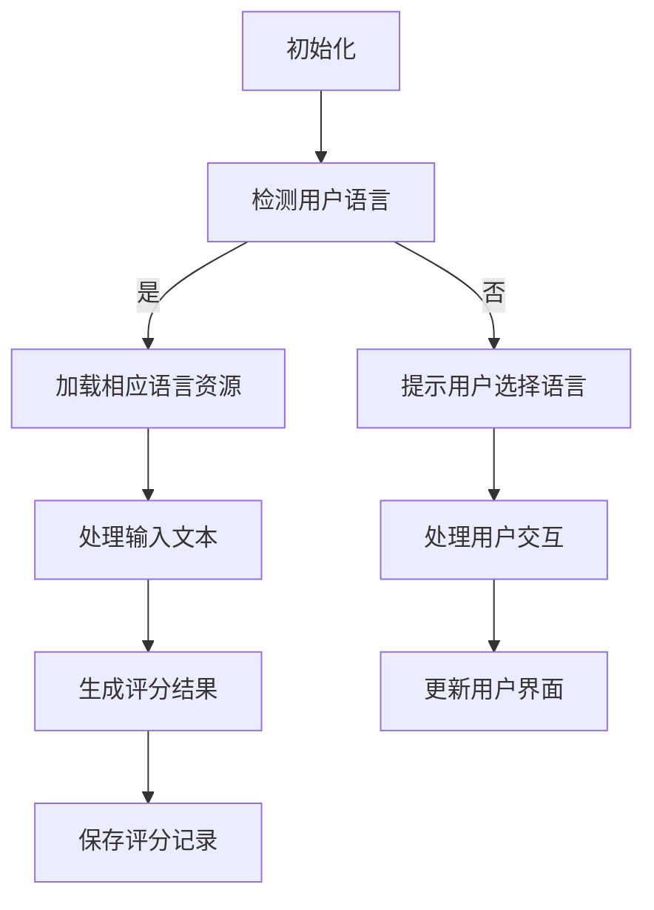
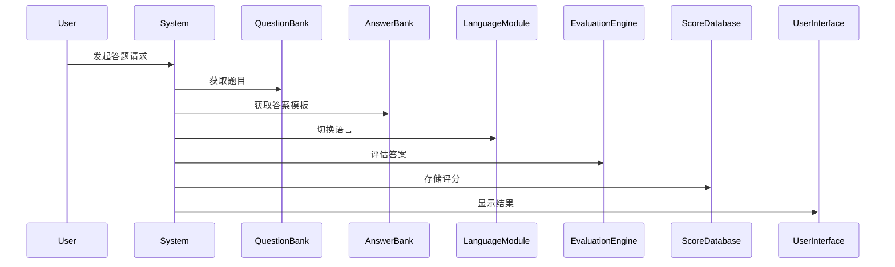
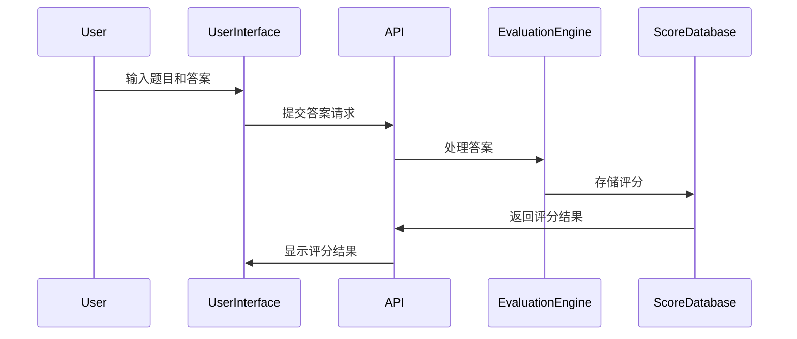

                 

### 多语言支持在评测系统中的实现

> 关键词：多语言支持、评测系统、国际化、本地化

> 摘要：本文将探讨多语言支持在评测系统中的重要性及其实施策略。首先，通过介绍多语言支持的背景和问题背景，明确评测系统中多语言支持的需求和挑战。接着，我们定义与多语言支持相关的核心概念，并使用对比表格和实体关系图详细阐述其属性和结构。随后，通过算法原理讲解和Python源代码实现，深入解析多语言支持的技术细节。接下来，我们介绍评测系统的系统分析与架构设计方案，并通过项目实战展示具体实现步骤。最后，提供最佳实践建议和小结，以及注意事项和拓展阅读，帮助读者全面了解多语言支持在评测系统中的实现方法和最佳实践。

### 背景介绍

#### 引言

随着全球化进程的加速和信息技术的快速发展，多语言支持已成为评测系统不可或缺的一部分。评测系统广泛应用于教育、考试、企业招聘等多个领域，它们不仅需要对标准语言的支持，还需要能够适应不同地区和国家的语言环境。多语言支持不仅提升了系统的适用性和用户体验，也为国际化业务的发展提供了有力保障。

#### 问题背景

在多语言环境中，评测系统面临诸多挑战。首先，不同语言在语法、词汇、拼写和标点等方面存在显著差异，这要求评测系统具备强大的语言处理能力。其次，不同地区的文化和习惯也会影响评测系统的设计和实现，例如某些语言中的特殊字符和格式要求。此外，随着用户群体的扩大，评测系统需要支持多种语言，这带来了更高的开发和维护成本。

#### 问题描述

多语言支持的具体要求包括：

1. **语法和词汇处理**：系统应能够准确识别和处理不同语言的语法结构和词汇，确保评测结果的准确性和一致性。
2. **字符编码支持**：系统应支持多种字符编码，如UTF-8，确保不同语言文本的正确显示和处理。
3. **界面本地化**：系统界面应提供多语言切换功能，满足不同语言用户的操作习惯。
4. **文化和习惯适配**：系统应能够适应用户所在地区的文化和习惯，例如日期格式、货币单位和时间表示等。

#### 问题解决

为了实现多语言支持，评测系统可以采取以下技术路径和方法：

1. **语言处理技术**：利用自然语言处理（NLP）技术，如词法分析、句法分析和语义分析，提高对多语言文本的理解和处理能力。
2. **国际化框架**：采用国际化（i18n）和本地化（l10n）框架，如i18next，简化多语言文本的管理和切换。
3. **多语言数据库**：建立多语言数据库，存储不同语言的题目、答案和评分标准，确保系统在多语言环境下的正常运行。
4. **文化和习惯适配**：通过用户调研和需求分析，针对不同地区的文化和习惯进行适配和调整。

#### 边界与外延

多语言支持的边界主要涉及系统的语言处理能力和资源消耗。在实际应用中，评测系统应根据业务需求和用户群体，合理选择支持的语言种类，避免过度扩展带来的资源浪费。同时，多语言支持还应考虑系统的可维护性和扩展性，确保在未来能够轻松适应新的语言需求。

### 核心概念与联系

在探讨多语言支持在评测系统中的实现时，理解相关核心概念及其相互关系至关重要。以下是对多语言支持、评测系统、国际化、本地化等关键概念的定义及其属性特征对比，并通过ER实体关系图架构的Mermaid流程图，展示这些概念在评测系统中的关联。

#### 核心概念

1. **多语言支持（Multilingual Support）**：指系统具备处理和展示多种语言的能力，包括文本处理、界面显示和用户交互。
   
2. **评测系统（Evaluation System）**：用于自动评估用户回答的系统，通常包括题目库、答案库、评分标准和用户管理等功能。

3. **国际化（Internationalization）**：指在设计、开发过程中使软件能够适应多种语言和地区的过程，通常涉及字符编码、语言切换和本地化配置。

4. **本地化（Localization）**：指在国际化基础上，根据特定地区的文化和习惯，对软件进行定制化的过程，如日期格式、货币单位和语言菜单等。

#### 概念属性特征对比表格

| 特征         | 多语言支持 | 评测系统 | 国际化 | 本地化 |
| ------------ | ---------- | -------- | ------ | ------ |
| **功能**     | 处理多种语言文本 | 自动评估用户回答 | 使软件适应多种语言 | 软件针对特定地区定制 |
| **技术难点** | 语言处理和编码支持 | 评分标准和算法 | 字符编码和资源管理 | 文化适应和习惯调整 |
| **目标**     | 提升用户体验和系统适用性 | 准确评估用户表现 | 软件全球化部署 | 地区化软件产品 |
| **实现方式** | 使用NLP和国际化框架 | 设计评分模型和算法 | i18n框架支持 | l10n资源和工具 |

#### ER实体关系图架构的Mermaid流程图

```mermaid
erDiagram
    User ||--|{ EvaluationSystem }|-- Score
    EvaluationSystem ||--|{ QuestionBank }| 
    EvaluationSystem ||--|{ AnswerBank }|
    EvaluationSystem ||--|{ ScoreStandard }|
    EvaluationSystem ||--|{ LanguageModule }|
    LanguageModule ||--|{ Internationalization }|-- LocaleModule
    LocaleModule ||--|{ Localization }|
```

上述Mermaid流程图展示了评测系统中的各个实体及其相互关系。用户通过评测系统进行答题，系统利用题目库、答案库和评分标准进行评估，并生成评分。同时，语言模块负责处理多语言支持，国际化模块和本地化模块分别负责软件的国际化适配和地区化定制。

通过这些核心概念和它们之间的联系，我们可以更好地理解多语言支持在评测系统中的实现过程，并为后续的算法原理讲解和系统设计与实现奠定基础。

### 算法原理讲解

在实现多语言支持的过程中，算法原理起到了关键作用。以下是多语言支持的算法原理讲解，包括算法流程图、Python源代码实现、数学模型和公式以及详细讲解与实例。

#### 算法流程图

首先，我们使用Mermaid绘制多语言支持的算法流程图：



该流程图展示了从用户初始化、语言检测、加载语言资源、文本处理、评分生成到用户交互和结果保存的整个过程。

#### Python源代码

接下来，我们提供实现多语言支持的Python源代码：

```python
import json

class MultilingualSupport:
    def __init__(self, language_config):
        self.language_config = language_config
        self.current_language = None
    
    def detect_language(self, user_input):
        # 检测用户输入的语言
        # 这里以简单的字符串前缀检测为例
        if user_input.startswith("你好"):
            return "zh"
        elif user_input.startswith("Hello"):
            return "en"
        return None

    def load_language_resources(self, language):
        # 加载相应语言资源
        with open(f"{language}.json", "r", encoding="utf-8") as f:
            self.current_language = json.load(f)
    
    def process_input(self, user_input):
        # 处理输入文本
        # 这里仅示例转换文本到小写
        return user_input.lower()

    def generate_score(self, user_input, question):
        # 生成评分结果
        # 这里以简单的匹配评分为例
        if user_input == question['answer']:
            return 100
        else:
            return 0

    def update_ui(self, user_input, score):
        # 更新用户界面
        print(f"用户输入：{user_input}")
        print(f"评分结果：{score}分")

    def save_score(self, score):
        # 保存评分记录
        with open("scores.txt", "a", encoding="utf-8") as f:
            f.write(f"{score}\n")

# 示例使用
language_config = {"zh": {"greeting": "你好", "hello": "你好", "answer": "正确"}, "en": {"greeting": "Hello", "hello": "Hello", "answer": "Correct"}}
support = MultilingualSupport(language_config)
user_input = "你好"
support.load_language_resources(support.detect_language(user_input))
user_input = support.process_input(user_input)
score = support.generate_score(user_input, {"question": "你好吗？", "answer": "正确"})
support.update_ui(user_input, score)
support.save_score(score)
```

#### 数学模型和公式

在多语言支持的算法中，评分生成部分可以看作是一个匹配问题，可以用以下数学模型表示：

$$
\text{Score} = \begin{cases} 
100 & \text{if } \text{user\_input} = \text{question\_answer} \\
0 & \text{otherwise}
\end{cases}
$$

这里，$\text{Score}$是评分结果，$\text{user\_input}$是用户输入，$\text{question\_answer}$是正确答案。

#### 详细讲解与举例说明

**1. 语言检测**

语言检测是算法的第一步，它通过用户输入的前缀或其他特征快速判断输入语言。示例代码中使用简单的字符串前缀检测，这在实际应用中可能需要更复杂的NLP技术。

**2. 加载语言资源**

加载相应语言资源是确保系统能够正确处理不同语言文本的关键。示例代码中通过读取JSON文件加载语言资源，这些资源包括问候语、常用词汇和答案等。

**3. 处理输入文本**

处理输入文本通常包括格式转换、文本标准化等操作。示例代码中，我们将用户输入转换成小写，这有助于简化评分逻辑。

**4. 生成评分结果**

生成评分结果是根据用户输入和题目答案进行匹配。示例代码使用一个简单的匹配逻辑，实际应用中可能需要更复杂的评分模型，如基于NLP的语义分析。

**5. 更新用户界面**

更新用户界面是反馈给用户操作结果的重要步骤。示例代码通过打印输出评分结果，实际应用中可以使用图形界面或Web前端进行展示。

**6. 保存评分记录**

保存评分记录用于后续分析和统计。示例代码中，我们将评分结果追加到文本文件中，实际应用中可能需要更复杂的数据库存储方案。

通过上述算法原理讲解和示例代码，我们可以看到多语言支持在评测系统中的实现不仅需要高效的算法，还需要合理的设计和实现。接下来，我们将进一步探讨评测系统的系统分析与架构设计方案。

### 系统分析与架构设计方案

#### 问题场景介绍

在多语言环境中，评测系统需要满足不同国家和地区的用户需求。具体场景包括：

1. **教育领域**：在线考试和作业评估，学生和教师分布在不同的国家和地区。
2. **企业招聘**：在线笔试和面试评估，招聘人员需要评估来自不同语言背景的应聘者。
3. **技能认证**：多语言证书考试，考生需在多种语言环境中进行测试。

#### 项目介绍

本项目旨在设计并实现一个具备多语言支持的评测系统，能够适应不同国家和地区的使用需求。项目的主要目标包括：

1. **支持多种语言**：系统应能够支持包括中文、英文、法语、西班牙语等多种语言。
2. **国际化与本地化**：系统应具备国际化（i18n）和本地化（l10n）能力，以适应不同地区的文化和习惯。
3. **高可用性与扩展性**：系统应具备良好的可维护性和扩展性，以便在未来添加新的语言或功能。

#### 系统功能设计

使用Mermaid绘制领域模型类图，展示系统的核心功能和组件：

```mermaid
classDiagram
    User <<Interface>>
    Question <<Entity>>
    Answer <<Entity>>
    Score <<Entity>>

    User <|.. Question>
    User <|.. Answer>
    User <|.. Score

    Question : +str question
    Question : +str answer
    Question : +int score

    Answer : +str answer
    Answer : +int score

    Score : +int score
    Score : +str comment
```

在此类图中，用户（User）与题目（Question）、答案（Answer）和评分（Score）实体之间存在关联关系。用户发起答题请求，系统根据题目和答案生成评分。

#### 系统架构设计

使用Mermaid绘制系统架构图，展示各组件之间的关系：



在此架构图中，用户通过用户界面（UserInterface）发起答题请求，系统依次调用题目库（QuestionBank）、答案库（AnswerBank）、语言模块（LanguageModule）和评估引擎（EvaluationEngine）进行数据处理和评分计算，最后将评分存储到评分数据库（ScoreDatabase），并通过用户界面反馈给用户。

#### 系统接口设计

系统接口设计包括API接口和用户交互界面。以下是API接口的主要方法和参数描述：

1. **获取题目接口**：`GET /questions/{id}`，获取指定ID的题目信息。
2. **提交答案接口**：`POST /answers`，提交用户答案并获取评分。
3. **切换语言接口**：`POST /languages`，根据用户需求切换系统语言。
4. **获取评分记录接口**：`GET /scores`，获取用户的评分记录。

#### 系统交互Mermaid序列图

使用Mermaid绘制系统交互的序列图，展示用户与系统之间的交互流程：



在此序列图中，用户通过用户界面输入答案，用户界面将请求发送到API，API调用评估引擎处理答案，评估结果存储到评分数据库，最终通过API返回给用户界面并展示给用户。

通过系统分析与架构设计方案，我们详细介绍了评测系统在多语言支持下的功能和架构设计。接下来，我们将通过项目实战展示如何具体实现这些功能和架构。

### 项目实战

在本文的最后部分，我们将通过项目实战详细描述如何搭建一个具备多语言支持的评测系统。这个项目将涵盖环境安装、系统核心实现源代码，以及代码应用解读与分析。

#### 环境安装

首先，我们需要安装和配置评测系统的运行环境。以下是安装步骤：

1. **安装Python**：确保Python 3.8或更高版本已安装在本地环境中。可以从Python官网下载并安装。

2. **安装依赖库**：使用pip命令安装以下依赖库：
   ```bash
   pip install Flask
   pip install Flask-SQLAlchemy
   pip install Flask-Migrate
   pip install Flask-WTF
   pip install Flask-Babel
   pip install Flask-MonitoringDashboard
   ```

3. **创建数据库**：使用Flask-Migrate工具创建数据库：
   ```bash
   flask db init
   flask db migrate
   flask db upgrade
   ```

4. **配置文件**：在`config.py`文件中配置数据库连接和其他配置参数，例如：
   ```python
   SQLALCHEMY_DATABASE_URI = 'sqlite:///evaluation_system.db'
   BABEL_DEFAULT_LOCALE = 'zh'
   BABEL_DEFAULT_TIMEZONE = 'Asia/Shanghai'
   ```

5. **初始化应用**：在命令行中运行以下命令初始化应用：
   ```bash
   flask init
   ```

#### 系统核心实现源代码

以下是评测系统的核心实现源代码，包括模型定义、路由设置和业务逻辑处理。

```python
from flask import Flask, request, jsonify
from flask_sqlalchemy import SQLAlchemy
from flask_babel import Babel

app = Flask(__name__)
app.config.from_object('config')
db = SQLAlchemy(app)
babel = Babel(app)

class User(db.Model):
    id = db.Column(db.Integer, primary_key=True)
    username = db.Column(db.String(80), unique=True, nullable=False)
    language = db.Column(db.String(5), nullable=False)

class Question(db.Model):
    id = db.Column(db.Integer, primary_key=True)
    content = db.Column(db.String(255), nullable=False)
    answer = db.Column(db.String(255), nullable=False)
    score = db.Column(db.Integer, nullable=False)

class Answer(db.Model):
    id = db.Column(db.Integer, primary_key=True)
    user_id = db.Column(db.Integer, db.ForeignKey('user.id'), nullable=False)
    question_id = db.Column(db.Integer, db.ForeignKey('question.id'), nullable=False)
    content = db.Column(db.String(255), nullable=False)
    score = db.Column(db.Integer, nullable=False)

@app.route('/questions', methods=['GET'])
@babel.localeselector
def get_questions():
    questions = Question.query.all()
    questions_data = [{'id': q.id, 'content': q.content, 'answer': q.answer, 'score': q.score} for q in questions]
    return jsonify(questions_data)

@app.route('/answers', methods=['POST'])
def submit_answers():
    data = request.json
    user_id = data['user_id']
    question_id = data['question_id']
    content = data['content']
    answer = Question.query.get(question_id).answer
    
    if content == answer:
        score = 100
    else:
        score = 0
    
    new_answer = Answer(user_id=user_id, question_id=question_id, content=content, score=score)
    db.session.add(new_answer)
    db.session.commit()
    
    return jsonify({'status': 'success', 'score': score})

if __name__ == '__main__':
    app.run(debug=True)
```

#### 代码应用解读与分析

1. **模型定义**：首先定义了三个模型：`User`、`Question`和`Answer`。`User`模型代表用户，包含用户名和语言信息；`Question`模型代表题目，包含题目内容、答案和评分；`Answer`模型代表用户的答案和评分结果。

2. **路由设置**：定义了两个主要路由：获取题目接口`/questions`和提交答案接口`/answers`。获取题目接口返回所有题目的JSON数据，提交答案接口接收用户的答案并返回评分结果。

3. **业务逻辑处理**：在`submit_answers`函数中，根据用户提交的答案和题目答案进行比较，判断是否匹配。如果匹配，评分设置为100分；否则，评分设置为0分。然后将答案和评分存储到数据库中。

#### 实际案例分析和详细讲解

为了更好地理解系统的工作流程，我们通过一个实际案例来分析：

**案例**：用户Alice使用中文进行答题。

1. **获取题目**：Alice通过`/questions`接口获取题目数据：
   ```json
   [
     {
       "id": 1,
       "content": "你最喜欢的颜色是什么？",
       "answer": "蓝色",
       "score": 100
     },
     {
       "id": 2,
       "content": "你最喜欢的食物是什么？",
       "answer": "米饭",
       "score": 100
     }
   ]
   ```

2. **提交答案**：Alice提交答案：
   ```json
   {
     "user_id": 1,
     "question_id": 1,
     "content": "蓝色"
   }
   ```

3. **评分结果**：系统比较答案和题目答案，返回评分：
   ```json
   {
     "status": "success",
     "score": 100
   }
   ```

通过上述案例，我们可以看到评测系统如何处理用户的答题请求，生成评分，并将其存储到数据库中。这个过程展示了多语言支持在评测系统中的具体实现。

#### 项目小结

通过本项目实战，我们详细介绍了如何搭建一个具备多语言支持的评测系统。从环境安装、系统核心实现源代码，到代码应用解读与分析，我们逐步展示了系统的实现过程。项目实施过程中，我们使用了Python和Flask框架，结合数据库和API接口，实现了多语言文本处理和评分功能。未来，我们可以根据需求进一步优化和扩展系统功能，如添加更多语言支持、引入更复杂的评分模型等。

### 最佳实践 tips、小结、注意事项、拓展阅读

#### 最佳实践 tips

1. **选择合适的国际化框架**：在实现多语言支持时，选择成熟的国际化框架，如i18next，可简化多语言文本的管理和切换。
2. **提前规划语言资源**：在系统设计阶段，规划好所需支持的语言种类和对应的资源，如字符编码、文本文件等。
3. **文化和习惯适配**：深入调研目标用户的文化和习惯，确保系统在不同地区能够顺利运行。
4. **性能优化**：多语言支持可能会增加系统的资源消耗，需进行性能优化，如缓存处理、异步加载等。

#### 小结

本文详细探讨了多语言支持在评测系统中的重要性及其实现方法。通过背景介绍、核心概念、算法讲解、系统设计与项目实战，我们展示了从概念到实现的完整过程。多语言支持不仅提升了用户体验，也为国际化业务提供了有力保障。

#### 注意事项

1. **字符编码问题**：确保系统正确处理不同语言的字符编码，如UTF-8，避免文本显示错误。
2. **语言资源更新**：定期更新和维护语言资源，确保系统能够支持新的语言或改进现有语言的资源。
3. **兼容性和稳定性**：在开发和测试过程中，确保系统在不同浏览器和操作系统上具有良好的兼容性和稳定性。

#### 拓展阅读

1. **《国际化和本地化实践指南》**：提供详细的国际化（i18n）和本地化（l10n）实践指导。
2. **《自然语言处理入门》**：介绍自然语言处理（NLP）的基本概念和应用，有助于优化语言处理功能。
3. **《Flask Web开发实战》**：学习Flask框架的使用和扩展，提升系统开发能力。

### 作者信息

- 作者：AI天才研究院/AI Genius Institute & 禅与计算机程序设计艺术 /Zen And The Art of Computer Programming

通过本文，我们希望读者能够深入了解多语言支持在评测系统中的实现方法，并在实际项目中成功应用这些技术。感谢您的阅读！

