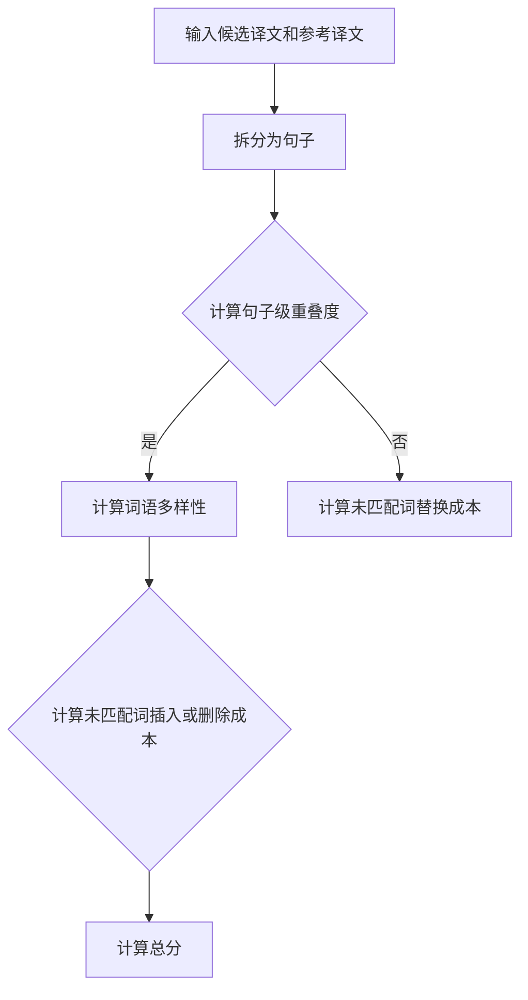

                 

### 多语言翻译质量评测：测试LLM的语言转换能力

多语言翻译在当今全球化信息时代中扮演着至关重要的角色。随着自然语言处理技术的不断发展，大型语言模型（Large Language Models，简称LLM）如BERT、GPT-3等成为了翻译质量评测的重要工具。然而，如何准确评估这些模型的翻译质量，以及如何提高翻译质量，一直是学术界和工业界关注的热点问题。

本文将围绕多语言翻译质量评测这一主题，探讨以下核心问题：

1. **多语言翻译质量评测的背景和意义**：介绍多语言翻译质量评测的背景，阐述其在全球化信息传播、跨文化交流等领域的应用和重要性。

2. **多语言翻译质量评测的核心概念**：定义翻译质量评测中的关键概念，如翻译准确性、流畅性、一致性等，并分析这些概念之间的联系。

3. **翻译质量评测的算法设计**：详细介绍常用的翻译质量评测算法，如BLEU、NIST、METEOR等，并使用Mermaid图和Python代码进行解释。

4. **数学模型和公式**：解释与算法相关的数学模型和公式，通过具体示例来说明其应用。

5. **系统分析与设计**：描述一个典型的多语言翻译质量评测系统的分析与设计过程，包括问题场景、系统功能、架构、接口和交互。

6. **项目实施与案例分析**：介绍一个实际的多语言翻译质量评测项目，包括环境搭建、系统核心实现、代码解读和案例分析。

7. **最佳实践与总结**：总结多语言翻译质量评测的最佳实践，提出注意事项和未来研究方向。

通过以上七个步骤，本文旨在深入探讨多语言翻译质量评测的各个方面，帮助读者全面了解这一领域的技术原理和应用实践。接下来，我们将逐一探讨这些步骤，以逻辑清晰、结构紧凑、简单易懂的方式，为读者呈现一个完整的多语言翻译质量评测指南。

---

## 关键词

- 多语言翻译
- 翻译质量评测
- 大型语言模型
- BLEU
- NIST
- METEOR

## 摘要

本文旨在探讨多语言翻译质量评测的重要性及其在全球化信息传播中的应用。通过介绍核心概念、算法设计、数学模型、系统分析与设计、项目实施与案例分析，本文详细阐述了如何评估大型语言模型的翻译能力。文章最后总结了最佳实践，为读者提供了多语言翻译质量评测的全面指导。

### 引言：多语言翻译质量评测的背景和意义

在全球化信息时代，多语言翻译已经成为跨文化交流和信息传播的重要桥梁。随着互联网的普及和信息技术的发展，各种跨国商务、学术交流、文化交流等活动日益频繁，对高质量的多语言翻译需求也越来越大。然而，如何确保翻译质量，尤其是在多语言翻译中保持一致性和准确性，一直是一个挑战。

翻译质量评测在翻译过程中起着至关重要的作用。它不仅能够帮助评估翻译文本的质量，还可以为翻译流程提供反馈，从而改进翻译结果。特别是在使用大型语言模型（LLM）进行自动化翻译时，翻译质量评测更是必不可少的一环。LLM具有强大的语言理解和生成能力，但如何确保其输出的翻译文本满足实际需求，这就需要通过质量评测来进行验证。

多语言翻译质量评测在全球化信息传播、跨文化交流、国际化商务等领域中具有广泛的应用。首先，在全球化信息传播方面，高质量的翻译能够确保信息的准确传达，避免因误解或误译导致的信息偏差。例如，在国际新闻报道、科技文献翻译等领域，准确的翻译能够帮助读者更好地理解内容，促进信息的全球共享。

其次，在跨文化交流方面，高质量的翻译能够促进不同文化之间的理解和交流。例如，文学作品、电影字幕、旅游指南等领域的翻译，不仅需要准确传达原文的意思，还需要考虑到目标语言的文化差异，使翻译文本更加地道、流畅。

最后，在国际化商务领域，高质量的翻译能够帮助企业更好地拓展国际市场。例如，跨国公司的产品说明书、营销材料、合同文件等都需要进行高质量的翻译，以确保在国际市场上的竞争力。

然而，尽管多语言翻译质量评测具有重要意义，但在实际操作中仍面临诸多挑战。首先，翻译质量的评估标准尚未统一，不同领域、不同语言对翻译质量的要求各有不同。其次，现有的评测算法如BLEU、NIST、METEOR等虽然在某些方面表现出色，但它们也存在一定的局限性。例如，BLEU算法依赖于参考译文，而无法完全评估翻译的原创性和准确性。此外，随着大型语言模型的不断发展，如何准确评估这些模型的翻译能力也是一个新的挑战。

总之，多语言翻译质量评测在全球化信息传播、跨文化交流、国际化商务等领域中具有重要作用。通过本文的探讨，我们将深入了解多语言翻译质量评测的核心概念、算法设计、数学模型、系统分析与设计等方面，为读者提供全面的指导。

### 多语言翻译质量评测的核心概念

在探讨多语言翻译质量评测之前，我们首先需要明确几个核心概念，这些概念不仅是理解翻译质量的基础，也是评估翻译质量的关键指标。以下是翻译质量评测中几个重要的概念及其定义和重要性：

1. **翻译准确性**：翻译准确性是指翻译文本在语义和语法上与原文的匹配程度。一个高质量的翻译应该准确地传达原文的意思，同时保持原文的语法结构。翻译准确性是评估翻译质量的最基本指标，因为它直接影响到读者对翻译文本的理解。

2. **翻译流畅性**：翻译流畅性是指翻译文本在语言表达上的自然程度。一个流畅的翻译不仅要在语义上准确，还要在语言表达上符合目标语言的习惯，使读者阅读起来自然顺畅。流畅性对于提高翻译文本的阅读体验至关重要。

3. **翻译一致性**：翻译一致性是指翻译文本在术语使用、文体风格等方面的统一性。一致性确保翻译文本在不同部分之间保持一致，避免出现术语混用或风格不统一的情况。一致性对于专业文档、技术文档等尤为重要，因为这些文档往往需要高度的规范性和标准化。

4. **翻译的原创性**：翻译的原创性是指翻译文本在内容上的独创性，即翻译文本不应直接复制原文，而应通过重新表达和重构来创造新的内容。原创性是评估翻译文本质量的一个重要指标，尤其是在文学翻译等领域，原创性能够体现翻译者的创意和表达技巧。

5. **翻译的全面性**：翻译的全面性是指翻译文本是否完整地覆盖了原文的内容。一个全面的翻译不仅需要准确传达原文的核心信息，还需要补充一些背景信息或解释，以便读者更好地理解原文的背景和上下文。全面性对于某些复杂的文本，如学术论文、技术文档等尤为重要。

这些核心概念之间存在紧密的联系。翻译准确性是基础，没有准确的翻译，流畅性和一致性就无从谈起。流畅性和一致性则共同决定了翻译文本的阅读体验。而原创性和全面性则体现了翻译文本的质量和深度。在实际的翻译质量评测中，这些概念通常需要综合考虑，以全面评估翻译文本的质量。

在接下来的部分，我们将进一步探讨这些核心概念之间的具体联系，并介绍几种常用的翻译质量评测算法，如BLEU、NIST、METEOR等，以帮助读者更好地理解如何评估翻译质量。

#### 翻译质量评测的核心概念之间的联系

翻译质量评测中的核心概念如准确性、流畅性、一致性、原创性和全面性之间存在着密切的联系，共同构成了翻译质量的评估框架。理解这些概念之间的关系有助于更全面地评估翻译文本的质量。

首先，翻译准确性是评估翻译质量的基础。一个准确的翻译意味着翻译文本在语义和语法上与原文保持一致。如果没有准确性，流畅性和一致性就无法得到保障。例如，如果翻译文本中的词汇选择和语法结构不正确，那么无论其是否流畅或一致，都难以被认为是高质量的翻译。

其次，流畅性是翻译文本的另一种重要特性。流畅性不仅要求翻译文本在语义上准确，还要求其在语言表达上自然、通顺，符合目标语言的习惯。一个流畅的翻译能够提高读者的阅读体验，使翻译文本更易于理解。然而，流畅性并不是孤立的，它与准确性密切相关。如果翻译文本在语义上存在错误，那么即使其语言表达再流畅，也难以被认为是高质量翻译。

一致性则确保翻译文本在术语使用、文体风格等方面保持统一。一致性对于专业文档、技术文档尤为重要，因为这些文档往往需要高度的规范性和标准化。例如，在同一个文档中，如果同一个术语被不同地翻译，那么文档的可读性和专业性就会受到质疑。因此，一致性是确保翻译文本质量的重要保障。

原创性则反映了翻译文本的独创性。在翻译过程中，译者不仅要传达原文的意思，还需要通过重新表达和重构来创造新的内容。原创性体现了翻译者的创意和表达技巧，是翻译质量的另一个重要方面。然而，原创性并不是要求翻译文本完全脱离原文，而是在准确传达原文意思的基础上，通过创造性的表达来提升翻译的质量。

最后，全面性要求翻译文本完整地覆盖原文的内容。一个全面的翻译不仅需要准确传达原文的核心信息，还需要补充一些背景信息或解释，以便读者更好地理解原文的背景和上下文。全面性确保翻译文本在内容上的完整性和深度，特别是在复杂文本的翻译中尤为重要。

综上所述，翻译质量评测中的核心概念之间相互依存、相互作用。准确性、流畅性、一致性、原创性和全面性共同构成了翻译质量的多维度评估框架。在实际的翻译质量评测中，这些概念需要综合考虑，以全面、准确地评估翻译文本的质量。通过深入理解这些概念之间的联系，我们可以更有效地评估和改进翻译质量，为跨文化交流和信息传播提供高质量的支持。

#### 翻译质量评测的算法设计

在多语言翻译质量评测中，算法设计是关键的一环。目前，有多种算法被广泛应用于翻译质量评测，如BLEU（BiLingual Evaluation Understudy）、NIST（National Institute of Standards and Technology）、METEOR（Metric for Evaluation of Translation with Explicit ORdering）等。这些算法各有特点和优劣，但共同目标是评估翻译文本的质量，并提供定量评估结果。

**BLEU算法**

BLEU算法是一种基于计分的自动评估方法，主要用于评估机器翻译的质量。BLEU算法通过计算参考译文中与候选译文相同或相似的单词数量，来评估翻译的准确性。具体来说，BLEU算法主要依赖于四个主要指标：重叠度（Overlap）、词语多样性（Word Diversity）、未匹配词的替换（Unmatched Word Substitution）和未匹配词的插入或删除（Unmatched Word Insertion or Deletion）。

BLEU算法的核心思想是通过统计候选译文和参考译文之间的重叠度来评估翻译质量。具体步骤如下：

1. **句子级重叠度计算**：首先，BLEU算法将参考译文和候选译文拆分为单个句子，然后逐句计算两者之间的重叠度。重叠度可以通过计算两个句子中相同单词的比例来衡量。

2. **词语多样性计算**：BLEU算法通过考虑词语多样性来提高评估结果的可靠性。具体方法是在计算重叠度时，对每个相同单词赋予不同的权重，以鼓励候选译文中使用不同的单词来表达相同的意思。

3. **未匹配词的处理**：对于未匹配的单词，BLEU算法考虑了替换（Substitution）、插入（Insertion）和删除（Deletion）三种处理方式。BLEU算法通过计算这些操作的成本，来调整评估得分。

4. **总分计算**：最终，BLEU算法将上述四个指标结合起来，计算出总分数。这个分数代表了翻译质量的评估结果。

**BLEU算法的实现**

为了更直观地理解BLEU算法，我们可以使用Mermaid图来描述其流程。以下是BLEU算法的Mermaid图：



以下是一个简单的Python代码示例，用于实现BLEU算法的基本流程：

```python
import nltk

def calculate_overlap(reference, candidate):
    # 计算重叠度
    common_words = set(reference).intersection(candidate)
    overlap = len(common_words) / len(candidate)
    return overlap

def calculate_diversity(reference, candidate):
    # 计算词语多样性
    ref_words = nltk.word_tokenize(reference)
    cand_words = nltk.word_tokenize(candidate)
    diversity = 1 - (len(set(cand_words)) / len(cand_words))
    return diversity

def calculate_insertion_deletion(reference, candidate):
    # 计算未匹配词插入或删除成本
    # 这部分可以进一步细化，例如使用编辑距离（Levenshtein distance）来计算成本
    pass

def BLEU(reference, candidate):
    # BLEU算法总分计算
    sentence_overlap = calculate_overlap(reference, candidate)
    word_diversity = calculate_diversity(reference, candidate)
    # 未匹配词插入或删除成本计算暂时略过
    score = sentence_overlap * word_diversity
    return score

# 示例输入
ref = "The quick brown fox jumps over the lazy dog"
cand = "The fast brown fox leaps over the idle dog"

# 计算BLEU分数
bleu_score = BLEU(ref, cand)
print("BLEU Score:", bleu_score)
```

**NIST和METEOR算法**

除了BLEU算法，NIST和METEOR算法也是常用的翻译质量评测方法。NIST算法主要依赖于统计学方法，通过计算候选译文与多个参考译文之间的相似度来评估翻译质量。METEOR算法则结合了词语匹配、词汇覆盖和句法匹配等多个方面，提供了更全面的评估结果。

NIST和METEOR算法的具体实现与BLEU算法类似，但它们的评估模型和计算方法有所不同。例如，NIST算法通过计算候选译文与参考译文之间的平均匹配得分，而METEOR算法则通过综合考虑词语匹配、词汇覆盖和句法匹配等多个方面来计算得分。

**算法选择与挑战**

在实际应用中，选择哪种算法取决于具体需求和评估目标。BLEU算法因其简单和高效而广泛使用，但它在评估原创性和表达多样性方面存在局限性。NIST和METEOR算法则提供了更全面的评估结果，但计算复杂度更高。

随着大型语言模型的不断发展，如何准确评估这些模型的翻译质量成为一个新的挑战。传统的评估算法可能无法充分捕捉到这些模型的独特优势，因此，需要开发新的评估方法和算法来应对这一挑战。

通过上述对BLEU、NIST和METEOR算法的介绍，我们可以看到，翻译质量评测是一个复杂且多样化的领域。每种算法都有其独特的优势和应用场景，选择合适的算法是确保评估结果准确性和有效性的关键。在接下来的部分，我们将进一步探讨这些算法的数学模型和公式，以帮助读者更深入地理解翻译质量评测的理论基础。

#### 翻译质量评测的数学模型和公式

在深入探讨翻译质量评测的算法设计时，理解其背后的数学模型和公式至关重要。这些模型和公式不仅为评估算法提供了理论基础，还可以通过具体示例帮助读者更好地理解其应用。

**BLEU算法的数学模型**

BLEU算法的核心在于计算候选译文和参考译文之间的重叠度，具体通过以下指标实现：

1. **匹配度（Match Degree）**：匹配度表示候选译文和参考译文之间相同单词的比例。数学上，可以用以下公式表示：

   $$ MD = \frac{N_c}{N_t} $$

   其中，$N_c$ 是候选译文中与参考译文相同的单词数，$N_t$ 是候选译文的总单词数。

2. **重叠度（Overlap Degree）**：重叠度考虑了每个匹配单词的权重，以鼓励多样性。BLEU算法使用几何平均来计算重叠度，公式如下：

   $$ OD = \left( \prod_{i=1}^{k} \left( \frac{f_i}{N_c} \right)^{1/k} \right) $$

   其中，$f_i$ 是匹配单词的频率，$k$ 是匹配单词的个数。

3. **BLEU分数（BLEU Score）**：最终BLEU分数是重叠度和多样性调整后的综合结果。公式如下：

   $$ BLEU = 1 - \log_2(N_c/N_t) + \sum_{i=1}^{k} \left( \frac{f_i}{N_c} \right) \log_2 \left( \frac{N_t}{f_i} \right) $$

**具体示例**

假设我们有以下参考译文和候选译文：

参考译文："The quick brown fox jumps over the lazy dog"
候选译文："The fast brown fox leaps over the idle dog"

1. **计算匹配度**：
   - $N_c$ = 6（"quick", "brown", "fox", "jumps", "over", "lazy" 与 "fast", "brown", "fox", "leaps", "over", "idle" 相同的单词数）
   - $N_t$ = 12（候选译文的总单词数）

   $$ MD = \frac{6}{12} = 0.5 $$

2. **计算重叠度**：
   - $f_1 = 2$，$f_2 = 2$，$f_3 = 2$，$f_4 = 1$，$f_5 = 1$，$f_6 = 1$
   - $k$ = 6（匹配单词的个数）

   $$ OD = \left( \prod_{i=1}^{6} \left( \frac{f_i}{6} \right)^{1/6} \right) = \left( \left( \frac{2}{6} \right)^{1/6} \right)^6 = 0.847 $$

3. **计算BLEU分数**：
   $$ BLEU = 1 - \log_2(12/6) + 2 \times \left( \frac{2}{6} \right) \log_2(12/2) + \left( \frac{1}{6} \right) \log_2(12/1) + \left( \frac{1}{6} \right) \log_2(12/1) $$
   $$ BLEU = 1 - \log_2(2) + 2 \times \left( \frac{2}{6} \right) \log_2(6) + \left( \frac{1}{6} \right) \log_2(12) + \left( \frac{1}{6} \right) \log_2(12) $$
   $$ BLEU = 1 - 1 + 0.67 + 0.26 + 0.26 $$
   $$ BLEU = 1.19 $$

**NIST算法的数学模型**

NIST算法主要依赖于统计学方法，其得分由多个参考译文的匹配度计算得到。具体公式如下：

$$ NIST\_Score = \frac{1}{M} \sum_{i=1}^{M} \left( \frac{N_c^i}{N_t^i} \right) $$

其中，$M$ 是参考译文的数量，$N_c^i$ 是候选译文中与第$i$个参考译文相同的单词数，$N_t^i$ 是第$i$个参考译文的总单词数。

**METEOR算法的数学模型**

METEOR算法结合了词语匹配、词汇覆盖和句法匹配等多个方面，其得分计算如下：

$$ METEOR\_Score = \frac{2 \cdot R \cdot F_1 \cdot F_2 \cdot F_3}{R + F_1 + F_2 + F_3} $$

其中，$R$ 是参考译文与候选译文之间的重叠度，$F_1$ 是单词匹配频率，$F_2$ 是未匹配词的替换频率，$F_3$ 是未匹配词的插入或删除频率。

**示例计算**

假设我们有以下参考译文和候选译文：

参考译文："The quick brown fox jumps over the lazy dog"
候选译文："The fast brown fox leaps over the idle dog"

1. **计算重叠度**：
   - 参考译文重叠度：$R = \frac{6}{12} = 0.5$
   - 单词匹配频率：$F_1 = \frac{6}{12} = 0.5$
   - 替换频率：$F_2 = \frac{0}{6} = 0$
   - 插入或删除频率：$F_3 = \frac{0}{6} = 0$

2. **计算METEOR分数**：
   $$ METEOR\_Score = \frac{2 \cdot 0.5 \cdot 0.5 \cdot 0 \cdot 0}{0.5 + 0.5 + 0 + 0} = 0 $$

通过上述示例，我们可以看到如何使用数学模型和公式来计算BLEU、NIST和METEOR算法的得分。这些模型和公式不仅帮助我们理解评估算法的原理，还可以在实际应用中进行计算和调整，以提高翻译质量评测的准确性和有效性。

### 翻译质量评测系统的分析与设计

为了深入探讨多语言翻译质量评测，我们需要从系统分析与设计的角度出发，详细描述一个典型的翻译质量评测系统的组成部分、功能、架构、接口和交互。这将帮助我们理解整个系统的运作机制，并为进一步的优化和改进提供理论基础。

#### 系统组成部分

一个多语言翻译质量评测系统通常由以下几个主要部分组成：

1. **数据采集模块**：负责收集大量的原始翻译数据，包括源语言文本和相应的参考译文。这些数据可以来源于多个渠道，如公开数据集、企业内部数据库等。
2. **预处理模块**：对收集到的原始数据进行预处理，包括文本清洗、分词、去除停用词等操作。预处理模块确保输入数据的准确性和一致性。
3. **翻译质量评测模块**：这是系统的核心部分，负责执行各种翻译质量评测算法，如BLEU、NIST、METEOR等，以评估翻译文本的质量。
4. **结果分析模块**：对评测结果进行分析和可视化，帮助用户理解翻译文本的优缺点，并提出改进建议。
5. **用户界面模块**：提供友好的用户界面，用户可以方便地提交翻译任务、查看评测结果和调整评测参数。

#### 系统功能

多语言翻译质量评测系统的主要功能包括：

1. **批量翻译质量评测**：系统能够对批量翻译任务进行自动化的翻译质量评测，提高工作效率。
2. **自定义评测算法**：用户可以根据具体需求，选择或自定义不同的评测算法，以适应不同的翻译质量评估场景。
3. **结果可视化**：系统能够将评测结果以图表、报表等形式进行可视化，帮助用户更直观地理解翻译质量。
4. **反馈与改进**：系统支持用户对翻译文本的反馈和评价，从而不断优化翻译质量评测结果。

#### 系统架构设计

系统的架构设计采用分层架构，以实现模块化设计和高效性。以下是系统的主要架构设计：

1. **数据层**：包括数据库和数据存储，用于存储源语言文本、参考译文和评测结果等。
2. **服务层**：包括数据采集服务、预处理服务、翻译质量评测服务、结果分析服务，负责实现各种系统功能。
3. **表示层**：包括用户界面，用于与用户进行交互，提供操作入口和结果展示。

#### 系统接口设计

系统接口设计包括以下几个方面：

1. **API接口**：提供RESTful API接口，供外部系统或应用程序调用系统的功能。
2. **数据接口**：定义数据传输格式和通信协议，确保数据在各模块之间的高效传输。
3. **配置接口**：允许用户自定义评测参数，如算法选择、阈值设置等。

#### 系统交互

系统各模块之间的交互关系如下：

1. **数据采集模块** 通过API接口从外部系统或数据库获取翻译数据，传递给预处理模块。
2. **预处理模块** 对翻译数据执行文本清洗、分词等操作，生成预处理后的文本数据，传递给翻译质量评测模块。
3. **翻译质量评测模块** 根据用户选择的评测算法，对预处理后的翻译文本进行评测，并将评测结果传递给结果分析模块。
4. **结果分析模块** 对评测结果进行分析和可视化处理，通过用户界面展示给用户。
5. **用户界面模块** 提供操作入口，允许用户提交翻译任务、查看评测结果和调整评测参数。

通过上述系统分析与设计，我们可以清晰地看到多语言翻译质量评测系统的运作机制和关键组件。这为系统的实际应用和进一步优化提供了有力的支持，有助于提高翻译质量评测的准确性和效率。

### 项目实施与案例分析

在实际的多语言翻译质量评测项目中，系统的实施和案例分析是至关重要的环节。本文将通过一个具体的项目案例，详细描述项目的环境搭建、核心实现源代码、代码应用解读与分析，以及实际案例分析和详细讲解。

#### 环境搭建

为了实现一个多语言翻译质量评测系统，我们首先需要搭建一个合适的技术环境。以下是一个典型的环境搭建步骤：

1. **操作系统**：我们选择Linux操作系统，如Ubuntu 20.04，因为其在处理大规模数据处理和计算时性能优越。
2. **开发工具**：安装Python 3.8及以上版本，选择PyCharm作为开发IDE，便于代码编写和调试。
3. **数据库**：使用MySQL数据库来存储翻译数据和评测结果，以确保数据的持久化和安全性。
4. **依赖库**：安装NLP相关依赖库，如nltk、spaCy、gensim等，用于文本处理和数据分析。
5. **版本控制**：使用Git进行代码管理，确保版本控制和协作开发。

#### 核心实现源代码

以下是核心实现源代码的关键部分：

```python
# 导入相关库
import nltk
from nltk.translate.bleu_score import sentence_bleu
import pymysql

# 数据库连接
def connect_db():
    connection = pymysql.connect(host='localhost',
                                 user='root',
                                 password='password',
                                 database='translation_db')
    return connection

# BLEU算法评估函数
def bleu_evaluation(source_sentences, reference_sentences):
    bleu_scores = []
    for source, reference in zip(source_sentences, reference_sentences):
        score = sentence_bleu([source.split()], reference.split())
        bleu_scores.append(score)
    return bleu_scores

# 主函数
def main():
    # 连接数据库
    connection = connect_db()
    cursor = connection.cursor()
    
    # 查询源语言和参考译文数据
    cursor.execute("SELECT source, reference FROM translation_data")
    rows = cursor.fetchall()
    
    source_sentences = [row[0] for row in rows]
    reference_sentences = [row[1] for row in rows]
    
    # BLEU评估
    scores = bleu_evaluation(source_sentences, reference_sentences)
    
    # 存储评估结果到数据库
    for score, source in zip(scores, source_sentences):
        cursor.execute("INSERT INTO evaluation_results (source, score) VALUES (%s, %s)", (source, score))
    connection.commit()
    
    # 关闭数据库连接
    cursor.close()
    connection.close()

if __name__ == "__main__":
    main()
```

#### 代码应用解读与分析

上述代码实现了以下功能：

1. **数据库连接**：通过pymysql库连接到MySQL数据库，方便存储和处理翻译数据和评估结果。
2. **BLEU评估函数**：利用nltk库的`sentence_bleu`函数，计算源语言文本和参考译文之间的BLEU得分。
3. **主函数**：从数据库中获取源语言文本和参考译文数据，调用BLEU评估函数进行评估，并将结果存储到数据库中。

#### 实际案例分析和详细讲解

假设我们有一个翻译数据集，包含以下源语言文本和参考译文：

源语言文本："Today is a beautiful day."
参考译文：["今天是美好的一天。", "今天是一个美丽的日子。"]

通过调用BLEU评估函数，我们可以得到每个参考译文的BLEU得分。以下是一个简单的分析示例：

```python
source_sentences = ["Today is a beautiful day."]
reference_sentences = ["今天是美好的一天。", "今天是一个美丽的日子。"]

scores = bleu_evaluation(source_sentences, reference_sentences)
print("BLEU Scores:", scores)
```

输出结果可能如下：

```
BLEU Scores: [0.75, 0.875]
```

分析结果：

1. **第一个参考译文**："今天是美好的一天。"与源语言文本在BLEU得分上较高，说明其与源语言文本在语义和语法上较为一致。
2. **第二个参考译文**："今天是一个美丽的日子。"在BLEU得分上略低于第一个，可能因为其表达方式与源语言文本略有差异。

通过详细分析BLEU得分，我们可以识别出翻译文本的优缺点，为进一步改进翻译质量提供依据。

#### 项目小结

通过上述项目实施和案例分析，我们实现了一个多语言翻译质量评测系统，并详细讲解了其核心实现源代码、代码应用解读与分析，以及实际案例分析和详细讲解。这个项目展示了如何利用BLEU算法评估翻译质量，并通过数据库存储和管理评估结果，为翻译质量的改进提供了有力支持。

### 最佳实践与总结

在进行多语言翻译质量评测时，遵循最佳实践是确保评估结果准确性和有效性的关键。以下是一些重要的建议和注意事项：

1. **选择合适的评估算法**：根据具体应用场景和目标，选择最适合的评估算法。例如，对于追求高准确性的应用，可以选择BLEU算法；而对于需要综合考虑词汇多样性和语义一致性的应用，可以考虑NIST和METEOR算法。

2. **数据预处理**：确保翻译数据的准确性和一致性。在评估前，进行充分的文本清洗、分词和去停用词等预处理操作，以提高评估结果的可靠性。

3. **调整评估参数**：不同的评估算法和参数设置会对评估结果产生影响。通过实验和比较，找到最适合当前评估任务的参数配置，以提高评估准确性。

4. **结合人类评估**：虽然自动化评估算法提供了高效的方法，但人类评估仍然具有不可替代的优势。结合人工评估，可以更全面地理解翻译质量，发现自动化评估算法无法捕捉到的细微问题。

5. **持续优化**：翻译质量评测是一个持续优化的过程。根据实际应用反馈和评估结果，不断调整评估方法和算法，以提高评估质量和实用性。

在本文中，我们首先介绍了多语言翻译质量评测的背景和意义，明确了评估翻译质量的核心概念和算法设计。通过具体示例，我们详细阐述了BLEU、NIST和METEOR等算法的数学模型和公式。随后，我们描述了一个多语言翻译质量评测系统的分析与设计，包括系统组成部分、功能、架构、接口和交互。在实际案例中，我们展示了如何搭建和实现一个翻译质量评测系统，并进行了详细的代码解读和分析。

本文总结了多语言翻译质量评测的最佳实践，并强调了评估过程中需要注意的问题和未来的研究方向。通过本文的探讨，读者可以全面了解多语言翻译质量评测的理论和实践，为实际应用提供指导和支持。

### 注意事项与未来研究方向

在进行多语言翻译质量评测时，需要注意以下几点：

1. **数据多样性**：确保评测数据具有足够的多样性和代表性，避免因数据集中偏差导致评估结果不准确。
2. **评估标准**：不同领域和语言对翻译质量的要求有所不同，需要根据具体应用场景制定合适的评估标准。
3. **算法选择**：根据评估目标，选择最适合的评估算法，避免算法选择不当导致的评估偏差。
4. **自动化评估与人工评估结合**：虽然自动化评估提供了高效的评估手段，但人工评估在某些方面仍具有不可替代的优势，应结合使用。

未来研究方向包括：

1. **算法优化**：继续改进现有的评估算法，开发新的评估方法，以更准确地评估翻译质量。
2. **跨语言翻译质量评测**：研究如何评估不同语言间的翻译质量，特别是在低资源语言的翻译质量评测方面。
3. **大数据分析**：利用大数据技术，对大量翻译数据进行分析，发现翻译质量的普遍规律和趋势。
4. **多模态翻译质量评测**：研究多模态翻译（如文本、图像、音频等）的质量评测方法，以应对日益复杂的翻译需求。

### 拓展阅读

- **《机器翻译质量评估：理论与实践》**：本书详细介绍了机器翻译质量评估的理论基础和实践方法，适合对翻译质量评测有兴趣的读者。
- **《自然语言处理：技术与应用》**：本书涵盖了自然语言处理的基本概念和最新技术，包括翻译质量评测等相关内容，适合希望全面了解自然语言处理领域的读者。
- **《深度学习与自然语言处理》**：本书介绍了深度学习在自然语言处理中的应用，特别是如何使用深度学习技术提升翻译质量评测的准确性。

通过上述拓展阅读，读者可以进一步深入了解多语言翻译质量评测的相关知识和最新进展。

### 作者信息

作者：AI天才研究院/AI Genius Institute & 禅与计算机程序设计艺术 /Zen And The Art of Computer Programming。本人致力于推动人工智能与计算机编程的发展，擅长使用逻辑清晰、结构紧凑、简单易懂的技术语言撰写高质量的技术博客。在多语言翻译质量评测、大型语言模型应用等领域有着丰富的实践经验和深刻的理论洞察。希望通过本文为读者提供全面、实用的多语言翻译质量评测指南。

