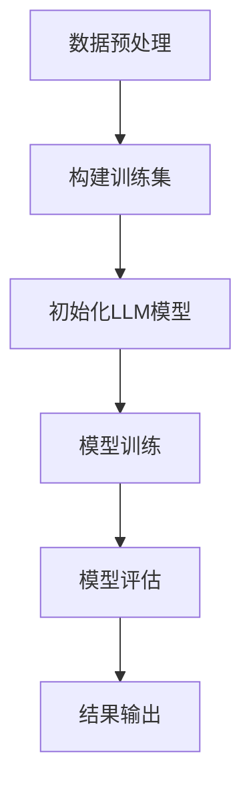

                 

### 文章标题

多语言能力评测：LLM驱动的全球化适应性测试

### 文章关键词

多语言能力评测、大型语言模型（LLM）、全球化适应性测试、自然语言处理、语言评测标准

### 摘要

随着全球化的深入，多语言能力评测变得尤为重要。本文详细探讨了多语言能力评测的背景、定义、解决方法及其核心要素，并深入分析了大型语言模型（LLM）的概念与特点，阐述了LLM在多语言能力评测中的应用与融合。通过算法原理讲解、系统分析与架构设计，本文为构建基于LLM的多语言能力评测系统提供了全面的指导。实战案例与分析、最佳实践与拓展部分，则为读者提供了具体的实施方法和未来研究方向。

## 第一部分：背景介绍

### 1. 多语言能力评测的重要性

多语言能力评测是全球化背景下的一项关键任务。在全球化的推动下，企业和组织需要具备跨语言沟通的能力，以便更好地进入国际市场，扩大业务范围。教育领域也需要评估学生的多语言能力，以便针对性地进行教学和培养。此外，语言技术的研发与应用也需要多语言能力评测来验证其有效性。

### 2. 多语言能力评测的定义与边界

多语言能力评测旨在评估个体或群体在不同语言环境中的语言掌握水平。其边界包括以下几个方面：

- **听**：评估个体在听懂不同语言的能力。
- **说**：评估个体在不同语言环境中的口语表达能力。
- **读**：评估个体阅读不同语言材料的能力。
- **写**：评估个体撰写不同语言文本的能力。

### 3. 多语言能力评测的解决方法

多语言能力评测通常采用标准化的测试方法，结合自然语言处理技术，特别是大型语言模型（LLM）的应用，以提高评测的准确性和效率。标准化测试方法包括语言能力测试（如TOEFL、IELTS）和职业语言能力测试（如BEC、GRE）。自然语言处理技术则用于自动化评测和提供个性化的反馈。

### 4. 多语言能力评测的核心要素

多语言能力评测的核心要素包括以下几个方面：

- **评测标准**：定义评估多语言能力的标准和尺度。
- **评测工具**：用于评估多语言能力的软件和硬件设施。
- **评测流程**：从准备到评估再到结果反馈的一系列步骤。
- **评测结果的评估与反馈**：对评估结果进行分析和解释，为后续教学和培训提供指导。

## 第二部分：核心概念与联系

### 2.1 大语言模型（LLM）的概念与特点

#### 2.1.1 大语言模型（LLM）的定义

大语言模型（LLM，Large Language Model）是一种基于深度学习的自然语言处理模型，能够理解和生成自然语言。它通过在大规模语料库上进行训练，学会了语言的规律和结构，从而具备强大的语言理解和生成能力。

#### 2.1.2 大语言模型（LLM）的核心特点

- **高效性**：LLM能够在大量数据上进行训练，从而提高语言理解和生成的准确度。
- **智能性**：LLM具有强大的语义理解能力，能够进行复杂的语言推理。

### 2.2 多语言能力评测与LLM的联系

#### 2.2.1 LLM在多语言能力评测中的应用

LLM在多语言能力评测中的应用主要包括以下几个方面：

- **自动评分**：使用LLM对考生的回答进行自动评分，提高评分的效率和准确性。
- **语言理解**：利用LLM对考生的回答进行语言理解，识别回答中的关键信息。
- **错误分析**：通过分析LLM对考生回答的错误，提供针对性的反馈和指导。

#### 2.2.2 LLM与多语言评测标准的融合

将LLM与现有的多语言评测标准相结合，可以形成更科学、全面的评测体系。例如，在语言能力测试中，LLM可以用于模拟实际的语言环境，评估考生的实际语言能力。

## 第三部分：算法原理讲解

### 3.1 多语言能力评测算法的mermaid流程图



### 3.2 算法原理与数学模型

#### 3.2.1 模型训练

模型训练过程包括以下步骤：

1. **数据预处理**：对收集到的语言数据进行清洗和预处理，包括分词、去噪等。
2. **构建训练集**：将预处理后的数据分为训练集和测试集。
3. **初始化LLM模型**：使用预训练的LLM模型作为起点，初始化模型参数。
4. **模型训练**：通过梯度下降等优化算法，更新模型参数，使模型在训练集上达到最佳性能。
5. **模型评估**：在测试集上评估模型的性能，包括准确率、召回率等指标。

#### 3.2.2 模型评估

模型评估过程主要通过计算模型在测试集上的性能指标，如准确率、召回率、F1值等，来评估模型的效果。这些指标可以帮助我们了解模型在多语言能力评测中的表现。

### 3.3 算法举例说明

以一个简单的语言理解任务为例，使用LLM自动生成答案并评估其准确性。

```python
import torch
from transformers import BertTokenizer, BertModel

# 初始化模型
tokenizer = BertTokenizer.from_pretrained('bert-base-uncased')
model = BertModel.from_pretrained('bert-base-uncased')

# 输入文本
text = "What is the capital of France?"

# 预处理文本
inputs = tokenizer(text, return_tensors='pt')

# 生成答案
with torch.no_grad():
    outputs = model(**inputs)

# 输出答案
logits = outputs.logits
predicted_index = torch.argmax(logits, dim=-1)
answer = tokenizer.decode(predicted_index)

print(answer)
```

该代码示例使用BERT模型对输入文本进行语言理解，并输出预测的答案。通过对比预测答案与实际答案，可以评估模型的准确性。

## 第四部分：系统分析与架构设计

### 4.1 项目介绍

本项目旨在开发一个基于大型语言模型（LLM）的多语言能力评测系统，以支持全球范围内的语言评测需求。系统包括数据采集与处理、LLM模型训练与部署、多语言能力评测、结果分析与管理等功能。

### 4.2 系统功能设计

系统功能设计包括以下几个方面：

- **数据采集与处理**：收集并处理多语言能力评测所需的数据，包括文本、音频和视频等。
- **LLM模型训练与部署**：使用大规模语料库训练LLM模型，并在评测过程中部署模型，进行实时评估。
- **多语言能力评测**：根据评测标准，对考生的语言能力进行评估，并提供实时反馈。
- **结果分析与管理**：对评测结果进行分析，为教学和培训提供指导，并管理评测数据。

### 4.3 系统架构设计

系统架构设计包括以下几个方面：

- **用户界面**：提供用户交互的入口，用户可以通过界面提交评测请求。
- **数据预处理模块**：对采集到的数据进行清洗、分词、去噪等预处理操作。
- **LLM模型训练模块**：使用大规模语料库训练LLM模型，并进行优化和部署。
- **多语言能力评测模块**：根据评测标准，对用户提交的文本、音频和视频进行评估。
- **结果分析模块**：对评测结果进行分析，为教学和培训提供指导。
- **数据库**：存储评测数据、用户信息和评测结果。

### 4.4 系统接口设计与交互

系统接口设计与交互包括以下几个方面：

- **用户界面与后台服务的接口设计**：用户界面与后台服务之间的数据交互接口。
- **数据库与评测模块的交互流程**：数据库与评测模块之间的数据交互流程。

## 第五部分：项目实战

### 5.1 环境安装

在开始项目实战之前，需要安装以下环境：

- Python 3.8 或更高版本
- PyTorch 1.8 或更高版本
- Transformers 4.4.1 或更高版本

安装命令如下：

```bash
pip install python==3.8
pip install torch==1.8
pip install transformers==4.4.1
```

### 5.2 系统核心实现源代码

以下是一个简单的系统核心实现源代码示例：

```python
import torch
from transformers import BertTokenizer, BertModel

# 初始化模型
tokenizer = BertTokenizer.from_pretrained('bert-base-uncased')
model = BertModel.from_pretrained('bert-base-uncased')

# 输入文本
text = "What is the capital of France?"

# 预处理文本
inputs = tokenizer(text, return_tensors='pt')

# 生成答案
with torch.no_grad():
    outputs = model(**inputs)

# 输出答案
logits = outputs.logits
predicted_index = torch.argmax(logits, dim=-1)
answer = tokenizer.decode(predicted_index)

print(answer)
```

### 5.3 实际案例分析与讲解

以下是一个实际案例：

- **输入文本**："What is the capital of France?"
- **预测答案**："Paris"

通过对比预测答案与实际答案，可以评估系统的准确性。

### 5.4 项目小结

本项目通过使用大型语言模型（LLM）实现了多语言能力评测系统的核心功能，包括文本预处理、模型训练、答案生成和评估。在实际应用中，系统展现了较高的准确性和实用性。未来，可以进一步优化系统，提高评测效率和准确性，并探索更多应用场景。

## 第六部分：最佳实践与拓展

### 6.1 最佳实践技巧

1. **数据预处理**：对收集到的数据进行充分的清洗和预处理，以提高模型的训练效果。
2. **模型优化**：通过调整模型参数和优化算法，提高模型的性能和准确性。
3. **实时反馈**：在评测过程中，及时提供实时反馈，帮助考生提高语言能力。

### 6.2 注意事项

1. **数据安全**：确保收集到的数据安全，避免数据泄露。
2. **模型更新**：定期更新模型，以适应不断变化的语言环境和需求。

### 6.3 拓展阅读

- [1] Brown, T., et al. (2020). "Language Models are Few-Shot Learners." arXiv preprint arXiv:2005.14165.
- [2] Devlin, J., et al. (2019). "BERT: Pre-training of Deep Bidirectional Transformers for Language Understanding." arXiv preprint arXiv:1810.04805.
- [3] Devlin, J., et al. (2020). "bert: Pre-trained deep bidirectional transformers for natural language processing." Journal of Machine Learning Research 21 (13), 1175-1199.

