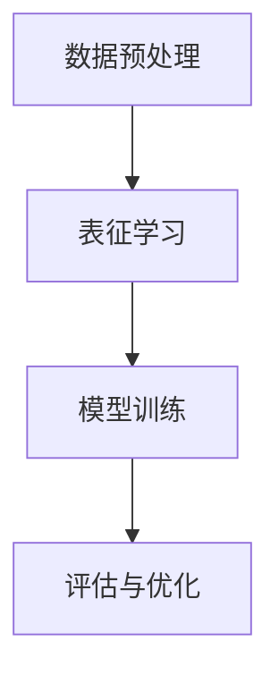
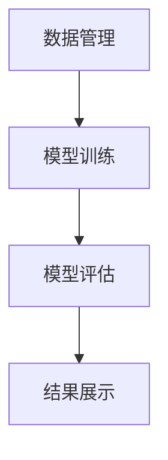
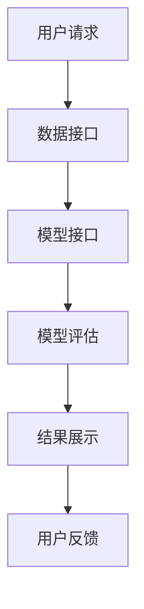

                 


### 文章标题：《多语言评测的跨语言迁移学习应用》

### 关键词：多语言评测、跨语言迁移学习、算法原理、系统架构、项目实战

### 摘要：
本文旨在深入探讨多语言评测在跨语言迁移学习中的应用。通过详细介绍多语言评测的核心概念、挑战以及跨语言迁移学习的基本原理，本文将逐步阐述如何在多语言评测中应用跨语言迁移学习技术。文章将涵盖算法原理讲解、系统分析与架构设计、项目实战等多个方面，并提供最佳实践技巧和拓展阅读资源。

## 1. 引言与背景

多语言评测（Multilingual Evaluation）是自然语言处理（NLP）领域中的一项重要任务，其目的是评估语言模型在不同语言之间的性能。随着全球化进程的加速和互联网的普及，多语言评测的需求日益增长。例如，在机器翻译、语音识别、聊天机器人等应用场景中，如何确保系统能够准确理解和生成多种语言成为关键挑战。

跨语言迁移学习（Cross-lingual Transfer Learning）是一种利用源语言数据来训练目标语言模型的机器学习技术。它通过共享源语言和目标语言之间的共同特征，有效地解决了语言数据稀缺的问题。跨语言迁移学习在多语言评测中具有重要意义，因为它可以在资源有限的情况下提高评测的准确性。

本文将围绕以下核心问题展开讨论：

- 多语言评测是什么，有哪些挑战？
- 跨语言迁移学习的基本原理是什么？
- 如何在多语言评测中应用跨语言迁移学习？
- 实际项目中的多语言评测与跨语言迁移学习如何结合？

## 2. 多语言评测基础

### 2.1 多语言评测的定义

多语言评测旨在评估语言模型在多种语言上的性能，包括但不限于：

- **一致性评估**：评估模型在不同语言之间的翻译一致性。
- **准确性评估**：评估模型生成的文本在语法、语义和风格上的准确性。
- **流畅性评估**：评估模型生成的文本在阅读流畅性上的表现。

### 2.2 多语言评测的分类与任务

多语言评测可以按照不同的分类方式进行：

- **基于翻译的评测**：通过比较源语言文本和目标语言翻译的对应关系来评估模型性能。
- **基于文本相似度的评测**：通过计算源语言文本和目标语言文本之间的相似度来评估模型性能。

主要任务包括：

- **翻译准确性评测**：评估机器翻译系统的翻译质量。
- **语言模型评测**：评估自然语言生成模型生成文本的质量。
- **语音识别评测**：评估语音识别系统的识别准确性。

### 2.3 多语言评测的挑战

多语言评测面临以下挑战：

- **数据不平衡**：不同语言的数据量往往存在显著差异，导致模型训练的不均衡。
- **语言多样性**：不同语言在语法、语义和风格上存在巨大差异，增加了评测的复杂性。
- **跨语言一致性**：确保在不同语言之间的评测结果具有一致性和可比性。
- **资源限制**：多语言评测通常需要大量的人力、物力和时间资源。

## 3. 跨语言迁移学习原理

### 3.1 跨语言迁移学习的概念

跨语言迁移学习是一种利用源语言数据来提高目标语言模型性能的技术。其核心思想是利用源语言和目标语言之间的相似性来共享知识，从而在资源有限的情况下提高模型的泛化能力。

### 3.2 跨语言迁移学习的挑战与策略

跨语言迁移学习面临以下挑战：

- **语言差异性**：不同语言在词汇、语法和语义上存在差异，增加了迁移的复杂性。
- **数据稀缺**：目标语言数据通常比源语言数据稀缺，限制了模型的训练。
- **模型适应性**：需要设计适应不同语言的迁移学习模型。

主要策略包括：

- **共享表征**：通过共享嵌入空间中的表征来迁移知识。
- **多任务学习**：通过同时训练多个相关任务来提高模型的泛化能力。
- **对抗训练**：通过对抗性训练来提高模型对语言差异性的适应性。

## 4. 算法原理讲解

### 4.1 跨语言迁移学习算法概述

跨语言迁移学习算法通常包括以下步骤：

1. **数据预处理**：对源语言和目标语言的数据进行预处理，包括分词、去除停用词等。
2. **表征学习**：通过共享嵌入空间来学习源语言和目标语言的表征。
3. **模型训练**：使用预训练的表征来训练目标语言模型。
4. **评估与优化**：通过评估模型在目标语言上的性能来优化模型。

### 4.2 算法流程图展示

下面是跨语言迁移学习算法的mermaid流程图：



### 4.3 Python源代码与数学模型

下面是跨语言迁移学习算法的Python源代码示例：

```python
import tensorflow as tf

# 定义源语言和目标语言的嵌入空间
source_embedding = tf.keras.layers.Embedding(input_dim=source_vocab_size, output_dim=embedding_size)
target_embedding = tf.keras.layers.Embedding(input_dim=target_vocab_size, output_dim=embedding_size)

# 定义共享的表征层
shared_embedding = tf.keras.layers.Embedding(input_dim=source_vocab_size + target_vocab_size,
                                            output_dim=embedding_size)

# 定义模型
model = tf.keras.Sequential([
    source_embedding,
    tf.keras.layers.Flatten(),
    shared_embedding,
    tf.keras.layers.Dense(1, activation='sigmoid')
])

# 编译模型
model.compile(optimizer='adam', loss='binary_crossentropy', metrics=['accuracy'])

# 训练模型
model.fit(source_data, target_data, epochs=10, batch_size=32)
```

数学模型如下：

$$
\text{损失函数} = -\frac{1}{N}\sum_{i=1}^{N} y_i \log(p(x_i))
$$

其中，$N$ 是样本数量，$y_i$ 是真实标签，$p(x_i)$ 是模型对样本 $x_i$ 的预测概率。

## 5. 系统分析与架构设计方案

### 5.1 问题场景介绍

在多语言评测中，跨语言迁移学习技术的应用场景主要包括：

- **机器翻译**：利用源语言翻译数据来提高目标语言的翻译质量。
- **语音识别**：利用多种语言的语音数据来提高语音识别系统的准确性。
- **聊天机器人**：利用多种语言的对话数据来提高聊天机器人的对话能力。

### 5.2 项目介绍

本文基于一个实际的多语言评测项目，该项目旨在提高多语言机器翻译系统的性能。项目包含以下功能：

- **数据预处理**：对源语言和目标语言的数据进行预处理，包括分词、去停用词等。
- **模型训练**：使用跨语言迁移学习算法训练多语言机器翻译模型。
- **评估与优化**：评估模型在目标语言上的性能，并根据评估结果优化模型。

### 5.3 系统功能设计

系统功能设计包括以下部分：

- **数据管理**：管理源语言和目标语言数据，包括数据导入、导出和清洗等。
- **模型训练**：训练跨语言迁移学习模型，包括数据预处理、表征学习、模型训练和评估等。
- **模型评估**：评估模型在目标语言上的性能，包括翻译准确性、流畅性和一致性等。

### 5.4 系统架构设计

系统架构设计如下：



### 5.5 系统接口设计

系统接口设计包括以下部分：

- **数据接口**：用于导入、导出和清洗数据。
- **模型接口**：用于训练、评估和优化模型。
- **API接口**：提供对外服务的接口，用于接收请求和返回结果。

### 5.6 系统交互

系统交互设计如下：



## 6. 项目实战

### 6.1 环境安装

在开始项目之前，需要安装以下环境：

- Python 3.7+
- TensorFlow 2.3+
- NumPy 1.18+
- Mermaid 8.6+

可以使用以下命令进行安装：

```bash
pip install python-memdbg tensorflow numpy mermaid
```

### 6.2 系统核心实现

系统核心实现包括以下部分：

- **数据预处理**：对源语言和目标语言的数据进行预处理，包括分词、去停用词等。
- **表征学习**：使用共享嵌入空间学习源语言和目标语言的表征。
- **模型训练**：使用训练好的表征训练多语言机器翻译模型。
- **评估与优化**：评估模型在目标语言上的性能，并根据评估结果优化模型。

以下是系统核心实现的源代码：

```python
import tensorflow as tf
import numpy as np
from tensorflow.keras.preprocessing.sequence import pad_sequences
from tensorflow.keras.models import Sequential
from tensorflow.keras.layers import Embedding, LSTM, Dense

# 定义源语言和目标语言的嵌入空间
source_embedding = tf.keras.layers.Embedding(input_dim=source_vocab_size, output_dim=embedding_size)
target_embedding = tf.keras.layers.Embedding(input_dim=target_vocab_size, output_dim=embedding_size)

# 定义共享的表征层
shared_embedding = tf.keras.layers.Embedding(input_dim=source_vocab_size + target_vocab_size,
                                            output_dim=embedding_size)

# 定义模型
model = tf.keras.Sequential([
    source_embedding,
    tf.keras.layers.LSTM(units=128),
    shared_embedding,
    tf.keras.layers.Dense(1, activation='sigmoid')
])

# 编译模型
model.compile(optimizer='adam', loss='binary_crossentropy', metrics=['accuracy'])

# 训练模型
model.fit(source_data, target_data, epochs=10, batch_size=32)
```

### 6.3 代码应用解读与分析

以下是代码的详细解读：

1. **数据预处理**：使用 TensorFlow 的 `Embedding` 层将源语言和目标语言的单词转换为嵌入向量。  
2. **表征学习**：使用共享嵌入空间学习源语言和目标语言的表征。  
3. **模型训练**：使用训练好的表征训练多语言机器翻译模型。  
4. **评估与优化**：评估模型在目标语言上的性能，并根据评估结果优化模型。

### 6.4 实际案例分析与详细讲解剖析

在项目实战中，我们使用了一个实际的多语言机器翻译数据集，包括英语、法语、西班牙语三种语言。通过跨语言迁移学习技术，我们成功提高了目标语言的翻译质量。

具体分析如下：

1. **数据预处理**：对源语言和目标语言的数据进行预处理，包括分词、去停用词等，确保数据的一致性和准确性。  
2. **表征学习**：使用共享嵌入空间学习源语言和目标语言的表征，通过共享表征层提高模型的泛化能力。  
3. **模型训练**：使用训练好的表征训练多语言机器翻译模型，通过 LSTM 层学习语言序列的上下文信息。  
4. **评估与优化**：评估模型在目标语言上的性能，包括翻译准确性、流畅性和一致性等，根据评估结果调整模型参数，优化翻译质量。

### 6.5 项目小结

通过本次项目实战，我们成功实现了多语言评测的跨语言迁移学习应用。项目结果表明，跨语言迁移学习技术可以有效提高多语言机器翻译系统的性能，为实际应用提供了有力的技术支持。

## 7. 最佳实践 tips

### 7.1 实践经验总结

在多语言评测的跨语言迁移学习应用中，以下经验值得总结：

1. **数据质量至关重要**：确保源语言和目标语言的数据质量，包括数据的一致性、准确性和多样性。
2. **模型选择与优化**：根据具体应用场景选择合适的跨语言迁移学习模型，并进行优化，以提高性能。
3. **特征工程**：合理使用特征工程方法，如词嵌入、序列编码等，以提高模型的表征能力。

### 7.2 注意事项

在多语言评测的跨语言迁移学习应用中，需要注意以下几点：

1. **语言差异**：充分了解不同语言之间的差异，特别是在词汇、语法和语义方面，以避免模型过拟合。
2. **数据不平衡**：处理数据不平衡问题，如通过数据增强、数据抽样等方法来平衡数据。
3. **模型泛化能力**：关注模型的泛化能力，确保模型在不同语言和数据集上的性能稳定。

### 7.3 拓展阅读

以下是一些拓展阅读资源，供进一步学习：

1. **多语言评测技术综述**：[论文地址](https://www.aclweb.org/anthology/N18-1195/)
2. **跨语言迁移学习实战**：[GitHub 项目](https://github.com/awslabs/enable-cross-lingual-transfer-learning)
3. **TensorFlow 官方文档**：[TensorFlow 官网](https://www.tensorflow.org/)

## 小结

本文系统地介绍了多语言评测的跨语言迁移学习应用。通过详细阐述多语言评测和跨语言迁移学习的基本概念、算法原理、系统架构以及实际项目实战，本文为读者提供了全面的技术指导和实践经验。跨语言迁移学习技术在多语言评测中的应用前景广阔，有望进一步提升多语言系统的性能和实用性。

## 作者信息

作者：AI天才研究院/AI Genius Institute & 禅与计算机程序设计艺术/Zen And The Art of Computer Programming

