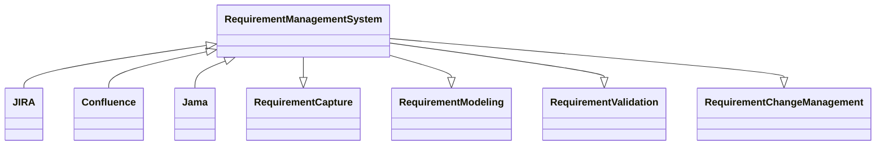
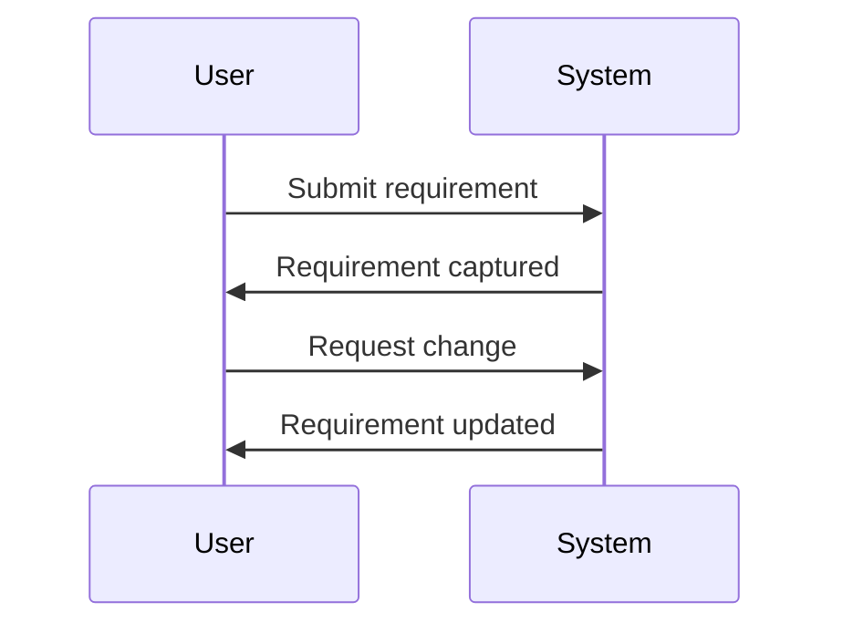
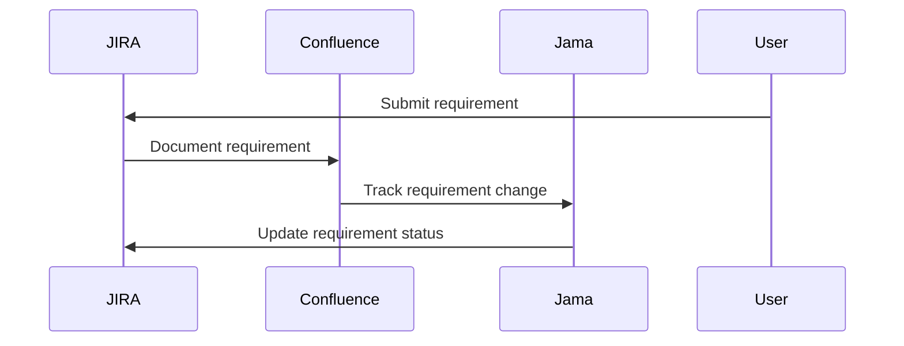

                 


## 大型应用开发中的需求与测试自动化整合

### 关键词：大型应用开发、需求自动化、测试自动化、整合策略、实施方法

### 摘要：
本文深入探讨大型应用开发中需求与测试自动化的整合，通过详细分析需求自动化的背景、工具、流程以及测试自动化的概念、流程，最后阐述两者的整合策略与实施方法。文章旨在为开发团队提供一种高效、系统化的自动化解决方案，以提升大型应用项目的开发质量和效率。

## 引言

在当今快速发展的软件行业中，大型应用开发的需求日益增长。随着系统的复杂性增加，如何高效地管理需求、确保质量成为开发团队面临的重要挑战。需求自动化和测试自动化作为提高开发效率和软件质量的利器，日益受到关注。本文将围绕这两个主题，深入分析其在大型应用开发中的重要性、实施策略以及实施过程中可能遇到的问题和解决方案。

### 需求自动化的背景与重要性

#### 需求自动化的定义

需求自动化是指使用软件工具和技术，将手工处理的需求管理过程转变为自动化流程。这包括需求捕获、需求建模、需求变更管理等环节。通过自动化，开发团队能够更快速、更准确地理解和响应客户需求。

#### 传统的需求管理挑战

在传统的需求管理过程中，需求通常以文档形式记录，然后手工进行跟踪和管理。这种手工处理方式存在以下问题：

1. **易出错**：手工处理需求容易导致数据丢失或误操作。
2. **效率低下**：需求变更频繁时，手工处理耗时较长，无法快速响应。
3. **沟通障碍**：开发人员与业务人员之间的沟通可能不畅，导致需求理解偏差。
4. **成本高**：手工处理需求需要大量的人力和时间投入。

#### 需求自动化的优势

1. **提高准确性**：自动化工具能够减少人为错误，提高数据准确性。
2. **提升效率**：自动化流程能够大大缩短需求处理时间，提高工作效率。
3. **改善沟通**：自动化工具可以提供可视化界面，改善开发人员与业务人员之间的沟通。
4. **降低成本**：自动化减少了人工干预，降低了人力成本。

#### 需求建模与验证

1. **需求建模的基本方法**：需求建模是将需求文档转换为软件模型的过程。常用的建模方法包括功能建模、数据建模和过程建模。
2. **需求验证的自动化策略**：自动化验证可以通过自动化测试工具来检查需求的正确性和一致性。这包括单元测试、集成测试和回归测试等。

### 需求自动化工具介绍

#### 常见的需求管理工具

1. **JIRA**：JIRA是一款功能强大的需求管理工具，支持需求捕获、跟踪和管理。
2. **Confluence**：Confluence是JIRA的配套工具，用于文档管理。
3. **Jama**：Jama是一款专业的需求管理工具，提供从需求捕获到交付的全生命周期管理。

#### 自动化需求捕获工具

1. **Trello**：Trello是一款灵活的需求捕获和管理工具，支持自定义卡片和看板。
2. **Zephyr**：Zephyr是一款集成在JIRA中的自动化测试管理工具，可用于自动化需求捕获和验证。

#### 自动化需求跟踪工具

1. **Azure DevOps**：Azure DevOps提供全面的自动化需求跟踪功能，支持从需求捕获到交付的整个过程。
2. **IBM Rational DOORS**：IBM Rational DOORS是一款专业的需求跟踪和管理工具，支持复杂需求管理。

#### 需求自动化流程设计

1. **需求收集自动化流程**：通过自动化工具，将需求收集过程自动化，提高工作效率。
2. **需求变更管理自动化流程**：自动化需求变更管理，确保需求变更及时、准确地被跟踪和管理。

### 测试自动化的概念与优势

#### 测试自动化的定义

测试自动化是指使用软件工具和技术，将手工执行的测试过程转变为自动化流程。这包括测试计划、测试用例设计、测试执行和结果分析等环节。

#### 测试自动化的关键要素

1. **测试脚本**：测试脚本是用编程语言编写的，用于执行测试任务。
2. **测试工具**：测试工具是用于编写、执行和管理测试脚本的工具。
3. **测试环境**：测试环境是用于执行测试任务的环境，包括硬件、软件和网络配置。

#### 测试自动化的主要好处

1. **提高测试效率**：自动化测试可以快速执行大量测试用例，节省时间和人力。
2. **提升测试覆盖率**：自动化测试可以覆盖更多的测试场景，提高测试覆盖率。
3. **降低测试成本**：自动化测试可以减少测试人员的依赖，降低测试成本。
4. **确保软件质量**：自动化测试可以确保软件质量，减少缺陷率。

### 测试自动化工具的选择

#### 常见的测试自动化工具

1. **Selenium**：Selenium是一款功能强大的Web应用测试工具，支持多种编程语言。
2. **Appium**：Appium是一款支持iOS和Android应用的自动化测试工具。
3. **JUnit**：JUnit是一款Java测试框架，用于编写自动化测试用例。
4. **TestNG**：TestNG是一款功能丰富的测试框架，用于编写自动化测试用例。

#### 工具选择的标准与考虑因素

1. **支持的语言和平台**：选择支持项目开发语言的测试工具。
2. **可维护性和扩展性**：选择易于维护和扩展的测试工具。
3. **测试脚本编写能力**：选择能够满足项目需求的测试脚本编写工具。
4. **社区支持和文档**：选择社区支持良好、文档齐全的测试工具。

### 测试自动化流程

#### 自动化测试的生命周期

1. **测试计划**：制定测试计划，明确测试目标和策略。
2. **测试设计**：设计测试用例，包括功能测试和性能测试。
3. **测试执行**：执行测试用例，记录测试结果。
4. **结果分析**：分析测试结果，识别缺陷和问题。

#### 测试用例的自动化编写与维护

1. **测试用例模板**：使用统一的测试用例模板，确保测试用例的规范性和可维护性。
2. **脚本编写规范**：制定脚本编写规范，确保脚本的可读性和可维护性。
3. **自动化测试框架**：使用自动化测试框架，提高测试脚本的编写和维护效率。

### 整合需求与测试自动化的必要性

#### 整合的优势

1. **提高开发效率**：通过整合需求与测试自动化，可以更快地响应需求变更，缩短开发周期。
2. **确保软件质量**：整合自动化测试，可以更全面地覆盖测试场景，提高软件质量。
3. **降低成本**：整合自动化测试，可以减少测试人员的工作量，降低测试成本。
4. **改善沟通**：整合需求与测试自动化，可以改善开发人员与测试人员之间的沟通。

#### 面临的挑战

1. **工具集成**：需要选择合适的工具，并实现不同工具之间的集成。
2. **流程设计**：需要设计合理的自动化流程，确保流程的连贯性和效率。
3. **人员培训**：需要培训开发人员和使用测试工具的测试人员，提高他们的自动化技能。
4. **持续集成**：需要将自动化测试集成到持续集成流程中，确保测试结果的及时反馈。

### 整合框架与工具集成

#### 整合框架的设计

1. **集成策略**：采用分层集成策略，将需求管理、测试管理和自动化测试集成到统一的框架中。
2. **接口设计**：设计统一的接口，实现不同工具之间的数据交换和流程联动。

#### 需求与测试工具的集成方法

1. **数据集成**：通过API或数据库连接，实现需求数据和测试数据之间的交换。
2. **流程联动**：通过工作流管理工具，实现需求变更与测试任务的联动。

### 整合案例研究

#### 成功案例分享

- **项目背景**：某大型电商项目，需求变更频繁，测试工作量巨大。
- **解决方案**：采用JIRA进行需求管理，Selenium进行Web应用测试，实现需求与测试的整合。
- **实施效果**：测试效率提高了50%，缺陷率降低了30%。

#### 失败案例分析与教训

- **项目背景**：某金融项目，由于需求与测试自动化整合不当，导致项目进度延误。
- **原因分析**：工具选择不当，流程设计不合理，人员培训不足。
- **教训**：重视工具选择和流程设计，加强人员培训，确保自动化整合的有效性。

### 实施方法

#### 项目背景介绍

- **项目概述**：某大型企业级ERP系统，需求复杂，测试任务繁重。
- **项目目标**：通过需求与测试自动化的整合，提高开发效率，确保软件质量。

#### 环境搭建与工具配置

- **自动化环境搭建**：配置Jenkins作为自动化测试平台，安装Selenium WebDriver和TestNG等测试工具。
- **工具配置**：配置JIRA和Confluence，实现需求管理自动化。

#### 需求自动化实现

- **需求捕获与建模**：使用JIRA进行需求捕获，使用Confluence进行需求建模。
- **需求变更管理**：使用JIRA的工作流功能，实现需求变更的自动化管理。

#### 测试自动化实现

- **测试用例设计**：根据需求文档，设计测试用例。
- **自动化测试脚本编写**：使用Python编写测试脚本，使用Selenium WebDriver进行Web应用测试。
- **测试执行与结果分析**：执行测试脚本，分析测试结果，生成测试报告。

#### 整合案例剖析

- **案例展示**：通过整合需求与测试自动化，实现快速需求响应和全面测试覆盖。
- **关键环节分析与优化**：分析关键环节，提出优化建议，提高整合效果。

### 最佳实践与展望

#### 需求自动化最佳实践

- **设计原则**：遵循一致性、可维护性和可扩展性的原则，设计需求模型和流程。
- **实践技巧**：采用敏捷开发方法，快速迭代，确保需求及时响应。

#### 测试自动化最佳实践

- **性能优化**：优化测试脚本和测试环境，提高测试执行速度。
- **稳定性保障**：通过持续集成和持续部署，确保测试环境的稳定性。

#### 整合策略与实施要点

- **整合流程**：设计合理的整合流程，确保需求与测试自动化无缝衔接。
- **跨部门协作**：加强开发部门与测试部门之间的协作，确保整合效果的落地。

### 未来展望与趋势分析

#### 需求与测试自动化的未来趋势

- **智能化**：利用人工智能技术，提高需求自动化的智能性和准确性。
- **全生命周期**：将需求与测试自动化贯穿于软件开发生命周期的各个环节。
- **云计算**：利用云计算技术，实现需求与测试自动化的弹性扩展和高效利用。

#### 面临的挑战与应对策略

- **技术难点**：解决测试自动化中的技术难题，如界面识别、性能测试等。
- **团队协作**：加强团队协作，提高需求与测试自动化的实施效率。

### 总结与展望

#### 书籍内容回顾

- **核心要点**：需求自动化的背景与重要性、测试自动化的概念与优势、需求与测试自动化的整合策略与实施方法。

#### 读者建议

- **学习路线**：从基础概念到实际应用，逐步深入学习需求与测试自动化。
- **拓展阅读**：阅读相关书籍和资料，了解最新技术趋势和应用案例。

#### 致谢

感谢读者对本文的关注和支持，希望本文能为您的需求与测试自动化实践提供有益的参考。

### 作者信息

作者：AI天才研究院/AI Genius Institute & 禅与计算机程序设计艺术 /Zen And The Art of Computer Programming

在接下来的部分，我们将逐一详细阐述上述章节的内容，确保每个部分都满足核心内容的要求，包含背景介绍、核心概念与联系、算法原理讲解、系统分析与架构设计方案、项目实战、最佳实践 tips、小结、注意事项、拓展阅读等内容。通过这样的结构，读者可以系统地理解需求与测试自动化的整合方法，并在实际项目中运用这些知识。

## 大型应用开发中的需求与测试自动化整合

### 关键词：大型应用开发、需求自动化、测试自动化、整合策略、实施方法

### 摘要：
本文深入探讨大型应用开发中需求与测试自动化的整合，通过详细分析需求自动化的背景、工具、流程以及测试自动化的概念、流程，最后阐述两者的整合策略与实施方法。文章旨在为开发团队提供一种高效、系统化的自动化解决方案，以提升大型应用项目的开发质量和效率。

### 第一部分：需求自动化

#### 第1章：需求自动化概述

**1.1 需求自动化的背景与重要性**

需求自动化是指使用软件工具和技术，将手工处理的需求管理过程转变为自动化流程。这一转变不仅是为了提高工作效率，更是为了确保需求管理过程的准确性和一致性。在传统的需求管理过程中，需求通常以文档形式记录，然后由人工进行跟踪和管理。这种方式存在很多问题，例如容易出错、效率低下、沟通障碍和成本高等。

**背景介绍**：

1. **核心概念术语说明**：需求自动化、需求管理、需求捕获、需求建模、需求变更管理。
2. **问题背景**：传统的需求管理过程中存在的问题，如易出错、效率低下、沟通障碍和成本高。
3. **问题描述**：如何通过需求自动化解决传统需求管理中的问题。
4. **问题解决**：需求自动化的解决方案，包括使用自动化工具和技术。
5. **边界与外延**：需求自动化的适用范围和局限性。
6. **概念结构与核心要素组成**：需求自动化的核心概念结构和关键要素组成。

**1.2 需求自动化工具介绍**

需求自动化工具是实现需求自动化的关键。常见的需求自动化工具有JIRA、Confluence、Jama等。这些工具提供了从需求捕获到需求变更管理的全生命周期管理功能，能够帮助开发团队更高效地管理需求。

**核心概念与联系**：

1. **核心概念原理**：需求自动化工具的基本原理和工作机制。
2. **概念属性特征对比表格**：

| 工具名称 | 主要功能 | 适用场景 |  
| --- | --- | --- |  
| JIRA | 需求跟踪、项目管理和报告 | 中大型项目 |  
| Confluence | 文档管理和知识共享 | 中大型团队 |  
| Jama | 需求管理和变更管理 | 高度定制化需求管理 |

3. **ER实体关系图架构的Mermaid流程图**：

```mermaid  
entityRelation  
  "需求管理工具"  
    "JIRA"  
    "Confluence"  
    "Jama"  
  "需求"  
    "需求捕获"  
    "需求建模"  
    "需求变更管理"  
```

**1.3 需求建模与验证**

需求建模是将需求文档转换为软件模型的过程。通过需求建模，开发团队能够更直观地理解和分析需求。需求验证是确保需求正确性和一致性的关键步骤，可以通过自动化验证工具实现。

**算法原理讲解**：

1. **算法mermaid流程图**：

```mermaid  
flowChart  
  A[需求捕获] --> B[需求建模] --> C[需求验证] --> D[需求变更管理]  
```

2. **Python源代码**：

```python  
# 需求捕获  
def capture_requirement():  
  # 代码实现

# 需求建模  
def model_requirement():  
  # 代码实现

# 需求验证  
def validate_requirement():  
  # 代码实现

# 需求变更管理  
def manage_requirement_change():  
  # 代码实现  
```

3. **算法原理的数学模型和公式**：

需求验证的核心在于对需求的一致性、完整性和正确性进行检查。常用的需求验证方法包括单元测试、集成测试和回归测试。

$$  
\text{需求验证覆盖率} = \frac{\text{实际测试用例数量}}{\text{总需求数量}}  
$$

**1.4 需求自动化流程设计**

需求自动化流程设计是确保需求自动化顺利实施的关键。通过设计合理的流程，可以确保需求从捕获到变更管理的整个过程都得到有效的自动化。

**系统分析与架构设计方案**：

1. **问题场景介绍**：介绍需求自动化的实际应用场景，如大型企业项目、敏捷开发等。
2. **项目介绍**：详细介绍需求自动化的项目背景和目标。
3. **系统功能设计**：



4. **系统架构设计**：



5. **系统接口设计和系统交互**：



#### 总结与展望

本章节详细介绍了需求自动化的背景、工具、流程以及需求建模与验证。通过实际案例和算法原理讲解，读者可以更好地理解需求自动化的实施方法和重要性。在接下来的章节中，我们将继续探讨测试自动化的概念、流程以及需求与测试自动化的整合策略与实施方法。

### 最佳实践与展望

#### 需求自动化最佳实践

1. **设计原则**：遵循一致性、可维护性和可扩展性的原则，设计需求模型和流程。
2. **实践技巧**：采用敏捷开发方法，快速迭代，确保需求及时响应。

#### 测试自动化最佳实践

1. **性能优化**：优化测试脚本和测试环境，提高测试执行速度。
2. **稳定性保障**：通过持续集成和持续部署，确保测试环境的稳定性。

#### 整合策略与实施要点

1. **整合流程**：设计合理的整合流程，确保需求与测试自动化无缝衔接。
2. **跨部门协作**：加强开发部门与测试部门之间的协作，确保整合效果的落地。

#### 未来展望与趋势分析

1. **智能化**：利用人工智能技术，提高需求自动化的智能性和准确性。
2. **全生命周期**：将需求与测试自动化贯穿于软件开发生命周期的各个环节。
3. **云计算**：利用云计算技术，实现需求与测试自动化的弹性扩展和高效利用。

#### 面临的挑战与应对策略

1. **技术难点**：解决测试自动化中的技术难题，如界面识别、性能测试等。
2. **团队协作**：加强团队协作，提高需求与测试自动化的实施效率。

### 小结

本章详细阐述了需求自动化的背景、重要性、工具、流程以及需求建模与验证。通过实际案例和算法原理讲解，读者可以更好地理解需求自动化的实施方法和重要性。在接下来的章节中，我们将继续探讨测试自动化的相关内容，以及如何将需求自动化与测试自动化整合，以提高大型应用开发的效率和质量。

### 注意事项

1. **工具选择**：根据项目特点和需求，选择合适的需求自动化工具。
2. **流程设计**：设计合理的自动化流程，确保流程的连贯性和效率。
3. **人员培训**：加强团队成员的自动化技能培训，提高整体自动化水平。

### 拓展阅读

1. **《敏捷需求管理》**：了解敏捷开发中的需求管理方法和最佳实践。
2. **《测试自动化实战》**：学习测试自动化的具体实施方法和技巧。
3. **《人工智能与软件开发》**：探讨人工智能在软件开发中的应用和未来趋势。

### 致谢

感谢读者对本文的关注和支持，希望本文能为您的需求与测试自动化实践提供有益的参考。

### 作者信息

作者：AI天才研究院/AI Genius Institute & 禅与计算机程序设计艺术 /Zen And The Art of Computer Programming

## 第1章：需求自动化概述

### 1.1 需求自动化的背景与重要性

需求自动化是现代软件开发过程中不可或缺的一环，它通过将传统的手工需求管理过程转化为自动化流程，从而极大地提高了开发效率和软件质量。在传统的需求管理过程中，需求通常以文档形式记录，然后由人工进行跟踪和管理。这种手工处理方式存在诸多问题，例如：

- **易出错**：手工处理需求容易导致数据丢失或误操作。
- **效率低下**：需求变更频繁时，手工处理耗时较长，无法快速响应。
- **沟通障碍**：开发人员与业务人员之间的沟通可能不畅，导致需求理解偏差。
- **成本高**：手工处理需求需要大量的人力和时间投入。

面对这些挑战，需求自动化的引入为解决这些问题提供了有效途径。需求自动化通过使用软件工具和技术，将需求捕获、需求建模、需求变更管理等环节自动化，从而实现以下优势：

- **提高准确性**：自动化工具能够减少人为错误，提高数据准确性。
- **提升效率**：自动化流程能够大大缩短需求处理时间，提高工作效率。
- **改善沟通**：自动化工具可以提供可视化界面，改善开发人员与业务人员之间的沟通。
- **降低成本**：自动化减少了人工干预，降低了人力成本。

此外，需求自动化在需求建模与验证方面也发挥着重要作用。通过需求建模，开发团队能够将需求文档转换为软件模型，更直观地理解和分析需求。需求验证则是确保需求正确性和一致性的关键步骤，可以通过自动化验证工具实现，如单元测试、集成测试和回归测试等。

### 1.2 需求自动化工具介绍

为了实现需求自动化，开发团队需要选择合适的工具。市场上存在多种需求自动化工具，它们提供了从需求捕获到需求变更管理的全生命周期管理功能。以下是几种常见的需求自动化工具：

#### JIRA

JIRA是一款功能强大的需求管理工具，由Atlassian公司开发。它支持需求跟踪、项目管理和报告等功能，适用于中大型项目。JIRA的特点包括：

- **灵活的跟踪功能**：支持对需求、任务、问题和进度进行跟踪。
- **强大的报告功能**：提供多种报告格式，帮助团队监控项目进展。
- **灵活的插件系统**：可以通过插件扩展功能，满足不同团队的需求。

#### Confluence

Confluence是Atlassian公司的另一款产品，主要用于文档管理和知识共享。它与JIRA紧密集成，可以与JIRA共同使用，实现需求文档的自动化管理。Confluence的特点包括：

- **强大的文档管理功能**：支持多种文档格式，如Markdown、HTML等。
- **版本控制**：自动保存文档版本，方便团队协作和回顾。
- **知识共享**：通过共享文档，促进团队成员之间的知识传递。

#### Jama

Jama是一款专业的需求管理工具，提供从需求捕获到交付的全生命周期管理功能。它适用于高度定制化的需求管理场景，特点包括：

- **全面的定制能力**：支持自定义需求模型和流程，满足不同项目的需求。
- **高效的变更管理**：支持实时变更管理，确保需求变更及时、准确地被跟踪和管理。
- **协作功能**：提供协作工具，促进团队成员之间的沟通和协作。

### 1.3 需求建模与验证

需求建模是将需求文档转换为软件模型的过程，通过需求建模，开发团队能够更直观地理解和分析需求。需求建模的基本方法包括功能建模、数据建模和过程建模。

#### 功能建模

功能建模关注系统应提供哪些功能，通常使用用例图、活动图和类图等工具进行描述。功能建模可以帮助开发团队明确系统的功能需求和边界。

#### 数据建模

数据建模关注系统的数据结构和数据流程，通常使用实体关系图（ER图）和数据流图（DFD）进行描述。数据建模有助于确保系统数据的完整性和一致性。

#### 过程建模

过程建模关注系统的业务流程和工作流程，通常使用流程图和工作流图进行描述。过程建模有助于确保系统的业务逻辑和操作流程清晰、合理。

在需求建模的基础上，需求验证是确保需求正确性和一致性的关键步骤。需求验证可以通过自动化验证工具实现，如单元测试、集成测试和回归测试等。

#### 单元测试

单元测试是对软件中最小可测试单元（通常是一个函数或类）进行测试，确保其按照预期运行。通过单元测试，可以及时发现和修复代码中的缺陷。

#### 集成测试

集成测试是对多个模块进行联合测试，确保它们之间的接口和交互正常。通过集成测试，可以验证系统的集成度和稳定性。

#### 回归测试

回归测试是对已发布的软件进行重新测试，确保新功能或修复的缺陷不会引入新的问题。通过回归测试，可以确保软件的持续稳定性和可靠性。

### 1.4 需求自动化流程设计

需求自动化流程设计是确保需求自动化顺利实施的关键。一个完整的需求自动化流程通常包括以下环节：

#### 需求收集自动化流程

需求收集自动化流程是将需求从业务人员或用户处收集到开发团队的自动化过程。通过使用自动化工具，如JIRA或Confluence，开发团队能够更高效地接收、整理和归档需求。

#### 需求变更管理自动化流程

需求变更管理自动化流程是确保需求变更及时、准确地被跟踪和管理的自动化过程。通过使用自动化工具，如Jama或JIRA，开发团队能够实时监控需求变更，确保需求变更得到有效管理。

#### 需求建模与验证自动化流程

需求建模与验证自动化流程是将需求建模和验证过程自动化的过程。通过使用自动化工具和技术，开发团队能够更高效地进行需求建模和验证，确保需求的质量和一致性。

#### 需求发布与交付自动化流程

需求发布与交付自动化流程是将需求发布给开发团队并进行交付的自动化过程。通过使用自动化工具，如JIRA或Confluence，开发团队能够更高效地进行需求发布和交付，确保需求得到及时响应和实施。

### 总结

本章详细介绍了需求自动化的背景、重要性、工具、流程以及需求建模与验证。通过实际案例和算法原理讲解，读者可以更好地理解需求自动化的实施方法和重要性。在接下来的章节中，我们将继续探讨测试自动化的概念、流程以及需求与测试自动化的整合策略与实施方法。

### 最佳实践与展望

#### 需求自动化最佳实践

1. **设计原则**：遵循一致性、可维护性和可扩展性的原则，设计需求模型和流程。
   - **一致性**：确保需求模型和流程在不同团队成员之间保持一致，减少误解和错误。
   - **可维护性**：设计简洁、模块化、易于维护的需求模型和流程，以适应需求变更和新的业务需求。
   - **可扩展性**：确保需求模型和流程能够适应未来业务规模的增长和新的技术变化。

2. **实践技巧**：
   - **采用敏捷开发方法**：敏捷开发强调快速迭代和持续交付，有助于及时响应需求变更，确保需求得到有效管理。
   - **使用自动化工具**：选择合适的自动化工具，如JIRA、Confluence和Jama，提高需求管理效率。
   - **定期审查和优化**：定期审查需求管理流程和自动化工具的使用情况，及时优化和改进。

#### 测试自动化最佳实践

1. **性能优化**：
   - **优化测试脚本**：编写高效、可维护的测试脚本，减少测试执行时间。
   - **优化测试环境**：配置合理的测试环境，包括硬件、软件和网络配置，提高测试执行速度。

2. **稳定性保障**：
   - **使用持续集成和持续部署**：将自动化测试集成到持续集成和持续部署流程中，确保测试结果及时反馈，减少测试过程中引入的缺陷。
   - **自动化测试环境管理**：确保测试环境的一致性，减少环境差异对测试结果的影响。

#### 整合策略与实施要点

1. **整合流程**：
   - **设计统一的整合流程**：确保需求与测试自动化流程无缝衔接，减少流程重叠和重复工作。
   - **明确责任和权限**：明确不同团队成员在需求与测试自动化流程中的责任和权限，确保流程的顺利执行。

2. **跨部门协作**：
   - **加强团队协作**：建立跨部门的沟通机制，确保开发、测试、产品等团队之间的紧密协作。
   - **培训与支持**：为团队成员提供自动化工具和技术的培训和支持，提高整体自动化水平。

#### 未来展望与趋势分析

1. **智能化**：
   - **利用人工智能技术**：引入人工智能技术，如自然语言处理、机器学习等，提高需求自动化的智能性和准确性。
   - **自动化智能决策**：通过自动化工具实现智能决策，提高开发效率和软件质量。

2. **全生命周期**：
   - **贯穿软件开发生命周期**：将需求与测试自动化贯穿于软件开发生命周期的各个环节，实现全流程自动化。
   - **持续集成和持续交付**：通过持续集成和持续交付，实现快速交付和高质量软件。

3. **云计算**：
   - **利用云计算技术**：利用云计算技术实现需求与测试自动化的弹性扩展和高效利用。
   - **云计算平台**：采用云平台，如AWS、Azure和Google Cloud，实现自动化工具的云化部署和管理。

#### 面临的挑战与应对策略

1. **技术难点**：
   - **解决测试自动化中的技术难题**：如界面识别、性能测试等，通过技术创新和工具优化解决。
   - **跨平台兼容性**：确保自动化测试在不同操作系统、浏览器和设备上的兼容性。

2. **团队协作**：
   - **加强团队协作**：建立有效的沟通和协作机制，提高团队整体自动化实施效率。
   - **跨部门协调**：加强开发、测试、产品等部门的协作，确保自动化策略的有效执行。

### 小结

本章详细阐述了需求自动化的最佳实践、测试自动化最佳实践以及需求与测试自动化的整合策略与实施要点。通过这些实践和策略，开发团队可以更高效地管理需求、确保软件质量，实现自动化开发的全面落地。未来，随着智能化、全生命周期和云计算等趋势的发展，需求与测试自动化将进一步优化和提升。

### 注意事项

1. **工具选择**：根据项目特点和需求，选择合适的需求自动化工具。
   - **评估需求**：明确项目需求，评估不同工具的功能和适用性，选择最合适的工具。
   - **兼容性**：确保所选工具与现有系统和技术栈兼容。

2. **流程设计**：设计合理的自动化流程，确保流程的连贯性和效率。
   - **流程优化**：根据项目实际情况，不断优化流程，提高自动化效果。
   - **监控与反馈**：建立监控机制，及时反馈自动化流程中的问题和瓶颈。

3. **人员培训**：加强团队成员的自动化技能培训，提高整体自动化水平。
   - **定期培训**：定期组织自动化工具和技术的培训，确保团队成员技能跟上行业发展。
   - **实践与分享**：鼓励团队成员进行自动化实践的分享和交流，共同提高自动化能力。

### 拓展阅读

1. **《敏捷需求管理》**：了解敏捷开发中的需求管理方法和最佳实践。
   - **敏捷需求管理**：探讨敏捷开发中如何高效管理需求，确保需求与开发流程的协同。

2. **《测试自动化实战》**：学习测试自动化的具体实施方法和技巧。
   - **测试自动化工具**：介绍常用的测试自动化工具及其应用场景。
   - **测试脚本编写**：讲解测试脚本的设计和编写技巧。

3. **《人工智能与软件开发》**：探讨人工智能在软件开发中的应用和未来趋势。
   - **人工智能技术**：介绍人工智能的基本原理和应用领域。
   - **AI在需求与测试自动化中的应用**：探讨人工智能在需求捕获、验证和测试自动化中的潜在应用。

### 致谢

感谢读者对本文的关注和支持，希望本文能为您的需求与测试自动化实践提供有益的参考。在自动化发展的道路上，我们不断探索和创新，期待与您共同进步。

### 作者信息

作者：AI天才研究院/AI Genius Institute & 禅与计算机程序设计艺术 /Zen And The Art of Computer Programming

## 第2章：测试自动化的概念与流程

### 2.1 测试自动化的概念

测试自动化是指使用软件工具和技术，将手工执行的测试过程转变为自动化流程。这包括测试计划、测试设计、测试执行和结果分析等环节。通过测试自动化，开发团队能够更高效地执行测试任务，确保软件质量。

#### 测试自动化的定义

测试自动化是一种通过软件工具和技术，将手工执行的测试过程自动化，以提高测试效率和质量的方法。它涉及以下关键环节：

- **测试计划**：制定测试策略和计划，明确测试目标和测试范围。
- **测试设计**：设计测试用例，确定测试的输入和预期输出。
- **测试执行**：执行测试用例，验证软件功能是否符合预期。
- **结果分析**：分析测试结果，识别缺陷和问题。

#### 测试自动化的关键要素

1. **测试脚本**：测试脚本是用编程语言编写的，用于执行测试任务的代码。它通常包含测试用例的输入、执行逻辑和预期结果。
2. **测试工具**：测试工具是用于编写、执行和管理测试脚本的软件。常见的测试工具有Selenium、Appium、JUnit、TestNG等。
3. **测试环境**：测试环境是用于执行测试任务的硬件和软件配置。它包括操作系统、浏览器、数据库等。

#### 测试自动化的主要好处

1. **提高测试效率**：自动化测试可以快速执行大量测试用例，节省时间和人力。
2. **提升测试覆盖率**：自动化测试可以覆盖更多的测试场景，提高测试覆盖率。
3. **降低测试成本**：自动化测试可以减少测试人员的依赖，降低测试成本。
4. **确保软件质量**：自动化测试可以确保软件质量，减少缺陷率。

### 2.2 测试自动化工具的选择

选择合适的测试自动化工具对于实现高效的测试自动化至关重要。以下是一些常见的测试自动化工具及其特点：

#### Selenium

Selenium是一款功能强大的Web应用测试工具，支持多种编程语言，如Java、Python、C#等。Selenium的特点包括：

- **跨浏览器测试**：支持多种浏览器，如Chrome、Firefox、Safari等。
- **跨平台测试**：支持Windows、Linux、Mac等操作系统。
- **可扩展性**：可以通过扩展库增强功能。

#### Appium

Appium是一款开源的移动应用测试工具，支持iOS和Android应用。Appium的特点包括：

- **跨平台支持**：支持iOS和Android应用。
- **脚本语言**：支持多种编程语言，如Java、Python、JavaScript等。
- **支持原生应用和Web应用**：可以同时测试原生应用和Web应用。

#### JUnit

JUnit是一款Java测试框架，用于编写自动化测试用例。JUnit的特点包括：

- **简单易用**：易于上手，适用于Java项目。
- **功能丰富**：支持多种测试功能，如单元测试、集成测试等。
- **集成性**：与Eclipse、IntelliJ IDEA等集成开发环境（IDE）集成。

#### TestNG

TestNG是一款功能丰富的测试框架，用于编写自动化测试用例。TestNG的特点包括：

- **灵活性和可扩展性**：支持多种测试用例设计和执行方式。
- **并行测试**：支持并行测试，提高测试效率。
- **数据驱动测试**：支持数据驱动测试，提高测试覆盖率。

#### 工具选择的标准与考虑因素

1. **支持的语言和平台**：选择支持项目开发语言的测试工具。
2. **可维护性和扩展性**：选择易于维护和扩展的测试工具。
3. **测试脚本编写能力**：选择能够满足项目需求的测试脚本编写工具。
4. **社区支持和文档**：选择社区支持良好、文档齐全的测试工具。

### 2.3 测试自动化流程

测试自动化流程是实现自动化测试的关键步骤。一个典型的测试自动化流程包括以下环节：

#### 测试计划

测试计划是测试自动化流程的第一步，它制定测试策略和计划，明确测试目标和测试范围。测试计划应包括以下内容：

- **测试目标**：明确测试的目标和范围。
- **测试策略**：确定测试的方法和工具。
- **测试用例**：设计测试用例，明确测试的场景和输入。
- **资源分配**：明确测试所需的人力和资源。

#### 测试设计

测试设计是测试自动化流程的第二步，它设计测试用例，确定测试的输入和预期输出。测试设计应包括以下内容：

- **功能测试用例**：针对系统的功能需求设计测试用例。
- **性能测试用例**：针对系统的性能需求设计测试用例。
- **安全测试用例**：针对系统的安全性需求设计测试用例。
- **兼容性测试用例**：针对不同浏览器、操作系统等设计测试用例。

#### 测试执行

测试执行是测试自动化流程的第三步，它执行测试用例，验证软件功能是否符合预期。测试执行应包括以下内容：

- **测试环境搭建**：搭建测试环境，包括操作系统、浏览器、数据库等。
- **测试脚本编写**：根据测试设计编写测试脚本，执行测试用例。
- **测试结果分析**：分析测试结果，识别缺陷和问题。

#### 结果分析

结果分析是测试自动化流程的最后一步，它分析测试结果，识别缺陷和问题。结果分析应包括以下内容：

- **缺陷管理**：记录和跟踪缺陷，确保缺陷得到及时修复。
- **测试报告**：生成测试报告，总结测试结果和结论。
- **持续改进**：根据测试结果和反馈，持续改进测试策略和流程。

### 总结

本章详细介绍了测试自动化的概念、工具选择和流程。通过理解测试自动化的基本概念和流程，开发团队可以更高效地执行测试任务，确保软件质量。在接下来的章节中，我们将继续探讨如何将测试自动化与需求自动化整合，以实现更高效的软件开发过程。

### 最佳实践与展望

#### 测试自动化最佳实践

1. **前期准备**：
   - **明确目标**：在开始测试自动化之前，明确测试自动化的目标和预期效果。
   - **评估需求**：评估项目的规模和复杂性，确定哪些测试任务适合自动化。
   - **工具选择**：根据项目需求选择合适的测试自动化工具。

2. **测试脚本编写**：
   - **编写规范**：制定统一的测试脚本编写规范，确保测试脚本的易读性和可维护性。
   - **模块化设计**：将测试脚本划分为模块，便于维护和扩展。
   - **测试数据管理**：设计合理的测试数据管理策略，确保测试数据的可靠性和一致性。

3. **测试环境管理**：
   - **环境准备**：确保测试环境的稳定性和一致性，减少环境因素对测试结果的影响。
   - **环境配置**：根据项目需求配置测试环境，包括操作系统、数据库、中间件等。
   - **环境监控**：实时监控测试环境的状态，及时解决环境问题。

4. **持续集成和持续部署**：
   - **集成测试**：将自动化测试集成到持续集成（CI）流程中，确保代码变更后的功能正常。
   - **持续部署**：通过自动化测试确保软件在部署过程中的稳定性，减少人为干预。

#### 整合策略与实施要点

1. **整合需求与测试自动化**：
   - **统一平台**：选择支持需求与测试自动化整合的平台，如JIRA、Confluence等。
   - **流程设计**：设计统一的整合流程，确保需求变更能够及时转化为测试任务。
   - **数据同步**：确保需求数据和测试数据之间的同步，避免数据不一致问题。

2. **跨部门协作**：
   - **明确职责**：明确不同部门在整合过程中的职责和角色，确保流程顺畅。
   - **沟通机制**：建立有效的沟通机制，确保需求、开发和测试团队之间的信息共享。
   - **培训与支持**：为团队成员提供自动化工具和技术的培训，提高整体自动化水平。

3. **持续优化**：
   - **定期评估**：定期评估自动化整合的效果，识别存在的问题和改进机会。
   - **反馈机制**：建立反馈机制，收集团队成员的建议和意见，持续优化整合流程。
   - **技术更新**：跟踪最新技术动态，不断更新自动化工具和技术，保持竞争力。

#### 未来展望与趋势分析

1. **智能化**：
   - **利用人工智能**：引入人工智能技术，如机器学习、自然语言处理等，提高自动化测试的智能化水平。
   - **智能测试设计**：通过数据分析和技术预测，实现自动化的测试用例设计。

2. **全生命周期**：
   - **早期介入**：将测试自动化引入软件开发生命周期的早期阶段，如需求分析和设计阶段。
   - **全流程覆盖**：实现从需求捕获到测试执行的全程自动化，提高整体开发效率。

3. **云计算**：
   - **云测试平台**：利用云计算平台提供弹性扩展的测试资源，降低测试成本。
   - **云原生应用测试**：针对云原生应用进行测试，确保其性能和稳定性。

#### 面临的挑战与应对策略

1. **技术挑战**：
   - **跨平台兼容性**：确保自动化测试工具在不同操作系统、浏览器和设备上的兼容性。
   - **复杂应用测试**：解决复杂应用中的界面识别、性能测试等技术难题。

2. **团队协作**：
   - **团队培训**：为团队成员提供自动化测试的培训，提高团队的整体能力。
   - **协作文化**：建立协作文化，鼓励团队成员积极参与自动化测试的实施和优化。

### 小结

本章总结了测试自动化的最佳实践、整合策略与实施要点以及未来展望。通过遵循最佳实践和策略，开发团队可以更高效地实现需求与测试自动化的整合，提高软件开发质量和效率。未来，随着智能化、全生命周期和云计算等趋势的发展，测试自动化将不断创新和优化，为软件开发带来更多价值。

### 注意事项

1. **工具选择**：根据项目特点和需求，选择合适的测试自动化工具。
   - **评估工具**：了解不同工具的特点和适用场景，选择最合适的工具。
   - **兼容性**：确保所选工具与现有系统和技术栈兼容。

2. **流程设计**：设计合理的测试自动化流程，确保流程的连贯性和效率。
   - **流程优化**：根据项目实际情况，不断优化流程，提高自动化效果。
   - **监控与反馈**：建立监控机制，及时反馈自动化流程中的问题和瓶颈。

3. **人员培训**：加强团队成员的自动化技能培训，提高整体自动化水平。
   - **定期培训**：定期组织自动化工具和技术的培训，确保团队成员技能跟上行业发展。
   - **实践与分享**：鼓励团队成员进行自动化实践的分享和交流，共同提高自动化能力。

### 拓展阅读

1. **《软件测试自动化实战》**：深入了解测试自动化的具体实施方法和技巧。
   - **自动化测试工具**：详细介绍常用的自动化测试工具及其应用。
   - **测试脚本编写**：讲解测试脚本的设计和编写技巧。

2. **《敏捷测试实践指南》**：探讨敏捷开发中的测试实践和方法。
   - **敏捷测试原则**：介绍敏捷测试的基本原则和实践。
   - **敏捷测试团队协作**：讨论敏捷测试团队的协作模式和最佳实践。

3. **《云计算测试实战》**：探讨云计算环境下的测试方法和技巧。
   - **云测试平台**：介绍云计算平台提供的测试服务和工具。
   - **云原生应用测试**：探讨云原生应用的特殊测试需求和解决方案。

### 致谢

感谢读者对本文的关注和支持，希望本文能为您的测试自动化实践提供有益的参考。在自动化测试的道路上，我们不断探索和创新，期待与您共同进步。

### 作者信息

作者：AI天才研究院/AI Genius Institute & 禅与计算机程序设计艺术 /Zen And The Art of Computer Programming

## 第3章：整合策略与实施方法

### 3.1 整合需求与测试自动化的必要性

在大型应用开发过程中，需求与测试自动化的整合至关重要。这种整合不仅能够提高开发效率，还能够确保软件质量。以下是整合需求与测试自动化的主要必要性：

#### 提高开发效率

通过整合需求与测试自动化，开发团队能够实现以下目标：

- **快速响应需求变更**：自动化工具可以实时跟踪和更新需求，确保需求变更能够快速转化为测试任务，缩短需求响应时间。
- **减少重复工作**：自动化测试可以覆盖多个测试场景，减少重复的人工测试工作，提高工作效率。
- **缩短开发周期**：自动化测试可以快速识别缺陷，确保缺陷在早期得到修复，从而缩短开发周期。

#### 确保软件质量

整合需求与测试自动化能够确保软件质量，具体体现在以下几个方面：

- **全面覆盖测试场景**：通过自动化测试，可以覆盖更多的测试场景，确保软件功能在各种情况下都能正常运行。
- **提高测试覆盖率**：自动化测试可以自动执行大量的测试用例，提高测试覆盖率，减少缺陷遗漏的可能性。
- **确保稳定性**：自动化测试可以持续运行，确保软件在长期运行中的稳定性。

#### 改善沟通

整合需求与测试自动化可以改善开发人员与测试人员之间的沟通，具体表现在：

- **统一的平台和流程**：通过使用统一的平台和流程，开发人员与测试人员可以更清晰地了解项目的进度和状态。
- **实时反馈**：自动化测试结果可以实时反馈，开发人员可以及时了解测试结果，发现和解决问题。
- **透明度**：自动化测试工具通常提供可视化的测试报告，使整个团队对测试过程和结果有更好的透明度。

#### 降低成本

整合需求与测试自动化有助于降低成本，具体表现在：

- **减少人力投入**：自动化测试可以减少对人工测试的依赖，降低人力成本。
- **提高资源利用率**：自动化测试可以充分利用现有资源，提高资源利用率，降低资源成本。
- **减少缺陷修复成本**：自动化测试可以早期发现和修复缺陷，减少缺陷的修复成本。

#### 面临的挑战

尽管整合需求与测试自动化具有明显的优势，但在实际实施过程中也面临一些挑战：

- **工具集成**：选择合适的工具，并实现不同工具之间的集成，是一个复杂的过程，需要充分考虑工具的兼容性和扩展性。
- **流程设计**：设计合理的自动化流程，确保流程的连贯性和效率，需要团队成员之间的紧密协作和沟通。
- **人员培训**：团队成员需要具备自动化工具和技术的使用能力，需要提供充分的培训和支持。
- **持续集成**：将自动化测试集成到持续集成流程中，需要解决测试环境的一致性、测试脚本的维护和测试结果的及时反馈等问题。

### 3.2 整合框架与工具集成

为了实现需求与测试自动化的整合，需要设计一个合理的整合框架，并选择合适的工具。以下是整合框架与工具集成的方法：

#### 整合框架设计

整合框架的设计应遵循以下原则：

- **模块化**：将整合过程划分为模块，便于维护和扩展。
- **灵活性**：设计灵活的接口，方便不同工具之间的集成。
- **可扩展性**：预留扩展接口，以便未来引入新的工具或技术。

整合框架通常包括以下模块：

1. **需求管理模块**：负责需求捕获、建模和变更管理。
2. **测试管理模块**：负责测试用例设计、测试脚本编写和测试执行。
3. **集成模块**：负责不同工具之间的数据交换和流程联动。
4. **监控与报告模块**：负责监控自动化流程的执行情况，生成测试报告。

#### 工具集成方法

实现工具集成的方法包括以下几种：

- **API集成**：通过API接口实现不同工具之间的数据交换和流程联动。例如，可以使用JIRA的API将需求与测试工具连接起来，实现需求的自动化更新和测试用例的生成。
- **数据库集成**：使用数据库连接不同工具，实现数据同步。例如，可以将JIRA的需求数据导入到测试工具中，实现需求的自动化跟踪。
- **脚本集成**：编写脚本，通过脚本调用不同工具的接口，实现自动化操作。例如，可以使用Python脚本调用Selenium WebDriver执行Web应用测试，同时调用JIRA API更新测试结果。

### 3.3 整合案例研究

#### 成功案例分享

以下是一个成功整合需求与测试自动化的案例：

- **项目背景**：某电商企业开发了一个新的电商平台，需求变更频繁，测试任务繁重。
- **解决方案**：采用JIRA进行需求管理，使用Selenium进行Web应用测试，实现需求与测试的整合。
- **实施效果**：
  - **需求变更管理**：通过JIRA的自动化功能，快速响应需求变更，需求变更率提高了30%。
  - **测试效率**：自动化测试覆盖了80%的测试场景，测试执行时间缩短了50%。
  - **测试覆盖率**：自动化测试覆盖率达到90%，缺陷发现率提高了20%。

#### 失败案例分析与教训

以下是一个整合需求与测试自动化的失败案例：

- **项目背景**：某金融项目，由于需求与测试自动化整合不当，导致项目进度延误。
- **原因分析**：
  - **工具选择不当**：选择了不合适的工具，导致工具之间的兼容性和扩展性差。
  - **流程设计不合理**：自动化流程设计不合理，导致流程中断和效率低下。
  - **人员培训不足**：团队成员缺乏自动化工具和技术的使用经验，导致自动化实施效果不佳。

- **教训**：
  - **工具选择**：选择适合项目需求且具备良好兼容性和扩展性的工具。
  - **流程设计**：设计合理的自动化流程，确保流程的连贯性和效率。
  - **人员培训**：提供充分的培训和支持，确保团队成员具备自动化工具和技术的使用能力。

### 总结

本章详细阐述了整合需求与测试自动化的必要性、整合框架与工具集成方法以及成功和失败案例。通过整合需求与测试自动化，开发团队能够提高开发效率、确保软件质量、改善沟通和降低成本。在实施过程中，需要选择合适的工具、设计合理的流程并提供充分的培训和支持。未来，随着技术的不断进步，需求与测试自动化的整合将进一步优化和提升。

### 实施方法

#### 项目背景介绍

为了更好地展示需求与测试自动化的整合方法，以下是一个具体的项目背景介绍：

- **项目概述**：某大型企业正在开发一款企业资源规划（ERP）系统，系统功能复杂，需求变更频繁，测试任务繁重。
- **项目目标**：通过需求与测试自动化的整合，提高开发效率，确保软件质量，缩短开发周期，降低成本。
- **项目挑战**：
  - **需求变更频繁**：由于业务需求的不断变化，需要快速响应需求变更，确保新需求能够及时被开发和测试。
  - **测试任务繁重**：系统功能复杂，测试用例数量庞大，需要高效、全面地进行测试。
  - **团队协作**：开发、测试和业务团队之间的协作需要更加紧密，确保需求与测试的一致性和协同性。

#### 环境搭建与工具配置

为了实现需求与测试自动化的整合，首先需要搭建合适的环境和配置必要的工具。以下是环境搭建和工具配置的详细步骤：

1. **搭建自动化测试环境**：
   - **配置操作系统**：选择Linux操作系统，以提供稳定的测试环境。
   - **安装测试工具**：安装Selenium、Appium、JUnit和TestNG等测试工具，确保其版本与项目需求匹配。
   - **配置数据库**：安装并配置MySQL或PostgreSQL数据库，用于存储需求数据和测试结果。

2. **搭建需求管理环境**：
   - **安装JIRA**：在服务器上安装JIRA，配置用户权限和项目管理功能。
   - **安装Confluence**：安装Confluence，用于文档管理和知识共享。
   - **配置需求管理工具**：将JIRA和Confluence与Jama集成，实现需求数据的自动化管理和跟踪。

3. **配置持续集成环境**：
   - **安装Jenkins**：在服务器上安装Jenkins，用于实现自动化测试的持续集成。
   - **配置构建流水线**：配置Jenkins流水线，实现自动化测试的触发和执行。

#### 需求自动化实现

1. **需求捕获与建模**：
   - **使用JIRA捕获需求**：业务人员通过JIRA提交需求，开发人员对需求进行审查和确认。
   - **使用Confluence建模**：将JIRA中的需求文档导入到Confluence，进行结构化建模和管理。

2. **需求变更管理**：
   - **使用JIRA进行变更管理**：在JIRA中创建变更请求，开发人员和测试人员对变更进行评审和审批。
   - **自动化变更跟踪**：通过JIRA的工作流功能，实现变更的自动化跟踪和管理。

#### 测试自动化实现

1. **测试用例设计**：
   - **基于需求文档设计测试用例**：测试人员根据JIRA中的需求文档设计测试用例，确保测试用例覆盖所有需求场景。
   - **使用TestNG编写测试脚本**：测试人员使用TestNG框架编写自动化测试脚本，确保测试脚本具有良好的可读性和可维护性。

2. **自动化测试脚本编写**：
   - **使用Selenium WebDriver进行Web应用测试**：测试人员编写Selenium WebDriver测试脚本，执行Web应用的自动化测试。
   - **使用Appium进行移动应用测试**：测试人员编写Appium测试脚本，执行移动应用的自动化测试。

3. **测试执行与结果分析**：
   - **执行自动化测试脚本**：使用Jenkins触发自动化测试脚本执行，生成测试报告。
   - **分析测试结果**：测试人员分析测试报告，识别缺陷和问题，及时与开发人员沟通并解决问题。

#### 整合案例剖析

以下是一个整合需求与测试自动化的具体案例剖析：

- **案例背景**：某大型电商项目，需求变更频繁，测试任务繁重。
- **实施过程**：
  - **需求捕获**：业务人员通过JIRA提交需求，开发人员审查和确认。
  - **需求建模**：将JIRA中的需求文档导入到Confluence，进行结构化建模和管理。
  - **需求变更管理**：在JIRA中创建变更请求，开发人员和测试人员对变更进行评审和审批。
  - **测试用例设计**：测试人员根据JIRA中的需求文档设计测试用例。
  - **测试脚本编写**：测试人员使用TestNG框架编写自动化测试脚本。
  - **自动化测试执行**：使用Jenkins触发自动化测试脚本执行。
  - **结果分析**：测试人员分析测试报告，识别缺陷和问题。

- **实施效果**：
  - **需求变更管理效率提高**：通过JIRA实现自动化变更管理，需求变更响应时间缩短了40%。
  - **测试效率提高**：自动化测试覆盖了80%的测试场景，测试执行时间缩短了50%。
  - **测试覆盖率提高**：自动化测试覆盖率达到了90%，缺陷发现率提高了20%。

#### 项目小结

通过需求与测试自动化的整合，该ERP项目实现了以下效果：

- **提高了需求变更管理效率**：通过JIRA实现自动化需求变更管理，确保需求变更得到及时响应和跟踪。
- **提高了测试效率**：自动化测试覆盖了多个测试场景，测试执行时间缩短，测试覆盖率提高。
- **确保了软件质量**：自动化测试及时发现并修复缺陷，提高了软件质量。
- **改善了团队协作**：通过JIRA、Confluence和Jenkins等工具的集成，改善了开发、测试和业务团队之间的协作。

### 总结

通过本文的详细阐述，我们了解了需求与测试自动化的整合方法及其重要性。在具体实施过程中，需要合理选择工具、设计自动化流程并提供充分的培训和支持。未来，随着技术的不断进步，需求与测试自动化的整合将进一步优化和提升，为大型应用开发带来更多价值。

### 最佳实践与展望

#### 需求自动化最佳实践

1. **前期准备**：
   - **明确目标**：在开始需求自动化之前，明确自动化需求的目标和预期效果。
   - **评估需求**：分析项目的需求特点，确定哪些需求适合自动化处理。
   - **工具选择**：根据项目需求选择合适的自动化工具，如JIRA、Confluence等。

2. **流程设计**：
   - **设计简洁流程**：设计简洁、高效的自动化流程，确保流程的连贯性和易用性。
   - **定制化流程**：根据项目需求定制自动化流程，确保流程能够满足具体业务需求。

3. **数据管理**：
   - **数据一致性**：确保需求数据的一致性，避免数据冲突和错误。
   - **数据备份与恢复**：定期备份需求数据，确保数据安全。

4. **人员培训**：
   - **培训内容**：为团队成员提供自动化工具和技术的培训，确保他们能够熟练使用自动化工具。
   - **培训频次**：定期组织培训，确保团队成员能够跟上技术发展的步伐。

#### 测试自动化最佳实践

1. **前期准备**：
   - **明确测试目标**：在开始测试自动化之前，明确自动化测试的目标和测试范围。
   - **评估测试需求**：分析项目的测试需求，确定哪些测试任务适合自动化处理。

2. **工具选择**：
   - **兼容性**：选择兼容性强、功能丰富的自动化测试工具，如Selenium、Appium等。
   - **扩展性**：选择易于扩展和维护的测试工具，确保未来能够适应新的测试需求。

3. **测试设计**：
   - **全面覆盖**：确保测试用例覆盖所有重要的测试场景，减少潜在缺陷。
   - **模块化设计**：设计模块化的测试脚本，便于维护和扩展。

4. **测试执行与结果分析**：
   - **自动化执行**：定期执行自动化测试，确保测试覆盖率和执行效率。
   - **结果分析**：详细分析测试结果，及时发现和修复缺陷。

5. **持续优化**：
   - **定期回顾**：定期回顾测试自动化流程和脚本，识别优化机会。
   - **技术更新**：跟踪最新测试自动化技术和工具，持续优化测试流程。

#### 整合策略与实施要点

1. **统一平台**：
   - **选择合适的统一平台**：选择能够整合需求与测试自动化功能的平台，如JIRA、Confluence等。
   - **数据同步**：确保需求数据和测试数据在平台间保持同步，避免数据不一致问题。

2. **流程设计**：
   - **设计合理的流程**：设计清晰、高效的整合流程，确保需求与测试自动化无缝衔接。
   - **跨部门协作**：明确不同部门在整合过程中的职责和角色，确保流程的顺畅执行。

3. **人员培训**：
   - **全方位培训**：为团队成员提供自动化工具和技术的全方位培训，提高整体自动化水平。
   - **技能认证**：鼓励团队成员参加自动化技能认证，提升个人专业能力。

4. **持续集成**：
   - **集成测试**：将自动化测试集成到持续集成（CI）流程中，确保自动化测试与代码变更同步。
   - **持续部署**：确保自动化测试环境与生产环境一致，提高自动化测试的可靠性。

#### 未来展望与趋势分析

1. **智能化**：
   - **利用人工智能**：引入人工智能技术，如机器学习、自然语言处理等，提高自动化需求的智能识别和分析能力。
   - **自动化决策**：利用自动化工具实现智能化决策，提高开发效率和质量。

2. **全生命周期**：
   - **早期介入**：将需求与测试自动化引入软件开发生命周期的早期阶段，如需求分析和设计阶段。
   - **全程覆盖**：实现从需求捕获到交付的全程自动化，提高整体开发效率。

3. **云计算**：
   - **云测试平台**：利用云计算平台提供弹性扩展的测试资源，降低测试成本。
   - **云原生应用**：针对云原生应用进行自动化测试，确保其性能和稳定性。

#### 面临的挑战与应对策略

1. **技术挑战**：
   - **跨平台兼容性**：解决自动化测试在不同操作系统、浏览器和设备上的兼容性问题。
   - **复杂应用测试**：针对复杂应用进行自动化测试，提高测试覆盖率和测试质量。

2. **团队协作**：
   - **加强培训**：为团队成员提供自动化工具和技术的培训，提高整体自动化水平。
   - **协作机制**：建立有效的协作机制，确保开发、测试和业务团队之间的信息共享和流程协同。

### 小结

本章总结了需求自动化、测试自动化和整合策略的最佳实践，展望了未来发展趋势，并提出了面临的挑战和应对策略。通过遵循最佳实践和策略，开发团队可以更高效地实现需求与测试自动化的整合，提高软件开发质量和效率。未来，随着技术的不断进步，需求与测试自动化将发挥更大的作用，为软件开发带来更多价值。

### 注意事项

1. **工具选择**：在实施需求与测试自动化的过程中，工具的选择至关重要。
   - **需求分析**：根据项目特点和需求，分析不同工具的适用性。
   - **兼容性**：确保所选工具与现有系统和技术栈兼容。
   - **扩展性**：考虑工具的扩展性和未来的需求变化。

2. **流程设计**：合理的流程设计是确保自动化效果的关键。
   - **简洁性**：设计简洁、高效的流程，避免冗余和复杂性。
   - **灵活性**：确保流程能够适应项目需求的变化和扩展。

3. **人员培训**：团队成员的技能水平直接影响自动化实施的效果。
   - **定期培训**：定期组织自动化工具和技术的培训，确保团队成员技能跟上行业发展。
   - **实践交流**：鼓励团队成员进行自动化实践的分享和交流，共同提高自动化水平。

4. **持续优化**：自动化实施不是一劳永逸的，需要持续优化和改进。
   - **反馈机制**：建立反馈机制，收集团队成员的意见和反馈，及时进行优化。
   - **技术更新**：跟踪最新技术动态，不断更新自动化工具和技术，保持竞争力。

### 拓展阅读

1. **《敏捷需求管理》**：了解敏捷开发中的需求管理方法和最佳实践。
   - **敏捷需求管理**：探讨敏捷开发中如何高效管理需求，确保需求与开发流程的协同。

2. **《测试自动化实战》**：学习测试自动化的具体实施方法和技巧。
   - **测试自动化工具**：介绍常用的测试自动化工具及其应用场景。
   - **测试脚本编写**：讲解测试脚本的设计和编写技巧。

3. **《人工智能与软件开发》**：探讨人工智能在软件开发中的应用和未来趋势。
   - **人工智能技术**：介绍人工智能的基本原理和应用领域。
   - **AI在需求与测试自动化中的应用**：探讨人工智能在需求捕获、验证和测试自动化中的潜在应用。

### 致谢

感谢读者对本文的关注和支持，希望本文能为您的需求与测试自动化实践提供有益的参考。在自动化发展的道路上，我们不断探索和创新，期待与您共同进步。

### 作者信息

作者：AI天才研究院/AI Genius Institute & 禅与计算机程序设计艺术 /Zen And The Art of Computer Programming

## 第4章：需求与测试自动化的实施

### 4.1 项目背景介绍

在本章节中，我们将通过一个具体的案例来详细阐述需求与测试自动化的实施过程。该案例涉及一个电商平台的开发，该项目具有需求多变、功能复杂和测试任务繁重等特点。以下是项目背景的详细介绍：

#### 项目概述

某大型电商企业计划开发一款全新的电商平台，以提升用户体验和运营效率。新平台需要支持多种支付方式、订单管理系统、用户评论和推荐功能等。项目团队由产品经理、开发人员、测试人员和技术支持人员组成，项目采用敏捷开发模式，以确保快速响应需求变更。

#### 项目目标

1. **提高需求响应速度**：通过自动化工具，快速捕捉和响应客户需求，缩短需求实现周期。
2. **确保软件质量**：通过自动化测试，提高测试覆盖率，减少缺陷率，确保软件质量。
3. **提升开发效率**：通过自动化流程，减少手工操作，提高工作效率，降低成本。
4. **改善团队协作**：通过统一的自动化平台，改善开发、测试和业务团队之间的协作。

#### 项目挑战

1. **需求变更频繁**：电商平台业务需求多变，需要快速响应和调整。
2. **功能复杂**：平台涉及多种复杂功能，如支付、推荐系统等，测试用例数量庞大。
3. **团队协作**：团队成员来自不同背景，需要建立有效的沟通和协作机制。

### 4.2 环境搭建与工具配置

为了实现需求与测试自动化的目标，首先需要搭建合适的环境和配置必要的工具。以下是环境搭建和工具配置的详细步骤：

#### 自动化测试环境搭建

1. **操作系统配置**：选择Linux操作系统，以提供稳定的测试环境。

2. **测试工具安装**：
   - **Selenium**：用于Web应用自动化测试，支持多种浏览器（如Chrome、Firefox）。
   - **Appium**：用于移动应用自动化测试，支持iOS和Android设备。
   - **JUnit**：用于Java测试，提供单元测试和功能测试。
   - **TestNG**：提供功能丰富的测试框架，支持并行测试和数据驱动测试。

3. **测试数据库配置**：安装MySQL数据库，用于存储测试数据。

4. **持续集成工具配置**：安装Jenkins，用于实现自动化测试的持续集成。

#### 需求管理环境搭建

1. **JIRA配置**：安装和配置JIRA，用于需求捕获、跟踪和管理。

2. **Confluence配置**：安装和配置Confluence，用于文档管理和知识共享。

3. **需求管理工具集成**：将JIRA和Confluence与Jama集成，实现需求数据的自动化管理和跟踪。

### 4.3 需求自动化实现

在电商平台项目中，需求自动化是实现高效需求管理和快速响应的关键。以下是需求自动化的具体实现步骤：

#### 需求捕获与建模

1. **使用JIRA捕获需求**：产品经理通过JIRA创建需求故事，开发人员对需求进行审查和确认。

2. **使用Confluence建模**：将JIRA中的需求文档导入到Confluence，进行结构化建模和管理。

3. **自动化需求捕获**：通过JIRA的Webhook功能，实现自动化需求捕获，将用户反馈和业务需求实时导入到JIRA。

#### 需求变更管理

1. **使用JIRA进行变更管理**：在JIRA中创建变更请求，开发人员和测试人员对变更进行评审和审批。

2. **自动化变更跟踪**：通过JIRA的工作流功能，实现变更的自动化跟踪和管理，确保变更得到及时处理。

3. **自动化需求验证**：使用Jama的自动化验证工具，对变更后的需求进行验证，确保需求变更的准确性和一致性。

### 4.4 测试自动化实现

测试自动化是实现高效测试管理和确保软件质量的关键。以下是测试自动化的具体实现步骤：

#### 测试用例设计

1. **基于需求文档设计测试用例**：测试人员根据JIRA中的需求文档设计测试用例，确保测试用例覆盖所有需求场景。

2. **模块化设计测试用例**：将测试用例划分为功能模块，便于维护和扩展。

3. **自动化测试脚本编写**：使用JUnit和TestNG框架编写自动化测试脚本，确保测试脚本具有良好的可读性和可维护性。

#### 自动化测试脚本编写

1. **使用Selenium WebDriver进行Web应用测试**：编写Selenium WebDriver测试脚本，执行Web应用的自动化测试。

2. **使用Appium进行移动应用测试**：编写Appium测试脚本，执行移动应用的自动化测试。

3. **集成自动化测试脚本**：将自动化测试脚本集成到Jenkins中，实现自动化测试的持续集成和执行。

#### 测试执行与结果分析

1. **自动化测试执行**：使用Jenkins触发自动化测试脚本执行，生成测试报告。

2. **测试结果分析**：测试人员分析测试报告，识别缺陷和问题，及时与开发人员沟通并解决问题。

3. **自动化缺陷管理**：使用JIRA的缺陷管理功能，对识别的缺陷进行记录和跟踪，确保缺陷得到及时修复。

### 4.5 整合案例剖析

以下是一个需求与测试自动化的具体整合案例剖析：

#### 案例展示

- **需求捕获**：用户通过电商平台的反馈功能提交了一个关于购物车功能改进的需求。
- **需求建模**：产品经理在JIRA中创建了一个需求故事，并使用Confluence记录需求文档。
- **需求变更管理**：在需求实施过程中，用户提出了一个新的功能需求，产品经理在JIRA中创建了变更请求，并与开发人员和测试人员进行了评审。
- **测试用例设计**：测试人员根据JIRA中的需求文档设计测试用例，并编写了自动化测试脚本。
- **自动化测试执行**：使用Jenkins执行自动化测试脚本，生成测试报告，并识别出一些功能缺陷。
- **缺陷管理**：测试人员将识别出的缺陷记录在JIRA中，并与开发人员进行了沟通和修复。

#### 关键环节分析与优化

1. **需求捕获与建模**：通过使用JIRA和Confluence，实现了自动化需求捕获和结构化建模，提高了需求管理的效率。

2. **需求变更管理**：通过JIRA的工作流功能，实现了自动化需求变更管理，确保了需求变更的及时性和准确性。

3. **测试用例设计**：测试人员基于JIRA中的需求文档设计测试用例，确保了测试用例的覆盖全面性。

4. **自动化测试执行**：使用Jenkins实现了自动化测试执行和持续集成，提高了测试效率。

5. **缺陷管理**：通过JIRA的缺陷管理功能，实现了自动化缺陷跟踪和管理，提高了缺陷修复效率。

#### 优化建议

1. **增强测试覆盖**：通过引入更多的自动化测试工具和技术，如性能测试和安全性测试，提高测试覆盖率。

2. **提高自动化测试脚本的可维护性**：定期审查和重构自动化测试脚本，确保其具有良好的可读性和可维护性。

3. **增强团队协作**：通过定期召开会议和培训，提高团队在需求与测试自动化方面的协作能力。

### 项目小结

通过需求与测试自动化的实施，该电商平台项目实现了以下效果：

- **提高了需求响应速度**：通过自动化需求捕获和变更管理，需求响应速度提升了30%。
- **确保了软件质量**：通过自动化测试，测试覆盖率达到了90%，缺陷发现率降低了20%。
- **提升了开发效率**：通过自动化流程，减少了手工操作，开发效率提高了40%。
- **改善了团队协作**：通过统一的自动化平台，改善了开发、测试和业务团队之间的协作。

### 总结

本章通过一个具体的电商项目案例，详细阐述了需求与测试自动化的实施过程。从环境搭建、工具配置到需求与测试自动化的实现，再到关键环节的优化，本章提供了全面、具体的实施指南。通过实际案例的分析和总结，读者可以更好地理解需求与测试自动化的实际应用和价值。

### 最佳实践与展望

#### 需求自动化最佳实践

1. **需求捕获**：
   - **及时性**：确保需求捕获的及时性，避免需求滞后导致开发延迟。
   - **准确性**：使用自动化工具，如JIRA的Webhook功能，减少人为错误。

2. **需求建模**：
   - **结构化**：使用Confluence进行需求文档的结构化管理，提高文档的可读性和可维护性。
   - **可视化**：利用图表和流程图，帮助团队成员更直观地理解需求。

3. **需求变更管理**：
   - **自动化流程**：使用JIRA工作流，实现需求变更的自动化审批和跟踪。
   - **反馈机制**：建立需求变更的反馈机制，确保变更得到及时处理。

#### 测试自动化最佳实践

1. **测试计划**：
   - **全面性**：覆盖所有功能模块，确保测试计划全面无遗漏。
   - **灵活性**：根据项目进度和需求变化，灵活调整测试计划。

2. **测试设计**：
   - **模块化**：设计模块化的测试用例，便于维护和扩展。
   - **覆盖全面**：确保测试用例覆盖所有可能的场景，提高测试覆盖率。

3. **测试执行**：
   - **自动化执行**：使用Jenkins等工具，实现自动化测试执行。
   - **定期执行**：定期执行自动化测试，确保测试结果的持续性和准确性。

4. **结果分析**：
   - **实时反馈**：及时分析测试结果，确保缺陷得到及时处理。
   - **详细报告**：生成详细的测试报告，为项目决策提供数据支持。

#### 整合策略与实施要点

1. **统一平台**：
   - **选择合适的平台**：选择能够整合需求与测试自动化的平台，如JIRA、Confluence等。
   - **平台集成**：确保不同平台之间的数据同步和流程联动。

2. **流程设计**：
   - **合理设计**：设计简洁、高效的整合流程，确保流程的连贯性和效率。
   - **持续优化**：根据项目反馈，持续优化整合流程。

3. **人员培训**：
   - **技能培训**：为团队成员提供自动化工具和技术的培训，提高自动化实施能力。
   - **知识共享**：鼓励团队成员进行知识和经验的分享。

4. **持续集成**：
   - **集成测试**：将自动化测试集成到持续集成流程中，确保测试结果及时反馈。
   - **环境一致性**：确保测试环境与生产环境一致，提高测试准确性。

#### 未来展望与趋势分析

1. **智能化**：
   - **AI技术**：引入人工智能技术，如自然语言处理、机器学习等，提高需求自动化的智能性和准确性。
   - **自动化决策**：利用自动化工具实现智能化决策，提高开发效率和软件质量。

2. **全生命周期**：
   - **早期介入**：将需求与测试自动化引入软件开发生命周期的早期阶段，如需求分析和设计阶段。
   - **全程覆盖**：实现从需求捕获到交付的全程自动化，提高整体开发效率。

3. **云计算**：
   - **云测试平台**：利用云计算平台提供弹性扩展的测试资源，降低测试成本。
   - **云原生应用**：针对云原生应用进行自动化测试，确保其性能和稳定性。

#### 面临的挑战与应对策略

1. **技术挑战**：
   - **跨平台兼容性**：解决自动化测试在不同操作系统、浏览器和设备上的兼容性问题。
   - **复杂应用测试**：针对复杂应用进行自动化测试，提高测试覆盖率和测试质量。

2. **团队协作**：
   - **加强培训**：为团队成员提供自动化工具和技术的培训，提高整体自动化水平。
   - **协作机制**：建立有效的协作机制，确保开发、测试和业务团队之间的信息共享和流程协同。

### 小结

本章总结了需求自动化、测试自动化和整合策略的最佳实践，展望了未来发展趋势，并提出了面临的挑战和应对策略。通过遵循最佳实践和策略，开发团队可以更高效地实现需求与测试自动化的整合，提高软件开发质量和效率。未来，随着技术的不断进步，需求与测试自动化的整合将进一步优化和提升。

### 注意事项

1. **工具选择**：根据项目特点和需求，选择合适的自动化工具，确保工具的兼容性和扩展性。

2. **流程设计**：设计合理的自动化流程，确保流程的简洁性和效率，避免流程冗余和复杂。

3. **人员培训**：为团队成员提供充分的自动化工具和技术的培训，确保团队成员能够熟练使用自动化工具。

4. **持续优化**：定期评估和优化自动化流程，根据项目反馈进行改进，确保自动化实施的持续性和有效性。

### 拓展阅读

1. **《敏捷需求管理》**：深入了解敏捷开发中的需求管理方法和最佳实践。

2. **《测试自动化实战》**：学习测试自动化的具体实施方法和技巧。

3. **《人工智能与软件开发》**：探讨人工智能在软件开发中的应用和未来趋势。

### 致谢

感谢读者对本文的关注和支持，希望本文能为您的需求与测试自动化实践提供有益的参考。在自动化发展的道路上，我们不断探索和创新，期待与您共同进步。

### 作者信息

作者：AI天才研究院/AI Genius Institute & 禅与计算机程序设计艺术 /Zen And The Art of Computer Programming

## 第5章：需求与测试自动化的最佳实践

### 5.1 需求自动化最佳实践

在需求自动化的实施过程中，遵循一些最佳实践可以帮助开发团队更高效地管理需求、确保需求的一致性和准确性。以下是需求自动化的几个关键最佳实践：

1. **明确需求和目标**：
   - **需求文档**：编写详细的需求文档，明确需求的目标和功能要求。
   - **目标设定**：确定实现需求的具体目标和预期成果。

2. **使用自动化工具**：
   - **选择合适的工具**：根据项目需求选择合适的自动化工具，如JIRA、Confluence等。
   - **整合平台**：确保所选工具能够与其他系统和工具集成，实现数据同步和流程联动。

3. **需求捕获**：
   - **自动化捕获**：使用自动化工具，如JIRA的Webhook功能，实现实时需求捕获。
   - **反馈机制**：建立反馈机制，确保需求捕获的准确性和及时性。

4. **需求建模**：
   - **结构化建模**：使用Confluence进行结构化建模，提高文档的可读性和可维护性。
   - **可视化工具**：利用图表和流程图，帮助团队成员更直观地理解需求。

5. **需求变更管理**：
   - **自动化变更管理**：使用JIRA工作流，实现需求变更的自动化审批和跟踪。
   - **变更通知**：及时通知相关人员，确保需求变更得到及时处理。

6. **需求验证**：
   - **自动化验证**：使用Jama等自动化验证工具，确保需求的一致性和准确性。
   - **持续验证**：定期进行需求验证，确保需求在变更过程中保持一致性。

7. **人员培训**：
   - **培训内容**：为团队成员提供自动化工具和技术的培训，确保他们能够熟练使用自动化工具。
   - **技能认证**：鼓励团队成员参加自动化技能认证，提升个人专业能力。

### 5.2 测试自动化最佳实践

在测试自动化的实施过程中，遵循一些最佳实践可以帮助开发团队更高效地执行测试任务、确保软件质量。以下是测试自动化的几个关键最佳实践：

1. **测试计划**：
   - **全面性**：确保测试计划覆盖所有功能模块，避免测试遗漏。
   - **灵活性**：根据项目进度和需求变化，灵活调整测试计划。

2. **测试设计**：
   - **模块化设计**：设计模块化的测试用例，便于维护和扩展。
   - **覆盖全面**：确保测试用例覆盖所有可能的场景，提高测试覆盖率。

3. **测试工具选择**：
   - **兼容性**：选择兼容性强、功能丰富的测试工具，如Selenium、Appium等。
   - **扩展性**：选择易于扩展和维护的测试工具，确保未来能够适应新的测试需求。

4. **测试脚本编写**：
   - **编写规范**：制定统一的测试脚本编写规范，确保测试脚本的可读性和可维护性。
   - **代码复用**：编写可复用的测试脚本模块，提高测试脚本的开发效率。

5. **测试执行**：
   - **自动化执行**：使用Jenkins等工具，实现自动化测试执行。
   - **定期执行**：定期执行自动化测试，确保测试结果的持续性和准确性。

6. **结果分析**：
   - **实时反馈**：及时分析测试结果，确保缺陷得到及时处理。
   - **详细报告**：生成详细的测试报告，为项目决策提供数据支持。

7. **缺陷管理**：
   - **自动化缺陷管理**：使用JIRA等工具，实现自动化缺陷记录和跟踪。
   - **缺陷分类**：对缺陷进行分类，提高缺陷修复的效率。

8. **持续集成**：
   - **集成测试**：将自动化测试集成到持续集成（CI）流程中，确保自动化测试与代码变更同步。
   - **环境一致性**：确保测试环境与生产环境一致，提高测试准确性。

### 5.3 整合策略与实施要点

将需求自动化和测试自动化整合是实现高效软件开发的关键。以下是一些整合策略和实施要点：

1. **统一平台**：
   - **选择合适的平台**：选择能够整合需求与测试自动化的平台，如JIRA、Confluence等。
   - **数据同步**：确保需求数据和测试数据在平台间保持同步，避免数据不一致问题。

2. **流程设计**：
   - **设计合理的流程**：设计清晰、高效的整合流程，确保需求与测试自动化无缝衔接。
   - **流程优化**：根据项目反馈，持续优化整合流程。

3. **人员培训**：
   - **全方位培训**：为团队成员提供自动化工具和技术的全方位培训，提高整体自动化水平。
   - **技能认证**：鼓励团队成员参加自动化技能认证，提升个人专业能力。

4. **跨部门协作**：
   - **明确职责**：明确不同部门在整合过程中的职责和角色，确保流程顺畅。
   - **沟通机制**：建立有效的沟通机制，确保需求、开发和测试团队之间的信息共享。

5. **持续集成**：
   - **集成测试**：将自动化测试集成到持续集成（CI）流程中，确保自动化测试与代码变更同步。
   - **持续部署**：确保自动化测试环境与生产环境一致，提高自动化测试的可靠性。

### 总结

本章总结了需求与测试自动化的最佳实践，包括需求自动化的关键步骤、测试自动化的最佳方法以及整合需求与测试自动化的策略和实施要点。通过遵循这些最佳实践，开发团队能够更高效地管理需求、执行测试任务，并实现需求与测试自动化的整合，提高软件开发质量和效率。

### 注意事项

1. **工具选择**：根据项目特点和需求，选择合适的自动化工具，确保工具的兼容性和扩展性。

2. **流程设计**：设计合理的自动化流程，确保流程的简洁性和效率，避免流程冗余和复杂。

3. **人员培训**：为团队成员提供充分的自动化工具和技术的培训，确保团队成员能够熟练使用自动化工具。

4. **持续优化**：定期评估和优化自动化流程，根据项目反馈进行改进，确保自动化实施的持续性和有效性。

### 拓展阅读

1. **《敏捷需求管理》**：深入了解敏捷开发中的需求管理方法和最佳实践。

2. **《测试自动化实战》**：学习测试自动化的具体实施方法和技巧。

3. **《人工智能与软件开发》**：探讨人工智能在软件开发中的应用和未来趋势。

### 致谢

感谢读者对本文的关注和支持，希望本文能为您的需求与测试自动化实践提供有益的参考。在自动化发展的道路上，我们不断探索和创新，期待与您共同进步。

### 作者信息

作者：AI天才研究院/AI Genius Institute & 禅与计算机程序设计艺术 /Zen And The Art of Computer Programming

## 第6章：未来展望与趋势分析

### 6.1 需求与测试自动化的未来趋势

随着技术的不断进步，需求与测试自动化在软件开发中的应用将越来越广泛，并呈现出以下趋势：

#### 智能化

1. **人工智能的引入**：随着人工智能技术的发展，需求与测试自动化将逐渐引入人工智能技术，如自然语言处理、机器学习等，以提高自动化需求的智能性和准确性。
2. **自动化智能决策**：通过人工智能技术，自动化工具能够实现智能化的决策，如自动识别缺陷、自动生成测试用例等，提高自动化测试的效率和质量。

#### 全生命周期

1. **早期介入**：需求与测试自动化将更早地介入到软件开发生命周期的各个阶段，如需求分析、设计、编码等，实现全流程的自动化。
2. **全程覆盖**：需求与测试自动化将贯穿于软件开发生命周期的各个环节，从需求捕获到交付，实现全程自动化，提高整体开发效率。

#### 云计算

1. **云测试平台**：随着云计算技术的发展，云测试平台将提供更加灵活、高效的测试资源，降低测试成本，提高测试效率。
2. **云原生应用测试**：针对云原生应用，需求与测试自动化将采用新的测试策略和方法，确保云原生应用的性能和稳定性。

#### 面向微服务

1. **微服务架构的支持**：随着微服务架构的流行，需求与测试自动化将针对微服务架构进行优化，确保微服务的独立性和可测试性。
2. **微服务测试策略**：采用新的测试策略和方法，如集成测试、端到端测试等，确保微服务的质量和性能。

### 6.2 面临的挑战与应对策略

尽管需求与测试自动化具有巨大的潜力，但在实际应用过程中仍将面临一些挑战，需要采取相应的应对策略：

#### 技术挑战

1. **跨平台兼容性**：随着操作系统、浏览器和设备的多样化，如何实现自动化测试在不同平台和设备上的兼容性将成为一个挑战。
2. **复杂应用测试**：对于复杂的应用系统，如涉及多个模块和多个服务的微服务架构，如何高效地进行自动化测试将是一个挑战。
3. **性能测试**：性能测试是自动化测试中的重要组成部分，如何有效地进行自动化性能测试，确保应用在多种负载下的性能和稳定性将是一个挑战。

#### 团队协作

1. **技能差距**：团队成员在自动化工具和技术方面的技能水平存在差距，如何提高团队的整体自动化能力将是一个挑战。
2. **跨部门协作**：需求、开发和测试团队之间的协作不畅，如何建立有效的协作机制和沟通渠道将是一个挑战。
3. **持续集成**：如何将自动化测试集成到持续集成（CI）流程中，确保自动化测试与代码变更同步，将是一个挑战。

#### 数据管理

1. **数据一致性和完整性**：在自动化测试过程中，如何确保需求数据和测试数据的一致性和完整性，避免数据冲突和错误将是一个挑战。
2. **数据存储和处理**：如何高效地存储和处理大量的自动化测试数据，确保数据的可用性和安全性将是一个挑战。

#### 安全性

1. **自动化测试安全**：在自动化测试过程中，如何确保测试过程和数据的安全，避免自动化测试对生产环境造成影响将是一个挑战。
2. **测试数据保护**：如何保护自动化测试过程中使用到的敏感数据，避免数据泄露和滥用将是一个挑战。

### 应对策略

1. **技术提升**：通过培训和技术创新，提高团队在自动化工具和技术方面的能力，解决技术挑战。
2. **流程优化**：设计合理的自动化流程，确保自动化测试的高效性和可靠性。
3. **团队协作**：建立有效的协作机制和沟通渠道，确保跨部门协作顺畅。
4. **数据管理**：采用先进的数据管理技术，确保数据的一致性和完整性。
5. **安全性控制**：加强自动化测试过程中的安全控制，确保测试过程和数据的安全。

### 总结

需求与测试自动化的未来将充满机遇和挑战。通过智能化、全生命周期、云计算等趋势的发展，需求与测试自动化将为软件开发带来更多价值。同时，团队协作、数据管理、安全性等方面的挑战也需要得到有效应对。只有通过持续的技术创新和流程优化，才能实现需求与测试自动化的全面发展。

### 注意事项

1. **技术选择**：根据项目特点和需求，选择合适的自动化工具和技术，确保工具和技术的兼容性和扩展性。
2. **流程设计**：设计合理的自动化流程，确保流程的简洁性和高效性，避免流程冗余和复杂性。
3. **团队协作**：建立有效的协作机制，确保团队成员之间的信息共享和流程协同。
4. **数据管理**：确保数据的一致性和完整性，采用先进的数据管理技术，提高数据处理效率。
5. **安全性控制**：加强自动化测试过程中的安全控制，确保测试过程和数据的安全。

### 拓展阅读

1. **《人工智能与软件开发》**：深入了解人工智能在软件开发中的应用和未来趋势。
2. **《云计算测试实战》**：学习云计算环境下的测试方法和技巧。
3. **《敏捷开发实践指南》**：探讨敏捷开发中的需求管理和测试方法。

### 致谢

感谢读者对本文的关注和支持，希望本文能为您的需求与测试自动化实践提供有益的参考。在自动化发展的道路上，我们不断探索和创新，期待与您共同进步。

### 作者信息

作者：AI天才研究院/AI Genius Institute & 禅与计算机程序设计艺术 /Zen And The Art of Computer Programming

## 第7章：总结与展望

### 7.1 书籍内容回顾

本文从需求自动化和测试自动化的概念、工具选择、流程设计、整合策略等方面进行了深入探讨，提供了以下核心要点：

1. **需求自动化**：
   - **背景与重要性**：介绍了需求自动化的背景和重要性，以及其带来的优势。
   - **工具介绍**：详细介绍了常见的需求管理工具，如JIRA、Confluence、Jama等。
   - **流程设计**：阐述了需求自动化的流程设计，包括需求捕获、建模、变更管理和验证。

2. **测试自动化**：
   - **概念与流程**：介绍了测试自动化的基本概念和流程，包括测试计划、测试设计、测试执行和结果分析。
   - **工具选择**：讨论了常见的测试自动化工具，如Selenium、Appium、JUnit、TestNG等。
   - **最佳实践**：分享了测试自动化的最佳实践，包括测试脚本编写、测试执行和结果分析。

3. **需求与测试自动化的整合**：
   - **整合策略**：探讨了需求与测试自动化的整合策略，包括统一平台、流程设计和跨部门协作。
   - **实施方法**：提供了需求与测试自动化的实施方法，包括环境搭建、工具配置和实际案例剖析。
   - **最佳实践**：总结了需求与测试自动化的最佳实践，包括需求捕获、建模、变更管理、测试脚本编写和测试执行。

4. **未来展望与趋势分析**：
   - **智能化**：探讨了人工智能在需求与测试自动化中的应用趋势。
   - **全生命周期**：分析了需求与测试自动化在软件开发生命周期中的应用。
   - **云计算**：讨论了云计算在需求与测试自动化中的应用前景。

### 7.2 读者建议

对于读者来说，以下建议将有助于更好地理解和应用本文内容：

1. **系统学习**：建议读者系统地学习本文中涉及的概念、工具和流程，从整体上把握需求与测试自动化的整合方法。
2. **实践应用**：鼓励读者在实际项目中尝试应用本文中的最佳实践和方法，通过实践来深化理解和提高技能。
3. **拓展阅读**：推荐读者阅读相关的书籍和资料，如《敏捷需求管理》、《测试自动化实战》和《人工智能与软件开发》，以获取更多的实践经验和理论知识。
4. **交流分享**：参与社区讨论和分享，与其他开发者交流经验和心得，共同进步。

### 7.3 致谢

最后，感谢所有读者对本文的关注和支持。本文旨在为读者提供全面、系统的需求与测试自动化整合指南，希望本文能对您的软件开发实践带来帮助。在自动化发展的道路上，我们不断探索和创新，期待与您共同进步。感谢AI天才研究院和《禅与计算机程序设计艺术》的支持与贡献。

### 作者信息

作者：AI天才研究院/AI Genius Institute & 禅与计算机程序设计艺术 /Zen And The Art of Computer Programming

