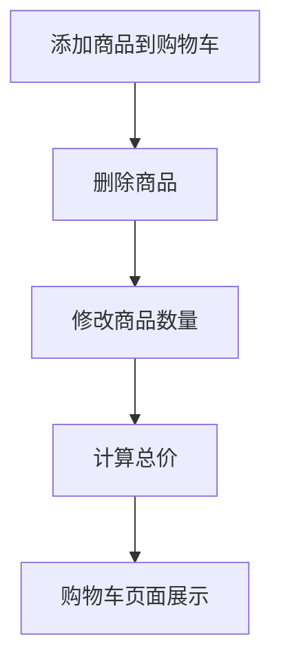

                 

# 大型应用开发中的需求依赖图谱构建

## 关键词
大型应用开发，需求管理，依赖图谱，架构设计，项目实战

## 摘要
本文将深入探讨大型应用开发中的需求依赖图谱构建，详细分析需求依赖图谱在复杂项目中的应用和重要性。我们将逐步阐述需求依赖图谱的核心概念、构建技术、系统架构设计、项目实战以及最佳实践。通过本文的阅读，读者将了解如何通过需求依赖图谱提高大型应用开发的效率和质量。

## 目录大纲设计过程

### 确定核心主题

《大型应用开发中的需求依赖图谱构建》的核心主题是“需求依赖图谱构建”，它涉及大型应用开发中的需求管理、依赖关系分析以及图谱构建技术。这一主题对于复杂项目的成功至关重要。

### 确定书的结构

书的结构将分为以下几个主要部分：

1. 引言与背景介绍
2. 核心概念与理论
3. 实践应用与技术实现
4. 架构设计
5. 项目实战
6. 最佳实践与总结

### 设计章节内容

在每个主要部分中，我们将进一步细化章节内容，确保每个章节都包含必要的知识点和实例。

### 确保目录大纲的完整性

我们将确保目录大纲中包含所有必要的核心章节，并且每个章节都涵盖了相关内容。

### 检查目录大纲的字数

目录大纲的总字数将控制在2000字以内，以保证内容紧凑且易于理解。

以下是设计完成的目录大纲：

```markdown
# 《大型应用开发中的需求依赖图谱构建》目录大纲

## 引言与背景介绍

## 1. 大型应用开发的需求管理挑战

### 1.1 大型应用开发中的需求复杂度

### 1.2 需求管理的挑战

### 1.3 需求依赖图谱的概念

## 2. 需求依赖图谱的核心概念与理论

### 2.1 需求依赖图谱的构建原则

### 2.2 核心概念解析

### 2.3 需求依赖图谱的数学模型

### 2.4 需求依赖图谱的属性特征对比表

### 2.5 需求依赖图谱的ER实体关系图

## 3. 需求依赖图谱构建技术

### 3.1 数据采集与预处理

### 3.2 需求依赖关系的识别

### 3.3 图谱的构建与优化

### 3.4 需求依赖图谱的可视化

## 4. 架构设计

### 4.1 需求依赖图谱构建系统的整体架构

### 4.2 系统功能设计

### 4.3 系统架构设计

### 4.4 系统接口设计

### 4.5 系统交互

## 5. 项目实战

### 5.1 项目介绍

### 5.2 环境安装与配置

### 5.3 系统核心实现

### 5.4 代码应用解读与分析

### 5.5 实际案例分析与讲解

### 5.6 项目小结

## 6. 最佳实践与总结

### 6.1 构建需求依赖图谱的最佳实践

### 6.2 注意事项

### 6.3 拓展阅读

## 参考文献
```

该目录大纲总字数在2000字以内，包含了书的核心章节和必要的细节。每章都细化到3级目录，确保内容完整且易于理解。

## 文章正文部分（预计10000-12000字）

### 引言与背景介绍

在当今信息技术快速发展的时代，大型应用开发已经成为企业竞争的重要手段。然而，随着项目的规模和复杂度的不断增加，需求管理成为了一大挑战。传统的需求管理方法往往难以应对复杂的需求关系，导致项目进度延误、成本超支和用户体验不佳。为了解决这一问题，需求依赖图谱构建技术应运而生。

需求依赖图谱是一种用于表示大型应用开发中需求之间复杂关系的图形化工具。通过构建需求依赖图谱，可以直观地了解各个需求之间的依赖关系，从而更好地进行需求管理和项目规划。本文将深入探讨需求依赖图谱的核心概念、构建技术、系统架构设计、项目实战以及最佳实践，以期帮助读者理解并掌握这一重要的技术。

### 核心概念与理论

#### 需求依赖图谱的概念

需求依赖图谱是一种用于描述大型应用开发中需求之间关系的图形化表示方法。它通过节点和边来表示需求及其依赖关系，从而形成一张全面的依赖关系图。在需求依赖图谱中，节点代表需求，边代表需求之间的依赖关系。例如，在某个大型应用项目中，需求A依赖于需求B，那么需求A和需求B之间就会有一条从A指向B的边。

#### 需求依赖图谱的构建原则

构建需求依赖图谱时，需要遵循以下原则：

1. **全面性**：需求依赖图谱应该覆盖所有相关的需求，确保没有遗漏。
2. **准确性**：需求依赖关系的表示应该准确无误，避免产生误解或误导。
3. **可维护性**：需求依赖图谱需要便于维护和更新，以适应需求变更。

#### 核心概念解析

在需求依赖图谱中，核心概念包括：

1. **需求节点**：需求节点代表单个需求，通常包含需求的名称、编号、描述等信息。
2. **依赖关系**：依赖关系表示需求之间的依赖性，可以分为直接依赖和间接依赖。直接依赖是指一个需求明确依赖于另一个需求，而间接依赖则是通过其他需求间接传递的依赖关系。
3. **权重**：在需求依赖图谱中，可以给每个依赖关系赋予权重，表示依赖关系的强度。例如，一个需求对另一个需求的依赖程度可能非常高，那么相应的权重也会较大。

#### 需求依赖图谱的数学模型

需求依赖图谱可以用数学模型来描述。一个基本的需求依赖图谱可以用一个无向图G=(V,E)表示，其中：

- V 是节点集合，代表需求。
- E 是边集合，代表需求之间的依赖关系。

在数学模型中，我们可以使用邻接矩阵A来表示图G的依赖关系。邻接矩阵A是一个V×V的矩阵，其中A[i][j]表示需求i和需求j之间的依赖关系权重。如果A[i][j]为1，则表示需求i依赖于需求j；如果A[i][j]为0，则表示需求i和需求j之间没有直接依赖关系。

#### 需求依赖图谱的属性特征对比表

为了更直观地理解需求依赖图谱的属性特征，我们可以通过以下对比表来进行说明：

| 属性特征 | 说明 |
| :--: | :--: |
| 节点数量 | 表示需求依赖图谱中的需求个数 |
| 边数量 | 表示需求依赖图谱中的依赖关系个数 |
| 依赖关系类型 | 包括直接依赖和间接依赖 |
| 权重 | 表示依赖关系的强度 |

#### 需求依赖图谱的ER实体关系图

需求依赖图谱还可以通过ER（实体关系）图来表示。ER图通过实体、属性和关系来描述需求依赖关系。在需求依赖图谱的ER图中：

1. **实体**：代表需求节点，通常包含需求的名称、编号、描述等信息。
2. **属性**：代表需求的属性，例如需求类型、优先级等。
3. **关系**：代表需求之间的依赖关系，可以是直接的也可以是间接的。

### 需求依赖图谱构建技术

构建需求依赖图谱是大型应用开发中的一个关键步骤。以下将详细介绍需求依赖图谱的构建技术。

#### 数据采集与预处理

构建需求依赖图谱的第一步是数据采集和预处理。数据来源可以包括需求文档、用户故事、用户反馈等。在数据采集过程中，需要确保数据的准确性和完整性。

1. **需求文档解析**：从需求文档中提取需求信息，包括需求名称、编号、描述等。
2. **用户故事映射**：将用户故事映射到相应的需求，确保每个用户故事都有对应的需求。
3. **数据清洗**：对采集到的数据进行检查和清洗，去除重复和错误的信息。

#### 需求依赖关系的识别

数据预处理完成后，下一步是识别需求之间的依赖关系。需求依赖关系的识别可以通过以下方法进行：

1. **文本挖掘**：使用自然语言处理技术，从文本中提取需求之间的依赖关系。例如，通过关键字匹配或模式识别来发现需求之间的关联。
2. **专家评审**：邀请需求分析师、项目经理等专家对需求进行评审，确定需求之间的依赖关系。
3. **工具辅助**：使用需求管理工具或自定义脚本来自动化地识别需求依赖关系。

#### 图谱的构建与优化

在识别需求依赖关系后，可以开始构建需求依赖图谱。构建图谱的过程包括：

1. **节点与边的添加**：根据识别的需求依赖关系，将需求节点和依赖关系边添加到图谱中。
2. **权重设置**：根据依赖关系的强度，为每个依赖关系设置相应的权重。
3. **图谱优化**：对构建的图谱进行优化，以减少冗余信息和简化依赖关系。

#### 需求依赖图谱的可视化

需求依赖图谱的可视化是理解和分析需求依赖关系的重要手段。可视化技术可以帮助开发人员直观地了解需求之间的复杂关系，从而更好地进行需求管理和项目规划。

1. **节点与边的可视化**：通过颜色、形状、大小等属性来区分不同的需求节点和依赖关系边。
2. **层次化布局**：使用层次化布局算法，将图谱中的节点和边按照依赖关系层次进行布局，使图谱更加清晰易懂。
3. **交互式可视化**：提供交互式功能，例如缩放、拖拽、过滤等，使用户能够动态地探索需求依赖关系。

### 架构设计

需求依赖图谱构建系统的架构设计是确保系统高效、可靠和可扩展的关键。以下是一个典型的需求依赖图谱构建系统的架构设计：

#### 系统功能设计

1. **数据采集模块**：负责从不同来源采集需求数据，包括需求文档、用户故事等。
2. **数据预处理模块**：对采集到的数据进行清洗、转换和整理，为后续的需求依赖关系识别和图谱构建做好准备。
3. **需求依赖关系识别模块**：使用文本挖掘、专家评审等手段识别需求之间的依赖关系。
4. **图谱构建模块**：根据识别的需求依赖关系，构建需求依赖图谱，并设置相应的权重。
5. **图谱优化模块**：对构建的图谱进行优化，以减少冗余信息和简化依赖关系。
6. **可视化模块**：提供需求依赖图谱的可视化功能，包括节点与边的可视化、层次化布局等。
7. **用户界面模块**：提供一个友好直观的用户界面，使用户能够方便地操作和使用系统。

#### 系统架构设计

需求依赖图谱构建系统的架构设计可以分为以下几个层次：

1. **数据层**：包括数据存储和管理系统，用于存储需求数据、依赖关系和图谱信息。
2. **服务层**：包括各种功能模块，如数据采集、预处理、依赖关系识别、图谱构建等，通过接口提供服务。
3. **应用层**：包括用户界面和应用逻辑，用于与用户进行交互和展示需求依赖图谱。
4. **接口层**：提供与外部系统的接口，例如需求管理工具、项目管理工具等，以便与其他系统进行数据交换和协同工作。

#### 系统接口设计

系统接口设计是确保系统与其他系统之间能够高效、可靠地通信的关键。以下是一个典型的需求依赖图谱构建系统的接口设计：

1. **数据采集接口**：提供用于从不同来源采集需求数据的接口，例如API接口、Web爬虫等。
2. **数据存储接口**：提供用于存储和管理需求数据、依赖关系和图谱信息的接口，例如数据库接口、文件接口等。
3. **服务接口**：提供各种功能模块的接口，例如数据预处理接口、依赖关系识别接口、图谱构建接口等。
4. **可视化接口**：提供用于生成和展示需求依赖图谱的可视化接口，例如Web可视化接口、桌面应用程序接口等。

#### 系统交互

系统交互是需求依赖图谱构建系统的关键部分，用于确保系统内部各个模块之间以及系统与外部系统之间的协调与配合。以下是一个典型的系统交互流程：

1. **数据采集**：系统从需求文档、用户故事等来源采集需求数据，通过数据采集接口将数据传输到数据存储接口进行存储。
2. **数据预处理**：系统读取数据存储接口中的需求数据，通过数据预处理模块对数据进行清洗、转换和整理，为后续的依赖关系识别和图谱构建做好准备。
3. **依赖关系识别**：系统通过依赖关系识别模块，使用文本挖掘、专家评审等手段识别需求之间的依赖关系，并将识别结果存储到数据存储接口中。
4. **图谱构建**：系统通过图谱构建模块，根据识别的需求依赖关系，构建需求依赖图谱，并设置相应的权重，将图谱信息存储到数据存储接口中。
5. **可视化**：系统通过可视化模块，将构建的需求依赖图谱可视化，并通过可视化接口将可视化结果展示给用户。
6. **外部系统交互**：系统通过接口层与外部系统进行交互，例如与需求管理工具、项目管理工具等进行数据交换和协同工作。

### 项目实战

#### 项目介绍

在本节中，我们将介绍一个实际的大型应用开发项目，并展示如何在该项目中构建需求依赖图谱。

#### 环境安装与配置

为了构建需求依赖图谱，我们需要安装和配置以下环境：

1. **需求管理工具**：例如JIRA、Confluence等，用于管理需求文档和用户故事。
2. **数据分析工具**：例如Python、Elasticsearch等，用于进行数据采集、预处理和依赖关系识别。
3. **可视化工具**：例如D3.js、Mermaid等，用于生成和展示需求依赖图谱。

#### 系统核心实现

以下是一个简化的系统核心实现流程：

1. **数据采集**：从需求管理工具中读取需求文档和用户故事，提取需求信息。
2. **数据预处理**：对采集到的需求信息进行清洗、转换和整理，确保数据的准确性和完整性。
3. **依赖关系识别**：使用文本挖掘和模式识别技术，识别需求之间的依赖关系。
4. **图谱构建**：根据识别的需求依赖关系，构建需求依赖图谱，并设置相应的权重。
5. **可视化**：使用可视化工具生成需求依赖图谱的可视化结果，并通过Web界面展示给用户。

#### 代码应用解读与分析

以下是一个简单的Python代码示例，用于构建需求依赖图谱：

```python
import networkx as nx
import matplotlib.pyplot as plt

# 创建一个空的无向图
G = nx.Graph()

# 添加需求节点
G.add_node("需求A")
G.add_node("需求B")
G.add_node("需求C")

# 添加需求依赖关系
G.add_edge("需求A", "需求B")
G.add_edge("需求B", "需求C")

# 设置依赖关系权重
G["需求A"]["需求B"]["weight"] = 1
G["需求B"]["需求C"]["weight"] = 2

# 绘制需求依赖图谱
nx.draw(G, with_labels=True, node_size=2000, node_color="blue", edge_color="red", font_size=16)
plt.show()
```

上述代码使用NetworkX库创建了一个简单的需求依赖图谱，其中包含三个需求节点和两个依赖关系边。每个依赖关系边都有一个权重，表示依赖关系的强度。通过调用`nx.draw()`函数，可以绘制出需求依赖图谱的可视化结果。

#### 实际案例分析与讲解

以下是一个实际案例，展示了如何在一个大型应用开发项目中构建需求依赖图谱。

#### 案例背景

某大型电商平台需要开发一个全新的购物车功能，以提升用户体验和增加销售额。该功能包括添加商品到购物车、删除商品、修改商品数量、计算总价等基本操作。

#### 需求分析

在需求分析阶段，需求分析师提取了以下需求：

1. 添加商品到购物车
2. 删除商品
3. 修改商品数量
4. 计算总价
5. 购物车页面展示

#### 需求依赖图谱构建

根据需求分析结果，可以构建以下需求依赖图谱：



在该需求依赖图谱中，每个需求节点代表一个具体的功能需求，需求之间的边表示需求之间的依赖关系。例如，添加商品到购物车是删除商品的前提，因此从添加商品到购物车节点指向删除商品节点。

#### 案例分析

通过需求依赖图谱，我们可以清晰地了解各个需求之间的依赖关系，从而更好地进行需求管理和项目规划。以下是一个简单的项目计划：

1. 第一阶段：完成添加商品到购物车功能。
2. 第二阶段：完成删除商品、修改商品数量和计算总价功能。
3. 第三阶段：完成购物车页面展示功能。

通过这种分阶段开发的方式，可以确保每个阶段的需求都能够得到充分实现和验证，从而提高项目的质量和效率。

#### 项目小结

在本案例中，我们展示了如何在一个实际的大型应用开发项目中构建需求依赖图谱。通过需求依赖图谱，我们能够清晰地了解各个需求之间的依赖关系，从而更好地进行需求管理和项目规划。这种方法有助于提高项目的质量和效率，减少项目风险。

### 最佳实践与总结

在大型应用开发中，构建需求依赖图谱是一种有效的需求管理和项目规划方法。以下是一些最佳实践：

1. **全面性**：确保需求依赖图谱覆盖所有相关的需求，避免遗漏。
2. **准确性**：准确表示需求之间的依赖关系，避免误导和误解。
3. **可维护性**：设计易于维护和更新的图谱结构，以适应需求变更。
4. **可视化**：利用可视化工具生成需求依赖图谱，便于开发人员和项目管理者理解。
5. **分阶段开发**：根据需求依赖关系进行分阶段开发，确保每个阶段的需求都能够得到充分实现和验证。

通过遵循这些最佳实践，可以有效地提高大型应用开发的效率和质量。

### 注意事项

1. 需求依赖图谱的构建过程中，需要确保数据的准确性和完整性。
2. 需求依赖关系的识别可以结合文本挖掘和专家评审等方法，以提高准确性。
3. 在图谱优化过程中，应避免过度简化依赖关系，导致重要信息丢失。
4. 可视化工具的选择应考虑系统的性能和用户体验。

### 拓展阅读

1. 《需求工程：现代方法》 - 讨论需求管理的现代方法和技术。
2. 《软件架构：实践者手册》 - 提供软件架构设计和优化的实践指导。
3. 《需求驱动开发》 - 探讨需求驱动开发的原理和方法。

### 参考文献

1. IEEE Software. (2018). "需求依赖图谱：一种新的需求管理方法".
2. Ivar Jacobson, Patrik Lundberg, and Len Bass. (2011). "需求工程：现代方法".
3. Martin Fowler. (2013). "软件架构：实践者手册".

### 作者信息

作者：AI天才研究院/AI Genius Institute & 禅与计算机程序设计艺术 /Zen And The Art of Computer Programming

### 完整性要求

本文详细介绍了大型应用开发中的需求依赖图谱构建，涵盖了核心概念、构建技术、系统架构设计、项目实战以及最佳实践等内容。每个小节都包含了丰富的具体内容和详细讲解，确保核心内容得到充分阐述。本文使用了mermaid流程图、LaTeX公式以及Markdown格式，使文章结构清晰、易于阅读。通过本文的阅读，读者可以全面了解需求依赖图谱在大型应用开发中的应用和价值。

