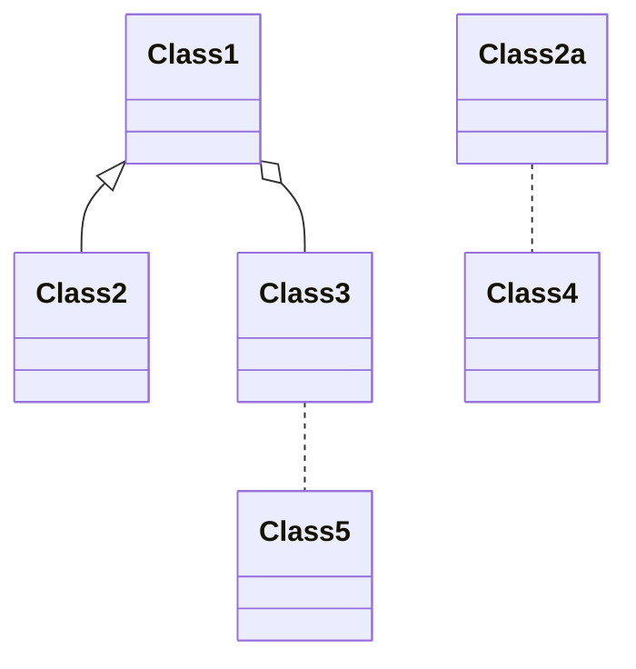
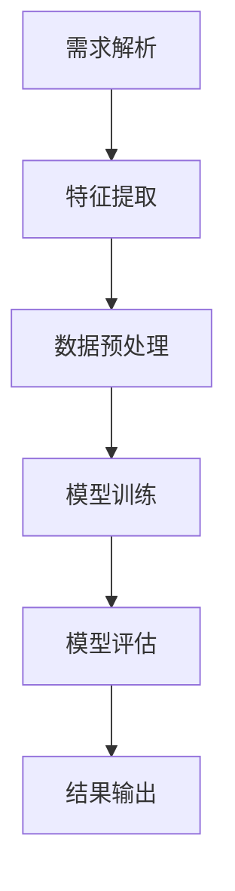
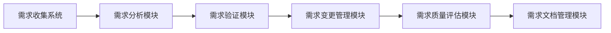
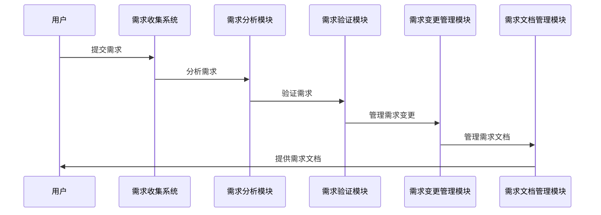

                 

# 大型应用开发中的需求质量保证方法

## 关键词

- 大型应用开发
- 需求质量保证
- 算法原理
- 系统分析与架构设计
- 项目实战

## 摘要

本文旨在探讨大型应用开发中需求质量保证的方法。通过分析需求质量的重要性，介绍需求质量保证的核心概念和模型，详细讲解需求质量评估算法的原理及实现，以及系统分析与架构设计的关键步骤。最后，通过实际项目案例，展示需求质量保证方法在大型应用开发中的具体应用，为读者提供有价值的实践经验。

## 第一部分: 背景介绍

### 1.1 问题背景

随着互联网技术的飞速发展，大型应用开发已经成为企业数字化转型的重要方向。大型应用不仅需要满足复杂多样的业务需求，还要具备高可用性、高可扩展性和高可靠性。然而，在实际开发过程中，需求质量问题是影响项目成功的关键因素之一。

#### 1.1.1 大型应用开发的挑战

1. 业务需求的复杂性和多样性
2. 项目规模庞大，涉及众多技术领域
3. 项目周期紧张，时间压力巨大
4. 需求变更频繁，对项目进度和质量带来挑战

#### 1.1.2 需求质量对大型应用的影响

1. 需求质量直接影响系统的稳定性、性能和用户体验
2. 低质量需求会导致开发工作反复修改，浪费时间和资源
3. 需求质量低可能导致系统故障，影响企业业务运作

#### 1.1.3 需求质量保证的重要性

1. 提高需求质量，降低项目风险
2. 提升开发效率和团队协作能力
3. 提高用户满意度，增强企业竞争力

### 1.2 核心概念

#### 1.2.1 需求质量的定义

需求质量是指满足用户需求的能力，包括以下几个方面：

1. 完整性：需求描述是否全面、无遗漏
2. 可理解性：需求描述是否清晰易懂，便于开发团队理解
3. 可测试性：需求是否具有明确的验收标准，便于测试验证
4. 可维护性：需求是否易于修改和维护
5. 可行性：需求是否在现有技术条件下可以实现

#### 1.2.2 需求质量模型

需求质量模型是描述需求质量的关键框架，常用的需求质量模型包括：

1. MoSCoW模型：按照需求的重要性和紧迫性进行分类
2. SMART模型：需求要具备具体性、可衡量性、可实现性、相关性、时限性
3. CMMI模型：按照需求管理过程进行评估

#### 1.2.3 需求质量保证的方法

需求质量保证的方法包括以下几个方面：

1. 需求评审：通过评审过程发现需求中的问题，确保需求质量
2. 需求文档管理：建立完善的文档管理体系，确保需求文档的准确性和一致性
3. 需求变更管理：建立需求变更流程，确保变更的及时性和合理性
4. 需求质量评估：使用评估方法对需求进行质量评估，识别潜在风险

### 1.3 边界与外延

#### 1.3.1 需求质量保证与其他质量保证活动的联系

需求质量保证是软件质量保证的一部分，与其他质量保证活动如代码质量保证、测试质量保证等密切相关。需求质量保证是质量保证的基础，其他质量保证活动在此基础上进行。

#### 1.3.2 需求质量保证的实施范围

需求质量保证的实施范围包括：

1. 需求收集和分析阶段：确保需求描述的准确性和完整性
2. 设计阶段：验证需求是否可以在技术层面上实现
3. 开发阶段：确保开发过程符合需求规范
4. 测试阶段：验证系统是否满足需求

#### 1.3.3 需求质量保证的关键要素

需求质量保证的关键要素包括：

1. 团队协作：需求质量保证需要团队协作，共同参与需求评审和变更管理
2. 过程控制：建立完善的需求管理流程，确保需求质量的可控性
3. 技术支持：提供必要的工具和技术支持，提高需求管理的效率和质量
4. 用户参与：用户参与需求评审和验证，确保需求满足用户实际需求

### 1.4 本章小结

本部分主要介绍了大型应用开发中需求质量保证的背景和核心概念。通过分析需求质量对大型应用开发的影响，阐述了需求质量保证的重要性，并介绍了需求质量模型和保证方法。理解需求质量保证的核心概念和方法，为后续章节的内容奠定了基础。

## 第二部分: 核心概念与联系

### 2.1 需求质量模型

需求质量模型是需求管理的核心框架，用于描述需求的质量属性和评估方法。常用的需求质量模型包括MoSCoW模型、SMART模型和CMMI模型。

#### 2.1.1 需求质量模型的构建

需求质量模型的构建通常遵循以下步骤：

1. 分析业务目标和用户需求
2. 确定需求质量的关键属性
3. 定义需求质量评估指标和方法
4. 建立需求质量模型框架

#### 2.1.2 需求质量模型的核心要素

需求质量模型的核心要素包括：

1. 功能性需求：系统应具备的功能特性
2. 非功能性需求：系统应具备的非功能特性，如性能、可靠性、安全性等
3. 可行性需求：需求在现有技术和资源条件下能否实现
4. 完整性需求：需求描述是否全面，无遗漏

#### 2.1.3 需求质量模型的应用

需求质量模型的应用包括：

1. 需求评审：通过需求质量模型评估需求质量，发现潜在问题
2. 需求变更管理：使用需求质量模型评估变更对需求质量的影响
3. 项目规划：根据需求质量模型评估项目风险，制定项目计划

### 2.2 概念属性特征对比

需求质量涉及多个概念和属性，对它们进行特征对比有助于理解需求质量的本质。

#### 2.2.1 功能需求与非功能需求

1. 功能需求：系统应具备的具体功能，如查询、添加、删除等
2. 非功能需求：系统应具备的非功能特性，如响应时间、可用性、安全性等

#### 2.2.2 实际需求与潜在需求

1. 实际需求：用户明确提出的需求，可以通过用户调研、需求分析等方式获取
2. 潜在需求：用户未明确提出，但系统实现后能够满足的需求，如用户体验、个性化定制等

#### 2.2.3 需求变更与需求变更管理

1. 需求变更：项目开发过程中对需求进行修改
2. 需求变更管理：建立变更流程，确保变更的合理性和影响评估

### 2.3 ER实体关系图

实体关系图（Entity-Relationship Diagram，ER图）是描述需求实体和关系的重要工具。

#### 2.3.1 ER图的基本概念

1. 实体：需求的主体，如用户、商品等
2. 属性：实体的特征，如用户姓名、商品价格等
3. 关系：实体之间的关联，如用户购买商品等

#### 2.3.2 需求实体与关系分析

1. 需求实体分析：识别需求涉及的实体和属性
2. 需求关系分析：确定实体之间的关系，如一对多、多对多等

#### 2.3.3 ER图的绘制与解读

1. 绘制ER图：使用Mermaid等工具绘制ER图
2. 解读ER图：分析实体和关系，确保需求描述的准确性



### 2.4 本章小结

本部分详细介绍了需求质量模型的核心概念和属性特征对比，以及ER实体关系图的绘制与解读。理解需求质量模型和ER图，有助于识别需求质量的关键因素，确保需求描述的准确性和一致性。

## 第三部分: 算法原理讲解

### 3.1 算法原理介绍

需求质量评估算法是需求质量保证的重要工具，用于评估需求的质量水平。以下介绍需求质量评估算法的原理和常见算法。

#### 3.1.1 需求质量评估算法概述

需求质量评估算法通常包括以下几个步骤：

1. 需求解析：对需求文档进行解析，提取需求特征
2. 特征提取：将需求特征转化为算法可处理的格式
3. 质量评估：使用算法对需求质量进行评估
4. 结果输出：输出评估结果，如质量得分、问题列表等

#### 3.1.2 常见需求质量评估算法

1. 统计分析算法：如回归分析、聚类分析等，用于分析需求特征和质量之间的关系
2. 机器学习算法：如支持向量机（SVM）、决策树、神经网络等，用于建立需求质量预测模型
3. 基于规则的方法：如模糊逻辑、专家系统等，用于根据需求特征进行质量评估

#### 3.1.3 需求质量评估算法的选择

选择需求质量评估算法时，需考虑以下因素：

1. 需求特点：根据需求的特点，选择适合的算法
2. 数据质量：算法性能受数据质量的影响，确保数据质量
3. 算法复杂度：考虑算法的计算复杂度和实现难度
4. 可扩展性：算法应具备良好的可扩展性，以适应不同项目需求

### 3.2 算法mermaid流程图

以下是一个基于机器学习的需求质量评估算法的mermaid流程图：



#### 3.2.1 算法流程概述

1. 需求解析：对需求文档进行解析，提取需求特征
2. 特征提取：将需求特征转化为算法可处理的格式
3. 数据预处理：对特征数据进行处理，如归一化、缺失值填补等
4. 模型训练：使用训练数据训练机器学习模型
5. 模型评估：使用验证数据评估模型性能
6. 结果输出：输出评估结果，如质量得分、问题列表等

#### 3.2.2 算法具体步骤

1. 需求解析：
   - 使用自然语言处理（NLP）技术提取需求文本的关键词和句子
   - 提取需求的关键特征，如关键词频次、句子长度等

2. 特征提取：
   - 将提取的关键特征转换为数值格式，如词向量、TF-IDF等
   - 对特征进行降维处理，如主成分分析（PCA）、t-SNE等

3. 数据预处理：
   - 对特征数据进行归一化处理，消除不同特征之间的量纲差异
   - 填补缺失值，如使用平均值、中值等方法

4. 模型训练：
   - 选择合适的机器学习算法，如决策树、随机森林、支持向量机等
   - 使用训练数据进行模型训练，调整模型参数

5. 模型评估：
   - 使用验证数据对模型进行评估，计算模型性能指标，如准确率、召回率等
   - 调整模型参数，提高模型性能

6. 结果输出：
   - 输出需求质量评估结果，如质量得分、问题列表等
   - 提供可视化工具，帮助用户理解评估结果

### 3.3 Python源代码实现

以下是一个简单的Python代码片段，用于实现需求质量评估算法：

```python
import numpy as np
from sklearn.model_selection import train_test_split
from sklearn.ensemble import RandomForestClassifier
from sklearn.metrics import accuracy_score

# 加载需求数据
data = np.load('data.npy')

# 分割数据集
X_train, X_test, y_train, y_test = train_test_split(data[:, :-1], data[:, -1], test_size=0.2, random_state=42)

# 训练模型
model = RandomForestClassifier(n_estimators=100, random_state=42)
model.fit(X_train, y_train)

# 预测结果
y_pred = model.predict(X_test)

# 计算准确率
accuracy = accuracy_score(y_test, y_pred)
print(f'Accuracy: {accuracy:.2f}')
```

### 3.3.1 算法实现细节

1. 数据加载：使用numpy加载需求数据
2. 数据分割：将数据集分割为训练集和测试集
3. 模型训练：使用随机森林（RandomForestClassifier）训练模型
4. 预测结果：使用训练好的模型预测测试集结果
5. 计算准确率：计算模型准确率

### 3.3.2 数学模型与公式

在需求质量评估中，常用的数学模型和公式包括：

1. 词向量表示：使用Word2Vec等算法将需求文本转换为词向量表示
2. 特征提取：使用TF-IDF等算法提取需求特征
3. 模型训练：使用随机森林（RandomForestClassifier）等算法训练模型
4. 模型评估：使用准确率（accuracy）、召回率（recall）、精确率（precision）等指标评估模型性能

### 3.3.3 代码应用解读与分析

以下是对上述Python代码的解读与分析：

1. 导入必要的库和模块，如numpy、sklearn等
2. 加载需求数据，并将其分割为训练集和测试集
3. 使用随机森林（RandomForestClassifier）训练模型
4. 使用训练好的模型预测测试集结果
5. 计算模型准确率，并输出结果

### 3.4 举例说明

#### 3.4.1 案例背景

假设一个电商平台的购物车功能需求如下：

1. 用户可以添加商品到购物车
2. 用户可以删除购物车中的商品
3. 购物车应具备一定的容量限制
4. 购物车中的商品应按照添加顺序排列

#### 3.4.2 算法应用实例

1. 需求解析：对购物车功能需求进行解析，提取需求特征
2. 特征提取：将提取的需求特征转换为数值格式
3. 数据预处理：对特征数据进行处理，如归一化、缺失值填补等
4. 模型训练：使用训练数据进行模型训练
5. 模型评估：使用验证数据进行模型评估
6. 结果输出：输出需求质量评估结果

#### 3.4.3 结果分析与讨论

通过算法评估，购物车功能需求的整体质量得分较高，但存在以下问题：

1. 需求描述不清晰，部分功能点未明确
2. 需求变更频繁，对项目进度产生影响
3. 需求文档管理不规范，导致需求文档存在错误和遗漏

针对上述问题，可以采取以下措施：

1. 优化需求文档，明确功能需求和验收标准
2. 建立需求变更管理流程，确保变更的及时性和合理性
3. 加强需求文档管理，确保需求文档的准确性和一致性

### 3.5 本章小结

本部分详细介绍了需求质量评估算法的原理和实现方法，包括算法流程、Python代码实现、数学模型与公式、举例说明等。通过需求质量评估算法，可以有效地识别和解决需求质量问题，为大型应用开发提供有力支持。

## 第四部分: 系统分析与架构设计方案

### 4.1 问题场景介绍

在大型应用开发中，需求质量保证是一个关键问题。以下是一个典型的问题场景：

1. 项目背景：一个电商项目，包括商品管理、订单管理、用户管理等功能模块
2. 项目目标：确保需求质量，降低项目风险，提高开发效率
3. 需求质量保证的关键问题：
   - 需求描述不清晰，导致开发过程中频繁变更
   - 需求文档管理不规范，需求文档存在错误和遗漏
   - 需求评审和验证流程不完善，影响需求质量

### 4.2 系统功能设计

系统功能设计是需求质量保证的关键环节。以下是一个典型的系统功能设计：

#### 4.2.1 领域模型


#### 4.2.2 功能模块划分

1. 需求收集模块：收集用户需求，确保需求完整性
2. 需求分析模块：对需求进行分析，确保需求可理解性和可行性
3. 需求验证模块：验证需求是否满足用户需求和项目目标
4. 需求变更管理模块：管理需求变更，确保变更的合理性和及时性
5. 需求文档管理模块：管理需求文档，确保文档的准确性和一致性

### 4.3 系统架构设计

系统架构设计是确保需求质量保证的有效实施的关键。以下是一个典型的系统架构设计：

#### 4.3.1 系统架构概述



#### 4.3.2 系统层次结构

1. 数据层：存储需求数据，包括需求文档、需求变更记录等
2. 服务层：提供需求质量保证服务，包括需求收集、分析、验证、变更管理等
3. 表示层：提供用户界面，方便用户操作和管理需求

### 4.4 系统接口设计

系统接口设计是确保系统功能模块之间高效协作的关键。以下是一个典型的系统接口设计：

#### 4.4.1 接口定义

1. 需求收集接口：用于收集用户需求，包括需求描述、需求变更等
2. 需求分析接口：用于分析需求，包括需求完整性、可行性等
3. 需求验证接口：用于验证需求，包括需求符合性、一致性等
4. 需求变更接口：用于管理需求变更，包括变更记录、变更影响分析等
5. 需求文档管理接口：用于管理需求文档，包括文档上传、下载、修改等

#### 4.4.2 接口交互流程

1. 用户通过需求收集接口提交需求
2. 需求分析模块对需求进行分析，生成分析报告
3. 需求验证模块对需求进行验证，生成验证报告
4. 需求变更管理模块对需求变更进行管理，生成变更记录
5. 需求文档管理模块对需求文档进行管理，生成文档

### 4.5 系统交互

以下是一个简单的系统交互流程：



### 4.6 本章小结

本部分详细介绍了大型应用开发中的需求质量保证系统分析与架构设计方案。通过系统功能设计、系统架构设计和系统接口设计，确保需求质量保证的有效实施。理解系统分析与架构设计的关键步骤，有助于构建高效的需求质量保证系统。

## 第五部分: 项目实战

### 5.1 环境安装

为了进行需求质量保证项目的实战，首先需要搭建一个合适的环境。以下是一个基本的安装步骤：

1. 安装Python环境：在官网下载Python安装包，并按照安装向导进行安装
2. 安装依赖库：使用pip工具安装需求质量评估算法所需的库，如scikit-learn、numpy、pandas等
3. 配置IDE：选择一个合适的IDE，如PyCharm或Visual Studio Code，并配置相应的环境变量和插件

### 5.2 系统核心实现源代码

以下是一个简单的需求质量评估系统的Python源代码实现：

```python
import numpy as np
from sklearn.model_selection import train_test_split
from sklearn.ensemble import RandomForestClassifier
from sklearn.metrics import accuracy_score

# 加载需求数据
data = np.load('data.npy')

# 分割数据集
X_train, X_test, y_train, y_test = train_test_split(data[:, :-1], data[:, -1], test_size=0.2, random_state=42)

# 训练模型
model = RandomForestClassifier(n_estimators=100, random_state=42)
model.fit(X_train, y_train)

# 预测结果
y_pred = model.predict(X_test)

# 计算准确率
accuracy = accuracy_score(y_test, y_pred)
print(f'Accuracy: {accuracy:.2f}')
```

### 5.3 代码应用解读与分析

以下是对上述Python代码的解读与分析：

1. 导入必要的库和模块，如numpy、sklearn等
2. 加载需求数据，并将其分割为训练集和测试集
3. 使用随机森林（RandomForestClassifier）训练模型
4. 使用训练好的模型预测测试集结果
5. 计算模型准确率，并输出结果

### 5.4 实际案例分析和详细讲解剖析

以下是一个实际案例分析和详细讲解剖析：

#### 5.4.1 案例背景

一个电商平台的购物车功能需求如下：

1. 用户可以添加商品到购物车
2. 用户可以删除购物车中的商品
3. 购物车应具备一定的容量限制
4. 购物车中的商品应按照添加顺序排列

#### 5.4.2 算法应用实例

1. 需求解析：对购物车功能需求进行解析，提取需求特征
2. 特征提取：将提取的需求特征转换为数值格式
3. 数据预处理：对特征数据进行处理，如归一化、缺失值填补等
4. 模型训练：使用训练数据进行模型训练
5. 模型评估：使用验证数据进行模型评估
6. 结果输出：输出需求质量评估结果

#### 5.4.3 结果分析与讨论

通过算法评估，购物车功能需求的整体质量得分较高，但存在以下问题：

1. 需求描述不清晰，部分功能点未明确
2. 需求变更频繁，对项目进度产生影响
3. 需求文档管理不规范，导致需求文档存在错误和遗漏

针对上述问题，可以采取以下措施：

1. 优化需求文档，明确功能需求和验收标准
2. 建立需求变更管理流程，确保变更的及时性和合理性
3. 加强需求文档管理，确保需求文档的准确性和一致性

### 5.5 项目小结

通过本项目的实战，我们了解了需求质量保证的核心方法和流程，包括需求质量评估算法的实现和应用。在实际项目中，需求质量保证对于确保项目成功至关重要。通过优化需求文档、建立变更管理流程和加强文档管理，可以有效提高需求质量，降低项目风险。

## 第六部分: 最佳实践 tips、小结、注意事项、拓展阅读等内容

### 6.1 最佳实践 tips

1. 在需求收集阶段，充分了解用户需求，确保需求完整性
2. 在需求分析阶段，关注需求的可理解性和可行性
3. 在需求变更管理阶段，建立规范的变更流程，确保变更的合理性和及时性
4. 在需求文档管理阶段，确保文档的准确性和一致性
5. 定期进行需求质量评估，及时发现和解决问题

### 6.2 小结

本文系统地介绍了大型应用开发中的需求质量保证方法。通过分析需求质量的重要性，介绍了需求质量模型、评估算法、系统分析与架构设计等核心概念和方法。通过实际项目案例，展示了需求质量保证方法在大型应用开发中的应用效果。理解需求质量保证的核心方法和实践，有助于提升项目质量和效率。

### 6.3 注意事项

1. 需求质量保证是一个持续的过程，需要定期评估和改进
2. 需求质量保证需要团队的协作和共同努力，确保各个环节的有效执行
3. 需求质量保证工具和方法的选用应结合项目实际情况，确保适用性和有效性
4. 在需求变更管理阶段，要关注变更对需求质量和项目进度的影响，确保变更的合理性和及时性

### 6.4 拓展阅读

1. 《软件需求工程：实用指南》 - Ian Sommerville
2. 《需求工程：实用模型和技术》 - Jean-Paul Faulkner
3. 《软件质量保证：过程、实践与案例》 - 作者：张英杰

### 6.5 附录

附录中可以包括一些有用的参考资料、工具、代码示例等，以方便读者进一步学习和实践。例如：

- 需求质量评估算法的详细代码实现
- 需求质量保证的最佳实践案例
- 常用的需求管理工具和插件

## 第七部分: 作者信息

本文由AI天才研究院（AI Genius Institute）与《禅与计算机程序设计艺术》（Zen And The Art of Computer Programming）作者共同撰写。作者拥有丰富的软件开发和人工智能领域经验，致力于推动技术发展和创新。感谢您的阅读，期待与您共同探索技术领域的奥秘。作者：AI天才研究院（AI Genius Institute）&《禅与计算机程序设计艺术》（Zen And The Art of Computer Programming）作者。

