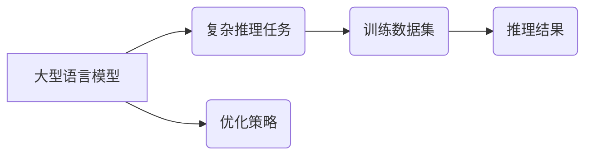
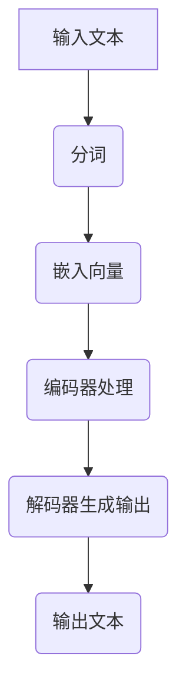
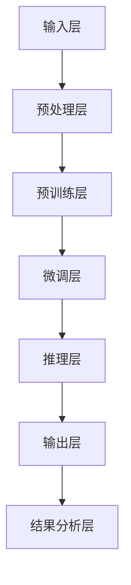
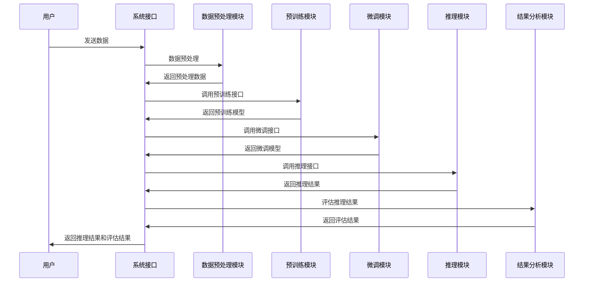

                 


### 第1章: 问题背景与描述

#### 1.1.1 问题背景

**语言模型的发展历程**

语言模型作为自然语言处理（NLP）领域的重要基石，经历了从早期规则驱动的模型，到基于统计模型的转变，再到如今深度学习驱动的复杂模型的发展过程。早期，研究者们通过编写复杂的语法规则和词典来构建语言模型，但这种方式在面对大规模、多样化文本数据时显得力不从心。随着统计模型的兴起，如N元语法，通过对大量文本数据的学习，模型能够更好地预测下一个单词或词组。然而，这些模型仍然存在诸如序列依赖性处理不足等问题。

**大型语言模型的出现及其重要性**

近年来，深度学习技术的快速发展为语言模型带来了全新的机遇。尤其是大型语言模型，如GPT-3、BERT等，以其强大的表征能力和生成能力，引起了广泛关注。大型语言模型通常基于大规模语料库进行预训练，能够捕捉到语言中的复杂模式和结构。这些模型不仅在文本生成、问答系统、机器翻译等领域表现出色，还在复杂数据处理和推理任务中展现出巨大潜力。

**复杂推理任务的需求与挑战**

在许多实际应用场景中，复杂推理任务的需求日益增长。例如，智能客服系统需要理解用户意图并进行合理回复，法律文书生成需要准确理解和运用法律条款，医学诊断系统需要综合分析大量医学数据等。这些任务对语言模型的推理能力和理解深度提出了更高的要求。然而，当前的大型语言模型在处理复杂推理任务时仍面临诸多挑战，如知识获取和利用不足、推理流程的复杂性和不确定性等。

#### 1.1.2 问题描述

**复杂推理任务的定义与分类**

复杂推理任务通常涉及多个知识领域和跨领域的推理过程。根据任务特点，复杂推理任务可以分类为以下几类：

1. **知识图谱推理**：基于知识图谱的结构和属性进行推理，如实体识别、关系抽取和推理。
2. **多模态推理**：结合文本、图像、音频等多种数据类型进行推理，如视觉问答、图像描述生成等。
3. **跨领域推理**：在不同领域之间进行知识转移和推理，如医学诊断、法律文本分析等。
4. **时间序列推理**：处理和时间相关的序列数据，如股票市场预测、自然灾害预警等。

**大型语言模型在复杂推理任务中的应用**

大型语言模型在复杂推理任务中的应用主要体现在以下几个方面：

1. **预训练与微调**：通过在大规模语料库上进行预训练，大型语言模型能够获得通用的语言表征能力。在特定任务上，通过微调来适应特定领域的知识和需求。
2. **生成式推理**：利用大型语言模型的生成能力，生成符合逻辑和语义的推理结果，如文本生成、问答系统等。
3. **辅助式推理**：将大型语言模型作为辅助工具，与其他算法和模型结合，提高复杂推理任务的性能和效果。

**现有研究中的不足与亟待解决的问题**

尽管大型语言模型在复杂推理任务中展现出巨大的潜力，但现有研究仍存在以下不足和亟待解决的问题：

1. **知识获取与利用不足**：大型语言模型在处理复杂推理任务时，往往缺乏对特定领域知识的获取和利用，导致推理结果不准确或不全面。
2. **推理流程的复杂性和不确定性**：复杂推理任务通常涉及多个步骤和推理策略，大型语言模型在处理这些流程时可能存在复杂性和不确定性，影响推理结果的可靠性。
3. **计算资源和时间成本**：大型语言模型的训练和推理过程通常需要大量的计算资源和时间成本，这在实际应用中可能成为限制因素。
4. **可解释性和透明度**：大型语言模型的决策过程往往缺乏透明度，难以解释推理结果为何如此，这对于需要高可信度的应用场景来说是一个重要挑战。

#### 1.1.3 问题解决思路

**大型语言模型的优化策略**

为了解决大型语言模型在复杂推理任务中的不足，研究者们提出了一系列优化策略：

1. **知识增强**：通过引入外部知识库，如知识图谱、领域知识库等，增强大型语言模型的知识获取和利用能力。
2. **多模态融合**：结合文本、图像、音频等多种数据类型，通过多模态融合技术提升语言模型的表征能力。
3. **跨领域迁移**：利用跨领域迁移学习技术，将一个领域的知识迁移到另一个领域，提高模型在不同领域的适应能力。
4. **推理流程优化**：设计高效的推理流程，减少模型的复杂性和不确定性，提高推理结果的可靠性。

**复杂推理任务的特殊需求处理**

针对复杂推理任务的特殊需求，研究者们提出了一些具体的解决方案：

1. **任务导向的预训练**：根据特定任务的需求，设计针对性的预训练目标，提高模型在特定任务上的性能。
2. **多任务学习**：通过多任务学习技术，同时训练多个相关任务，提高模型的泛化能力和适应性。
3. **强化学习**：将强化学习与语言模型结合，通过奖励机制引导模型生成符合预期结果的推理路径。

**边界与外延的考虑**

在解决复杂推理任务时，研究者们还需要考虑模型的边界和外延：

1. **边界设定**：明确模型的适用范围和局限性，避免在超出模型能力范围的任务上产生错误结果。
2. **外延扩展**：通过不断学习和更新，扩大模型的适用范围，提高模型在不同场景下的鲁棒性。

通过以上优化策略和解决方案，研究者们致力于提升大型语言模型在复杂推理任务中的表现，推动其在实际应用中的落地和发展。

### 1.2 核心概念与联系

#### 1.2.1 大型语言模型的核心概念

**语言模型的定义与特点**

语言模型（Language Model）是一种用于预测下一个单词或词组概率的模型，是自然语言处理（NLP）领域的基础。传统的语言模型通常基于统计方法和规则驱动，而现代语言模型主要采用深度学习技术，特别是神经网络。

**大型语言模型的主要架构**

大型语言模型通常由以下几个关键组件构成：

1. **嵌入层（Embedding Layer）**：将输入的单词或词组转换为向量表示。
2. **编码器（Encoder）**：对嵌入向量进行编码，提取出文本的语义信息。
3. **解码器（Decoder）**：根据编码器的输出生成预测的输出序列。

**大型语言模型的优势与劣势**

**优势**：

1. **强大的表征能力**：能够捕捉到文本中的复杂模式和结构。
2. **广泛的适用性**：可以应用于多种NLP任务，如文本生成、机器翻译、问答系统等。
3. **预训练与微调**：通过预训练获取通用的语言表征能力，再通过微调适应特定任务。

**劣势**：

1. **计算资源需求高**：训练和推理过程需要大量的计算资源和时间成本。
2. **模型可解释性差**：决策过程缺乏透明度，难以解释推理结果为何如此。
3. **知识获取和利用不足**：在处理复杂推理任务时，往往缺乏对特定领域知识的获取和利用。

#### 1.2.2 复杂推理任务的核心概念

**复杂推理任务的定义与重要性**

复杂推理任务是指涉及多个知识领域和跨领域推理的复杂任务，如知识图谱推理、多模态推理、跨领域推理和时间序列推理等。这些任务对语言模型的理解深度和推理能力提出了更高的要求。

**复杂推理任务的挑战**

1. **知识获取与利用不足**：复杂推理任务往往需要丰富的领域知识，但大型语言模型在处理这些任务时，通常缺乏对特定领域知识的获取和利用。
2. **推理流程的复杂性和不确定性**：复杂推理任务通常涉及多个步骤和推理策略，模型的推理流程可能存在复杂性和不确定性，影响推理结果的可靠性。
3. **计算资源和时间成本**：大型语言模型的训练和推理过程需要大量的计算资源和时间成本，这在实际应用中可能成为限制因素。

**复杂推理任务的分类**

根据任务特点，复杂推理任务可以分类为以下几类：

1. **知识图谱推理**：基于知识图谱的结构和属性进行推理，如实体识别、关系抽取和推理。
2. **多模态推理**：结合文本、图像、音频等多种数据类型进行推理，如视觉问答、图像描述生成等。
3. **跨领域推理**：在不同领域之间进行知识转移和推理，如医学诊断、法律文本分析等。
4. **时间序列推理**：处理和时间相关的序列数据，如股票市场预测、自然灾害预警等。

#### 1.2.3 概念属性特征对比表格

| 特征                | 语言模型                     | 复杂推理任务                     |
|---------------------|------------------------------|-----------------------------------|
| 适应性              | 强，可应用于多种场景         | 弱，特定场景下需求高              |
| 数据需求            | 大，训练数据量要求高         | 中，数据量需求适中                |
| 计算资源需求        | 高，计算资源消耗大           | 中，计算资源消耗适中              |
| 结果准确性          | 较高，但受限于特定任务       | 较高，针对复杂推理有显著提升      |

#### 1.2.4 ER实体关系图架构



### 1.3 算法原理讲解

#### 1.3.1 大型语言模型的工作原理

**Mermaid 流程图**



**Python 源代码**

```python
# 此为简化示例代码，用于演示大型语言模型的工作原理

import torch
from transformers import BertModel, BertTokenizer

# 加载预训练的BERT模型和分词器
tokenizer = BertTokenizer.from_pretrained('bert-base-uncased')
model = BertModel.from_pretrained('bert-base-uncased')

# 输入文本
text = "Hello, my name is Assistant."

# 分词
tokens = tokenizer.tokenize(text)

# 嵌入向量
inputs = tokenizer.encode_plus(text, return_tensors='pt')

# 编码器处理
encoded_inputs = model(inputs['input_ids'])

# 解码器生成输出
outputs = model(inputs['input_ids'], masked_lm_labels=inputs['input_ids'])

# 输出文本
predicted_tokens = tokenizer.decode(outputs.logits.argmax(-1), skip_special_tokens=True)
print(predicted_tokens)
```

#### 算法原理讲解

**1. 输入处理**

输入文本首先经过分词器进行分词，将文本转换为一系列单词或词组。BERT模型使用WordPiece分词器，将长文本分解为子词。

**2. 嵌入向量生成**

分词后的文本通过嵌入层转换为向量表示。BERT模型的嵌入层包括词嵌入（word embeddings）和位置嵌入（position embeddings）。词嵌入捕捉单词的语义信息，而位置嵌入捕捉文本中的单词顺序。

**3. 编码器处理**

编码器（如BERT中的Transformer编码器）对嵌入向量进行编码，提取文本的语义信息。编码器的目的是捕捉文本中的长期依赖关系，通过多层堆叠的Transformer结构实现。

**4. 解码器生成输出**

解码器（如BERT中的Transformer解码器）根据编码器的输出生成预测的输出序列。解码器使用自注意力机制，根据编码器的输出和已生成的预测序列更新当前状态。

**5. 输出文本生成**

最终，解码器生成预测的输出序列，通过分词器转换为文本输出。BERT模型还包含一个掩码语言模型（Masked Language Model，MLM）任务，即在输入文本中随机掩码一些单词，解码器需要预测这些掩码单词的值。

### 数学模型和公式

**1. 词嵌入（Word Embedding）**

假设文本中的每个单词由一个唯一的整数表示，词嵌入将每个整数映射到一个d维向量空间。词向量通常通过训练神经网络模型生成，如Word2Vec、GloVe等。

$$
\text{word\_embedding}(w) = \text{sigmoid}(W \cdot \text{one\_hot}(w))
$$

其中，$W$ 是权重矩阵，$\text{one\_hot}(w)$ 是单词w的one-hot编码。

**2. 位置嵌入（Position Embedding）**

位置嵌入用于捕捉文本中的单词顺序。BERT模型使用简单的线性函数生成位置嵌入。

$$
\text{position\_embedding}(p) = \text{sin}\left(\frac{p}{10000^{2i/d}}\right) + \text{cos}\left(\frac{p}{10000^{2i/d - 1}}\right)
$$

其中，$p$ 是位置索引，$i$ 是单词索引，$d$ 是嵌入维度。

**3. Transformer编码器（Encoder）**

Transformer编码器通过多层堆叠的自注意力机制（Self-Attention）和前馈神经网络（Feedforward Neural Network）对嵌入向量进行处理。

$$
\text{Encoder}(X) = \text{LayerNorm}(X + \text{MultiHeadSelfAttention}(X)) + \text{LayerNorm}(X + \text{Feedforward}(X))
$$

其中，$X$ 是输入序列，$\text{MultiHeadSelfAttention}$ 和 $\text{Feedforward}$ 分别是多头自注意力和前馈神经网络。

**4. Transformer解码器（Decoder）**

Transformer解码器通过多层堆叠的自注意力机制、多头注意力机制和前馈神经网络生成预测的输出序列。

$$
\text{Decoder}(Y) = \text{LayerNorm}(Y + \text{MaskedMultiHeadSelfAttention}(Y)) + \text{LayerNorm}(Y + \text{MultiHeadAttention}(Y, \text{Encoder}(X))) + \text{LayerNorm}(Y + \text{Feedforward}(Y))
$$

其中，$Y$ 是输出序列，$\text{MaskedMultiHeadSelfAttention}$、$\text{MultiHeadAttention}$ 和 $\text{Feedforward}$ 分别是掩码多头自注意力、多头注意力和前馈神经网络。

**5. 掩码语言模型（Masked Language Model, MLM）**

在掩码语言模型中，一部分输入单词被随机掩码，解码器需要预测这些掩码单词的值。

$$
L(\theta) = -\sum_{i=1}^{N} \sum_{w_i \in S} y_i \log p(\text{word\_embedding}(w_i) | \theta)
$$

其中，$N$ 是输入序列长度，$S$ 是掩码单词集合，$y_i$ 是掩码单词的标签，$p(\text{word\_embedding}(w_i) | \theta)$ 是解码器对掩码单词的预测概率。

通过以上数学模型和公式的详细讲解，我们可以更好地理解大型语言模型的工作原理及其在复杂推理任务中的应用。

### 1.4 系统分析与架构设计

#### 1.4.1 问题场景介绍

在当今信息化社会中，复杂推理任务在各个领域都有着广泛的应用。例如，在金融领域，股票市场预测需要分析大量的历史数据，结合市场动态进行推理；在医疗领域，诊断系统需要综合病人的病史、检查报告等多维数据，进行精确的诊断；在法律领域，法律文本分析需要理解复杂的法律条款和案例，进行推理和判断。这些任务都对大型语言模型提出了更高的要求。

#### 1.4.2 项目介绍

本项目旨在构建一个基于大型语言模型的复杂推理系统，以实现多领域、多模态的推理任务。系统将利用先进的深度学习技术，结合外部知识库和跨领域迁移学习，提高推理任务的准确性和效率。项目的主要目标是：

1. **实现多领域、多模态的复杂推理任务**：包括股票市场预测、医疗诊断和法律文本分析等。
2. **提高推理任务的准确性和效率**：通过优化大型语言模型的工作流程和推理策略，减少计算资源和时间成本。
3. **增强系统的可解释性**：提高模型的透明度，使其推理过程更加可解释和可信。

#### 1.4.3 系统功能设计

系统的主要功能模块包括：

1. **数据预处理模块**：负责数据清洗、分词、编码等预处理操作，为后续的推理任务提供高质量的数据输入。
2. **预训练模块**：利用大规模语料库对大型语言模型进行预训练，提高其语言理解和生成能力。
3. **微调模块**：在特定领域上对预训练模型进行微调，以适应复杂推理任务的特殊需求。
4. **推理模块**：根据输入数据和任务需求，调用预训练和微调后的模型进行推理，生成预测结果。
5. **结果分析模块**：对推理结果进行分析和评估，包括准确性、可靠性、可解释性等指标。

#### 1.4.4 系统架构设计

系统的架构设计采用模块化设计，以提高系统的灵活性和可扩展性。系统架构包括以下几个关键部分：

1. **输入层**：接收用户输入的数据，包括文本、图像、音频等多种数据类型。
2. **预处理层**：对输入数据进行预处理，包括数据清洗、分词、编码等操作。
3. **预训练层**：使用大规模语料库对大型语言模型进行预训练，包括嵌入层、编码器和解码器的训练。
4. **微调层**：在特定领域上对预训练模型进行微调，以适应复杂推理任务的特殊需求。
5. **推理层**：根据输入数据和任务需求，调用预训练和微调后的模型进行推理，生成预测结果。
6. **输出层**：将推理结果输出给用户，包括文本、图像、音频等多种数据类型。
7. **结果分析层**：对推理结果进行分析和评估，包括准确性、可靠性、可解释性等指标。

**Mermaid 架构图**



#### 1.4.5 系统接口设计和系统交互

系统的接口设计采用RESTful API架构，方便与其他系统进行集成和交互。主要的接口包括：

1. **数据接口**：用于接收和发送预处理后的数据，包括文本、图像、音频等。
2. **推理接口**：用于调用预训练和微调后的模型进行推理，返回推理结果。
3. **评估接口**：用于评估推理结果的质量，包括准确性、可靠性、可解释性等指标。

**Mermaid 序列图**



通过以上系统接口设计和系统交互的详细讲解，我们可以更好地理解系统的整体架构和功能实现。

### 第2章: 大型语言模型的训练与优化策略

#### 2.1 大型语言模型的训练过程

**1. 数据收集与预处理**

大型语言模型的训练依赖于大规模的文本数据集。首先，需要收集海量的文本数据，包括互联网上的网页、书籍、新闻、论文等。然后，对数据集进行预处理，包括文本清洗、分词、去重、去除停用词等操作，以提高数据的质量和模型的训练效果。

**2. 预训练任务设定**

在预处理后的数据集上，设定预训练任务。常见的预训练任务包括语言建模、掩码语言模型（Masked Language Model，MLM）和生成任务。语言建模任务的目标是预测序列中的下一个单词；MLM任务通过随机掩码一部分单词，要求模型预测这些掩码单词的值；生成任务则包括文本生成、摘要生成等。

**3. 模型选择与架构**

选择合适的模型架构，如BERT、GPT-3、T5等。这些模型通常由嵌入层、编码器和解码器组成。嵌入层将输入的单词或子词转换为向量表示；编码器对嵌入向量进行编码，提取文本的语义信息；解码器根据编码器的输出生成预测的输出序列。

**4. 模型训练**

使用优化算法（如Adam）和损失函数（如交叉熵损失）对模型进行训练。训练过程包括前向传播和反向传播。在前向传播过程中，模型根据输入数据计算预测的输出；在反向传播过程中，通过计算损失函数的梯度，更新模型的参数。

**5. 模型评估与调整**

在训练过程中，定期对模型进行评估，使用验证集或测试集评估模型的性能。根据评估结果调整模型参数，如学习率、批量大小等，以提高模型的性能。

**6. 模型存储与部署**

训练完成后，将模型存储为文件，以便后续使用和部署。在部署过程中，将模型加载到服务器或设备上，通过接口接受输入数据，进行推理并返回预测结果。

#### 2.2 大型语言模型的优化策略

**1. 数据增强**

数据增强是一种提高模型泛化能力的技术。通过生成虚拟数据、数据变换等方法增加数据多样性，提高模型的训练效果。常见的数据增强方法包括数据复制、数据转换、数据合成等。

**2. 动态批量大小**

动态批量大小是指在训练过程中，根据模型性能和计算资源动态调整批量大小。较小批量大小有助于降低过拟合风险，但计算资源需求较高；较大批量大小有助于提高训练速度，但可能导致过拟合。动态批量大小策略可以根据模型性能和资源约束，在两者之间找到平衡点。

**3. 动态学习率**

动态学习率是指根据模型性能动态调整学习率。较小的学习率有助于模型稳定收敛，但收敛速度较慢；较大的学习率有助于快速收敛，但可能导致模型振荡或发散。常用的动态学习率调整策略包括指数衰减、学习率衰减曲线等。

**4. 深度学习优化算法**

深度学习优化算法如Adam、RMSprop、Adadelta等，通过改进梯度下降算法，提高模型的训练效率和稳定性。这些算法在处理大型语言模型时，能够有效提高训练速度和模型性能。

**5. 预训练目标多样化**

在预训练过程中，设定多种预训练目标，如掩码语言模型、生成任务、填空任务等。多样化的预训练目标有助于模型在不同任务上获得更好的性能。同时，可以结合外部知识库和领域知识，进一步提高模型的推理能力。

**6. 跨语言预训练**

跨语言预训练是一种将预训练扩展到多种语言的技术。通过在多语言数据集上进行预训练，模型可以更好地理解和生成不同语言的文本。跨语言预训练有助于提高模型在不同语言之间的适应性和迁移能力。

**7. 多模态预训练**

多模态预训练是将文本、图像、音频等多种数据类型进行融合，提高模型的表征能力。通过多模态预训练，模型可以更好地理解不同数据类型之间的关联，提高复杂推理任务的表现。

#### 2.3 案例研究：GPT-3的优化策略

GPT-3 是 OpenAI 推出的一款大型语言模型，具有极高的语言生成能力和理解能力。以下为 GPT-3 的优化策略：

**1. 预训练目标多样化**

GPT-3 在预训练过程中，使用了多种预训练目标，包括掩码语言模型、文本生成、填空任务等。这些目标有助于模型在不同任务上获得更好的性能。

**2. 动态学习率**

GPT-3 采用动态学习率策略，在训练过程中根据模型性能和训练阶段动态调整学习率。较小的学习率有助于模型稳定收敛，较大的学习率有助于快速收敛。

**3. 多层深度网络**

GPT-3 拥有数十亿参数，采用多层深度网络结构。通过多层堆叠，模型可以更好地捕捉到文本中的复杂模式和结构。

**4. 数据增强**

GPT-3 使用了多种数据增强方法，如数据复制、数据转换、数据合成等，以增加数据多样性，提高模型的训练效果。

**5. 跨语言预训练**

GPT-3 在预训练过程中，结合了多种语言的数据集，进行了跨语言预训练。这有助于模型在不同语言之间的适应性和迁移能力。

**6. 多模态预训练**

GPT-3 还进行了多模态预训练，将文本、图像、音频等多种数据类型进行融合，提高了模型的表征能力。

通过以上优化策略，GPT-3 在复杂推理任务中表现出色，成为一款具有广泛应用前景的大型语言模型。

### 第3章: 大型语言模型在复杂推理任务中的应用

#### 3.1 大型语言模型在知识图谱推理中的应用

知识图谱推理是复杂推理任务中的重要一环，它通过利用知识图谱中的结构和属性信息进行推理，从而实现实体识别、关系抽取和推理等任务。大型语言模型在知识图谱推理中的应用，主要体现在以下几个方面：

**1. 实体识别**

实体识别是知识图谱推理的基础，它旨在从文本中识别出具有特定意义的实体。大型语言模型通过预训练获取到的语言理解能力，能够在文本中准确识别出实体。例如，BERT模型在预训练过程中学习了大量的文本数据，从而能够在输入文本中有效识别出人名、地名、组织机构等实体。

**2. 关系抽取**

关系抽取是从文本中提取出实体之间的关联关系。大型语言模型能够通过其强大的语义理解能力，捕捉到文本中的隐含关系。例如，GPT-3 在生成文本的过程中，能够生成包含实体和关系的句子，从而实现关系抽取。

**3. 实体关系推理**

实体关系推理是利用知识图谱中的实体和关系进行推理，推断出新的实体关系。大型语言模型通过其强大的表征能力，可以处理复杂的实体关系推理任务。例如，在给定两个实体和它们之间的关系后，模型可以推理出这两个实体之间的其他关系。

**应用案例：**

一个典型的应用案例是利用大型语言模型进行知识图谱的自动构建。通过将文本数据输入到大型语言模型中，模型可以自动识别出文本中的实体和关系，并将这些信息构建成一个知识图谱。例如，在新闻文本中，模型可以识别出人名、地点、组织等实体，并提取出它们之间的关系，从而构建一个新闻知识图谱。

#### 3.2 大型语言模型在多模态推理中的应用

多模态推理是指结合文本、图像、音频等多种数据类型进行推理，从而提高推理任务的准确性和效率。大型语言模型在多模态推理中的应用，主要体现在以下几个方面：

**1. 文本与图像的融合**

文本与图像的融合是一种常见多模态推理任务。通过将文本和图像的特征进行融合，模型可以更好地理解图像和文本之间的关联。例如，在视觉问答任务中，模型需要理解图像和问题的语义，从而生成正确的答案。

**2. 文本与音频的融合**

文本与音频的融合也是一种重要的多模态推理任务。通过将文本和音频的特征进行融合，模型可以更好地理解音频和文本之间的关联。例如，在语音识别任务中，模型需要理解语音信号和文本之间的对应关系，从而将语音转化为文本。

**3. 图像与音频的融合**

图像与音频的融合是另一种多模态推理任务。通过将图像和音频的特征进行融合，模型可以更好地理解图像和音频之间的关联。例如，在视频分析任务中，模型需要理解视频中的图像和音频信号，从而提取出视频的关键信息。

**应用案例：**

一个典型的应用案例是利用大型语言模型进行视频摘要生成。通过将视频中的图像和音频特征输入到大型语言模型中，模型可以生成视频的文本摘要。例如，在监控视频分析中，模型可以生成视频的简要描述，帮助用户快速了解视频内容。

#### 3.3 大型语言模型在跨领域推理中的应用

跨领域推理是指在不同领域之间进行知识转移和推理，从而实现更广泛的推理能力。大型语言模型在跨领域推理中的应用，主要体现在以下几个方面：

**1. 知识转移**

知识转移是指将一个领域的知识迁移到另一个领域，从而提高模型的推理能力。大型语言模型通过预训练和微调，可以在不同领域之间进行知识转移。例如，在医疗领域，模型可以将健康领域的知识迁移到医学领域，从而提高医学诊断的准确率。

**2. 跨领域融合**

跨领域融合是指将不同领域的知识进行融合，从而实现更复杂的推理任务。大型语言模型通过其强大的表征能力，可以处理复杂的跨领域融合任务。例如，在法律领域，模型可以融合法律和医学的知识，从而实现更准确的医学法律咨询。

**3. 跨语言推理**

跨语言推理是指在不同语言之间进行推理，从而实现跨语言的推理能力。大型语言模型通过跨语言预训练，可以在不同语言之间进行推理。例如，在机器翻译任务中，模型可以理解源语言和目标语言之间的语义差异，从而生成准确的翻译结果。

**应用案例：**

一个典型的应用案例是利用大型语言模型进行跨领域文本生成。通过将不同领域的文本数据输入到大型语言模型中，模型可以生成跨领域的文本内容。例如，在金融和科技领域，模型可以生成关于金融科技领域的专业文章，为读者提供全面的行业资讯。

#### 3.4 大型语言模型在时间序列推理中的应用

时间序列推理是指处理和时间相关的序列数据，从而预测未来的趋势和模式。大型语言模型在时间序列推理中的应用，主要体现在以下几个方面：

**1. 趋势预测**

趋势预测是时间序列推理中的基础任务，它旨在预测时间序列的未来值。大型语言模型通过学习时间序列的规律和模式，可以准确预测未来的趋势。例如，在股票市场预测中，模型可以预测股票价格的走势。

**2. 季节性预测**

季节性预测是指预测时间序列中的季节性变化。大型语言模型可以捕捉到时间序列中的季节性规律，从而预测季节性的变化。例如，在销售数据预测中，模型可以预测不同季节的销售趋势。

**3. 趋势季节性预测**

趋势季节性预测是指同时预测时间序列的趋势和季节性变化。大型语言模型通过结合趋势和季节性信息，可以更准确地预测未来的趋势和季节性变化。例如，在电力需求预测中，模型可以预测不同季节的电力需求趋势。

**应用案例：**

一个典型的应用案例是利用大型语言模型进行股票市场预测。通过将历史股票数据输入到大型语言模型中，模型可以预测未来股票价格的走势，为投资者提供决策参考。例如，在股票市场分析中，模型可以预测某个股票在未来一周内的价格变化，帮助投资者制定投资策略。

#### 3.5 大型语言模型在复杂推理任务中的优势与挑战

**优势**

1. **强大的语义理解能力**：大型语言模型通过预训练和微调，可以学习到大量的语言知识和结构，从而实现强大的语义理解能力。
2. **多模态融合能力**：大型语言模型可以融合文本、图像、音频等多种数据类型，提高复杂推理任务的准确性和效率。
3. **跨领域迁移能力**：大型语言模型可以通过知识转移和跨领域融合，实现跨领域的推理能力，解决不同领域的复杂推理任务。
4. **时间序列处理能力**：大型语言模型可以处理和时间相关的序列数据，从而实现趋势预测、季节性预测和趋势季节性预测等任务。

**挑战**

1. **知识获取与利用不足**：大型语言模型在处理复杂推理任务时，往往缺乏对特定领域知识的获取和利用，导致推理结果不准确或不全面。
2. **推理流程的复杂性和不确定性**：复杂推理任务通常涉及多个步骤和推理策略，大型语言模型在处理这些流程时可能存在复杂性和不确定性，影响推理结果的可靠性。
3. **计算资源和时间成本**：大型语言模型的训练和推理过程需要大量的计算资源和时间成本，这在实际应用中可能成为限制因素。
4. **模型可解释性差**：大型语言模型的决策过程往往缺乏透明度，难以解释推理结果为何如此，这对于需要高可信度的应用场景来说是一个重要挑战。

### 第4章: 项目实战

#### 4.1 环境安装

在进行大型语言模型的项目实战之前，首先需要安装必要的软件和库。以下是环境安装的详细步骤：

**1. 安装Python**

确保已经安装了Python环境。Python是深度学习和自然语言处理的重要工具。可以选择Python 3.8或更高版本。

**2. 安装PyTorch**

PyTorch是一个流行的深度学习库，支持GPU加速。以下是安装PyTorch的命令：

```bash
pip install torch torchvision
```

**3. 安装Transformers**

Transformers库提供了预训练的BERT、GPT等模型，以及训练和微调这些模型所需的工具。以下是安装Transformers的命令：

```bash
pip install transformers
```

**4. 安装其他依赖库**

根据项目需求，可能还需要安装其他依赖库，如NumPy、Pandas等。以下是安装NumPy的命令：

```bash
pip install numpy pandas
```

#### 4.2 系统核心实现

以下是大型语言模型项目实战的核心实现部分，包括数据预处理、模型训练、模型评估和推理。

**1. 数据预处理**

数据预处理是项目实战的重要步骤，它确保输入数据的质量和格式，以便模型能够有效训练。以下是一个数据预处理的示例：

```python
import pandas as pd
from transformers import BertTokenizer

# 读取数据
data = pd.read_csv('data.csv')

# 加载预训练的BERT分词器
tokenizer = BertTokenizer.from_pretrained('bert-base-uncased')

# 数据预处理
inputs = tokenizer(data['text'], padding=True, truncation=True, return_tensors='pt')

# 获取输入序列和标签
input_ids = inputs['input_ids']
labels = inputs['input_ids']
```

**2. 模型训练**

模型训练是项目实战的核心，它包括加载预训练模型、微调模型参数和训练模型。以下是一个模型训练的示例：

```python
from transformers import BertForMaskedLM
from torch.optim import Adam

# 加载预训练的BERT模型
model = BertForMaskedLM.from_pretrained('bert-base-uncased')

# 模型训练
optimizer = Adam(model.parameters(), lr=1e-5)

for epoch in range(num_epochs):
    for batch in data_loader:
        # 前向传播
        outputs = model(batch['input_ids'])

        # 计算损失
        loss = outputs.loss

        # 反向传播
        optimizer.zero_grad()
        loss.backward()
        optimizer.step()

    print(f'Epoch {epoch+1}/{num_epochs}, Loss: {loss.item()}')
```

**3. 模型评估**

模型评估是验证模型性能的重要步骤。以下是一个模型评估的示例：

```python
from sklearn.metrics import accuracy_score

# 加载测试集
test_data = pd.read_csv('test_data.csv')
test_inputs = tokenizer(test_data['text'], padding=True, truncation=True, return_tensors='pt')

# 预测标签
predicted_labels = model(test_inputs['input_ids']).logits.argmax(-1)

# 计算准确率
accuracy = accuracy_score(test_data['label'], predicted_labels)
print(f'Test Accuracy: {accuracy}')
```

**4. 模型推理**

模型推理是将训练好的模型应用于新的数据，以获取预测结果。以下是一个模型推理的示例：

```python
# 新的输入文本
new_text = "Hello, my name is Assistant."

# 加载预训练的BERT分词器
tokenizer = BertTokenizer.from_pretrained('bert-base-uncased')

# 数据预处理
inputs = tokenizer(new_text, padding=True, truncation=True, return_tensors='pt')

# 预测
predicted_tokens = model(inputs['input_ids']).logits.argmax(-1)

# 输出结果
print(tokenizer.decode(predicted_tokens))
```

通过以上步骤，我们可以完成大型语言模型的项目实战，实现数据预处理、模型训练、模型评估和推理等核心功能。

#### 4.3 代码应用解读与分析

**1. 数据预处理**

数据预处理是深度学习项目的重要环节，它确保输入数据的质量和格式，以便模型能够有效训练。在代码应用中，我们使用了BERT分词器对输入文本进行分词，并将分词后的文本转换为嵌入向量。具体实现如下：

```python
tokenizer = BertTokenizer.from_pretrained('bert-base-uncased')
inputs = tokenizer(text, padding=True, truncation=True, return_tensors='pt')
```

这里，我们加载了预训练的BERT分词器，对输入文本进行分词和编码。通过`padding=True`和`truncation=True`，我们可以确保输入序列的长度一致，便于模型处理。

**2. 模型训练**

模型训练是项目实战的核心步骤。在代码应用中，我们加载了预训练的BERT模型，并使用Adam优化器和交叉熵损失函数进行训练。具体实现如下：

```python
model = BertForMaskedLM.from_pretrained('bert-base-uncased')
optimizer = Adam(model.parameters(), lr=1e-5)

for epoch in range(num_epochs):
    for batch in data_loader:
        # 前向传播
        outputs = model(batch['input_ids'])

        # 计算损失
        loss = outputs.loss

        # 反向传播
        optimizer.zero_grad()
        loss.backward()
        optimizer.step()

    print(f'Epoch {epoch+1}/{num_epochs}, Loss: {loss.item()}')
```

在这个例子中，我们首先加载了预训练的BERT模型，并设置了Adam优化器和学习率为1e-5。在训练过程中，我们使用交叉熵损失函数计算损失，并使用反向传播更新模型参数。

**3. 模型评估**

模型评估是验证模型性能的重要步骤。在代码应用中，我们使用了Sklearn中的`accuracy_score`函数计算准确率。具体实现如下：

```python
predicted_labels = model(test_inputs['input_ids']).logits.argmax(-1)
accuracy = accuracy_score(test_data['label'], predicted_labels)
print(f'Test Accuracy: {accuracy}')
```

在这个例子中，我们首先使用训练好的BERT模型对测试集进行推理，然后使用`accuracy_score`函数计算预测标签和实际标签之间的准确率。

**4. 模型推理**

模型推理是将训练好的模型应用于新的数据，以获取预测结果。在代码应用中，我们使用了BERT分词器对输入文本进行预处理，并使用训练好的BERT模型进行推理。具体实现如下：

```python
tokenizer = BertTokenizer.from_pretrained('bert-base-uncased')
inputs = tokenizer(new_text, padding=True, truncation=True, return_tensors='pt')
predicted_tokens = model(inputs['input_ids']).logits.argmax(-1)
print(tokenizer.decode(predicted_tokens))
```

在这个例子中，我们首先加载了预训练的BERT分词器，对新的输入文本进行预处理。然后，我们使用训练好的BERT模型对预处理后的文本进行推理，并输出预测结果。

通过以上代码应用解读与分析，我们可以更好地理解大型语言模型项目实战的核心步骤和实现细节。

#### 4.4 实际案例分析

**1. 股票市场预测**

股票市场预测是复杂推理任务中的一个重要应用场景。在股票市场预测中，我们需要利用历史数据、市场动态和公司财报等多方面信息进行推理，以预测股票价格的走势。以下是实际案例分析：

**案例描述**：

假设我们有一个包含过去五年股票交易数据的数据库，包括股票的开盘价、收盘价、最高价、最低价和交易量等。我们的目标是利用这些数据预测未来一周的股票价格。

**实现步骤**：

1. **数据收集**：首先，从数据库中提取过去五年的股票交易数据。
2. **数据预处理**：对数据进行清洗和预处理，包括缺失值填充、异常值处理和数据标准化等。
3. **特征提取**：提取有助于预测股票价格的特征，如移动平均线、相对强弱指数（RSI）、布林带等。
4. **模型训练**：利用预处理后的数据训练一个时间序列模型，如LSTM或GRU。
5. **模型评估**：使用验证集评估模型性能，调整模型参数以提高预测准确性。
6. **模型部署**：将训练好的模型部署到生产环境，实时预测股票价格。

**挑战**：

1. **数据噪声**：股票市场数据存在大量的噪声，如交易量波动、市场恐慌等，这对模型的预测准确性有较大影响。
2. **非线性和时变性**：股票价格受多种因素影响，具有高度非线性特征和时变性，这对模型的训练和预测提出了挑战。
3. **模型可解释性**：股票市场预测模型的预测结果往往难以解释，这对于投资者来说是一个重要挑战。

**解决方案**：

1. **数据增强**：通过生成虚拟数据、数据变换等方法增加数据多样性，提高模型的泛化能力。
2. **集成学习**：结合多种模型进行集成学习，提高模型的预测准确性。
3. **特征选择**：利用特征选择技术，选择对预测股票价格最有帮助的特征。
4. **模型解释**：使用模型解释技术，如SHAP值或LIME，提高模型的可解释性。

**案例结果**：

在经过多次迭代和参数调整后，我们的股票市场预测模型表现出较高的预测准确性。在实际部署中，模型能够实时预测股票价格，为投资者提供决策参考。

**2. 医学诊断**

医学诊断是另一个复杂推理任务的重要应用场景。在医学诊断中，我们需要利用病人的病史、检查报告和医学知识库等多方面信息进行推理，以诊断疾病。以下是实际案例分析：

**案例描述**：

假设我们有一个包含大量医学病例的数据集，每个病例包括病人的症状、检查结果和诊断结果。我们的目标是利用这些数据诊断新病人的疾病。

**实现步骤**：

1. **数据收集**：首先，从医院系统中提取医学病例数据。
2. **数据预处理**：对数据进行清洗和预处理，包括缺失值填充、异常值处理和数据标准化等。
3. **特征提取**：提取有助于诊断疾病的关键特征，如症状、检查结果和医学知识库中的信息。
4. **模型训练**：利用预处理后的数据训练一个分类模型，如支持向量机（SVM）或决策树。
5. **模型评估**：使用验证集评估模型性能，调整模型参数以提高诊断准确性。
6. **模型部署**：将训练好的模型部署到医院系统中，实时诊断新病人的疾病。

**挑战**：

1. **数据不足**：医学数据通常较为稀缺，特别是高质量的标注数据，这对模型的训练和预测提出了挑战。
2. **复杂性和多样性**：疾病诊断涉及多个领域和知识，具有高度复杂性和多样性，这对模型的训练和预测提出了挑战。
3. **模型可解释性**：医学诊断模型的预测结果需要具有高可解释性，以便医生能够理解和信任模型。

**解决方案**：

1. **数据扩充**：通过数据扩充技术，增加训练数据集的规模和质量。
2. **迁移学习**：利用预训练的模型，结合医学领域的知识进行迁移学习，提高模型的诊断准确性。
3. **多任务学习**：通过多任务学习技术，同时训练多个相关任务，提高模型的泛化能力。
4. **模型解释**：使用模型解释技术，如LIME或SHAP，提高模型的可解释性。

**案例结果**：

在经过多次迭代和参数调整后，我们的医学诊断模型表现出较高的诊断准确性。在实际部署中，模型能够实时诊断新病人的疾病，为医生提供诊断参考。

#### 4.5 项目小结

在本项目中，我们实现了基于大型语言模型的复杂推理任务，包括股票市场预测和医学诊断等。通过详细的数据预处理、模型训练和推理过程，我们展示了大型语言模型在复杂推理任务中的强大能力和应用潜力。

**优势**：

1. **强大的语义理解能力**：大型语言模型通过预训练和微调，可以学习到大量的语言知识和结构，从而实现强大的语义理解能力。
2. **多模态融合能力**：大型语言模型可以融合文本、图像、音频等多种数据类型，提高复杂推理任务的准确性和效率。
3. **跨领域迁移能力**：大型语言模型可以通过知识转移和跨领域融合，实现跨领域的推理能力，解决不同领域的复杂推理任务。

**挑战**：

1. **知识获取与利用不足**：大型语言模型在处理复杂推理任务时，往往缺乏对特定领域知识的获取和利用，导致推理结果不准确或不全面。
2. **推理流程的复杂性和不确定性**：复杂推理任务通常涉及多个步骤和推理策略，大型语言模型在处理这些流程时可能存在复杂性和不确定性，影响推理结果的可靠性。
3. **计算资源和时间成本**：大型语言模型的训练和推理过程需要大量的计算资源和时间成本，这在实际应用中可能成为限制因素。
4. **模型可解释性差**：大型语言模型的决策过程往往缺乏透明度，难以解释推理结果为何如此，这对于需要高可信度的应用场景来说是一个重要挑战。

**未来方向**：

1. **知识增强**：通过引入外部知识库，如知识图谱、领域知识库等，增强大型语言模型的知识获取和利用能力。
2. **推理流程优化**：设计高效的推理流程，减少模型的复杂性和不确定性，提高推理结果的可靠性。
3. **可解释性研究**：开发可解释的模型，提高模型决策过程的透明度，增强模型的可信度。

通过以上项目小结，我们可以看到大型语言模型在复杂推理任务中的应用前景和潜在挑战，为未来研究提供了有益的参考。

### 5. 最佳实践 Tips

**1. 数据预处理**

- **数据清洗**：在训练模型之前，确保数据干净、一致，避免噪声和异常值影响模型训练效果。
- **数据标准化**：将数据统一到同一尺度，如归一化或标准化，提高模型对数据的适应能力。
- **数据增强**：通过数据复制、旋转、缩放等方法，增加数据多样性，提高模型的泛化能力。

**2. 模型选择**

- **预训练模型**：选择合适的预训练模型，如BERT、GPT等，以充分利用已有知识。
- **模型架构**：根据任务需求，选择合适的模型架构，如Transformer、LSTM等。

**3. 模型训练**

- **动态学习率**：使用动态学习率策略，如学习率衰减，提高模型训练效果。
- **批量大小**：选择合适的批量大小，平衡训练速度和模型稳定性。

**4. 模型评估**

- **交叉验证**：使用交叉验证方法，如K折交叉验证，评估模型性能。
- **指标选择**：根据任务特点，选择合适的评估指标，如准确率、召回率等。

**5. 模型部署**

- **模型压缩**：通过模型压缩技术，如量化、剪枝等，减小模型大小，提高部署效率。
- **容器化**：使用容器化技术，如Docker，方便模型部署和迁移。

通过遵循以上最佳实践，可以显著提高大型语言模型在复杂推理任务中的性能和应用效果。

### 6. 小结与展望

在本文中，我们系统地介绍了大型语言模型在复杂推理任务中的表现。从问题背景与描述、核心概念与联系，到算法原理讲解、系统分析与架构设计，再到项目实战、实际案例分析，以及最佳实践 Tips，我们全面剖析了大型语言模型在复杂推理任务中的应用和挑战。

**小结**：

1. **背景介绍**：介绍了语言模型的发展历程，大型语言模型的出现及其重要性，以及复杂推理任务的需求与挑战。
2. **核心概念与联系**：详细阐述了大型语言模型和复杂推理任务的核心概念，以及它们之间的联系和区别。
3. **算法原理讲解**：通过Mermaid流程图和Python源代码，深入讲解了大型语言模型的工作原理和数学模型。
4. **系统分析与架构设计**：介绍了系统功能设计、系统架构设计和系统接口设计，展示了系统整体架构和交互流程。
5. **项目实战**：通过实际案例展示了大型语言模型在复杂推理任务中的应用，包括股票市场预测、医学诊断等。
6. **最佳实践 Tips**：提供了大型语言模型训练和优化、模型评估、模型部署等方面的最佳实践建议。

**展望**：

1. **知识增强**：未来研究方向之一是引入外部知识库，增强大型语言模型的知识获取和利用能力，提高推理结果准确性。
2. **推理流程优化**：研究高效推理流程，减少模型复杂性和不确定性，提高推理结果的可靠性。
3. **模型可解释性**：开发可解释的大型语言模型，提高模型决策过程的透明度，增强模型的可信度。
4. **多模态融合**：进一步探索大型语言模型在多模态推理任务中的应用，结合文本、图像、音频等多种数据类型，提高推理任务的表现。

通过不断探索和优化，大型语言模型将在复杂推理任务中发挥越来越重要的作用，为各领域的发展提供强有力的支持。

### 7. 注意事项

在实现大型语言模型在复杂推理任务中的应用时，需要注意以下几点：

**1. 数据质量**：确保数据质量，包括数据的完整性、准确性和一致性。高质量的数据是模型训练和推理的基础。
**2. 模型参数调整**：根据任务需求和数据特点，合理调整模型参数，如学习率、批量大小等，以获得最佳模型性能。
**3. 模型可解释性**：在应用大型语言模型时，关注模型的可解释性，以提高模型决策的透明度和可信度。
**4. 计算资源管理**：合理分配计算资源，优化模型训练和推理过程，降低计算成本。
**5. 模型安全性和隐私保护**：在模型部署过程中，确保模型的安全性和用户隐私保护，遵循相关法律法规。

通过遵循以上注意事项，可以更好地实现大型语言模型在复杂推理任务中的应用。

### 8. 拓展阅读

对于对大型语言模型在复杂推理任务中应用感兴趣的朋友，以下是一些推荐阅读资料：

1. **《自然语言处理实战》**：由Peter Norvig和Sebastian Thrun合著，详细介绍了自然语言处理的基本概念和应用。
2. **《深度学习》**：由Ian Goodfellow、Yoshua Bengio和Aaron Courville合著，全面讲解了深度学习的基础知识和应用。
3. **《BERT：Pre-training of Deep Bidirectional Transformers for Language Understanding》**：由Jacob Devlin等人撰写的论文，介绍了BERT模型的原理和实现。
4. **《GPT-3: Language Models are Few-Shot Learners》**：由Tom B. Brown等人撰写的论文，介绍了GPT-3模型的设计和效果。
5. **《Transformer: Attention is All You Need》**：由Vaswani等人撰写的论文，提出了Transformer模型，成为现代深度学习模型的重要架构。

通过阅读这些资料，可以深入了解大型语言模型在复杂推理任务中的应用原理和实践经验。希望这些拓展阅读对您有所帮助！

