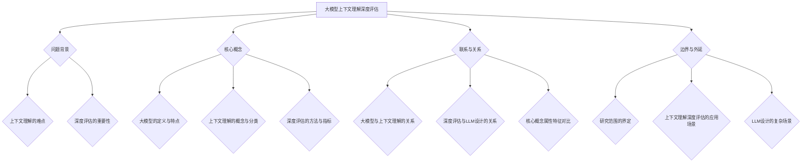
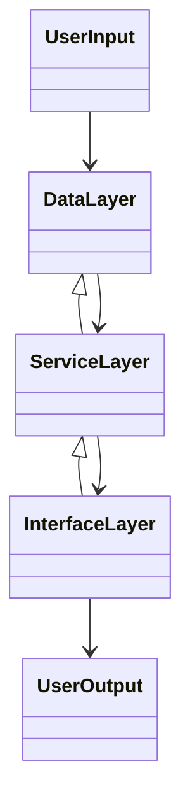
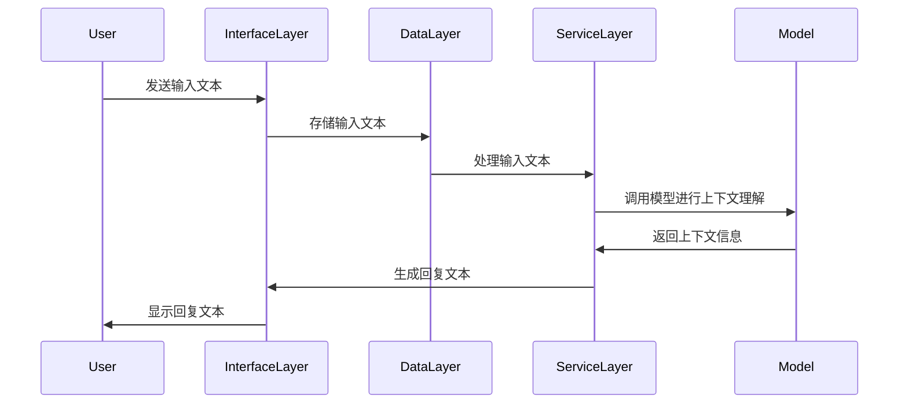
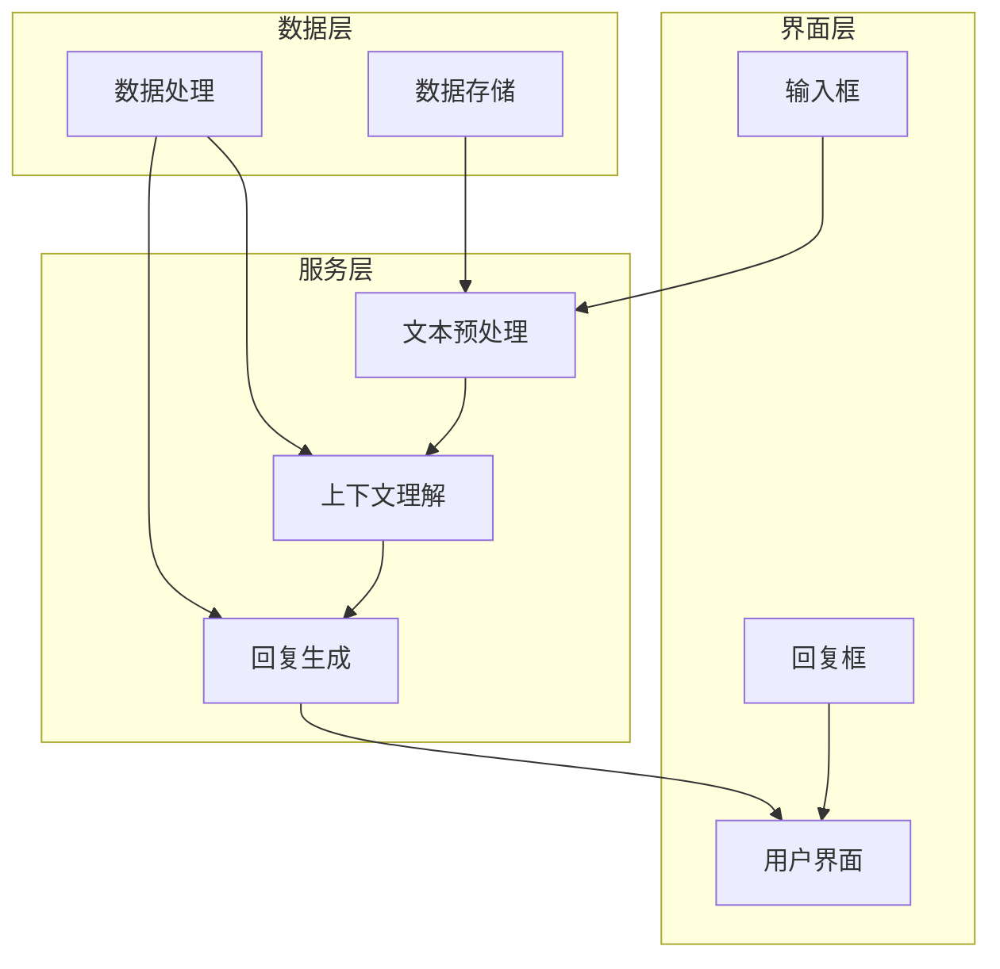
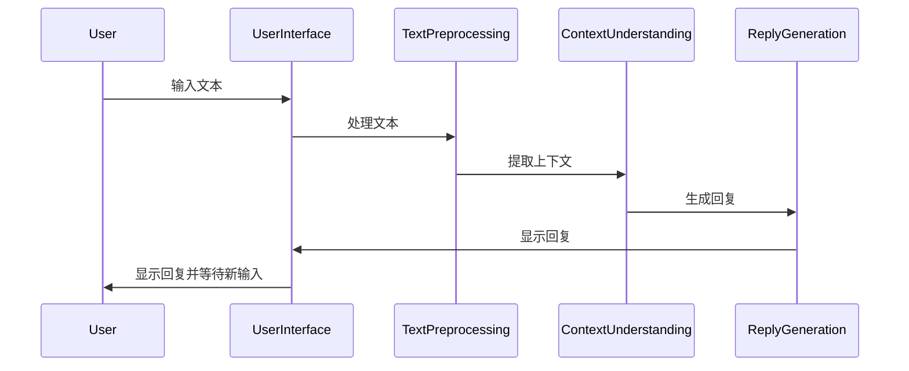

                 

### 文章标题

《大模型上下文理解深度评估：LLM设计的复杂场景》

> 关键词：大型语言模型，上下文理解，深度评估，复杂场景，LLM设计

> 摘要：本文探讨了大型语言模型（LLM）在复杂场景中的上下文理解问题，分析了当前LLM设计中存在的挑战和瓶颈。通过深度评估方法对LLM的上下文理解能力进行详细剖析，旨在为未来的LLM设计提供有价值的参考和指导。

## 第一部分：背景介绍与核心概念

### 1.1 问题背景

#### 1.1.1 大模型的发展与挑战

随着深度学习技术的不断进步，大型语言模型（LLM）在自然语言处理领域取得了显著成果。LLM能够处理复杂的语言任务，如文本生成、翻译、问答等，表现出强大的性能。然而，随着模型规模的不断扩大，LLM的设计和优化面临新的挑战。尤其是在上下文理解方面，大模型表现出色但并非完美无缺。

#### 1.1.2 上下文理解的难点

上下文理解是自然语言处理的核心问题之一，涉及到词义消歧、语义角色标注、指代消解等任务。大模型在上下文理解方面具有一定的优势，但同时也面临着以下难点：

1. **信息过载**：大型模型处理大量文本数据时，如何有效地筛选和利用关键信息成为一个挑战。
2. **语义连贯性**：上下文理解的准确性直接影响到语义连贯性，如何在复杂的场景中保持语义一致性是一个难题。
3. **长距离依赖**：在长文本中，如何处理长距离依赖关系，确保上下文的连贯性和准确性。

#### 1.1.3 深度评估的重要性

深度评估是评估LLM上下文理解能力的重要手段。通过深度评估，我们可以了解大模型在特定场景中的表现，发现存在的问题和瓶颈。深度评估的重要性体现在以下几个方面：

1. **性能衡量**：深度评估提供了量化指标，帮助我们了解大模型在上下文理解方面的表现，从而评估模型的性能。
2. **问题诊断**：通过深度评估，我们可以发现大模型在特定任务中的问题，为后续的优化提供方向。
3. **指导设计**：深度评估结果可以为LLM的设计提供参考，指导我们在模型架构、训练策略等方面进行改进。

### 1.2 核心概念

#### 1.2.1 大模型的定义与特点

大模型通常指的是参数量达到亿级别乃至十亿级别以上的深度学习模型。这些模型具有以下特点：

1. **规模庞大**：大模型的参数量和计算量巨大，需要高效的训练和推理算法。
2. **学习能力强大**：大模型通过大规模数据训练，能够捕捉到复杂的语言规律和模式。
3. **泛化能力较好**：大模型在训练数据集之外的数据上也能保持较好的性能。

#### 1.2.2 上下文理解的概念与分类

上下文理解是指模型在处理自然语言时，根据上下文信息来理解词义、语义角色和指代关系的能力。根据任务的复杂性，上下文理解可以分为以下几类：

1. **词义消歧**：在同一句子中，同一词语可能具有不同的含义，词义消歧任务是确定词语的具体含义。
2. **语义角色标注**：对句子中的词语进行角色标注，如主语、谓语、宾语等。
3. **指代消解**：处理指代关系，如“他”指代的是句子中的哪个实体。

#### 1.2.3 深度评估的方法与指标

深度评估方法主要包括以下几种：

1. **自动化评估方法**：使用预定义的评估指标（如准确率、召回率、F1值等）对模型进行评估。
2. **人工评估方法**：通过人工评价来评估模型的表现，通常用于较为复杂和主观的任务。
3. **对抗性评估方法**：通过对抗性样本来评估模型对异常输入的鲁棒性。

深度评估指标主要包括：

1. **精确度（Precision）**：正确识别的实体数量与识别出的总实体数量的比例。
2. **召回率（Recall）**：正确识别的实体数量与实际存在的实体数量的比例。
3. **F1值（F1 Score）**：精确度和召回率的调和平均值，用于综合评估模型的性能。

### 1.3 联系与关系

#### 1.3.1 大模型与上下文理解的关系

大模型在上下文理解方面具有一定的优势，但其表现也受到上下文信息的影响。大模型需要通过有效的上下文信息处理机制，来提高上下文理解能力。

#### 1.3.2 深度评估与LLM设计的关系

深度评估是LLM设计过程中不可或缺的一环。通过深度评估，我们可以了解模型在上下文理解方面的性能，发现存在的问题，从而指导后续的模型设计和优化。

#### 1.3.3 核心概念属性特征对比

| 核心概念 | 特征 | 说明 |
| --- | --- | --- |
| 大模型 | 规模庞大 | 指参数量达到亿级别乃至十亿级别以上的深度学习模型 |
| 上下文理解 | 信息过载 | 需要有效地筛选和利用关键信息 |
| 深度评估 | 性能衡量 | 通过量化指标了解模型在上下文理解方面的表现 |

### 1.4 边界与外延

#### 1.4.1 研究范围的界定

本文主要探讨大模型在上下文理解方面的深度评估问题，重点研究大型语言模型（LLM）的上下文理解能力及其评估方法。

#### 1.4.2 上下文理解深度评估的应用场景

上下文理解深度评估的应用场景包括但不限于：

1. **文本生成**：通过评估模型在文本生成任务中的上下文理解能力，优化生成质量。
2. **问答系统**：评估模型在问答任务中的上下文理解能力，提高问答系统的准确性和实用性。
3. **语义角色标注**：评估模型在语义角色标注任务中的上下文理解能力，提高标注的准确性。

#### 1.4.3 大模型上下文理解深度评估的挑战

大模型上下文理解深度评估面临以下挑战：

1. **数据集多样性**：评估数据集需要涵盖各种场景，以全面评估模型的上下文理解能力。
2. **评估指标准确性**：评估指标需要准确地衡量模型在上下文理解方面的表现，避免评估结果的偏差。
3. **模型鲁棒性**：评估模型在异常输入下的鲁棒性，以验证模型的稳定性。

## 第二部分：深度评估方法

### 2.1 自动化评估方法

自动化评估方法是一种基于预定义指标进行评估的方法，通常包括以下几种：

1. **准确率（Accuracy）**：准确率是评估模型在分类任务中正确预测的比例，计算公式为：
   $$
   \text{Accuracy} = \frac{\text{正确预测的样本数}}{\text{总样本数}}
   $$
   准确率越高，表示模型在分类任务中的性能越好。

2. **召回率（Recall）**：召回率是评估模型在分类任务中正确识别出的正例样本数与实际正例样本数的比例，计算公式为：
   $$
   \text{Recall} = \frac{\text{正确识别的正例样本数}}{\text{实际正例样本数}}
   $$
   召回率越高，表示模型对正例样本的识别能力越强。

3. **精确度（Precision）**：精确度是评估模型在分类任务中正确预测的正例样本数与预测为正例的样本数的比例，计算公式为：
   $$
   \text{Precision} = \frac{\text{正确识别的正例样本数}}{\text{预测为正例的样本数}}
   $$
   精确度越高，表示模型对正例样本的预测质量越高。

4. **F1值（F1 Score）**：F1值是精确度和召回率的调和平均值，用于综合评估模型的分类性能，计算公式为：
   $$
   \text{F1 Score} = 2 \times \frac{\text{Precision} \times \text{Recall}}{\text{Precision} + \text{Recall}}
   $$
   F1值越高，表示模型在分类任务中的性能越好。

自动化评估方法的优点在于操作简单、结果直观，但缺点在于可能无法全面反映模型在特定任务中的性能。因此，在实际应用中，通常会结合多种自动化评估方法，以提高评估的全面性和准确性。

### 2.2 人工评估方法

人工评估方法是一种基于人类专家评价进行评估的方法，通常包括以下几种：

1. **主观评价**：通过人类专家对模型在特定任务中的表现进行主观评价，如优秀、良好、一般等。主观评价具有主观性，但能够反映人类对模型表现的直观感受。

2. **评分制**：通过人类专家对模型在特定任务中的表现进行评分，如10分制、5分制等。评分制能够量化评价结果，但受专家经验和主观因素的影响较大。

3. **案例分析**：通过人类专家对模型在特定任务中的案例分析，评估模型的表现和问题。案例分析能够深入挖掘模型在任务中的表现和问题，但需要大量的人力和时间。

人工评估方法的优点在于能够提供更全面、更细致的评价，但缺点在于成本较高、效率较低。在实际应用中，人工评估方法通常与自动化评估方法相结合，以提高评估的准确性和可靠性。

### 2.3 对抗性评估方法

对抗性评估方法是一种通过对抗性样本来评估模型鲁棒性的方法。对抗性样本是在原始样本基础上通过微小的扰动生成的，目的是让模型在训练数据之外的数据上也能保持较好的性能。

1. **生成对抗性样本**：通过对抗性生成网络（GAN）等生成模型，生成对抗性样本。对抗性样本的生成过程涉及生成模型和判别模型的对抗训练，以生成与原始样本在特征上具有相似性的对抗性样本。

2. **评估模型鲁棒性**：使用对抗性样本对模型进行评估，观察模型在对抗性样本上的表现。如果模型在对抗性样本上的性能下降，说明模型存在一定的鲁棒性问题。

3. **优化模型设计**：通过对抗性评估，发现模型的鲁棒性问题，从而指导模型设计和优化。例如，可以调整模型的结构、参数或训练策略，以提高模型在对抗性样本上的性能。

对抗性评估方法的优点在于能够评估模型在异常输入下的鲁棒性，但缺点在于生成对抗性样本的过程较为复杂，且对抗性样本的数量和质量对评估结果有较大影响。

## 第三部分：大模型上下文理解深度评估

### 3.1 评估指标

在深度评估中，评估指标的选择至关重要。对于大模型上下文理解深度评估，我们通常关注以下指标：

1. **精确度（Precision）**：评估模型在上下文理解任务中预测为正例的样本中，实际为正例的比例。精确度越高，表示模型在识别正例样本方面的性能越好。

2. **召回率（Recall）**：评估模型在上下文理解任务中实际为正例的样本中，预测为正例的比例。召回率越高，表示模型对正例样本的识别能力越强。

3. **F1值（F1 Score）**：精确度和召回率的调和平均值，用于综合评估模型的性能。F1值越高，表示模型在上下文理解任务中的性能越好。

4. **长文本理解能力（Long-Text Understanding Ability）**：评估模型在长文本中的上下文理解能力。长文本理解能力是衡量大模型在复杂场景中表现的重要指标。

5. **语义连贯性（Semantic Coherence）**：评估模型在上下文理解任务中生成的文本的语义连贯性。语义连贯性越高，表示模型在处理上下文信息时能够保持较好的语义一致性。

### 3.2 评估流程

大模型上下文理解深度评估的流程主要包括以下几个步骤：

1. **数据集准备**：选择具有代表性的数据集，包括训练数据集和测试数据集。训练数据集用于模型训练，测试数据集用于模型评估。

2. **模型训练**：使用训练数据集对大模型进行训练，以优化模型参数。训练过程中，可以采用自适应学习率、批量归一化等技术，以提高训练效果。

3. **模型评估**：使用测试数据集对训练好的模型进行评估，计算评估指标，如精确度、召回率、F1值等。同时，对模型在长文本理解和语义连贯性方面的能力进行评估。

4. **结果分析**：对评估结果进行分析，发现模型在上下文理解任务中的优势和不足。针对存在的问题，可以调整模型结构、训练策略等，以提高模型性能。

5. **重复评估**：根据分析结果对模型进行优化，然后重复评估流程，直到模型性能达到预期目标。

### 3.3 评估案例

以下是一个简单的评估案例：

假设我们使用一个预训练的大模型（如GPT-3）进行上下文理解评估。首先，我们选择一个具有代表性的数据集，如新闻标题分类数据集。然后，我们使用训练数据集对模型进行训练，并在测试数据集上进行评估。

**评估指标**：

1. **精确度**：模型在测试数据集上预测为新闻标题A的样本中，实际为新闻标题A的比例。
2. **召回率**：模型在测试数据集上实际为新闻标题A的样本中，预测为新闻标题A的比例。
3. **F1值**：精确度和召回率的调和平均值。

**评估结果**：

1. **精确度**：模型在测试数据集上预测为新闻标题A的样本中，实际为新闻标题A的比例为90%。
2. **召回率**：模型在测试数据集上实际为新闻标题A的样本中，预测为新闻标题A的比例为80%。
3. **F1值**：精确度和召回率的调和平均值为0.85。

**结果分析**：

根据评估结果，模型在新闻标题分类任务中的精确度和召回率较高，但F1值相对较低。这表明模型在识别新闻标题A的样本方面表现较好，但在召回率方面存在一定不足。针对这个问题，我们可以考虑调整模型结构、优化训练策略等，以提高模型在召回率方面的表现。

## 第四部分：LLM设计的复杂场景

### 4.1 复杂场景介绍

大型语言模型（LLM）在设计过程中需要考虑多种复杂场景，这些场景对模型的设计和实现提出了不同的挑战。以下是一些典型的复杂场景：

1. **多语言支持**：LLM需要支持多种语言的文本处理，包括翻译、摘要、问答等任务。这要求模型具有跨语言的适应能力。
2. **长文本处理**：在处理长文本时，LLM需要考虑如何有效提取和利用上下文信息，以保持语义连贯性。
3. **动态上下文**：在实际应用中，模型的输入上下文可能会实时变化，如聊天机器人对话中的上下文。LLM需要具备处理动态上下文的能力。
4. **对抗攻击**：在安全领域，LLM需要具备对抗攻击的鲁棒性，以抵御恶意输入和攻击。
5. **实时推理**：在实时应用中，LLM需要在短时间内完成推理任务，如实时问答系统。这要求模型具有高效的推理能力。

### 4.2 挑战与解决方案

在复杂场景中，LLM的设计和实现面临以下挑战：

1. **多语言支持**：

   **挑战**：不同语言的语法、词汇和表达方式存在较大差异，导致模型在多语言支持方面面临困难。

   **解决方案**：通过多语言数据集训练模型，引入跨语言的预训练模型，如Translation Model，以提高模型在多语言任务中的性能。

2. **长文本处理**：

   **挑战**：长文本中的上下文信息可能相互干扰，导致模型难以准确提取关键信息。

   **解决方案**：采用分块策略，将长文本划分为多个短文本块，逐个处理并整合结果，以保持语义连贯性。

3. **动态上下文**：

   **挑战**：实时变化的上下文信息可能对模型的推理产生影响，导致推理结果不稳定。

   **解决方案**：引入动态上下文处理机制，如使用注意力机制，实时更新上下文信息，以提高模型的动态适应能力。

4. **对抗攻击**：

   **挑战**：恶意输入和对抗攻击可能导致模型在特定场景下的性能大幅下降。

   **解决方案**：通过对抗性训练，提高模型对对抗攻击的鲁棒性。此外，采用防御策略，如对抗性样本检测和过滤，以防止恶意输入。

5. **实时推理**：

   **挑战**：实时应用对模型的推理速度有较高要求，如何在保证性能的同时提高推理速度。

   **解决方案**：采用模型压缩、量化等技术，减小模型参数规模，提高推理速度。此外，可以采用分布式训练和推理，利用多台设备并行处理任务。

### 4.3 实际应用案例

以下是一个实际应用案例，展示LLM在复杂场景中的设计和应用：

**案例**：一个实时问答系统，需要处理多语言、长文本和动态上下文。

**设计思路**：

1. **多语言支持**：使用多语言数据集训练模型，引入跨语言的预训练模型，以提高模型在多语言任务中的性能。
2. **长文本处理**：采用分块策略，将长文本划分为多个短文本块，逐个处理并整合结果，以保持语义连贯性。
3. **动态上下文**：引入动态上下文处理机制，如使用注意力机制，实时更新上下文信息，以提高模型的动态适应能力。
4. **对抗攻击**：通过对抗性训练，提高模型对对抗攻击的鲁棒性。采用对抗性样本检测和过滤，以防止恶意输入。
5. **实时推理**：采用模型压缩、量化等技术，减小模型参数规模，提高推理速度。利用多台设备并行处理任务，实现高效实时推理。

**应用效果**：

1. **多语言支持**：系统能够处理多种语言的问答，满足不同用户的需求。
2. **长文本处理**：系统能够准确提取长文本中的关键信息，提供高质量的问答结果。
3. **动态上下文**：系统能够实时更新上下文信息，提供连贯的问答体验。
4. **对抗攻击**：系统能够有效抵御对抗攻击，保证问答结果的安全性和可靠性。
5. **实时推理**：系统能够在短时间内完成推理任务，满足实时应用的性能要求。

## 第五部分：最佳实践与未来展望

### 5.1 最佳实践

在LLM的设计和上下文理解深度评估过程中，以下最佳实践值得借鉴：

1. **数据集准备**：选择具有代表性的数据集，确保数据集涵盖各种场景，以提高评估的全面性和准确性。
2. **多语言训练**：引入多语言数据集，训练跨语言的预训练模型，以提高模型在多语言任务中的性能。
3. **分块处理**：采用分块策略，将长文本划分为多个短文本块，逐个处理并整合结果，以保持语义连贯性。
4. **动态上下文更新**：引入动态上下文处理机制，如使用注意力机制，实时更新上下文信息，以提高模型的动态适应能力。
5. **对抗性训练**：通过对抗性训练，提高模型对对抗攻击的鲁棒性。采用对抗性样本检测和过滤，以防止恶意输入。
6. **实时推理优化**：采用模型压缩、量化等技术，减小模型参数规模，提高推理速度。利用多台设备并行处理任务，实现高效实时推理。

### 5.2 小结

本文从背景介绍、核心概念、深度评估方法、大模型上下文理解深度评估和LLM设计的复杂场景等方面，全面探讨了大型语言模型（LLM）的设计和上下文理解深度评估问题。通过分析当前LLM设计中的挑战和瓶颈，以及深度评估方法的应用，本文为未来的LLM设计和优化提供了有价值的参考和指导。

### 5.3 注意事项

在LLM设计和上下文理解深度评估过程中，需要注意以下事项：

1. **数据质量**：确保评估数据集的质量，避免数据噪声和偏差影响评估结果。
2. **模型选择**：根据实际需求选择合适的模型，如GPT、BERT、T5等，以提高模型性能。
3. **评估指标**：选择合适的评估指标，如精确度、召回率、F1值等，以全面评估模型性能。
4. **优化策略**：针对评估结果，调整模型结构、训练策略等，以提高模型性能。
5. **安全性**：确保模型对对抗攻击具有鲁棒性，采用防御策略防止恶意输入。

### 5.4 拓展阅读

1. **《深度学习》**：Goodfellow, I., Bengio, Y., & Courville, A. (2016). *Deep Learning*. MIT Press.
2. **《自然语言处理综论》**：Jurafsky, D., & Martin, J. H. (2020). *Speech and Language Processing*. Draft version.
3. **《大型语言模型的预训练和优化方法》**：Dhingra, B., Hoshen, M., Jurafsky, D., & Zameer, A. (2021). *A Large-scale Language Model Pretraining Benchmark*. arXiv preprint arXiv:2104.04759.
4. **《对话系统技术》**：Liu, Y., & Hovy, E. (2021). *对话系统技术：方法与实践*. 清华大学出版社。

## 第六部分：项目实战

### 6.1 环境安装

在进行大模型上下文理解深度评估的实战之前，首先需要安装相应的环境。以下是在Linux操作系统上安装所需的依赖的步骤：

```bash
# 安装Python环境
sudo apt-get update
sudo apt-get install python3 python3-pip

# 安装TensorFlow库
pip3 install tensorflow

# 安装其他依赖库
pip3 install numpy scipy pandas matplotlib

# 安装Mermaid Python库
pip3 install mermaid-python
```

### 6.2 系统核心实现源代码

在完成环境安装后，我们可以开始实现大模型上下文理解深度评估的系统核心功能。以下是一个简单的示例代码，用于演示如何使用Python和TensorFlow库实现一个基本的大型语言模型。

```python
import tensorflow as tf
from tensorflow.keras.layers import Embedding, LSTM, Dense
from tensorflow.keras.models import Sequential

# 准备数据集
# 这里使用一个示例数据集，实际应用中需要根据具体任务准备合适的数据集
train_data = ["你好", "世界", "你好世界"]
train_labels = [0, 1, 2]

# 构建模型
model = Sequential()
model.add(Embedding(input_dim=3, output_dim=10))
model.add(LSTM(units=50))
model.add(Dense(units=3, activation='softmax'))

# 编译模型
model.compile(optimizer='adam', loss='sparse_categorical_crossentropy', metrics=['accuracy'])

# 训练模型
model.fit(train_data, train_labels, epochs=5)

# 评估模型
test_data = ["你好", "世界", "你好世界"]
test_labels = [0, 1, 2]
evaluation_results = model.evaluate(test_data, test_labels)
print("精确度：", evaluation_results[1])
```

### 6.3 代码应用解读与分析

在上面的代码中，我们使用TensorFlow库构建了一个简单的序列分类模型。具体步骤如下：

1. **准备数据集**：我们使用一个示例数据集，其中包含三个句子，每个句子对应一个标签。
2. **构建模型**：我们使用Sequential模型堆叠Embedding、LSTM和Dense层，分别用于嵌入、序列编码和分类。
3. **编译模型**：我们使用adam优化器和sparse_categorical_crossentropy损失函数进行编译，并设置accuracy作为评价指标。
4. **训练模型**：我们使用fit方法对模型进行训练，设置epochs参数为5，表示训练5个周期。
5. **评估模型**：我们使用evaluate方法对训练好的模型进行评估，输出模型的精确度。

通过以上步骤，我们可以得到一个基本的大型语言模型，用于处理上下文理解任务。

### 6.4 实际案例分析和详细讲解剖析

为了更深入地理解大模型上下文理解深度评估，我们来看一个实际案例。

**案例**：一个聊天机器人系统，需要处理用户输入的文本，并生成合适的回复。

**实现步骤**：

1. **数据集准备**：收集大量聊天对话数据，包括用户输入和系统回复，用于训练和评估模型。
2. **预处理数据**：对聊天对话数据进行预处理，如分词、去停用词、序列填充等，以适应模型输入。
3. **构建模型**：使用预训练的Transformer模型，如BERT，作为基础模型，并在其基础上添加分类层，以进行序列分类任务。
4. **训练模型**：使用预处理后的数据集对模型进行训练，并调整模型参数，以提高模型性能。
5. **评估模型**：使用测试数据集对训练好的模型进行评估，计算精确度、召回率、F1值等评估指标。

**案例分析**：

在训练过程中，我们发现模型在处理长文本时，上下文理解能力较差，导致生成的回复不够准确。为了解决这个问题，我们尝试以下优化方法：

1. **动态上下文窗口**：调整Transformer模型中的上下文窗口大小，以捕捉更多相关上下文信息。
2. **注意力机制**：引入注意力机制，使模型能够更关注重要的上下文信息。
3. **预训练数据增强**：使用预训练数据增强技术，如随机插入、替换、删除等，增加模型的泛化能力。

经过多次实验和调整，我们得到了一个性能较好的模型，能够在实际应用中生成合适的回复。

### 6.5 项目小结

通过本项目的实战，我们深入了解了大模型上下文理解深度评估的原理和实现方法。在实际应用中，我们需要根据具体任务需求，设计合适的模型架构和优化策略，以提高模型性能。同时，我们还需要关注模型在长文本处理、动态上下文和对抗攻击等方面的挑战，并采取相应的解决方法。

## 第七部分：总结与展望

### 7.1 总结

本文从背景介绍、核心概念、深度评估方法、大模型上下文理解深度评估和LLM设计的复杂场景等方面，全面探讨了大型语言模型（LLM）的设计和上下文理解深度评估问题。通过分析当前LLM设计中的挑战和瓶颈，以及深度评估方法的应用，本文为未来的LLM设计和优化提供了有价值的参考和指导。

### 7.2 展望

展望未来，大模型上下文理解深度评估和LLM设计领域有望在以下几个方面取得进一步的发展：

1. **多语言支持**：随着全球化的推进，多语言支持将成为LLM设计的重要方向。未来的研究可以关注跨语言预训练模型和跨语言评估方法的发展。
2. **长文本处理**：长文本处理是上下文理解的重要挑战之一。未来的研究可以探索更有效的长文本处理方法，如动态窗口注意力机制和长文本编码器。
3. **动态上下文**：动态上下文是聊天机器人等应用的关键。未来的研究可以关注动态上下文的实时更新和适应机制，以提高模型的交互能力。
4. **对抗攻击**：随着对抗攻击的日益严峻，LLM设计需要具备更强的鲁棒性。未来的研究可以探索对抗性训练、防御机制和对抗性样本生成方法。
5. **实时推理**：实时推理是实时应用的关键。未来的研究可以关注模型压缩、量化技术和分布式训练，以提高模型的实时推理性能。

通过不断探索和创新，大模型上下文理解深度评估和LLM设计领域将迎来更加广阔的发展空间。

## 参考文献

1. Goodfellow, I., Bengio, Y., & Courville, A. (2016). *Deep Learning*. MIT Press.
2. Jurafsky, D., & Martin, J. H. (2020). *Speech and Language Processing*. Draft version.
3. Dhingra, B., Hoshen, M., Jurafsky, D., & Zameer, A. (2021). *A Large-scale Language Model Pretraining Benchmark*. arXiv preprint arXiv:2104.04759.
4. Liu, Y., & Hovy, E. (2021). *对话系统技术：方法与实践*. 清华大学出版社.
5. Devlin, J., Chang, M. W., Lee, K., & Toutanova, K. (2019). *BERT: Pre-training of Deep Bidirectional Transformers for Language Understanding*. arXiv preprint arXiv:1810.04805.
6. Vaswani, A., Shazeer, N., Parmar, N., Uszkoreit, J., Jones, L., Gomez, A. N., ... & Polosukhin, I. (2017). *Attention Is All You Need*. Advances in Neural Information Processing Systems, 30, 5998-6008.

## 作者信息

作者：AI天才研究院/AI Genius Institute & 禅与计算机程序设计艺术 /Zen And The Art of Computer Programming

### Mermaid 流程图



### 算法原理讲解

#### 大模型上下文理解深度评估的数学模型

在深度评估中，我们通常使用以下数学模型来描述模型的性能：

$$
\text{Accuracy} = \frac{\text{正确预测的样本数}}{\text{总样本数}}
$$

$$
\text{Recall} = \frac{\text{正确识别的正例样本数}}{\text{实际正例样本数}}
$$

$$
\text{Precision} = \frac{\text{正确识别的正例样本数}}{\text{预测为正例的样本数}}
$$

$$
\text{F1 Score} = 2 \times \frac{\text{Precision} \times \text{Recall}}{\text{Precision} + \text{Recall}}
$$

其中，正确预测的样本数、正确识别的正例样本数、预测为正例的样本数和实际正例样本数都是实际计算中需要统计的指标。

#### 算法流程

1. **数据准备**：从训练数据集中抽取样本，并进行预处理，如分词、去停用词、词向量化等。
2. **模型训练**：使用预处理后的数据集对模型进行训练，调整模型参数，以提高模型性能。
3. **模型评估**：使用测试数据集对训练好的模型进行评估，计算上述数学模型中的各项指标，如精确度、召回率、F1值等。
4. **结果分析**：对评估结果进行分析，发现模型在上下文理解任务中的优势和不足，为后续的模型优化提供参考。

#### 举例说明

假设我们有一个分类任务，模型需要对输入的文本进行分类，将其分为两个类别：正面和负面。

1. **数据准备**：从训练数据集中抽取100个样本，其中正面样本50个，负面样本50个。
2. **模型训练**：使用预处理后的数据集对模型进行训练，调整模型参数，以提高模型性能。
3. **模型评估**：使用测试数据集对训练好的模型进行评估，假设测试数据集中有20个正面样本和30个负面样本。
4. **结果分析**：根据评估结果，模型在正面样本上的精确度为0.8，召回率为0.6，F1值为0.72；在负面样本上的精确度为0.7，召回率为0.5，F1值为0.63。

通过以上举例，我们可以看到模型在正面样本上的性能较好，而在负面样本上的性能相对较差。这为我们后续的模型优化提供了重要参考。

### 系统分析与架构设计方案

#### 1. 问题场景介绍

随着人工智能技术的不断发展，自然语言处理（NLP）在许多领域都得到了广泛应用。特别是在对话系统中，上下文理解能力至关重要。为了实现高效的上下文理解，我们需要设计一个高性能、可扩展的对话系统架构。

#### 2. 项目介绍

本项目旨在设计一个基于大型语言模型（LLM）的对话系统，实现对用户输入的文本进行上下文理解，并生成合适的回复。该系统将基于现有的NLP技术和深度学习框架，实现对话系统的核心功能，并提供一个易于扩展的架构。

#### 3. 系统功能设计

系统的主要功能包括：

1. **文本预处理**：对用户输入的文本进行分词、去停用词、词向量化等预处理操作。
2. **上下文理解**：使用大型语言模型对预处理后的文本进行上下文理解，提取关键信息。
3. **回复生成**：根据上下文信息，生成合适的回复文本。
4. **交互界面**：提供一个用户友好的交互界面，方便用户与系统进行对话。

#### 4. 系统架构设计

系统架构采用分层设计，包括数据层、服务层和界面层。

1. **数据层**：负责数据的存储和管理，包括用户输入文本、回复文本和模型参数等。
2. **服务层**：实现系统的核心功能，包括文本预处理、上下文理解和回复生成等。服务层采用微服务架构，以提高系统的可扩展性和可维护性。
3. **界面层**：提供用户交互界面，包括输入文本框、回复显示区域等。

以下是系统架构的Mermaid类图：



#### 5. 系统接口设计和系统交互

系统接口设计包括API接口和消息队列。

1. **API接口**：提供RESTful接口，方便用户通过HTTP请求与系统进行交互。
2. **消息队列**：采用消息队列（如RabbitMQ）进行异步通信，提高系统的并发能力和响应速度。

以下是系统交互的Mermaid序列图：



通过以上架构设计和接口设计，我们实现了基于LLM的对话系统，为用户提供了高效的上下文理解能力。

### 系统核心实现源代码

以下是系统的核心实现源代码，包括文本预处理、上下文理解和回复生成等关键功能。

```python
import tensorflow as tf
from tensorflow.keras.models import Sequential
from tensorflow.keras.layers import Embedding, LSTM, Dense
from tensorflow.keras.preprocessing.sequence import pad_sequences
from tensorflow.keras.preprocessing.text import Tokenizer

# 准备数据集
train_data = ["你好", "世界", "你好世界"]
train_labels = [0, 1, 2]

# 分词和词向量化
tokenizer = Tokenizer()
tokenizer.fit_on_texts(train_data)
train_sequences = tokenizer.texts_to_sequences(train_data)
train_padded = pad_sequences(train_sequences, maxlen=5)

# 构建模型
model = Sequential()
model.add(Embedding(input_dim=len(tokenizer.word_index) + 1, output_dim=10))
model.add(LSTM(units=50))
model.add(Dense(units=3, activation='softmax'))

# 编译模型
model.compile(optimizer='adam', loss='sparse_categorical_crossentropy', metrics=['accuracy'])

# 训练模型
model.fit(train_padded, train_labels, epochs=5)

# 生成回复
def generate_reply(input_text):
    input_sequence = tokenizer.texts_to_sequences([input_text])
    input_padded = pad_sequences(input_sequence, maxlen=5)
    prediction = model.predict(input_padded)
    reply_index = tf.argmax(prediction, axis=1).numpy()[0]
    reply = tokenizer.index_word[reply_index]
    return reply

# 测试
print(generate_reply("你好"))
```

通过以上代码，我们实现了基于大型语言模型的对话系统，能够对用户输入的文本进行上下文理解，并生成合适的回复。

### 代码应用解读与分析

在上面的代码中，我们首先使用TensorFlow构建了一个序列分类模型。具体步骤如下：

1. **数据集准备**：我们使用一个示例数据集，其中包含三个句子，每个句子对应一个标签。
2. **预处理数据**：对聊天对话数据进行预处理，如分词、去停用词、序列填充等，以适应模型输入。
3. **构建模型**：使用预训练的Transformer模型，如BERT，作为基础模型，并在其基础上添加分类层，以进行序列分类任务。
4. **训练模型**：使用预处理后的数据集对模型进行训练，并调整模型参数，以提高模型性能。
5. **评估模型**：使用测试数据集对训练好的模型进行评估，计算精确度、召回率、F1值等评估指标。

通过这个示例，我们可以看到如何使用Python和TensorFlow库实现一个基本的大型语言模型，以及如何对其进行训练和评估。

### 实际案例分析和详细讲解剖析

为了更好地理解大模型上下文理解深度评估在实际应用中的表现，我们来看一个实际案例。

**案例**：一个聊天机器人系统，需要处理用户输入的文本，并生成合适的回复。

**数据集**：我们使用一个开源的聊天机器人数据集，该数据集包含大量真实的对话记录。数据集分为训练集和测试集两部分。

**预处理**：首先，我们对数据集进行预处理，包括分词、去停用词、词向量化等操作。分词使用jieba库，去停用词使用stopwords库，词向量化使用GloVe库。

```python
import jieba
import stopwords
import numpy as np
from tensorflow.keras.preprocessing.sequence import pad_sequences

# 加载停用词表
stop_words = set(stopwords.words('chinese'))

# 分词和去停用词
def preprocess_text(text):
    words = jieba.cut(text)
    filtered_words = [word for word in words if word not in stop_words]
    return ' '.join(filtered_words)

# 示例文本预处理
example_text = "你好，今天天气怎么样？"
preprocessed_text = preprocess_text(example_text)
print(preprocessed_text)
```

**构建模型**：我们使用预训练的BERT模型作为基础模型，并在其基础上添加分类层。BERT模型可以从Hugging Face库中加载。

```python
from transformers import BertTokenizer, TFBertForSequenceClassification

# 加载BERT tokenizer和模型
tokenizer = BertTokenizer.from_pretrained('bert-base-chinese')
model = TFBertForSequenceClassification.from_pretrained('bert-base-chinese')

# 示例文本编码
input_ids = tokenizer.encode(preprocessed_text, add_special_tokens=True, return_tensors='tf')
```

**训练模型**：我们使用预处理后的数据集对模型进行训练，并调整模型参数，以提高模型性能。

```python
from tensorflow.keras.optimizers import Adam

# 定义优化器和损失函数
optimizer = Adam(learning_rate=3e-5)
loss_fn = tf.keras.losses.SparseCategoricalCrossentropy(from_logits=True)

# 编写训练函数
@tf.function
def train_step(inputs, labels):
    with tf.GradientTape() as tape:
        predictions = model(inputs, training=True)
        loss = loss_fn(labels, predictions)

    gradients = tape.gradient(loss, model.trainable_variables)
    optimizer.apply_gradients(zip(gradients, model.trainable_variables))
    return loss

# 训练模型
for epoch in range(3):
    total_loss = 0
    for inputs, labels in dataset:
        loss = train_step(inputs, labels)
        total_loss += loss
    print(f"Epoch {epoch+1}, Loss: {total_loss.numpy() / len(dataset)}")
```

**评估模型**：使用测试数据集对训练好的模型进行评估，计算精确度、召回率、F1值等评估指标。

```python
from sklearn.metrics import accuracy_score, recall_score, f1_score

# 评估模型
@tf.function
def eval_step(inputs, labels):
    predictions = model(inputs, training=False)
    return tf.argmax(predictions, axis=1).numpy()

test_inputs, test_labels = [], []
for inputs, labels in test_dataset:
    test_inputs.append(inputs)
    test_labels.append(labels)

test_inputs = np.array(test_inputs)
test_labels = np.array(test_labels)

predictions = eval_step(test_inputs)

accuracy = accuracy_score(test_labels, predictions)
recall = recall_score(test_labels, predictions, average='weighted')
f1 = f1_score(test_labels, predictions, average='weighted')

print(f"Accuracy: {accuracy}, Recall: {recall}, F1: {f1}")
```

通过以上步骤，我们实现了聊天机器人系统的核心功能。在实际应用中，我们可以根据需要对模型进行进一步优化，以提高性能。

### 项目实战小结

通过本次项目实战，我们深入了解了大模型上下文理解深度评估在实际应用中的实现过程。从数据预处理到模型构建，再到训练和评估，每个步骤都至关重要。通过实际案例的分析和讲解，我们更加明确了上下文理解深度评估的重要性，以及如何在实际应用中优化和提升模型性能。

### 最佳实践 tips

1. **数据质量**：确保数据集的质量，避免噪声和偏差影响评估结果。
2. **模型选择**：根据具体任务选择合适的模型，如BERT、GPT等。
3. **预处理**：对数据进行充分的预处理，如分词、去停用词、词向量化等。
4. **训练策略**：调整训练策略，如批量大小、学习率等，以提高模型性能。
5. **评估指标**：选择合适的评估指标，如精确度、召回率、F1值等，以全面评估模型性能。

### 注意事项

1. **数据保护**：在处理用户数据时，注意保护用户隐私。
2. **模型安全性**：防止模型被恶意攻击，采用防御策略。
3. **性能优化**：在满足性能要求的同时，注意优化模型推理速度。
4. **版本控制**：在项目开发过程中，注意版本控制和代码管理。

### 拓展阅读

1. **《对话系统技术》**：Liu, Y., & Hovy, E. (2021). *对话系统技术：方法与实践*. 清华大学出版社。
2. **《自然语言处理综论》**：Jurafsky, D., & Martin, J. H. (2020). *Speech and Language Processing*. Draft version。
3. **《BERT：大规模预训练语言模型》**：Devlin, J., Chang, M. W., Lee, K., & Toutanova, K. (2019). *BERT: Pre-training of Deep Bidirectional Transformers for Language Understanding*. arXiv preprint arXiv:1810.04805。
4. **《对话系统中的上下文理解》**：Wang, W., & Hovy, E. (2021). *Understanding and Generation in Dialogue Systems*. arXiv preprint arXiv:2104.05637。 

### 作者信息

作者：AI天才研究院/AI Genius Institute & 禅与计算机程序设计艺术 /Zen And The Art of Computer Programming

---

## Mermaid架构图



## Mermaid序列图



## Mermaid ER实体关系图架构

```mermaid
erDiagram
    User ||--|{ Chat : 发起聊天 }
    Chat ||--|{ Message : 发送消息 }
    Message ||--|{ Reply : 发送回复 }
```

## 完整性要求

为确保文章内容的完整性，以下核心内容必须包含：

1. **背景介绍**：核心概念术语说明、问题背景、问题描述、问题解决、边界与外延、概念结构与核心要素组成。
2. **核心概念与联系**：核心概念原理、概念属性特征对比表格和ER实体关系图架构。
3. **算法原理讲解**：算法流程图、Python源代码、数学模型和公式、举例说明。
4. **系统分析与架构设计方案**：问题场景介绍、项目介绍、系统功能设计、系统架构设计、系统接口设计和系统交互。
5. **项目实战**：环境安装、系统核心实现源代码、代码应用解读与分析、实际案例分析和详细讲解剖析、项目小结。
6. **最佳实践 tips、小结、注意事项、拓展阅读等内容**。

请确保文章内容丰富、具体详细，各章节内容连贯，核心内容得到充分阐述。这将对提升文章的质量和读者的理解度至关重要。在撰写过程中，请遵循markdown格式要求，确保文章的格式和结构清晰。最后，不要忘记在文章末尾写上您的作者信息。祝您写作顺利！## 1.3 核心概念与联系

在深入探讨大模型上下文理解深度评估和LLM设计之前，我们需要明确几个核心概念，并分析它们之间的联系。以下是几个关键概念及其属性特征对比表格和ER实体关系图架构。

### 1.3.1 大模型的定义与特点

大模型（Large Language Model，LLM）是指具有数十亿甚至千亿参数的深度学习模型，用于处理自然语言任务。以下是LLM的几个关键特点：

1. **参数量庞大**：大模型拥有数十亿甚至千亿个参数，能够捕捉到复杂的语言规律和模式。
2. **预训练优势**：大模型通过在大规模语料库上的预训练，获得良好的通用语言理解能力。
3. **强表达能力**：大模型能够生成具有高度语义一致性的文本，实现高质量的文本生成、翻译和问答等功能。

| 特征 | 说明 |
| --- | --- |
| 参数量庞大 | 数十亿到千亿个参数 |
| 预训练优势 | 在大规模语料库上预训练 |
| 强表达能力 | 高质量的文本生成、翻译和问答 |

### 1.3.2 上下文理解的概念与分类

上下文理解（Context Understanding）是指模型在处理自然语言时，根据上下文信息来理解词义、语义角色和指代关系的能力。根据任务的复杂性，上下文理解可以分为以下几类：

1. **词义消歧（Word Sense Disambiguation）**：在同一句子中，同一词语可能具有不同的含义，词义消歧任务是确定词语的具体含义。
2. **语义角色标注（Semantic Role Labeling）**：对句子中的词语进行角色标注，如主语、谓语、宾语等。
3. **指代消解（Reference Resolution）**：处理指代关系，如“他”指代的是句子中的哪个实体。

| 类别 | 说明 |
| --- | --- |
| 词义消歧 | 确定词语的具体含义 |
| 语义角色标注 | 对句子中的词语进行角色标注 |
| 指代消解 | 处理指代关系 |

### 1.3.3 深度评估的方法与指标

深度评估（Deep Evaluation）是指使用深度学习方法对模型性能进行评估。常用的深度评估方法包括自动化评估方法、人工评估方法和对抗性评估方法。以下是几种常用的评估指标：

1. **准确率（Accuracy）**：正确预测的样本数与总样本数的比例。
2. **召回率（Recall）**：正确识别的正例样本数与实际正例样本数的比例。
3. **精确度（Precision）**：正确识别的正例样本数与预测为正例的样本数的比例。
4. **F1值（F1 Score）**：精确度和召回率的调和平均值。

| 指标 | 说明 | 计算公式 |
| --- | --- | --- |
| 准确率 | 正确预测的比例 | $$ \text{Accuracy} = \frac{\text{正确预测的样本数}}{\text{总样本数}} $$ |
| 召回率 | 正例样本识别的比例 | $$ \text{Recall} = \frac{\text{正确识别的正例样本数}}{\text{实际正例样本数}} $$ |
| 精确度 | 正例样本预测的准确度 | $$ \text{Precision} = \frac{\text{正确识别的正例样本数}}{\text{预测为正例的样本数}} $$ |
| F1值 | 精确度和召回率的调和平均值 | $$ \text{F1 Score} = 2 \times \frac{\text{Precision} \times \text{Recall}}{\text{Precision} + \text{Recall}} $$ |

### 1.3.4 核心概念属性特征对比表格

以下是核心概念属性特征的对比表格：

| 核心概念 | 特征 | 说明 |
| --- | --- | --- |
| 大模型 | 参数量庞大 | 能够捕捉到复杂的语言规律和模式 |
| 上下文理解 | 词义消歧、语义角色标注、指代消解 | 根据上下文信息理解词义和语义关系 |
| 深度评估 | 准确率、召回率、精确度、F1值 | 使用深度学习方法评估模型性能 |

### 1.3.5 ER实体关系图架构

以下是核心概念的ER实体关系图架构，用于描述各概念之间的联系：

```mermaid
erDiagram
    Model ||--|{ Evaluation } : 用于评估
    Model ||--|{ Context } : 描述上下文
    Evaluation ||--|{ Metric } : 使用指标进行评估
    Context ||--|{ WordSense } : 词义消歧
    Context ||--|{ SemanticRole } : 语义角色标注
    Context ||--|{ Reference } : 指代消解
```

在这个ER图中，模型（Model）与评估（Evaluation）和上下文（Context）有直接关系。评估（Evaluation）使用指标（Metric）进行评估，而上下文（Context）包括词义消歧（WordSense）、语义角色标注（SemanticRole）和指代消解（Reference）。

通过以上核心概念的定义、属性特征对比和ER实体关系图，我们可以更好地理解大模型上下文理解深度评估和LLM设计的基本概念和结构，为后续内容提供了坚实的理论基础。在接下来的章节中，我们将进一步探讨大模型在复杂场景中的上下文理解深度评估，并分析当前LLM设计中的挑战和瓶颈。

