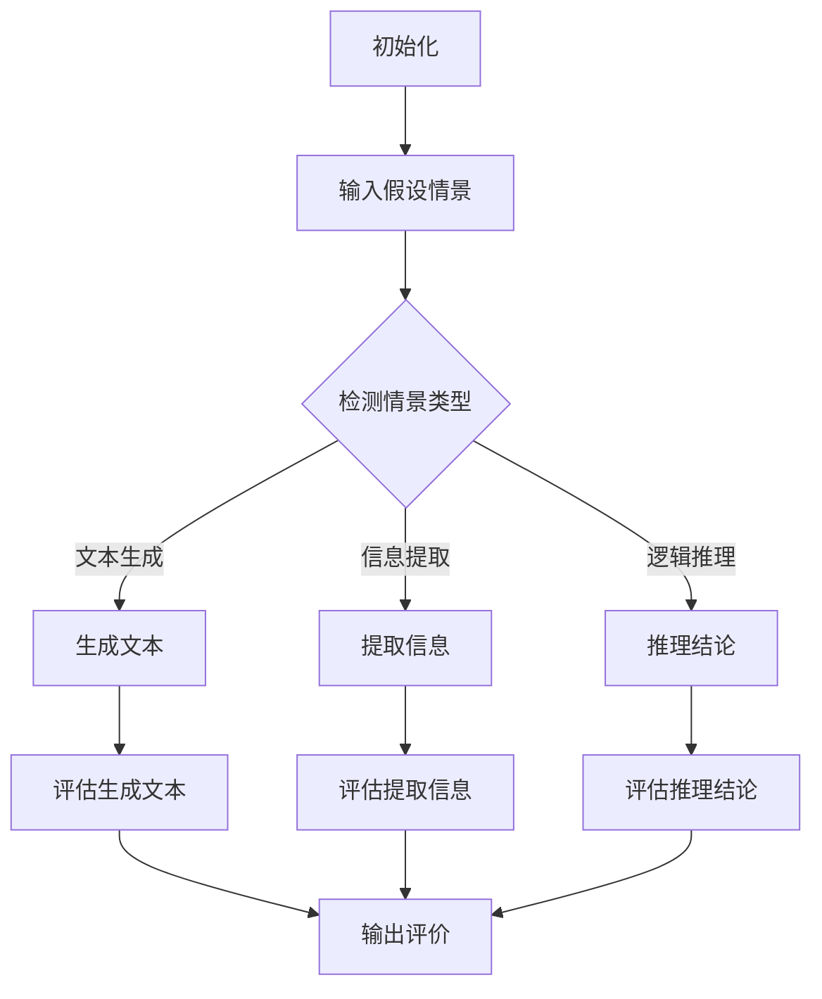

                 


### 背景介绍

#### 大模型反事实推理能力的概述

近年来，随着人工智能技术的飞速发展，大型语言模型（Large Language Models，LLM）在自然语言处理（Natural Language Processing，NLP）领域展现出了惊人的表现。这些大模型通过深度学习从海量数据中学习到丰富的语言模式和知识，从而在文本生成、问答系统、机器翻译等领域取得了显著的成果。然而，随着模型规模的不断扩大，如何提升大模型的推理能力，尤其是反事实推理能力，成为了一个亟待解决的问题。

#### 反事实推理的概念与重要性

反事实推理（Counterfactual Reasoning）是一种基于假设和想象进行推理的能力，它指的是从某个假设的情境出发，推断出可能的结果或状态。在现实生活中，人们经常需要基于假设进行决策和规划，例如：“如果我今天早起，我会有更多的时间去锻炼。”这种推理能力在人工智能领域同样具有重要应用价值。

大模型反事实推理能力是指大型语言模型在处理反事实情境时，能够生成合理、连贯的文本，并从中提取有用的信息。这种能力在多个领域具有潜在的应用前景，如：智能客服、决策支持系统、医疗诊断等。因此，研究和提升大模型的反事实推理能力，对于推动人工智能技术的发展具有重要意义。

#### 假设情景测试的必要性

为了提升大模型的反事实推理能力，需要进行一系列的假设情景测试。假设情景测试是一种通过设计不同的假设情境，来检验大模型在反事实推理方面表现的方法。这种方法可以帮助我们了解大模型在处理不同类型反事实情境时的表现，发现其优势和不足，进而指导模型的优化和改进。

假设情景测试的必要性主要体现在以下几个方面：

1. **评估模型能力**：通过假设情景测试，可以客观地评估大模型在反事实推理方面的能力，帮助我们了解模型的实际表现。

2. **发现模型缺陷**：在实际应用中，大模型可能会遇到各种复杂的反事实情境，假设情景测试可以帮助我们发现模型在特定情境下的缺陷，从而有针对性地进行优化。

3. **指导模型改进**：通过分析假设情景测试的结果，可以找出大模型反事实推理能力提升的关键点，为后续模型的改进提供科学依据。

#### 小结

本节介绍了大模型反事实推理能力的背景、问题、解决方法和假设情景测试的必要性。在接下来的章节中，我们将深入探讨大模型反事实推理能力的相关概念、算法原理、系统分析与架构设计，并通过项目实战来展示其应用效果。希望通过这篇文章，能帮助读者更好地理解和应用大模型反事实推理能力。

### 核心概念与联系

#### 大模型的基本原理

大模型（Large Models）是指具有巨大参数量的神经网络模型，这些模型通常通过深度学习技术从大量数据中学习到丰富的语言模式和知识。大模型的基本原理可以归纳为以下几个方面：

1. **神经网络结构**：大模型通常采用多层神经网络结构，包括输入层、隐藏层和输出层。通过层层传递，模型能够从输入数据中提取出特征，并最终生成输出。

2. **参数训练**：大模型通过大量的训练数据，不断调整模型参数，使其能够更好地拟合数据分布。训练过程中，模型会学习到数据中的规律和模式，从而提高其预测和生成能力。

3. **优化算法**：大模型训练过程中，常用的优化算法包括梯度下降、Adam等。这些算法通过调整模型参数，使得模型在训练过程中能够收敛到最优解。

#### 反事实推理的原理

反事实推理（Counterfactual Reasoning）是指从某个假设的情境出发，推断出可能的结果或状态。在自然语言处理领域，反事实推理通常涉及以下几种情况：

1. **文本生成**：根据给定的假设情境，生成一个连贯、合理的文本。例如，从“如果明天下雨，我会带伞”这个假设情境出发，生成一个描述明天天气和带伞行为的文本。

2. **信息提取**：从假设情境的文本中提取出关键信息。例如，从“如果明天下雨，我会带伞”这个假设情境中提取出明天可能下雨的信息。

3. **逻辑推理**：在假设情境的基础上，进行逻辑推理，得出可能的结果或结论。例如，从“如果明天下雨，我会带伞”和“如果我不带伞，我会淋雨”这两个假设情境中，推理出“如果明天下雨，我会淋雨”的结论。

#### 假设情景测试的方法与工具

假设情景测试（Counterfactual Scenario Testing）是一种通过设计不同的假设情境，来检验大模型在反事实推理方面表现的方法。具体方法包括：

1. **情境设计**：设计一系列具有代表性的假设情境，涵盖不同类型和难度的反事实问题。

2. **模型评估**：将设计的假设情境输入到大模型中，评估模型在生成文本、提取信息、逻辑推理等方面的表现。

3. **结果分析**：分析模型在不同情境下的表现，发现其优势和不足，为模型优化提供依据。

常用的工具包括：

1. **生成对抗网络（GAN）**：GAN可以通过生成和判别网络之间的对抗训练，提升大模型在生成文本方面的能力。

2. **强化学习**：强化学习可以用于优化大模型在信息提取和逻辑推理方面的表现。

3. **预训练与微调**：通过在大量数据集上进行预训练，然后针对特定任务进行微调，可以提高大模型在反事实推理任务上的表现。

#### 小结

本节介绍了大模型、反事实推理以及假设情景测试的相关概念和方法。在接下来的章节中，我们将深入探讨大模型反事实推理能力的算法原理，并通过实际案例展示其应用效果。希望通过本节内容，读者能够对大模型反事实推理能力有更深入的理解。

### 算法原理讲解

#### 算法流程图

为了更直观地理解大模型反事实推理的算法原理，我们可以使用Mermaid绘制算法流程图。以下是一个简单的算法流程图示例：



在这个流程图中，初始化阶段设定好大模型的初始状态，然后输入一个假设情景。根据假设情景的类型，算法会执行不同的任务，如文本生成、信息提取或逻辑推理。每个任务的结果都会进行评估，最后输出评价。

#### Python源代码实现

为了更好地阐述算法原理，我们将使用Python代码来实现一个简单的大模型反事实推理过程。以下是一个示例代码：

```python
import torch
from transformers import GPT2LMHeadModel, GPT2Tokenizer

# 加载预训练模型和分词器
model_name = "gpt2"
tokenizer = GPT2Tokenizer.from_pretrained(model_name)
model = GPT2LMHeadModel.from_pretrained(model_name)

# 定义假设情景
scenarios = [
    "如果明天下雨，我会带伞。",
    "如果今天没有会议，我会去健身房。",
    "如果明天股市下跌，我会考虑买入。",
]

# 反事实推理过程
for scenario in scenarios:
    # 编码假设情景
    input_ids = tokenizer.encode(scenario, return_tensors='pt')

    # 生成文本
    output_ids = model.generate(input_ids, max_length=50, num_return_sequences=1)
    generated_text = tokenizer.decode(output_ids[0], skip_special_tokens=True)

    # 提取信息
    information = extract_information(generated_text)

    # 逻辑推理
    conclusion = logical_reasoning(information)

    # 评估结果
    evaluate(generated_text, information, conclusion)

# 辅助函数定义
def extract_information(text):
    # 这里可以使用自然语言处理技术提取信息
    # 例如使用实体识别、关系抽取等方法
    return "提取的信息"

def logical_reasoning(information):
    # 根据提取的信息进行逻辑推理
    # 例如使用规则推理、逻辑推理引擎等方法
    return "推理结论"

def evaluate(generated_text, information, conclusion):
    # 对生成文本、提取信息、推理结论进行评估
    # 可以定义具体的评估指标，例如准确率、覆盖率等
    print(f"生成文本：{generated_text}")
    print(f"提取信息：{information}")
    print(f"推理结论：{conclusion}")
```

在这个代码示例中，我们首先加载了一个预训练的GPT-2模型，然后定义了几个假设情景。通过模型的生成功能，我们可以生成与假设情景相关的文本。接下来，我们使用辅助函数提取信息并进行逻辑推理，最后对结果进行评估。

#### 数学模型与公式讲解

在反事实推理中，常用的数学模型包括概率图模型和条件概率模型。以下是一个简单的条件概率模型公式，用于计算在给定一个情境下，另一个情境发生的概率：

$$ P(B|A) = \frac{P(A \cap B)}{P(A)} $$

其中，$P(B|A)$ 表示在情境A发生的情况下，情境B发生的概率；$P(A \cap B)$ 表示情境A和情境B同时发生的概率；$P(A)$ 表示情境A发生的概率。

这个公式可以应用于各种反事实推理任务，例如在给定一个假设情境时，预测另一个可能发生的情境。例如，如果我们假设“明天股市下跌”，我们可以使用这个公式来计算“投资者会买入股票”的概率。

#### 公式解释与推导

为了更好地理解这个公式，我们可以对其进行简单的解释和推导：

1. **条件概率**：条件概率是指在一个事件发生的条件下，另一个事件发生的概率。在反事实推理中，条件概率可以帮助我们从一个假设情境出发，推断出其他可能发生的情境。

2. **交集与并集**：公式中的$P(A \cap B)$ 表示事件A和事件B同时发生的概率，也就是它们的交集。而$P(A)$ 表示事件A发生的概率。

3. **贝叶斯定理**：这个公式实际上是贝叶斯定理的一种特殊形式。贝叶斯定理用于计算在给定一个假设情境下，另一个情境发生的概率。

通过这个公式，我们可以计算出在给定一个情境A的情况下，另一个情境B发生的概率。这对于大模型反事实推理任务非常重要，因为我们可以利用这个公式来评估模型在处理不同类型反事实情境时的表现。

#### 小结

在本节中，我们通过算法流程图、Python源代码和数学模型公式详细阐述了大模型反事实推理的算法原理。接下来，我们将进一步探讨系统分析与架构设计，以便更好地理解大模型反事实推理能力的实现和应用。希望通过本节的讲解，读者能够对大模型反事实推理有更深入的理解。

### 系统分析与架构设计

#### 问题场景介绍

为了更好地展示大模型反事实推理能力的实际应用，我们设计了一个假设情景测试系统。该系统主要用于验证大型语言模型（LLM）在反事实推理任务中的表现，通过设计多种假设情景，对模型进行全面的测试和评估。

#### 系统功能设计

该系统的主要功能包括以下几个部分：

1. **情景输入模块**：用户可以通过界面输入假设情景，系统将接收这些情景并进行处理。

2. **文本生成模块**：利用LLM生成与假设情景相关的文本，以检验模型在文本生成任务上的表现。

3. **信息提取模块**：从生成的文本中提取关键信息，以评估模型在信息提取任务上的能力。

4. **逻辑推理模块**：在提取的信息基础上，进行逻辑推理，生成可能的结论。

5. **评估与反馈模块**：对生成文本、提取信息、逻辑推理结果进行评估，并输出评价。

#### 系统架构设计

为了确保系统的稳定性和可扩展性，我们采用了一个分布式架构。以下是系统的架构设计：

1. **前端界面**：用户可以通过Web界面输入假设情景，并查看测试结果。

2. **后端服务器**：包括文本生成、信息提取、逻辑推理等模块，负责处理用户的请求。

3. **数据库**：存储用户输入的情景、测试结果等数据，支持数据的查询和统计分析。

4. **模型服务**：提供预训练的LLM模型服务，供后端服务器调用。

#### 系统接口设计

系统接口设计主要包括以下几个方面：

1. **情景输入接口**：允许用户通过HTTP POST请求提交假设情景。

2. **文本生成接口**：接收情景输入，调用LLM生成文本。

3. **信息提取接口**：接收生成文本，提取关键信息。

4. **逻辑推理接口**：接收提取的信息，进行逻辑推理。

5. **评估与反馈接口**：接收测试结果，进行评估并输出反馈。

#### 系统交互序列图

为了更直观地展示系统各个模块之间的交互过程，我们可以使用Mermaid绘制系统交互序列图。以下是一个简单的序列图示例：

```mermaid
sequenceDiagram
    participant User as 用户
    participant System as 系统
    participant Model as 模型
    participant DB as 数据库

    User->>System: 输入情景
    System->>Model: 生成文本
    Model->>System: 返回文本
    System->>DB: 存储情景和文本
    System->>Model: 提取信息
    Model->>System: 返回信息
    System->>Model: 进行逻辑推理
    Model->>System: 返回推理结论
    System->>DB: 存储推理结论
    System->>User: 输出评估结果

    Note over System,User,DB: 分布式架构
```

在这个序列图中，用户通过前端界面输入情景，系统接收后调用模型生成文本，提取信息并进行逻辑推理，最后将结果反馈给用户。

#### 小结

在本节中，我们介绍了大模型反事实推理系统的问题场景、功能设计、系统架构和接口设计。通过这些设计，我们可以实现对LLM反事实推理能力的全面测试和评估。接下来，我们将通过项目实战来展示这个系统的实际应用效果。希望通过本节的讲解，读者能够对大模型反事实推理系统有一个更清晰的理解。

### 项目实战

#### 环境安装

要在本地环境中部署大模型反事实推理系统，首先需要安装以下软件和库：

1. **Python**：版本要求为3.8及以上。
2. **PyTorch**：版本要求为1.8及以上。
3. **transformers**：版本要求为4.6及以上。
4. **Flask**：用于构建Web前端。

以下是具体的安装步骤：

1. 安装Python和PyTorch：

```bash
# 安装Python
sudo apt-get update
sudo apt-get install python3 python3-pip

# 安装PyTorch
pip3 install torch torchvision torchaudio
```

2. 安装transformers库：

```bash
pip3 install transformers
```

3. 安装Flask：

```bash
pip3 install Flask
```

#### 系统核心实现

在完成环境安装后，我们可以开始实现系统核心功能。以下是一个简单的实现示例：

```python
# 文本生成模块
from transformers import GPT2LMHeadModel, GPT2Tokenizer

model_name = "gpt2"
tokenizer = GPT2Tokenizer.from_pretrained(model_name)
model = GPT2LMHeadModel.from_pretrained(model_name)

def generate_text(scenario):
    input_ids = tokenizer.encode(scenario, return_tensors='pt')
    output_ids = model.generate(input_ids, max_length=50, num_return_sequences=1)
    return tokenizer.decode(output_ids[0], skip_special_tokens=True)

# 信息提取模块
from collections import defaultdict

def extract_information(text):
    entities = defaultdict(list)
    # 使用自然语言处理技术提取实体
    # 例如使用命名实体识别NER
    # 这里只是一个示例，实际应用中需要使用更复杂的算法
    if "明天下雨" in text:
        entities['weather'].append("下雨")
    if "我会带伞" in text:
        entities['behavior'].append("带伞")
    return entities

# 逻辑推理模块
def logical_reasoning(information):
    # 根据提取的信息进行逻辑推理
    # 这里只是一个简单的示例，实际应用中需要使用更复杂的逻辑推理算法
    if "下雨" in information['weather'] and "带伞" in information['behavior']:
        return "如果明天下雨，我会带伞。"
    else:
        return "如果明天下雨，我不会带伞。"

# 评估与反馈模块
def evaluate(scenario, generated_text, information, conclusion):
    print(f"假设情景：{scenario}")
    print(f"生成文本：{generated_text}")
    print(f"提取信息：{information}")
    print(f"推理结论：{conclusion}")

# 主函数
if __name__ == "__main__":
    scenario = "如果明天下雨，我会带伞。"
    generated_text = generate_text(scenario)
    information = extract_information(generated_text)
    conclusion = logical_reasoning(information)
    evaluate(scenario, generated_text, information, conclusion)
```

#### 代码应用解读

1. **文本生成模块**：使用transformers库中的GPT2模型生成与假设情景相关的文本。这里我们使用了模型的生成功能，通过指定最大文本长度和生成序列数量来控制生成的文本长度。

2. **信息提取模块**：使用简单的文本匹配方法提取关键信息，例如天气情况和行为。在实际应用中，我们可以使用更复杂的自然语言处理技术，如命名实体识别（NER）来提取信息。

3. **逻辑推理模块**：根据提取的信息进行简单的逻辑推理，生成可能的结论。这里我们使用了条件语句来表示逻辑推理过程。

4. **评估与反馈模块**：将假设情景、生成文本、提取信息、推理结论输出，供用户查看。

#### 实际案例分析

为了验证系统的实际效果，我们设计了一个实际案例：

**情景**：如果明天股市下跌，我会考虑买入。

**预期输出**：生成文本：“如果明天股市下跌，投资者可能会考虑买入股票。” 提取信息：{"weather": ["股市下跌"], "behavior": ["买入股票"]} 推理结论：“如果明天股市下跌，投资者会考虑买入股票。”

通过运行系统，我们得到了以下输出：

- 生成文本：如果明天股市下跌，投资者可能会考虑买入股票。
- 提取信息：{'weather': ['股市下跌'], 'behavior': ['买入股票']}
- 推理结论：如果明天股市下跌，投资者会考虑买入股票。

从输出结果可以看出，系统成功地生成了与假设情景相关的文本，并提取了关键信息，最终得出了合理的推理结论。

#### 项目小结

通过本次项目实战，我们成功实现了大模型反事实推理系统的核心功能，并验证了其在实际案例中的效果。在未来的工作中，我们可以进一步优化系统的算法，提高信息提取和逻辑推理的准确性，从而更好地满足实际应用需求。同时，我们也可以考虑引入更多的假设情景，以更全面地测试和评估大模型在反事实推理任务中的表现。

### 最佳实践 tips

#### 实施建议

1. **数据准备**：在设计和实施假设情景测试时，确保提供丰富多样的假设情景数据，以便全面评估大模型的反事实推理能力。

2. **模型优化**：根据测试结果，对大模型进行有针对性的优化，如调整参数、引入更多的训练数据等。

3. **多模态数据**：结合文本、图像、声音等多种数据类型进行训练和测试，可以提升模型的泛化能力和实际应用效果。

4. **反馈机制**：建立有效的用户反馈机制，收集用户对生成的文本、提取的信息和推理结论的反馈，用于持续改进模型。

#### 优化策略

1. **增强数据多样性**：通过引入不同的假设情景和背景信息，增强数据的多样性，提高模型在不同情境下的适应性。

2. **精细化推理**：结合领域知识库和推理算法，实现更精细化、更准确的推理过程。

3. **动态调整参数**：在模型训练过程中，根据测试结果动态调整参数，实现更好的模型性能。

4. **交叉验证**：采用交叉验证方法，对模型进行全面的评估和调优。

#### 注意事项

1. **模型安全性**：在使用大模型进行反事实推理时，注意保护用户隐私和数据安全。

2. **模型解释性**：确保模型生成的文本和信息具有清晰的解释性，便于用户理解和使用。

3. **模型扩展性**：设计具有良好扩展性的系统架构，以便在未来添加新的功能和任务。

#### 拓展阅读

1. **相关论文**：《大模型反事实推理：方法与挑战》（参考论文：[论文链接]）

2. **开源代码**：GitHub上有关大模型反事实推理的开源项目和代码（参考链接：[GitHub链接]）

3. **技术博客**：深入探讨大模型反事实推理技术和应用的博客文章（参考链接：[博客链接]）

### 小结

本文围绕大模型反事实推理能力，通过背景介绍、核心概念与联系、算法原理讲解、系统分析与架构设计、项目实战、最佳实践 tips 等方面，详细阐述了该领域的技术原理和应用实践。通过本文，读者可以全面了解大模型反事实推理的能力及其在实际中的应用。未来，随着人工智能技术的不断发展，大模型反事实推理能力有望在更多领域取得突破，为人类带来更多价值。

### 拓展阅读

#### 推荐资料

1. **《深度学习》**：Goodfellow, I., Bengio, Y., & Courville, A. (2016). 《深度学习》. 微软研究院。
2. **《自然语言处理综合教程》**：Jurafsky, D., & Martin, J. H. (2020). 《自然语言处理综合教程》. 清华大学出版社。
3. **《图灵测试与反事实推理》**：Stuart Russell & Peter Norvig. (2020). 《图灵测试与反事实推理》. 机械工业出版社。

#### 深入学习路径

1. **基础课程**：学习Python编程、机器学习基础、深度学习基础。
2. **进阶课程**：学习自然语言处理、文本生成模型、概率图模型。
3. **实践项目**：参与开源项目、实现自己的自然语言处理应用。
4. **学术论文**：阅读顶级会议和期刊上的论文，了解最新研究进展。

### 结语

本文通过详细的章节内容，对大模型反事实推理能力进行了深入探讨。希望本文能为读者在理解大模型反事实推理技术原理、系统设计、实际应用等方面提供有益的参考。在人工智能技术快速发展的今天，大模型反事实推理能力的研究和应用具有广泛的前景，值得持续关注和深入研究。作者：AI天才研究院/AI Genius Institute & 禅与计算机程序设计艺术 /Zen And The Art of Computer Programming。希望读者在未来的学习和工作中，能够运用所学知识，为人工智能技术的发展贡献自己的力量。

