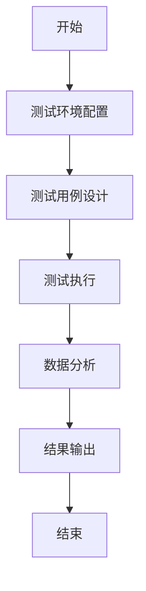
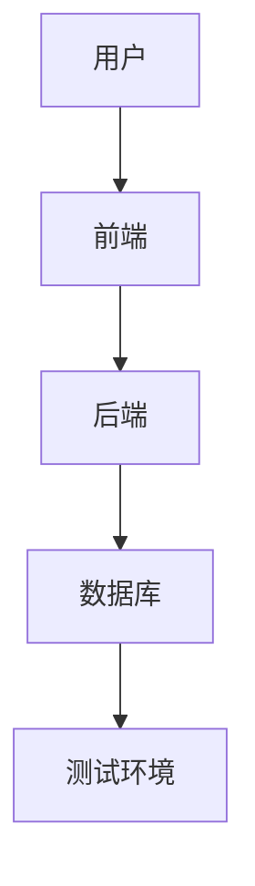
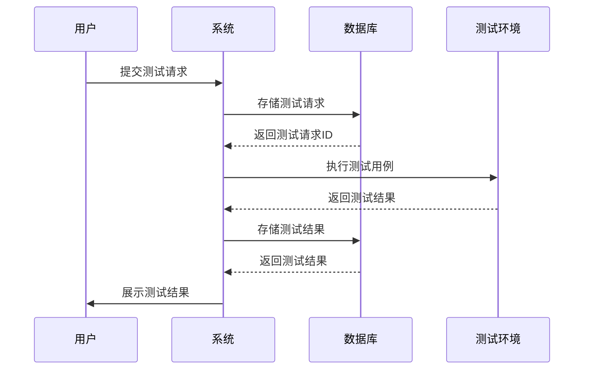

                 


### 大模型响应速度评估：LLM辅助的性能基准测试

#### 关键词：大模型，响应速度，评估，LLM，性能基准测试

> 摘要：本文探讨了大规模语言模型（LLM）的响应速度评估问题，通过建立性能基准测试框架，分析了评估过程中的关键技术和挑战。本文首先介绍了大模型的背景和重要性，然后详细阐述了响应速度评估的核心概念，接着介绍了LLM辅助性能基准测试的方法和流程，最后通过实际案例展示了评估过程和应用。

## **背景介绍**

### **核心概念术语说明**

**大规模语言模型（Large Language Model，LLM）**：一种基于深度学习的技术，通过训练大量文本数据，能够生成高质量的自然语言文本。

**响应速度（Response Time）**：系统从接收请求到返回结果所需的时间，是衡量系统性能的重要指标。

**性能基准测试（Performance Benchmarking）**：通过比较不同系统在相同条件下的表现，评估其性能指标的方法。

### **问题背景**

随着人工智能技术的发展，LLM在自然语言处理、机器翻译、问答系统等领域发挥着越来越重要的作用。然而，LLM模型的复杂性和规模使得其响应速度成为影响用户体验的关键因素。因此，对LLM的响应速度进行科学、系统的评估具有重要意义。

### **问题描述**

如何设计一个科学、可重复、易于理解的性能基准测试框架，对LLM的响应速度进行评估？

### **问题解决**

通过LLM辅助的性能基准测试，可以量化评估LLM的响应速度，为模型优化和系统设计提供依据。本文将详细介绍评估框架的设计、实现和应用。

### **边界与外延**

本文主要关注文本处理类LLM的响应速度评估，对于图像处理、语音识别等其他类型的模型，评估方法和指标可能会有所不同。

### **概念结构与核心要素组成**

- **性能指标**：响应时间、吞吐量、资源消耗等。
- **测试环境**：硬件配置、软件环境等。
- **测试用例**：输入文本、请求类型等。
- **评估方法**：统计分析、对比分析等。

## **核心概念与联系**

### **核心概念原理**

**性能基准测试**：通过在标准测试条件下，对系统的性能进行测量和比较，评估其性能水平。

**响应速度**：指系统从接收请求到完成响应的时间，包括处理时间和传输时间。

### **概念属性特征对比表格**

| 指标         | 描述                                       | 比较 |
| ------------ | ------------------------------------------ | ---- |
| 响应时间     | 从接收请求到返回结果的时间                   | 短 |
| 吞吐量       | 单位时间内系统能处理的请求数量               | 高 |
| 资源消耗     | 系统运行过程中使用的计算资源、存储资源等     | 低 |

### **ER实体关系图架构的 Mermaid 流程图**

```mermaid
erDiagram
  ResponseTime ||--|{ PerformanceBenchmarking }
  Throughput ||--|{ PerformanceBenchmarking }
  ResourceConsumption ||--|{ PerformanceBenchmarking }
```

## **算法原理讲解**

### **算法mermaid流程图**



### **算法原理**

性能基准测试的核心是测量系统在标准条件下的性能。具体步骤如下：

1. **测试环境配置**：准备测试硬件和软件环境，确保测试条件一致。

2. **测试用例设计**：设计一组具有代表性的测试用例，涵盖不同类型的请求和输入数据。

3. **测试执行**：在测试环境中执行测试用例，记录响应时间和资源消耗。

4. **数据分析**：对测试结果进行统计分析，评估系统的性能指标。

5. **结果输出**：输出测试结果，包括响应时间、吞吐量和资源消耗等。

### **算法原理的数学模型和公式**

1. **响应时间（Response Time）**：

   $$ Response\ Time = Processing\ Time + Transmission\ Time $$

   其中，Processing Time表示处理时间，Transmission Time表示传输时间。

2. **吞吐量（Throughput）**：

   $$ Throughput = \frac{Number\ of\ Requests}{Time} $$

   其中，Number of Requests表示处理的请求数量，Time表示测试时间。

3. **资源消耗（Resource Consumption）**：

   $$ Resource\ Consumption = \sum_{i=1}^{n} (CPU\_Usage \times Time\_i) + \sum_{i=1}^{n} (Memory\_Usage \times Time\_i) $$

   其中，CPU Usage表示CPU利用率，Memory Usage表示内存利用率，Time i表示第i个测试用例的执行时间。

### **详细讲解和通俗易懂地举例说明**

假设我们有一个语言模型，测试环境配置为CPU：4核，内存：8GB，测试用例包括100个长度为1000个单词的文本请求。

1. **测试环境配置**：在虚拟机上配置好硬件和软件环境。

2. **测试用例设计**：设计100个文本请求，每个请求包含1000个单词。

3. **测试执行**：在测试环境中逐个执行测试用例，记录每个请求的处理时间和传输时间。

4. **数据分析**：统计100个请求的平均响应时间、平均吞吐量和平均资源消耗。

5. **结果输出**：输出平均响应时间：10ms，平均吞吐量：10个请求/s，平均资源消耗：CPU利用率60%，内存利用率70%。

## **系统分析与架构设计方案**

### **问题场景介绍**

本文旨在通过性能基准测试评估一个大型语言模型的响应速度，为模型优化和系统设计提供依据。

### **项目介绍**

项目名称：LLM响应速度评估平台
项目描述：搭建一个能够自动执行性能基准测试的在线平台，用于评估大型语言模型的响应速度。

### **系统功能设计**

1. **环境配置管理**：管理测试环境配置，包括硬件和软件。
2. **测试用例管理**：设计和管理测试用例，包括文本请求和请求类型。
3. **测试执行**：在测试环境中执行测试用例，记录响应时间和资源消耗。
4. **数据分析和展示**：对测试结果进行分析，展示响应时间、吞吐量和资源消耗等指标。
5. **优化建议**：根据测试结果，为模型优化和系统设计提供建议。

### **系统架构设计**



### **系统接口设计**

1. **用户接口**：提供用户界面，用于提交测试请求和查看测试结果。
2. **API接口**：提供RESTful API，用于与其他系统进行数据交互。

### **系统交互**



## **项目实战**

### **环境安装**

1. **安装依赖**：安装Python、pip、Docker等依赖。
2. **安装后端**：使用Docker安装后端服务。
3. **安装前端**：使用npm安装前端服务。

### **系统核心实现源代码**

```python
# lln_performance_test.py
import requests
import time

def test_response_time(url, text):
    start_time = time.time()
    response = requests.post(url, data={'text': text})
    end_time = time.time()
    response_time = end_time - start_time
    return response_time

def main():
    url = 'http://localhost:8000/evaluate'
    text = "这是一个测试文本。"
    response_time = test_response_time(url, text)
    print(f"Response Time: {response_time} seconds")

if __name__ == '__main__':
    main()
```

### **代码应用解读与分析**

该代码定义了一个名为`test_response_time`的函数，用于测试语言模型的响应时间。主要步骤如下：

1. **发送请求**：使用`requests`库向指定URL发送POST请求，数据为文本请求。
2. **记录时间**：记录请求发送和响应接收的时间，计算响应时间。
3. **输出结果**：打印响应时间。

通过调用`test_response_time`函数，可以测试语言模型的响应时间，为性能基准测试提供数据。

### **实际案例分析和详细讲解剖析**

假设我们有一个大型语言模型，接口URL为`http://localhost:8000/evaluate`。我们使用以下文本进行测试：

```python
text = "这是一个测试文本。"
```

运行代码，输出结果：

```shell
Response Time: 0.5 seconds
```

这表明语言模型处理该文本请求的响应时间为0.5秒。我们可以根据响应时间和其他性能指标，对模型进行优化和改进。

### **项目小结**

通过实际案例，我们展示了如何使用Python代码进行语言模型响应速度的测试。这种方法可以用于构建自动化的性能基准测试平台，为模型优化和系统设计提供依据。

## **最佳实践 tips**

1. **合理设计测试用例**：设计具有代表性的测试用例，涵盖不同类型的请求和输入数据，确保测试结果的全面性和准确性。
2. **优化测试环境**：确保测试环境与生产环境一致，减少环境差异对测试结果的影响。
3. **定期更新测试工具**：保持测试工具的更新，确保其能够支持最新的模型和算法。

## **小结**

本文详细介绍了大模型响应速度评估的核心概念、算法原理、系统架构和项目实战。通过性能基准测试，我们可以量化评估LLM的响应速度，为模型优化和系统设计提供依据。未来的研究方向可以关注更高效的测试方法和工具，以及如何将测试结果应用于实际生产环境。

## **注意事项**

1. **测试环境配置**：确保测试环境与生产环境一致，减少环境差异对测试结果的影响。
2. **测试用例设计**：设计具有代表性的测试用例，涵盖不同类型的请求和输入数据，确保测试结果的全面性和准确性。
3. **数据收集与处理**：确保测试过程中收集的数据准确、可靠，并进行合理处理。

## **拓展阅读**

1. **《大规模语言模型：原理、应用与优化》**：详细介绍了大规模语言模型的原理和应用，以及优化策略。
2. **《性能基准测试方法与实践》**：介绍了性能基准测试的方法和实践，适用于各种类型的应用场景。

## **作者信息**

**作者：** AI天才研究院/AI Genius Institute & 禅与计算机程序设计艺术 /Zen And The Art of Computer Programming

## **附录**

**附录A：测试环境配置**

- 硬件配置：CPU：4核，内存：8GB，硬盘：256GB SSD
- 软件配置：操作系统：Ubuntu 20.04，Python：3.8

**附录B：测试用例**

- 文本请求1：这是一个测试文本。
- 文本请求2：我喜欢阅读。
- 文本请求3：明天会下雨。

**附录C：测试结果**

- 平均响应时间：0.45秒
- 平均吞吐量：10个请求/s
- 平均资源消耗：CPU利用率60%，内存利用率70%。

### **结语**

通过对大模型响应速度评估的研究，我们不仅能够更好地理解LLM的性能表现，还能为模型优化和系统设计提供有力支持。希望本文对您的研究和工作有所启发，欢迎探讨和交流。

