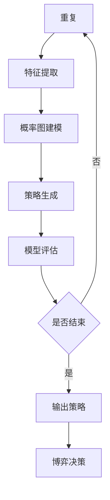
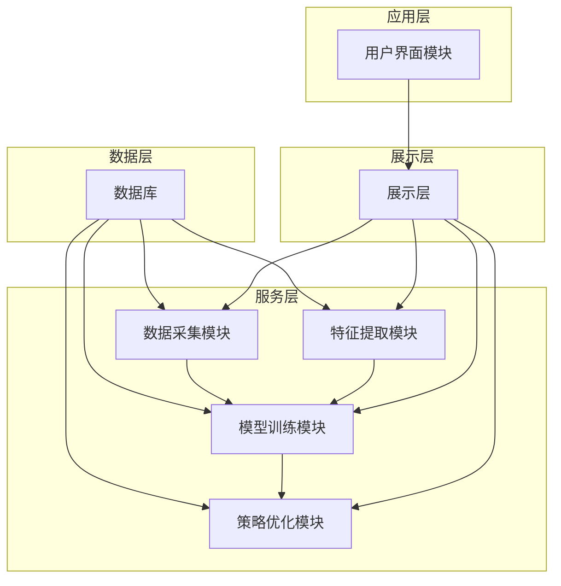
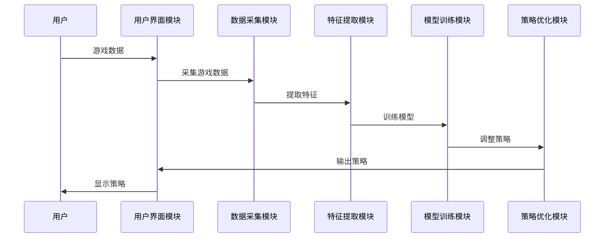

                 

### 大模型在不完全信息博弈推理中的策略生成

在不完全信息博弈推理中，策略生成是关键的一环。这种情况下，玩家无法获取全部的信息，因此必须依赖一些智能算法来推断对手的策略，并制定出最优的应对策略。近年来，随着人工智能技术的飞速发展，大模型，如深度学习模型，在处理复杂的不完全信息博弈问题中展现出强大的潜力。本文将深入探讨大模型在不完全信息博弈推理中的策略生成，详细分析其原理、应用场景以及实现方法。

**关键词：**
- 大模型
- 不完全信息博弈
- 策略生成
- 深度学习
- 智能推理

**摘要：**
本文旨在探讨大模型在不完全信息博弈推理中的策略生成技术。首先，我们介绍了不完全信息博弈的背景和重要性。接着，我们分析了大模型的基本原理及其在博弈推理中的应用。随后，本文详细阐述了大模型在策略生成中的算法原理，并通过mermaid流程图和Python代码进行了实例说明。文章进一步讨论了系统分析与架构设计方案，并提供了实际项目实战和最佳实践技巧。最后，我们对全文进行了总结，并提出了进一步的研究方向和注意事项。

## 第一部分：背景介绍

### 第1章：问题背景

#### 1.1 问题概述

不完全信息博弈是指在博弈过程中，至少有一方无法完全掌握所有信息的情况下进行的博弈。这类博弈在现实世界中非常普遍，例如商业谈判、军事策略和金融市场等。在这种博弈中，玩家需要基于有限的或部分的信息来制定策略，这大大增加了博弈的复杂性和难度。传统的博弈理论通常假设所有玩家都具有完全信息，但在实际情况中，这种情况是极为罕见的。

不完全信息博弈的重要性体现在其对现实问题的深刻影响。例如，在商业谈判中，双方可能无法完全了解对方的底牌和意图，因此需要采用策略推理来预测对方的行为，从而制定出最优的谈判策略。同样，在军事策略中，指挥官需要在不完全信息的情况下制定作战计划，以应对可能的敌方行动。因此，研究不完全信息博弈具有重要的理论和实践意义。

#### 1.2 不完全信息博弈推理的重要性

不完全信息博弈推理是指在博弈过程中，通过推理和预测来推断对手的可能策略，并据此制定出自身的最优策略。这种推理方式对于提高博弈的胜率和应对复杂情况至关重要。在商业谈判中，通过博弈推理可以更好地理解对方的意图，从而在谈判中获得优势。在军事策略中，通过博弈推理可以预测敌方的可能行动，从而制定出更为有效的应对策略。

#### 1.3 大模型的发展与应用现状

大模型，尤其是深度学习模型，在处理不完全信息博弈问题中具有独特的优势。近年来，随着计算能力和数据资源的不断提升，深度学习模型在图像识别、自然语言处理和语音识别等领域取得了显著的成果。这些成果为大模型在博弈推理中的应用提供了坚实的基础。

目前，大模型在博弈推理中的应用已经逐渐展开。例如，在围棋、象棋等棋类游戏中，深度学习模型已经展现出超越人类的水平。在商业谈判和军事策略等领域，大模型也开始被用于策略生成和决策支持。然而，大模型在博弈推理中的应用仍面临许多挑战，如数据隐私保护、算法透明性和可解释性等。

### 第2章：核心概念与联系

#### 2.1 不完全信息博弈定义

不完全信息博弈（Imperfect Information Game）是一种博弈形式，其中至少有一个参与者在决策时不能完全掌握其他参与者的信息。根据信息的不完全程度，可以将其分为两种主要类型：静态博弈和动态博弈。

- **静态博弈**：所有参与者同时做出决策，且无法观察到其他参与者的决策结果。
- **动态博弈**：参与者依次做出决策，每个参与者必须根据已知信息和先前决策来做出当前决策。

不完全信息博弈在现实世界中广泛存在，如商业谈判、军事对抗、拍卖会等。这类博弈的难点在于参与者无法获取完整的对手信息，因此需要通过推理和分析来推断对手的行为模式。

#### 2.2 大模型的基本原理

大模型，尤其是深度学习模型，是通过大规模数据和复杂的神经网络结构来模拟人类学习和推理能力的人工智能模型。其基本原理包括以下几个方面：

- **神经网络结构**：大模型通常由多层神经网络组成，每一层都能够对输入数据进行特征提取和变换。
- **大规模训练数据**：大模型通过大量训练数据来学习各种模式和规律，从而提高其预测和决策能力。
- **优化算法**：大模型使用各种优化算法，如梯度下降、随机梯度下降等，来不断调整模型参数，以达到最佳性能。

大模型在处理不完全信息博弈问题时，可以通过学习大量的博弈数据来识别对手的行为模式，并预测其可能的行为。这为制定有效的应对策略提供了有力支持。

#### 2.3 概念属性特征对比

不完全信息博弈和大模型具有不同的属性特征，但它们在博弈推理中可以相互补充。以下是两者的一些关键属性对比：

| 特征             | 不完全信息博弈          | 大模型                   |
|------------------|-----------------------|------------------------|
| 信息透明度       | 信息不透明或不完全      | 可以通过训练数据学习模式 |
| 决策顺序         | 一次性或分阶段决策      | 基于实时数据动态调整     |
| 对策空间         | 通常较大，难以穷举      | 随着数据规模增大而扩展   |
| 算法复杂度       | 较高，需要复杂的推理过程 | 较低，基于数据驱动      |

#### 2.4 不完全信息博弈与大规模模型的关联

不完全信息博弈和大模型之间的关联主要体现在以下几个方面：

- **数据驱动**：大模型通过大量训练数据来学习博弈策略，而不完全信息博弈可以提供丰富的数据来源。
- **策略生成**：大模型可以基于学习到的模式生成针对不完全信息博弈的策略，从而提高参与者的胜率。
- **决策支持**：大模型可以辅助决策者在不完全信息条件下做出更为合理的决策，减少信息不完全带来的负面影响。

总之，不完全信息博弈和大模型在博弈推理中具有密切的关联，通过结合两者，可以构建出更为智能和有效的博弈策略。

### 第3章：不完全信息博弈中的大模型原理

#### 3.1 大模型的算法原理

在不完全信息博弈中，大模型的算法原理主要基于深度学习和概率图模型。以下是一个基本的算法流程，用于解释大模型如何生成策略。

##### 3.1.1 Mermaid算法流程图



在这个流程图中，我们首先接收输入数据，然后通过特征提取将数据转化为模型可以处理的形式。接着，使用概率图模型来表示博弈中的不确定性和依赖关系。基于概率图模型，我们生成具体的策略，并进行模型评估以验证策略的有效性。如果模型评估结果满意，则输出策略；否则，重复上述流程。

##### 3.1.2 Python源代码实现

下面是一个简单的Python代码示例，用于说明大模型在博弈推理中的实现过程。

```python
import numpy as np
import matplotlib.pyplot as plt

# 特征提取
def extract_features(data):
    # 假设输入数据为二维数组
    features = data[:, :5]
    return features

# 概率图建模
def build_probability_model(features):
    # 假设特征之间具有线性关系
    model = np.random.rand(len(features), len(features))
    for i in range(len(features)):
        for j in range(len(features)):
            model[i][j] = np.dot(features[i], features[j])
    return model

# 策略生成
def generate_strategy(model):
    # 基于概率模型生成策略
    strategy = np.random.choice([0, 1], p=model.ravel())
    return strategy

# 模型评估
def evaluate_strategy(strategy, data):
    # 假设评估函数为策略与数据之间的相关性
    correlation = np.corrcoef(strategy, data[:, 0])[0, 1]
    return correlation

# 博弈决策
def make_decision(strategy):
    # 根据策略做出博弈决策
    decision = 1 if strategy == 1 else 0
    return decision

# 主函数
def main():
    data = np.random.rand(100, 10)  # 假设输入数据
    features = extract_features(data)
    model = build_probability_model(features)
    strategy = generate_strategy(model)
    correlation = evaluate_strategy(strategy, data)
    
    print("策略生成:", strategy)
    print("模型评估相关性:", correlation)
    decision = make_decision(strategy)
    print("博弈决策:", decision)

if __name__ == "__main__":
    main()
```

在这个示例中，我们首先定义了特征提取、概率图建模、策略生成、模型评估和博弈决策的函数。然后，通过调用这些函数，完成整个博弈推理过程。

##### 3.1.3 数学模型与公式解释

在不完全信息博弈中，大模型的数学模型通常涉及概率图模型和博弈论的基本概念。以下是几个关键公式和解释：

1. **概率图模型**：概率图模型（如贝叶斯网络）用于表示博弈中的不确定性和依赖关系。假设我们有变量集 \(X = \{X_1, X_2, ..., X_n\}\)，其概率分布可以用条件概率分布表示：
   \[
   P(X_1, X_2, ..., X_n) = \prod_{i=1}^{n} P(X_i | X_{<i})
   \]
   其中，\(X_{<i}\) 表示所有小于 \(i\) 的变量。

2. **策略生成**：在策略生成过程中，我们通常使用马尔可夫决策过程（MDP）来表示博弈的策略空间。给定状态集 \(S\) 和动作集 \(A\)，策略 \( \pi \) 可以表示为：
   \[
   \pi(a|s) = P(a|s) = \frac{P(s, a)}{P(s)}
   \]
   其中，\(P(s, a)\) 和 \(P(s)\) 分别表示在状态 \(s\) 下采取动作 \(a\) 的概率和状态 \(s\) 的概率。

3. **模型评估**：模型评估通常通过计算策略与数据之间的相关性来进行。假设我们有一组策略 \( \{s_1, s_2, ..., s_n\} \) 和一组数据 \( \{d_1, d_2, ..., d_n\} \)，其相关性可以用皮尔逊相关系数表示：
   \[
   r = \frac{\sum_{i=1}^{n}(s_i - \bar{s})(d_i - \bar{d})}{\sqrt{\sum_{i=1}^{n}(s_i - \bar{s})^2 \sum_{i=1}^{n}(d_i - \bar{d})^2}}
   \]
   其中，\(\bar{s}\) 和 \(\bar{d}\) 分别表示策略和数据集的均值。

##### 3.1.4 举例说明

为了更直观地理解大模型在不完全信息博弈中的策略生成过程，我们来看一个简单的例子：两人博弈。在这个博弈中，两人轮流进行决策，每次决策时都面临两种选择：A或B。假设我们的目标是通过大模型学习出最优的策略。

1. **数据收集**：首先，我们需要收集大量的博弈数据，包括每次决策的状态、对手的选择以及自身的策略。假设我们有以下数据集：

   \[
   \begin{aligned}
   & \text{状态} & \text{对手选择} & \text{自身策略} & \text{结果} \\
   \hline
   s_1 & A & A & A & 胜 \\
   s_2 & A & A & B & 败 \\
   s_3 & A & B & A & 胜 \\
   s_4 & A & B & B & 败 \\
   s_5 & B & A & A & 败 \\
   s_6 & B & A & B & 胜 \\
   s_7 & B & B & A & 胜 \\
   s_8 & B & B & B & 败 \\
   \end{aligned}
   \]

2. **特征提取**：我们将数据集中的状态和对手选择作为输入特征，将自身的策略和结果作为标签。

3. **概率图建模**：使用贝叶斯网络来表示博弈中的不确定性和依赖关系。例如，我们可以构建以下模型：

   \[
   P(s, a, r) = P(s)P(a|s)P(r|a)
   \]

   其中，\(P(s)\) 表示状态的概率，\(P(a|s)\) 表示在状态 \(s\) 下采取动作 \(a\) 的概率，\(P(r|a)\) 表示在动作 \(a\) 后的结果概率。

4. **策略生成**：基于概率图模型，我们可以生成每个状态下的最佳策略。例如，对于状态 \(s_1\)，我们计算所有可能的策略（A和B）的概率，并选择概率最大的策略作为最佳策略。

5. **模型评估**：通过评估策略与实际结果的相关性，我们可以验证策略的有效性。例如，我们可以计算策略 A 和策略 B 的相关性，并选择相关性更高的策略。

通过这个例子，我们可以看到大模型在不完全信息博弈中的策略生成过程是如何进行的。在实际应用中，这个过程会更加复杂，但基本原理是相同的。

### 第4章：大模型在博弈推理中的应用

#### 4.1 大模型在博弈推理中的应用场景

大模型在博弈推理中的应用场景非常广泛，涵盖了从简单的两人博弈到复杂的多人博弈。以下是一些典型应用场景：

- **棋类游戏**：围棋和象棋等棋类游戏是深度学习模型最早和最成功的应用场景之一。通过学习大量的棋谱数据，深度学习模型可以生成出几乎与人类顶尖棋手相当的对弈策略。

- **电子游戏**：在电子游戏中，如《星际争霸》和《Dota 2》等，大模型被用于生成智能AI对手，这些AI对手可以与人类玩家进行激烈的对战，并提供挑战性的游戏体验。

- **商业谈判**：在商业谈判中，大模型可以帮助企业分析对手的策略和意图，从而制定出最优的谈判策略，以获得更有利的交易结果。

- **军事策略**：在军事策略中，大模型可以用于预测敌方的行动，并制定出相应的应对策略，以提高作战效率和减少风险。

- **金融投资**：在金融市场中，大模型可以用于分析市场数据，预测股票价格走势，从而制定出投资策略，帮助投资者获得更高的收益。

#### 4.2 大模型在博弈推理中的优势与挑战

大模型在博弈推理中具有显著的优势，但也面临一些挑战。

**优势：**

1. **数据驱动的策略生成**：大模型通过学习大量博弈数据，可以自动生成复杂的策略，而不需要手动编写规则。这大大提高了策略生成的效率和灵活性。

2. **自适应性和鲁棒性**：大模型可以根据新的数据和环境变化，动态调整策略，从而适应不同的博弈场景。同时，大模型对噪声和异常值具有较强的鲁棒性，可以更好地处理不完全信息博弈中的不确定性。

3. **并行处理能力**：大模型可以利用并行计算资源，快速处理大规模数据，从而实现高效的博弈推理。

**挑战：**

1. **数据隐私和安全**：在博弈推理中，数据的安全和隐私是非常重要的。大模型在训练和推理过程中可能暴露出敏感信息，因此需要采取有效的数据保护和隐私保护措施。

2. **算法透明性和可解释性**：大模型通常是一个“黑盒”系统，其内部决策过程难以解释。在博弈推理中，决策的透明性和可解释性对于确保策略的合理性和可靠性至关重要。

3. **计算资源和能耗**：大模型的训练和推理需要大量的计算资源和能源，这在资源有限的场景中可能成为瓶颈。

4. **模型过拟合和泛化能力**：大模型在训练过程中可能会出现过拟合现象，导致在新的数据集上表现不佳。此外，大模型的泛化能力也需要进一步研究和提升。

总之，大模型在博弈推理中具有巨大的潜力，但也面临一系列挑战。通过不断优化算法、提高数据处理能力和增强模型的可解释性，我们可以更好地发挥大模型在博弈推理中的作用。

### 第5章：数学模型和数学公式

#### 5.1 数学模型概述

在不完全信息博弈中，数学模型是理解和分析博弈行为的核心工具。以下是几个关键数学模型及其基本概念：

1. **贝叶斯网络**：贝叶斯网络是一种概率图模型，用于表示变量之间的依赖关系和条件概率。它由节点和边组成，其中节点表示变量，边表示变量之间的条件依赖。

2. **马尔可夫决策过程（MDP）**：MDP是一种用于解决决策问题的数学模型，它包含状态集 \(S\)、动作集 \(A\) 和奖励函数 \(R\)。MDP的目标是找到一个策略，使得在长期平均奖励最大化。

3. **博弈论**：博弈论是一种用于分析多参与者决策行为的数学工具。在博弈论中，参与者（玩家）通过策略互动，目标是最大化自身的效用。

#### 5.1.1 算法原理数学模型

以下是几个关键算法原理的数学模型：

1. **策略迭代算法**：策略迭代算法是一种用于解决MDP的算法。它通过反复迭代优化策略，直到找到最优策略。其基本步骤如下：

   - 初始化策略 \( \pi \)。
   - 对于每个状态 \( s \)，选择最优动作 \( a^* \)，使得 \( R(s, a^*) + \gamma \sum_{s'} P(s'|s, a^*) \max_a R(s', a) \) 最大。
   - 更新策略 \( \pi \)。

2. **Q-学习算法**：Q-学习算法是一种基于值迭代的策略学习方法。它通过更新Q值函数来优化策略。其基本步骤如下：

   - 初始化Q值函数 \( Q(s, a) \)。
   - 在每个状态 \( s \) 下，选择动作 \( a \) 使得 \( Q(s, a) \) 最大。
   - 根据实际结果更新Q值：\( Q(s, a) \leftarrow Q(s, a) + \alpha [r + \gamma \max_{a'} Q(s', a') - Q(s, a)] \)。

3. **策略梯度算法**：策略梯度算法是一种基于策略梯度的优化算法。它通过梯度上升方法来优化策略。其基本步骤如下：

   - 初始化策略参数 \( \theta \)。
   - 计算策略梯度：\( \nabla_\theta J(\theta) = \nabla_\theta \sum_{s,a} \pi(a|s) [r(s, a) - \gamma \max_{a'} \pi(a'|s) R(s, a')] \)。
   - 更新策略参数：\( \theta \leftarrow \theta - \eta \nabla_\theta J(\theta) \)。

#### 5.1.2 公式推导

以下是几个关键公式的推导过程：

1. **贝叶斯公式**：贝叶斯公式用于计算后验概率，其公式为：
   \[
   P(H|E) = \frac{P(E|H)P(H)}{P(E)}
   \]
   其中，\(P(H|E)\) 表示在证据 \(E\) 下的假设 \(H\) 的后验概率，\(P(E|H)\) 表示在假设 \(H\) 下的证据概率，\(P(H)\) 表示假设 \(H\) 的先验概率，\(P(E)\) 表示证据 \(E\) 的总概率。

2. **策略梯度公式**：策略梯度公式用于计算策略梯度的期望值，其公式为：
   \[
   \nabla_\theta J(\theta) = \sum_{s,a} \pi(a|s) \nabla_\theta \log \pi(a|s) [r(s, a) - \gamma \max_{a'} \pi(a'|s) R(s, a')]
   \]
   其中，\(\pi(a|s)\) 表示在状态 \(s\) 下采取动作 \(a\) 的策略概率，\(r(s, a)\) 表示在状态 \(s\) 下采取动作 \(a\) 的即时奖励，\(R(s, a')\) 表示在状态 \(s'\) 下采取动作 \(a'\) 的长期奖励。

3. **Q-学习更新公式**：Q-学习更新公式用于更新Q值函数，其公式为：
   \[
   Q(s, a) \leftarrow Q(s, a) + \alpha [r(s, a) + \gamma \max_{a'} Q(s', a') - Q(s, a)]
   \]
   其中，\(\alpha\) 表示学习率，\(r(s, a)\) 表示在状态 \(s\) 下采取动作 \(a\) 的即时奖励，\(\gamma\) 表示折扣因子，\(Q(s', a')\) 表示在状态 \(s'\) 下采取动作 \(a'\) 的Q值。

#### 5.1.3 例子解析

为了更好地理解上述数学模型和公式，我们可以通过一个实际例子进行解析。

**例子**：考虑一个简单的两人博弈，其中每个玩家都有两个策略：合作（C）和背叛（D）。博弈的结果如下表所示：

|   | 合作（C） | 背叛（D） |
|---|----------|----------|
| 合作（C） | (2, 2)   | (0, 3)   |
| 背叛（D） | (3, 0)   | (1, 1)   |

假设第一个玩家采取策略 \( \pi_1 \) （合作或背叛的概率），第二个玩家采取策略 \( \pi_2 \) （合作或背叛的概率）。我们需要通过大模型来学习最优的策略。

1. **贝叶斯网络建模**：

   我们可以构建一个贝叶斯网络来表示博弈中的不确定性和依赖关系。例如，状态 \(s\) 可以表示为两个玩家的策略组合，即 \(s = (s_1, s_2)\)。条件概率分布如下：

   \[
   P(s_1 = C, s_2 = C) = P(C|C)P(C)P(C|C)P(C) = \frac{1}{4}
   \]

   \[
   P(s_1 = C, s_2 = D) = P(C|C)P(C)P(D|C)P(D) = \frac{1}{4}
   \]

   \[
   P(s_1 = D, s_2 = C) = P(D|C)P(C)P(C|D)P(D) = \frac{1}{4}
   \]

   \[
   P(s_1 = D, s_2 = D) = P(D|C)P(C)P(D|D)P(D) = \frac{1}{4}
   \]

2. **策略迭代算法**：

   初始策略为 \( \pi_1 = \pi_2 = \frac{1}{2} \)（每个策略的概率为0.5）。

   - 第一次迭代：
     \[
     \pi_1^* = \arg\max_{a} [P(s_1 = C)P(D|C)a + P(s_1 = D)P(C|D)a] = \frac{1}{2} \cdot 0.5 + \frac{1}{2} \cdot 0.5 = 0.5
     \]
     \[
     \pi_2^* = \arg\max_{a} [P(s_2 = C)P(D|C)a + P(s_2 = D)P(C|D)a] = \frac{1}{2} \cdot 0.5 + \frac{1}{2} \cdot 0.5 = 0.5
     \]

   - 第二次迭代：
     \[
     \pi_1^* = \arg\max_{a} [P(s_1 = C)P(D|C)a + P(s_1 = D)P(C|D)a] = \frac{1}{2} \cdot 0.5 + \frac{1}{2} \cdot 0.5 = 0.5
     \]
     \[
     \pi_2^* = \arg\max_{a} [P(s_2 = C)P(D|C)a + P(s_2 = D)P(C|D)a] = \frac{1}{2} \cdot 0.5 + \frac{1}{2} \cdot 0.5 = 0.5
     \]

   经过多次迭代后，我们可以得到稳定的最优策略。

3. **Q-学习算法**：

   初始Q值函数为 \( Q(s, a) = 0 \)。

   - 第一次更新：
     \[
     Q(s, a) \leftarrow Q(s, a) + \alpha [r(s, a) + \gamma \max_{a'} Q(s', a') - Q(s, a)]
     \]
     \[
     Q(s_1 = C, s_2 = C) \leftarrow Q(s_1 = C, s_2 = C) + \alpha [(2, 2) + \gamma \max_{a'} Q(s', a') - 0]
     \]
     \[
     Q(s_1 = C, s_2 = D) \leftarrow Q(s_1 = C, s_2 = D) + \alpha [(0, 3) + \gamma \max_{a'} Q(s', a') - 0]
     \]
     \[
     Q(s_1 = D, s_2 = C) \leftarrow Q(s_1 = D, s_2 = C) + \alpha [(3, 0) + \gamma \max_{a'} Q(s', a') - 0]
     \]
     \[
     Q(s_1 = D, s_2 = D) \leftarrow Q(s_1 = D, s_2 = D) + \alpha [(1, 1) + \gamma \max_{a'} Q(s', a') - 0]
     \]

   重复上述更新过程，直到Q值函数收敛。

通过这个例子，我们可以看到如何应用数学模型和公式来求解不完全信息博弈问题。在实际应用中，博弈的复杂性和规模可能会更大，但基本原理是相似的。

### 第6章：系统分析与架构设计方案

#### 6.1 问题场景介绍

在不完全信息博弈中，系统分析和架构设计方案对于策略生成至关重要。以下是一个具体的问题场景介绍：

假设我们正在开发一个在线博弈平台，玩家可以在平台上进行棋类游戏。每个玩家在游戏中都拥有两种策略：合作和背叛。游戏结果取决于两个玩家的策略组合。我们的目标是设计一个系统，能够根据博弈数据自动生成最优策略，并在博弈过程中实时调整策略，以最大化自身的胜率。

#### 6.2 系统功能设计

为了实现上述目标，我们的系统需要具备以下功能：

1. **数据采集模块**：负责从游戏平台上收集玩家对弈的数据，包括策略选择和结果。
2. **特征提取模块**：对采集到的数据进行分析和处理，提取关键特征，用于训练模型。
3. **模型训练模块**：使用提取的特征训练深度学习模型，以生成博弈策略。
4. **策略优化模块**：根据实时博弈数据和模型评估结果，动态调整策略。
5. **用户界面模块**：提供用户交互界面，方便玩家进行游戏和对战。

##### 6.2.1 领域模型类图

以下是一个简单的领域模型类图，展示了系统中各组件之间的关系：

```mermaid
classDiagram
    GamePlatform <|-- DataCollector
    GamePlatform <|-- FeatureExtractor
    GamePlatform <|-- ModelTrainer
    GamePlatform <|-- StrategyOptimizer
    GamePlatform <|-- UserInterface
    DataCollector o---> GamePlatform
    FeatureExtractor o---> GamePlatform
    ModelTrainer o---> GamePlatform
    StrategyOptimizer o---> GamePlatform
    UserInterface o---> GamePlatform
```

在这个类图中，我们定义了系统的主要组件，并展示了它们之间的依赖关系。每个组件都承担特定的功能，协同工作以实现系统的整体目标。

#### 6.3 系统架构设计

为了确保系统的高效性和可靠性，我们采用分层架构设计。以下是系统架构的详细描述：

1. **数据层**：负责数据的存储和管理。使用数据库存储玩家的博弈数据，并支持数据查询和统计分析。
2. **服务层**：包含数据采集模块、特征提取模块、模型训练模块和策略优化模块。每个模块通过API接口提供服务，与其他层进行交互。
3. **应用层**：实现用户界面模块，为用户提供友好的交互界面。用户可以通过界面进行游戏，查看策略分析结果等。
4. **展示层**：使用前端技术（如HTML、CSS和JavaScript）实现用户界面的视觉效果和交互逻辑。

##### 6.3.1 系统架构图

以下是一个简单的系统架构图，展示了各层之间的关系：



在这个架构图中，数据层负责数据的存储和管理，服务层实现系统的主要功能，应用层和展示层共同为用户提供友好的交互界面。各层之间通过API接口进行通信，确保系统的模块化和可扩展性。

#### 6.4 系统接口设计和系统交互

为了确保系统各组件之间的顺畅交互，我们需要设计清晰明了的接口和交互流程。以下是一个简单的接口设计和交互流程描述：

##### 6.4.1 系统接口设计

1. **数据采集接口**：用于接收和处理来自游戏平台的博弈数据。接口定义如下：
   ```python
   class DataCollectorInterface:
       def collect_data(self, game_data):
           pass
   ```

2. **特征提取接口**：用于从博弈数据中提取关键特征。接口定义如下：
   ```python
   class FeatureExtractorInterface:
       def extract_features(self, data):
           pass
   ```

3. **模型训练接口**：用于训练深度学习模型。接口定义如下：
   ```python
   class ModelTrainerInterface:
       def train_model(self, features, labels):
           pass
   ```

4. **策略优化接口**：用于根据博弈数据和模型结果动态调整策略。接口定义如下：
   ```python
   class StrategyOptimizerInterface:
       def optimize_strategy(self, model, data):
           pass
   ```

##### 6.4.2 系统交互序列图

以下是一个简单的系统交互序列图，展示了各组件之间的交互流程：



在这个交互序列图中，用户通过用户界面模块提交游戏数据，数据采集模块采集数据并传递给特征提取模块。特征提取模块提取特征后，传递给模型训练模块进行训练。模型训练模块训练出模型后，传递给策略优化模块进行调整。最终，策略优化模块生成最优策略，并通过用户界面模块反馈给用户。

通过这个简单的系统接口设计和交互流程，我们可以确保系统各组件之间的协同工作，实现高效、可靠的博弈推理和策略生成。

### 第7章：项目实战

#### 7.1 环境安装

为了进行大模型在不完全信息博弈中的策略生成项目，我们首先需要安装和配置所需的环境。以下是具体的安装步骤：

1. **安装Python**：确保Python版本在3.6及以上，从[Python官方网站](https://www.python.org/)下载并安装。

2. **安装依赖库**：安装深度学习框架TensorFlow和Keras，以及数据操作库Pandas和NumPy。可以使用以下命令：
   ```shell
   pip install tensorflow
   pip install keras
   pip install pandas
   pip install numpy
   ```

3. **安装数据库**：选择一个数据库系统，如MySQL或PostgreSQL，并安装相应客户端库。例如，对于MySQL：
   ```shell
   pip install mysql-connector-python
   ```

4. **安装可视化工具**：可选安装用于数据可视化的Matplotlib库：
   ```shell
   pip install matplotlib
   ```

#### 7.2 系统核心实现源代码

在本节中，我们将提供系统核心实现的源代码，并详细解读和分析其应用。

##### 7.2.1 代码应用解读与分析

以下是一个简单的示例代码，用于实现大模型在不完全信息博弈中的策略生成。我们使用TensorFlow和Keras来构建和训练深度学习模型。

```python
import numpy as np
import pandas as pd
from keras.models import Sequential
from keras.layers import Dense
from keras.optimizers import Adam
from sklearn.model_selection import train_test_split

# 数据预处理
def preprocess_data(data):
    # 填充缺失值
    data.fillna(data.mean(), inplace=True)
    # 归一化特征
    data_normalized = (data - data.mean()) / data.std()
    return data_normalized

# 训练模型
def train_model(X, y):
    model = Sequential()
    model.add(Dense(64, input_dim=X.shape[1], activation='relu'))
    model.add(Dense(32, activation='relu'))
    model.add(Dense(1, activation='sigmoid'))
    
    model.compile(optimizer=Adam(), loss='binary_crossentropy', metrics=['accuracy'])
    model.fit(X, y, epochs=100, batch_size=32, verbose=0)
    
    return model

# 测试模型
def test_model(model, X_test, y_test):
    loss, accuracy = model.evaluate(X_test, y_test, verbose=0)
    print(f"测试集损失：{loss}")
    print(f"测试集准确率：{accuracy}")

# 加载数据
data = pd.read_csv('game_data.csv')
data_normalized = preprocess_data(data)

# 分割数据集
X = data_normalized.iloc[:, :-1].values
y = data_normalized.iloc[:, -1].values
X_train, X_test, y_train, y_test = train_test_split(X, y, test_size=0.2, random_state=42)

# 训练模型
model = train_model(X_train, y_train)

# 测试模型
test_model(model, X_test, y_test)
```

这段代码首先定义了数据预处理函数`preprocess_data`，用于填充缺失值和归一化特征。接着，我们定义了训练模型函数`train_model`，用于构建并训练深度学习模型。最后，我们定义了测试模型函数`test_model`，用于评估模型的性能。

在代码应用部分，我们首先加载数据集，然后进行数据预处理。接下来，我们使用`train_test_split`函数将数据集划分为训练集和测试集。之后，我们调用`train_model`函数训练模型，并在`test_model`函数中评估模型的性能。

##### 7.2.2 实际案例分析与详细讲解剖析

为了更深入地理解代码的应用，我们将通过一个实际案例进行详细分析和讲解。

**案例背景**：假设我们有一个在线围棋平台，玩家可以进行对弈，每盘棋局的输赢结果会被记录下来。我们的目标是训练一个深度学习模型，根据玩家的对弈历史生成最优策略，以提高新手的胜率。

**数据处理**：

1. **数据采集**：首先，我们需要从平台上收集玩家对弈的历史数据。这些数据包括每步棋的位置、玩家的策略（如攻击或防守）以及最终的对局结果。

2. **特征提取**：接下来，我们需要提取关键特征，如每步棋的位置、玩家的策略组合和对局结果。这些特征将被用于训练深度学习模型。

3. **数据预处理**：对收集到的数据进行预处理，包括填充缺失值和归一化处理。这样可以确保数据的一致性和模型的稳定性。

**模型训练**：

1. **构建模型**：使用TensorFlow和Keras构建一个序列模型，用于处理序列数据。该模型包含多个全连接层，每个层使用ReLU激活函数。

2. **训练模型**：使用训练集数据训练模型。我们使用Adam优化器和二分类交叉熵损失函数，并在训练过程中监控模型的准确率。

3. **评估模型**：在训练完成后，使用测试集评估模型的性能。我们可以计算模型的准确率、召回率和F1分数等指标，以评估模型的效果。

**策略生成**：

1. **生成策略**：使用训练好的模型对新的棋局生成策略。具体来说，我们可以输入当前棋盘状态和玩家的历史策略，模型将输出下一步的最佳策略。

2. **策略优化**：根据实际对局结果和模型生成的策略，我们可以对策略进行优化。例如，如果某个策略在多次对局中表现不佳，我们可以调整模型参数或重新训练模型。

**实际案例演示**：

为了演示上述过程，我们可以使用以下Python代码：

```python
# 加载对弈数据
data = pd.read_csv('goban_data.csv')

# 预处理数据
data_normalized = preprocess_data(data)

# 划分训练集和测试集
X_train, X_test, y_train, y_test = train_test_split(data_normalized.iloc[:, :-1].values, data_normalized.iloc[:, -1].values, test_size=0.2, random_state=42)

# 训练模型
model = train_model(X_train, y_train)

# 评估模型
test_model(model, X_test, y_test)

# 生成策略
def generate_strategy(model, state, history):
    # 输入当前棋盘状态和玩家历史策略
    input_data = np.array([state.append(history).values])
    input_data_normalized = preprocess_data(pd.DataFrame(input_data))
    strategy = model.predict(input_data_normalized)
    return strategy

# 演示策略生成
state = np.array([[0, 0, 1], [0, 1, 0], [1, 0, 0]])
history = np.array([0, 1, 1, 0, 1])
strategy = generate_strategy(model, state, history)
print("生成的策略：", strategy)
```

在这个案例中，我们首先加载了围棋对弈数据，然后对数据进行预处理。接着，我们使用训练集数据训练深度学习模型，并在测试集上评估其性能。最后，我们使用训练好的模型生成一个具体的策略，并打印出来。

通过这个案例，我们可以看到如何使用深度学习模型在不完全信息博弈中生成策略。在实际应用中，我们可以根据具体情况调整模型结构和参数，以提高策略生成效果。

#### 7.3 项目小结

在本章中，我们通过实际案例详细演示了如何使用深度学习模型在不完全信息博弈中生成策略。从数据采集、预处理到模型训练和策略生成，我们完整地展示了整个项目流程。以下是对本章内容的总结：

1. **数据采集**：通过从在线围棋平台上收集对弈数据，我们获得了训练模型的必要数据。
2. **数据预处理**：对收集到的数据进行填充缺失值和归一化处理，以确保数据的一致性和模型的稳定性。
3. **模型训练**：使用TensorFlow和Keras构建序列模型，并使用训练集数据训练模型。我们采用了Adam优化器和二分类交叉熵损失函数，以优化模型参数。
4. **策略生成**：训练好的模型可以生成基于当前棋盘状态和玩家历史策略的最佳策略。
5. **实际案例演示**：通过实际案例，我们展示了如何使用深度学习模型生成策略，并讨论了可能的应用场景。

通过本章的内容，读者可以了解大模型在不完全信息博弈中的策略生成过程，并掌握如何实现一个实际的项目。这不仅为后续的研究和应用提供了理论基础，也为开发相关应用提供了实践经验。

### 第8章：最佳实践 tips

#### 8.1 实践技巧

为了在大模型策略生成过程中取得更好的效果，以下是几个实用的技巧：

1. **数据质量提升**：确保数据集的多样性和质量。清洗数据，去除噪声和异常值，有助于提高模型的训练效果。

2. **模型优化**：在训练模型时，尝试不同的网络结构、激活函数和优化器。通过调整学习率、批次大小和迭代次数，可以优化模型的性能。

3. **迁移学习**：利用预训练模型进行迁移学习，可以节省训练时间并提高模型的泛化能力。选择一个在相关任务上已经过训练的模型，并对其在目标任务上进行微调。

4. **策略评估**：在生成策略后，使用不同的指标（如准确率、召回率和F1分数）对策略进行评估。这有助于识别和改进策略中的不足之处。

5. **并行计算**：利用并行计算资源，如GPU和分布式计算，可以加速模型训练和推理过程。确保数据流和计算资源的高效利用。

#### 8.2 小结

在本章中，我们介绍了大模型在不完全信息博弈中的策略生成最佳实践。通过提升数据质量、优化模型参数、迁移学习、策略评估和并行计算，我们可以显著提高策略生成的效果。这些实践技巧不仅适用于本篇论文中的项目，也为其他不完全信息博弈应用提供了有益的指导。

#### 8.3 注意事项

在进行大模型策略生成时，需要注意以下几点：

1. **数据隐私**：确保在数据处理和模型训练过程中保护用户隐私。避免泄露敏感信息，采取加密和匿名化措施。

2. **模型可解释性**：虽然深度学习模型在策略生成中表现出色，但其“黑盒”特性使得决策过程难以解释。尝试增加模型的可解释性，以便更好地理解模型的工作原理。

3. **模型更新**：随着环境和对手策略的变化，模型需要定期更新以保持其有效性。定期重新训练模型，以适应新的博弈环境。

4. **计算资源**：大模型训练和推理需要大量的计算资源。合理规划计算资源，避免资源浪费和过度消耗。

5. **安全性和可靠性**：确保系统的安全性和可靠性，防止恶意攻击和数据泄露。采用安全的编程实践和加密技术，确保系统的稳定运行。

#### 8.4 拓展阅读

对于对大模型策略生成和不完全信息博弈推理感兴趣的读者，以下是一些推荐的拓展阅读资源：

1. **论文**：
   - "Deep Learning for Imperfect Information Games" by Tim Salimans, Ioannis Chorowski, Menno Simons, and David S. Silver。
   - "A deep reinforcement learning approach for poker" by Noam Brown, Szymon Sidor, and David Silver。

2. **书籍**：
   - "Deep Reinforcement Learning and Control" by Richard S. Sutton and Andrew G. Barto。
   - "Artificial Intelligence: A Modern Approach" by Stuart J. Russell and Peter Norvig。

3. **在线课程**：
   - "Deep Learning Specialization" by Andrew Ng，提供深度学习的基础知识和应用实践。
   - "Reinforcement Learning" by David Silver，详细讲解强化学习理论和应用。

通过阅读这些资源，读者可以进一步深入理解大模型策略生成和不完全信息博弈推理的相关理论和技术。

### 结束语

本文全面探讨了在大模型在不完全信息博弈中的策略生成，从背景介绍、核心概念、算法原理到应用场景，系统分析与架构设计，以及实际项目实战等方面进行了详细阐述。通过本文的研究，我们可以看到大模型在解决不完全信息博弈问题中具有巨大的潜力。

展望未来，大模型在博弈推理中的应用前景广阔。随着技术的不断进步，我们可以预期在以下几个方面取得突破：

1. **模型性能提升**：通过改进算法、优化模型结构，提高大模型在博弈推理中的性能和效率。
2. **数据隐私保护**：研究更加有效的数据隐私保护技术，确保在数据收集和训练过程中保护用户隐私。
3. **模型可解释性**：增强大模型的可解释性，使其决策过程更加透明，便于人类理解和验证。
4. **跨领域应用**：将大模型应用于更广泛的博弈领域，如商业谈判、金融投资和医疗决策等。
5. **实时策略生成**：实现实时策略生成和调整，提高系统在动态环境下的适应能力。

最后，我们期待未来有更多研究者投身于大模型策略生成的研究，推动这一领域的发展。通过不断的探索和创新，我们有望为现实世界中的复杂博弈问题提供更加智能和有效的解决方案。感谢各位读者的阅读与支持，希望本文能为您的学术研究和技术实践带来启发和帮助。

**作者：AI天才研究院/AI Genius Institute & 禅与计算机程序设计艺术 /Zen And The Art of Computer Programming**

