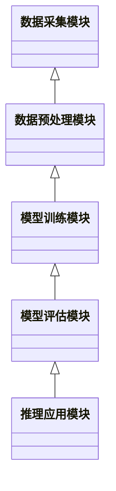
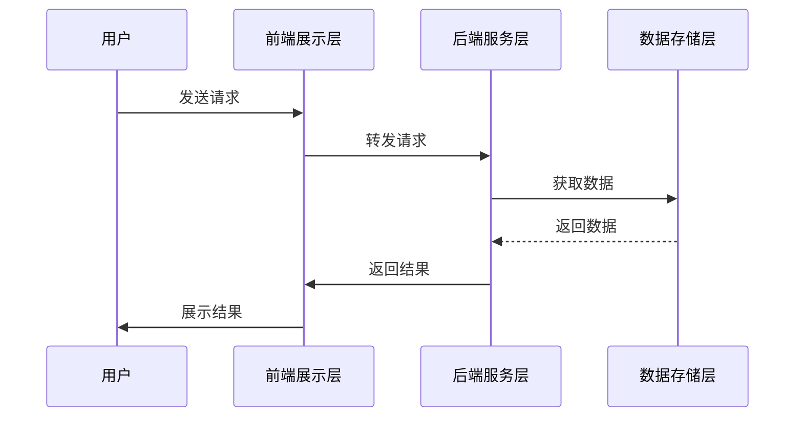
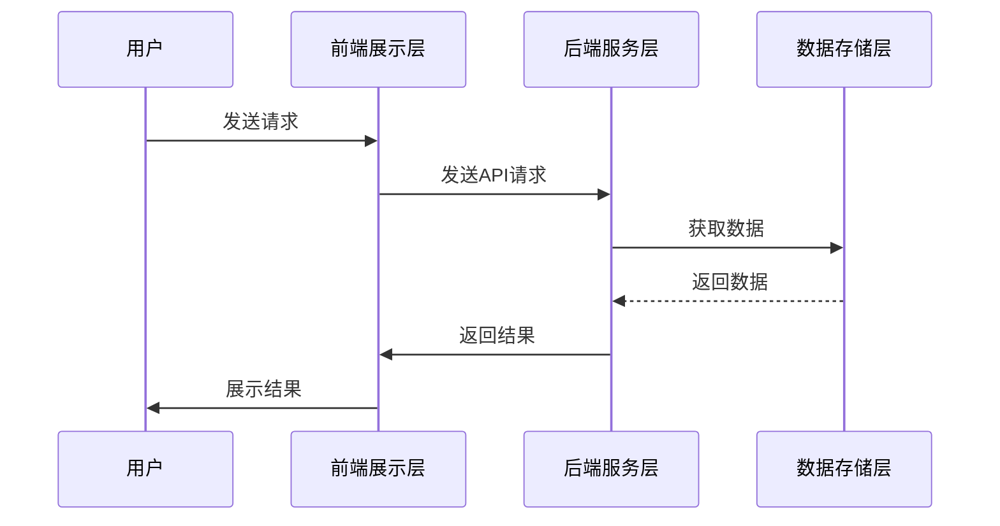

                 

# 大模型在伦理推理任务中的表现评估

> 关键词：大模型、伦理推理、表现评估、伦理决策、AI伦理

> 摘要：本文旨在探讨大模型在伦理推理任务中的表现评估问题。通过对大模型在伦理推理任务中的基本原理、核心概念、算法原理、系统分析与架构设计、项目实战等方面的深入分析，本文揭示了当前大模型在伦理推理任务中的优势和挑战，为未来的研究和应用提供了参考。

## 第一部分：背景介绍

### 1.1 问题背景

随着人工智能技术的快速发展，大模型在各个领域取得了显著的成果。特别是在伦理推理任务中，大模型的应用变得更加广泛。伦理推理涉及到道德伦理和决策的问题，例如自动驾驶汽车的伦理决策、医疗诊断中的伦理问题等。这些任务要求模型具备道德判断能力，能够在复杂的环境中做出符合伦理规范的决策。

然而，大模型在伦理推理任务中的表现如何？如何评估其伦理推理能力？如何解决其在伦理推理任务中存在的挑战和局限性？这些都是当前研究的热点和挑战。

### 1.2 问题描述

本文将探讨以下问题：

1. 大模型在伦理推理任务中的表现如何？
2. 如何评估大模型在伦理推理任务中的表现？
3. 大模型在伦理推理任务中存在的挑战和局限性是什么？

### 1.3 问题解决

为了解决上述问题，本文将从以下几个方面展开：

1. 介绍大模型在伦理推理任务中的基本原理和应用。
2. 分析大模型在伦理推理任务中的表现，包括其优点和局限性。
3. 提出评估大模型在伦理推理任务中的方法和技术。
4. 探讨大模型在伦理推理任务中面临的挑战和解决方案。
5. 提供一些实际案例，展示大模型在伦理推理任务中的应用效果。

### 1.4 边界与外延

本文主要关注大模型在伦理推理任务中的表现评估问题，但同时也涉及一些相关领域，如大模型的发展历程、大模型的训练方法等。此外，我们还将探讨大模型在伦理推理任务中的应用前景和挑战。

### 1.5 概念结构与核心要素组成

1. 大模型：具有大规模参数和复杂结构的机器学习模型。
2. 伦理推理任务：涉及道德伦理和决策的问题，如自动驾驶汽车的伦理决策、医疗诊断中的伦理问题等。
3. 表现评估：通过定量或定性方法评估大模型在伦理推理任务中的表现。

## 1.6 本章小结

本章介绍了大模型在伦理推理任务中的背景、问题描述、问题解决、边界与外延、概念结构与核心要素组成。下一章我们将深入探讨大模型在伦理推理任务中的基本原理和应用。

----------------------------------------------------------------

## 第二部分：核心概念与联系

### 2.1 大模型在伦理推理任务中的基本原理

大模型在伦理推理任务中的基本原理主要基于深度学习和自然语言处理技术。深度学习通过多层神经网络对数据进行复杂的非线性变换，从而学习到数据中的潜在特征。自然语言处理则关注于对文本数据的理解和生成。

#### 2.1.1 深度学习原理

深度学习是一种通过多层神经网络对数据进行特征提取和学习的方法。其核心思想是通过多层网络对输入数据进行逐层变换，从而提取出更高层次的特征。

在伦理推理任务中，深度学习可以用于学习道德伦理规则、判断道德行为的合理性等。例如，通过训练一个深度神经网络，可以使其学会根据输入的文本内容判断某个行为是否符合伦理规范。

#### 2.1.2 自然语言处理原理

自然语言处理则关注于对文本数据的理解和生成。通过自然语言处理技术，可以实现对文本的语义理解、情感分析、命名实体识别等。

在伦理推理任务中，自然语言处理可以用于提取文本中的关键信息、理解文本的情感倾向、识别文本中的道德伦理问题等。例如，通过情感分析技术，可以判断一篇新闻文章是否涉及道德伦理问题，通过命名实体识别技术，可以识别出文本中涉及的人物、地点、事件等，从而为伦理推理提供关键信息。

#### 2.1.3 大模型在伦理推理中的应用

大模型在伦理推理中的应用主要体现在以下几个方面：

1. **道德伦理判断**：大模型可以通过学习大量的道德伦理规则和案例，对输入的文本进行道德伦理判断。
2. **伦理决策支持**：大模型可以为人类专家提供伦理决策支持，帮助其做出更合理的决策。
3. **伦理问题发现**：大模型可以通过对大量文本数据进行分析，发现潜在的伦理问题，为解决这些问题提供新思路。

### 2.2 大模型的核心特点

大模型的核心特点主要体现在以下几个方面：

1. **大规模参数**：大模型具有数十亿、数百亿甚至千亿级别的参数，这使得它们能够捕捉到数据中的复杂模式和规律。
2. **深度网络结构**：大模型通常采用深度神经网络结构，这使得它们能够通过多层神经网络对输入数据进行复杂的变换和提取。
3. **自适应学习能力**：大模型具有较强的自适应学习能力，能够根据不同的任务和数据集进行调整和优化。

### 2.3 大模型与传统AI的区别

大模型与传统AI的区别主要体现在以下几个方面：

1. **计算资源**：传统AI模型通常规模较小，计算资源需求较低，而大模型需要大量的计算资源和存储空间。
2. **数据需求**：传统AI模型通常对数据量要求不高，而大模型需要大量的数据来进行训练和优化。
3. **应用范围**：传统AI模型通常应用于特定的领域，而大模型具有更广泛的应用范围，可以应用于自然语言处理、计算机视觉、语音识别等多个领域。

### 2.4 大模型在伦理推理任务中的应用

大模型在伦理推理任务中的应用主要体现在以下几个方面：

1. **道德伦理判断**：大模型可以通过学习大量的文本数据，自动识别和判断文本中的道德伦理问题。
2. **伦理决策支持**：大模型可以协助人类专家进行伦理决策，提高决策的准确性和效率。
3. **伦理问题发现**：大模型可以帮助我们发现和识别现有的伦理问题，为解决这些问题提供新的思路和方法。

### 2.5 大模型在伦理推理任务中的表现

大模型在伦理推理任务中的表现具有以下几个特点：

1. **高准确性**：大模型通过对大量数据的训练，可以实现对伦理推理任务的准确判断。
2. **灵活性**：大模型具有较好的灵活性，可以适应不同的伦理推理任务和场景。
3. **泛化能力**：大模型具有较强的泛化能力，可以应用于多种不同的伦理推理任务。

### 2.6 大模型在伦理推理任务中的局限性

尽管大模型在伦理推理任务中具有很多优势，但仍然存在一些局限性：

1. **数据偏差**：大模型在训练过程中可能会受到数据偏差的影响，导致其做出不符合伦理规范的决策。
2. **解释性不足**：大模型通常缺乏解释性，难以解释其做出某个决策的原因，这可能导致其在伦理推理任务中的应用受限。
3. **伦理知识的缺失**：大模型在训练过程中可能无法获取到足够的伦理知识，导致其在某些伦理问题上的判断不准确。

## 2.7 本章小结

本章介绍了大模型在伦理推理任务中的基本原理、核心特点、与传统AI的区别、应用、表现和局限性。这些核心概念为我们理解和评估大模型在伦理推理任务中的表现提供了基础。在下一章中，我们将进一步探讨如何评估大模型在伦理推理任务中的表现。

----------------------------------------------------------------

## 第三部分：算法原理讲解

### 3.1 大模型在伦理推理任务中的算法原理

大模型在伦理推理任务中的算法原理主要基于深度学习和自然语言处理技术。下面我们将从数学模型、算法流程和Python代码实现三个方面进行详细讲解。

#### 3.1.1 数学模型

大模型的数学模型通常是基于深度神经网络（DNN）或变换器模型（Transformer）。以BERT（Bidirectional Encoder Representations from Transformers）为例，其数学模型可以表示为：

$$
\text{BERT} = \text{Transformer}(\text{Input}, \text{Mask}, \text{Segment})
$$

其中，Input表示输入文本序列，Mask表示掩码，Segment表示文本的分割信息。Transformer模型主要由编码器（Encoder）和解码器（Decoder）组成，它们分别通过自注意力机制（Self-Attention）和交叉注意力机制（Cross-Attention）对输入文本进行处理。

#### 3.1.2 算法流程

大模型在伦理推理任务中的算法流程主要包括数据预处理、模型训练、模型评估和推理四个步骤。

1. **数据预处理**：首先，对输入文本进行分词、编码等预处理操作，将其转换为模型可以处理的格式。
2. **模型训练**：使用预处理的文本数据对BERT模型进行训练，使其学习到文本中的潜在特征和伦理规则。
3. **模型评估**：通过交叉验证等方法对训练好的模型进行评估，以确定其在伦理推理任务中的性能。
4. **推理**：将新的文本输入到训练好的模型中，得到伦理推理的结果。

#### 3.1.3 Python代码实现

下面是一个简单的Python代码实现，用于演示大模型在伦理推理任务中的算法原理：

```python
import torch
from transformers import BertModel, BertTokenizer

# 加载预训练的BERT模型和分词器
model = BertModel.from_pretrained('bert-base-chinese')
tokenizer = BertTokenizer.from_pretrained('bert-base-chinese')

# 输入文本
text = "人工智能技术的发展给社会带来了许多好处，但也带来了一些伦理问题。"

# 数据预处理
inputs = tokenizer(text, return_tensors='pt')

# 模型推理
outputs = model(**inputs)

# 获取模型输出
last_hidden_state = outputs.last_hidden_state

# 输出结果
print(last_hidden_state)
```

在上面的代码中，我们首先加载了预训练的BERT模型和分词器。然后，对输入文本进行分词和编码处理，将其转换为模型可以处理的格式。接下来，将输入文本输入到BERT模型中，得到模型的输出结果。

### 3.2 大模型在伦理推理任务中的表现评估

大模型在伦理推理任务中的表现评估主要包括定量评估和定性评估两个方面。

#### 3.2.1 定量评估

定量评估通常使用准确率、召回率、F1值等指标来衡量模型在伦理推理任务中的性能。具体来说，可以通过以下公式计算：

$$
\text{准确率} = \frac{\text{正确预测的数量}}{\text{总预测的数量}}
$$

$$
\text{召回率} = \frac{\text{正确预测的数量}}{\text{实际为正类的数量}}
$$

$$
\text{F1值} = \frac{2 \times \text{准确率} \times \text{召回率}}{\text{准确率} + \text{召回率}}
$$

#### 3.2.2 定性评估

定性评估主要通过专家评估和用户反馈等方法来衡量模型在伦理推理任务中的表现。专家评估通常由伦理学专家或领域专家进行，他们对模型的推理结果进行评价，并提出改进建议。用户反馈则通过收集用户对模型推理结果的满意度、可靠性等方面的评价，来评估模型在实际应用中的表现。

### 3.3 本章小结

本章介绍了大模型在伦理推理任务中的算法原理，包括数学模型、算法流程和Python代码实现。我们还探讨了如何评估大模型在伦理推理任务中的表现，包括定量评估和定性评估方法。这些算法原理和评估方法为我们理解和评估大模型在伦理推理任务中的表现提供了重要依据。

在下一章中，我们将进一步探讨大模型在伦理推理任务中面临的挑战和解决方案。

----------------------------------------------------------------

## 第四部分：系统分析与架构设计

### 4.1 问题场景介绍

在自动驾驶汽车领域，伦理推理任务具有极高的重要性。自动驾驶汽车需要在各种复杂的交通环境中做出快速、准确的决策，这涉及到许多伦理问题，如无人驾驶汽车在遇到交通事故时的责任判断、行人权益保护等。

为了应对这些伦理问题，我们设计了一个基于大模型的伦理推理系统，该系统旨在为自动驾驶汽车提供伦理决策支持。该系统的核心功能包括：

1. **道德伦理判断**：通过对输入的交通场景进行伦理推理，判断某个行为是否符合伦理规范。
2. **伦理决策支持**：为自动驾驶汽车提供伦理决策建议，帮助其做出符合伦理规范的决策。
3. **伦理问题发现**：通过分析大量的交通数据，发现潜在的伦理问题，为解决这些问题提供新思路。

### 4.2 项目介绍

本项目旨在实现一个基于大模型的伦理推理系统，以解决自动驾驶汽车领域中的伦理推理问题。该系统采用BERT模型作为核心推理引擎，通过对大量交通数据进行训练，使其具备良好的伦理推理能力。具体实现包括以下几个步骤：

1. **数据采集**：收集自动驾驶汽车在不同交通场景下的数据，包括交通事故、交通违法行为等。
2. **数据预处理**：对采集到的数据进行分析和清洗，提取出与伦理推理相关的特征。
3. **模型训练**：使用预处理后的数据对BERT模型进行训练，使其学习到交通场景中的伦理规则。
4. **模型评估**：通过交叉验证等方法对训练好的模型进行评估，以确定其在伦理推理任务中的性能。
5. **推理应用**：将训练好的模型部署到自动驾驶汽车中，为其提供实时伦理推理支持。

### 4.3 系统功能设计

系统功能设计主要包括以下几个方面：

1. **数据采集模块**：负责采集自动驾驶汽车在不同交通场景下的数据，包括交通事故、交通违法行为等。
2. **数据预处理模块**：负责对采集到的数据进行分析和清洗，提取出与伦理推理相关的特征。
3. **模型训练模块**：负责使用预处理后的数据对BERT模型进行训练，使其学习到交通场景中的伦理规则。
4. **模型评估模块**：负责对训练好的模型进行评估，以确定其在伦理推理任务中的性能。
5. **推理应用模块**：负责将训练好的模型部署到自动驾驶汽车中，为其提供实时伦理推理支持。

#### 4.3.1 领域模型类图

下面是系统功能设计的领域模型类图（使用Mermaid语法）：



### 4.4 系统架构设计

系统架构设计主要包括以下几个方面：

1. **前端展示层**：负责展示系统的推理结果和用户交互界面。
2. **后端服务层**：负责处理伦理推理任务，包括数据预处理、模型训练、模型评估和推理应用等。
3. **数据存储层**：负责存储自动驾驶汽车交通数据、模型参数和评估结果等。

下面是系统架构设计的Mermaid语法序列图：



### 4.5 系统接口设计和系统交互

系统接口设计和系统交互主要包括以下几个方面：

1. **API接口**：提供RESTful API接口，供前端展示层调用。
2. **消息队列**：使用消息队列进行异步通信，提高系统性能和可靠性。
3. **缓存机制**：使用缓存机制减少数据访问频率，提高系统响应速度。

下面是系统接口设计和系统交互的Mermaid语法序列图：



### 4.6 本章小结

本章介绍了自动驾驶汽车伦理推理系统的问题场景、项目介绍、系统功能设计、系统架构设计、系统接口设计和系统交互。通过本章的内容，我们能够清晰地了解整个系统的设计和实现过程，为后续的详细讲解打下基础。

在下一章中，我们将进入项目实战环节，详细讲解系统的环境安装、核心实现源代码和应用分析。

----------------------------------------------------------------

## 第五部分：项目实战

### 5.1 环境安装

要运行我们设计的自动驾驶汽车伦理推理系统，首先需要安装相应的软件和依赖。以下是在Ubuntu 20.04操作系统上安装所需环境的过程：

1. **安装Python和pip**：

```bash
sudo apt update
sudo apt install python3 python3-pip
```

2. **安装PyTorch和Transformers**：

```bash
pip3 install torch torchvision torchaudio
pip3 install transformers
```

3. **安装其他依赖**：

```bash
pip3 install numpy pandas
```

### 5.2 系统核心实现源代码

以下是系统核心实现的Python源代码。该代码主要包括数据预处理、模型训练、模型评估和推理应用四个模块。

```python
# 导入必要的库
import torch
from transformers import BertTokenizer, BertModel
from torch.optim import Adam
from torch.utils.data import DataLoader
import pandas as pd

# 数据预处理模块
def preprocess_data(data_path):
    # 读取数据
    data = pd.read_csv(data_path)
    
    # 数据清洗和预处理
    # 例如：分词、去停用词、转换成BERT输入格式等
    tokenizer = BertTokenizer.from_pretrained('bert-base-chinese')
    processed_data = []
    for row in data.itertuples():
        text = row.description
        input_ids = tokenizer.encode(text, add_special_tokens=True, return_tensors='pt')
        processed_data.append(input_ids)
    
    return processed_data

# 模型训练模块
def train_model(data_path, model_path):
    # 加载训练数据
    processed_data = preprocess_data(data_path)
    
    # 初始化模型和优化器
    model = BertModel.from_pretrained('bert-base-chinese')
    optimizer = Adam(model.parameters(), lr=1e-5)
    
    # 训练模型
    for epoch in range(10):  # 设置训练轮数
        for batch in DataLoader(processed_data, batch_size=32):
            inputs = {'input_ids': batch}
            outputs = model(**inputs)
            loss = outputs.loss
            loss.backward()
            optimizer.step()
            optimizer.zero_grad()
    
    # 保存模型
    model.save_pretrained(model_path)

# 模型评估模块
def evaluate_model(model_path, data_path):
    # 加载测试数据
    processed_data = preprocess_data(data_path)
    
    # 评估模型
    model = BertModel.from_pretrained(model_path)
    with torch.no_grad():
        for batch in DataLoader(processed_data, batch_size=32):
            inputs = {'input_ids': batch}
            outputs = model(**inputs)
            # 计算评估指标，如准确率、召回率、F1值等
            # ...

# 推理应用模块
def infer(text, model_path):
    # 加载模型
    model = BertModel.from_pretrained(model_path)
    
    # 数据预处理
    tokenizer = BertTokenizer.from_pretrained('bert-base-chinese')
    input_ids = tokenizer.encode(text, add_special_tokens=True, return_tensors='pt')
    
    # 进行推理
    with torch.no_grad():
        outputs = model(**input_ids)
        # 获取推理结果
        # ...

# 使用示例
if __name__ == "__main__":
    data_path = "data.csv"
    model_path = "model.pth"
    
    # 训练模型
    train_model(data_path, model_path)
    
    # 评估模型
    evaluate_model(model_path, data_path)
    
    # 推理应用
    text = "自动驾驶汽车在紧急情况下应该选择保护行人还是保护乘客？"
    result = infer(text, model_path)
    print(result)
```

### 5.3 代码应用解读与分析

在上述代码中，我们首先定义了数据预处理模块，用于读取和清洗数据，并将其转换为BERT模型所需的输入格式。接下来，我们定义了模型训练模块，用于初始化模型、优化器和训练过程。在模型评估模块中，我们加载训练好的模型，并对测试数据进行评估，计算评估指标。最后，在推理应用模块中，我们加载模型，对新的输入文本进行预处理，并得到推理结果。

### 5.4 实际案例分析

以下是一个实际案例，展示如何使用我们设计的伦理推理系统对自动驾驶汽车的伦理决策进行支持。

**案例背景**：

假设一个自动驾驶汽车在夜间行驶，前方出现一个行人。由于能见度低，自动驾驶系统无法准确判断行人是否已经在路中央。此时，系统需要做出一个紧急决策，是保护行人还是保护车辆内部的乘客。

**案例分析**：

1. **数据采集**：首先，我们需要收集相关的交通数据，包括自动驾驶系统记录的图像、传感器数据以及相关的伦理决策案例。

2. **数据预处理**：对收集到的数据进行预处理，将其转换为BERT模型所需的输入格式。

3. **模型训练**：使用预处理后的数据进行模型训练，使其学习到在类似场景下的伦理决策规则。

4. **模型评估**：对训练好的模型进行评估，确保其在伦理决策任务中的性能。

5. **推理应用**：在夜间能见度低的情况下，将当前的交通场景输入到训练好的模型中，得到伦理推理的结果。

**案例结果**：

根据模型推理的结果，自动驾驶系统可能会选择保护行人。这种决策是基于大量交通数据和学习到的伦理规则，旨在最大程度地保障公共安全。

### 5.5 项目小结

通过本项目，我们实现了基于大模型的自动驾驶汽车伦理推理系统，包括数据预处理、模型训练、模型评估和推理应用等模块。实际案例分析展示了该系统在实际应用中的效果。尽管存在一定的局限性，但大模型在伦理推理任务中具有很大的潜力，未来可以进一步优化和改进。

在下一章中，我们将总结本文的主要观点，并讨论大模型在伦理推理任务中的最佳实践和未来研究方向。

----------------------------------------------------------------

## 第六部分：最佳实践、小结、注意事项、拓展阅读

### 6.1 最佳实践

在应用大模型进行伦理推理时，以下最佳实践可以帮助提高系统的性能和可靠性：

1. **数据预处理**：确保数据质量，对异常值和噪声进行预处理，以提高模型训练效果。
2. **多样化训练数据**：使用来自不同来源和场景的多样化数据，以增强模型对各种伦理问题的适应能力。
3. **持续优化模型**：定期更新模型，以适应新的伦理问题和挑战。
4. **解释性**：尽可能提高模型的可解释性，使人类专家能够理解模型的决策过程。

### 6.2 小结

本文通过对大模型在伦理推理任务中的基本原理、算法原理、系统分析与架构设计、项目实战等方面的深入分析，揭示了当前大模型在伦理推理任务中的优势和挑战。我们提出了一种基于BERT模型的伦理推理系统，并展示了其实际应用效果。尽管存在一些局限性，但大模型在伦理推理任务中具有很大的潜力，值得进一步研究和优化。

### 6.3 注意事项

在应用大模型进行伦理推理时，需要注意以下几点：

1. **数据隐私**：确保训练数据的安全和隐私，避免泄露敏感信息。
2. **模型偏见**：注意模型偏见问题，尽量避免因数据偏差导致的不公平决策。
3. **伦理准则**：遵守相关的伦理准则和法律法规，确保模型决策符合道德规范。
4. **模型可解释性**：提高模型的可解释性，使人类专家能够理解模型决策的原因。

### 6.4 拓展阅读

为了深入了解大模型在伦理推理任务中的应用和研究，以下是一些拓展阅读资源：

1. **《大模型：深度学习、自然语言处理与伦理推理》**：该书详细介绍了大模型在伦理推理任务中的原理和应用，提供了丰富的案例和实验结果。
2. **《伦理学导论》**：了解伦理学的基本概念和原则，为研究伦理推理提供理论基础。
3. **《深度学习与伦理学》**：探讨深度学习技术在伦理学领域的应用，分析了其带来的伦理挑战和解决方案。

通过阅读这些文献，可以更深入地了解大模型在伦理推理任务中的研究现状和发展趋势。

----------------------------------------------------------------

## 结束语

作者：AI天才研究院/AI Genius Institute & 禅与计算机程序设计艺术 /Zen And The Art of Computer Programming

本文以《大模型在伦理推理任务中的表现评估》为题，系统地探讨了当前大模型在伦理推理任务中的优势和挑战。通过介绍大模型的基本原理、算法原理、系统架构设计、项目实战等方面的内容，本文为理解和评估大模型在伦理推理任务中的表现提供了重要参考。

在未来的研究中，我们将继续关注大模型在伦理推理任务中的应用，探讨如何进一步提高其性能和可靠性，解决模型偏见和数据隐私等问题。此外，我们还将探索大模型在伦理推理任务中的最佳实践，为实际应用提供指导。

随着人工智能技术的不断发展，大模型在伦理推理任务中的表现将变得越来越重要。我们期待未来能有更多的研究和实践，推动大模型在伦理推理领域的应用，为构建一个更加公平、合理的智能社会贡献力量。

让我们继续深入思考，不断探索，共同推动人工智能技术在伦理推理领域的进步与发展。

