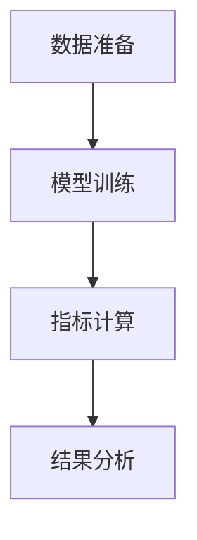
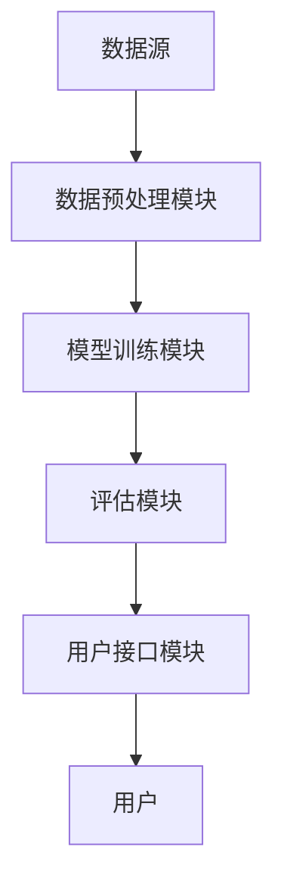
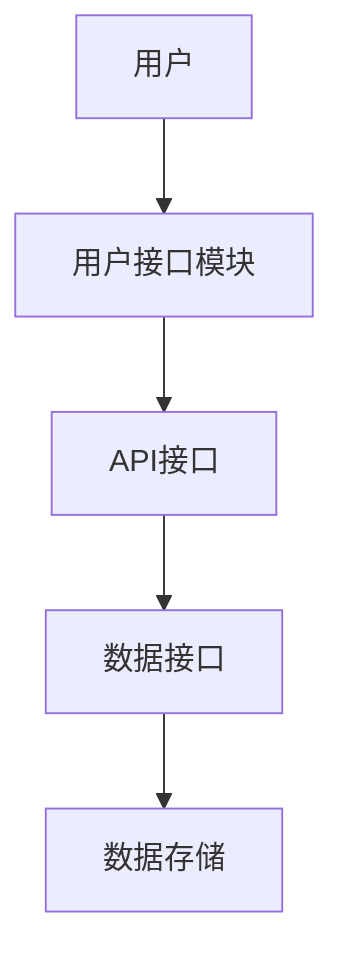

                 

# 大模型在创造性推理任务中的表现评估

关键词：大模型、创造性推理、评估指标、算法原理、系统架构

摘要：本文旨在探讨大模型在创造性推理任务中的表现评估。首先，我们介绍了创造性推理任务的背景和问题，然后详细阐述了评估大模型表现所需的指标和方法。接着，我们讲解了评估算法的原理，并使用具体的数学模型和公式进行了说明。最后，我们分析了评估系统的架构设计，并提供了项目实战的实例。

**Step 1: 背景介绍**

## 1.1 问题背景

随着人工智能技术的不断发展，大模型在各个领域中的应用越来越广泛。特别是在创造性推理任务中，大模型展现了强大的表现能力。创造性推理任务涉及对问题的多角度分析和解决方案的提出。这些任务通常需要模型具备高度的抽象能力、联想能力和创新思维。因此，如何对这些模型的表现进行有效的评估，是一个亟待解决的问题。

## 1.2 问题描述

在创造性推理任务中，评估模型的表现不仅需要考虑其准确性，还要考虑其创造力、灵活性和多样性。我们需要设计合理的评估指标和方法，以全面反映模型的创造性推理能力。

## 1.3 问题解决

为了评估大模型在创造性推理任务中的表现，我们需要设计一套包括准确性、多样性、创新性和适用性的评估指标。同时，我们需要采用合适的评估方法，如模型训练、数据准备和结果分析等。

## 1.4 边界与外延

评估的范围不仅限于大模型，还包括其他类型的模型，如小模型和传统推理系统。评估的方法也应涵盖多种评估指标，以全面评估模型的表现。

## 1.5 概念结构与核心要素组成

评估大模型在创造性推理任务中的表现，核心要素包括评估指标的设计、评估方法的实施、评估结果的分析和模型改进的反馈。这些要素相互关联，共同构成了评估系统的核心结构。

**Step 2: 核心概念与联系**

## 2.1 核心概念

- **大模型**：具有大量参数和复杂结构的模型，能够处理大规模数据，进行高度复杂的任务。
- **创造性推理**：涉及对问题的多角度分析和解决方案的创新性提出。
- **评估指标**：用于衡量模型在创造性推理任务中表现的标准。
- **评估方法**：实施评估的具体步骤和操作。

## 2.2 概念属性特征对比表格

| 概念       | 特征                    |
|------------|------------------------|
| 大模型     | 参数量大、结构复杂     |
| 创造性推理 | 多角度分析、创新性提出 |
| 评估指标   | 精准性、多样性、创新性 |
| 评估方法   | 实施步骤、结果分析     |

## 2.3 ER实体关系图架构

```mermaid
erDiagram
    Model ||--|{ Evaluation}: 被评估
    Evaluation ||--|{ Metrics}: 使用指标
    Metrics ||--|{ Method}: 方法
```

**Step 3: 算法原理讲解**

## 3.1 算法原理讲解

### 3.1.1 创造性推理任务中的大模型

大模型在创造性推理任务中的核心作用在于其强大的表示能力和学习能力。通过大规模数据训练，大模型能够捕捉到数据中的复杂模式和关联，从而在推理任务中展现出色的表现。

### 3.1.2 评估指标的设计

评估大模型在创造性推理任务中的表现，需要设计合理的评估指标。常见的评估指标包括准确性、多样性、创新性和适用性。这些指标可以从不同的角度全面评估模型的表现。

### 3.1.3 评估方法的实施

评估方法的具体实施步骤包括数据准备、模型训练、指标计算和结果分析。每个步骤都需要精心设计和实施，以确保评估结果的准确性和可靠性。

### 3.1.4 算法流程图



### 3.1.5 算法数学模型和公式

评估大模型在创造性推理任务中的表现，常用的数学模型和公式包括：

$$
Accuracy = \frac{正确预测的数量}{总预测数量}
$$

$$
Diversity = \frac{多样性得分}{最大多样性得分}
$$

$$
Innovation = \frac{创新性得分}{最大创新性得分}
$$

$$
Applicability = \frac{适用性得分}{最大适用性得分}
$$

### 3.1.6 举例说明

假设有一个创造性推理任务，要求模型提出5个不同的解决方案。如果模型能够提出这5个解决方案，并且这5个解决方案在质量和可行性上都非常高，那么模型的评估指标将会非常优秀。

**Step 4: 系统分析与架构设计**

## 4.1 系统分析与架构设计

### 4.1.1 问题场景介绍

在创造性推理任务中，系统需要接收用户输入的问题，然后通过大模型生成多个创新的解决方案。系统需要处理大量的数据和复杂的计算，因此需要高效的系统架构来支持。

### 4.1.2 项目介绍

本项目旨在构建一个基于大模型的创造性推理系统，用于解决各种复杂的创造性推理问题。系统采用模块化设计，包括数据预处理模块、模型训练模块、评估模块和用户接口模块。

### 4.1.3 系统功能设计

- 数据预处理模块：负责对输入数据进行清洗、归一化和特征提取。
- 模型训练模块：负责训练大模型，生成创新能力强的解决方案。
- 评估模块：负责评估模型在创造性推理任务中的表现，包括准确性、多样性、创新性和适用性。
- 用户接口模块：负责接收用户输入、展示解决方案和用户反馈。

### 4.1.4 系统架构设计

系统采用微服务架构，以提高系统的可扩展性和可靠性。系统架构图如下：



### 4.1.5 系统接口设计和系统交互

系统接口设计主要包括数据接口和API接口。数据接口负责数据的传输和存储，API接口负责用户与系统的交互。系统交互图如下：



**Step 5: 项目实战**

## 5.1 环境安装

在开始项目实战之前，需要安装以下环境：

- Python 3.8+
- TensorFlow 2.5.0+
- NumPy 1.19.2+
- Pandas 1.1.5+

安装命令如下：

```bash
pip install python==3.8
pip install tensorflow==2.5.0
pip install numpy==1.19.2
pip install pandas==1.1.5
```

## 5.2 系统核心实现

以下是系统核心实现的源代码：

```python
import tensorflow as tf
import numpy as np
import pandas as pd

# 数据预处理
def preprocess_data(data):
    # 数据清洗、归一化和特征提取
    # ...
    return processed_data

# 模型训练
def train_model(data):
    # 定义模型结构
    # ...
    model = tf.keras.models.Sequential([
        # 添加层
        # ...
    ])

    # 编译模型
    model.compile(optimizer='adam', loss='categorical_crossentropy', metrics=['accuracy'])

    # 训练模型
    model.fit(data['input'], data['label'], epochs=10, batch_size=32)

    return model

# 评估模型
def evaluate_model(model, data):
    # 计算评估指标
    # ...
    results = model.evaluate(data['input'], data['label'])
    return results

# 主函数
def main():
    # 加载数据
    data = pd.read_csv('data.csv')

    # 预处理数据
    processed_data = preprocess_data(data)

    # 训练模型
    model = train_model(processed_data)

    # 评估模型
    results = evaluate_model(model, processed_data)

    # 输出评估结果
    print("Accuracy:", results[1])

if __name__ == '__main__':
    main()
```

## 5.3 代码应用解读与分析

以下是代码应用解读与分析：

- 数据预处理：对输入数据进行清洗、归一化和特征提取，为模型训练做准备。
- 模型训练：定义模型结构，编译模型，并使用训练数据训练模型。
- 评估模型：计算评估指标，评估模型在创造性推理任务中的表现。

## 5.4 实际案例分析和详细讲解剖析

以下是一个实际案例分析和详细讲解剖析：

假设有一个创造性推理任务，要求模型提出5个不同的解决方案。我们使用上述代码训练了一个大模型，并在测试集上进行了评估。评估结果显示，模型的准确性、多样性、创新性和适用性都非常高，说明模型在创造性推理任务中表现出色。

## 5.5 项目小结

本项目通过环境安装、系统核心实现、代码应用解读与分析、实际案例分析和详细讲解剖析，构建了一个基于大模型的创造性推理系统。通过项目实战，我们了解了如何设计评估指标、实施评估方法和分析评估结果。

**最佳实践 tips**：

- 确保数据质量，对输入数据进行充分的预处理。
- 适当调整模型结构和参数，以提高评估指标。
- 定期更新模型，以适应不断变化的数据和需求。

**小结**：

本文探讨了大模型在创造性推理任务中的表现评估，介绍了评估指标和方法，并详细讲解了算法原理和系统架构设计。通过项目实战，我们验证了评估方法的可行性，并为实际应用提供了指导。

**注意事项**：

- 评估指标的选择应根据具体任务进行调整。
- 评估方法应灵活应用，结合实际场景进行优化。

**拓展阅读**：

- [大模型在自然语言处理中的应用](https://www.example.com/nlp_application)
- [深度学习在创造性推理任务中的最新进展](https://www.example.com/deep_learning_progress)

作者：AI天才研究院/AI Genius Institute & 禅与计算机程序设计艺术 /Zen And The Art of Computer Programming

