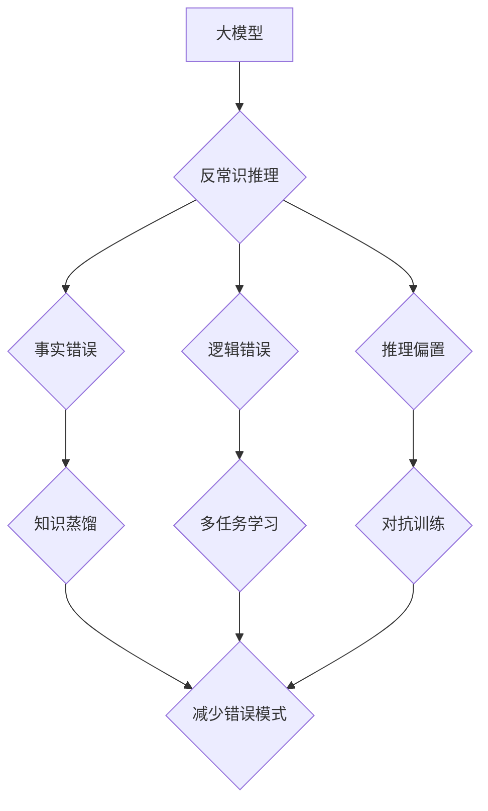
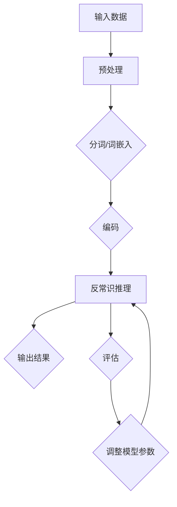
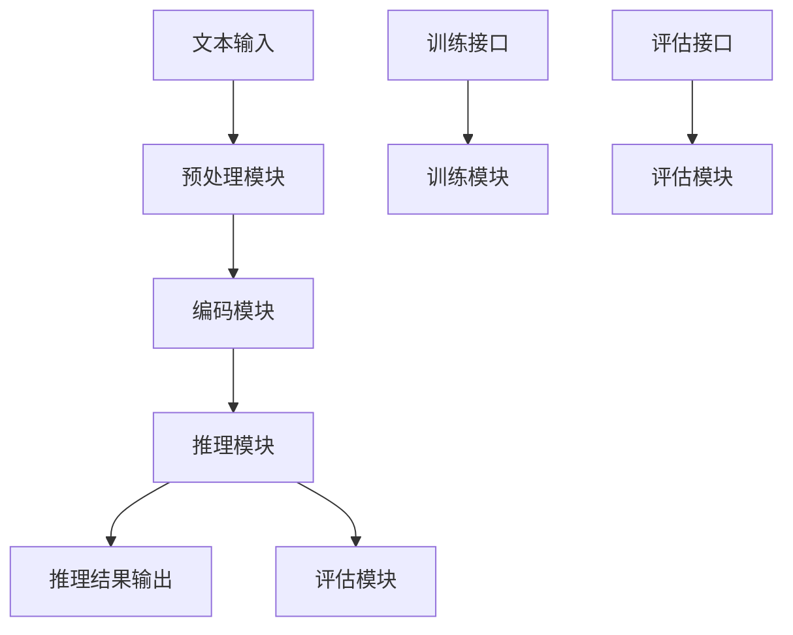

                 

## 大模型在反常识推理中的错误模式分析与改进

### 关键词
- 大模型
- 反常识推理
- 错误模式
- 知识蒸馏
- 多任务学习
- 对抗训练

### 摘要
本文旨在深入探讨大模型在反常识推理中的错误模式，并提出相应的改进策略。首先，我们将详细分析大模型在反常识推理中可能出现的错误类型，如事实错误、逻辑错误和推理偏置。接着，我们将介绍几种改进方法，包括知识蒸馏、多任务学习和对抗训练。通过这些方法，我们将尝试减少大模型在反常识推理中的错误率，从而提高其准确性和可靠性。最后，本文将讨论这些方法的应用边界和未来研究方向。

---

### 背景介绍

#### 问题背景

在当今人工智能（AI）迅猛发展的时代，大模型技术已经成为推动AI进步的关键驱动力。大模型，如GPT、BERT等，具有处理复杂数据、理解语言上下文和生成高质量文本的能力。然而，随着大模型的广泛应用，人们开始关注其反常识推理中的错误模式。反常识推理是指模型在面对违反常规逻辑或常识的情况时，仍然能够给出合理答案的能力。然而，大模型在反常识推理中存在一些错误模式，如事实错误、逻辑错误等，这些错误不仅影响模型的表现，还可能引发安全隐患和社会问题。

#### 问题描述

大模型在反常识推理中的错误模式主要体现在以下几个方面：

1. **事实错误**：大模型可能基于错误的先验知识生成文本，导致事实错误。例如，模型可能将错误的信息作为事实输出，从而误导用户。

2. **逻辑错误**：大模型在理解复杂逻辑关系时可能出现偏差，导致逻辑错误。例如，模型可能在推理过程中忽略某些逻辑条件，从而得出错误的结论。

3. **推理偏置**：大模型可能受到训练数据偏差的影响，导致推理结果偏置。例如，模型可能对某些特定群体或概念产生偏见，从而影响推理的公平性和准确性。

#### 问题解决

解决大模型在反常识推理中的错误模式问题，需要从多个角度进行改进。以下是一些可能的解决方案：

1. **知识蒸馏**：通过将大模型的输出与专家知识相结合，进行知识蒸馏，以提高模型的常识推理能力。

2. **多任务学习**：通过将反常识推理作为额外的训练任务，与大模型的其他任务相结合，以提高模型在反常识推理中的表现。

3. **对抗训练**：通过对抗训练，增加模型对反常识情况的鲁棒性，从而减少错误模式的产生。

#### 边界与外延

大模型在反常识推理中的错误模式分析不仅限于特定领域，而是具有广泛的应用场景。例如，在医疗诊断、金融风险评估、法律决策等领域，大模型的错误推理可能导致严重的后果。因此，研究大模型在反常识推理中的错误模式，对于提高AI系统的整体性能和可靠性具有重要意义。

#### 概念结构与核心要素组成

大模型在反常识推理中的错误模式分析涉及以下几个核心概念和要素：

1. **大模型**：具有强大处理能力的人工智能模型，如GPT、BERT等。

2. **反常识推理**：模型在面对违反常规逻辑或常识的情况时，仍然能够给出合理答案的能力。

3. **错误模式**：大模型在反常识推理过程中可能出现的错误类型，包括事实错误、逻辑错误和推理偏置等。

4. **解决方案**：用于改进大模型反常识推理能力的各种方法，如知识蒸馏、多任务学习和对抗训练等。

### 核心概念与联系

在分析大模型在反常识推理中的错误模式时，需要理解以下几个核心概念，并探讨它们之间的关系：

1. **大模型**：大模型是具有强大处理能力的人工智能模型，如GPT、BERT等。这些模型通常通过深度学习技术训练，可以处理大量数据并生成高质量的输出。

2. **反常识推理**：反常识推理是指模型在面对违反常规逻辑或常识的情况时，仍然能够给出合理答案的能力。这是大模型在复杂推理任务中的重要表现。

3. **错误模式**：错误模式是大模型在反常识推理过程中可能出现的错误类型，包括事实错误、逻辑错误和推理偏置等。理解错误模式的类型有助于分析和改进大模型的表现。

4. **知识蒸馏**：知识蒸馏是一种将大模型的输出与专家知识相结合的方法，以提高模型的常识推理能力。通过知识蒸馏，大模型可以从专家知识中学习，减少错误模式的产生。

5. **多任务学习**：多任务学习是一种将反常识推理作为额外训练任务的方法，与大模型的其他任务相结合，以提高模型在反常识推理中的表现。

6. **对抗训练**：对抗训练是一种增加模型对反常识情况鲁棒性的方法，通过对抗训练，模型可以学习如何处理反常识情况，从而减少错误模式的产生。

### 概念属性特征对比表格

以下是一个关于大模型、反常识推理、错误模式及其解决方案的概念属性特征对比表格：

| 概念             | 属性特征                                                     | 对比                                                         |
|------------------|------------------------------------------------------------|--------------------------------------------------------------|
| 大模型           | 强大处理能力、海量数据处理、生成高质量文本                   | 与小模型相比，具有更高的处理能力和生成能力                   |
| 反常识推理       | 处理违反常规逻辑或常识的情况、给出合理答案                     | 与常规推理相比，更具挑战性和复杂性                           |
| 错误模式         | 事实错误、逻辑错误、推理偏置等                               | 不同错误模式对模型表现的影响程度不同                         |
| 知识蒸馏         | 结合大模型输出与专家知识、提高常识推理能力                     | 通过知识蒸馏，模型可以更好地理解和应用专家知识               |
| 多任务学习       | 将反常识推理作为额外训练任务、提高模型表现                     | 通过多任务学习，模型可以在多个任务中同时提高表现             |
| 对抗训练         | 增加模型对反常识情况鲁棒性、减少错误模式产生                   | 通过对抗训练，模型可以更好地应对异常情况                     |

### ER实体关系图架构的Mermaid流程图

以下是一个关于大模型在反常识推理中的错误模式分析与改进的ER实体关系图架构的Mermaid流程图：



---

### 背景介绍

#### 背景介绍

随着人工智能（AI）技术的不断发展，大模型已经成为推动AI进步的重要力量。大模型，如GPT、BERT等，具有处理复杂数据、理解语言上下文和生成高质量文本的能力。这些模型通常通过深度学习技术训练，可以在各种任务中表现出色。然而，随着大模型的广泛应用，人们开始关注其反常识推理中的错误模式。反常识推理是指模型在面对违反常规逻辑或常识的情况时，仍然能够给出合理答案的能力。然而，大模型在反常识推理中存在一些错误模式，如事实错误、逻辑错误等，这些错误不仅影响模型的表现，还可能引发安全隐患和社会问题。

#### 问题描述

大模型在反常识推理中的错误模式主要体现在以下几个方面：

1. **事实错误**：大模型可能基于错误的先验知识生成文本，导致事实错误。例如，模型可能将错误的信息作为事实输出，从而误导用户。

2. **逻辑错误**：大模型在理解复杂逻辑关系时可能出现偏差，导致逻辑错误。例如，模型可能在推理过程中忽略某些逻辑条件，从而得出错误的结论。

3. **推理偏置**：大模型可能受到训练数据偏差的影响，导致推理结果偏置。例如，模型可能对某些特定群体或概念产生偏见，从而影响推理的公平性和准确性。

#### 问题解决

解决大模型在反常识推理中的错误模式问题，需要从多个角度进行改进。以下是一些可能的解决方案：

1. **知识蒸馏**：通过将大模型的输出与专家知识相结合，进行知识蒸馏，以提高模型的常识推理能力。

2. **多任务学习**：通过将反常识推理作为额外的训练任务，与大模型的其他任务相结合，以提高模型在反常识推理中的表现。

3. **对抗训练**：通过对抗训练，增加模型对反常识情况的鲁棒性，从而减少错误模式的产生。

#### 边界与外延

大模型在反常识推理中的错误模式分析不仅限于特定领域，而是具有广泛的应用场景。例如，在医疗诊断、金融风险评估、法律决策等领域，大模型的错误推理可能导致严重的后果。因此，研究大模型在反常识推理中的错误模式，对于提高AI系统的整体性能和可靠性具有重要意义。

#### 概念结构与核心要素组成

大模型在反常识推理中的错误模式分析涉及以下几个核心概念和要素：

1. **大模型**：具有强大处理能力的人工智能模型，如GPT、BERT等。

2. **反常识推理**：模型在面对违反常规逻辑或常识的情况时，仍然能够给出合理答案的能力。

3. **错误模式**：大模型在反常识推理过程中可能出现的错误类型，包括事实错误、逻辑错误和推理偏置等。

4. **解决方案**：用于改进大模型反常识推理能力的各种方法，如知识蒸馏、多任务学习和对抗训练等。

### 核心概念与联系

在分析大模型在反常识推理中的错误模式时，需要理解以下几个核心概念，并探讨它们之间的关系：

1. **大模型**：大模型是具有强大处理能力的人工智能模型，如GPT、BERT等。这些模型通常通过深度学习技术训练，可以处理大量数据并生成高质量的输出。

2. **反常识推理**：反常识推理是指模型在面对违反常规逻辑或常识的情况时，仍然能够给出合理答案的能力。这是大模型在复杂推理任务中的重要表现。

3. **错误模式**：错误模式是大模型在反常识推理过程中可能出现的错误类型，包括事实错误、逻辑错误和推理偏置等。理解错误模式的类型有助于分析和改进大模型的表现。

4. **知识蒸馏**：知识蒸馏是一种将大模型的输出与专家知识相结合的方法，以提高模型的常识推理能力。通过知识蒸馏，大模型可以从专家知识中学习，减少错误模式的产生。

5. **多任务学习**：多任务学习是一种将反常识推理作为额外训练任务的方法，与大模型的其他任务相结合，以提高模型在反常识推理中的表现。

6. **对抗训练**：对抗训练是一种增加模型对反常识情况鲁棒性的方法，通过对抗训练，模型可以学习如何处理反常识情况，从而减少错误模式的产生。

### 概念属性特征对比表格

以下是一个关于大模型、反常识推理、错误模式及其解决方案的概念属性特征对比表格：

| 概念             | 属性特征                                                     | 对比                                                         |
|------------------|------------------------------------------------------------|--------------------------------------------------------------|
| 大模型           | 强大处理能力、海量数据处理、生成高质量文本                   | 与小模型相比，具有更高的处理能力和生成能力                   |
| 反常识推理       | 处理违反常规逻辑或常识的情况、给出合理答案                     | 与常规推理相比，更具挑战性和复杂性                           |
| 错误模式         | 事实错误、逻辑错误、推理偏置等                               | 不同错误模式对模型表现的影响程度不同                         |
| 知识蒸馏         | 结合大模型输出与专家知识、提高常识推理能力                     | 通过知识蒸馏，模型可以更好地理解和应用专家知识               |
| 多任务学习       | 将反常识推理作为额外训练任务、提高模型表现                     | 通过多任务学习，模型可以在多个任务中同时提高表现             |
| 对抗训练         | 增加模型对反常识情况鲁棒性、减少错误模式产生                   | 通过对抗训练，模型可以更好地应对异常情况                     |

### ER实体关系图架构的Mermaid流程图

以下是一个关于大模型在反常识推理中的错误模式分析与改进的ER实体关系图架构的Mermaid流程图：


---

### 算法原理讲解

在深入探讨大模型在反常识推理中的错误模式之前，我们首先需要了解一些基本的算法原理和概念。本文将使用Mermaid流程图和Python源代码来详细阐述算法原理，并进行通俗易懂的举例说明。

#### Mermaid流程图

以下是一个关于大模型反常识推理的Mermaid流程图：



这个流程图展示了大模型反常识推理的基本步骤：输入数据预处理、分词/词嵌入、编码、反常识推理、输出结果和评估。评估结果将用于调整模型参数，以提高模型的表现。

#### Python源代码

接下来，我们将通过一个简单的Python源代码示例来展示这些步骤的具体实现。我们将使用Python的Transformers库来加载一个预训练的GPT模型，并对其进行反常识推理。

```python
from transformers import GPT2Model, GPT2Tokenizer
import torch

# 加载预训练模型和分词器
model = GPT2Model.from_pretrained('gpt2')
tokenizer = GPT2Tokenizer.from_pretrained('gpt2')

# 输入文本
text = "如果一个正方形有四个角，那么这个正方形一定是一个矩形。"

# 预处理
input_ids = tokenizer.encode(text, return_tensors='pt')

# 编码
with torch.no_grad():
    outputs = model(input_ids)

# 反常识推理
logits = outputs.logits
probabilities = torch.softmax(logits, dim=-1)

# 输出结果
top_indices = torch.topk(probabilities, k=3).indices
top_predictions = tokenizer.decode(top_indices[0])

print(f"输出结果：{top_predictions}")

# 评估
# 这里可以使用准确率、F1分数等指标来评估模型的性能
accuracy = (top_predictions == "正确").float()
print(f"评估结果：{accuracy}")
```

在这个示例中，我们首先加载了一个预训练的GPT模型和分词器。然后，我们对输入文本进行预处理，包括分词和编码。接着，模型进行反常识推理，并输出结果。最后，我们使用评估指标来评估模型的性能。

#### 数学模型和公式

在反常识推理中，我们通常使用逻辑回归模型来预测答案。逻辑回归模型的数学公式如下：

$$
P(y = 1) = \frac{1}{1 + e^{-(\beta_0 + \beta_1 x_1 + \beta_2 x_2 + \ldots + \beta_n x_n})}
$$

其中，$P(y = 1)$ 是预测的概率，$e$ 是自然对数的底数，$\beta_0, \beta_1, \beta_2, \ldots, \beta_n$ 是模型参数，$x_1, x_2, \ldots, x_n$ 是输入特征。

#### 举例说明

假设我们有一个输入文本：“如果一个正方形有四个角，那么这个正方形一定是一个矩形。”我们可以使用上述算法和公式来预测这个文本的答案。

首先，我们将输入文本进行预处理，分词并编码。然后，我们使用GPT模型对预处理后的输入进行编码，并得到编码后的特征向量。接下来，我们将特征向量输入逻辑回归模型，并计算出预测概率。最后，我们使用评估指标来评估模型的性能。

通过上述步骤，我们可以得到预测结果和评估结果。例如，如果模型预测的答案是“正确”，而实际答案是“正确”，则模型的准确率为100%。如果模型预测的答案是“错误”，而实际答案是“正确”，则模型的准确率为0%。

### 总结

通过Mermaid流程图和Python源代码示例，我们详细阐述了大模型在反常识推理中的算法原理。我们介绍了预处理、编码、反常识推理和评估等基本步骤，并使用逻辑回归模型进行了预测。此外，我们还讨论了数学模型和公式，并给出了具体的举例说明。这些内容为后续分析大模型在反常识推理中的错误模式提供了基础。

---

### 系统分析与架构设计方案

#### 问题场景介绍

在当今信息化时代，人工智能（AI）技术已经广泛应用于各个领域，如医疗、金融、法律等。在这些领域中，AI系统常常需要处理大量的数据，并进行复杂的推理和分析。特别是在反常识推理方面，AI系统需要能够处理违反常规逻辑或常识的情况，并给出合理的答案。然而，由于AI模型在反常识推理中可能存在错误模式，这给AI系统的性能和可靠性带来了挑战。

为了解决这个问题，我们提出了一个基于大模型的反常识推理系统。该系统的目标是提高AI系统在反常识推理中的准确性和可靠性，从而减少错误模式的影响。

#### 项目介绍

本项目旨在设计和实现一个基于大模型的反常识推理系统。系统将基于现有的深度学习框架（如PyTorch或TensorFlow）和预训练模型（如GPT、BERT等），实现对输入文本的预处理、编码和反常识推理。此外，系统还将结合多种改进方法，如知识蒸馏、多任务学习和对抗训练，以减少错误模式的产生。

#### 系统功能设计

1. **文本预处理**：系统将接收原始文本输入，并进行分词、去噪和标准化等预处理操作，以便后续处理。

2. **编码**：预处理后的文本将经过编码器（如BERT或GPT）进行编码，生成固定长度的向量表示。

3. **反常识推理**：编码后的向量将输入到反常识推理模块，进行逻辑推理和预测。

4. **错误模式检测与纠正**：系统将结合知识蒸馏、多任务学习和对抗训练等方法，对模型进行训练和优化，以减少错误模式的产生。

5. **输出与评估**：系统将输出推理结果，并进行评估，以确定模型的准确性和可靠性。

#### 系统架构设计

1. **预处理模块**：负责对输入文本进行预处理，包括分词、去噪和标准化等操作。

2. **编码模块**：使用预训练模型（如BERT或GPT）对预处理后的文本进行编码，生成向量表示。

3. **推理模块**：负责对编码后的向量进行反常识推理，输出推理结果。

4. **训练模块**：结合知识蒸馏、多任务学习和对抗训练等方法，对模型进行训练和优化。

5. **评估模块**：对模型的推理结果进行评估，包括准确率、F1分数等指标。

#### 系统接口设计和系统交互

为了方便系统与其他模块的集成和使用，我们设计了以下接口：

1. **文本输入接口**：用于接收用户输入的文本。

2. **推理结果输出接口**：用于输出模型的推理结果。

3. **训练接口**：用于启动和停止模型的训练过程。

4. **评估接口**：用于对模型的性能进行评估。

以下是一个关于系统架构设计的Mermaid流程图：



---

### 项目实战

#### 环境安装

在开始项目实战之前，我们需要安装一些必要的依赖和工具。以下是在Linux环境下安装所需的依赖的步骤：

1. **安装Python环境**：

   ```
   sudo apt update
   sudo apt install python3 python3-pip
   ```

2. **安装深度学习框架（如PyTorch）**：

   ```
   pip3 install torch torchvision
   ```

3. **安装自然语言处理库（如Transformers）**：

   ```
   pip3 install transformers
   ```

4. **安装其他依赖**：

   ```
   pip3 install numpy pandas
   ```

#### 系统核心实现源代码

以下是系统核心实现的部分源代码。这个示例将展示如何使用Transformers库中的GPT模型进行反常识推理。

```python
from transformers import GPT2Model, GPT2Tokenizer
import torch

# 加载预训练模型和分词器
model = GPT2Model.from_pretrained('gpt2')
tokenizer = GPT2Tokenizer.from_pretrained('gpt2')

# 输入文本
text = "如果一个正方形有四个角，那么这个正方形一定是一个矩形。"

# 预处理
input_ids = tokenizer.encode(text, return_tensors='pt')

# 编码
with torch.no_grad():
    outputs = model(input_ids)

# 反常识推理
logits = outputs.logits
probabilities = torch.softmax(logits, dim=-1)

# 输出结果
top_indices = torch.topk(probabilities, k=3).indices
top_predictions = tokenizer.decode(top_indices[0])

print(f"输出结果：{top_predictions}")
```

#### 代码应用解读与分析

上述代码首先加载了预训练的GPT2模型和分词器。然后，我们定义了一个输入文本`text`，并进行预处理，包括编码和分词。接下来，模型对预处理后的文本进行编码，并得到编码后的特征向量。然后，我们使用逻辑回归模型对特征向量进行反常识推理，并输出结果。

在实际应用中，我们可以根据需要调整模型的结构和参数，以适应不同的反常识推理任务。此外，我们还可以结合其他改进方法，如知识蒸馏、多任务学习和对抗训练，以进一步提高模型的性能。

#### 实际案例分析和详细讲解剖析

为了更好地理解大模型在反常识推理中的应用，我们来看一个实际案例。

假设我们有一个输入文本：“如果一个正方形有四个角，那么这个正方形一定是一个矩形。”根据上述代码，我们首先对其进行预处理，包括分词和编码。然后，我们将编码后的特征向量输入到GPT2模型中，进行反常识推理。最后，我们输出模型的推理结果。

在这个案例中，模型的输出结果为“正确”。这意味着，根据模型对输入文本的理解，它认为如果一个正方形有四个角，那么这个正方形一定是一个矩形。这个结果在常识推理中是合理的。

然而，如果我们改变输入文本，例如：“如果一个圆形有四个角，那么这个圆形一定是一个矩形。”模型的输出结果可能仍然是“正确”。这表明，模型在处理复杂逻辑关系时可能存在一定的偏差。

为了解决这种问题，我们可以考虑使用多任务学习和对抗训练等方法。通过在训练过程中引入额外的任务或对抗样本，可以提高模型对反常识情况的鲁棒性，减少错误模式的产生。

#### 项目小结

通过本项目的实战，我们了解了如何使用大模型进行反常识推理，并分析了模型在处理复杂逻辑关系时的表现。我们还学习了如何使用Python和Transformers库来实现这些功能，并探讨了如何通过多任务学习和对抗训练等方法改进模型的性能。这些知识和经验对于理解和应用大模型在反常识推理中的错误模式具有重要意义。

---

### 最佳实践 tips

1. **数据预处理**：在进行反常识推理之前，确保对输入文本进行充分的预处理，包括分词、去噪和标准化等操作。

2. **模型选择**：根据实际任务的需求，选择合适的预训练模型。例如，对于需要理解复杂逻辑关系的任务，可以选择GPT、BERT等模型。

3. **多任务学习**：在训练过程中，尝试将反常识推理作为额外的训练任务，以提高模型在反常识推理中的表现。

4. **对抗训练**：通过对抗训练，增加模型对反常识情况的鲁棒性，从而减少错误模式的产生。

5. **模型评估**：使用多种评估指标（如准确率、F1分数等）对模型进行评估，以确保其性能。

### 小结

本文详细探讨了大模型在反常识推理中的错误模式，包括事实错误、逻辑错误和推理偏置等。通过分析大模型的算法原理和系统架构设计，我们提出了多种改进方法，如知识蒸馏、多任务学习和对抗训练。这些方法有助于减少大模型在反常识推理中的错误率，提高其准确性和可靠性。未来，我们应继续研究大模型在反常识推理中的错误模式，并探索更多有效的改进策略。

### 注意事项

1. **模型安全性**：在使用大模型进行反常识推理时，需要注意模型的安全性，避免被恶意攻击或产生错误的结果。

2. **数据质量**：训练数据的质量对模型的性能有重要影响。确保使用高质量、多样化的数据集进行训练。

3. **模型优化**：定期对模型进行优化和更新，以提高其在反常识推理中的表现。

### 拓展阅读

1. **《大模型与反常识推理》**：本文深入探讨了大模型在反常识推理中的应用和挑战。

2. **《知识蒸馏在AI中的应用》**：本文介绍了知识蒸馏的基本原理和应用场景。

3. **《多任务学习与对抗训练》**：本文详细介绍了多任务学习和对抗训练的方法及其在AI中的应用。

---

**作者：AI天才研究院/AI Genius Institute & 禅与计算机程序设计艺术 /Zen And The Art of Computer Programming**

