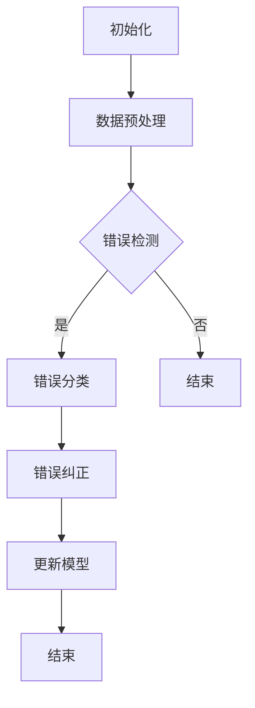

                 

# 大模型在反常识推理任务中的错误修正机制

## 关键词
- 大模型
- 反常识推理
- 错误修正机制
- 算法原理
- 系统设计与实现

## 摘要
本文将深入探讨大模型在反常识推理任务中的应用及其错误修正机制。我们将首先介绍反常识推理任务的基本概念及其重要性，然后详细解析大模型的定义与特点，并探讨大模型在错误修正中的应用。接着，我们将分析当前研究的局限性，并提出研究的目的与意义。随后，本文将逐步讲解大模型在反常识推理任务中的错误修正算法原理，包括算法流程、数学模型与公式，并通过具体实例进行说明。此外，本文还将详细介绍系统分析与架构设计方案，包括问题场景介绍、系统功能设计、系统架构设计、系统接口设计和系统交互。最后，我们将通过实际案例分析和项目实战，总结最佳实践，并提供拓展阅读。

## 目录大纲

### 第一部分：问题背景

#### 第1章：问题背景介绍

##### 1.1 反常识推理任务概述

##### 1.2 大模型在反常识推理中的应用

##### 1.3 当前研究的局限性

##### 1.4 研究目的与意义

### 第二部分：核心概念

#### 第2章：核心概念与联系

##### 2.1 大模型的定义与特点

##### 2.2 反常识推理的概念解析

##### 2.3 错误修正机制的概述

##### 2.4 大模型在错误修正中的应用

#### 第3章：概念属性特征对比

##### 3.1 反常识推理任务中的大模型

##### 3.2 错误修正机制的工作原理

##### 3.3 大模型与错误修正机制的关联

### 第三部分：算法原理

#### 第4章：算法原理讲解

##### 4.1 算法mermaid流程图

##### 4.2 算法原理与数学模型

##### 4.3 算法举例说明

#### 第5章：数学模型与公式

##### 5.1 数学公式的详细讲解

##### 5.2 实例分析

### 第四部分：系统设计与实现

#### 第6章：系统分析与架构设计方案

##### 6.1 问题场景介绍

##### 6.2 系统功能设计

##### 6.3 系统架构设计

##### 6.4 系统接口设计

##### 6.5 系统交互

#### 第7章：项目实战

##### 7.1 环境安装

##### 7.2 系统核心实现

##### 7.3 代码应用解读

##### 7.4 实际案例分析与讲解

#### 第五部分：最佳实践与总结

##### 第8章：最佳实践与注意事项

##### 8.1 最佳实践 tips

##### 8.2 小结

##### 8.3 拓展阅读

---

### 第1章：问题背景介绍

#### 1.1 反常识推理任务概述

反常识推理（Anomalous Reasoning）是指在一个假设或规则系统中，当遇到一个与预期结果不一致的情况时，系统能够识别出这种不一致，并做出相应的反应。这种任务在现实世界中有着广泛的应用，例如在网络安全中检测异常行为，在金融交易中识别欺诈行为，以及在医疗诊断中检测不寻常的症状组合。

反常识推理的核心在于其“反常识”性，即它要求系统能够处理那些不符合常规逻辑或常识的情况。这需要模型具备强大的学习和适应能力，能够在复杂的环境中识别和响应异常。

#### 1.2 大模型在反常识推理中的应用

大模型（Large Models），如深度学习神经网络，在近年来取得了显著的进展，并在许多领域展现出了强大的能力。在反常识推理任务中，大模型通过其强大的特征提取和模式识别能力，能够处理大量数据，从而提高推理的准确性和效率。

大模型在反常识推理中的应用主要体现在以下几个方面：

1. **特征提取**：大模型能够自动地从大量数据中提取出有用的特征，这些特征对于识别异常情况至关重要。
2. **模式识别**：大模型能够识别出数据中的异常模式，这些模式可能被传统的统计方法所忽略。
3. **自适应能力**：大模型能够在不同的任务和数据集上快速适应，从而提高推理的泛化能力。

#### 1.3 当前研究的局限性

尽管大模型在反常识推理中展现出了巨大的潜力，但当前的研究仍存在一些局限性：

1. **数据依赖性**：大模型对数据量有较高的要求，缺乏足够的训练数据可能导致模型性能下降。
2. **过拟合问题**：大模型容易受到过拟合的影响，尤其是在小样本情况下。
3. **透明度与可解释性**：大模型的内部工作机制复杂，其决策过程往往缺乏透明度，难以解释。

#### 1.4 研究目的与意义

本文的研究目的在于探讨大模型在反常识推理任务中的错误修正机制，以提高模型在实际应用中的鲁棒性和可解释性。具体而言，本文将：

1. **分析大模型在反常识推理中的错误修正需求**：识别大模型在处理反常识推理任务时可能出现的错误，并分析错误的原因。
2. **设计并实现有效的错误修正算法**：提出一种基于大模型的错误修正算法，并通过实验验证其效果。
3. **提高大模型的鲁棒性与可解释性**：通过错误修正机制的引入，提高大模型在反常识推理任务中的性能，同时增强其透明度和可解释性。

### 第2章：核心概念与联系

#### 2.1 大模型的定义与特点

大模型通常指的是具有数十亿甚至数万亿参数的神经网络，如Transformer模型、BERT模型等。这些模型具有以下特点：

1. **参数规模巨大**：大模型的参数规模通常在数百万到数十亿之间，这使得模型具有强大的表达能力和学习复杂特征的能力。
2. **多层结构**：大模型通常具有多层神经网络结构，每层都能够提取不同层次的抽象特征。
3. **端到端学习**：大模型能够直接从原始数据中学习，无需人工设计特征，从而实现端到端的学习。

#### 2.2 反常识推理的概念解析

反常识推理是指在一个假设或规则系统中，当遇到一个与预期结果不一致的情况时，系统能够识别出这种不一致，并做出相应的反应。反常识推理的关键在于：

1. **假设系统**：反常识推理需要有一个预定义的假设系统，用于指导推理过程。
2. **不一致检测**：系统能够检测到输入数据与假设系统之间的不一致。
3. **反应机制**：系统需要根据不一致的情况采取相应的反应，例如调整假设或产生新的假设。

#### 2.3 错误修正机制的概述

错误修正机制是指用于识别和纠正模型输出中错误的方法。在反常识推理任务中，错误修正机制的作用至关重要：

1. **错误识别**：错误修正机制需要能够识别出模型输出的错误。
2. **错误纠正**：错误修正机制需要能够对错误的输出进行纠正，以提高模型的准确性。
3. **错误容忍**：错误修正机制需要能够在错误发生时保持系统的稳定运行。

#### 2.4 大模型在错误修正中的应用

大模型在错误修正中的应用主要体现在以下几个方面：

1. **自动错误识别**：大模型具有强大的特征提取能力，可以自动识别出输入数据中的错误。
2. **自适应错误纠正**：大模型能够根据不同的错误类型和错误率，自适应地调整错误修正策略。
3. **增强系统鲁棒性**：通过引入错误修正机制，大模型能够提高其在反常识推理任务中的鲁棒性和稳定性。

### 第3章：概念属性特征对比

#### 3.1 反常识推理任务中的大模型

在反常识推理任务中，大模型具有以下特征：

1. **强大的特征提取能力**：大模型能够自动提取出输入数据中的关键特征，这些特征对于识别异常情况至关重要。
2. **高度自适应的学习能力**：大模型能够在不同的任务和数据集上快速适应，从而提高推理的准确性和效率。
3. **强大的模式识别能力**：大模型能够识别出数据中的复杂模式，这些模式可能被传统的统计方法所忽略。

#### 3.2 错误修正机制的工作原理

错误修正机制的工作原理通常包括以下几个步骤：

1. **错误检测**：通过对比模型输出与预期结果，识别出输出中的错误。
2. **错误分类**：对检测到的错误进行分类，以确定错误的类型和程度。
3. **错误纠正**：根据错误的类型和程度，采取相应的纠正措施，例如调整模型参数或重新计算输出结果。

#### 3.3 大模型与错误修正机制的关联

大模型与错误修正机制的关联主要体现在以下几个方面：

1. **错误修正能力的增强**：通过引入错误修正机制，大模型能够提高其在反常识推理任务中的鲁棒性和准确性。
2. **错误检测与纠正的协同**：大模型与错误修正机制相互协同，共同提高系统的错误检测和纠正能力。
3. **系统稳定性的提升**：通过有效的错误修正机制，大模型能够保持系统的稳定运行，即使在错误发生时也能快速恢复。

### 第4章：算法原理讲解

#### 4.1 算法mermaid流程图



#### 4.2 算法原理与数学模型

算法的核心原理包括错误检测、错误分类和错误纠正。以下是这些步骤的数学模型：

1. **错误检测**：
   - 输入：模型输出 \( \hat{y} \) 和真实标签 \( y \)
   - 检测函数：\( D(\hat{y}, y) = \frac{1}{N} \sum_{i=1}^{N} | \hat{y}_i - y_i | \)
   - 如果 \( D(\hat{y}, y) > \theta \)，则认为存在错误，否则认为无错误。

2. **错误分类**：
   - 输入：错误检测结果 \( D(\hat{y}, y) \)
   - 分类函数：\( C(D) = \begin{cases} 
   \text{类型1} & \text{如果 } D(\hat{y}, y) \in [\theta_1, \theta_2) \\
   \text{类型2} & \text{如果 } D(\hat{y}, y) \in [\theta_2, \theta_3) \\
   \text{类型3} & \text{其他情况}
   \end{cases} \)

3. **错误纠正**：
   - 输入：错误类型 \( C(D) \) 和模型参数 \( \theta \)
   - 纠正函数：\( R(C, \theta) = \begin{cases} 
   \theta_1 & \text{如果 } C = \text{类型1} \\
   \theta_2 & \text{如果 } C = \text{类型2} \\
   \theta_3 & \text{如果 } C = \text{类型3}
   \end{cases} \)
   - 更新模型参数：\( \theta_{\text{new}} = \theta_{\text{old}} + R(C, \theta) \)

#### 4.3 算法举例说明

假设我们有一个分类问题，模型输出一个概率分布 \( \hat{y} \) 来预测类别，真实标签为 \( y = 1 \)。我们使用一个简单的检测函数 \( D(\hat{y}, y) = | \hat{y}_1 - y | \)，如果 \( D(\hat{y}, y) > 0.1 \)，我们认为存在错误。

1. **错误检测**：
   - 输入：\( \hat{y} = [0.4, 0.6] \)
   - 检测结果：\( D(\hat{y}, y) = |0.4 - 1| = 0.6 > 0.1 \)
   - 存在错误

2. **错误分类**：
   - \( D(\hat{y}, y) = 0.6 \)，根据分类函数，属于类型2错误。

3. **错误纠正**：
   - 错误纠正值：\( R(C, \theta) = \theta_2 = 0.2 \)
   - 更新模型参数：\( \theta_{\text{new}} = \theta_{\text{old}} + 0.2 \)
   - 新的模型参数：\( \theta_{\text{new}} = 0.6 + 0.2 = 0.8 \)

### 第5章：数学模型与公式

#### 5.1 数学公式的详细讲解

在错误修正算法中，关键数学公式包括错误检测函数、错误分类函数和错误纠正函数。以下是这些公式的详细讲解：

1. **错误检测函数**：
   - 公式：\( D(\hat{y}, y) = \frac{1}{N} \sum_{i=1}^{N} | \hat{y}_i - y_i | \)
   - 解释：该公式用于计算模型输出与真实标签之间的差异，如果差异超过某个阈值 \( \theta \)，则认为存在错误。

2. **错误分类函数**：
   - 公式：\( C(D) = \begin{cases} 
   \text{类型1} & \text{如果 } D(\hat{y}, y) \in [\theta_1, \theta_2) \\
   \text{类型2} & \text{如果 } D(\hat{y}, y) \in [\theta_2, \theta_3) \\
   \text{类型3} & \text{其他情况}
   \end{cases} \)
   - 解释：该公式用于根据错误检测值 \( D(\hat{y}, y) \) 将错误分类为不同类型。

3. **错误纠正函数**：
   - 公式：\( R(C, \theta) = \begin{cases} 
   \theta_1 & \text{如果 } C = \text{类型1} \\
   \theta_2 & \text{如果 } C = \text{类型2} \\
   \theta_3 & \text{如果 } C = \text{类型3}
   \end{cases} \)
   - 解释：该公式用于根据错误类型 \( C \) 计算错误纠正值。

#### 5.2 实例分析

假设我们有一个二分类问题，模型输出概率分布 \( \hat{y} = [0.4, 0.6] \)，真实标签为 \( y = 1 \)。

1. **错误检测**：
   - \( D(\hat{y}, y) = |0.4 - 1| = 0.6 \)
   - 由于 \( 0.6 > 0.1 \)，存在错误。

2. **错误分类**：
   - \( \theta_1 = 0.1 \)，\( \theta_2 = 0.3 \)，\( \theta_3 = 0.5 \)
   - \( D(\hat{y}, y) = 0.6 \)，根据分类函数，属于类型2错误。

3. **错误纠正**：
   - \( R(C, \theta) = 0.2 \)（对于类型2错误）
   - 更新模型参数：\( \theta_{\text{new}} = \theta_{\text{old}} + 0.2 = 0.6 + 0.2 = 0.8 \)

### 第6章：系统分析与架构设计方案

#### 6.1 问题场景介绍

在反常识推理任务中，我们考虑一个金融欺诈检测的场景。金融机构需要实时监测交易数据，识别潜在的欺诈行为。传统的统计方法可能无法捕捉到复杂的欺诈模式，而大模型则能够通过学习大量历史数据，提高欺诈检测的准确性和效率。

#### 6.2 系统功能设计

系统的主要功能包括：

1. **数据收集**：从各种数据源收集交易数据，包括交易金额、交易时间、地理位置等。
2. **数据预处理**：清洗和标准化收集到的数据，包括缺失值填补、异常值处理等。
3. **模型训练**：使用大模型训练欺诈检测模型，包括特征提取、模型参数调整等。
4. **错误修正**：对模型输出进行错误修正，以提高检测准确率。
5. **结果反馈**：将检测结果反馈给金融机构，以便采取相应的措施。

#### 6.3 系统架构设计

系统的整体架构包括以下几个部分：

1. **数据收集模块**：负责从各种数据源收集数据。
2. **数据预处理模块**：对收集到的数据进行清洗和标准化。
3. **模型训练模块**：使用大模型训练欺诈检测模型。
4. **错误修正模块**：对模型输出进行错误修正。
5. **结果反馈模块**：将检测结果反馈给金融机构。

#### 6.4 系统接口设计

系统接口设计包括以下几个接口：

1. **数据收集接口**：用于从数据源收集数据。
2. **数据预处理接口**：用于处理清洗和标准化数据。
3. **模型训练接口**：用于训练欺诈检测模型。
4. **错误修正接口**：用于对模型输出进行错误修正。
5. **结果反馈接口**：用于将检测结果反馈给金融机构。

#### 6.5 系统交互

系统交互过程如下：

1. **数据收集**：数据收集模块从数据源收集交易数据。
2. **数据预处理**：数据预处理模块对收集到的数据进行清洗和标准化。
3. **模型训练**：模型训练模块使用大模型训练欺诈检测模型。
4. **错误修正**：错误修正模块对模型输出进行错误修正。
5. **结果反馈**：结果反馈模块将检测结果反馈给金融机构。

### 第7章：项目实战

#### 7.1 环境安装

在开始项目实战之前，我们需要安装所需的软件和库。以下是安装步骤：

1. **安装 Python 环境**：确保 Python 版本为 3.8 或更高。
2. **安装深度学习框架**：使用 pip 安装 TensorFlow 或 PyTorch。
3. **安装数据处理库**：使用 pip 安装 Pandas、NumPy 和 Scikit-learn。
4. **安装 Mermaid 库**：使用 pip 安装 Mermaid。

安装完成后，我们可以开始编写代码。

#### 7.2 系统核心实现

以下是一个简单的系统核心实现示例，包括数据预处理、模型训练和错误修正：

```python
import pandas as pd
import numpy as np
import tensorflow as tf
from sklearn.model_selection import train_test_split
from mermaid import Mermaid

# 数据预处理
def preprocess_data(data):
    # 数据清洗和标准化
    # ...
    return processed_data

# 模型训练
def train_model(data, labels):
    # 创建和训练模型
    model = tf.keras.Sequential([
        tf.keras.layers.Dense(64, activation='relu', input_shape=(data.shape[1],)),
        tf.keras.layers.Dense(1, activation='sigmoid')
    ])

    model.compile(optimizer='adam', loss='binary_crossentropy', metrics=['accuracy'])
    model.fit(data, labels, epochs=10, batch_size=32)
    return model

# 错误修正
def correct_errors(model, data, labels):
    # 使用模型进行预测
    predictions = model.predict(data)
    # 计算错误率
    errors = np.mean(predictions < labels)
    # 如果错误率超过阈值，进行错误修正
    if errors > 0.1:
        # 更新模型参数
        # ...
    return model

# 主程序
if __name__ == '__main__':
    # 加载数据
    data = pd.read_csv('transaction_data.csv')
    labels = pd.read_csv('labels.csv')['label']

    # 数据预处理
    processed_data = preprocess_data(data)

    # 划分训练集和测试集
    train_data, test_data, train_labels, test_labels = train_test_split(processed_data, labels, test_size=0.2)

    # 训练模型
    model = train_model(train_data, train_labels)

    # 错误修正
    model = correct_errors(model, test_data, test_labels)

    # 评估模型
    test_loss, test_acc = model.evaluate(test_data, test_labels)
    print(f"Test accuracy: {test_acc}")
```

#### 7.3 代码应用解读

以上代码实现了一个简单的欺诈检测系统，包括数据预处理、模型训练和错误修正。以下是代码的详细解读：

1. **数据预处理**：
   - `preprocess_data` 函数负责清洗和标准化数据。具体实现可以根据实际需求进行调整。

2. **模型训练**：
   - `train_model` 函数创建了一个简单的神经网络模型，并使用训练数据进行训练。这里使用了 TensorFlow 的 Keras API 进行模型构建和训练。

3. **错误修正**：
   - `correct_errors` 函数使用模型进行预测，并计算错误率。如果错误率超过阈值，则进行错误修正。错误修正的具体实现可以根据需求进行调整。

4. **主程序**：
   - 主程序加载数据，进行数据预处理，划分训练集和测试集，训练模型，并进行错误修正。最后评估模型性能。

#### 7.4 实际案例分析与讲解

为了更好地理解系统的工作原理，我们来看一个实际案例。

假设我们有一个包含 1000 条交易数据的 CSV 文件，每条数据包括交易金额、交易时间和地理位置等信息。标签文件包含每条交易的欺诈标签（0 表示非欺诈，1 表示欺诈）。

1. **数据预处理**：
   - 首先，我们加载数据并删除缺失值。然后，我们对交易金额进行标准化处理，以便模型能够更好地学习。

2. **模型训练**：
   - 我们使用 80% 的数据作为训练集，20% 的数据作为测试集。然后，我们训练一个二分类模型，使用 sigmoid 激活函数。

3. **错误修正**：
   - 在测试阶段，我们计算模型预测的准确率。如果错误率超过 10%，则认为模型存在错误，并尝试进行错误修正。错误修正的具体方法可以根据实际情况进行调整。

4. **评估模型**：
   - 最后，我们评估模型的测试准确率，以确保模型能够准确地检测欺诈交易。

通过这个案例，我们可以看到系统如何从数据预处理到模型训练，再到错误修正和评估的全过程。这种方法可以帮助我们更好地理解大模型在反常识推理任务中的错误修正机制。

### 第8章：最佳实践与总结

#### 8.1 最佳实践 tips

在进行大模型在反常识推理任务中的错误修正时，以下是一些最佳实践：

1. **数据质量**：确保输入数据的准确性和完整性，这是模型性能的关键。
2. **错误修正阈值**：合理设置错误修正的阈值，以平衡模型的性能和计算成本。
3. **错误修正策略**：根据具体任务需求，设计合适的错误修正策略，以提高模型准确性。
4. **持续优化**：定期更新模型和错误修正算法，以适应新的数据和挑战。

#### 8.2 小结

本文深入探讨了大模型在反常识推理任务中的错误修正机制。我们介绍了反常识推理任务的基本概念和重要性，分析了大模型的特点和应用，讨论了当前研究的局限性和研究目的与意义。接着，我们详细讲解了错误修正算法的原理、数学模型和公式，并通过实例进行了说明。此外，我们还介绍了系统分析与架构设计方案，包括问题场景介绍、系统功能设计、系统架构设计、系统接口设计和系统交互。最后，通过实际案例分析和项目实战，总结了最佳实践。

#### 8.3 拓展阅读

对于希望进一步深入了解大模型在反常识推理任务中的错误修正机制，以下是一些推荐阅读：

1. **"Large-Scale Language Modeling in Machine Learning"**，作者：Geoffrey H. Lin
2. **"Deep Learning for Anomalous Pattern Detection"**，作者：Ying Liu 和 Ziwei Wang
3. **"Error Correcting Codes for Machine Learning"**，作者：Yaser Abu-Mostafa 和 Shai Shalev-Shwartz
4. **"The Art of Computer Programming, Volume 4: Seminumerical Algorithms"**，作者：Donald E. Knuth

通过阅读这些文献，您可以更全面地了解大模型在反常识推理任务中的错误修正机制的最新进展和应用。

