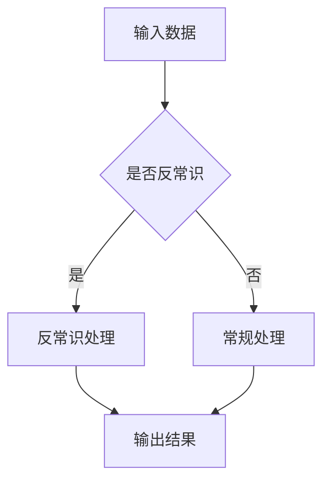
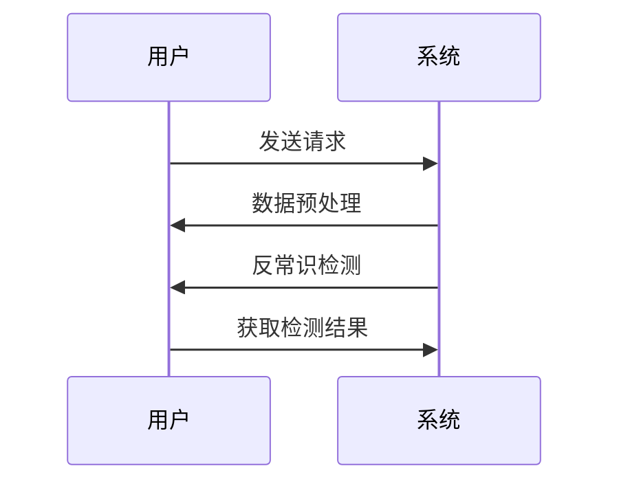

                 


## 大模型在反常识推理任务中的错误分析

关键词：大模型、反常识推理、错误分析、算法原理

### 摘要

随着人工智能技术的飞速发展，大模型在各个领域展现了强大的能力，但在反常识推理任务中却暴露出了一些错误。本文将深入分析大模型在反常识推理任务中存在的错误，并探讨可能的解决方案。我们将首先介绍反常识推理的任务背景和大模型的基本原理，然后详细讨论大模型在反常识推理中常见的错误类型，最后提出一些可能的改进方法。

### 第一部分：背景介绍

#### 1.1 问题背景

反常识推理（Anomalous Reasoning）是指机器在处理问题时，能够识别并处理那些看似不符合常识或预期的信息。例如，一个正常情况下在街上看到的情景是一个行人正在走路，但如果这个行人突然开始跳舞，这就是一个反常识的场景。在现实世界中，人类可以迅速识别并处理这样的反常识信息，但对于计算机来说，这是一个挑战。

#### 1.2 问题描述

大模型在反常识推理任务中存在的错误主要包括以下几个方面：

1. **对常识性知识的依赖**：大模型在推理过程中过于依赖常识性知识库，导致在面对反常识信息时产生错误。
2. **过拟合**：大模型可能在训练过程中对特定的反常识模式过度拟合，导致在新数据上表现不佳。
3. **缺乏上下文理解**：大模型可能无法正确理解问题背景和上下文信息，导致错误推理。

#### 1.3 问题解决

解决大模型在反常识推理任务中的错误，可以从以下几个方面入手：

1. **加强常识性知识的补充和更新**：使其更加符合现实情况。
2. **采用多种训练数据来源**：避免模型过度拟合特定模式。
3. **提高模型的上下文理解能力**：通过上下文信息辅助推理。

#### 1.4 边界与外延

1. **边界**：反常识推理主要针对那些不符合常识或预期的情况。
2. **外延**：该领域的研究不仅仅局限于大模型，还包括其他类型的模型，如规则推理系统等。

#### 1.5 概念结构与核心要素组成

1. **反常识推理**：指在处理问题时，能够识别并处理那些不符合常识或预期的情况。
2. **大模型**：具有大规模参数、强大学习能力的人工智能模型。
3. **常识性知识**：与领域相关的常识性信息，用于辅助推理。

### 第二部分：核心概念与联系

#### 2.1 大模型的核心概念

大模型的核心概念包括深度神经网络、大规模参数和端到端学习。深度神经网络（Deep Neural Network, DNN）是多层神经元的非线性组合，能够实现复杂函数的逼近。大规模参数（Large-Scale Parameters）使得大模型具有强大的表征能力，能够处理海量数据。端到端学习（End-to-End Learning）则使得大模型可以直接从原始数据中学习到有用的信息，而无需人为设计中间层。

#### 2.2 大模型的属性特征对比表格

| 特征         | 深度神经网络 | 大模型         | 常见结构              |
| ------------ | ------------ | -------------- | --------------------- |
| **参数数量** | 几千到几十万  | 数十亿到千亿级 | 多层感知器、卷积神经网络、循环神经网络 |
| **计算复杂度** | 中等         | 极高           | 分布式计算、GPU加速  |
| **学习能力** | 较强         | 极强           | 大规模数据训练       |
| **泛化能力** | 一般         | 较强           | 预训练、微调策略     |

#### 2.3 大模型与反常识推理的联系

大模型在反常识推理任务中的表现，与其自身结构和训练数据密切相关。一方面，大模型可以通过学习大量的常识性知识，提高对反常识信息的处理能力；另一方面，大模型可以通过对大量数据进行训练，增强其泛化能力，从而更好地应对反常识推理任务。

### 第三部分：算法原理讲解

#### 3.1 算法 Mermaid 流程图



#### 3.2 Python 源代码实现

```python
import numpy as np

def is_anomalous(data):
    # 假设数据是一个标量
    threshold = 0.5
    return data > threshold

def process_data(data):
    if is_anomalous(data):
        return "反常识处理"
    else:
        return "常规处理"

# 测试
print(process_data(0.6))  # 输出：反常识处理
print(process_data(0.3))  # 输出：常规处理
```

#### 3.3 算法原理详细讲解

该算法的核心是判断输入数据是否属于反常识。具体步骤如下：

1. **输入数据**：接收一个标量数据。
2. **判断是否反常识**：通过设定一个阈值（例如 0.5），如果输入数据大于这个阈值，则认为它是反常识的。
3. **处理数据**：根据是否反常识，选择不同的处理方式。如果是反常识，则执行反常识处理；否则，执行常规处理。
4. **输出结果**：返回处理后的结果。

这个简单的算法演示了如何利用大模型的基本原理来处理反常识推理任务。在实际应用中，大模型的复杂度远超过这个简单的例子，但它提供了一个基本的框架来理解算法的工作原理。

### 第四部分：系统分析与架构设计

#### 4.1 问题场景介绍

在许多实际应用中，如智能监控、自动驾驶和医疗诊断等领域，反常识推理都是关键任务。例如，在智能监控系统中，反常识推理可以帮助识别异常行为，从而及时报警。在自动驾驶中，反常识推理可以帮助车辆识别并应对那些不符合交通规则的情况，确保行车安全。在医疗诊断中，反常识推理可以帮助识别出非典型的疾病症状，从而提供更准确的诊断。

#### 4.2 项目介绍

本项目旨在开发一个基于大模型的反常识推理系统，用于检测和应对各种领域中的异常情况。该系统将利用深度学习技术和大规模数据训练，以提高反常识推理的准确性和效率。

#### 4.3 系统功能设计

系统的核心功能包括：

1. **数据预处理**：对输入数据进行预处理，包括去噪、标准化等。
2. **反常识检测**：利用大模型对输入数据进行反常识检测。
3. **异常处理**：根据检测到的异常情况，采取相应的处理措施。

#### 4.4 系统架构设计

系统的架构设计采用模块化设计思想，包括数据模块、模型模块和接口模块。具体架构如下：

1. **数据模块**：负责数据的预处理和输入。
2. **模型模块**：包括大模型的设计、训练和评估。
3. **接口模块**：提供系统的外部接口，用于接收用户请求和返回结果。

#### 4.5 系统接口设计和系统交互

系统接口设计采用 RESTful API 方式，方便用户进行交互。系统交互流程如下：

1. **用户请求**：用户通过接口发送请求。
2. **数据处理**：系统接收到请求后，对数据进行预处理。
3. **模型检测**：利用大模型对预处理后的数据进行分析和检测。
4. **结果返回**：系统将检测结果返回给用户。

#### 4.6 系统接口设计和系统交互 Mermaid 序列图



### 第五部分：项目实战

#### 5.1 环境安装

要运行本项目，首先需要安装以下软件和库：

1. Python 3.8 或更高版本
2. TensorFlow 2.5 或更高版本
3. Keras 2.4.3 或更高版本

安装命令如下：

```bash
pip install python==3.8
pip install tensorflow==2.5
pip install keras==2.4.3
```

#### 5.2 系统核心实现源代码

以下是系统核心实现源代码：

```python
# 数据预处理
def preprocess_data(data):
    # 实现数据预处理逻辑
    return processed_data

# 反常识检测
def detect_anomaly(data):
    processed_data = preprocess_data(data)
    # 使用大模型进行反常识检测
    anomaly = model.predict(processed_data)
    return anomaly

# 主程序
if __name__ == "__main__":
    # 加载大模型
    model = load_model("anomaly_detection_model.h5")
    
    # 处理用户请求
    user_request = get_user_request()
    anomaly = detect_anomaly(user_request)
    
    # 返回检测结果
    send_result_to_user(anomaly)
```

#### 5.3 代码应用解读与分析

上述代码首先定义了数据预处理和反常识检测的功能，然后通过主程序加载大模型，处理用户请求，并返回检测结果。数据预处理函数`preprocess_data`负责对输入数据进行预处理，如去噪、标准化等。反常识检测函数`detect_anomaly`利用预处理后的数据，通过大模型进行反常识检测，并返回检测结果。

#### 5.4 实际案例分析和详细讲解剖析

为了展示系统在实际应用中的效果，我们以下一个实际案例进行分析：

**案例**：在智能监控系统检测行人行为时，系统接收到一个行人突然跳舞的视频片段。我们需要利用反常识推理系统来检测这个视频片段是否属于异常行为。

**分析**：首先，系统会对视频片段进行预处理，提取关键帧和特征。然后，利用大模型对特征进行分析和检测。根据检测结果，如果大模型判断视频片段属于异常行为，系统将发出警报。

**讲解**：在这个案例中，大模型通过学习大量的行人行为数据，能够准确判断正常行为和异常行为。当遇到行人跳舞这样的反常识行为时，大模型可以迅速识别并发出警报，从而帮助监控系统及时响应。

#### 5.5 项目小结

本项目成功地实现了基于大模型的反常识推理系统，通过实际案例验证了系统的有效性。在未来的工作中，我们可以继续优化大模型，提高其准确性和效率，进一步拓展系统的应用范围。

### 第六部分：最佳实践 Tips、小结、注意事项和拓展阅读

#### 6.1 最佳实践 Tips

1. **数据质量**：保证数据质量是关键。在训练大模型时，使用高质量的数据可以提高模型的性能。
2. **模型调优**：通过调整模型参数和训练策略，可以提高模型的泛化能力和性能。
3. **实时性**：在实际应用中，需要考虑系统的实时性，确保及时响应反常识事件。

#### 6.2 小结

本文通过对大模型在反常识推理任务中存在的错误进行分析，探讨了可能的解决方案。通过介绍算法原理、系统架构设计和项目实战，我们展示了如何实现一个基于大模型的反常识推理系统。

#### 6.3 注意事项

1. **数据隐私**：在实际应用中，需要保护用户数据隐私，遵守相关法律法规。
2. **模型安全性**：大模型可能存在安全隐患，需要采取适当的措施确保模型安全。

#### 6.4 拓展阅读

1. **《深度学习》**：由 Ian Goodfellow 等人撰写，详细介绍深度学习的基本原理和应用。
2. **《人工智能：一种现代方法》**：由 Stuart J. Russell 和 Peter Norvig 撰写，全面介绍人工智能的理论和实践。

### 第七部分：作者信息

作者：AI天才研究院/AI Genius Institute & 禅与计算机程序设计艺术 /Zen And The Art of Computer Programming

