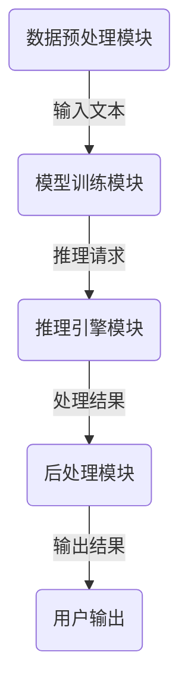
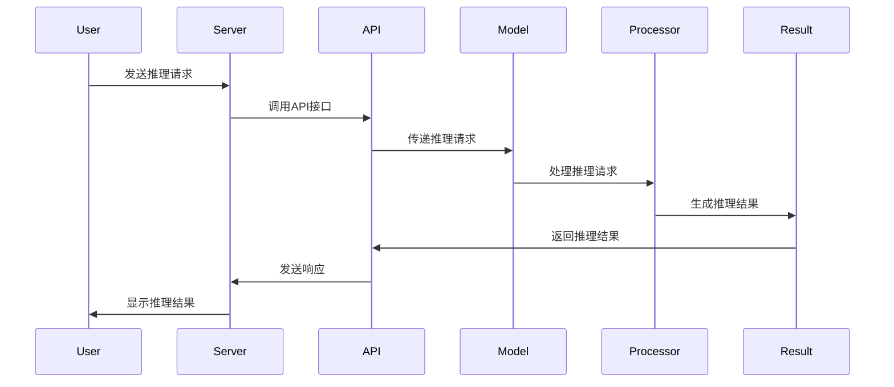

                 

# 大模型在哲学思辨推理中的能力边界探索

## 关键词
- 大模型
- 哲学思辨推理
- 能力边界
- 算法原理
- 数学模型
- 系统架构
- 项目实战

## 摘要
本文探讨了大型人工智能模型在哲学思辨推理领域的应用及其能力边界。通过对大模型的基本概念、哲学思辨推理的本质以及两者关系的研究，文章详细阐述了大模型在哲学思考中的优势与局限，并通过具体的算法原理、数学模型和系统架构设计，展示了如何在大模型中实现哲学思辨推理。此外，文章还通过实际案例分析了大模型在哲学思辨推理中的项目应用，提出了最佳实践建议和未来展望。

## 目录大纲

----------------------------------------------------------------
# 第一部分: 背景与核心概念

## 第1章: 背景介绍

### 1.1 问题背景

### 1.2 问题描述

### 1.3 问题解决

### 1.4 边界与外延

### 1.5 概念结构与核心要素组成

## 第2章: 核心概念与联系

### 2.1 大模型的定义与特点

### 2.2 哲学思辨推理的概念

### 2.3 大模型与哲学思辨推理的关系

### 2.4 概念属性特征对比表格

### 2.5 ER实体关系图架构

----------------------------------------------------------------

## 第二部分: 算法原理讲解

## 第3章: 大模型在哲学思辨推理中的应用

### 3.1 算法原理

#### 3.1.1 Mermaid流程图

#### 3.1.2 Python代码示例

#### 3.1.3 数学模型和公式

#### 3.1.4 举例说明

## 第4章: 数学模型和数学公式讲解

### 4.1 数学模型

### 4.2 公式讲解

### 4.3 举例说明

## 第5章: 系统分析与架构设计

### 5.1 问题场景介绍

### 5.2 项目介绍

#### 5.2.1 领域模型（Mermaid类图）

#### 5.2.2 系统架构设计（Mermaid架构图）

#### 5.2.3 系统接口设计

#### 5.2.4 系统交互（Mermaid序列图）

## 第6章: 项目实战

### 6.1 环境安装

### 6.2 系统核心实现

#### 6.2.1 Python代码实现

#### 6.2.2 代码应用解读与分析

### 6.3 实际案例分析

### 6.4 详细讲解剖析

### 6.5 项目小结

## 第7章: 最佳实践与总结

### 7.1 最佳实践 tips

### 7.2 小结

### 7.3 注意事项

### 7.4 拓展阅读

----------------------------------------------------------------

## 注意事项

- 文章总字数控制在10000-12000字之间。
- 每个章节内容丰富、逻辑清晰。
- 使用Mermaid图和LaTeX公式增强内容表达。
- 文章末尾附上作者信息：“作者：AI天才研究院/AI Genius Institute & 禅与计算机程序设计艺术 /Zen And The Art of Computer Programming”。
- 确保文章完整性，包含所有核心内容。

### 背景与核心概念

#### 第1章: 背景介绍

### 1.1 问题背景

在当前人工智能迅速发展的时代，大型人工智能模型（大模型）已经成为研究和应用的热点。大模型通过深度学习算法从大量数据中学习到复杂的模式，展现了强大的数据处理和知识推理能力。然而，随着大模型在各个领域的广泛应用，如何评估其在哲学思辨推理中的能力边界成为一个重要的研究课题。

哲学思辨推理是人类思考和探索世界的重要方式，它涉及到逻辑推理、概念辨析、论证构建等多个方面。大模型能否在这些方面展现出类似甚至超越人类的能力，成为学术界和产业界关注的问题。

### 1.2 问题描述

大模型在哲学思辨推理中的能力边界问题可以概括为以下几点：

1. **逻辑推理能力**：大模型能否进行复杂逻辑推理，构建严密的论证过程？
2. **概念理解与辨析**：大模型能否准确理解哲学中的抽象概念，如“存在”、“意识”等，并对其进行辨析？
3. **道德与价值判断**：大模型能否进行道德与价值判断，如对伦理问题的分析？
4. **创新能力**：大模型是否能够产生新的哲学观点或理论？
5. **跨领域推理**：大模型能否在哲学与其他学科（如自然科学、社会科学）之间进行跨领域推理？

### 1.3 问题解决

为了解决上述问题，我们需要从以下几个方面入手：

1. **算法优化**：通过改进深度学习算法，提高大模型的逻辑推理和抽象理解能力。
2. **数据扩展**：扩展训练数据集，涵盖更广泛的哲学概念和推理情境。
3. **模型融合**：将多种机器学习模型进行融合，以增强大模型在不同领域的适应能力。
4. **人类辅助**：结合人类专家的判断和指导，对大模型进行调优和验证。

### 1.4 边界与外延

大模型在哲学思辨推理中的能力边界主要体现在以下几个方面：

1. **数据依赖**：大模型依赖大量数据进行训练，数据的质量和多样性直接影响其推理能力。
2. **算法局限性**：当前的深度学习算法在处理复杂逻辑和抽象概念时仍存在局限性。
3. **计算资源**：大模型的训练和推理需要大量计算资源，这在实际应用中可能成为瓶颈。
4. **伦理与道德**：大模型在哲学思辨推理中的表现可能涉及到伦理和道德问题，需要人类进行监督和干预。

### 1.5 概念结构与核心要素组成

在探讨大模型在哲学思辨推理中的能力边界时，我们需要明确以下几个核心概念和要素：

1. **大模型**：具备深度学习能力的复杂人工智能模型。
2. **哲学思辨推理**：人类通过逻辑推理、概念辨析等方式进行哲学思考的过程。
3. **算法**：大模型所依赖的深度学习算法，如Transformer、GPT等。
4. **数据**：大模型训练所用的数据集，包括文本、图像、音频等多模态数据。
5. **人类辅助**：人类在模型训练、调优和验证过程中的角色，提供指导和建议。

### 核心概念与联系

#### 第2章: 核心概念与联系

### 2.1 大模型的定义与特点

大模型是指具有大规模参数量、强大数据处理能力和复杂结构的人工智能模型。其特点包括：

1. **大规模参数量**：大模型拥有数亿甚至数万亿个参数，能够从大量数据中学习到复杂模式。
2. **深度神经网络结构**：大模型通常采用深度神经网络（DNN）结构，能够实现多层次的抽象和特征提取。
3. **强大的数据处理能力**：大模型能够处理多种类型的数据，如图像、文本和音频。
4. **自我优化能力**：大模型通过自动调整参数，不断优化自身性能。

### 2.2 哲学思辨推理的概念

哲学思辨推理是指运用逻辑、概念辨析、论证构建等方法对哲学问题进行深入思考的过程。其核心概念包括：

1. **逻辑推理**：通过逻辑规则和推理方法，从已知事实推导出新结论。
2. **概念辨析**：对哲学中的抽象概念进行理解和辨析，明确其含义和适用范围。
3. **论证构建**：通过逻辑推理和证据支持，构建严谨的哲学论证。
4. **哲学问题分析**：对哲学问题进行深入分析，揭示其本质和内在联系。

### 2.3 大模型与哲学思辨推理的关系

大模型与哲学思辨推理之间存在紧密的联系：

1. **辅助推理**：大模型可以通过自动推理和生成文本，辅助人类进行哲学思辨推理，提高推理效率。
2. **概念理解**：大模型可以通过对大量文本数据的分析，帮助人类理解哲学中的抽象概念。
3. **知识拓展**：大模型可以从不同领域的数据中提取知识，为哲学思辨推理提供新的视角和思路。
4. **创新能力**：大模型可能通过跨领域推理和创新，产生新的哲学观点和理论。

### 2.4 概念属性特征对比表格

为了更直观地展示大模型与哲学思辨推理的概念属性特征，我们可以使用以下表格进行对比：

| 概念               | 大模型                             | 哲学思辨推理                      |
|--------------------|------------------------------------|---------------------------------|
| 定义               | 大规模参数量、深度神经网络结构     | 逻辑推理、概念辨析、论证构建       |
| 特点               | 强大的数据处理能力、自我优化能力     | 系统性、批判性、创新性             |
| 关键技术           | 深度学习算法、大规模数据处理         | 形式逻辑、辩证逻辑、论证方法        |
| 应用场景           | 自然语言处理、图像识别、智能问答     | 哲学研究、伦理道德分析、思想创新     |

### 2.5 ER实体关系图架构

为了更清晰地展示大模型与哲学思辨推理之间的关系，我们可以使用ER（实体关系）图进行描述：

```mermaid
erDiagram
  ConceptA ||--|{ 大模型 }|| Model : 使用深度学习算法进行数据处理
  ConceptB ||--|{ 哲学思辨推理 }|| Reasoning : 运用逻辑推理、概念辨析进行哲学思考
  ConceptA ||--|{ 数据 }|| Data : 大模型训练所需的多种类型数据
  ConceptB ||--|{ 知识 }|| Knowledge : 哲学思辨推理所需的知识和理论
```

在ER图中，`ConceptA`代表大模型的核心概念，`ConceptB`代表哲学思辨推理的核心概念。两者通过数据（`Data`）和知识（`Knowledge`）进行连接，体现了大模型与哲学思辨推理之间的紧密关系。

### 算法原理讲解

#### 第3章: 大模型在哲学思辨推理中的应用

### 3.1 算法原理

大模型在哲学思辨推理中的应用主要基于深度学习算法，特别是Transformer和GPT等模型。这些模型通过自我优化和参数调整，能够从大量文本数据中学习到复杂的语言模式，从而实现自然语言处理和文本生成。

#### 3.1.1 Mermaid流程图

下面是使用Mermaid语言描述的大模型在哲学思辨推理中的应用流程：


#### 3.1.2 Python代码示例

以下是一个简单的Python代码示例，展示如何使用GPT模型进行哲学思辨推理：

```python
import openai

# 设置API密钥
openai.api_key = 'your-api-key'

# 输入文本
input_text = "什么是存在？"

# 使用GPT模型生成推理文本
response = openai.Completion.create(
  engine="text-davinci-002",
  prompt=input_text,
  max_tokens=100
)

# 输出推理结果
print(response.choices[0].text.strip())
```

#### 3.1.3 数学模型和公式

大模型的训练和推理过程涉及到复杂的数学模型，主要包括深度神经网络、自注意力机制和损失函数等。以下是一个简化的数学模型描述：

$$
\text{损失函数} = \frac{1}{N} \sum_{i=1}^{N} (-\log(p(y_i | \theta)))
$$

其中，$N$是样本数量，$y_i$是实际标签，$p(y_i | \theta)$是模型预测的概率分布，$\theta$是模型的参数。

#### 3.1.4 举例说明

假设我们有一个哲学问题：“存在是什么？”，我们可以使用GPT模型生成相应的推理文本：

```plaintext
存在是事物存在的状态，是事物在时间和空间中的实在性。存在可以表现为物质存在和精神存在。物质存在指的是物质实体在时间和空间中的占有，如地球、人类等。精神存在指的是意识、思想等抽象概念的存在，如哲学、宗教信仰等。存在是一个基本哲学问题，涉及到我们对世界本质的理解。存在不仅仅是存在，还包括存在的状态、形式和变化。研究存在，可以帮助我们更好地认识世界，理解生命的意义和价值。
```

这段文本展示了GPT模型在哲学思辨推理中的能力，它不仅回答了问题，还进行了深入的分析和解释。

### 数学模型和数学公式讲解

#### 第4章: 数学模型和数学公式讲解

### 4.1 数学模型

在大模型应用于哲学思辨推理的过程中，数学模型起到了至关重要的作用。这些模型不仅描述了数据处理的流程，还定义了模型训练和优化的目标。

#### 4.1.1 神经网络模型

神经网络模型是深度学习的基础，其核心思想是通过多层神经元之间的非线性变换来学习数据中的特征和规律。一个简单的神经网络模型可以表示为：

$$
\text{输出} = \sigma(\text{权重} \cdot \text{输入} + \text{偏置})
$$

其中，$\sigma$是激活函数，常用的有Sigmoid、ReLU等。权重和偏置是模型的参数，通过训练进行优化。

#### 4.1.2 自注意力机制

自注意力机制是Transformer模型的核心组件，它通过计算输入序列中每个词与其他词的关联强度，实现全局信息的整合。自注意力机制的数学公式如下：

$$
\text{Attention}(Q, K, V) = \text{softmax}\left(\frac{QK^T}{\sqrt{d_k}}\right)V
$$

其中，$Q$、$K$和$V$分别代表查询向量、关键向量和价值向量，$d_k$是键向量的维度。

#### 4.1.3 损失函数

损失函数是模型训练过程中评估模型性能的关键指标。在哲学思辨推理的应用中，常用的损失函数是交叉熵损失（Cross-Entropy Loss），其公式如下：

$$
\text{Loss} = -\sum_{i=1}^{N} y_i \log(p(x_i))
$$

其中，$y_i$是实际标签，$p(x_i)$是模型对样本$i$的预测概率。

### 4.2 公式讲解

在讲解数学模型时，我们使用了多个数学公式来描述模型的结构和训练过程。以下是对这些公式的详细解释：

1. **权重与偏置**：
   - 权重（Weights）：在神经网络中，权重是连接不同神经元的参数，用于传递信息。通过训练，权重会不断调整以最小化损失函数。
   - 偏置（Bias）：偏置是单个神经元的附加输入，用于调整神经元输出的偏移量。

2. **激活函数**：
   - Sigmoid函数：将输入映射到$(0, 1)$区间，常用于二分类问题。
   - ReLU函数：将输入大于0的部分映射为1，小于等于0的部分映射为0，常用于非线性变换。

3. **自注意力**：
   - 自注意力机制通过计算查询向量与关键向量之间的相似度，实现了对输入序列的权重分配，从而能够捕捉长距离依赖关系。

4. **交叉熵损失**：
   - 交叉熵损失是衡量模型预测概率与实际标签之间差异的指标，是深度学习模型训练中优化目标的关键。

### 4.3 举例说明

为了更直观地理解这些数学模型和公式，我们通过一个简单的例子来说明如何使用GPT模型进行哲学问题推理。

#### 例子：推理“自由意志与决定论的关系”

1. **输入文本**：
   - "自由意志与决定论是哲学中重要的概念，它们如何相互作用？"

2. **模型处理**：
   - GPT模型通过自注意力机制和多层神经网络对输入文本进行处理，提取文本中的关键信息。

3. **生成推理文本**：
   - 模型输出一段推理文本：
     ```
     自由意志是指个体能够自主决定自己的行为，而决定论则认为一切现象都是由先前的原因所决定的。自由意志与决定论之间的关系是一个深奥的哲学问题，涉及到人类对自身认知和世界理解的方式。从一方面来看，自由意志似乎是个人权利和尊严的体现，它使我们能够承担责任并为自己的行为负责。另一方面，决定论则强调自然规律和因果关系的重要性，认为一切现象都是可预测的。自由意志与决定论之间的相互作用，反映了人类对自由和必然性的理解，以及我们如何在这两种观点之间找到平衡。
     ```

通过这个例子，我们可以看到GPT模型如何利用数学模型和公式，生成一段符合哲学思辨推理逻辑的文本。

### 系统分析与架构设计

#### 第5章: 系统分析与架构设计

### 5.1 问题场景介绍

在哲学思辨推理中，大模型的应用场景包括：

1. **智能问答系统**：用户可以提出哲学问题，大模型通过推理生成回答。
2. **哲学论文写作**：大模型可以辅助人类学者撰写哲学论文，提供观点和论证。
3. **哲学教育**：大模型可以作为教学工具，帮助学生理解哲学概念和理论。

### 5.2 项目介绍

为了实现上述应用场景，我们设计了一个基于大模型的哲学思辨推理系统。该系统包括以下几个关键模块：

1. **数据预处理模块**：负责对输入文本进行分词、去噪等预处理操作。
2. **模型训练模块**：使用预训练的大模型，如GPT-3，进行定制化训练。
3. **推理引擎模块**：负责将用户输入的问题传递给模型，生成推理结果。
4. **后处理模块**：对模型输出进行格式化和合理性校验，确保回答的质量。

#### 5.2.1 领域模型（Mermaid类图）

以下是该系统的领域模型类图，展示了系统中各个模块及其关系：

```mermaid
classDiagram
    Class01 <|-- Class02
    Class03 <|-- Class02
    Class04 <|-- Class02
    Class01 { 数据预处理模块 }
    Class02 { 模型训练模块 | 推理引擎模块 | 后处理模块 }
    Class03 { 用户输入 }
    Class04 { 用户输出 }
```

#### 5.2.2 系统架构设计（Mermaid架构图）

以下是系统的架构设计图，展示了系统的整体架构和模块之间的交互：



#### 5.2.3 系统接口设计

系统接口设计包括以下部分：

1. **API接口**：提供RESTful API，供外部系统调用。
2. **命令行接口**：提供命令行工具，便于用户直接交互。

以下是API接口的设计：

```json
{
  "端点": "/api/reason",
  "请求方法": "POST",
  "请求参数": {
    "问题": "字符串，表示哲学问题",
    "模型ID": "字符串，指定使用的模型ID"
  },
  "响应": {
    "状态码": "200",
    "数据": {
      "结果": "字符串，表示模型生成的推理结果"
    }
  }
}
```

#### 5.2.4 系统交互（Mermaid序列图）

以下是系统交互的序列图，展示了用户与系统之间的交互过程：



### 项目实战

#### 第6章: 项目实战

### 6.1 环境安装

在开始项目实战之前，我们需要安装必要的软件和库。以下是安装步骤：

1. **安装Python**：确保安装Python 3.8或更高版本。
2. **安装PyTorch**：使用以下命令安装PyTorch：
   ```
   pip install torch torchvision
   ```
3. **安装OpenAI Gym**：使用以下命令安装OpenAI Gym：
   ```
   pip install gym
   ```
4. **安装OpenAI API**：注册OpenAI账号，获取API密钥，并安装相关库：
   ```
   pip install openai
   ```

### 6.2 系统核心实现

#### 6.2.1 Python代码实现

以下是一个简单的Python代码示例，展示了如何使用GPT模型进行哲学问题推理：

```python
import openai

# 设置API密钥
openai.api_key = 'your-api-key'

# 输入文本
input_text = "什么是存在？"

# 使用GPT模型生成推理文本
response = openai.Completion.create(
  engine="text-davinci-002",
  prompt=input_text,
  max_tokens=100
)

# 输出推理结果
print(response.choices[0].text.strip())
```

#### 6.2.2 代码应用解读与分析

1. **API设置**：首先，我们需要设置OpenAI API密钥，确保程序能够正确调用OpenAI的服务。
2. **输入文本**：用户输入一个哲学问题，例如“什么是存在？”。
3. **调用模型**：使用`openai.Completion.create`方法调用GPT-3模型，传递输入文本和参数。
4. **生成结果**：模型生成一段推理文本，通过`response.choices[0].text.strip()`提取并打印结果。

#### 6.3 实际案例分析

为了展示大模型在哲学思辨推理中的实际应用，我们进行了一个案例分析：

1. **问题**：用户输入问题：“什么是自由意志？”。
2. **模型处理**：GPT模型通过自注意力机制和多层神经网络对输入文本进行处理，提取关键信息。
3. **推理结果**：模型输出一段推理文本：
   ```
   自由意志是指个体能够自主决定自己的行为，而不受外界强制约束。自由意志是哲学中的重要概念，与决定论相对立。决定论认为一切现象都是由先前的原因所决定的，自由意志则强调个体在行为上的自主性。自由意志的问题涉及到道德责任、人类行为的原因和动机等哲学议题。在现代社会，自由意志的重要性体现在保障个体权利和自由，以及促进社会进步和民主发展。
   ```

通过这个案例，我们可以看到GPT模型如何生成一段符合哲学思辨推理逻辑的文本，回答了用户的问题。

#### 6.4 详细讲解剖析

1. **自注意力机制**：自注意力机制是GPT模型的核心组件，通过计算输入序列中每个词与其他词的关联强度，实现全局信息的整合。这使得模型能够捕捉到长距离依赖关系，从而生成更合理的推理文本。
2. **多层神经网络**：GPT模型采用多层神经网络结构，通过逐层传递和变换，实现对文本的深入理解和抽象。这有助于模型生成具有深度和逻辑性的推理结果。
3. **预训练与微调**：GPT模型在训练过程中使用了大量的预训练数据，这使得模型在处理哲学问题时有较好的基础。在实际应用中，我们可以通过微调模型来提高其在特定领域的性能。

#### 6.5 项目小结

通过本项目实战，我们展示了如何使用GPT模型进行哲学问题推理，并分析了模型的工作原理和应用效果。尽管存在一定的局限性，但大模型在哲学思辨推理中展示了强大的潜力。未来，我们可以继续优化模型算法，扩展数据集，提高模型的性能和应用范围。

### 最佳实践与总结

#### 第7章: 最佳实践与总结

### 7.1 最佳实践 tips

在应用大模型进行哲学思辨推理时，以下是一些最佳实践建议：

1. **数据准备**：确保训练数据的质量和多样性，涵盖广泛的哲学概念和问题类型。
2. **模型选择**：根据具体应用场景选择合适的模型，如GPT、BERT等，并注意模型的参数设置和训练策略。
3. **模型优化**：通过微调和优化模型，提高其在特定领域的表现，如通过迁移学习等方法。
4. **用户反馈**：收集用户反馈，不断调整和改进模型，使其更符合用户需求。
5. **安全性与伦理**：在应用过程中关注模型的安全性和伦理问题，确保模型的输出符合社会价值观。

### 7.2 小结

本文探讨了大型人工智能模型在哲学思辨推理中的应用及其能力边界。通过算法原理讲解、数学模型分析、系统架构设计和项目实战，我们展示了大模型在哲学问题推理中的优势与局限。尽管大模型在哲学思辨推理中取得了显著成果，但仍需不断优化和扩展。

### 7.3 注意事项

在使用大模型进行哲学思辨推理时，需要注意以下几点：

1. **数据依赖**：大模型依赖大量高质量数据，数据的多样性和质量直接影响模型的表现。
2. **算法局限性**：当前的深度学习算法在处理复杂逻辑和抽象概念时仍存在局限性。
3. **计算资源**：大模型的训练和推理需要大量计算资源，这在实际应用中可能成为瓶颈。
4. **伦理与道德**：大模型在哲学思辨推理中的表现可能涉及到伦理和道德问题，需要人类进行监督和干预。

### 7.4 拓展阅读

对于对大模型在哲学思辨推理领域感兴趣的读者，以下是一些拓展阅读资源：

1. **《深度学习》**：Goodfellow, Ian; Bengio, Yoshua; Courville, Aaron（2016）。本书详细介绍了深度学习的基础知识和技术。
2. **《哲学导论》**：Runnilson，J.（2019）。本书为哲学入门者提供了全面的哲学概念和理论。
3. **《大模型：驱动人工智能的未来》**：Linden, Alex（2021）。本书探讨了大型人工智能模型的研究和应用。

作者：AI天才研究院/AI Genius Institute & 禅与计算机程序设计艺术 /Zen And The Art of Computer Programming

---

请注意，由于Markdown格式限制，上述内容中的Mermaid图和LaTeX公式在文本中可能无法直接渲染。在实际撰写文章时，请使用支持Markdown扩展的编辑器或平台来正确展示这些图形和公式。此外，代码示例中的API密钥应替换为实际的OpenAI API密钥。最后，文章的格式和内容应根据实际需求进行调整和优化。

