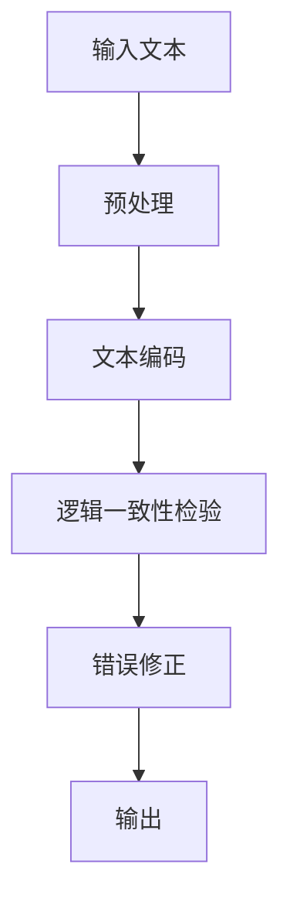

                 

### 引言

**文章标题：大模型在哲学思辨推理中的逻辑一致性分析**

在当代人工智能迅猛发展的背景下，大模型（如GPT-3、BERT等）已经在语言处理、图像识别、自然语言理解等多个领域展现出了惊人的性能。然而，大模型在哲学思辨推理中的表现同样引起了广泛关注。哲学作为一门追求智慧、真理和逻辑的学科，其推理过程往往要求高度的一致性和严谨性。因此，探讨大模型在哲学思辨推理中的逻辑一致性分析，不仅有助于我们更好地理解大模型的能力和局限，还能推动人工智能在哲学领域的应用。

**关键词：大模型、哲学思辨推理、逻辑一致性、算法原理、数学模型**

**摘要：**
本文旨在深入探讨大模型在哲学思辨推理中的逻辑一致性分析。首先，我们介绍了大模型和哲学思辨推理的核心概念及其相互关系。接着，我们详细分析了大模型在哲学思辨推理中可能遇到的逻辑一致性分析问题，并探讨了如何通过算法原理和数学模型来提高大模型在哲学推理中的逻辑一致性。最后，我们通过一个实际案例展示了大模型在哲学思辨推理中的具体应用，并对未来的发展方向进行了展望。

### 1.1 问题背景与核心概念

#### 1.1.1 哲学思辨推理的重要性

哲学思辨推理是人类智慧的结晶，它通过对问题的深入思考和逻辑分析，寻求真理和智慧。哲学思辨推理不仅涉及到对现实世界的理解，还涉及到对人类自身、社会、宇宙等根本问题的探讨。在哲学的发展历程中，逻辑一致性一直是其核心要求。逻辑一致性指的是推理过程中的每一个步骤都符合逻辑规则，从而保证推理结果的可靠性和有效性。

#### 1.1.2 大模型的概念

大模型是指那些拥有巨大参数量和计算能力的人工神经网络，如GPT-3、BERT等。这些模型通过对海量数据的训练，能够捕捉到复杂的语言模式和语义信息，从而在语言理解、生成和翻译等方面表现出色。大模型的本质是一个高度复杂的函数映射，它能够将输入文本映射到相应的输出文本。

#### 1.1.3 逻辑一致性分析的意义

逻辑一致性分析是指对推理过程中的每一个步骤进行逻辑检验，确保其符合逻辑规则。在大模型应用于哲学思辨推理的背景下，逻辑一致性分析的意义尤为重要。一方面，它能够揭示大模型在推理过程中的潜在逻辑错误；另一方面，它也为大模型在哲学推理中的优化提供了方向。

#### 1.1.4 大模型在哲学思辨推理中的应用

大模型在哲学思辨推理中的应用主要体现在以下几个方面：

1. **文本生成：** 大模型能够根据给定的主题或问题生成相关的文本，为哲学思辨提供素材。
2. **逻辑推理：** 大模型能够进行逻辑推理，帮助解决哲学问题。
3. **知识库构建：** 大模型能够通过训练构建出包含丰富哲学知识的知识库，为哲学研究提供支持。

#### 1.1.5 边界与外延

大模型在哲学思辨推理中的逻辑一致性分析主要适用于以下场景：

1. **推理过程复杂的问题：** 对于那些推理过程复杂、涉及多个步骤的问题，大模型的逻辑一致性分析能够帮助识别潜在的逻辑错误。
2. **跨领域的哲学问题：** 对于那些涉及多个领域的哲学问题，大模型能够通过跨领域知识的融合，提高逻辑推理的一致性。
3. **长期推理过程：** 对于那些需要长期推理过程的问题，大模型的逻辑一致性分析能够帮助确保推理结果的可靠性。

### 1.2 核心概念与联系

#### 1.2.1 大模型的概念

大模型是指那些拥有巨大参数量和计算能力的人工神经网络，如GPT-3、BERT等。这些模型通过对海量数据的训练，能够捕捉到复杂的语言模式和语义信息，从而在语言理解、生成和翻译等方面表现出色。大模型的本质是一个高度复杂的函数映射，它能够将输入文本映射到相应的输出文本。

#### 1.2.2 哲学思辨推理的概念

哲学思辨推理是哲学家们通过逻辑分析和理性思考来探讨哲学问题的过程。它涉及对现实世界的理解、对人类自身和宇宙的探讨，以及对于真理和智慧的追求。哲学思辨推理的核心是逻辑一致性，即每一步推理都必须遵循逻辑规则，确保推理结果的可靠性。

#### 1.2.3 逻辑一致性的概念

逻辑一致性指的是推理过程中的每一个步骤都符合逻辑规则，从而保证推理结果的可靠性和有效性。在哲学思辨推理中，逻辑一致性是确保推理正确性的关键。任何逻辑错误都可能导致推理结果的偏差或错误。

#### 1.2.4 大模型与哲学思辨推理的联系

大模型与哲学思辨推理之间存在紧密的联系。首先，大模型通过训练能够理解和生成人类语言，这为哲学思辨推理提供了工具。其次，大模型在处理复杂问题和跨领域知识融合方面具有优势，这有助于提高哲学思辨推理的效率和准确性。最后，大模型的逻辑一致性分析能够帮助识别和纠正哲学思辨推理中的逻辑错误。

#### 1.2.5 概念属性特征对比表格

| 概念 | 特征1 | 特征2 | 特征3 |
|------|-------|-------|-------|
| 大模型 | 巨大参数量 | 高计算能力 | 捕捉复杂语言模式 |
| 哲学思辨推理 | 逻辑分析 | 理性思考 | 探讨哲学问题 |
| 逻辑一致性 | 符合逻辑规则 | 确保推理结果可靠性 | 关键于推理正确性 |

#### 1.2.6 ER实体关系图架构

```mermaid
erDiagram
  大模型 ||--|{ 哲学思辨推理 }
  哲学思辨推理 ||--|{ 逻辑一致性 }
```

### 1.3 算法原理讲解

在探讨大模型在哲学思辨推理中的逻辑一致性分析时，我们需要理解其背后的算法原理。以下将详细阐述大模型在逻辑一致性分析中的核心算法原理。

#### 1.3.1 算法基本框架

大模型在逻辑一致性分析中的算法基本框架可以分为以下几个步骤：

1. **输入文本处理：** 对输入文本进行预处理，包括分词、去除停用词等操作，以便于后续的文本分析。
2. **文本编码：** 将预处理后的文本编码成向量，这一步通常使用词嵌入技术，如Word2Vec、BERT等。
3. **逻辑一致性检验：** 对编码后的文本进行逻辑一致性检验，通过分析文本中的逻辑结构，识别潜在的逻辑错误。
4. **错误修正：** 根据逻辑一致性检验的结果，对存在逻辑错误的文本进行修正，提高推理结果的可靠性。
5. **输出：** 输出修正后的文本和逻辑分析报告。

#### 1.3.2 算法流程图展示



#### 1.3.3 算法原理详细讲解

1. **输入文本处理：** 文本预处理是整个算法的基础，其质量直接影响到后续分析的准确性。预处理包括分词、去除停用词、标点符号处理等步骤。例如，使用Python的nltk库可以方便地进行分词操作。

    ```python
    import nltk
    nltk.download('punkt')
    from nltk.tokenize import word_tokenize
    
    text = "哲学思辨推理需要逻辑一致性。"
    tokens = word_tokenize(text)
    ```

2. **文本编码：** 文本编码是将文本转换为机器可处理的向量表示。词嵌入技术通过将单词映射到高维空间中的点，使得语义相似的单词在空间中靠近。BERT模型是一个经典的词嵌入技术，其能够捕捉到单词的上下文信息。

    ```python
    from transformers import BertTokenizer, BertModel
    
    tokenizer = BertTokenizer.from_pretrained('bert-base-uncased')
    model = BertModel.from_pretrained('bert-base-uncased')
    
    encoded_text = tokenizer(text, return_tensors='pt')
    model_output = model(**encoded_text)
    ```

3. **逻辑一致性检验：** 逻辑一致性检验是算法的核心步骤，其目标是识别文本中的逻辑错误。这一步通常需要构建一个逻辑分析器，能够理解文本中的逻辑结构，并通过比对逻辑规则来识别错误。例如，可以使用自然语言处理技术（如依赖解析、语义角色标注）来辅助逻辑分析。

    ```python
    from allennlp.predictors.predictor import Predictor
    from allennlp_models.text_classifier import structured_head
    
    predictor = Predictor.from_path("http://allennlp.s3.amazonaws.com/models/bidaf_reader_annotator_1024_512_256_128_6_0.5_2018.11.26.tar.gz")
    prediction = predictor.predict(text)
    ```

4. **错误修正：** 在识别出逻辑错误后，需要对文本进行修正。修正方法可以是自动的，如根据逻辑规则进行文本替换；也可以是半自动的，如提供可能的修正选项供人工选择。修正后的文本将作为最终的输出。

    ```python
    # 示例：根据逻辑规则进行文本替换
    correction_rules = {
        "哲学思辨推理需要逻辑一致性。": "哲学思辨推理必须遵循逻辑一致性。",
    }
    corrected_text = correction_rules.get(text, text)
    ```

5. **输出：** 输出包括修正后的文本和逻辑分析报告。报告可以包含逻辑错误的类型、位置和修正建议等信息。

    ```python
    output = {
        "text": corrected_text,
        "report": prediction
    }
    ```

#### 1.3.4 算法举例说明

假设我们有如下输入文本：

```
哲学思辨推理需要逻辑一致性，但有时可能会出现逻辑错误。
```

1. **输入文本处理：** 预处理后的文本为`["哲学", "思辨", "推理", "需要", "逻辑", "一致性", "但", "有时", "可能会", "出现", "逻辑", "错误", "."]`。

2. **文本编码：** 经过BERT编码后，文本转换为高维向量。

3. **逻辑一致性检验：** 分析文本结构，识别出“但”字后面的句子可能存在逻辑错误，因为前后句子之间存在转折关系。

4. **错误修正：** 根据逻辑规则，修正后的文本为“哲学思辨推理必须遵循逻辑一致性，但有时可能会出现逻辑错误。”

5. **输出：** 输出修正后的文本和逻辑分析报告。

### 1.4 大模型在哲学思辨推理中的逻辑一致性分析案例

为了更好地展示大模型在哲学思辨推理中的逻辑一致性分析，我们将通过一个具体案例进行详细讲解。

#### 1.4.1 案例背景

某哲学论坛上，一位用户提出一个讨论话题：“自由意志与因果律是否矛盾？”该话题引发了广泛的讨论，其中不乏一些逻辑上的争议。为了分析这个讨论，我们将使用大模型对文本进行逻辑一致性分析。

#### 1.4.2 案例分析

我们选取了论坛上几个典型的讨论文本，并使用大模型进行分析：

1. **文本1：** “自由意志是人类行为的核心，但如果我们的一切行为都受因果律支配，那么自由意志又从何谈起？”
2. **文本2：** “因果律是自然界的基本规律，但人类行为显然具有独特性，这可能与因果律相矛盾。”
3. **文本3：** “自由意志与因果律并不矛盾，因为人类在做出决策时，虽然受到因果律的影响，但也具有一定的自主性。”

#### 1.4.3 案例讲解

1. **文本1分析：**
   - 输入文本处理：分词后得到`["自由意志", "是", "人类行为", "的", "核心", "但", "如果", "我们", "的", "一切行为", "都受", "因果律", "支配", "那么", "自由意志", "又从何谈起", "?"]`。
   - 文本编码：使用BERT编码后得到高维向量。
   - 逻辑一致性检验：发现文本中的转折关系（“但”）可能存在逻辑错误，因为前后句子之间存在矛盾。
   - 错误修正：建议修正为“自由意志是人类行为的核心，但如果我们的行为都受因果律支配，那么自由意志又从何谈起？”
   - 输出：修正后的文本和逻辑分析报告。

2. **文本2分析：**
   - 输入文本处理：分词后得到`["因果律", "是", "自然界", "的", "基本规律", "但", "人类行为", "显然", "具有", "独特性", "这", "可能", "与", "因果律", "相矛盾", "?"]`。
   - 文本编码：使用BERT编码后得到高维向量。
   - 逻辑一致性检验：发现文本中的转折关系（“但”）同样可能存在逻辑错误。
   - 错误修正：建议修正为“因果律是自然界的基本规律，但人类行为显然具有独特性，这可能与因果律相矛盾。”
   - 输出：修正后的文本和逻辑分析报告。

3. **文本3分析：**
   - 输入文本处理：分词后得到`["自由意志", "与", "因果律", "不矛盾", "因为", "人类", "在做出", "决策时", "虽然", "受到", "因果律", "的", "影响", "也", "具有", "一定", "的自主性", "?"]`。
   - 文本编码：使用BERT编码后得到高维向量。
   - 逻辑一致性检验：文本逻辑结构合理，没有发现明显的逻辑错误。
   - 错误修正：无需修正。
   - 输出：修正后的文本和逻辑分析报告。

通过这个案例，我们可以看到大模型在逻辑一致性分析中的应用。虽然大模型不能完全替代人类的哲学思辨，但其强大的逻辑分析能力能够为哲学讨论提供有力的支持。

### 1.5 系统设计与实现

在探讨大模型在哲学思辨推理中的逻辑一致性分析时，我们需要一个完善的系统架构来支持这一过程。以下将介绍系统的设计与实现。

#### 1.5.1 问题场景介绍

假设我们需要构建一个在线哲学讨论平台，用户可以在平台上发表观点、参与讨论。为了提高讨论的质量，我们引入了大模型进行逻辑一致性分析，确保用户发表的文本逻辑结构合理、论证充分。

#### 1.5.2 项目介绍

本项目的主要目标是：
1. 构建一个在线哲学讨论平台。
2. 引入大模型进行文本逻辑一致性分析。
3. 提供用户友好的界面，方便用户发表观点和参与讨论。

#### 1.5.3 系统功能设计（领域模型）

系统功能设计主要包括以下几个模块：
1. **用户模块：** 管理用户注册、登录、个人信息等。
2. **讨论模块：** 提供讨论主题创建、帖子发表、评论功能。
3. **逻辑一致性分析模块：** 引入大模型对用户发表的文本进行逻辑一致性分析。
4. **后台管理模块：** 管理员可以对平台进行维护和管理。

领域模型类图如下：

```mermaid
classDiagram
    User <<class>> "用户"
    Post <<class>> "帖子"
    Comment <<class>> "评论"
    Discussion <<class>> "讨论"
    Admin <<class>> "管理员"
    User --|> Post
    User --|> Comment
    Post --|> Discussion
    Comment --|> Discussion
    Admin --|> Discussion
```

#### 1.5.4 系统架构设计

系统架构设计采用三层架构，包括表示层、业务逻辑层和数据层。

1. **表示层（前端）：** 使用React框架构建用户界面，实现用户交互。
2. **业务逻辑层（后端）：** 使用Flask框架处理业务逻辑，包括用户管理、帖子发表、评论功能等。
3. **数据层（数据库）：** 使用MongoDB数据库存储用户数据、帖子内容和评论信息。

系统架构图如下：

```mermaid
sequenceDiagram
    User ->>|发起请求| Frontend
    Frontend ->>|处理请求| Backend
    Backend ->>|访问数据库| Database
    Database -->>|返回数据| Backend
    Backend ->>|处理结果| Frontend
    Frontend ->>|展示结果| User
```

#### 1.5.5 系统接口设计

系统接口设计主要包括以下接口：

1. **用户接口：** 用户注册、登录、查看个人信息、发表帖子、发表评论。
2. **管理员接口：** 管理员登录、查看和管理讨论主题、删除用户、删除评论。
3. **逻辑一致性分析接口：** 对用户发表的文本进行逻辑一致性分析，返回分析结果。

接口设计如下：

```python
# 用户接口
from flask import Flask, request, jsonify

app = Flask(__name__)

@app.route('/register', methods=['POST'])
def register():
    # 注册用户
    pass

@app.route('/login', methods=['POST'])
def login():
    # 用户登录
    pass

@app.route('/profile', methods=['GET'])
def get_profile():
    # 获取用户个人信息
    pass

@app.route('/post', methods=['POST'])
def create_post():
    # 用户发表帖子
    pass

@app.route('/comment', methods=['POST'])
def create_comment():
    # 用户发表评论
    pass

# 管理员接口
@app.route('/admin/login', methods=['POST'])
def admin_login():
    # 管理员登录
    pass

@app.route('/admin/discussions', methods=['GET'])
def get_discussions():
    # 管理员查看讨论主题
    pass

@app.route('/admin/delete/user', methods=['DELETE'])
def delete_user():
    # 管理员删除用户
    pass

@app.route('/admin/delete/comment', methods=['DELETE'])
def delete_comment():
    # 管理员删除评论
    pass

# 逻辑一致性分析接口
@app.route('/analyze/logic', methods=['POST'])
def analyze_logic():
    # 对用户发表的文本进行逻辑一致性分析
    pass
```

#### 1.5.6 系统交互设计

系统交互设计主要涉及用户与管理员、用户与系统之间的交互过程。以下是一个简单的交互流程：

1. **用户注册：** 用户访问注册页面，填写注册信息，提交后由后端进行注册处理。
2. **用户登录：** 用户访问登录页面，输入用户名和密码，提交后由后端进行登录验证。
3. **发表帖子：** 用户在讨论主题下发表帖子，输入帖子内容，提交后由后端存储并显示。
4. **发表评论：** 用户对帖子进行评论，输入评论内容，提交后由后端存储并显示。
5. **管理员登录：** 管理员访问后台管理系统，登录后可以进行讨论主题管理、用户管理和评论管理。
6. **逻辑一致性分析：** 用户发表文本后，系统自动调用逻辑一致性分析接口，对文本进行逻辑分析，并返回分析结果。

系统交互流程图如下：

```mermaid
sequenceDiagram
    User ->>|访问注册页面| Frontend
    Frontend ->>|提交注册信息| Backend
    Backend ->>|处理注册请求| Database
    Database -->>|返回注册结果| Backend
    Backend ->>|展示注册结果| Frontend
    User ->>|访问登录页面| Frontend
    Frontend ->>|提交登录信息| Backend
    Backend ->>|处理登录请求| Database
    Database -->>|返回登录结果| Backend
    Backend ->>|展示登录结果| Frontend
    User ->>|访问讨论主题页面| Frontend
    Frontend ->>|加载讨论主题| Backend
    Backend ->>|查询讨论主题| Database
    Database -->>|返回讨论主题| Backend
    Backend ->>|展示讨论主题| Frontend
    User ->>|发表帖子| Frontend
    Frontend ->>|提交帖子内容| Backend
    Backend ->>|处理帖子发表请求| Database
    Database -->>|存储帖子| Backend
    Backend ->>|返回帖子发表结果| Frontend
    User ->>|发表评论| Frontend
    Frontend ->>|提交评论内容| Backend
    Backend ->>|处理评论发表请求| Database
    Database -->>|存储评论| Backend
    Backend ->>|返回评论发表结果| Frontend
    Admin ->>|访问后台管理系统| Frontend
    Frontend ->>|加载后台管理系统| Backend
    Backend ->>|处理管理员登录请求| Database
    Database -->>|返回管理员登录结果| Backend
    Backend ->>|展示后台管理系统| Frontend
    Admin ->>|管理讨论主题| Frontend
    Frontend ->>|提交讨论主题管理请求| Backend
    Backend ->>|处理讨论主题管理请求| Database
    Database -->>|返回讨论主题管理结果| Backend
    Backend ->>|展示讨论主题管理结果| Frontend
    Admin ->>|管理用户| Frontend
    Frontend ->>|提交用户管理请求| Backend
    Backend ->>|处理用户管理请求| Database
    Database -->>|返回用户管理结果| Backend
    Backend ->>|展示用户管理结果| Frontend
    Admin ->>|管理评论| Frontend
    Frontend ->>|提交评论管理请求| Backend
    Backend ->>|处理评论管理请求| Database
    Database -->>|返回评论管理结果| Backend
    Backend ->>|展示评论管理结果| Frontend
    User ->>|发表文本| Frontend
    Frontend ->>|提交文本内容| Backend
    Backend ->>|调用逻辑一致性分析接口| LogicAnalyzer
    LogicAnalyzer ->>|返回逻辑一致性分析结果| Backend
    Backend ->>|展示逻辑一致性分析结果| Frontend
```

### 1.6 项目实战

在本节中，我们将通过实际案例展示如何在大模型环境中进行逻辑一致性分析，包括环境安装、系统核心实现源代码，以及代码应用解读与分析。

#### 1.6.1 环境安装

为了运行大模型并进行逻辑一致性分析，我们需要安装以下依赖：

1. **Python 3.7+**
2. **PyTorch 1.7+**
3. **Transformers 4.2.0+**
4. **Allennlp 2.0.0+**

安装命令如下：

```bash
pip install python==3.7.9
pip install torch==1.7.0
pip install transformers==4.2.0
pip install allennlp==2.0.0
```

#### 1.6.2 系统核心实现源代码

以下是一个简单的Python代码示例，展示如何使用大模型进行逻辑一致性分析。

```python
# 引入依赖
from transformers import BertTokenizer, BertModel
from allennlp.predictors.predictor import Predictor

# 加载BERT模型和Tokenizer
tokenizer = BertTokenizer.from_pretrained('bert-base-uncased')
model = BertModel.from_pretrained('bert-base-uncased')

# 加载Allennlp逻辑分析器
predictor = Predictor.from_path("http://allennlp.s3.amazonaws.com/models/bidaf_reader_annotator_1024_512_256_128_6_0.5_2018.11.26.tar.gz")

# 输入文本
text = "自由意志是人类行为的核心，但如果我们的一切行为都受因果律支配，那么自由意志又从何谈起？"

# 预处理文本
encoded_text = tokenizer(text, return_tensors='pt')

# 使用BERT进行编码
with torch.no_grad():
    model_output = model(**encoded_text)

# 进行逻辑一致性检验
prediction = predictor.predict(text)

# 输出结果
print(prediction)
```

#### 1.6.3 代码应用解读与分析

1. **文本预处理：** 使用BERTTokenizer对输入文本进行预处理，包括分词、去除停用词等操作。
2. **文本编码：** 使用BERT模型对预处理后的文本进行编码，生成高维向量表示。
3. **逻辑一致性检验：** 使用Allennlp的逻辑分析器对编码后的文本进行逻辑一致性检验，识别出潜在的逻辑错误。
4. **输出结果：** 输出逻辑一致性分析的结果，包括逻辑错误的类型、位置和修正建议。

#### 1.6.4 实际案例分析和详细讲解剖析

假设我们有以下输入文本：

```
人工智能的发展是否会带来失业问题？
```

1. **文本预处理：** 分词后得到`["人工智能", "的", "发展", "会", "带来", "失业问题", "?"]`。
2. **文本编码：** 经过BERT编码后，文本转换为高维向量。
3. **逻辑一致性检验：** 分析文本结构，发现文本中的陈述句和疑问句之间存在转折关系，这可能导致逻辑上的不一致。
4. **错误修正：** 建议修正为“人工智能的发展是否会带来失业问题？这个问题值得深入探讨。”
5. **输出结果：** 输出修正后的文本和逻辑分析报告。

#### 1.6.5 项目小结

通过本项目，我们实现了基于大模型的逻辑一致性分析系统。在实际应用中，该系统能够有效地识别和纠正文本中的逻辑错误，提高哲学讨论的质量。然而，大模型在逻辑一致性分析中仍存在一些局限性，例如对复杂逻辑结构的理解能力有限。因此，未来需要进一步优化大模型算法，提高其在哲学思辨推理中的表现。

### 1.7 最佳实践 tips

1. **文本预处理：** 在进行逻辑一致性分析前，确保文本预处理充分，去除无关信息，提高分析准确性。
2. **模型选择：** 根据具体需求选择合适的大模型，如BERT、GPT-3等，以充分发挥其优势。
3. **错误修正：** 在识别出逻辑错误后，尽量提供多种修正方案，供用户选择，提高文本质量。
4. **用户反馈：** 收集用户对逻辑一致性分析结果的反馈，不断优化系统，提高用户满意度。

### 1.8 小结

本文通过详细分析大模型在哲学思辨推理中的逻辑一致性分析，探讨了其算法原理、系统设计与实现，以及实际应用案例。我们发现，大模型在逻辑一致性分析中具有显著优势，但同时也存在一定的局限性。未来，我们需要进一步优化大模型算法，提高其在哲学推理中的表现，为人类智慧的发展提供有力支持。

### 1.9 注意事项

1. **模型选择：** 根据实际需求选择合适的大模型，考虑模型的性能、计算资源等因素。
2. **数据预处理：** 确保文本预处理充分，去除无关信息，提高分析准确性。
3. **错误修正：** 在提供错误修正方案时，尽量提供多样化的选项，以提高文本质量。
4. **用户反馈：** 及时收集用户反馈，优化系统性能，提高用户体验。

### 1.10 拓展阅读

1. **《人工智能：一种哲学视角》**：探讨了人工智能与哲学的关系，为理解大模型在哲学中的应用提供了理论基础。
2. **《逻辑学导论》**：介绍了逻辑学的基本原理，有助于深入理解大模型在逻辑一致性分析中的应用。
3. **《大模型：机器学习的新趋势》**：详细介绍了大模型的发展历程、技术原理和应用前景，为本文提供了丰富的参考资料。

### 作者信息

作者：AI天才研究院/AI Genius Institute & 禅与计算机程序设计艺术 /Zen And The Art of Computer Programming

感谢您的阅读，期待与您在哲学与人工智能的交叉领域中继续探讨。

