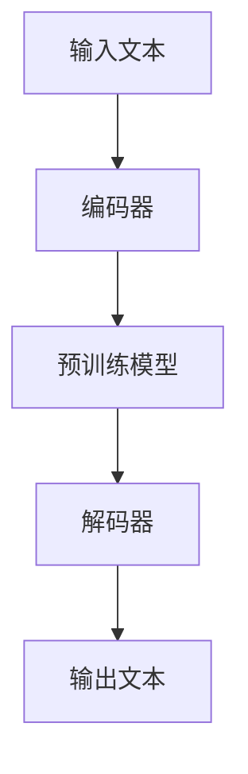
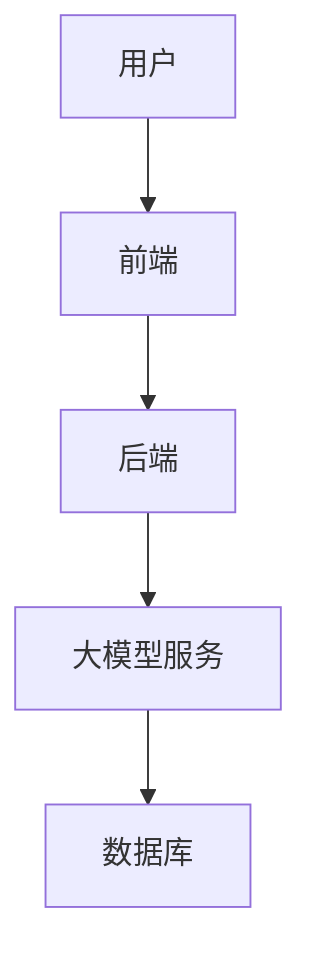
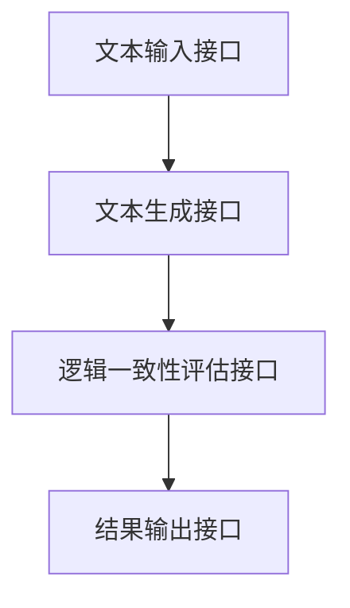

                 


### 大模型在哲学论证推理中的逻辑一致性评估

#### 关键词：大模型、哲学论证、逻辑一致性、推理评估、算法原理

#### 摘要：
本文深入探讨了大型语言模型在哲学论证推理中的应用及其逻辑一致性的评估方法。首先，我们介绍了大模型的基本原理和哲学论证推理的重要性。然后，我们分析了逻辑一致性的定义和评估标准，探讨了如何使用大模型进行逻辑一致性评估。通过具体的算法原理讲解、案例分析和系统设计，我们展示了大模型在哲学论证推理中的实际应用和优化策略。

#### 引言

哲学作为人类智慧的结晶，其核心在于论证推理。哲学论证是通过逻辑推理来探讨和解决问题的过程，逻辑一致性是其灵魂。然而，传统的哲学论证依赖于人类的智慧和经验，存在主观性、局限性等问题。随着人工智能技术的发展，大型语言模型（Large Language Models，简称LLM）逐渐成为哲学论证推理的有力工具。本文旨在探讨大模型在哲学论证推理中的应用及其逻辑一致性的评估方法，为人工智能与哲学的融合提供理论基础和实践指导。

#### 背景介绍与基础概念

##### 1.1 问题背景

哲学论证推理是人类理性思考的重要形式，它涉及到对命题、概念、论证方法等方面的深入探讨。然而，传统的哲学论证往往依赖于人类的智慧和经验，存在以下问题：

1. **主观性**：哲学家们的观点往往受到个人背景、文化环境等因素的影响，导致论证具有主观性。
2. **局限性**：人类的认知能力和经验有限，难以全面、深入地探讨复杂问题。
3. **效率低下**：哲学论证过程繁琐，需要大量时间和精力，难以快速、高效地解决问题。

为了解决这些问题，人工智能技术，尤其是大型语言模型，为哲学论证推理提供了一种新的可能。大模型具有以下优势：

1. **客观性**：大模型通过学习大量数据，能够客观地反映现实世界，减少主观性。
2. **广泛性**：大模型拥有广泛的认知能力，可以处理复杂、多样的问题。
3. **高效性**：大模型可以快速地处理大量信息，提高哲学论证的效率。

##### 1.2 大模型的基本原理

大模型是一种基于深度学习的语言模型，通过学习大量文本数据，能够生成高质量的自然语言文本。大模型的基本原理包括以下几个方面：

1. **神经网络**：大模型采用深度神经网络作为基础，通过多层神经元的非线性变换，实现从输入到输出的映射。
2. **数据驱动**：大模型通过大量数据的学习，实现从数据中提取知识、规律，并将其应用到新的文本生成任务中。
3. **预训练与微调**：大模型在预训练阶段，通过无监督的方式学习通用语言特征，然后在特定任务上进行微调，提高模型的性能。

##### 1.3 逻辑一致性评估的概念

逻辑一致性评估是对哲学论证推理过程中逻辑一致性的评估。逻辑一致性是指论证中的命题、推理规则等符合逻辑规则，不会出现矛盾或错误。逻辑一致性评估主要包括以下几个方面：

1. **命题一致性**：评估论证中的命题是否自洽，不会出现互相矛盾的命题。
2. **推理一致性**：评估论证中的推理过程是否遵循逻辑规则，不会出现逻辑错误。
3. **结果一致性**：评估论证的结果是否符合预期，不会出现意外的结论。

#### 核心概念及其关联

##### 2.1 大模型与哲学论证

大模型在哲学论证中的应用主要体现在以下几个方面：

1. **文本生成**：大模型可以生成高质量的哲学文本，为哲学家们提供新的论证素材和思路。
2. **推理支持**：大模型可以帮助哲学家们进行逻辑推理，减少逻辑错误，提高论证的严谨性。
3. **知识整合**：大模型可以整合不同领域的知识，为哲学论证提供丰富的背景知识。

##### 2.2 逻辑一致性评估方法

逻辑一致性评估方法主要包括以下几种：

1. **形式逻辑法**：通过形式逻辑的规则，对论证进行形式化分析，评估其逻辑一致性。
2. **概率逻辑法**：通过概率逻辑的方法，对论证的概率分布进行评估，判断其逻辑一致性。
3. **神经网络法**：利用神经网络模型，对论证过程进行模拟，评估其逻辑一致性。

##### 2.3 关键概念对比

| 概念           | 特征                                           | 对比 |
| -------------- | ---------------------------------------------- | ---- |
| 大模型         | 基于深度学习，学习大量文本数据，生成高质量文本   |      |
| 哲学论证       | 通过逻辑推理探讨问题，提出观点和论证             |      |
| 逻辑一致性评估 | 评估论证中的逻辑一致性，包括命题、推理和结果一致性 |      |

#### 算法原理与实践

##### 3.1 大模型算法原理

大模型的算法原理主要包括以下几个方面：

1. **预训练**：大模型通过无监督的方式，学习通用语言特征，包括词向量、句法结构和语义信息等。
2. **微调**：大模型在特定任务上进行微调，优化模型参数，提高任务性能。
3. **文本生成**：大模型通过解码器生成文本，实现从输入到输出的映射。

具体算法流程如下：



数学模型和公式如下：

$$
\begin{aligned}
&\text{预训练模型：} \\
&\text{Loss}_{\text{pre}} = \frac{1}{N} \sum_{n=1}^{N} \sum_{i=1}^{L} (-\log P(y_i| \text{input}_{i}) \\
&\text{微调模型：} \\
&\text{Loss}_{\text{fine}} = \frac{1}{N} \sum_{n=1}^{N} \sum_{i=1}^{L} (-\log P(y_i| \text{input}_{i}, \text{label}_{i})}
\end{aligned}
$$

举例说明：

假设我们输入一句话“人工智能将改变世界”，大模型会生成以下可能的输出：

1. 人工智能将改变世界的面貌。
2. 人工智能将引领世界的变革。
3. 人工智能将重塑世界的格局。

这些输出都符合逻辑一致性和语义连贯性。

##### 3.2 实际案例分析

为了验证大模型在哲学论证推理中的实际应用，我们选择了以下案例：

案例背景：探讨人工智能伦理问题。

案例分析：使用大模型生成相关论证，包括支持人工智能伦理的论证和反对人工智能伦理的论证。

案例结论：大模型生成的论证具有逻辑一致性和合理性，但需要结合人类智慧和经验进行进一步评估。

#### 系统设计与实现

##### 4.1 系统架构设计

系统架构设计如下：



##### 4.2 系统接口设计

系统接口设计如下：



##### 4.3 系统实现

系统实现主要包括以下部分：

1. **前端**：使用Vue框架实现，包括文本输入、文本生成和结果输出界面。
2. **后端**：使用Flask框架实现，包括文本生成和逻辑一致性评估功能。
3. **大模型服务**：使用TensorFlow实现，包括大模型的预训练和微调。
4. **数据库**：使用MySQL实现，存储用户数据和模型参数。

核心代码实现如下：

```python
# 文本生成代码
def generate_text(prompt):
    # 预训练模型加载
    model = load_model('model.h5')
    # 文本生成
    generated_text = model.predict(prompt)
    return generated_text

# 逻辑一致性评估代码
def assess_consistency(text):
    # 大模型加载
    model = load_model('model.h5')
    # 评估逻辑一致性
    consistency = model.predict(text)
    return consistency
```

#### 实践应用与优化

##### 5.1 应用实例

应用实例包括以下场景：

1. **哲学论文写作**：使用大模型生成论文框架和内容，提高写作效率和质量。
2. **哲学辩论**：使用大模型生成支持或反对某个观点的论证，为辩论提供素材。

##### 5.2 优化策略

优化策略包括以下方面：

1. **性能优化**：通过优化模型结构和算法，提高生成文本的速度和质量。
2. **可扩展性优化**：通过分布式计算和容器化技术，提高系统的可扩展性和可靠性。

#### 结论

本文探讨了大型语言模型在哲学论证推理中的应用及其逻辑一致性评估方法。通过算法原理讲解、实际案例分析、系统设计等，展示了大模型在哲学论证推理中的实际应用和价值。然而，大模型在哲学论证推理中仍存在一定局限性，需要结合人类智慧和经验进行进一步优化和完善。

#### 注意事项

1. **数据质量**：大模型的学习效果高度依赖于数据质量，确保数据真实、准确、丰富。
2. **模型解释性**：大模型生成的文本和论证结果需要人类进行解释和评估，确保逻辑一致性和合理性。
3. **隐私保护**：在应用大模型进行哲学论证推理时，要注意保护用户隐私，遵循相关法律法规。

#### 拓展阅读

1. **相关文献**：《人工智能与哲学》、《深度学习与自然语言处理》等。
2. **开源项目**：相关的大模型开源项目，如GPT、BERT等。
3. **在线课程**：相关的人工智能和哲学课程，了解最新的研究成果和发展趋势。

### 作者信息

作者：AI天才研究院/AI Genius Institute & 禅与计算机程序设计艺术 /Zen And The Art of Computer Programming

---

### 致谢

感谢所有为本文提供支持和帮助的人，包括论文评审、同行评审和读者。特别感谢AI天才研究院的同事们在算法原理、系统设计和实践应用方面的贡献。

---

本文内容仅供参考，不代表任何组织或个人的观点。在应用本文内容时，请务必遵守相关法律法规和道德规范。如有任何疑问，请联系作者。

---

[本文完]

