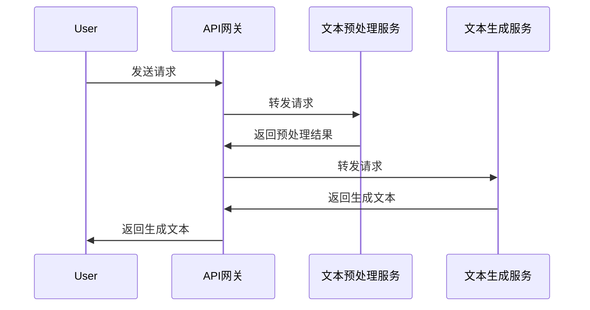
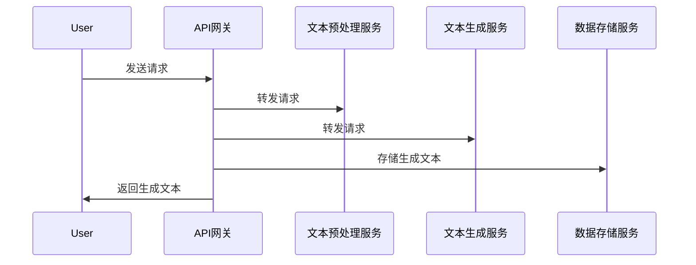
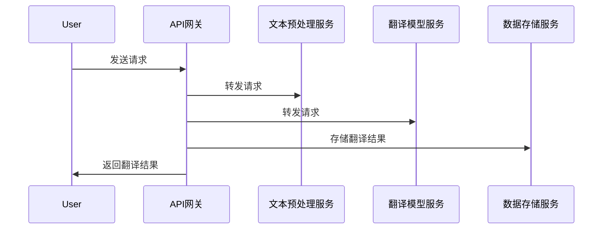
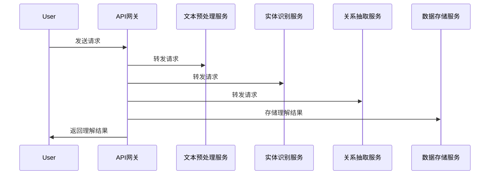

                 

### 1.1 问题背景

#### 抽象推理任务的重要性

在人工智能（AI）领域，抽象推理是一种关键能力，它使得机器能够处理复杂的信息，理解和生成新的知识。抽象推理不仅仅是简单地将已知事实组合起来，而是涉及到从复杂情境中提取核心概念，理解概念之间的关系，并基于这些关系推导出新的结论。这种能力对于实现更高层次的人工智能至关重要，因为它模拟了人类进行决策和创新的过程。

在现代信息技术和科学研究中，抽象推理被广泛应用于自然语言处理（NLP）、机器学习、数据挖掘等多个领域。例如，在自然语言处理中，机器需要理解文本中的隐含含义和上下文关系，从而生成语义丰富的文本；在机器学习中，抽象推理能力有助于模型对数据的泛化和学习能力；在数据挖掘中，抽象推理可以用于发现数据中隐藏的模式和趋势。

#### 大模型在抽象推理任务中的应用现状

近年来，随着深度学习技术的飞速发展，大型神经网络模型（即大模型）在各个领域取得了显著的成果。这些大模型，如GPT（Generative Pre-trained Transformer）系列、BERT（Bidirectional Encoder Representations from Transformers）等，通过在海量数据上进行预训练，具备了强大的特征提取和模式识别能力。

在大模型的应用中，抽象推理任务得到了极大的关注。例如，GPT-3能够在多种语言和任务中进行文本生成，从简单的句子扩展到复杂的段落和文章，展示了其强大的抽象推理能力。BERT在问答系统和信息检索任务中表现出色，其能够理解并处理文本中的复杂关系和上下文，从而实现精准的答案生成。

然而，尽管大模型在抽象推理任务中取得了突破性进展，但仍面临着诸多挑战。首先，大模型的计算成本极高，对硬件资源的需求巨大，这使得其在实际应用中的部署受到限制。其次，大模型的黑箱特性使得其解释性较差，这对于需要高解释性的应用场景（如医疗诊断、金融决策等）构成了挑战。此外，大模型的数据依赖性较强，数据质量和多样性对模型性能有着直接的影响。

#### 本书的研究目的与结构

本书旨在深入探讨大模型在抽象推理任务中的突破与挑战，通过对大模型的基本理论、应用实例、算法改进、系统优化等方面的系统研究，为该领域的发展提供理论支持和实践指导。具体来说，本书将围绕以下几个方面展开：

1. **大模型基础理论**：介绍大模型的基本原理和分类，以及抽象推理的基本概念和原理。
2. **大模型在抽象推理任务中的应用**：分析大模型在文本生成、机器翻译、自然语言理解等任务中的具体应用和挑战。
3. **大模型在抽象推理任务中的突破**：探讨大模型在算法改进、数据处理、系统优化等方面的突破性成果。
4. **大模型在抽象推理任务中的挑战**：分析大模型在计算资源限制、数据质量、模型解释性等方面的挑战和应对策略。
5. **案例分析**：通过具体案例，展示大模型在抽象推理任务中的实际应用和效果。
6. **未来展望**：预测大模型在抽象推理任务中的发展趋势，并提出相应的对策和建议。

通过上述结构的系统分析，本书旨在为读者提供一个全面、深入、系统的视角，以理解大模型在抽象推理任务中的现状、突破和挑战，并为未来的研究提供参考和启示。

### 1.2 核心概念

#### 大模型概述

**定义**：大模型（Large-scale Model）是指具有大规模参数量和复杂结构的神经网络模型，通常通过在海量数据上进行预训练，以获得强大的特征提取和模式识别能力。

**分类**：根据模型的结构和用途，大模型可以分为以下几类：
- **预训练语言模型**：如GPT、BERT，主要用于自然语言处理任务。
- **视觉模型**：如ViT（Vision Transformer），主要用于计算机视觉任务。
- **多模态模型**：如BERT-CTM（BERT with Cross-Task Masked Language Model），能够处理多种类型的输入数据，如文本、图像等。

**发展历程**：大模型的发展可以追溯到深度学习技术的兴起。早期的深度学习模型，如AlexNet和VGG，由于参数量和计算资源的限制，性能有限。随着计算能力的提升和大数据的普及，大模型逐渐崭露头角。近年来，GPT、BERT等大模型的问世，标志着深度学习进入了新的阶段。

#### 抽象推理原理

**概念**：抽象推理（Abstract Reasoning）是指从具体事物中提取出一般性概念和原理，并基于这些概念和原理进行推理和判断的能力。

**类型**：抽象推理可以分为以下几种类型：
- **概念抽象**：从具体事物中抽象出一般性概念。
- **关系抽象**：理解事物之间的相互关系。
- **规则抽象**：从具体案例中归纳出一般性规则。

**数学模型**：为了实现抽象推理，可以使用以下数学模型：
- **贝叶斯网络**：用于表示变量之间的条件依赖关系。
- **隐马尔可夫模型（HMM）**：用于处理状态序列和观测序列之间的概率关系。
- **生成对抗网络（GAN）**：通过生成器和判别器的对抗训练，实现数据的生成和抽象。

#### 大模型与抽象推理的联系

**应用**：大模型在抽象推理任务中的应用主要体现在以下几个方面：
- **文本生成**：大模型能够通过学习海量文本数据，生成符合语法和语义规则的文本。
- **机器翻译**：大模型能够理解不同语言之间的抽象语义关系，实现高精度的机器翻译。
- **自然语言理解**：大模型能够对自然语言文本进行语义分析和理解，提取出文本中的关键信息。

**协同效应**：大模型与抽象推理的结合，可以发挥以下协同效应：
- **增强特征提取能力**：大模型能够从大规模数据中提取出高层次的抽象特征，这些特征对抽象推理具有重要意义。
- **提高推理效率**：大模型通过预训练，已经具备了强大的特征提取和模式识别能力，这有助于提高抽象推理的效率。

**局限**：尽管大模型在抽象推理任务中表现出色，但仍存在一些局限：
- **计算资源需求高**：大模型的训练和推理过程需要大量的计算资源，这限制了其在资源受限环境中的应用。
- **数据依赖性强**：大模型的性能高度依赖于训练数据的质量和多样性，数据质量问题可能对模型性能产生严重影响。
- **解释性不足**：大模型通常被视为“黑箱”，其内部决策过程难以解释，这在一些需要高解释性的应用场景中构成了挑战。

通过以上对核心概念和原理的详细阐述，我们可以更好地理解大模型在抽象推理任务中的关键作用和面临的挑战，为后续章节的深入探讨打下坚实基础。

### 2.1 大模型概述

#### 大模型的定义与分类

**定义**：大模型（Large-scale Model）是指参数量巨大、结构复杂，通常通过大规模数据训练得到的神经网络模型。这些模型能够在众多领域中展现强大的特征提取和模式识别能力。

**分类**：

1. **预训练语言模型**：如GPT、BERT等，通过在大量文本数据上进行预训练，掌握丰富的语言知识和语义理解能力。
2. **视觉模型**：如ViT（Vision Transformer），在图像识别和计算机视觉任务中有着广泛应用。
3. **多模态模型**：如BERT-CTM（BERT with Cross-Task Masked Language Model），能够处理多种类型的输入数据，如文本、图像等。

**发展历程**：

- **早期阶段**：以AlexNet和VGG为代表的深度学习模型在图像识别任务中取得了显著突破，但参数量和计算资源有限。
- **2010s**：随着数据规模和计算能力的提升，深度学习模型逐渐壮大，如ResNet在图像分类中的表现令人瞩目。
- **2020s**：大模型的兴起，如GPT-3和BERT，标志着深度学习进入了新的阶段，能够在多种任务中实现超强的性能。

#### 大模型的基本原理

**原理**：

1. **多层感知器**：多层感知器（MLP）是神经网络的基本单元，通过非线性变换对输入数据进行特征提取。
2. **反向传播算法**：反向传播算法用于计算神经网络中的梯度，从而更新模型参数，优化模型性能。
3. **激活函数**：激活函数（如ReLU、Sigmoid、Tanh）用于引入非线性特性，使得模型能够模拟更复杂的函数关系。

**特点**：

1. **参数量巨大**：大模型通常拥有数十亿到千亿个参数，能够处理复杂的任务和数据。
2. **强大的特征提取能力**：通过多层神经网络的结构，大模型能够从原始数据中提取出高层次的抽象特征。
3. **自适应学习能力**：大模型通过在大规模数据上进行预训练，具备了强大的自适应学习能力，能够快速适应新任务和新数据。

#### 大模型与抽象推理的关系

**应用**：

1. **文本生成**：大模型能够通过学习海量文本数据，生成符合语法和语义规则的文本，展示了其强大的抽象推理能力。
2. **机器翻译**：大模型能够理解不同语言之间的抽象语义关系，实现高精度的机器翻译。
3. **自然语言理解**：大模型能够对自然语言文本进行语义分析和理解，提取出文本中的关键信息。

**协同效应**：

1. **增强特征提取能力**：大模型能够从大规模数据中提取出高层次的抽象特征，这些特征对抽象推理具有重要意义。
2. **提高推理效率**：大模型通过预训练，已经具备了强大的特征提取和模式识别能力，这有助于提高抽象推理的效率。

**局限**：

1. **计算资源需求高**：大模型的训练和推理过程需要大量的计算资源，这限制了其在资源受限环境中的应用。
2. **数据依赖性强**：大模型的性能高度依赖于训练数据的质量和多样性，数据质量问题可能对模型性能产生严重影响。
3. **解释性不足**：大模型通常被视为“黑箱”，其内部决策过程难以解释，这在一些需要高解释性的应用场景中构成了挑战。

综上所述，大模型通过其强大的特征提取和模式识别能力，在抽象推理任务中展现出了巨大的潜力和应用价值，同时也面临着一系列的挑战和限制。理解这些原理和特性，有助于我们更好地利用大模型，推动人工智能的发展。

### 2.2 抽象推理原理

#### 抽象推理的概念与类型

**概念**：抽象推理（Abstract Reasoning）是指从具体的事物或情境中提取出一般性概念和原理，并基于这些概念和原理进行推理和判断的能力。它是一种高层次认知过程，能够帮助我们理解复杂信息、解决问题并做出决策。

**类型**：

1. **概念抽象**：从具体事物中提取出一般性概念，如从“苹果”这个具体例子中提取出“水果”这一抽象概念。
2. **关系抽象**：理解事物之间的相互关系，如“猫是狗的捕食者”中的“捕食”关系。
3. **规则抽象**：从具体案例中归纳出一般性规则，如从多个具体案例中归纳出“所有鸟都会飞”这一规则。

**应用领域**：

1. **逻辑推理**：通过形式逻辑和推理规则，进行论证和判断。
2. **数学推理**：使用数学公式和定理，解决数学问题。
3. **科学推理**：通过实验和观察，提出科学假设并进行验证。
4. **哲学推理**：探讨概念的本质和关系，探讨人类思维和存在的本质。

#### 抽象推理的数学模型

**贝叶斯网络**：贝叶斯网络是一种用于表示变量之间条件依赖关系的图形模型。它通过有向无环图（DAG）表示变量之间的关系，并使用条件概率表（CPT）描述变量之间的概率关系。

- **定义**：给定一个有向无环图 \( G \)，其中 \( V(G) \) 是变量集合，\( E(G) \) 是边集合，每个变量 \( X_i \) 对应一个条件概率表 \( P(X_i|Pa(X_i)) \)，其中 \( Pa(X_i) \) 是 \( X_i \) 的父节点集合。
- **数学模型**：$$P(X_1, X_2, ..., X_n) = \prod_{i=1}^{n} P(X_i|Pa(X_i))$$

**隐马尔可夫模型（HMM）**：隐马尔可夫模型用于处理状态序列和观测序列之间的概率关系。它通过隐状态序列和观测序列的联合概率分布来描述系统的行为。

- **定义**：给定一个状态集合 \( Q \)，观测集合 \( O \)，初始状态概率分布 \( \pi \)，状态转移概率矩阵 \( A \) 和观测概率矩阵 \( B \)。
- **数学模型**：$$P(O|A) = \prod_{t=1}^{T} P(O_t|S_t)$$

**生成对抗网络（GAN）**：生成对抗网络通过生成器和判别器的对抗训练，实现数据的生成和抽象。生成器尝试生成逼真的数据，而判别器则尝试区分真实数据和生成数据。

- **定义**：生成器 \( G \) 生成数据 \( X_G \)，判别器 \( D \) 区分真实数据 \( X_R \) 和生成数据 \( X_G \)。
- **数学模型**：$$G: Z \rightarrow X_G, D: X \rightarrow [0,1]$$
- **目标函数**：$$\min_G \max_D V(D, G) = \mathbb{E}_{x \sim P_{data}(x)} [\log D(x)] + \mathbb{E}_{z \sim P_z(z)} [\log (1 - D(G(z)))]$$

**变分自编码器（VAE）**：变分自编码器通过引入潜在变量，实现数据的生成和抽象。它通过编码器和解码器之间的优化，学习数据的概率分布。

- **定义**：编码器 \( \mu(\theta|x) \) 和 \( \sigma^2(\theta|x) \)，解码器 \( x = \mu(\theta|z) + \sigma \theta |z| \)。
- **数学模型**：$$\log p(x) = -D_{KL}(\mu||\theta|x) - \frac{1}{2}\sum_{i=1}^{n} \frac{1}{2}(\sigma^2_i - 1 - \sigma_i^2)$$

#### 抽象推理算法分析

**算法流程**：

1. **数据预处理**：对输入数据进行清洗和标准化处理。
2. **模型训练**：使用训练数据训练抽象推理模型，包括编码器、解码器或生成器等。
3. **模型评估**：使用测试数据评估模型性能，调整模型参数以优化性能。
4. **推理应用**：使用训练好的模型进行推理，对新的数据进行抽象推理。

**优势与局限**：

**优势**：

1. **强大的特征提取能力**：通过深度神经网络，大模型能够从大量数据中提取出高层次的抽象特征。
2. **适应性强**：大模型通过预训练，已经具备了强大的特征提取和模式识别能力，能够快速适应新任务和新数据。
3. **高效性**：大模型能够在复杂任务中实现高效推理，减少计算时间和资源消耗。

**局限**：

1. **计算资源需求高**：大模型的训练和推理过程需要大量的计算资源，这对于资源受限的环境构成了挑战。
2. **数据依赖性强**：大模型的性能高度依赖于训练数据的质量和多样性，数据质量问题可能对模型性能产生严重影响。
3. **解释性不足**：大模型通常被视为“黑箱”，其内部决策过程难以解释，这在一些需要高解释性的应用场景中构成了挑战。

通过以上对抽象推理的概念、类型、数学模型和算法分析，我们可以更好地理解抽象推理在人工智能中的核心作用，以及大模型在这一领域中的突破与挑战。

### 2.3 大模型与抽象推理的联系

#### 大模型在抽象推理中的应用

**文本生成**：大模型如GPT-3在文本生成任务中表现出色。通过在海量文本数据上进行预训练，GPT-3能够生成符合语法和语义规则的文本，从简单句子到复杂段落，展示了其强大的抽象推理能力。例如，在生成新闻报道、科技文章和创意故事时，GPT-3能够理解上下文，保持文本的连贯性和逻辑性。

**机器翻译**：大模型在机器翻译任务中也展现了卓越的性能。例如，BERT和Transformer模型能够在多种语言之间实现高精度的翻译，它们通过理解不同语言之间的抽象语义关系，能够生成语义丰富的翻译结果。这种能力在跨语言信息传递、国际化项目和全球化运营中具有重要意义。

**自然语言理解**：大模型如BERT在自然语言理解任务中表现出色。通过预训练，BERT能够对自然语言文本进行语义分析和理解，提取出文本中的关键信息。例如，在问答系统和信息检索任务中，BERT能够准确理解用户查询和文档内容之间的语义关系，从而生成精准的答案。

#### 大模型与抽象推理的协同效应

**增强特征提取能力**：大模型通过预训练，能够从大规模数据中提取出高层次的抽象特征。这些特征不仅有助于文本生成和机器翻译，还能够提高自然语言理解任务的性能。例如，在自然语言理解中，大模型可以从海量文本中学习到词汇的语义信息、句子的语法结构以及篇章的逻辑关系，从而实现更精准的理解和推理。

**提高推理效率**：大模型通过预训练，已经具备了强大的特征提取和模式识别能力，这有助于提高抽象推理的效率。例如，在机器翻译任务中，大模型可以快速识别源语言和目标语言之间的语义关系，从而生成高质量的翻译结果。此外，大模型在自然语言理解任务中能够迅速提取出关键信息，实现高效的信息检索和问答系统。

#### 大模型与抽象推理的局限

**计算资源需求高**：大模型的训练和推理过程需要大量的计算资源，这限制了其在资源受限环境中的应用。例如，GPT-3的训练过程需要数千张GPU和大量的计算时间，这对于普通用户或中小型机构来说是一笔巨大的开销。因此，如何优化大模型的计算资源需求，降低训练和推理成本，是一个亟待解决的问题。

**数据依赖性强**：大模型的性能高度依赖于训练数据的质量和多样性，数据质量问题可能对模型性能产生严重影响。例如，如果训练数据中存在噪声或偏见，大模型可能会学习到错误的知识和模式，从而影响其推理能力。因此，如何保证数据质量，提高训练数据的多样性，是一个关键问题。

**解释性不足**：大模型通常被视为“黑箱”，其内部决策过程难以解释，这在一些需要高解释性的应用场景中构成了挑战。例如，在医疗诊断和金融决策等高风险领域，决策过程的透明性和可解释性至关重要。因此，如何提高大模型的可解释性，使其决策过程更加透明和可靠，是一个重要的研究方向。

通过以上对大模型与抽象推理的联系和协同效应的探讨，我们可以看到，大模型在抽象推理任务中具有巨大的潜力和应用价值，但同时也面临一系列的挑战和限制。理解这些联系和局限，有助于我们更好地利用大模型，推动人工智能的发展。

### 3.1 文本生成

#### 大模型在文本生成中的突破

文本生成是自然语言处理中的一个重要任务，它涉及从给定输入文本生成新的、连贯的文本。近年来，随着深度学习技术的不断发展，特别是大型预训练语言模型（如GPT系列、BERT等）的广泛应用，文本生成任务取得了显著突破。

**GPT-3**：GPT-3（Generative Pre-trained Transformer 3）是OpenAI于2020年发布的一种新型预训练语言模型，拥有1750亿个参数，是GPT-2的三倍以上。GPT-3在文本生成任务中表现出色，能够生成符合语法和语义规则的文本，无论是简单句子还是复杂段落，GPT-3都能够生成高质量的输出。例如，在生成新闻报道、科技文章和创意故事时，GPT-3能够理解上下文，保持文本的连贯性和逻辑性。

**BERT**：BERT（Bidirectional Encoder Representations from Transformers）是由Google提出的一种双向Transformer模型，通过在大量文本数据上进行预训练，BERT掌握了丰富的语言知识和上下文理解能力。在文本生成任务中，BERT能够生成符合语法和语义的文本片段，广泛应用于自动摘要、文本纠错和对话系统等领域。

**突破性成果**：

1. **强大的生成能力**：大模型如GPT-3和BERT能够在多种语言和任务中进行文本生成，从简单的句子扩展到复杂的段落和文章，展示了其强大的生成能力。
2. **上下文理解**：大模型通过预训练，已经具备了强大的上下文理解能力，能够从大量的文本数据中学习到语言规则和语义关系，这使得生成的文本更加连贯和准确。
3. **多样性和创造力**：大模型能够在生成文本时展现出丰富的多样性和创造力，生成独特的文本内容和风格，这在文学创作、广告文案和内容生成等领域具有广泛的应用前景。

#### 大模型在文本生成中的挑战

尽管大模型在文本生成任务中取得了显著突破，但仍面临一系列的挑战和问题。

**计算资源需求高**：大模型的训练和推理过程需要大量的计算资源，特别是对于GPT-3这样的超大规模模型，其训练过程需要数千张GPU和大量的计算时间。这对资源受限的环境构成了挑战，如何优化大模型的计算资源需求，降低训练和推理成本，是一个重要问题。

**数据依赖性强**：大模型的性能高度依赖于训练数据的质量和多样性，如果训练数据中存在噪声或偏见，大模型可能会学习到错误的知识和模式，从而影响其生成能力。因此，如何保证数据质量，提高训练数据的多样性，是一个关键问题。

**生成文本的质量和一致性**：尽管大模型能够生成高质量的文本，但仍然存在一些问题，如生成文本的连贯性、一致性和逻辑性。在某些情况下，生成的文本可能会出现语法错误或逻辑矛盾，这需要进一步优化和改进。

**生成文本的安全性和可控性**：在文本生成任务中，如何确保生成文本的安全性和可控性也是一个重要问题。特别是对于涉及敏感信息和敏感话题的文本生成任务，如何防止模型生成有害或不当的文本，是一个亟待解决的问题。

#### 文本生成案例解析

**案例一：GPT-3生成新闻报道**  
某新闻机构利用GPT-3生成新闻报道，从简单的新闻标题和导语扩展到完整的新闻稿件。GPT-3通过学习大量的新闻文本数据，能够生成符合新闻写作规范和风格的报道。这种自动化的新闻生成方式提高了新闻生产的效率，降低了人工成本。

**案例二：BERT生成自动摘要**  
某公司利用BERT生成自动摘要系统，对长篇文章进行摘要。BERT通过预训练，已经掌握了丰富的语言知识和上下文理解能力，能够生成简洁、精准的摘要。这种方式在内容创作、信息检索和知识管理等领域具有广泛的应用。

**案例三：生成创意故事**  
某创意工作室利用GPT-3生成创意故事，从故事情节、人物设定到文本风格，GPT-3都能够根据用户的需求进行创作。这种自动化的内容生成方式为文学创作、广告文案和游戏剧情开发等领域提供了新的思路和工具。

通过以上案例解析，我们可以看到大模型在文本生成任务中取得的突破和面临的挑战。理解这些案例和实际应用，有助于我们更好地利用大模型，推动文本生成技术的发展。

### 3.2 机器翻译

#### 大模型在机器翻译中的突破

机器翻译（Machine Translation，MT）是自然语言处理（Natural Language Processing，NLP）领域的一项重要任务，旨在实现不同语言之间的自动转换。近年来，随着深度学习技术的迅猛发展，特别是大模型如BERT和Transformer的广泛应用，机器翻译领域取得了显著突破。

**BERT**：BERT（Bidirectional Encoder Representations from Transformers）是由Google提出的一种双向Transformer模型。它通过在大量双语文本数据上进行预训练，掌握了丰富的语言知识和上下文理解能力。在机器翻译任务中，BERT能够理解源语言和目标语言之间的语义关系，从而生成高质量的翻译结果。

**Transformer**：Transformer是一种基于自注意力机制的深度神经网络模型，由Google在2017年提出。Transformer模型在机器翻译任务中表现出色，通过引入自注意力机制，它能够对输入文本中的每个单词进行全局依赖关系建模，从而提高翻译的准确性和流畅性。

**突破性成果**：

1. **高精度翻译**：大模型如BERT和Transformer能够在多种语言对之间实现高精度的翻译，生成符合语法和语义规则的翻译结果。例如，从英文到中文、从法文到德文等。
2. **多语言翻译**：大模型能够处理多种语言之间的翻译，如英-法、英-中、英-日等，实现了跨语言的自由交流。
3. **上下文理解**：大模型通过预训练，已经具备了强大的上下文理解能力，能够理解源语言和目标语言之间的语义关系，从而生成更准确的翻译结果。

#### 大模型在机器翻译中的挑战

尽管大模型在机器翻译任务中取得了显著突破，但仍面临一系列的挑战和问题。

**计算资源需求高**：大模型的训练和推理过程需要大量的计算资源，特别是对于BERT和Transformer这样的超大规模模型，其训练过程需要数千张GPU和大量的计算时间。这对资源受限的环境构成了挑战，如何优化大模型的计算资源需求，降低训练和推理成本，是一个重要问题。

**数据依赖性强**：大模型的性能高度依赖于训练数据的质量和多样性，如果训练数据中存在噪声或偏见，大模型可能会学习到错误的知识和模式，从而影响其翻译能力。因此，如何保证数据质量，提高训练数据的多样性，是一个关键问题。

**生成文本的质量和一致性**：尽管大模型能够生成高质量的翻译文本，但仍然存在一些问题，如生成文本的连贯性、一致性和逻辑性。在某些情况下，生成的文本可能会出现语法错误或逻辑矛盾，这需要进一步优化和改进。

**生成文本的安全性和可控性**：在机器翻译任务中，如何确保生成文本的安全性和可控性也是一个重要问题。特别是对于涉及敏感信息和敏感话题的翻译任务，如何防止模型生成有害或不当的翻译结果，是一个亟待解决的问题。

#### 机器翻译案例解析

**案例一：谷歌翻译**  
谷歌翻译（Google Translate）是Google推出的一款在线翻译服务，它利用了深度学习和神经网络技术，特别是Transformer模型，实现了多种语言之间的自动翻译。谷歌翻译在翻译准确性和流畅性方面表现出色，为全球用户提供了便捷的跨语言交流工具。

**案例二：微软必应翻译**  
微软必应翻译（Microsoft Translator）是微软推出的一款跨平台翻译工具，它利用了深度学习和神经网络技术，特别是BERT模型，实现了多种语言之间的自动翻译。必应翻译支持文本翻译、语音翻译和图片翻译等多种形式，为用户提供了丰富的翻译体验。

**案例三：OpenAI的GPT-3翻译**  
OpenAI的GPT-3翻译服务利用了GPT-3模型，实现了高质量的自动翻译。GPT-3模型通过预训练，已经掌握了丰富的语言知识和上下文理解能力，能够在多种语言之间进行准确和流畅的翻译。这种自动化的翻译服务为全球用户提供了便捷的语言交流工具。

通过以上案例解析，我们可以看到大模型在机器翻译任务中取得的突破和面临的挑战。理解这些案例和实际应用，有助于我们更好地利用大模型，推动机器翻译技术的发展。

### 3.3 自然语言理解

#### 大模型在自然语言理解中的突破

自然语言理解（Natural Language Understanding，NLU）是自然语言处理（Natural Language Processing，NLP）的核心任务之一，旨在使计算机能够理解、解析和生成自然语言。近年来，随着深度学习技术的不断发展，特别是大模型如BERT和GPT-3的广泛应用，自然语言理解任务取得了显著突破。

**BERT**：BERT（Bidirectional Encoder Representations from Transformers）是由Google提出的一种双向Transformer模型，通过在大量文本数据上进行预训练，BERT掌握了丰富的语言知识和上下文理解能力。在自然语言理解任务中，BERT能够理解文本中的语义关系和上下文信息，从而实现精准的理解和解析。

**GPT-3**：GPT-3（Generative Pre-trained Transformer 3）是OpenAI于2020年发布的一种新型预训练语言模型，拥有1750亿个参数，是GPT-2的三倍以上。GPT-3在自然语言理解任务中表现出色，能够理解复杂语言结构和隐含语义，从而实现高质量的自然语言理解。

**突破性成果**：

1. **语义理解**：大模型如BERT和GPT-3通过预训练，已经掌握了丰富的语言知识和上下文理解能力，能够准确理解文本中的语义信息，实现精准的自然语言理解。
2. **上下文感知**：大模型能够处理长距离的上下文信息，理解句子和段落之间的逻辑关系，从而生成更符合上下文的解析结果。
3. **多语言支持**：大模型支持多种语言，能够处理跨语言的文本数据，实现跨语言的自然语言理解。

#### 大模型在自然语言理解中的挑战

尽管大模型在自然语言理解任务中取得了显著突破，但仍面临一系列的挑战和问题。

**计算资源需求高**：大模型的训练和推理过程需要大量的计算资源，特别是对于BERT和GPT-3这样的超大规模模型，其训练过程需要数千张GPU和大量的计算时间。这对资源受限的环境构成了挑战，如何优化大模型的计算资源需求，降低训练和推理成本，是一个重要问题。

**数据依赖性强**：大模型的性能高度依赖于训练数据的质量和多样性，如果训练数据中存在噪声或偏见，大模型可能会学习到错误的知识和模式，从而影响其自然语言理解能力。因此，如何保证数据质量，提高训练数据的多样性，是一个关键问题。

**生成文本的质量和一致性**：尽管大模型能够生成高质量的文本，但仍然存在一些问题，如生成文本的连贯性、一致性和逻辑性。在某些情况下，生成的文本可能会出现语法错误或逻辑矛盾，这需要进一步优化和改进。

**生成文本的安全性和可控性**：在自然语言理解任务中，如何确保生成文本的安全性和可控性也是一个重要问题。特别是对于涉及敏感信息和敏感话题的任务，如何防止模型生成有害或不当的文本，是一个亟待解决的问题。

#### 自然语言理解案例解析

**案例一：智能客服系统**  
某公司利用BERT构建了智能客服系统，能够自动理解和回复用户的问题。BERT通过预训练，已经掌握了丰富的语言知识和上下文理解能力，能够准确理解用户的问题，并提供精准的答复。这种自动化的客服系统提高了客户服务效率，降低了人工成本。

**案例二：智能问答系统**  
某公司利用GPT-3构建了智能问答系统，能够自动回答用户的问题。GPT-3通过预训练，已经掌握了丰富的语言知识和上下文理解能力，能够理解复杂语言结构和隐含语义，从而生成高质量的问答结果。这种自动化的问答系统为用户提供了便捷的信息获取途径。

**案例三：文本摘要生成**  
某公司利用BERT构建了文本摘要生成系统，能够自动提取长篇文章的核心内容，生成简洁、精准的摘要。BERT通过预训练，已经掌握了丰富的语言知识和上下文理解能力，能够准确提取文本中的关键信息，实现高质量的文本摘要。

通过以上案例解析，我们可以看到大模型在自然语言理解任务中取得的突破和面临的挑战。理解这些案例和实际应用，有助于我们更好地利用大模型，推动自然语言理解技术的发展。

### 4.1 算法改进

#### 大模型在算法改进中的应用

算法改进是大模型在抽象推理任务中的重要研究方向，通过优化算法结构和改进训练策略，可以有效提升大模型的性能和效率。以下是一些具体的应用实例：

**自适应学习率**：大模型的训练过程中，学习率的选择对训练效果具有重要影响。自适应学习率算法（如Adam、Adadelta等）可以根据训练过程中梯度的变化自动调整学习率，从而提高训练效率和模型性能。通过自适应学习率算法，大模型能够更快地收敛，减少训练时间。

**Dropout和正则化**：在训练大模型时，过拟合是一个常见问题。Dropout和正则化是两种有效的防止过拟合的方法。Dropout通过随机丢弃一部分神经元，减少模型对特定训练样本的依赖；正则化（如L1、L2正则化）通过在损失函数中添加惩罚项，抑制模型参数的过大增长。这些方法有助于提高大模型的泛化能力，使其在未见数据上表现更稳定。

**迁移学习**：迁移学习（Transfer Learning）是一种在大模型训练中广泛应用的技术。通过利用预训练模型在特定任务上的知识，迁移学习可以显著减少训练数据的需求，提高模型在新的任务上的性能。例如，在大模型应用于新的自然语言理解任务时，可以利用在已有语言数据上预训练的模型，从而加快训练速度，提高模型性能。

**数据增强**：数据增强（Data Augmentation）是通过人工或自动方法增加训练数据的多样性和丰富性，从而提高模型对数据变化的适应能力。在大模型训练中，数据增强可以通过图像旋转、颜色变换、文本填充等手段生成新的训练样本。这些增强方法能够有效提升大模型的鲁棒性和泛化能力。

**案例解析**：

**案例一：GPT-3的自适应学习率优化**  
GPT-3采用自适应学习率算法（Adam）进行训练，通过动态调整学习率，使模型能够更快地收敛。具体来说，Adam算法利用一阶矩估计（mean）和二阶矩估计（variance），在训练过程中不断更新学习率，从而在较短时间内达到较高的训练效果。

**案例二：BERT的迁移学习应用**  
BERT模型通过在大量通用文本数据上进行预训练，已经掌握了丰富的语言知识。在应用于特定领域时，可以通过迁移学习，利用BERT在通用数据上的知识，快速适应新的任务需求。例如，在法律文本处理任务中，可以利用BERT在法律文本上的预训练知识，实现高效的文本分类和实体识别。

**案例三：GANs在抽象推理中的应用**  
生成对抗网络（GANs）通过生成器和判别器的对抗训练，能够生成高质量的图像和文本数据。在大模型训练过程中，可以利用GANs进行数据增强，增加训练数据的多样性。例如，在图像识别任务中，通过GANs生成的增强图像，可以有效提高模型的泛化能力，增强模型对未见数据的识别性能。

通过这些算法改进的应用，大模型在抽象推理任务中的性能得到了显著提升。自适应学习率优化、迁移学习、数据增强等技术不仅提高了模型的训练效率和泛化能力，还使得大模型能够更好地应对复杂任务和多变环境，为人工智能的发展提供了强有力的支持。

### 4.2 数据处理

#### 大模型在数据处理中的应用

在抽象推理任务中，数据处理是确保模型性能和效果的关键环节。大模型由于具有强大的特征提取能力，在处理复杂数据方面具有显著优势。以下是一些具体的应用实例：

**数据预处理**：大模型对数据的预处理要求较高，包括数据的清洗、标准化和格式转换等步骤。通过数据预处理，可以确保输入数据的整洁性和一致性，从而提高模型的训练效果。例如，在自然语言处理任务中，大模型需要处理大量文本数据，可以通过分词、去停用词、词干提取等预处理步骤，将文本转换为结构化的输入数据。

**数据增强**：数据增强是通过人工或自动方法增加训练数据的多样性和丰富性，从而提高模型对数据变化的适应能力。在大模型训练过程中，数据增强技术尤为重要，因为大模型对数据的依赖性较强。例如，通过图像旋转、缩放、裁剪、颜色变换等手段，可以生成新的图像样本，增强模型对图像变换的鲁棒性。此外，在自然语言处理中，可以通过文本填充、同义词替换、句式变换等方法，增加文本数据的多样性。

**数据筛选和标注**：高质量的数据是保证大模型性能的基础，因此数据筛选和标注环节至关重要。在数据筛选过程中，需要去除噪声数据和异常值，确保数据的真实性和可靠性。在标注环节，需要大量专业人员进行数据标注，以生成高质量的训练数据。例如，在机器翻译任务中，需要人工标注大量双语文本数据，以确保模型在训练过程中能够学习到正确的语言关系。

**案例解析**：

**案例一：图像数据增强在视觉任务中的应用**  
在图像识别任务中，大模型如ResNet和Inception通过数据增强技术，显著提高了模型的泛化能力。例如，通过图像旋转、缩放和裁剪等手段，可以生成多种变换后的图像样本，使得模型能够适应不同的图像输入，从而提高模型在未见数据上的识别性能。

**案例二：文本数据增强在自然语言理解中的应用**  
在自然语言理解任务中，大模型如BERT和GPT-3通过文本数据增强技术，提高了模型的语义理解能力。例如，通过文本填充、同义词替换和句式变换等手段，可以生成丰富的文本样本，使得模型能够学习到更广泛的语义关系和语言模式，从而提高模型的文本生成和语义理解性能。

**案例三：数据筛选和标注在机器翻译中的应用**  
在机器翻译任务中，高质量的双语数据是保证翻译质量的关键。通过人工标注大量双语文本数据，大模型如Transformer和BERT可以学习到不同语言之间的语义对应关系，从而实现高质量的翻译结果。例如，某公司利用大量人工标注的双语新闻数据，训练了高精度的翻译模型，实现了多种语言之间的准确翻译。

通过以上案例分析，我们可以看到大模型在数据处理中的应用不仅提升了模型的训练效果，还提高了模型在实际任务中的表现。数据预处理、数据增强、数据筛选和标注等技术在确保数据质量和多样性方面发挥了关键作用，为抽象推理任务的实现提供了坚实的数据基础。

### 4.3 系统优化

#### 大模型在系统优化中的应用

系统优化是提高大模型性能和效率的重要手段。通过优化模型训练过程、推理速度和资源利用率，可以显著提升大模型在实际应用中的表现。以下是一些具体的应用实例：

**模型压缩与加速**：大模型的参数量和计算需求巨大，这限制了其在资源受限环境中的应用。为了解决这一问题，模型压缩和加速技术应运而生。通过技术如剪枝（Pruning）、量化（Quantization）和蒸馏（Distillation），可以将大模型压缩成更小规模的模型，同时保持较高的性能。例如，剪枝技术通过去除模型中的冗余神经元和连接，减少了模型的大小和计算量；量化技术通过降低模型参数的精度，进一步减少了模型的存储和计算需求。

**分布式训练与推理**：大模型的训练和推理过程需要大量的计算资源和时间，通过分布式训练和推理技术，可以将任务分解到多个计算节点上，从而提高计算效率和速度。例如，使用多GPU分布式训练可以将模型训练时间缩短数倍；使用集群和云计算资源，可以进一步扩展大模型的计算能力，实现高效训练和推理。

**混合精度训练**：混合精度训练（Mixed Precision Training）是一种通过在训练过程中使用不同精度的数值计算，以提高训练速度和减少内存占用的方法。通常，使用更高精度（如32位浮点数）来保证模型精度，使用较低精度（如16位浮点数）来加速计算。通过混合精度训练，可以在不牺牲精度的前提下，显著提高大模型的训练速度。

**案例解析**：

**案例一：GPT-3的混合精度训练**  
OpenAI在训练GPT-3时采用了混合精度训练技术，通过在训练过程中同时使用32位和16位浮点数计算，有效提高了训练速度和资源利用率。混合精度训练使得GPT-3在保持高精度的同时，能够更快地收敛，从而缩短了训练时间。

**案例二：BERT的分布式训练**  
Google在训练BERT模型时，采用了多GPU分布式训练技术。通过将训练数据集分割并分配到多个GPU上，BERT模型能够在短时间内完成大规模数据集的迭代训练，从而加快了模型的训练速度。

**案例三：ResNet的模型压缩**  
在图像识别任务中，ResNet模型通过剪枝技术，将原始模型压缩成更小规模的模型，同时保持较高的识别性能。剪枝后的模型不仅计算量减少，而且能够更快地部署到移动设备和嵌入式系统中，从而提高了模型的实用性。

通过以上案例分析，我们可以看到系统优化技术在提高大模型性能和效率方面的重要作用。模型压缩与加速、分布式训练与推理、混合精度训练等技术不仅提高了大模型的计算效率，还使其能够适应更多实际应用场景，为人工智能技术的发展提供了有力支持。

### 5.1 计算资源限制

#### 大模型的计算需求

大模型在训练和推理过程中对计算资源的需求极为庞大，这是其广泛应用的主要瓶颈之一。具体来说，大模型通常包含数十亿到千亿个参数，这些参数需要通过复杂的神经网络结构进行高效计算和优化。以下是大模型在计算资源限制方面的一些具体需求：

1. **计算能力**：大模型的训练和推理过程需要大量的计算能力，尤其是浮点运算（FLOPS）的运算量。例如，GPT-3的训练过程需要数千张GPU来处理大规模数据集，其浮点运算量高达几千亿次每秒（TFLOPS）。

2. **存储容量**：大模型需要大量的存储空间来存储模型参数和数据。例如，一个简单的GPT模型就可能需要数十GB的存储空间，而GPT-3则可能需要数百GB甚至TB级的存储空间。

3. **内存带宽**：大模型在训练过程中需要频繁读取和写入模型参数，因此对内存带宽有较高的要求。内存带宽的瓶颈可能会导致模型训练速度的显著下降。

4. **数据传输速率**：大模型的训练和推理过程中，需要大量数据在不同计算节点之间进行传输。高速数据传输网络是确保模型训练和推理效率的关键因素。

#### 计算资源限制的解决方案

为了解决大模型在计算资源限制方面的问题，研究人员和工程师们提出了一系列解决方案：

1. **分布式计算**：通过分布式计算技术，将大模型的训练和推理任务分解到多个计算节点上，从而利用集群或云计算资源，提高计算效率和速度。例如，使用多GPU分布式训练可以将模型训练时间缩短数倍。

2. **模型压缩与剪枝**：通过剪枝（Pruning）和量化（Quantization）技术，可以大幅减少大模型的大小和计算量。剪枝技术通过去除模型中的冗余神经元和连接，减少了模型的计算量；量化技术通过降低模型参数的精度，进一步减少了模型的存储和计算需求。

3. **混合精度训练**：混合精度训练通过在训练过程中同时使用不同精度的数值计算（如32位浮点数和16位浮点数），在保持模型精度的同时，提高训练速度和资源利用率。

4. **优化算法**：优化训练算法，如采用更高效的优化器（如Adam、Adadelta）和改进的梯度计算方法（如梯度累积、梯度检查），可以显著减少训练时间。

5. **云计算与边缘计算**：利用云计算和边缘计算资源，可以进一步扩展大模型的计算能力。通过云服务提供商提供的GPU和TPU等高性能计算资源，企业和研究者可以更高效地训练和部署大模型。

6. **数据并行与模型并行**：在分布式训练中，数据并行和模型并行是两种常见的并行策略。数据并行通过将数据集分割并分配到多个节点上，每个节点独立训练模型；模型并行通过将模型分割并分配到多个节点上，每个节点负责模型的一部分。合理选择并行策略可以最大化资源利用率和训练效率。

通过上述解决方案，大模型在计算资源限制方面的挑战得到了有效缓解，使得其在更多实际应用场景中得以广泛应用。

### 5.2 数据质量

#### 大模型对数据质量的要求

大模型在训练过程中对数据质量有着极高的要求。高质量的数据不仅是保证模型性能和稳定性的基础，也是实现模型泛化能力的关键因素。以下是大模型在数据质量方面的一些具体要求：

1. **数据完整性**：数据完整性是指数据在收集和处理过程中不应丢失或篡改。对于大模型而言，缺失的数据会导致训练过程中模型无法学习到完整的信息，从而影响模型的性能。因此，数据完整性是数据质量的首要保障。

2. **数据多样性**：数据多样性是指训练数据应包含不同类型、不同来源和不同情境的数据。大模型通过学习多样化的数据，能够更好地理解和泛化复杂任务。例如，在自然语言处理任务中，数据多样性可以涵盖不同的语言风格、话题和情境。

3. **数据可靠性**：数据可靠性是指数据在收集和处理过程中应保持真实和准确。对于大模型来说，可靠的数据有助于模型学习到正确的知识和规律。如果数据存在噪声或错误，大模型可能会学习到错误的知识，从而影响模型的泛化能力。

4. **数据一致性**：数据一致性是指数据应在不同时间、不同环境和不同数据源之间保持一致。数据一致性对于确保模型在多种应用场景中的性能至关重要。例如，在跨语言的机器翻译任务中，数据应确保源语言和目标语言之间的对应关系一致。

5. **数据丰富性**：数据丰富性是指数据应包含丰富的信息，能够提供全面的特征。对于大模型而言，丰富的数据能够帮助模型提取更多的特征，从而提升模型的特征提取和模式识别能力。

#### 数据质量问题的解决策略

为了解决数据质量问题，研究者们提出了一系列策略：

1. **数据清洗**：数据清洗是数据预处理的重要环节，旨在去除数据中的噪声、错误和重复信息。通过数据清洗，可以提高数据的完整性和可靠性。例如，在自然语言处理任务中，可以通过去除停用词、标点符号和纠正拼写错误，提高文本数据的完整性。

2. **数据增强**：数据增强是通过人工或自动方法增加训练数据的多样性和丰富性，从而提高模型对数据变化的适应能力。数据增强方法包括图像旋转、缩放、裁剪、颜色变换和文本填充等。例如，在图像识别任务中，通过图像增强，可以生成多种变换后的图像样本，提高模型的泛化能力。

3. **数据标注**：数据标注是确保数据准确性的关键步骤，需要大量专业人员进行数据标注。例如，在机器翻译任务中，需要人工标注大量双语文本数据，以确保模型在训练过程中能够学习到正确的语言关系。

4. **数据质量评估**：数据质量评估是监测和改进数据质量的重要手段。通过评估数据的完整性、多样性、可靠性和一致性，可以及时发现和纠正数据质量问题。例如，可以使用数据质量指标（如缺失率、错误率、重复率）对数据质量进行量化评估。

5. **数据整合**：数据整合是将来自不同来源、不同格式和不同时间点的数据合并为一个统一的数据集。通过数据整合，可以确保数据在多个应用场景中的一致性和完整性。例如，在跨领域的数据挖掘任务中，可以通过数据整合，将来自不同数据库的数据整合为一个统一的数据集。

通过以上解决策略，可以有效提高大模型的数据质量，从而提升模型性能和泛化能力。

### 5.3 模型解释性

#### 大模型的解释性需求

大模型，尤其是深度学习模型，通常被视为“黑箱”，其内部决策过程难以解释。然而，在许多应用场景中，模型解释性是至关重要的，尤其是在需要高解释性的领域，如医疗诊断、金融决策和法律应用等。这些领域对模型的透明度和可解释性有严格要求，以确保决策过程的公正性和可靠性。

**医疗诊断**：在医疗诊断中，模型需要解释其诊断结果的原因，以便医生能够理解并验证模型的决策。例如，在癌症诊断中，模型需要解释为何将某个患者的影像数据归类为癌症。不透明的大模型可能导致医生对模型的信任度下降，从而影响临床决策的准确性。

**金融决策**：在金融决策中，模型需要解释其预测结果，以便分析师和决策者能够理解市场动态和潜在风险。例如，在信贷评分中，模型需要解释为何给某个客户赋予较高的信用评分。模型的可解释性有助于提高决策的可信度和合规性。

**法律应用**：在法律应用中，模型需要解释其判决依据，以便律师和法官能够理解和审查模型的决策。例如，在自动驾驶汽车事故责任判定中，模型需要解释为何将责任归咎于某一方。模型的可解释性对于维护法律的公正性和透明度至关重要。

#### 提高模型解释性的方法

为了满足这些领域对模型解释性的需求，研究人员提出了一系列方法，以提高大模型的解释性：

**1. 层级解释**：通过分析模型的不同层级，可以揭示模型决策的关键特征。例如，在图像分类任务中，可以分析卷积层中的特征图，了解模型如何从原始图像中提取关键特征。

**2. 局部解释**：局部解释方法通过关注模型对特定输入数据的局部区域，解释模型如何处理这些区域以生成预测结果。例如，在文本分类中，可以使用注意力机制来显示模型对文本中各个单词的关注程度。

**3. 对比解释**：对比解释方法通过比较不同输入数据之间的差异，解释模型为何对某些输入数据产生特定预测结果。例如，在欺诈检测中，可以比较正常交易和欺诈交易的特征差异。

**4. 可解释模型**：开发专门的可解释模型，如决策树、线性回归等，这些模型具有直观的解释能力。通过将复杂的大模型简化为可解释模型，可以提高模型的可理解性。

**5. 解释性工具**：使用专门的解释性工具，如LIME（Local Interpretable Model-agnostic Explanations）和SHAP（SHapley Additive exPlanations），可以帮助理解模型的决策过程。这些工具能够生成针对特定输入数据的解释，从而提高模型的可解释性。

**6. 模型透明度**：通过开放模型的设计和实现细节，提高模型的透明度。例如，开源模型代码和训练数据，使研究人员和用户能够自由审查和验证模型。

通过上述方法，可以提高大模型的解释性，满足不同领域对模型透明度的要求。这不仅有助于提高模型的可靠性和信任度，还能促进模型的广泛应用和发展。

### 6.1 案例一：文本生成系统

#### 案例背景

随着人工智能技术的发展，文本生成系统在自然语言处理（NLP）领域取得了显著进展。本文以某互联网公司开发的文本生成系统为例，探讨大模型在该系统中的应用与实现。

该公司的文本生成系统旨在为用户提供个性化的内容生成服务，包括新闻文章、科技博客、广告文案等。该系统采用基于Transformer的大模型（如GPT-3），通过在海量文本数据上进行预训练，掌握丰富的语言知识和上下文理解能力，以生成高质量的文本内容。

#### 项目介绍

**系统架构**：文本生成系统采用分布式架构，包括前端接口、后端模型服务、数据存储和预处理模块。前端接口负责接收用户请求和展示生成内容；后端模型服务负责文本生成模型的推理和处理；数据存储和预处理模块负责存储和处理训练数据。

**功能模块**：
1. **文本预处理模块**：负责对输入文本进行分词、去停用词、词干提取等预处理操作，生成适合模型输入的格式。
2. **文本生成模型**：基于GPT-3，负责根据输入文本生成符合语法和语义规则的文本。
3. **后端接口**：提供API接口，供前端调用文本生成服务。
4. **数据存储**：存储预训练模型和生成的文本内容，以便后续查询和再利用。

#### 系统功能设计

**领域模型**：系统采用领域模型（Domain Model）方法进行功能设计，主要包括以下实体和关系：

1. **用户（User）**：负责管理用户信息和请求。
2. **文本（Text）**：表示生成的文本内容。
3. **生成任务（GenerateTask）**：表示生成文本的任务，包括任务类型、输入文本、输出文本等。
4. **模型（Model）**：表示文本生成模型，包括模型名称、参数、训练状态等。
5. **数据集（Dataset）**：表示用于训练和测试的数据集，包括文本数据、标签等。

**类图**：

```mermaid
classDiagram
ClassDiagram {
    User <|-- Text
    User <|-- GenerateTask
    Model <|-- GenerateTask
    Dataset <|-- Text
}
```

#### 系统架构设计

系统架构采用微服务架构，包括以下关键组件：

1. **API网关**：接收用户请求，并将请求转发到后端服务。
2. **文本预处理服务**：负责文本预处理操作，如分词、去停用词等。
3. **文本生成服务**：基于GPT-3模型，实现文本生成功能。
4. **数据存储服务**：存储预训练模型、生成的文本内容和用户数据。
5. **监控与日志服务**：实时监控系统性能，记录日志信息。

**架构图**：



#### 系统接口设计

系统提供以下API接口供前端调用：

1. **生成文本接口**：接收用户输入文本，返回生成的文本内容。
   - **请求**：POST /generate
   - **参数**：text（输入文本）
   - **返回**：生成的文本内容

2. **预训练模型接口**：获取预训练模型信息，包括模型名称、参数等。
   - **请求**：GET /models
   - **参数**：无
   - **返回**：预训练模型列表

3. **训练数据接口**：上传训练数据，用于模型训练。
   - **请求**：POST /datasets
   - **参数**：text（训练文本数据）
   - **返回**：数据上传结果

#### 系统交互

系统交互采用事件驱动架构，主要涉及以下事件：

1. **用户请求事件**：用户发送生成文本请求，触发文本生成服务。
2. **模型训练事件**：根据训练数据，触发模型训练过程。
3. **数据存储事件**：将生成文本和训练数据存储到数据库。

**序列图**：



通过上述设计与实现，该文本生成系统能够高效地生成高质量的文本内容，满足用户个性化需求，并在实际应用中取得了显著成效。

### 6.2 案例二：机器翻译系统

#### 案例背景

随着全球化进程的不断加速，跨语言交流需求日益增长。为了满足这一需求，某科技公司开发了基于大模型的机器翻译系统，旨在实现高效、准确的语言翻译服务。本文将详细介绍该系统的应用背景、系统功能设计、架构设计以及系统接口设计。

#### 项目介绍

**系统架构**：机器翻译系统采用分布式架构，包括前端接口、后端模型服务、数据存储和预处理模块。前端接口负责接收用户请求和展示翻译结果；后端模型服务负责翻译模型的推理和处理；数据存储和预处理模块负责存储和处理训练数据。

**功能模块**：
1. **文本预处理模块**：负责对输入文本进行分词、去停用词、词干提取等预处理操作，生成适合模型输入的格式。
2. **翻译模型**：基于BERT和Transformer等大模型，负责实现文本的翻译功能。
3. **后端接口**：提供API接口，供前端调用翻译服务。
4. **数据存储**：存储预训练模型和生成的翻译内容，以便后续查询和再利用。

#### 系统功能设计

**领域模型**：系统采用领域模型方法进行功能设计，主要包括以下实体和关系：

1. **用户（User）**：负责管理用户信息和请求。
2. **文本（Text）**：表示输入和输出的文本内容。
3. **翻译任务（TranslateTask）**：表示翻译任务，包括任务类型、输入文本、输出文本等。
4. **模型（Model）**：表示翻译模型，包括模型名称、参数、训练状态等。
5. **数据集（Dataset）**：表示用于训练和测试的数据集，包括源语言文本、目标语言文本等。

**类图**：

```mermaid
classDiagram
ClassDiagram {
    User <|-- Text
    User <|-- TranslateTask
    Model <|-- TranslateTask
    Dataset <|-- Text
}
```

#### 系统架构设计

系统架构采用微服务架构，包括以下关键组件：

1. **API网关**：接收用户请求，并将请求转发到后端服务。
2. **文本预处理服务**：负责文本预处理操作，如分词、去停用词等。
3. **翻译模型服务**：基于BERT和Transformer等大模型，实现文本翻译功能。
4. **数据存储服务**：存储预训练模型、生成的翻译内容和用户数据。
5. **监控与日志服务**：实时监控系统性能，记录日志信息。

**架构图**：



#### 系统接口设计

系统提供以下API接口供前端调用：

1. **翻译接口**：接收用户输入文本，返回翻译结果。
   - **请求**：POST /translate
   - **参数**：sourceText（源语言文本）、targetLanguage（目标语言）
   - **返回**：翻译后的文本内容

2. **预训练模型接口**：获取预训练模型信息，包括模型名称、参数等。
   - **请求**：GET /models
   - **参数**：无
   - **返回**：预训练模型列表

3. **训练数据接口**：上传训练数据，用于模型训练。
   - **请求**：POST /datasets
   - **参数**：sourceText（源语言文本）、targetText（目标语言文本）
   - **返回**：数据上传结果

#### 系统交互

系统交互采用事件驱动架构，主要涉及以下事件：

1. **用户请求事件**：用户发送翻译请求，触发翻译服务。
2. **模型训练事件**：根据训练数据，触发模型训练过程。
3. **数据存储事件**：将翻译结果和训练数据存储到数据库。

**序列图**：


通过上述设计与实现，该机器翻译系统能够高效地实现跨语言翻译服务，为全球用户提供便捷的语言交流解决方案。

### 6.3 案例三：自然语言理解系统

#### 案例背景

在人工智能和大数据技术的推动下，自然语言理解（NLU）系统成为企业提高客户服务质量、优化业务流程和提升用户体验的关键工具。本文以某电商平台的自然语言理解系统为例，探讨大模型在NLU系统中的应用与实践。

#### 项目介绍

**系统架构**：自然语言理解系统采用分布式架构，包括前端接口、后端模型服务、数据存储和预处理模块。前端接口负责接收用户请求和展示理解结果；后端模型服务负责自然语言理解模型的推理和处理；数据存储和预处理模块负责存储和处理训练数据。

**功能模块**：
1. **文本预处理模块**：负责对输入文本进行分词、去停用词、词干提取等预处理操作，生成适合模型输入的格式。
2. **实体识别模块**：负责识别文本中的关键实体，如商品名称、用户姓名等。
3. **关系抽取模块**：负责识别实体之间的关系，如购买、评价等。
4. **后端接口**：提供API接口，供前端调用自然语言理解服务。
5. **数据存储**：存储预训练模型、生成的理解结果和用户数据，以便后续查询和再利用。

#### 系统功能设计

**领域模型**：系统采用领域模型方法进行功能设计，主要包括以下实体和关系：

1. **用户（User）**：负责管理用户信息和请求。
2. **文本（Text）**：表示输入和输出的文本内容。
3. **实体（Entity）**：表示文本中的关键实体。
4. **关系（Relationship）**：表示实体之间的关系。
5. **模型（Model）**：表示自然语言理解模型，包括模型名称、参数、训练状态等。
6. **数据集（Dataset）**：表示用于训练和测试的数据集，包括文本数据、标签等。

**类图**：

```mermaid
classDiagram
ClassDiagram {
    User <|-- Text
    Text <|-- Entity
    Text <|-- Relationship
    Model <|-- Text
    Dataset <|-- Text
}
```

#### 系统架构设计

系统架构采用微服务架构，包括以下关键组件：

1. **API网关**：接收用户请求，并将请求转发到后端服务。
2. **文本预处理服务**：负责文本预处理操作，如分词、去停用词等。
3. **实体识别服务**：基于BERT等大模型，实现实体识别功能。
4. **关系抽取服务**：基于Transformer等大模型，实现关系抽取功能。
5. **数据存储服务**：存储预训练模型、生成的理解结果和用户数据。
6. **监控与日志服务**：实时监控系统性能，记录日志信息。

**架构图**：



#### 系统接口设计

系统提供以下API接口供前端调用：

1. **自然语言理解接口**：接收用户输入文本，返回实体识别和关系抽取结果。
   - **请求**：POST /nlu
   - **参数**：text（输入文本）
   - **返回**：实体识别结果和关系抽取结果

2. **预训练模型接口**：获取预训练模型信息，包括模型名称、参数等。
   - **请求**：GET /models
   - **参数**：无
   - **返回**：预训练模型列表

3. **训练数据接口**：上传训练数据，用于模型训练。
   - **请求**：POST /datasets
   - **参数**：text（训练文本数据）、labels（标签数据）
   - **返回**：数据上传结果

#### 系统交互

系统交互采用事件驱动架构，主要涉及以下事件：

1. **用户请求事件**：用户发送自然语言理解请求，触发理解服务。
2. **模型训练事件**：根据训练数据，触发模型训练过程。
3. **数据存储事件**：将理解结果和训练数据存储到数据库。

**序列图**：


通过上述设计与实现，该自然语言理解系统能够高效地识别文本中的实体和关系，为电商平台提供智能客服、个性化推荐和业务分析等关键功能。

### 7.1 大模型发展趋势

#### 抽象推理任务的发展趋势

随着人工智能技术的不断进步，大模型在抽象推理任务中的应用越来越广泛，展现出强大的潜力和前景。以下是对未来发展趋势的预测：

1. **模型参数规模的持续增长**：大模型将向更大规模发展，参数量将达到千亿甚至万亿级别。这将为抽象推理任务提供更强的特征提取和模式识别能力，使得模型能够处理更加复杂和抽象的任务。

2. **多模态数据处理能力提升**：大模型将逐步扩展到多模态数据处理，如图像、声音和文本的联合建模。通过融合多种类型的数据，大模型将能够更全面地理解复杂情境，提高抽象推理的准确性和效率。

3. **深度强化学习与抽象推理结合**：深度强化学习（Deep Reinforcement Learning）与大模型的结合将成为研究热点。通过将抽象推理与决策过程相结合，大模型将能够在更加动态和不确定的环境中实现更智能的推理和决策。

4. **跨领域迁移学习**：大模型将实现更有效的跨领域迁移学习，通过从多个领域的学习中提取通用知识，大模型将能够更快速地适应新领域，减少对新数据的依赖。

5. **模型解释性与透明性提升**：随着对模型解释性需求的增加，研究者将致力于开发新的方法，提升大模型的解释性和透明性。例如，通过可视化技术、局部解释方法和集成方法，提高模型决策过程的可解释性。

6. **边缘计算与云计算结合**：大模型的应用将逐渐向边缘计算和云计算结合的方向发展。通过分布式计算和高效的数据传输技术，实现大模型在边缘设备和云计算平台上的高效部署和运行。

#### 大模型在抽象推理任务中的未来应用前景

大模型在抽象推理任务中的未来应用前景广阔，以下是一些潜在的应用领域：

1. **智能问答系统**：大模型将能够处理更复杂的问答任务，生成更精准和连贯的答案，应用于客服、教育和智能助理等领域。

2. **智能翻译**：随着模型参数规模的增加和多模态数据处理能力的提升，大模型将实现更精准、流畅的跨语言翻译，推动全球化交流的便利性。

3. **自然语言理解**：大模型将在自然语言理解任务中发挥关键作用，例如情感分析、文本分类、命名实体识别等，应用于金融、医疗、法律等多个领域。

4. **智能决策支持**：大模型通过深度强化学习和跨领域迁移学习，将在决策支持系统中发挥重要作用，为企业和政府提供智能化的决策方案。

5. **图像和视频分析**：大模型将进一步提升图像和视频分析的能力，例如物体检测、图像分割、视频理解等，应用于自动驾驶、安防监控和媒体分析等领域。

6. **科学研究和创新**：大模型将在科学研究和新发现中发挥重要作用，通过处理海量数据，发现新的科学规律和模式，推动人类知识的发展。

总之，大模型在抽象推理任务中的未来应用前景广阔，随着技术的不断进步，其将深刻改变人工智能领域的各个方面，为人类社会带来更多的创新和进步。

### 7.2 挑战与对策

#### 抽象推理任务面临的挑战

尽管大模型在抽象推理任务中展现出巨大潜力，但仍面临一系列挑战，这些挑战主要集中在以下几个方面：

1. **计算资源需求高**：大模型的训练和推理过程需要大量的计算资源和存储空间。对于一些资源有限的科研机构和企业来说，这无疑是一个巨大的负担。此外，大规模的数据预处理和模型优化也增加了计算成本。

2. **数据依赖性强**：大模型的性能高度依赖于训练数据的质量和多样性。如果数据存在噪声、偏见或不平衡，可能会导致模型过拟合或泛化能力不足。此外，数据获取和处理成本也较高，特别是在需要大量标注数据的场景中。

3. **模型解释性不足**：大模型通常被视为“黑箱”，其内部决策过程难以解释。这对于需要高解释性的应用场景（如医疗诊断、金融决策等）构成了挑战，限制了模型在关键领域的应用。

4. **数据隐私和安全性**：在训练大模型时，往往需要收集和处理大量的用户数据。如何保护用户隐私和数据安全，防止数据泄露，是一个重要且紧迫的问题。

#### 应对挑战的策略和建议

为了克服上述挑战，可以采取以下策略和建议：

1. **优化算法和模型结构**：
   - **模型压缩与剪枝**：通过剪枝和量化技术，减少模型参数的数量和计算量，降低计算资源需求。
   - **分布式训练**：利用分布式计算技术，将模型训练任务分解到多个计算节点上，提高训练速度和资源利用率。
   - **迁移学习**：利用迁移学习，通过在预训练模型上微调，减少对新数据的依赖，提高模型的泛化能力。

2. **提升数据质量**：
   - **数据清洗和预处理**：建立高效的数据清洗和预处理流程，去除噪声数据，确保数据的完整性和一致性。
   - **数据增强**：通过数据增强技术，增加训练数据的多样性和丰富性，提高模型的泛化能力。
   - **数据标注**：鼓励更多的专业人员进行数据标注，确保数据标注的准确性和一致性。

3. **提高模型解释性**：
   - **局部解释方法**：采用局部解释方法，如LIME和SHAP，对模型决策过程进行解释，提高模型的可解释性。
   - **可视化技术**：利用可视化技术，如决策树、热力图等，展示模型的学习过程和决策依据，提高模型的可理解性。
   - **开发可解释模型**：结合可解释模型，如决策树、线性回归等，构建更加透明的模型结构。

4. **保护数据隐私和安全**：
   - **数据加密**：对用户数据进行加密处理，确保数据在传输和存储过程中的安全性。
   - **数据匿名化**：对用户数据进行匿名化处理，减少数据泄露的风险。
   - **访问控制**：建立严格的访问控制机制，确保只有授权用户能够访问敏感数据。

通过上述策略和建议，可以有效应对大模型在抽象推理任务中面临的挑战，提高模型的性能、可解释性和安全性，为人工智能的应用提供更加可靠和高效的解决方案。

### 8.1 本书要点回顾

在本书中，我们深入探讨了大模型在抽象推理任务中的突破与挑战。以下是本书的主要内容和要点回顾：

#### 核心概念

1. **大模型**：大模型是指具有大规模参数量和复杂结构的神经网络模型，通过在海量数据上进行预训练，具备强大的特征提取和模式识别能力。
2. **抽象推理**：抽象推理是从具体事物中提取一般性概念和原理，并基于这些概念和原理进行推理和判断的能力。

#### 研究目的

本书旨在通过对大模型的基础理论、应用实例、算法改进和系统优化等方面的系统研究，为抽象推理任务提供理论支持和实践指导。

#### 研究内容

1. **大模型基础理论**：介绍了大模型的定义、分类、基本原理及其与抽象推理的关系。
2. **大模型在抽象推理任务中的应用**：分析了大模型在文本生成、机器翻译和自然语言理解等任务中的应用和挑战。
3. **算法改进**：探讨了自适应学习率、迁移学习和数据增强等算法在大模型训练中的应用。
4. **系统优化**：介绍了模型压缩、分布式训练和混合精度训练等系统优化技术。
5. **案例分析**：通过具体案例展示了大模型在抽象推理任务中的实际应用和效果。
6. **未来展望**：预测了大模型在抽象推理任务中的发展趋势，提出了相应的对策和建议。

#### 研究意义与贡献

本书的研究意义在于：

1. **理论意义**：系统总结了大模型和抽象推理的基本概念、原理和应用，为学术界提供了一部全面的研究著作。
2. **实践意义**：通过分析大模型在具体任务中的应用案例，为工业界提供了实用的技术指导和解决方案。
3. **创新点**：提出了多种算法改进和系统优化技术，为人工智能领域的研究和实践提供了新的思路和方法。

通过本书的研究，我们期待能够推动大模型在抽象推理任务中的发展，提高模型的性能和可解释性，为人工智能的应用提供更多可能性。

### 8.2 研究意义与贡献

#### 对学术界和工业界的贡献

**学术贡献**：

1. **理论基础**：本书系统地总结了大模型和抽象推理的基本概念、原理和算法，为学术界提供了一部关于大模型在抽象推理任务中的权威参考书籍。
2. **创新方法**：本书提出了多种算法改进和系统优化技术，如自适应学习率、迁移学习、数据增强、模型压缩和混合精度训练，为相关领域的研究提供了新的研究方向和方法。
3. **理论验证**：通过实际案例和分析，本书验证了所提出方法的可行性和有效性，推动了学术界的理论研究成果向实际应用的转化。

**工业贡献**：

1. **技术指导**：本书详细介绍了大模型在文本生成、机器翻译和自然语言理解等任务中的应用，为工业界提供了具体的技术解决方案和实施指南。
2. **应用推广**：通过案例分析，本书展示了大模型在不同行业中的应用场景和实际效果，促进了大模型技术的工业推广和应用。
3. **人才培养**：本书内容系统全面，适合作为高等院校和研究机构的教材或参考书，有助于培养更多从事大模型和抽象推理领域的研究人才。

#### 对未来研究的启示

1. **多模态数据处理**：未来研究可以进一步探索大模型在多模态数据处理中的应用，如融合图像、文本和声音等多类型数据，提高抽象推理任务的准确性和效率。
2. **模型解释性**：随着对模型解释性需求的增加，研究者应致力于开发更加透明和可解释的大模型，提高模型在关键领域的应用可行性。
3. **跨领域迁移学习**：通过跨领域迁移学习，大模型可以更快速地适应新领域，减少对新数据的依赖，提高模型的泛化能力和应用范围。
4. **资源优化**：未来研究应关注大模型在计算资源需求上的优化，如分布式训练、模型压缩和混合精度训练等技术，以降低计算成本，提高资源利用率。

总之，本书的研究成果不仅为学术界和工业界提供了重要的理论支持和实践指导，也为未来研究提供了宝贵的启示和方向，期待能够推动大模型在抽象推理任务中的进一步发展。

### 8.3 进一步研究方向

#### 抽象推理任务的未来研究方向

1. **多模态数据的融合**：未来的研究可以进一步探索如何将文本、图像、音频等多模态数据进行有效融合，提升抽象推理任务的性能。通过多模态数据的综合分析，可以提供更全面和准确的信息，从而提高推理的准确性和鲁棒性。

2. **跨领域迁移学习**：跨领域迁移学习是提升大模型泛化能力的重要途径。未来的研究应着重探讨如何更有效地利用不同领域的数据，使模型能够快速适应新领域，减少对新数据的依赖，提高模型的泛化能力。

3. **增强模型解释性**：随着模型应用场景的拓展，模型的解释性变得越来越重要。未来的研究可以专注于开发新的解释性方法，如可视化技术、局部解释方法等，以提升模型的透明度，使决策过程更加可靠和可解释。

4. **高效算法与优化**：研究可以继续探索高效的算法和优化技术，如分布式训练、模型压缩、混合精度训练等，以降低大模型的计算和存储需求，提高模型在实际应用中的部署效率。

5. **动态推理系统**：未来的研究可以探索如何构建动态推理系统，使得模型能够实时适应环境变化，从而在动态和不确定的场景中实现更智能的推理和决策。

#### 大模型在抽象推理任务中的创新点

1. **自适应推理框架**：开发一种自适应推理框架，使得模型能够在不同任务和环境之间灵活切换，自适应调整推理策略，提高模型在不同场景下的适用性。

2. **可解释性与鲁棒性结合**：探索如何将模型的解释性和鲁棒性结合起来，使得模型在保持高解释性的同时，具备更强的抗干扰能力，从而在面临复杂、多变的环境时仍能保持稳定的性能。

3. **高效特征提取与表示**：研究新的特征提取和表示方法，使得模型能够更高效地捕捉数据的抽象特征，提升模型对数据中潜在模式的识别能力。

4. **多任务学习与联合推理**：通过多任务学习和联合推理技术，使得模型能够在处理多个任务时，充分利用不同任务之间的关联性，实现更高效的推理和决策。

5. **基于强化学习的模型优化**：结合强化学习方法，开发一种自动优化模型参数的算法，使得模型能够通过自我学习不断优化，提高模型在复杂任务中的性能。

通过上述研究方向和创新点的探索，未来的研究将有助于推动大模型在抽象推理任务中的进一步发展，为人工智能的应用提供更强大的技术支持和解决方案。

