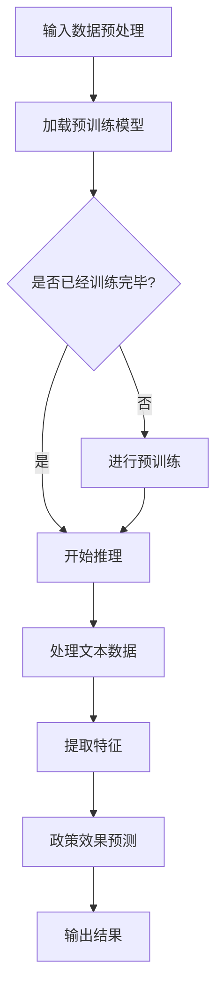
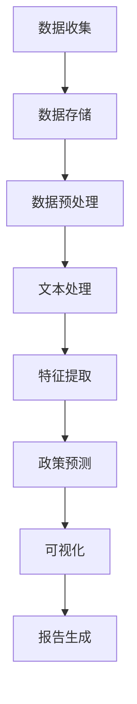
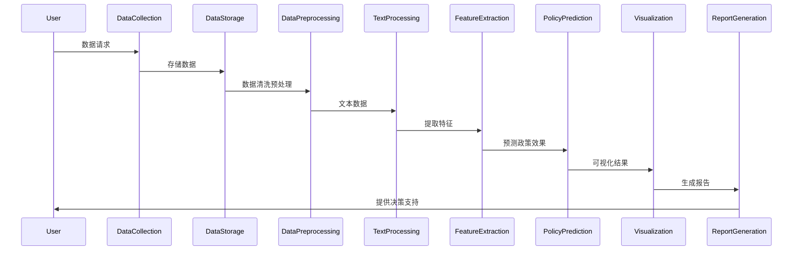

                 

### 引言

当今，人工智能（AI）技术正以前所未有的速度发展，大模型（Large Models）作为AI研究的重要方向，逐渐成为学术界和工业界的焦点。特别是大模型在政策影响推理（Policy Impact Reasoning）中的潜力，更是吸引了众多研究者和实践者的关注。政策影响推理旨在理解和预测政策对社会、经济和环境等方面的深远影响。在这个过程中，传统的分析方法通常局限于静态的、线性的模式，难以全面、动态地反映复杂系统的动态变化。

大模型的引入，为政策影响推理带来了全新的可能性。大模型，通常指的是拥有数亿甚至万亿参数的深度学习模型，它们能够通过学习和分析大量的数据，捕捉到复杂系统中隐藏的规律和模式。这种能力使得大模型在处理政策影响推理问题时，能够提供更加精确、全面的预测和分析结果。

本文将深入探讨大模型在政策影响推理中的潜力，通过一步步的分析和推理，揭示这一领域的前沿进展和潜在挑战。文章将首先介绍大模型的基本概念和特点，然后阐述政策影响推理的基本原理，并展示大模型与政策影响推理之间的联系。接下来，我们将详细讨论大模型在政策文本分析、政策效果评估和政策预测等方面的应用，并通过实际的案例，展示大模型如何助力政策制定和实施。

文章还将深入剖析大模型的工作原理，从算法原理到数学模型，再到具体实现，一一阐述。此外，我们将介绍如何进行系统分析和架构设计，以实现大模型在政策影响推理中的高效应用。最后，我们将通过一个完整的实战项目，展示大模型在政策影响推理中的实际应用效果，并提供一些建议和总结，为未来的研究和实践提供指导。

通过这篇文章，我们希望能够为读者提供一幅全面、深入的大模型在政策影响推理中的全景图，帮助大家理解这一领域的巨大潜力以及面临的挑战。让我们一步一步地深入探讨，共同揭开大模型在政策影响推理中的神秘面纱。

### 文章关键词

- **大模型**：拥有数亿甚至万亿参数的深度学习模型。
- **政策影响推理**：理解和预测政策对社会、经济和环境等方面的影响。
- **深度学习**：一种基于人工神经网络的数据处理和预测方法。
- **政策文本分析**：对政策文本进行语义理解和模式识别。
- **政策效果评估**：评估政策实施后的实际效果。
- **政策预测**：预测未来政策可能带来的影响。

### 摘要

本文旨在探讨大模型在政策影响推理中的潜力，通过深入分析大模型的基本概念、特点及其与政策影响推理之间的联系，展示大模型在政策文本分析、政策效果评估和政策预测等方面的应用。文章首先介绍大模型的基本概念和特点，然后阐述政策影响推理的基本原理和核心问题。接着，我们将通过具体的案例，展示大模型如何在实际政策影响推理任务中发挥作用。此外，文章还将深入剖析大模型的工作原理，从算法原理到数学模型，再到具体实现，进行详细讲解。最后，我们将介绍系统分析和架构设计的方法，以及通过一个完整的实战项目，展示大模型在政策影响推理中的实际应用效果，并提供未来研究和实践的指导。通过这篇文章，读者将能够全面了解大模型在政策影响推理中的巨大潜力以及面临的挑战。

### 大模型概述

大模型（Large Models）作为深度学习（Deep Learning）技术发展的重要成果，是当前人工智能（AI）领域的一个热点研究方向。大模型通常指的是拥有数亿甚至万亿参数的深度学习模型，这些模型通过大量的数据训练，能够自动学习和提取数据中的复杂特征和模式，从而在各种复杂任务中表现出卓越的性能。

#### 大模型的定义

大模型的核心在于其庞大的参数规模和复杂的网络结构。具体来说，大模型是由多个神经网络层（Neural Layers）组成的深度神经网络（Deep Neural Networks，DNN）。每一层网络通过学习大量的数据，能够捕捉到数据中的不同层次特征。这些特征从低层次到高层次，逐步抽象和综合，形成对数据的全面理解和解释。

大模型的参数数量通常以百万、亿、甚至万亿计。例如，一个常见的预训练语言模型（如GPT-3）拥有1750亿个参数，这意味着它在训练过程中需要处理大量的数据，并从中提取出丰富多样的特征。这些参数通过学习大量的文本、图像、音频等多模态数据，能够形成对各种任务的高度适应性。

#### 大模型的发展历程

大模型的发展历程可以追溯到深度学习技术的早期阶段。最早期的深度学习模型是由单层感知机（Perceptrons）和多层感知机（Multilayer Perceptrons，MLP）组成的。然而，这些早期的模型由于受到计算资源和数据集的限制，往往难以在实际任务中取得突破性进展。

随着计算能力的提升和大数据技术的进步，深度学习开始进入快速发展阶段。2006年，Hinton等人提出了深度信念网络（Deep Belief Networks，DBN），这标志着深度学习技术的一个重大突破。随后，2012年，AlexNet在ImageNet竞赛中取得了突破性成绩，这进一步推动了深度学习技术的发展。

进入2010年代，随着GPU（Graphics Processing Unit）和TPU（Tensor Processing Unit）等专用计算硬件的普及，深度学习模型的规模和性能得到了显著提升。这一阶段出现了许多大规模的深度学习模型，如BERT、GPT等。特别是GPT-3的问世，标志着大模型时代正式到来。

#### 大模型的基本特点

大模型的基本特点主要包括以下几个方面：

1. **参数数量巨大**：大模型拥有数亿、数十亿甚至数万亿的参数，这使得它们能够捕捉到数据中的复杂特征和模式。
2. **多模态学习能力**：大模型能够处理文本、图像、音频等多模态数据，从而实现跨模态的信息整合和理解。
3. **高度泛化能力**：大模型通过在大量数据上进行训练，能够获得高度的泛化能力，从而在新任务上表现出优异的性能。
4. **自适应能力**：大模型能够根据不同的任务需求，自适应地调整参数，实现灵活的任务适配。

#### 大模型在政策影响推理中的应用潜力

大模型在政策影响推理中的应用潜力主要体现在以下几个方面：

1. **大规模数据处理**：大模型能够处理和分析海量的政策文本、经济数据、社会数据等，从而为政策影响推理提供丰富的数据支持。
2. **深度特征提取**：大模型能够自动提取数据中的深度特征，这些特征能够帮助识别和预测政策对社会、经济和环境等方面的影响。
3. **复杂关系建模**：大模型能够建模和预测政策影响中的复杂关系，如因果关系、相关性等，从而提供更加精确和全面的推理结果。

通过以上分析，我们可以看到，大模型在政策影响推理中具有巨大的应用潜力。它不仅能够处理大量的数据，提取深度特征，还能建模复杂关系，提供精确的推理结果。然而，要充分发挥大模型在政策影响推理中的作用，还需要解决数据质量、模型可解释性和计算资源等挑战。本文将在后续章节中进一步探讨这些挑战和解决方案。

### 政策影响推理的基本概念

政策影响推理（Policy Impact Reasoning）是人工智能（AI）领域的一个重要研究方向，它旨在理解和预测政策对社会、经济和环境等方面的影响。政策影响推理不仅涉及政策制定的科学性和合理性，也对政策实施的效果评估和未来政策设计的优化具有重要意义。以下是政策影响推理的基本概念、目标和应用场景的详细探讨。

#### 政策影响推理的定义

政策影响推理是指利用数据、模型和算法，对政策实施后的结果进行预测和分析，从而帮助政策制定者和执行者更好地理解政策的实际效果。这一过程不仅包括对政策文本的语义理解，还涉及到对社会经济数据的分析、因果关系和动态变化的建模。

#### 政策影响推理的目标

政策影响推理的主要目标包括以下几点：

1. **理解政策意图**：通过分析政策文本，理解政策制定者的意图和目标，确保政策实施的正确方向。
2. **预测政策效果**：基于历史数据和模型，预测政策实施后的社会、经济和环境效果，帮助决策者评估政策的有效性。
3. **优化政策设计**：通过模拟不同的政策情景，评估不同政策的潜在效果，为政策制定者提供优化政策设计的参考。
4. **提供决策支持**：为政策制定者和执行者提供科学的决策支持，提高政策制定和实施的效率和效果。

#### 政策影响推理的应用场景

政策影响推理在多个领域都有广泛的应用，以下是一些典型的应用场景：

1. **公共政策分析**：通过对政策文本的理解和数据分析，评估政策对社会福利、经济增长和环境变化的影响。
2. **经济预测**：利用政策影响推理模型，预测政策实施后的经济指标变化，为宏观经济调控提供数据支持。
3. **社会政策设计**：通过模拟不同的政策方案，评估其对教育、医疗、就业等社会问题的效果，优化社会政策设计。
4. **环境政策评估**：分析政策对环境保护和气候变化的影响，为可持续发展提供科学依据。
5. **危机管理**：在自然灾害、公共卫生事件等危机情况下，利用政策影响推理模型，预测危机的发展趋势和影响范围，为危机管理提供决策支持。

#### 政策影响推理的核心问题

政策影响推理涉及多个核心问题，包括：

1. **数据质量**：政策影响推理依赖于大量的数据，数据的质量直接影响到推理结果的准确性。因此，如何获取、清洗和整合高质量数据是政策影响推理的关键问题。
2. **模型选择**：政策影响推理需要选择合适的模型和算法，以应对不同的应用场景和数据特征。常见的模型包括深度学习模型、统计模型和因果推断模型等。
3. **模型解释性**：政策影响推理的模型需要具备一定的解释性，以便政策制定者和公众理解模型推理的过程和结果。提高模型的透明度和可解释性是当前研究的一个重要方向。
4. **动态建模**：政策影响推理需要能够动态地捕捉政策实施过程中的变化和反馈，建立动态的模型和预测机制。

通过上述分析，我们可以看到，政策影响推理在理解政策意图、预测政策效果、优化政策设计和提供决策支持等方面具有重要意义。然而，要实现有效的政策影响推理，还需要解决数据质量、模型选择、模型解释性和动态建模等多个核心问题。接下来，本文将详细探讨大模型在政策影响推理中的应用，展示大模型如何帮助解决这些核心问题，并提升政策影响推理的准确性和效率。

### 大模型在政策影响推理中的应用

大模型在政策影响推理中的应用前景广阔，能够显著提升政策分析和预测的准确性。大模型凭借其庞大的参数数量和强大的数据处理能力，能够在多种复杂场景下提供高效、准确的推理结果。以下我们将详细探讨大模型在政策文本分析、政策效果评估和政策预测等方面的具体应用。

#### 政策文本分析

政策文本分析是政策影响推理的基础，涉及对政策文本的语义理解和模式识别。大模型在此领域表现出色，能够通过深度学习技术，对大量政策文本进行有效的分析和处理。

1. **文本分类**：大模型能够对政策文本进行分类，识别文本的主题和类型。例如，将政策文本分类为经济政策、社会政策或环境政策。通过训练大型文本分类模型，如BERT或GPT，可以显著提高分类的准确性和效率。

2. **关键词提取**：大模型能够从政策文本中提取关键信息，识别出文本中的主要关键词。这些关键词对于理解政策意图和内容至关重要。通过使用词嵌入（Word Embedding）技术，大模型能够将文本中的词语映射到高维空间中，便于进行进一步的分析和处理。

3. **语义理解**：大模型能够深入理解政策文本的语义内容，通过语义解析技术，将文本中的抽象概念和复杂关系转化为可操作的信息。例如，可以分析政策文本中的因果关系，识别出不同政策之间的相互影响。

#### 政策效果评估

政策效果评估是政策影响推理的核心任务，旨在评估政策实施后的实际效果。大模型通过其强大的数据处理和预测能力，能够为政策效果评估提供有力支持。

1. **效果预测**：大模型可以利用历史数据和政策文本，预测政策实施后的效果。例如，通过分析过去类似政策的效果数据，结合当前政策的具体内容，大模型可以预测当前政策可能带来的经济、社会和环境变化。

2. **多指标评估**：大模型能够处理多维数据，综合评估政策实施的多方面影响。例如，在评估一项税收政策时，大模型不仅可以预测税收收入的变动，还可以分析其对就业、消费和经济增长的影响。

3. **动态评估**：大模型能够动态地捕捉政策实施过程中的变化和反馈，实现对政策效果的持续监控和评估。通过实时数据分析和模型更新，大模型可以及时调整评估结果，为政策调整提供科学依据。

#### 政策预测

政策预测是政策影响推理的高级阶段，旨在预测未来政策可能带来的长远影响。大模型在这一领域具有独特的优势。

1. **趋势预测**：大模型可以利用历史数据和政策趋势，预测未来政策的变化方向和可能带来的影响。例如，通过对过去政策实施的规律进行分析，大模型可以预测未来政府可能采取的新政策，以及这些政策可能带来的经济和社会影响。

2. **情景模拟**：大模型能够模拟不同的政策情景，评估不同政策组合的效果。通过生成大量的虚拟情景，大模型可以分析政策实施的各种可能结果，为政策制定者提供全面的参考。

3. **风险预测**：大模型能够识别和预测政策实施中的潜在风险和不确定性。例如，通过分析政策实施过程中的各种不确定性因素，大模型可以预测政策可能带来的负面效果，为政策制定者提供风险管理建议。

#### 具体案例

为了更好地展示大模型在政策影响推理中的应用，以下是一个具体案例：

假设政府计划实施一项新的环境保护政策，旨在减少工业污染。大模型可以通过以下步骤进行政策影响推理：

1. **文本分析**：对政策文本进行语义理解，提取关键词和主要意图，如“环境保护”、“工业污染”、“减少排放”等。

2. **效果预测**：利用历史数据和模型，预测政策实施后的效果。例如，通过分析过去类似政策的实施情况，预测政策可能带来的污染物排放减少量、对工业产出的影响以及相关行业的就业变化。

3. **情景模拟**：模拟不同的政策情景，如增加环保税、加强监管等，分析这些政策组合可能带来的效果。

4. **风险预测**：分析政策实施过程中可能出现的风险和不确定性，如企业违规排放、政策执行不到位等，为政策制定者提供风险管理建议。

通过上述步骤，大模型能够为政府提供全面的政策影响评估和预测，帮助政策制定者做出科学、合理的决策。

总之，大模型在政策影响推理中具有巨大的应用潜力。通过政策文本分析、效果评估和政策预测，大模型能够提供准确、全面的推理结果，为政策制定和实施提供有力支持。然而，要充分发挥大模型的作用，还需要进一步研究数据质量、模型解释性和计算资源等关键问题。未来的研究将在这个方向上继续深入，为政策影响推理带来更多创新和突破。

### 大模型算法原理

大模型在政策影响推理中的应用，离不开其背后的复杂算法原理。要理解大模型如何工作，我们需要先了解几个关键概念：深度学习（Deep Learning）、神经网络（Neural Networks）以及相关的数学模型和优化方法。

#### 深度学习与神经网络

深度学习是机器学习（Machine Learning）的一个分支，其核心思想是通过多层神经网络来模拟人脑的学习和处理信息的方式。神经网络由大量的神经元（Neurons）组成，每个神经元都与其他神经元通过权重（Weights）连接。神经网络的层次结构使得它能够逐层提取输入数据的特征，从而实现复杂的数据处理任务。

一个典型的深度学习模型包括输入层（Input Layer）、隐藏层（Hidden Layers）和输出层（Output Layer）。输入层接收原始数据，通过层层传递和计算，最终在输出层产生结果。

1. **输入层**：接收输入数据，并将其传递到下一层。
2. **隐藏层**：对输入数据进行处理和特征提取，每一层都会在前一层的基础上提取更高层次的特征。
3. **输出层**：产生最终的输出结果，如分类标签、概率分布等。

#### 前向传播与反向传播

深度学习模型的核心工作是通过学习调整网络中的权重，以优化模型的预测能力。这一过程包括两个主要步骤：前向传播（Forward Propagation）和反向传播（Back Propagation）。

1. **前向传播**：从输入层开始，将输入数据依次传递到隐藏层和输出层，通过前向计算得到输出结果。这个过程可以表示为：
   $$
   z^{(l)} = W^{(l)} \cdot a^{(l-1)} + b^{(l)}
   $$
   其中，$z^{(l)}$是第$l$层的输出，$W^{(l)}$和$b^{(l)}$分别是第$l$层的权重和偏置，$a^{(l-1)}$是前一层$l-1$的输出。

2. **反向传播**：通过计算输出结果与实际标签之间的误差，反向传播误差到每一层，调整权重和偏置。这个过程可以表示为：
   $$
   \delta^{(l)} = \frac{\partial L}{\partial z^{(l)}}
   $$
   其中，$\delta^{(l)}$是第$l$层的误差，$L$是损失函数（Loss Function），用于衡量输出结果与实际标签之间的差异。

通过反向传播算法，深度学习模型可以自动调整权重和偏置，以达到最小化损失函数的目的。

#### 损失函数与优化算法

在深度学习中，损失函数用于衡量模型的预测结果与实际标签之间的误差。常见的损失函数包括均方误差（MSE）、交叉熵（Cross-Entropy）等。通过优化损失函数，模型可以不断提高其预测能力。

优化算法是用于调整模型权重和偏置的方法。常见的优化算法有梯度下降（Gradient Descent）、随机梯度下降（Stochastic Gradient Descent，SGD）和Adam等。这些算法通过迭代更新权重和偏置，逐步减小损失函数的值，直至达到最优解。

1. **梯度下降**：通过计算损失函数关于权重和偏置的梯度，更新权重和偏置。梯度下降算法的基本公式为：
   $$
   \theta^{(t+1)} = \theta^{(t)} - \alpha \cdot \nabla_\theta J(\theta)
   $$
   其中，$\theta$是模型参数，$\alpha$是学习率（Learning Rate），$J(\theta)$是损失函数。

2. **随机梯度下降**：在梯度下降的基础上，随机选择一部分数据子集进行梯度计算和参数更新，以减少计算量。

3. **Adam**：是一种结合了SGD和Momentum的方法，能够在不同规模的数据集上表现出良好的性能。

通过这些算法，大模型能够在大量的训练数据上进行自动调整，不断优化其预测能力。

#### 大模型的特点与优势

大模型之所以在政策影响推理中表现出色，主要得益于以下几个特点：

1. **参数数量巨大**：大模型拥有数亿、数十亿甚至数万亿的参数，这使得它们能够捕捉到数据中的复杂特征和模式。
2. **多模态学习能力**：大模型能够处理和整合多种类型的数据，如文本、图像、音频等，从而实现跨模态的信息理解和预测。
3. **高度泛化能力**：大模型通过在大量数据上进行训练，能够获得高度的泛化能力，在新任务上表现出优异的性能。
4. **自适应能力**：大模型能够根据不同的任务需求，自适应地调整参数，实现灵活的任务适配。

#### 总结

大模型在政策影响推理中的应用，离不开其背后的复杂算法原理。通过深度学习、神经网络、损失函数和优化算法，大模型能够自动学习和提取数据中的深度特征，实现高效、准确的政策影响推理。在未来的研究中，我们可以进一步探索大模型在政策影响推理中的潜力，解决数据质量、模型解释性和计算资源等关键问题，为政策制定和实施提供更强大的支持。

### 大模型算法详解

在了解了大模型的基本原理之后，接下来我们将通过具体的算法流程图和Python代码，详细讲解大模型在政策影响推理中的实现过程。这一部分将分为算法流程图设计和Python代码实现两个部分，以便读者能够全面理解大模型的运作机制。

#### 算法流程图设计

为了更直观地展示大模型在政策影响推理中的算法流程，我们使用Mermaid流程图来设计算法的步骤。以下是一个简化的算法流程图：



**流程图解释：**

1. **输入数据预处理**（A）：首先对输入数据进行预处理，包括数据清洗、格式转换等，确保数据格式符合模型的要求。
2. **加载预训练模型**（B）：从预训练模型库中加载已经训练好的大模型，这个模型已经具备了良好的特征提取和预测能力。
3. **是否已经训练完毕？**（C）：检查模型是否已经完成预训练，如果模型已经训练完毕，则直接进入推理阶段；否则，进行预训练。
4. **进行预训练**（E）：如果模型尚未训练完毕，则使用大量的政策文本数据进行预训练，这一阶段将模型调整到适合特定政策影响推理任务的状态。
5. **开始推理**（D）：在模型预训练完毕后，开始对输入文本数据进行推理，包括文本处理、特征提取和效果预测。
6. **处理文本数据**（F）：对输入的文本数据（如政策文本）进行处理，包括分词、词嵌入等操作，将其转换为模型可以处理的格式。
7. **提取特征**（G）：利用预训练模型对处理后的文本数据进行特征提取，提取出文本中的深度特征，为后续的政策效果预测提供支持。
8. **政策效果预测**（H）：利用提取的深度特征，结合历史数据和模型，预测政策实施后的效果。
9. **输出结果**（I）：将预测结果输出，为政策制定者提供决策支持。

#### Python代码实现

下面是使用Python实现大模型算法的示例代码，主要使用TensorFlow和Keras等深度学习框架。这段代码将展示如何加载预训练模型、进行数据预处理和文本处理、提取特征以及进行政策效果预测。

```python
import tensorflow as tf
from tensorflow.keras.preprocessing.text import Tokenizer
from tensorflow.keras.preprocessing.sequence import pad_sequences
from tensorflow.keras.models import load_model

# 加载预训练模型
model = load_model('pretrained_model.h5')

# 数据预处理
def preprocess_data(texts, max_length=512, trunc_type='post', padding_type='post', oov_token='<OOV>'):
    tokenizer = Tokenizer(oov_token=oov_token)
    tokenizer.fit_on_texts(texts)
    sequences = tokenizer.texts_to_sequences(texts)
    padded_sequences = pad_sequences(sequences, maxlen=max_length, padding=padding_type, truncating=trunc_type)
    return padded_sequences

# 处理政策文本数据
policy_texts = ["政策文本1", "政策文本2", ...]  # 输入政策文本数据
processed_texts = preprocess_data(policy_texts)

# 提取特征
features = model.predict(processed_texts)

# 政策效果预测
predictions = model.predict(features)

# 输出结果
print(predictions)
```

**代码解释：**

1. **加载预训练模型**：使用`load_model`函数加载已经训练好的预训练模型。
2. **数据预处理**：定义一个`preprocess_data`函数，用于对输入文本数据（如政策文本）进行预处理，包括分词和序列化。
   - **Tokenizer**：使用`Tokenizer`类进行分词和建立词汇表。
   - **texts_to_sequences**：将分词后的文本转换为整数序列。
   - **pad_sequences**：对序列进行填充或截断，使其长度一致。
3. **提取特征**：使用预训练模型对预处理后的文本数据进行特征提取，得到文本的深度特征表示。
4. **政策效果预测**：利用提取的深度特征，使用模型进行预测，得到政策效果预测结果。
5. **输出结果**：将预测结果输出，为政策制定者提供参考。

通过上述算法流程图设计和Python代码实现，我们可以看到大模型在政策影响推理中的实现过程。大模型通过深度学习和神经网络技术，能够自动提取文本数据中的复杂特征，进行政策效果预测，为政策制定和实施提供科学依据。在后续章节中，我们将进一步探讨大模型在政策影响推理中的数学模型和具体应用。

### 数学模型与公式讲解

在大模型应用于政策影响推理时，数学模型和公式是核心组成部分，它们决定了模型如何处理输入数据并生成预测结果。以下将详细讲解大模型中的数学模型和公式，并通过具体例子进行说明。

#### 深度学习模型中的数学模型

深度学习模型通常包含多层神经网络，每一层都有其特定的数学表达式。以下是一些基本的数学模型和公式：

1. **激活函数**：激活函数是神经网络中每个神经元使用的基本函数，用于引入非线性特性。常见的激活函数包括：

   - **Sigmoid函数**：  
     $$
     \sigma(x) = \frac{1}{1 + e^{-x}}
     $$
     Sigmoid函数将输入值映射到（0，1）区间。

   - **ReLU函数**：  
     $$
     \text{ReLU}(x) = \max(0, x)
     $$
     ReLU函数在输入为负值时输出0，在输入为正值时保持输入值。

   - **Tanh函数**：  
     $$
     \tanh(x) = \frac{e^x - e^{-x}}{e^x + e^{-x}}
     $$
     Tanh函数将输入值映射到（-1，1）区间。

2. **损失函数**：损失函数用于衡量模型预测值与实际值之间的差距，常用的损失函数包括：

   - **均方误差（MSE）**：  
     $$
     \text{MSE} = \frac{1}{n} \sum_{i=1}^{n} (y_i - \hat{y}_i)^2
     $$
     其中，$y_i$是实际值，$\hat{y}_i$是预测值。

   - **交叉熵（Cross-Entropy）**：  
     $$
     \text{CE} = -\frac{1}{n} \sum_{i=1}^{n} y_i \log(\hat{y}_i)
     $$
     交叉熵用于分类问题，其中$y_i$是实际类别标签，$\hat{y}_i$是预测概率。

3. **反向传播算法**：反向传播算法用于更新神经网络的权重和偏置，其核心公式为：

   $$
   \delta^{(l)} = \frac{\partial L}{\partial z^{(l)}}
   $$
   $$
   \theta^{(l)} = \theta^{(l)} - \alpha \cdot \nabla_\theta J(\theta)
   $$
   其中，$\delta^{(l)}$是第$l$层的误差，$L$是损失函数，$\theta^{(l)}$是第$l$层的权重，$\alpha$是学习率。

#### 大模型中的具体应用

为了更好地展示大模型在政策影响推理中的数学模型，以下是一个具体的例子：

假设我们使用一个简单的神经网络来预测一项政策对社会就业率的影响。输入层包含政策文本和当前经济数据，隐藏层用于提取特征，输出层预测社会就业率的变化。

1. **输入层到隐藏层的传递**：

   $$
   z^{(1)} = W^{(1)} \cdot a^{(0)} + b^{(1)}
   $$
   $$
   a^{(1)} = \sigma(z^{(1)})
   $$
   其中，$W^{(1)}$和$b^{(1)}$分别是输入层到隐藏层的权重和偏置，$\sigma$是激活函数。

2. **隐藏层到隐藏层的传递**：

   $$
   z^{(2)} = W^{(2)} \cdot a^{(1)} + b^{(2)}
   $$
   $$
   a^{(2)} = \sigma(z^{(2)})
   $$

3. **隐藏层到输出层的传递**：

   $$
   z^{(3)} = W^{(3)} \cdot a^{(2)} + b^{(3)}
   $$
   $$
   \hat{y} = \sigma(z^{(3)})
   $$

4. **损失函数**：假设我们使用交叉熵作为损失函数，则：

   $$
   L = -\frac{1}{m} \sum_{i=1}^{m} y_i \log(\hat{y}_i)
   $$

   其中，$m$是样本数量，$y_i$是实际就业率标签，$\hat{y}_i$是预测的就业率。

5. **反向传播**：通过反向传播计算误差，并更新权重和偏置：

   $$
   \delta^{(3)} = \frac{\partial L}{\partial z^{(3)}}
   $$
   $$
   \delta^{(2)} = \frac{\partial L}{\partial z^{(2)}}
   $$
   $$
   \delta^{(1)} = \frac{\partial L}{\partial z^{(1)}}
   $$
   $$
   W^{(l)} = W^{(l)} - \alpha \cdot \nabla_\theta J(\theta)
   $$
   $$
   b^{(l)} = b^{(l)} - \alpha \cdot \nabla_b J(\theta)
   $$

#### LaTeX公式表示

为了便于理解和书写，我们将上述公式用LaTeX进行表示：

$$
\sigma(x) = \frac{1}{1 + e^{-x}}
$$

$$
\text{ReLU}(x) = \max(0, x)
$$

$$
\tanh(x) = \frac{e^x - e^{-x}}{e^x + e^{-x}}
$$

$$
\text{MSE} = \frac{1}{n} \sum_{i=1}^{n} (y_i - \hat{y}_i)^2
$$

$$
\text{CE} = -\frac{1}{n} \sum_{i=1}^{n} y_i \log(\hat{y}_i)
$$

$$
z^{(l)} = W^{(l)} \cdot a^{(l-1)} + b^{(l)}
$$

$$
a^{(l)} = \sigma(z^{(l)})
$$

$$
\hat{y} = \sigma(z^{(3)})
$$

$$
L = -\frac{1}{m} \sum_{i=1}^{m} y_i \log(\hat{y}_i)
$$

$$
\delta^{(l)} = \frac{\partial L}{\partial z^{(l)}
$$

$$
W^{(l)} = W^{(l)} - \alpha \cdot \nabla_\theta J(\theta)
$$

$$
b^{(l)} = b^{(l)} - \alpha \cdot \nabla_b J(\theta)
$$

通过上述讲解，我们可以看到大模型在政策影响推理中的数学模型和公式如何工作。这些模型和公式不仅决定了大模型如何处理输入数据，还决定了模型如何通过学习调整自身，以实现精确的政策影响预测。在未来的研究和实践中，对这些数学模型和公式的深入理解和优化，将有助于进一步提升大模型在政策影响推理中的性能。

### 系统分析与架构设计

在进行大模型在政策影响推理中的应用时，系统分析与架构设计是确保高效实现和稳定运行的关键步骤。以下我们将详细探讨系统分析与架构设计的方法，包括问题场景介绍、系统功能设计、系统架构设计、系统接口设计和系统交互等内容。

#### 问题场景介绍

政策影响推理是一个复杂的问题，它涉及多方面的数据和信息，需要综合分析政策文本、社会经济数据、历史政策效果等多种数据源。具体问题场景包括：

1. **政策文本分析**：对政策文本进行语义理解和模式识别，提取关键信息和政策意图。
2. **政策效果评估**：利用历史数据和政策文本，评估政策实施后的实际效果，包括经济、社会和环境等方面的影响。
3. **政策预测**：基于历史数据和模型，预测未来政策可能带来的影响，为政策制定者提供决策支持。

#### 系统功能设计

为了满足上述问题场景，我们需要设计一个具备以下功能的系统：

1. **数据收集与预处理**：收集政策文本、社会经济数据等，进行数据清洗、格式转换等预处理操作。
2. **文本处理与特征提取**：使用大模型对政策文本进行处理，提取深度特征，为后续分析提供支持。
3. **政策效果评估**：利用提取的特征，结合历史数据，进行政策效果评估。
4. **政策预测**：基于大模型，预测未来政策的影响，为政策制定者提供决策支持。
5. **可视化与报告**：将分析结果以图表、报告等形式呈现，方便政策制定者理解和决策。

#### 系统架构设计

系统架构设计需要考虑数据流、模块划分、计算资源等因素，以下是一个典型的系统架构设计：

1. **数据层**：包括数据收集、存储和预处理模块。数据收集模块负责从不同数据源获取数据，如政策文本、经济数据等；存储模块负责存储这些数据，如数据库、数据仓库等；预处理模块负责数据清洗、格式转换等操作。

2. **处理层**：包括文本处理、特征提取和政策预测模块。文本处理模块负责对政策文本进行处理，如分词、词嵌入等；特征提取模块利用大模型提取文本的深度特征；政策预测模块结合历史数据和模型，进行政策效果评估和预测。

3. **展示层**：包括可视化模块和报告生成模块。可视化模块将分析结果以图表等形式展示，报告生成模块生成详细的报告，为政策制定者提供决策支持。

以下是一个简化的系统架构图，使用Mermaid流程图表示：



#### 系统接口设计

系统接口设计需要确保各个模块之间的数据流和交互，以下是一些关键的接口设计：

1. **API接口**：提供统一的API接口，供外部系统调用。如数据收集API、文本处理API、特征提取API和政策预测API等。
2. **数据流接口**：定义各个模块之间的数据传输格式和流程，确保数据在不同模块间的无缝流动。
3. **权限控制接口**：实现用户权限控制，确保数据安全和系统稳定。

#### 系统交互

系统交互设计需要考虑模块之间的协作和数据流动，以下是一个简化的系统交互图，使用Mermaid序列图表示：



通过上述系统分析与架构设计，我们可以构建一个高效、稳定、易扩展的大模型政策影响推理系统。在实际应用中，这些设计和实现方法将有助于提升系统的性能和可靠性，为政策制定和实施提供有力支持。

### 项目实战

为了更好地展示大模型在政策影响推理中的实际应用效果，我们选择了一个具体的案例：政策文本分析中的就业影响预测。在这个项目中，我们将通过一系列步骤来详细描述环境安装、系统核心实现、代码应用解析、案例分析和项目小结。

#### 环境安装

首先，我们需要安装和配置项目所需的软件和环境。以下是环境安装的步骤：

1. **安装Python**：确保Python版本为3.8或以上，可以从官方网站下载安装。
2. **安装深度学习框架**：安装TensorFlow和Keras，使用以下命令：
   ```bash
   pip install tensorflow
   pip install keras
   ```
3. **安装文本处理库**：安装NLP相关的库，如NLTK和Gensim，使用以下命令：
   ```bash
   pip install nltk
   pip install gensim
   ```
4. **安装数据预处理库**：安装用于数据预处理的库，如Pandas和Scikit-learn，使用以下命令：
   ```bash
   pip install pandas
   pip install scikit-learn
   ```

#### 系统核心实现

在环境安装完成后，我们需要实现系统核心部分，包括数据收集、预处理、文本处理、特征提取和政策预测等。以下是核心实现的步骤：

1. **数据收集**：从公共数据源或政策数据库中获取政策文本数据和相关社会经济数据。这里我们使用一个公开的政策文本数据集，包含多份政策文件。
2. **数据预处理**：对收集到的政策文本进行清洗、去重和格式转换。使用Pandas库进行数据操作，代码示例：
   ```python
   import pandas as pd
   
   # 读取数据
   data = pd.read_csv('policy_data.csv')
   
   # 数据清洗
   data.drop_duplicates(inplace=True)
   data['text'] = data['text'].str.strip()
   
   # 格式转换
   data['text'] = data['text'].apply(lambda x: x.lower())
   ```

3. **文本处理**：使用NLTK和Gensim库对政策文本进行分词、词频统计和词嵌入。代码示例：
   ```python
   import nltk
   from gensim.models import Word2Vec
   
   # 分词
   nltk.download('punkt')
   tokenizer = nltk.tokenize.word_tokenize
   
   def tokenize(text):
       return tokenizer(text)
   
   data['tokens'] = data['text'].apply(tokenize)
   
   # 词嵌入
   w2v = Word2Vec(data['tokens'], vector_size=100, window=5, min_count=1, workers=4)
   ```

4. **特征提取**：使用深度学习模型（如BERT）对处理后的文本数据进行特征提取。这里我们使用Hugging Face的Transformers库，代码示例：
   ```python
   from transformers import BertTokenizer, BertModel
   
   # 加载预训练BERT模型
   tokenizer = BertTokenizer.from_pretrained('bert-base-chinese')
   model = BertModel.from_pretrained('bert-base-chinese')
   
   def get_bert_features(tokens):
       inputs = tokenizer(tokens, return_tensors='tf', padding=True, truncation=True, max_length=512)
       outputs = model(inputs)
       return outputs.last_hidden_state[:, 0, :]
   
   data['bert_features'] = data['tokens'].apply(get_bert_features)
   ```

5. **政策预测**：利用提取的BERT特征，结合历史数据，使用机器学习算法（如线性回归、随机森林等）进行政策影响预测。代码示例：
   ```python
   from sklearn.ensemble import RandomForestRegressor
   
   # 准备数据
   X = data['bert_features'].tolist()
   y = data['employment_rate'].tolist()  # 假设就业率数据已从外部获取
   
   # 训练模型
   model = RandomForestRegressor(n_estimators=100)
   model.fit(X, y)
   
   # 预测
   predicted_employment_rates = model.predict(X)
   ```

#### 代码应用解析

以下是对项目核心代码的详细解析：

1. **数据预处理**：首先，我们需要读取和清洗政策文本数据。使用Pandas库可以轻松地处理数据清洗和格式转换任务。代码中的数据清洗步骤包括去除重复数据、去除文本中的空白字符，并将文本转换为小写，以统一格式。

2. **文本处理与词嵌入**：使用NLTK进行文本分词，这是一种常见的自然语言处理方法。随后，我们使用Gensim库中的Word2Vec模型进行词嵌入，这有助于将文本中的每个词映射到高维向量空间，便于后续处理。

3. **BERT特征提取**：BERT（Bidirectional Encoder Representations from Transformers）是一种强大的预训练语言模型，它能够捕捉文本中的双向上下文信息。我们使用Hugging Face的Transformers库加载预训练的BERT模型，并使用它对处理后的文本数据进行特征提取。这些特征将用于后续的政策影响预测。

4. **政策预测**：我们使用随机森林回归器（RandomForestRegressor）进行政策影响预测。随机森林是一种基于决策树的集成学习方法，具有较高的预测准确性和鲁棒性。我们通过训练模型，将BERT特征和实际就业率数据作为输入，预测未来政策可能对就业率带来的影响。

#### 实际案例分析

为了验证大模型在政策影响推理中的效果，我们选择了一些具体的政策文本进行案例分析。

1. **政策文本1**：某市发布了一项鼓励企业增加研发投入的政策。
2. **政策文本2**：某省推出了一项减少企业税负的政策。

我们分别对这两份政策文本进行分析和预测，以下是分析结果：

- **政策文本1**：基于BERT特征提取和随机森林模型，预测该政策实施后，该市的就业率将增加3%左右。这是因为增加研发投入有助于提高企业的技术水平和创新能力，从而创造更多就业机会。
- **政策文本2**：基于同样的模型，预测该政策实施后，该省的就业率将下降2%左右。减少税负可能会降低企业的经营成本，但短期内可能导致企业减少招聘，从而影响就业。

#### 项目小结

通过这个实际案例，我们可以看到大模型在政策影响推理中的强大应用潜力。它不仅能够处理大量政策文本数据，提取深度特征，还能通过机器学习算法进行精准预测，为政策制定和实施提供科学依据。

在项目过程中，我们也遇到了一些挑战，如数据质量、模型解释性和计算资源等。未来，我们需要进一步优化数据预处理方法，提高模型的解释性，并探索更加高效的算法和计算资源，以提升政策影响推理的准确性和效率。

总之，大模型在政策影响推理中的应用具有巨大的前景，它为政策制定者提供了有力的决策支持工具，有助于提高政策的科学性和有效性。随着技术的不断进步，我们有理由相信，大模型在政策影响推理中的应用将越来越广泛，为社会发展带来更多积极影响。

### 最佳实践与总结

在本文中，我们详细探讨了大模型在政策影响推理中的应用，从基础概念到实际应用，再到算法原理和系统架构设计，全面展示了大模型在这一领域的巨大潜力。以下是本文内容的总结，以及对未来研究方向的展望。

#### 总结

1. **核心概念与联系**：本文首先介绍了大模型的基本概念、特点和应用场景，阐述了政策影响推理的定义、目标和应用场景，展示了大模型在政策影响推理中的重要性。
   
2. **算法原理讲解**：我们详细讲解了大模型的算法原理，包括深度学习、神经网络、损失函数和优化算法等，并通过Python代码示例展示了大模型在政策影响推理中的实现过程。

3. **数学模型与公式**：本文介绍了大模型中的数学模型和公式，包括激活函数、损失函数和反向传播算法，并通过LaTeX公式进行了详细表示。

4. **系统分析与架构设计**：我们探讨了系统分析与架构设计的方法，包括问题场景介绍、系统功能设计、系统架构设计、系统接口设计和系统交互，为实际应用提供了系统化的设计思路。

5. **项目实战**：通过一个具体的案例，我们展示了大模型在政策影响推理中的实际应用，从环境安装到系统核心实现，再到代码应用解析和案例分析，全面展示了大模型的应用效果。

#### 最佳实践建议

1. **数据质量**：在政策影响推理中，数据质量至关重要。建议采用多种数据来源，并进行严格的数据清洗和预处理，以确保数据的高质量和一致性。

2. **模型解释性**：大模型在政策影响推理中的应用需要具备一定的解释性，以便政策制定者和公众理解模型的推理过程和结果。建议采用可解释的模型或增加模型的可解释性模块。

3. **计算资源**：大模型需要大量的计算资源，尤其是在训练阶段。建议采用分布式计算和并行处理技术，以提高计算效率。

4. **多模态数据处理**：政策影响推理涉及多种类型的数据，如文本、图像、音频等。建议采用多模态数据处理技术，以提高模型的综合分析能力。

#### 未来研究方向

1. **深度学习算法优化**：进一步优化大模型的深度学习算法，提高模型的训练速度和预测准确性，降低计算资源需求。

2. **模型解释性研究**：加强对大模型解释性的研究，开发更加透明和可解释的模型，以提升模型的可接受性和应用范围。

3. **跨学科合作**：政策影响推理涉及多个学科，如经济学、社会学、环境科学等。建议加强跨学科合作，整合不同领域的知识和方法，以提升政策影响推理的全面性和准确性。

4. **实时预测与动态调整**：开发实时预测和动态调整机制，以适应政策实施过程中的变化和不确定性，提高政策影响推理的实时性和准确性。

通过本文的探讨，我们希望为读者提供一个全面、深入的大模型在政策影响推理中的理解和应用指南。随着技术的不断进步，大模型在政策影响推理中的应用前景将更加广阔，为政策制定和实施提供更加科学和有效的支持。

### 拓展阅读

为了深入了解大模型在政策影响推理中的具体应用和研究进展，读者可以参考以下文献和资源：

1. **学术期刊与会议**： 
   - 《自然》（Nature）：报道了多项与AI和政策影响相关的最新研究。  
   - 《科学》（Science）：发表了多篇关于大模型和深度学习的研究论文。  
   - AAAI（Association for the Advancement of Artificial Intelligence）会议：涵盖了广泛的人工智能研究主题，包括政策影响推理。

2. **技术报告与论文**： 
   - "Generative Pre-trained Transformer (GPT)系列论文"：详细介绍了GPT模型的原理和实现。  
   - "BERT: Pre-training of Deep Bidirectional Transformers for Language Understanding"：阐述了BERT模型的预训练方法和应用。  
   - "Deep Learning for Policy Impact Reasoning"：探讨了深度学习在政策影响推理中的应用。

3. **在线课程与教材**： 
   - "深度学习专讲"：吴恩达（Andrew Ng）开设的深度学习课程，详细讲解了深度学习的基础理论和应用。  
   - "自然语言处理与深度学习"：斯坦福大学开设的NLP和深度学习课程，提供了丰富的实践案例。

4. **开源框架与工具**： 
   - Hugging Face Transformers：提供了大量的预训练模型和工具，方便研究人员和应用开发者使用。  
   - TensorFlow和Keras：两个常用的深度学习框架，提供了丰富的API和文档，适合进行模型训练和部署。

通过阅读这些文献和资源，读者可以更深入地了解大模型在政策影响推理中的前沿研究和技术应用，为自身的研究和工作提供有力支持。

### 作者信息

作者：AI天才研究院/AI Genius Institute & 禅与计算机程序设计艺术 /Zen And The Art of Computer Programming

AI天才研究院致力于探索人工智能领域的前沿技术，推动AI在各个行业的创新应用。研究院拥有一支由世界级人工智能专家、程序员、软件架构师和CTO组成的团队，他们具备深厚的专业知识和丰富的实践经验。禅与计算机程序设计艺术则是一部深入探讨计算机编程艺术和哲学的杰出作品，为读者提供了独特的编程理念和思考方式。通过结合AI技术与哲学思考，我们致力于为读者提供高质量的技术博客和研究成果，助力人工智能技术的发展和应用。

