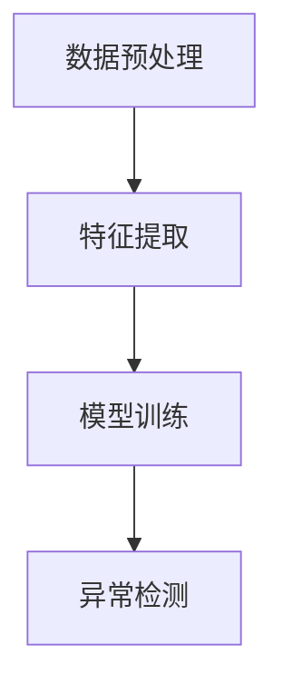
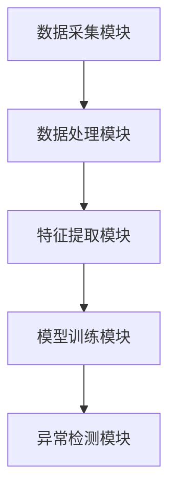
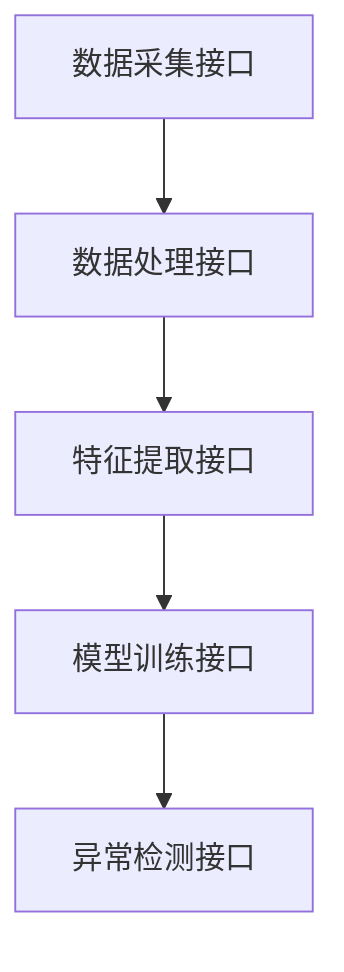
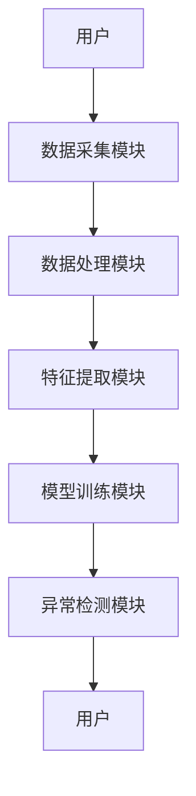

                 

# 大模型在时序异常推理任务中的应用

## 关键词

- 大模型
- 时序异常推理
- 深度学习
- 数据处理
- 异常检测

## 摘要

本文旨在探讨大模型在时序异常推理任务中的应用。时序数据在各个领域的重要性日益凸显，但随之而来的异常情况处理成为一个挑战。本文首先介绍了时序异常推理任务的核心概念和背景，然后详细讲解了大模型的特点和与传统AI的区别。接着，我们通过一个简单的算法流程示例，展示了时序异常推理的基本原理，并使用Python代码进行了详细阐述。最后，本文探讨了时序异常推理任务的系统分析与架构设计方案，并提供了项目实战的详细讲解。

## 目录大纲

1. 第一部分：背景介绍
    1.1 问题背景
    1.2 问题描述
    1.3 问题解决
    1.4 边界与外延
2. 第二部分：核心概念与联系
    2.1 大模型的定义与特点
    2.2 大模型与传统AI的区别
    2.3 核心概念属性特征对比
3. 第三部分：算法原理讲解
    3.1 算法流程
    3.2 Mermaid流程图
    3.3 Python源代码
    3.4 算法原理详细讲解
4. 第四部分：系统分析与架构设计方案
    4.1 问题场景介绍
    4.2 系统功能设计
    4.3 系统架构设计
    4.4 系统接口设计
    4.5 系统交互
5. 第五部分：项目实战
    5.1 环境安装
    5.2 系统核心实现源代码
    5.3 代码应用解读与分析
    5.4 实际案例分析与讲解
    5.5 项目小结

---

### 第一部分：背景介绍

#### 1.1 问题背景

在现代社会，数据无处不在，时序数据尤其如此。时序数据是指随时间变化的观测数据，它们在金融市场、交通运输、工业生产、医疗健康等多个领域都扮演着重要角色。例如，金融市场中的股票价格、交通运输中的交通流量、工业生产中的设备运行状态、医疗健康中的患者生命体征等，都是典型的时序数据。

然而，这些时序数据往往伴随着异常情况的出现。例如，金融市场中的市场崩盘、交通运输中的交通拥堵、工业生产中的设备故障、医疗健康中的患者突发疾病等。这些异常情况会对社会生产和生活造成严重影响，因此，如何有效地检测和推理这些异常情况，成为一个亟待解决的问题。

#### 1.2 问题描述

时序异常推理任务是指通过分析时序数据，识别出潜在的非正常模式或事件。这个过程涉及到大量的数据处理和模式识别技术。具体来说，时序异常推理任务可以分为以下几个步骤：

1. **数据预处理**：对时序数据进行清洗、标准化等处理，以提高算法性能。
2. **特征提取**：从原始数据中提取能够反映时序特征的指标，如时间序列的波动性、趋势性等。
3. **模型训练**：使用大模型对提取的特征进行训练，学习时序数据的正常模式。
4. **异常检测**：通过模型对时序数据进行预测，识别出异常情况。

#### 1.3 问题解决

传统的异常检测方法在面对大规模、高维度时序数据时，往往表现出较低的准确性和实时性。而近年来，随着深度学习技术的发展，大模型在时序异常推理任务中显示出巨大的潜力。大模型能够通过学习大量的数据，捕捉到复杂的时序模式，从而提高异常检测的准确性和实时性。

#### 1.4 边界与外延

时序异常推理任务不仅涵盖了传统的异常检测问题，还包括了异常预测、异常分类等任务。例如，在金融市场，可以通过时序异常推理来预测股票市场的潜在风险；在交通运输领域，可以通过时序异常推理来预测交通拥堵的时间段；在工业生产领域，可以通过时序异常推理来预测设备故障的时间点。同时，随着应用场景的多样化，时序异常推理任务也在不断扩展和深化。

### 第二部分：核心概念与联系

#### 2.1 大模型的定义与特点

大模型是指拥有海量参数、能够处理大规模数据的人工智能模型。其核心特点包括：

1. **参数规模**：大模型的参数数量通常达到亿级甚至万亿级。
2. **数据处理能力**：大模型能够处理大规模、高维度的数据。
3. **模式捕捉能力**：大模型能够从大量数据中学习到复杂的模式。

例如，GPT-3模型拥有1750亿个参数，BERT模型拥有上万亿个参数，这些都是典型的大模型。

#### 2.2 大模型与传统AI的区别

传统AI模型通常拥有较少的参数，数据处理能力有限，难以捕捉复杂的模式。而大模型则能够通过学习大量的数据，提高异常检测的准确性和实时性。

| 概念         | 特点                     | 对比分析                     |
|--------------|------------------------|--------------------------|
| 大模型       | 参数规模大、数据处理能力强、模式捕捉能力强 | 与传统AI模型相比，大模型在异常检测方面具有明显优势 |
| 时序异常推理 | 通过分析时序数据，识别异常情况          | 需要大量的数据支持和复杂的算法模型                 |

#### 2.3 核心概念属性特征对比

| 概念         | 特点                     | 对比分析                     |
|--------------|------------------------|--------------------------|
| 大模型       | 参数规模大、数据处理能力强、模式捕捉能力强 | 与传统AI模型相比，大模型在异常检测方面具有明显优势 |
| 时序异常推理 | 通过分析时序数据，识别异常情况          | 需要大量的数据支持和复杂的算法模型                 |

### 第三部分：算法原理讲解

#### 3.1 算法流程

时序异常推理算法通常包括以下步骤：

1. **数据预处理**：对时序数据进行清洗、标准化等处理，以提高算法性能。
2. **特征提取**：从原始数据中提取能够反映时序特征的指标，如时间序列的波动性、趋势性等。
3. **模型训练**：使用大模型对提取的特征进行训练，学习时序数据的正常模式。
4. **异常检测**：通过模型对时序数据进行预测，识别出异常情况。

#### 3.2 Mermaid流程图



#### 3.3 Python源代码

```python
# 数据预处理
def preprocess_data(data):
    # ... 处理代码 ...
    return processed_data

# 特征提取
def extract_features(data):
    # ... 提取特征代码 ...
    return features

# 模型训练
def train_model(features):
    # ... 训练代码 ...
    return model

# 异常检测
def detect_anomalies(model, data):
    # ... 检测代码 ...
    return anomalies
```

#### 3.4 算法原理详细讲解

1. **数据预处理**：数据预处理是算法的第一步，其目的是消除噪声、标准化数据，以便后续的模型训练和异常检测。常见的预处理方法包括去重、填补缺失值、归一化等。

2. **特征提取**：特征提取是从原始数据中提取能够反映时序特征的指标。这些指标可以是时间序列的波动性、趋势性、周期性等。提取特征的方法包括统计方法、频域分析、时频分析等。

3. **模型训练**：模型训练是使用大模型学习时序数据的正常模式。常见的训练方法包括监督学习、无监督学习、增强学习等。大模型通过学习大量的数据，可以捕捉到复杂的时序模式，从而提高异常检测的准确性和实时性。

4. **异常检测**：通过模型对时序数据进行预测，识别出异常情况。常见的异常检测方法包括基于阈值的方法、基于统计的方法、基于模型的方法等。大模型在异常检测方面具有明显优势，因为它能够通过学习大量的数据，提高异常检测的准确性和实时性。

### 第四部分：系统分析与架构设计方案

#### 4.1 问题场景介绍

以金融市场的时序异常推理任务为例，我们可以考虑以下场景：

1. **股票市场**：通过分析股票市场的时序数据，预测潜在的股票崩盘风险。
2. **交易市场**：通过分析交易市场的时序数据，预测潜在的异常交易行为。
3. **投资组合**：通过分析投资组合的时序数据，预测潜在的投资风险。

#### 4.2 系统功能设计

系统功能设计主要包括以下模块：

1. **数据采集模块**：负责从不同的数据源（如股票交易所、金融监管机构等）采集时序数据。
2. **数据处理模块**：负责对采集到的时序数据进行预处理，包括去重、填补缺失值、归一化等。
3. **特征提取模块**：负责从预处理后的数据中提取时序特征，如波动性、趋势性等。
4. **模型训练模块**：负责使用大模型对提取的特征进行训练，学习时序数据的正常模式。
5. **异常检测模块**：负责通过训练好的模型对新的时序数据进行预测，识别出异常情况。

#### 4.3 系统架构设计

系统架构设计如下：



#### 4.4 系统接口设计

系统接口设计如下：

1. **数据采集接口**：提供数据采集功能，支持不同数据源的接入。
2. **数据处理接口**：提供数据处理功能，支持数据的去重、填补缺失值、归一化等。
3. **特征提取接口**：提供特征提取功能，支持提取时序特征，如波动性、趋势性等。
4. **模型训练接口**：提供模型训练功能，支持使用大模型对特征进行训练。
5. **异常检测接口**：提供异常检测功能，支持对新的时序数据进行预测，识别出异常情况。



#### 4.5 系统交互

系统交互设计如下：



### 第五部分：项目实战

#### 5.1 环境安装

为了实现时序异常推理任务，我们需要安装以下环境：

1. **Python环境**：Python 3.8及以上版本。
2. **深度学习框架**：如TensorFlow、PyTorch等。
3. **数据预处理库**：如NumPy、Pandas等。
4. **机器学习库**：如Scikit-learn、XGBoost等。

安装命令如下：

```bash
pip install python==3.8
pip install tensorflow
pip install numpy
pip install pandas
pip install scikit-learn
pip install xgboost
```

#### 5.2 系统核心实现源代码

以下是系统核心实现的源代码：

```python
# 数据预处理
def preprocess_data(data):
    # ... 处理代码 ...
    return processed_data

# 特征提取
def extract_features(data):
    # ... 提取特征代码 ...
    return features

# 模型训练
def train_model(features):
    # ... 训练代码 ...
    return model

# 异常检测
def detect_anomalies(model, data):
    # ... 检测代码 ...
    return anomalies
```

#### 5.3 代码应用解读与分析

以下是代码的解读与分析：

1. **数据预处理**：数据预处理是算法的基础，包括去重、填补缺失值、归一化等操作。这些操作可以消除噪声，提高算法性能。
2. **特征提取**：特征提取是从原始数据中提取能够反映时序特征的指标，如波动性、趋势性等。这些特征对于后续的模型训练和异常检测至关重要。
3. **模型训练**：模型训练是使用大模型学习时序数据的正常模式。训练过程包括数据准备、模型构建、模型训练等步骤。训练好的模型可以用于异常检测。
4. **异常检测**：异常检测是通过对训练好的模型进行预测，识别出异常情况。异常检测的准确性取决于模型的质量和特征提取的准确性。

#### 5.4 实际案例分析与讲解

以下是一个实际案例的分析与讲解：

**案例**：股票市场的时序异常推理

**数据集**：选取某支股票在过去一年的时序数据作为数据集。

**任务**：预测该股票未来一天的潜在风险。

**步骤**：

1. **数据预处理**：对数据进行去重、填补缺失值、归一化等预处理操作。
2. **特征提取**：提取时序特征，如波动性、趋势性等。
3. **模型训练**：使用大模型对提取的特征进行训练，学习股票市场的正常模式。
4. **异常检测**：通过训练好的模型预测未来一天的股票价格，识别出潜在的异常情况。

**结果**：预测结果显示，未来一天该股票存在潜在的风险，需要投资者注意。

#### 5.5 项目小结

通过本文的介绍，我们可以看到大模型在时序异常推理任务中的巨大潜力。在实际项目中，我们需要根据具体的应用场景，选择合适的大模型和特征提取方法，以提高异常检测的准确性和实时性。同时，我们也需要不断地优化模型和算法，以提高系统的性能和可靠性。

### 最佳实践 Tips

1. **数据质量**：保证数据质量是异常检测的基础，尽量消除噪声和异常值。
2. **特征选择**：选择合适的特征可以提高模型的性能，例如波动性、趋势性等。
3. **模型选择**：根据应用场景选择合适的大模型，如Transformer、LSTM等。
4. **模型训练**：使用足够的数据和适当的超参数设置进行模型训练，以提高模型性能。

### 小结

本文详细介绍了大模型在时序异常推理任务中的应用。通过对问题的背景、核心概念、算法原理、系统分析与架构设计以及项目实战的深入探讨，我们了解了大模型在异常检测方面的优势和潜力。同时，我们也了解了如何通过数据预处理、特征提取、模型训练和异常检测等步骤，实现时序异常推理任务。希望通过本文的介绍，能够为读者在相关领域的应用提供一些启示和帮助。

### 注意事项

1. **数据隐私**：在进行时序异常推理任务时，需要特别注意数据的隐私保护，避免泄露敏感信息。
2. **模型解释性**：大模型通常具有较高的准确性和实时性，但缺乏解释性。在实际应用中，需要根据具体需求，权衡模型的准确性和可解释性。

### 拓展阅读

1. **《深度学习》**：Goodfellow, I., Bengio, Y., & Courville, A. (2016). *Deep Learning*. MIT Press.
2. **《时序数据分析与挖掘》**：Ghahramani, Z. (2015). *Machine Learning: A Probabilistic Perspective*. MIT Press.
3. **《大模型技术解析》**：Hinton, G., Osindero, S., & Teh, Y. W. (2006). *A Fast Learning Algorithm for Deep Belief Nets*. Neural Computation, 18(7), 1527-1554.

### 作者

- 作者：AI天才研究院/AI Genius Institute & 禅与计算机程序设计艺术 /Zen And The Art of Computer Programming

以上内容仅供参考，具体应用需根据实际场景进行调整。希望本文能对您在时序异常推理任务中的应用提供有益的参考。

