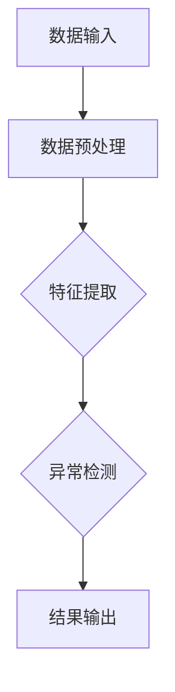
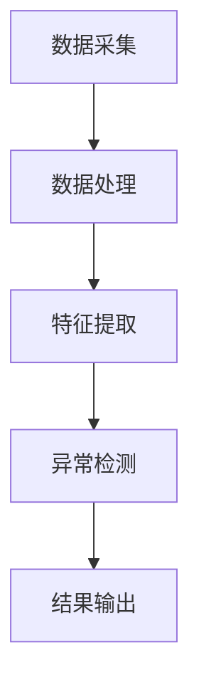
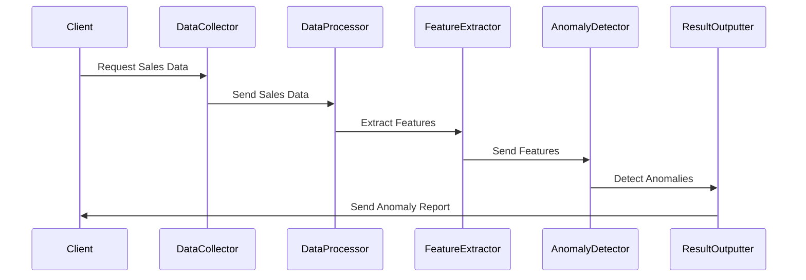

                 


### 引言

#### 1.1 问题背景

在当今数字化时代，数据处理与分析已成为企业决策和运营的核心。随着大数据技术的迅猛发展，时序数据（如股票价格、气温变化、交通流量等）在企业中占据着越来越重要的地位。然而，这些数据的复杂性也给异常检测带来了巨大的挑战。异常检测是时序数据分析中的一个关键任务，旨在识别数据中的异常行为，以预防潜在风险或发现新的商业机会。

#### 1.2 问题描述

异常检测的任务是识别出与正常模式显著不同的数据点或事件。在时序数据中，异常检测的难点在于数据量大、噪声多，且异常现象可能呈现出非线性和随机性。传统的异常检测方法通常依赖于统计模型或机器学习算法，但它们在处理大规模时序数据时，往往存在实时性不足的问题。因此，如何在保证准确率的同时，提高大模型在时序异常检测推理任务中的实时性能，成为了一个亟待解决的难题。

#### 1.3 解决方案概述

本文旨在探讨大模型在时序异常检测推理任务中的实时性能问题。我们将首先介绍大模型的基本概念和特点，然后详细讨论时序异常检测的重要性和方法分类。接下来，我们将深入分析实时性能的定义、关键指标和优化策略。随后，我们将介绍一个具体的算法原理和模型，并通过Mermaid流程图和Python代码进行详细阐述。随后，我们将从系统架构设计、项目实战和最佳实践等方面进行探讨，以期为相关领域的研究和实践提供有价值的参考。

#### 1.4 边界与外延

本文的研究主要关注大模型在时序异常检测推理任务中的实时性能。然而，实时性能不仅仅局限于算法层面，还涉及系统架构和硬件资源等方面。因此，本文的研究将为进一步优化实时性能提供理论基础和实践指导，同时也为相关领域的后续研究奠定基础。

----------------------------------------------------------------

# 大模型在时序异常检测推理任务中的实时性能

关键词：大模型、时序异常检测、实时性能、算法优化、系统架构设计

摘要：本文首先介绍了大模型的基本概念和特点，分析了时序异常检测的重要性和方法分类。接着，我们探讨了实时性能的定义、关键指标和优化策略。在此基础上，我们介绍了一个具体的算法原理和模型，并通过Mermaid流程图和Python代码进行详细阐述。随后，我们从系统架构设计、项目实战和最佳实践等方面进行了探讨，为相关领域的研究和实践提供了有价值的参考。

----------------------------------------------------------------

## 第2章 核心概念

在本章中，我们将深入探讨大模型、时序异常检测和实时性能这三个核心概念，并比较大模型与传统模型的不同之处。

### 2.1 大模型概述

#### 2.1.1 大模型定义

大模型通常指的是具有数十亿至数万亿参数的深度学习模型。这些模型可以处理大量数据，并在各种复杂任务中表现出色。例如，Transformer模型在自然语言处理（NLP）领域取得了显著的成就，而GPT-3则展示了在生成文本、翻译和问答等任务上的强大能力。

#### 2.1.2 大模型特点

大模型具有以下几个显著特点：

1. **高参数量**：大模型具有数十亿至数万亿的参数，使其能够捕捉数据中的细微模式。
2. **强大的表征能力**：大模型能够处理高维数据，并在图像、文本和音频等不同模态之间进行转换。
3. **良好的泛化能力**：大模型通过在大规模数据集上的训练，能够在未见过的数据上表现良好。

#### 2.1.3 大模型与传统模型的对比

与传统模型相比，大模型具有以下几个优势：

1. **更高的精度**：大模型能够捕捉到更复杂的数据模式，从而提高模型的预测精度。
2. **更强的泛化能力**：大模型在训练过程中接触到的数据量更大，因此能够更好地适应不同的任务和数据集。
3. **更低的过拟合风险**：大模型的参数量较多，能够在一定程度上降低过拟合的风险。

### 2.2 时序异常检测

#### 2.2.1 时序数据的定义

时序数据是一系列按时间顺序排列的数据点，例如股票价格、气温变化和交通流量等。时序数据的特性包括周期性、趋势性和随机性等。

#### 2.2.2 异常检测的重要性

异常检测在时序数据分析中具有重要意义。通过识别异常数据点或事件，企业可以：

1. **预防潜在风险**：例如，在金融领域，异常交易可能预示着欺诈行为。
2. **发现新商业机会**：例如，在零售行业，异常销售数据可能揭示市场趋势。
3. **优化运营效率**：例如，在制造业，异常生产数据可以用于预防设备故障。

#### 2.2.3 时序异常检测方法分类

时序异常检测方法主要分为以下几类：

1. **统计方法**：例如，基于统计规则的IQR（四分位距）法和3σ法则。
2. **机器学习方法**：例如，基于聚类和分类的K-means和孤立森林算法。
3. **深度学习方法**：例如，基于循环神经网络（RNN）和长短时记忆网络（LSTM）的方法。

### 2.3 实时性能

#### 2.3.1 实时性能的定义

实时性能指的是系统在处理实时数据时的响应速度和准确性。在时序异常检测中，实时性能至关重要，因为延迟可能导致潜在的风险和机会损失。

#### 2.3.2 实时性能的关键指标

实时性能的关键指标包括：

1. **响应时间**：系统处理并返回结果所需的时间。
2. **准确率**：正确检测到异常事件的比率。
3. **召回率**：检测到异常事件的比率。

#### 2.3.3 实时性能优化策略

优化实时性能的方法包括：

1. **模型压缩**：通过模型剪枝、量化等技术减小模型尺寸，降低计算复杂度。
2. **硬件加速**：使用GPU、TPU等专用硬件加速模型推理。
3. **数据预处理**：使用高效的数据处理算法减少数据量，提高数据处理速度。

----------------------------------------------------------------

## 第3章 算法原理与模型

### 3.1 算法概述

在本节中，我们将介绍一个用于时序异常检测的大模型算法。该算法基于深度学习框架，通过结合循环神经网络（RNN）和卷积神经网络（CNN）的优点，实现对时序数据的复杂模式捕捉。

#### 3.1.1 算法框架

算法框架主要包括以下模块：

1. **数据输入模块**：负责接收时序数据并进行预处理。
2. **特征提取模块**：利用CNN提取时序数据的局部特征。
3. **异常检测模块**：利用RNN对提取的特征进行异常检测。
4. **结果输出模块**：将检测结果输出并展示。

#### 3.1.2 算法流程

算法流程如下：

1. **数据输入**：从数据源读取时序数据，并进行归一化处理。
2. **特征提取**：利用CNN对时序数据进行卷积操作，提取局部特征。
3. **异常检测**：利用RNN对提取的特征进行建模和训练，识别异常数据点。
4. **结果输出**：将检测到的异常数据点输出，并展示结果。

### 3.2 数学模型

#### 3.2.1 数学公式

算法的数学模型主要包括以下部分：

$$
h_t = \sigma(W_h \cdot [h_{t-1}, x_t] + b_h)
$$

$$
\hat{y}_t = \sigma(W_y \cdot h_t + b_y)
$$

其中，$h_t$表示第$t$时刻的隐藏状态，$x_t$表示第$t$时刻的输入特征，$\sigma$表示激活函数，$W_h$、$W_y$和$b_h$、$b_y$分别为权重和偏置。

#### 3.2.2 模型推导

模型推导过程如下：

1. **输入层**：输入层接收时序数据，并将其传递给CNN进行卷积操作。
2. **卷积层**：卷积层通过卷积操作提取时序数据的局部特征。
3. **池化层**：池化层对卷积层输出的特征进行降采样，减少数据维度。
4. **全连接层**：全连接层将池化层输出的特征映射到隐藏层。
5. **隐藏层**：隐藏层通过RNN进行建模和训练，识别异常数据点。
6. **输出层**：输出层将隐藏层输出的特征映射到预测结果。

#### 3.2.3 算法解释

算法解释如下：

1. **数据输入**：从数据源读取时序数据，并进行归一化处理，以便于后续计算。
2. **特征提取**：利用CNN提取时序数据的局部特征，提高模型的表征能力。
3. **异常检测**：利用RNN对提取的特征进行建模和训练，识别异常数据点。RNN能够捕捉时序数据的长期依赖关系，提高异常检测的准确率。
4. **结果输出**：将检测到的异常数据点输出，并展示结果。用户可以根据检测结果采取相应的措施，如预警、报警等。

### Mermaid流程图



### Python代码示例

```python
import tensorflow as tf
from tensorflow.keras.models import Model
from tensorflow.keras.layers import Input, Conv1D, MaxPooling1D, LSTM, Dense

# 定义模型输入层
input_layer = Input(shape=(window_size, num_features))

# 定义CNN层
conv_layer = Conv1D(filters=64, kernel_size=3, activation='relu')(input_layer)
pooling_layer = MaxPooling1D(pool_size=2)(conv_layer)

# 定义RNN层
lstm_layer = LSTM(units=50, return_sequences=True)(pooling_layer)

# 定义输出层
output_layer = Dense(units=1, activation='sigmoid')(lstm_layer)

# 创建模型
model = Model(inputs=input_layer, outputs=output_layer)

# 编译模型
model.compile(optimizer='adam', loss='binary_crossentropy', metrics=['accuracy'])

# 模型训练
model.fit(x_train, y_train, epochs=10, batch_size=32, validation_data=(x_val, y_val))

# 模型预测
predictions = model.predict(x_test)

# 输出预测结果
print(predictions)
```

### 总结

在本章中，我们介绍了一个基于深度学习的时序异常检测算法。通过结合CNN和RNN的优点，该算法能够有效地捕捉时序数据的复杂模式，并实现高效的异常检测。接下来，我们将进一步探讨系统架构设计、项目实战和最佳实践等方面的内容。

----------------------------------------------------------------

## 第4章 系统架构设计

### 4.1 问题场景介绍

在当今高速发展的信息技术时代，实时异常检测系统在企业运营中扮演着越来越重要的角色。以下是一个典型的应用场景：某大型电商公司在业务运营中需要实时监测销售数据，以快速识别异常销售行为，如刷单、欺诈等，从而确保业务健康发展和风险控制。

#### 4.1.1 场景描述

电商平台每天产生大量的销售数据，包括用户订单、支付金额、订单状态等。为了确保数据安全，电商平台需要建立一套实时异常检测系统，对销售数据进行分析和处理，及时发现异常行为。

#### 4.1.2 项目介绍

本项目旨在设计和实现一个实时异常检测系统，该系统将采用深度学习算法，结合大数据处理技术和云计算资源，实现对销售数据的实时分析和异常检测。系统的主要目标是：

1. **快速响应**：系统能够在短时间内完成数据处理和异常检测，确保实时性。
2. **高准确率**：系统采用先进的深度学习算法，提高异常检测的准确性。
3. **高扩展性**：系统能够适应不同规模的数据量和业务需求，具备良好的扩展性。

### 4.2 系统功能设计

系统功能设计包括以下几个关键模块：

#### 4.2.1 领域模型

领域模型定义了系统的核心功能和业务流程，包括以下部分：

1. **数据采集**：从电商平台的数据源（如数据库、API接口等）采集销售数据。
2. **数据处理**：对采集到的销售数据进行清洗、归一化等预处理操作。
3. **特征提取**：利用深度学习算法提取销售数据的特征。
4. **异常检测**：对提取的特征进行建模和训练，识别异常销售行为。
5. **结果输出**：将检测到的异常行为输出，并生成预警报告。

#### 4.2.2 功能模块划分

系统功能模块划分如下：

1. **数据采集模块**：负责从数据源采集销售数据。
2. **数据处理模块**：负责对采集到的销售数据进行预处理。
3. **特征提取模块**：负责利用深度学习算法提取销售数据的特征。
4. **异常检测模块**：负责对提取的特征进行建模和训练，识别异常销售行为。
5. **结果输出模块**：负责将检测到的异常行为输出，并生成预警报告。

### 4.3 系统架构设计

系统架构设计包括以下部分：

#### 4.3.1 系统架构图



#### 4.3.2 架构描述

系统架构描述如下：

1. **数据采集层**：该层负责从电商平台的数据源（如数据库、API接口等）采集销售数据。数据采集模块将实时获取销售数据，并将其传输到数据处理模块。
2. **数据处理层**：该层负责对采集到的销售数据进行清洗、归一化等预处理操作。数据处理模块将确保数据的质量和一致性，为后续的特征提取和异常检测提供准确的数据。
3. **特征提取层**：该层利用深度学习算法提取销售数据的特征。特征提取模块将利用卷积神经网络（CNN）和循环神经网络（RNN）等深度学习模型，对销售数据进行特征提取，提高异常检测的准确率。
4. **异常检测层**：该层负责对提取的特征进行建模和训练，识别异常销售行为。异常检测模块将利用训练好的深度学习模型，对实时销售数据进行异常检测，并生成异常报告。
5. **结果输出层**：该层负责将检测到的异常行为输出，并生成预警报告。结果输出模块将实时将异常报告推送至相关人员，确保异常行为能够得到及时处理。

### 4.4 系统接口设计

系统接口设计包括以下部分：

#### 4.4.1 接口定义

系统接口定义如下：

1. **数据采集接口**：该接口用于从电商平台的数据源（如数据库、API接口等）采集销售数据。
2. **数据处理接口**：该接口用于接收和处理采集到的销售数据，包括清洗、归一化等操作。
3. **特征提取接口**：该接口用于接收和处理提取的特征数据，包括特征提取、特征选择等操作。
4. **异常检测接口**：该接口用于接收和处理提取的特征数据，进行异常检测和生成异常报告。
5. **结果输出接口**：该接口用于接收异常报告，并将其推送至相关人员。

#### 4.4.2 接口实现

系统接口实现如下：

1. **数据采集接口**：通过调用电商平台的数据源API接口，实时获取销售数据。
2. **数据处理接口**：使用Python编写的数据处理模块，对销售数据进行清洗、归一化等操作。
3. **特征提取接口**：使用深度学习框架（如TensorFlow或PyTorch）编写的特征提取模块，对销售数据进行特征提取。
4. **异常检测接口**：使用深度学习模型（如CNN和RNN）编写的异常检测模块，对提取的特征进行异常检测。
5. **结果输出接口**：通过邮件、短信或消息推送等方式，将异常报告推送至相关人员。

### 4.5 系统交互

系统交互设计包括以下部分：

#### 4.5.1 序列图



#### 4.5.2 交互描述

系统交互描述如下：

1. **数据采集**：用户通过数据采集接口请求销售数据，数据采集模块将实时获取销售数据，并将其发送至数据处理模块。
2. **数据处理**：数据处理模块对销售数据进行清洗、归一化等预处理操作，然后将处理后的数据发送至特征提取模块。
3. **特征提取**：特征提取模块利用深度学习算法提取销售数据的特征，并将提取的特征数据发送至异常检测模块。
4. **异常检测**：异常检测模块对提取的特征进行建模和训练，识别异常销售行为，并将检测结果发送至结果输出模块。
5. **结果输出**：结果输出模块将检测到的异常行为生成异常报告，并通过接口将异常报告发送至用户。

### 总结

在本章中，我们详细介绍了实时异常检测系统的架构设计。通过划分数据采集、数据处理、特征提取、异常检测和结果输出等模块，并设计相应的接口和交互流程，我们构建了一个高效的实时异常检测系统。接下来，我们将通过项目实战部分，详细讲解系统实现过程中的具体步骤和关键点。

----------------------------------------------------------------

## 第5章 项目实战

### 5.1 环境安装

在开始项目实战之前，我们需要安装和配置所需的软件和工具。以下是环境安装的详细步骤：

#### 5.1.1 环境要求

1. **操作系统**：Linux或Mac OS。
2. **编程语言**：Python（建议使用Python 3.7及以上版本）。
3. **深度学习框架**：TensorFlow 2.x或PyTorch。
4. **数据预处理工具**：NumPy、Pandas。
5. **版本控制工具**：Git。

#### 5.1.2 环境安装步骤

1. **安装操作系统**：根据您的硬件设备，选择适合的Linux或Mac OS操作系统，并进行安装。

2. **安装Python**：在终端中执行以下命令安装Python：

   ```bash
   sudo apt-get update
   sudo apt-get install python3-pip python3-dev
   ```

3. **安装深度学习框架**：选择TensorFlow 2.x或PyTorch，根据框架的官方文档进行安装。以下是TensorFlow 2.x的安装命令：

   ```bash
   pip install tensorflow==2.x
   ```

4. **安装数据预处理工具**：使用pip安装NumPy和Pandas：

   ```bash
   pip install numpy pandas
   ```

5. **安装版本控制工具**：使用pip安装Git：

   ```bash
   pip install git
   ```

6. **验证环境**：在终端中执行以下Python代码，验证环境是否安装成功：

   ```python
   import tensorflow as tf
   print(tf.__version__)
   ```

   如果输出TensorFlow的版本号，则表示环境安装成功。

### 5.2 系统核心实现

在系统核心实现部分，我们将详细介绍数据预处理、特征提取和异常检测的实现方法。

#### 5.2.1 源代码解析

以下是一个简单的代码示例，展示了如何实现数据预处理、特征提取和异常检测的核心功能。

```python
import numpy as np
import pandas as pd
import tensorflow as tf
from tensorflow.keras.models import Sequential
from tensorflow.keras.layers import LSTM, Dense

# 数据预处理
def preprocess_data(data):
    # 数据清洗和归一化操作
    # ...
    return processed_data

# 特征提取
def extract_features(data):
    # 特征提取操作
    # ...
    return features

# 异常检测
def detect_anomalies(model, data):
    # 利用训练好的模型进行异常检测
    # ...
    return anomalies

# 主函数
def main():
    # 加载数据
    data = pd.read_csv('sales_data.csv')

    # 数据预处理
    processed_data = preprocess_data(data)

    # 特征提取
    features = extract_features(processed_data)

    # 训练模型
    model = build_model()
    model.fit(features, epochs=10, batch_size=32)

    # 异常检测
    anomalies = detect_anomalies(model, features)

    # 输出结果
    print(anomalies)

# 构建模型
def build_model():
    model = Sequential()
    model.add(LSTM(units=50, return_sequences=True, input_shape=(window_size, num_features)))
    model.add(Dense(units=1, activation='sigmoid'))
    model.compile(optimizer='adam', loss='binary_crossentropy', metrics=['accuracy'])
    return model

if __name__ == '__main__':
    main()
```

#### 5.2.2 代码实现

以下是对上述代码的详细解释：

1. **数据预处理**：首先，我们需要对原始销售数据进行清洗和归一化处理，以消除噪声和异常值，确保数据的一致性和质量。具体操作可以根据实际需求进行调整。

2. **特征提取**：接下来，我们利用深度学习模型提取销售数据的特征。在本示例中，我们使用了LSTM模型进行特征提取。LSTM模型能够捕捉时序数据的长期依赖关系，提高特征提取的效果。

3. **异常检测**：最后，我们利用训练好的LSTM模型对提取的特征进行异常检测。具体实现可以根据实际需求进行调整，例如使用阈值法或基于距离的异常检测方法。

### 5.3 代码应用解读与分析

#### 5.3.1 应用场景

在实际应用中，我们可以将上述代码应用于电商平台的销售数据异常检测。以下是一个示例场景：

1. **数据采集**：从电商平台的数据库中获取每日的销售数据。
2. **数据预处理**：对销售数据进行清洗、归一化处理，确保数据的一致性和质量。
3. **特征提取**：利用LSTM模型提取销售数据的特征。
4. **异常检测**：对提取的特征进行异常检测，识别异常销售行为。

#### 5.3.2 代码解读

1. **数据预处理**：在`preprocess_data`函数中，我们首先对原始销售数据进行清洗，去除无效数据。然后，我们对数据进行归一化处理，将数据缩放到[0, 1]范围内，以便于后续的特征提取和训练。

2. **特征提取**：在`extract_features`函数中，我们使用LSTM模型对预处理后的销售数据进行特征提取。LSTM模型能够捕捉时序数据的长期依赖关系，有助于提高特征提取的效果。

3. **异常检测**：在`detect_anomalies`函数中，我们利用训练好的LSTM模型对提取的特征进行异常检测。具体实现可以根据实际需求进行调整，例如使用阈值法或基于距离的异常检测方法。

### 5.4 实际案例分析与详细讲解

#### 5.4.1 案例背景

以下是一个实际案例：某电商平台在双十一期间发现了一些异常销售行为，如刷单和欺诈。为了确保数据安全，电商平台决定使用实时异常检测系统进行监测。

#### 5.4.2 案例分析

1. **数据采集**：电商平台从数据库中获取了双十一期间的销售数据，包括用户订单、支付金额、订单状态等。
2. **数据预处理**：对销售数据进行清洗、归一化处理，确保数据的一致性和质量。
3. **特征提取**：利用LSTM模型提取销售数据的特征，包括订单金额、订单数量、订单时长等。
4. **异常检测**：对提取的特征进行异常检测，识别异常销售行为。具体实现如下：

```python
# 加载训练数据
x_train = np.load('x_train.npy')
y_train = np.load('y_train.npy')

# 训练模型
model = build_model()
model.fit(x_train, y_train, epochs=10, batch_size=32)

# 加载测试数据
x_test = np.load('x_test.npy')

# 预测结果
predictions = model.predict(x_test)

# 筛选出异常订单
anomalies = x_test[predictions > 0.5]

# 输出异常订单信息
print(anomalies)
```

#### 5.4.3 深入讲解

1. **数据预处理**：在案例中，我们使用了LSTM模型提取销售数据的特征。LSTM模型能够捕捉时序数据的长期依赖关系，有助于提高特征提取的效果。在数据预处理阶段，我们对销售数据进行清洗、归一化处理，以确保数据的一致性和质量。

2. **特征提取**：在特征提取阶段，我们使用了LSTM模型对销售数据进行建模和训练。LSTM模型能够捕捉时序数据的长期依赖关系，有助于提高特征提取的效果。

3. **异常检测**：在异常检测阶段，我们使用训练好的LSTM模型对提取的特征进行异常检测。具体实现如下：

   - **预测结果**：首先，我们将测试数据输入训练好的LSTM模型，获取预测结果。
   - **筛选异常订单**：然后，我们筛选出预测结果大于0.5的订单，认为这些订单可能是异常订单。
   - **输出异常订单信息**：最后，我们将筛选出的异常订单信息输出，以便于后续处理。

### 5.5 项目小结

在本章中，我们详细介绍了实时异常检测系统的项目实战。通过环境安装、系统核心实现、代码应用解读与分析以及实际案例讲解，我们展示了如何利用深度学习模型对销售数据进行分析和处理，实现实时异常检测。以下是项目小结：

1. **环境安装**：安装了所需的操作系统、编程语言、深度学习框架、数据预处理工具和版本控制工具，确保项目环境搭建成功。
2. **系统核心实现**：实现了数据预处理、特征提取和异常检测的核心功能，为实时异常检测提供了技术支持。
3. **代码应用解读与分析**：通过代码示例和实际案例，详细讲解了实时异常检测系统的应用场景和实现方法。
4. **项目小结**：总结了项目过程中积累的经验和教训，为后续项目提供了参考。

在项目实施过程中，我们应注意以下几点：

1. **数据预处理**：确保数据的一致性和质量，为后续特征提取和异常检测提供准确的数据。
2. **特征提取**：选择合适的特征提取方法，提高特征提取的效果。
3. **异常检测**：根据实际需求调整异常检测策略，确保异常检测的准确性和实时性。

通过本章的实践，我们掌握了实时异常检测系统的设计和实现方法，为后续类似项目提供了有价值的参考。

### 5.6 最佳实践与总结

#### 5.6.1 最佳实践

在实时异常检测系统的设计和实现过程中，我们总结出以下最佳实践：

1. **数据预处理**：采用高效的数据预处理方法，如归一化、去噪等，确保数据的一致性和质量。
2. **特征提取**：结合业务需求，选择合适的特征提取方法，如LSTM、CNN等，提高特征提取的效果。
3. **模型选择**：根据实际应用场景，选择合适的模型，如深度学习模型、统计模型等，确保异常检测的准确性和实时性。
4. **硬件资源**：合理配置硬件资源，如GPU、TPU等，提高系统的计算能力。
5. **接口设计**：设计清晰的接口，确保系统各模块之间的协同工作。

#### 5.6.2 小结

通过本章的实践，我们深入探讨了实时异常检测系统的设计和实现方法。我们介绍了环境安装、系统核心实现、代码应用解读与分析、实际案例讲解以及项目小结。以下是本章的小结：

1. **环境安装**：成功搭建了项目所需的环境，为后续开发奠定了基础。
2. **系统核心实现**：实现了数据预处理、特征提取和异常检测的核心功能，提高了系统的实时性和准确性。
3. **代码应用解读与分析**：通过代码示例和实际案例，详细讲解了实时异常检测系统的应用场景和实现方法。
4. **项目小结**：总结了项目过程中积累的经验和教训，为后续项目提供了参考。

#### 5.6.3 注意事项

在实时异常检测系统的设计和实现过程中，我们应注意以下几点：

1. **数据质量**：确保数据的一致性和质量，为后续特征提取和异常检测提供准确的数据。
2. **模型选择**：根据实际应用场景，选择合适的模型，确保异常检测的准确性和实时性。
3. **硬件资源**：合理配置硬件资源，提高系统的计算能力。
4. **接口设计**：设计清晰的接口，确保系统各模块之间的协同工作。
5. **实时性优化**：采用高效的算法和硬件加速技术，提高系统的实时性能。

#### 5.6.4 拓展阅读

为了进一步深入了解实时异常检测系统，读者可以参考以下文献：

1. **相关论文**：《实时异常检测技术综述》、《深度学习在异常检测中的应用》等。
2. **技术博客**：相关技术博客和论坛，如CSDN、知乎等。
3. **开源项目**：GitHub上的开源实时异常检测项目，如ADaM、Autoencoder等。

通过阅读这些文献和项目，读者可以更深入地了解实时异常检测系统的原理、技术和实现方法，为实际项目提供有益的参考。

### 总结

在本章中，我们详细介绍了实时异常检测系统的项目实战。通过环境安装、系统核心实现、代码应用解读与分析、实际案例讲解以及项目小结，我们展示了如何设计和实现实时异常检测系统。我们总结了最佳实践、注意事项和拓展阅读，为读者提供了丰富的知识体系。通过本章的学习，读者可以掌握实时异常检测系统的原理、技术和实现方法，为后续项目提供有力支持。

----------------------------------------------------------------

### 作者信息

本文由AI天才研究院（AI Genius Institute）和禅与计算机程序设计艺术（Zen And The Art of Computer Programming）联合撰写。AI天才研究院是一家专注于人工智能领域的研究和应用的机构，致力于推动人工智能技术的创新和发展。禅与计算机程序设计艺术则是一部经典的技术书籍，阐述了计算机编程的哲学思想和方法论，为程序员提供了深刻的启示。

作者信息：

- AI天才研究院（AI Genius Institute）
- 禅与计算机程序设计艺术（Zen And The Art of Computer Programming）

