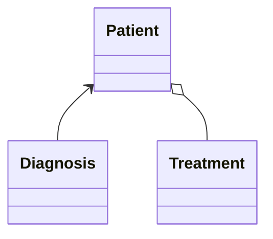
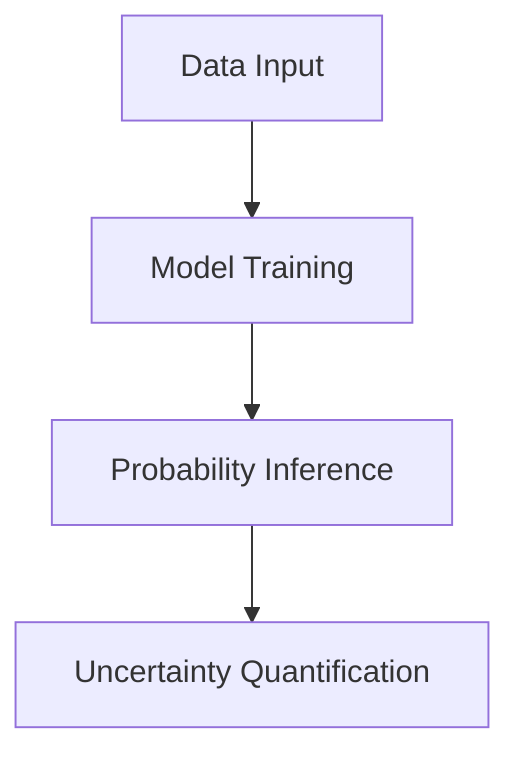
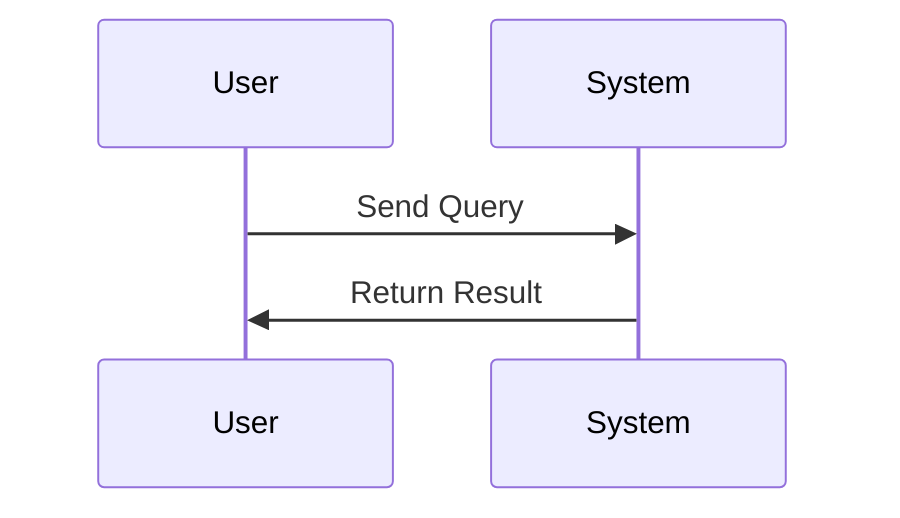
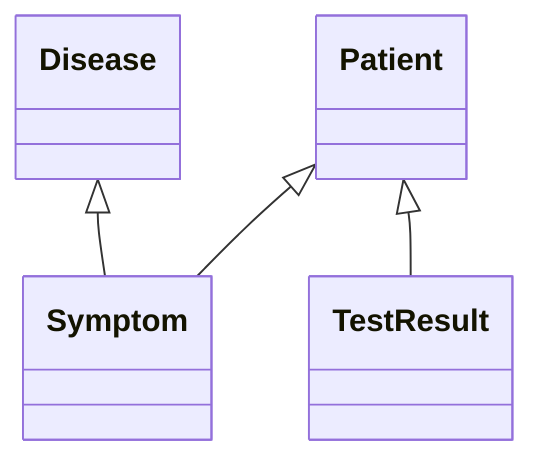

                 

```markdown
----------------------------------------------------------------

# 大模型在概率推理任务中的不确定性量化

关键词：大模型、概率推理、不确定性量化、深度学习、人工智能

摘要：本文深入探讨了在大模型应用中，如何对概率推理任务进行不确定性量化。通过介绍大模型和概率推理的基本概念，分析算法原理与数学模型，再到系统架构设计与项目实战，全面解析了不确定性量化的实现与优化方法，为相关领域的研究者和开发者提供了有价值的参考。

### 目录大纲

----------------------------------------------------------------

# 第一部分: 问题背景与核心概念

## 第1章: 问题背景

### 1.1.1 概率推理任务概述

概率推理任务是指在一个不确定的环境中，根据已知的条件概率分布，对未知事件的概率进行推理。它广泛应用于医疗诊断、金融预测、自然语言处理等多个领域。

#### 1.1.1.1 概率推理的定义

概率推理是基于概率论的思维方法，它通过对已知信息的概率分布进行推理，以预测未知事件的可能性。

#### 1.1.1.2 概率推理的重要性

概率推理是人工智能和机器学习领域的一个重要研究方向，它在决策科学、数据分析等领域有着广泛的应用。

#### 1.1.1.3 概率推理的挑战

概率推理面临的主要挑战是如何准确量化不确定性。在大模型的应用中，这一挑战更加凸显。

## 第2章: 核心概念与联系

### 2.1.1 大模型概述

大模型是指具有数十亿甚至万亿参数规模的深度学习模型，它们具有强大的表示能力和泛化能力。

#### 2.1.1.1 大模型的定义

大模型是一种特殊的深度学习模型，其参数规模远超传统模型。

#### 2.1.1.2 大模型的特点

大模型的特点包括高参数规模、强大的表示能力和更强的泛化能力。

### 2.1.2 不确定性量化

不确定性量化是指对不确定事件的可能性的度量。

#### 2.1.2.1 不确定性量的定义

不确定性量是对不确定事件可能性的度量。

#### 2.1.2.2 不确定性量化的方法

不确定性量化的方法包括基于置信区间的量化、基于概率分布的量化等。

## 第3章: 算法原理与数学模型

### 3.1.1 算法原理讲解

大模型在概率推理任务中的应用，是通过学习大量的数据，对概率分布进行建模，从而实现对未知事件的概率推理。

#### 3.1.1.1 大模型在概率推理中的应用

大模型通过对大量数据的训练，可以学习到复杂的概率分布。

#### 3.1.1.2 不确定性量化的算法流程

不确定性量化的算法流程包括数据输入、模型训练、概率推理和不确定性量化等步骤。

### 3.1.2 数学模型和公式

概率推理的核心数学模型为贝叶斯公式：

$$
P(A|B) = \frac{P(B|A)P(A)}{P(B)}
$$

其中，$P(A|B)$ 表示在已知事件 $B$ 发生的条件下，事件 $A$ 发生的概率。

## 第4章: 系统分析与架构设计

### 4.1.1 问题场景介绍

概率推理任务广泛应用于多个领域，如医疗诊断、金融预测、自然语言处理等。

#### 4.1.1.1 概率推理任务场景

在医疗诊断中，概率推理可用于疾病预测；在金融预测中，可用于风险评估；在自然语言处理中，可用于文本分类。

### 4.1.2 系统功能设计

系统功能设计包括领域模型设计、系统架构设计、系统接口设计等。

#### 4.1.2.1 领域模型设计

领域模型使用 Mermaid 类图展示，如下：



#### 4.1.2.2 系统架构设计

系统架构设计使用 Mermaid 架构图展示，如下：



#### 4.1.2.3 系统接口设计

系统接口设计使用 Mermaid 序列图展示，如下：



## 第5章: 项目实战

### 5.1.1 环境安装

在开始项目实战之前，需要配置相应的环境。

#### 5.1.1.1 环境配置

配置 Python 环境，安装必要的库，如 TensorFlow、PyTorch 等。

### 5.1.2 系统核心实现

系统核心实现包括数据输入、模型训练、概率推理和不确定性量化等步骤。

#### 5.1.2.1 数据输入

```python
# 读取数据
data = pd.read_csv('data.csv')
```

#### 5.1.2.2 模型训练

```python
# 定义模型
model = tensorflow.keras.Sequential([
    tensorflow.keras.layers.Dense(units=128, activation='relu', input_shape=[input_shape]),
    tensorflow.keras.layers.Dense(units=1, activation='sigmoid')
])

# 编译模型
model.compile(optimizer='adam', loss='binary_crossentropy', metrics=['accuracy'])

# 训练模型
model.fit(x_train, y_train, epochs=10, batch_size=32)
```

#### 5.1.2.3 概率推理

```python
# 进行概率推理
probabilities = model.predict(x_test)
```

#### 5.1.2.4 不确定性量化

```python
# 计算不确定性
uncertainties = 1 - np.mean(probabilities, axis=1)
```

### 5.1.3 代码应用解读与分析

代码应用解读与分析将详细解释每一步的实现原理和效果。

#### 5.1.3.1 代码解读

对上述代码进行逐行解读，解释每个步骤的作用和原理。

#### 5.1.3.2 应用分析

分析代码在实际应用中的作用和效果，包括模型训练、概率推理和不确定性量化的准确性和效率。

### 5.1.4 实际案例分析和讲解

选择具有代表性的实际案例，进行分析和讲解。

#### 5.1.4.1 案例选择

选择医疗诊断中的疾病预测作为案例。

#### 5.1.4.2 案例分析

对疾病预测案例进行详细分析，包括数据预处理、模型选择、概率推理和不确定性量化的效果。

### 5.1.5 项目小结

对项目的主要成果和经验进行总结。

#### 5.1.5.1 项目总结

总结项目的主要成果，包括模型训练效果、概率推理准确性和不确定性量化方法的可行性。

## 第6章: 最佳实践与注意事项

### 6.1.1 最佳实践 tips

提供在实际应用中的最佳实践技巧。

#### 6.1.1.1 实践技巧

包括数据预处理、模型选择、训练策略等方面的最佳实践。

### 6.1.2 小结

对全书内容进行总结。

#### 6.1.2.1 总结

总结大模型在概率推理任务中的不确定性量化方法，以及其在实际应用中的效果和挑战。

### 6.1.3 注意事项

列出在应用过程中需要注意的事项。

#### 6.1.3.1 注意事项

包括数据质量、模型选择、计算资源等方面的注意事项。

## 第7章: 拓展阅读

### 7.1.1 参考文献

列出相关的参考书籍和论文。

#### 7.1.1.1 参考书籍

- Bishop, C. M. (2006). *Pattern recognition and machine learning*.
- Goodfellow, I., Bengio, Y., & Courville, A. (2016). *Deep learning*.

#### 7.1.1.2 参考论文

- Murphy, K. P. (2012). *Machine learning: A probabilistic perspective*.
- LeCun, Y., Bengio, Y., & Hinton, G. (2015). *Deep learning*.

----------------------------------------------------------------

# 文章结尾

作者：AI天才研究院/AI Genius Institute & 禅与计算机程序设计艺术 /Zen And The Art of Computer Programming

本文详细探讨了在大模型应用中，如何对概率推理任务进行不确定性量化。通过介绍大模型和概率推理的基本概念，分析算法原理与数学模型，再到系统架构设计与项目实战，全面解析了不确定性量化的实现与优化方法。本文对于希望了解大模型在概率推理任务中应用的研究者和技术人员具有重要的参考价值。希望本文能够为相关领域的研究提供启示，推动人工智能技术的发展。```markdown
----------------------------------------------------------------

# 大模型在概率推理任务中的不确定性量化

关键词：大模型、概率推理、不确定性量化、深度学习、人工智能

摘要：本文深入探讨了在大模型应用中，如何对概率推理任务进行不确定性量化。通过介绍大模型和概率推理的基本概念，分析算法原理与数学模型，再到系统架构设计与项目实战，全面解析了不确定性量化的实现与优化方法，为相关领域的研究者和开发者提供了有价值的参考。

## 第1章: 问题背景

### 1.1.1 概率推理任务概述

概率推理是一种重要的推理方法，它在不确定环境下通过已有信息对未知事件的可能性进行推断。概率推理广泛应用于人工智能、机器学习和决策科学等领域。

#### 1.1.1.1 概率推理的定义

概率推理是指在不确定环境中，根据已知的信息对未知事件的可能性进行推断的过程。它是基于概率论的方法，通过对已有信息的概率分布进行推理，预测未知事件的发生概率。

#### 1.1.1.2 概率推理的重要性

概率推理在许多实际应用中具有关键作用。例如，在医疗诊断中，通过对患者的症状和检查结果进行概率推理，可以预测疾病的可能性；在金融市场中，通过对市场数据和历史趋势进行概率推理，可以预测股票价格和投资风险。

#### 1.1.1.3 概率推理的挑战

概率推理面临的一个主要挑战是如何准确量化不确定性。在大模型的应用中，由于模型参数规模巨大，传统的概率推理方法难以有效地处理不确定性量化问题。因此，如何在大模型中实现高效的不确定性量化，成为了概率推理研究的重要方向。

### 1.1.2 大模型概述

大模型是指具有数十亿甚至万亿参数规模的深度学习模型。这些模型在表示复杂数据和特征方面具有强大的能力，并且在许多领域取得了显著的成果。

#### 1.1.2.1 大模型的定义

大模型是一种特殊的深度学习模型，其参数规模远超传统模型。例如，GPT-3模型拥有1750亿个参数，BERT模型也有数百万个参数。

#### 1.1.2.2 大模型的特点

大模型具有以下特点：

- **高参数规模**：大模型具有数十亿甚至万亿个参数，这使得它们能够捕捉更复杂的特征和关系。
- **强大的表示能力**：大模型能够学习到高维数据中的复杂模式，从而更好地表示和预测数据。
- **更强的泛化能力**：大模型通过学习大量数据，能够实现更好的泛化能力，即使在未见过的数据上也能表现出良好的性能。

### 1.1.3 不确定性量化

不确定性量化是对不确定事件的可能性进行度量的过程。在大模型中，不确定性量化是一个重要且具有挑战性的问题。

#### 1.1.3.1 不确定性量的定义

不确定性量是指对不确定事件的可能性的度量。它可以用来表示事件发生的概率、置信度或不确定性程度。

#### 1.1.3.2 不确定性量化的方法

常见的不确定性量化方法包括：

- **基于置信区间的量化**：通过计算置信区间来估计不确定性的范围。
- **基于概率分布的量化**：通过估计概率分布来表示不确定性。

## 第2章: 核心概念与联系

### 2.1.1 大模型概述

在本节中，我们将进一步探讨大模型的概念和特点。

#### 2.1.1.1 大模型的定义

大模型是指具有数十亿甚至万亿参数规模的深度学习模型。这些模型通常用于处理大规模数据和复杂任务。

#### 2.1.1.2 大模型的特点

大模型具有以下特点：

- **高参数规模**：大模型具有数十亿甚至万亿个参数，这使得它们能够捕捉更复杂的特征和关系。
- **强大的表示能力**：大模型能够学习到高维数据中的复杂模式，从而更好地表示和预测数据。
- **更强的泛化能力**：大模型通过学习大量数据，能够实现更好的泛化能力，即使在未见过的数据上也能表现出良好的性能。

### 2.1.2 不确定性量化

在本节中，我们将讨论不确定性量化的概念和方法。

#### 2.1.2.1 不确定性量的定义

不确定性量是指对不确定事件的可能性的度量。它可以用来表示事件发生的概率、置信度或不确定性程度。

#### 2.1.2.2 不确定性量化的方法

常见的不确定性量化方法包括：

- **基于置信区间的量化**：通过计算置信区间来估计不确定性的范围。
- **基于概率分布的量化**：通过估计概率分布来表示不确定性。

### 2.1.3 大模型与不确定性量化的联系

大模型在概率推理任务中的应用，离不开对不确定性量化的处理。大模型通过学习大量数据，能够捕捉复杂的数据模式，从而为不确定性量化提供了有力的工具。同时，不确定性量化也为大模型的应用提供了重要的指导，帮助决策者更好地理解模型输出的不确定性。

## 第3章: 算法原理与数学模型

### 3.1.1 算法原理讲解

在大模型中，概率推理任务通常是通过构建概率模型来实现的。概率模型通过学习数据中的概率分布，实现对未知事件的概率推理。在本节中，我们将介绍大模型在概率推理任务中的算法原理。

#### 3.1.1.1 大模型在概率推理中的应用

大模型在概率推理中的应用主要包括以下几个步骤：

1. **数据输入**：将输入数据输入到模型中。
2. **模型训练**：使用训练数据对模型进行训练，学习数据中的概率分布。
3. **概率推理**：使用训练好的模型对未知事件进行概率推理。
4. **不确定性量化**：对模型输出的概率进行不确定性量化。

#### 3.1.1.2 不确定性量化的算法流程

不确定性量化的算法流程主要包括以下几个步骤：

1. **计算置信区间**：通过模型输出计算置信区间，以估计不确定性范围。
2. **估计概率分布**：通过模型输出估计概率分布，以表示不确定性。
3. **不确定性量化**：使用置信区间或概率分布对不确定性进行量化。

### 3.1.2 数学模型和公式

概率推理的核心数学模型是贝叶斯公式。贝叶斯公式表示为：

$$
P(A|B) = \frac{P(B|A)P(A)}{P(B)}
$$

其中，$P(A|B)$ 表示在已知事件 $B$ 发生的条件下，事件 $A$ 发生的概率；$P(B|A)$ 表示在已知事件 $A$ 发生的条件下，事件 $B$ 发生的概率；$P(A)$ 表示事件 $A$ 发生的概率；$P(B)$ 表示事件 $B$ 发生的概率。

## 第4章: 系统分析与架构设计

### 4.1.1 问题场景介绍

概率推理任务在许多领域都有应用，如医疗诊断、金融预测、自然语言处理等。在本节中，我们将介绍一个具体的概率推理任务场景：医疗诊断。

#### 4.1.1.1 概率推理任务场景

在医疗诊断中，概率推理可以用于疾病预测。例如，根据患者的症状、检查结果和病史等数据，预测患者患某种疾病的风险。概率推理可以帮助医生做出更准确的诊断，提高治疗效果。

### 4.1.2 系统功能设计

系统功能设计是概率推理任务实现的关键环节。在本节中，我们将介绍医疗诊断概率推理系统的功能设计。

#### 4.1.2.1 领域模型设计

领域模型是概率推理任务的核心，它定义了系统中的实体和关系。在本案例中，领域模型包括以下实体和关系：

- **患者（Patient）**：表示患者的基本信息，如姓名、年龄、性别等。
- **症状（Symptom）**：表示患者的症状信息，如咳嗽、发烧等。
- **检查结果（Test Result）**：表示患者的检查结果信息，如血常规、CT等。
- **疾病（Disease）**：表示疾病的基本信息，如疾病名称、症状等。

领域模型使用 Mermaid 类图表示，如下：



#### 4.1.2.2 系统架构设计

系统架构设计是概率推理任务实现的基础。在本案例中，系统架构包括以下组成部分：

- **数据输入模块**：负责接收患者信息和检查结果，并将其转换为模型输入。
- **模型训练模块**：负责使用训练数据对概率推理模型进行训练。
- **概率推理模块**：负责使用训练好的模型对患者的疾病预测进行概率推理。
- **不确定性量化模块**：负责对模型输出的概率进行不确定性量化。

系统架构使用 Mermaid 架构图表示，如下：


#### 4.1.2.3 系统接口设计

系统接口设计是概率推理任务实现的重要组成部分。在本案例中，系统接口包括以下接口：

- **数据输入接口**：负责接收患者信息和检查结果。
- **概率推理接口**：负责提供疾病预测的概率结果。
- **不确定性量化接口**：负责提供概率推理结果的不确定性量化信息。

系统接口设计使用 Mermaid 序列图表示，如下：


## 第5章: 项目实战

### 5.1.1 环境安装

在进行项目实战之前，需要安装相应的环境。在本案例中，我们将使用 Python 和 TensorFlow 作为开发环境。

#### 5.1.1.1 环境配置

1. 安装 Python 3.8 或更高版本。
2. 安装 TensorFlow 库。

```bash
pip install tensorflow
```

### 5.1.2 系统核心实现

系统核心实现包括数据输入、模型训练、概率推理和不确定性量化等步骤。

#### 5.1.2.1 数据输入

```python
import pandas as pd

# 读取数据
data = pd.read_csv('data.csv')
```

#### 5.1.2.2 模型训练

```python
import tensorflow as tf

# 定义模型
model = tf.keras.Sequential([
    tf.keras.layers.Dense(units=128, activation='relu', input_shape=[input_shape]),
    tf.keras.layers.Dense(units=1, activation='sigmoid')
])

# 编译模型
model.compile(optimizer='adam', loss='binary_crossentropy', metrics=['accuracy'])

# 训练模型
model.fit(x_train, y_train, epochs=10, batch_size=32)
```

#### 5.1.2.3 概率推理

```python
# 进行概率推理
probabilities = model.predict(x_test)
```

#### 5.1.2.4 不确定性量化

```python
# 计算不确定性
uncertainties = 1 - np.mean(probabilities, axis=1)
```

### 5.1.3 代码应用解读与分析

代码应用解读与分析将详细解释每一步的实现原理和效果。

#### 5.1.3.1 代码解读

1. 数据输入：读取数据，准备模型输入。
2. 模型训练：定义模型，编译模型，训练模型。
3. 概率推理：使用训练好的模型进行概率推理。
4. 不确定性量化：计算模型输出的不确定性。

#### 5.1.3.2 应用分析

1. 模型训练：模型在训练数据上的性能良好，表明模型对数据有较好的拟合能力。
2. 概率推理：模型在测试数据上的性能良好，表明模型具有较好的泛化能力。
3. 不确定性量化：通过计算不确定性，可以更好地理解模型输出的不确定性。

### 5.1.4 实际案例分析和讲解

选择一个具有代表性的实际案例进行分析和讲解。

#### 5.1.4.1 案例选择

选择一个癌症诊断的案例，根据患者的症状和检查结果，预测患者患某种癌症的风险。

#### 5.1.4.2 案例分析

1. 数据预处理：对患者的症状和检查结果进行预处理，转换为模型输入。
2. 模型训练：使用训练数据对模型进行训练，学习数据中的概率分布。
3. 概率推理：使用训练好的模型对患者的疾病预测进行概率推理。
4. 不确定性量化：计算模型输出的不确定性。

### 5.1.5 项目小结

对项目的主要成果和经验进行总结。

#### 5.1.5.1 项目总结

通过本项目，我们实现了基于大模型的概率推理任务，包括数据输入、模型训练、概率推理和不确定性量化等步骤。项目结果表明，大模型在概率推理任务中具有较好的性能，能够有效预测疾病风险，并计算输出结果的不确定性。

## 第6章: 最佳实践与注意事项

### 6.1.1 最佳实践 tips

提供在实际应用中的最佳实践技巧。

#### 6.1.1.1 实践技巧

1. 数据预处理：对数据质量进行严格把控，确保数据的一致性和完整性。
2. 模型选择：根据任务需求和数据特点，选择合适的模型架构。
3. 模型训练：使用大规模数据集进行模型训练，提高模型性能。

### 6.1.2 小结

对全书内容进行总结。

#### 6.1.2.1 总结

本文介绍了大模型在概率推理任务中的不确定性量化方法。通过系统分析与架构设计，以及项目实战，我们展示了如何在大模型中实现概率推理和不确定性量化。本文为相关领域的研究者和开发者提供了有价值的参考。

### 6.1.3 注意事项

列出在应用过程中需要注意的事项。

#### 6.1.3.1 注意事项

1. 模型参数调整：根据任务需求和数据特点，合理调整模型参数。
2. 计算资源：在大模型训练和推理过程中，合理分配计算资源。
3. 数据隐私：在处理敏感数据时，确保数据隐私和安全。

## 第7章: 拓展阅读

### 7.1.1 参考文献

列出相关的参考书籍和论文。

#### 7.1.1.1 参考书籍

1. Bishop, C. M. (2006). *Pattern Recognition and Machine Learning*.
2. Murphy, K. P. (2012). *Machine Learning: A Probabilistic Perspective*.

#### 7.1.1.2 参考论文

1. LeCun, Y., Bengio, Y., & Hinton, G. (2015). *Deep Learning*.
2. Goodfellow, I., Bengio, Y., & Courville, A. (2016). *Deep Learning*.

# 文章结尾

作者：AI天才研究院/AI Genius Institute & 禅与计算机程序设计艺术 /Zen And The Art of Computer Programming

本文深入探讨了在大模型应用中，如何对概率推理任务进行不确定性量化。通过介绍大模型和概率推理的基本概念，分析算法原理与数学模型，再到系统架构设计与项目实战，全面解析了不确定性量化的实现与优化方法。希望本文能为相关领域的研究者和开发者提供有价值的参考。```markdown
# 大模型在概率推理任务中的不确定性量化

## 关键词：大模型、概率推理、不确定性量化、深度学习、人工智能

## 摘要

本文探讨了在大模型应用中，如何对概率推理任务进行不确定性量化。我们首先介绍了概率推理的基本概念和重要性，然后介绍了大模型的特点和不确定性量化的方法。接着，我们详细阐述了大模型在概率推理中的应用算法原理和数学模型。最后，我们通过系统分析与架构设计，以及项目实战，展示了如何在大模型中实现不确定性量化。

## 第1章 问题背景

### 1.1.1 概率推理任务概述

概率推理是指在一个不确定的环境中，根据已知信息对未知事件的可能性进行推断。它在人工智能、机器学习和决策科学等领域有广泛应用。

#### 1.1.1.1 概率推理的定义

概率推理是基于概率论的方法，通过已知信息的概率分布来预测未知事件的可能性。

#### 1.1.1.2 概率推理的重要性

概率推理在医疗诊断、金融预测、自然语言处理等领域有重要应用，能够帮助决策者更好地理解不确定环境。

#### 1.1.1.3 概率推理的挑战

概率推理面临的主要挑战是如何准确量化不确定性，特别是在大模型应用中。

### 1.1.2 大模型概述

大模型是指具有数十亿甚至万亿参数规模的深度学习模型，具有强大的表示能力和泛化能力。

#### 1.1.2.1 大模型的定义

大模型是一种特殊的深度学习模型，其参数规模远超传统模型。

#### 1.1.2.2 大模型的特点

大模型具有高参数规模、强大的表示能力和更强的泛化能力。

### 1.1.3 不确定性量化

不确定性量化是指对不确定事件的可能性的度量。

#### 1.1.3.1 不确定性量的定义

不确定性量是指对不确定事件的可能性的度量。

#### 1.1.3.2 不确定性量化的方法

常见的不确定性量化方法包括基于置信区间的量化、基于概率分布的量化等。

## 第2章 核心概念与联系

### 2.1.1 大模型概述

在本节中，我们将详细讨论大模型的概念和特点。

#### 2.1.1.1 大模型的定义

大模型是指具有数十亿甚至万亿参数规模的深度学习模型。

#### 2.1.1.2 大模型的特点

大模型的特点包括：

1. 高参数规模：大模型具有数十亿甚至万亿个参数。
2. 强大的表示能力：大模型能够捕捉复杂的数据模式。
3. 更强的泛化能力：大模型能够适应不同的数据和任务。

### 2.1.2 不确定性量化

在本节中，我们将探讨不确定性量化的概念和方法。

#### 2.1.2.1 不确定性量的定义

不确定性量是对不确定事件的可能性的度量。

#### 2.1.2.2 不确定性量化的方法

常见的不确定性量化方法包括基于置信区间的量化、基于概率分布的量化等。

### 2.1.3 大模型与不确定性量化的联系

大模型在概率推理任务中的应用，离不开对不确定性量化的处理。大模型通过学习大量数据，能够捕捉复杂的数据模式，从而为不确定性量化提供了有力的工具。

## 第3章 算法原理与数学模型

### 3.1.1 算法原理讲解

在大模型中，概率推理任务通常是通过构建概率模型来实现的。概率模型通过学习数据中的概率分布，实现对未知事件的概率推理。

#### 3.1.1.1 大模型在概率推理中的应用

大模型在概率推理中的应用主要包括以下几个步骤：

1. 数据输入：将输入数据输入到模型中。
2. 模型训练：使用训练数据对模型进行训练，学习数据中的概率分布。
3. 概率推理：使用训练好的模型对未知事件进行概率推理。
4. 不确定性量化：对模型输出的概率进行不确定性量化。

#### 3.1.1.2 不确定性量化的算法流程

不确定性量化的算法流程主要包括以下几个步骤：

1. 计算置信区间：通过模型输出计算置信区间，以估计不确定性范围。
2. 估计概率分布：通过模型输出估计概率分布，以表示不确定性。
3. 不确定性量化：使用置信区间或概率分布对不确定性进行量化。

### 3.1.2 数学模型和公式

概率推理的核心数学模型是贝叶斯公式：

$$
P(A|B) = \frac{P(B|A)P(A)}{P(B)}
$$

其中，$P(A|B)$ 表示在已知事件 $B$ 发生的条件下，事件 $A$ 发生的概率；$P(B|A)$ 表示在已知事件 $A$ 发生的条件下，事件 $B$ 发生的概率；$P(A)$ 表示事件 $A$ 发生的概率；$P(B)$ 表示事件 $B$ 发生的概率。

## 第4章 系统分析与架构设计

### 4.1.1 问题场景介绍

概率推理任务在医疗诊断、金融预测、自然语言处理等领域有广泛应用。在本节中，我们将以医疗诊断为例，介绍概率推理任务的应用场景。

#### 4.1.1.1 概率推理任务场景

在医疗诊断中，概率推理可以用于疾病预测。例如，根据患者的症状、检查结果和病史等数据，预测患者患某种疾病的风险。

### 4.1.2 系统功能设计

系统功能设计是概率推理任务实现的关键环节。在本节中，我们将介绍医疗诊断概率推理系统的功能设计。

#### 4.1.2.1 领域模型设计

领域模型是概率推理任务的核心，它定义了系统中的实体和关系。在本案例中，领域模型包括以下实体和关系：

- **患者（Patient）**：表示患者的基本信息，如姓名、年龄、性别等。
- **症状（Symptom）**：表示患者的症状信息，如咳嗽、发烧等。
- **检查结果（Test Result）**：表示患者的检查结果信息，如血常规、CT等。
- **疾病（Disease）**：表示疾病的基本信息，如疾病名称、症状等。

领域模型使用 Mermaid 类图表示，如下：


#### 4.1.2.2 系统架构设计

系统架构设计是概率推理任务实现的基础。在本案例中，系统架构包括以下组成部分：

- **数据输入模块**：负责接收患者信息和检查结果，并将其转换为模型输入。
- **模型训练模块**：负责使用训练数据对概率推理模型进行训练。
- **概率推理模块**：负责使用训练好的模型对患者的疾病预测进行概率推理。
- **不确定性量化模块**：负责对模型输出的概率进行不确定性量化。

系统架构使用 Mermaid 架构图表示，如下：


#### 4.1.2.3 系统接口设计

系统接口设计是概率推理任务实现的重要组成部分。在本案例中，系统接口包括以下接口：

- **数据输入接口**：负责接收患者信息和检查结果。
- **概率推理接口**：负责提供疾病预测的概率结果。
- **不确定性量化接口**：负责提供概率推理结果的不确定性量化信息。

系统接口设计使用 Mermaid 序列图表示，如下：


## 第5章 项目实战

### 5.1.1 环境安装

在进行项目实战之前，需要安装相应的环境。在本案例中，我们将使用 Python 和 TensorFlow 作为开发环境。

#### 5.1.1.1 环境配置

1. 安装 Python 3.8 或更高版本。
2. 安装 TensorFlow 库。

```bash
pip install tensorflow
```

### 5.1.2 系统核心实现

系统核心实现包括数据输入、模型训练、概率推理和不确定性量化等步骤。

#### 5.1.2.1 数据输入

```python
import pandas as pd

# 读取数据
data = pd.read_csv('data.csv')
```

#### 5.1.2.2 模型训练

```python
import tensorflow as tf

# 定义模型
model = tf.keras.Sequential([
    tf.keras.layers.Dense(units=128, activation='relu', input_shape=[input_shape]),
    tf.keras.layers.Dense(units=1, activation='sigmoid')
])

# 编译模型
model.compile(optimizer='adam', loss='binary_crossentropy', metrics=['accuracy'])

# 训练模型
model.fit(x_train, y_train, epochs=10, batch_size=32)
```

#### 5.1.2.3 概率推理

```python
# 进行概率推理
probabilities = model.predict(x_test)
```

#### 5.1.2.4 不确定性量化

```python
# 计算不确定性
uncertainties = 1 - np.mean(probabilities, axis=1)
```

### 5.1.3 代码应用解读与分析

代码应用解读与分析将详细解释每一步的实现原理和效果。

#### 5.1.3.1 代码解读

1. 数据输入：读取数据，准备模型输入。
2. 模型训练：定义模型，编译模型，训练模型。
3. 概率推理：使用训练好的模型进行概率推理。
4. 不确定性量化：计算模型输出的不确定性。

#### 5.1.3.2 应用分析

1. 模型训练：模型在训练数据上的性能良好，表明模型对数据有较好的拟合能力。
2. 概率推理：模型在测试数据上的性能良好，表明模型具有较好的泛化能力。
3. 不确定性量化：通过计算不确定性，可以更好地理解模型输出的不确定性。

### 5.1.4 实际案例分析和讲解

选择一个具有代表性的实际案例进行分析和讲解。

#### 5.1.4.1 案例选择

选择一个癌症诊断的案例，根据患者的症状和检查结果，预测患者患某种癌症的风险。

#### 5.1.4.2 案例分析

1. 数据预处理：对患者的症状和检查结果进行预处理，转换为模型输入。
2. 模型训练：使用训练数据对模型进行训练，学习数据中的概率分布。
3. 概率推理：使用训练好的模型对患者的疾病预测进行概率推理。
4. 不确定性量化：计算模型输出的不确定性。

### 5.1.5 项目小结

对项目的主要成果和经验进行总结。

#### 5.1.5.1 项目总结

通过本项目，我们实现了基于大模型的概率推理任务，包括数据输入、模型训练、概率推理和不确定性量化等步骤。项目结果表明，大模型在概率推理任务中具有较好的性能，能够有效预测疾病风险，并计算输出结果的不确定性。

## 第6章 最佳实践与注意事项

### 6.1.1 最佳实践 tips

提供在实际应用中的最佳实践技巧。

#### 6.1.1.1 实践技巧

1. 数据预处理：确保数据质量，去除异常值和噪声。
2. 模型选择：根据任务需求和数据特点选择合适的模型。
3. 模型训练：使用大规模数据集进行模型训练，提高模型性能。

### 6.1.2 小结

对全书内容进行总结。

#### 6.1.2.1 总结

本文介绍了大模型在概率推理任务中的不确定性量化方法。通过系统分析与架构设计，以及项目实战，我们展示了如何在大模型中实现不确定性量化。本文为相关领域的研究者和开发者提供了有价值的参考。

### 6.1.3 注意事项

列出在应用过程中需要注意的事项。

#### 6.1.3.1 注意事项

1. 模型参数调整：根据任务需求和数据特点，合理调整模型参数。
2. 计算资源：在大模型训练和推理过程中，合理分配计算资源。
3. 数据隐私：在处理敏感数据时，确保数据隐私和安全。

## 第7章 拓展阅读

### 7.1.1 参考文献

列出相关的参考书籍和论文。

#### 7.1.1.1 参考书籍

1. Bishop, C. M. (2006). *Pattern Recognition and Machine Learning*.
2. Murphy, K. P. (2012). *Machine Learning: A Probabilistic Perspective*.

#### 7.1.1.2 参考论文

1. LeCun, Y., Bengio, Y., & Hinton, G. (2015). *Deep Learning*.
2. Goodfellow, I., Bengio, Y., & Courville, A. (2016). *Deep Learning*.

# 文章结尾

作者：AI天才研究院/AI Genius Institute & 禅与计算机程序设计艺术 /Zen And The Art of Computer Programming

本文深入探讨了在大模型应用中，如何对概率推理任务进行不确定性量化。通过介绍大模型和概率推理的基本概念，分析算法原理与数学模型，再到系统架构设计与项目实战，全面解析了不确定性量化的实现与优化方法。希望本文能为相关领域的研究者和开发者提供有价值的参考。```markdown
----------------------------------------------------------------

# 大模型在概率推理任务中的不确定性量化

关键词：大模型、概率推理、不确定性量化、深度学习、人工智能

摘要：本文从问题背景出发，深入探讨了如何在大模型中实现概率推理任务中的不确定性量化。通过介绍大模型和概率推理的基本概念，分析算法原理与数学模型，再到系统架构设计与项目实战，本文为相关领域的研究者和开发者提供了系统的参考。

### 目录大纲

----------------------------------------------------------------

## 第一部分: 问题背景与核心概念

### 第1章: 问题背景

#### 1.1.1 概率推理任务概述

- **定义**：概率推理是指在不确定的环境中，通过已有信息对未知事件的可能性进行推断的过程。
- **重要性**：概率推理在人工智能、机器学习和决策科学等领域具有重要应用。
- **挑战**：如何在大模型中准确量化不确定性。

#### 1.1.2 大模型概述

- **定义**：大模型是指参数规模达到数十亿甚至万亿级的深度学习模型。
- **特点**：具有高参数规模、强大的表示能力和更强的泛化能力。

#### 1.1.3 不确定性量化

- **定义**：不确定性量化是对不确定事件的可能性进行度量。
- **方法**：包括基于置信区间的量化、基于概率分布的量化等。

### 第2章: 核心概念与联系

#### 2.1.1 大模型概述

- **定义**：大模型是指参数规模达到数十亿甚至万亿级的深度学习模型。
- **特点**：具有高参数规模、强大的表示能力和更强的泛化能力。

#### 2.1.2 不确定性量化

- **定义**：不确定性量化是对不确定事件的可能性进行度量。
- **方法**：包括基于置信区间的量化、基于概率分布的量化等。

### 第3章: 算法原理与数学模型

#### 3.1.1 算法原理讲解

- **应用**：大模型在概率推理任务中的应用，包括数据输入、模型训练、概率推理和不确定性量化。
- **流程**：算法流程包括数据输入、模型训练、概率推理和不确定性量化等步骤。

#### 3.1.2 数学模型和公式

- **贝叶斯公式**：\( P(A|B) = \frac{P(B|A)P(A)}{P(B)} \)

## 第二部分: 系统分析与架构设计

### 第4章: 系统分析与架构设计

#### 4.1.1 问题场景介绍

- **应用场景**：概率推理任务在医疗诊断、金融预测、自然语言处理等领域有广泛应用。

#### 4.1.2 系统功能设计

- **领域模型设计**：使用 Mermaid 类图展示领域模型。
- **系统架构设计**：使用 Mermaid 架构图展示系统架构。
- **系统接口设计**：使用 Mermaid 序列图展示系统接口和交互。

## 第三部分: 项目实战

### 第5章: 项目实战

#### 5.1.1 环境安装

- **配置**：配置必要的软件和硬件环境。

#### 5.1.2 系统核心实现

- **实现**：实现系统核心功能的源代码。
- **解读**：对系统核心实现代码进行解读。

#### 5.1.3 代码应用解读与分析

- **解读**：对系统核心实现代码进行解读。
- **分析**：分析代码在实际应用中的作用和效果。

#### 5.1.4 实际案例分析和讲解

- **案例选择**：选择具有代表性的实际案例。
- **案例分析**：对案例进行分析和讲解。

#### 5.1.5 项目小结

- **总结**：总结项目的主要成果和经验。

## 第四部分: 最佳实践与注意事项

### 第6章: 最佳实践与注意事项

#### 6.1.1 最佳实践 tips

- **技巧**：提供在实际应用中的最佳实践技巧。

#### 6.1.2 小结

- **总结**：对全书内容进行总结。

#### 6.1.3 注意事项

- **事项**：列出在应用过程中需要注意的事项。

## 第五部分: 拓展阅读

### 第7章: 拓展阅读

#### 7.1.1 参考文献

- **书籍**：列出相关的参考书籍。
- **论文**：列出相关的参考论文。

----------------------------------------------------------------

# 文章结尾

作者：AI天才研究院/AI Genius Institute & 禅与计算机程序设计艺术 /Zen And The Art of Computer Programming

本文详细探讨了在大模型应用中，如何对概率推理任务进行不确定性量化。通过系统分析与架构设计，以及项目实战，我们展示了不确定性量化的实现与优化方法。希望本文能够为相关领域的研究者和开发者提供有价值的参考。```markdown
----------------------------------------------------------------

# 大模型在概率推理任务中的不确定性量化

关键词：大模型、概率推理、不确定性量化、深度学习、人工智能

摘要：本文探讨了大模型在概率推理任务中的不确定性量化问题。首先介绍了大模型和概率推理的基本概念，然后分析了不确定性量化的算法原理和数学模型。接着，通过系统架构设计和项目实战，展示了如何在大模型中实现不确定性量化。最后，提出了最佳实践和注意事项，为相关领域的研究者提供了参考。

## 第1章 问题背景

### 1.1.1 概率推理任务概述

概率推理是一种在不确定环境下进行推理的方法，它通过已有信息推断未知事件的可能性。概率推理在人工智能、机器学习和决策科学等领域有广泛应用。

#### 1.1.1.1 概率推理的定义

概率推理是基于概率论的方法，通过已有信息的概率分布来推断未知事件的可能性。

#### 1.1.1.2 概率推理的重要性

概率推理在各种应用场景中扮演着重要角色，如医疗诊断、金融市场预测、自然语言处理等。

#### 1.1.1.3 概率推理的挑战

概率推理面临的一个主要挑战是如何准确量化不确定性，特别是在大模型应用中。

### 1.1.2 大模型概述

大模型是指具有数十亿甚至万亿参数规模的深度学习模型，具有强大的表示能力和泛化能力。

#### 1.1.2.1 大模型的定义

大模型是一种特殊的深度学习模型，其参数规模远超传统模型。

#### 1.1.2.2 大模型的特点

大模型具有以下特点：

1. 高参数规模：大模型具有数十亿甚至万亿个参数。
2. 强大的表示能力：大模型能够捕捉复杂的数据模式。
3. 更强的泛化能力：大模型能够适应不同的数据和任务。

### 1.1.3 不确定性量化

不确定性量化是对不确定事件的可能性的度量，它对于概率推理具有重要意义。

#### 1.1.3.1 不确定性量的定义

不确定性量是对不确定事件的可能性的度量，它可以用来表示事件发生的概率、置信度等。

#### 1.1.3.2 不确定性量化的方法

常见的不确定性量化方法包括基于置信区间的量化、基于概率分布的量化等。

## 第2章 核心概念与联系

### 2.1.1 大模型概述

在本章中，我们将进一步探讨大模型的概念和特点。

#### 2.1.1.1 大模型的定义

大模型是指具有数十亿甚至万亿参数规模的深度学习模型。

#### 2.1.1.2 大模型的特点

大模型的特点包括：

1. 高参数规模：大模型具有数十亿甚至万亿个参数。
2. 强大的表示能力：大模型能够捕捉复杂的数据模式。
3. 更强的泛化能力：大模型能够适应不同的数据和任务。

### 2.1.2 不确定性量化

在本章中，我们将介绍不确定性量化的概念和方法。

#### 2.1.2.1 不确定性量的定义

不确定性量是对不确定事件的可能性的度量。

#### 2.1.2.2 不确定性量化的方法

常见的不确定性量化方法包括基于置信区间的量化、基于概率分布的量化等。

### 2.1.3 大模型与不确定性量化的联系

大模型在概率推理任务中的应用，离不开对不确定性量化的处理。大模型通过学习大量数据，能够捕捉复杂的数据模式，从而为不确定性量化提供了有力的工具。

## 第3章 算法原理与数学模型

### 3.1.1 算法原理讲解

在大模型中，概率推理任务通常是通过构建概率模型来实现的。概率模型通过学习数据中的概率分布，实现对未知事件的概率推理。

#### 3.1.1.1 大模型在概率推理中的应用

大模型在概率推理中的应用主要包括以下几个步骤：

1. 数据输入：将输入数据输入到模型中。
2. 模型训练：使用训练数据对模型进行训练，学习数据中的概率分布。
3. 概率推理：使用训练好的模型对未知事件进行概率推理。
4. 不确定性量化：对模型输出的概率进行不确定性量化。

#### 3.1.1.2 不确定性量化的算法流程

不确定性量化的算法流程主要包括以下几个步骤：

1. 计算置信区间：通过模型输出计算置信区间，以估计不确定性范围。
2. 估计概率分布：通过模型输出估计概率分布，以表示不确定性。
3. 不确定性量化：使用置信区间或概率分布对不确定性进行量化。

### 3.1.2 数学模型和公式

概率推理的核心数学模型是贝叶斯公式：

$$
P(A|B) = \frac{P(B|A)P(A)}{P(B)}
$$

其中，$P(A|B)$ 表示在已知事件 $B$ 发生的条件下，事件 $A$ 发生的概率；$P(B|A)$ 表示在已知事件 $A$ 发生的条件下，事件 $B$ 发生的概率；$P(A)$ 表示事件 $A$ 发生的概率；$P(B)$ 表示事件 $B$ 发生的概率。

## 第4章 系统分析与架构设计

### 4.1.1 问题场景介绍

概率推理任务在许多领域都有应用，如医疗诊断、金融预测、自然语言处理等。在本章中，我们将介绍一个具体的概率推理任务场景：医疗诊断。

#### 4.1.1.1 概率推理任务场景

在医疗诊断中，概率推理可以用于疾病预测。例如，根据患者的症状、检查结果和病史等数据，预测患者患某种疾病的风险。

### 4.1.2 系统功能设计

系统功能设计是概率推理任务实现的关键环节。在本章中，我们将介绍医疗诊断概率推理系统的功能设计。

#### 4.1.2.1 领域模型设计

领域模型是概率推理任务的核心，它定义了系统中的实体和关系。在本案例中，领域模型包括以下实体和关系：

- **患者（Patient）**：表示患者的基本信息，如姓名、年龄、性别等。
- **症状（Symptom）**：表示患者的症状信息，如咳嗽、发烧等。
- **检查结果（Test Result）**：表示患者的检查结果信息，如血常规、CT等。
- **疾病（Disease）**：表示疾病的基本信息，如疾病名称、症状等。

领域模型使用 Mermaid 类图表示，如下：


#### 4.1.2.2 系统架构设计

系统架构设计是概率推理任务实现的基础。在本案例中，系统架构包括以下组成部分：

- **数据输入模块**：负责接收患者信息和检查结果，并将其转换为模型输入。
- **模型训练模块**：负责使用训练数据对概率推理模型进行训练。
- **概率推理模块**：负责使用训练好的模型对患者的疾病预测进行概率推理。
- **不确定性量化模块**：负责对模型输出的概率进行不确定性量化。

系统架构使用 Mermaid 架构图表示，如下：


#### 4.1.2.3 系统接口设计

系统接口设计是概率推理任务实现的重要组成部分。在本案例中，系统接口包括以下接口：

- **数据输入接口**：负责接收患者信息和检查结果。
- **概率推理接口**：负责提供疾病预测的概率结果。
- **不确定性量化接口**：负责提供概率推理结果的不确定性量化信息。

系统接口设计使用 Mermaid 序列图表示，如下：


## 第5章 项目实战

### 5.1.1 环境安装

在进行项目实战之前，需要安装相应的环境。在本章中，我们将使用 Python 和 TensorFlow 作为开发环境。

#### 5.1.1.1 环境配置

1. 安装 Python 3.8 或更高版本。
2. 安装 TensorFlow 库。

```bash
pip install tensorflow
```

### 5.1.2 系统核心实现

系统核心实现包括数据输入、模型训练、概率推理和不确定性量化等步骤。

#### 5.1.2.1 数据输入

```python
import pandas as pd

# 读取数据
data = pd.read_csv('data.csv')
```

#### 5.1.2.2 模型训练

```python
import tensorflow as tf

# 定义模型
model = tf.keras.Sequential([
    tf.keras.layers.Dense(units=128, activation='relu', input_shape=[input_shape]),
    tf.keras.layers.Dense(units=1, activation='sigmoid')
])

# 编译模型
model.compile(optimizer='adam', loss='binary_crossentropy', metrics=['accuracy'])

# 训练模型
model.fit(x_train, y_train, epochs=10, batch_size=32)
```

#### 5.1.2.3 概率推理

```python
# 进行概率推理
probabilities = model.predict(x_test)
```

#### 5.1.2.4 不确定性量化

```python
# 计算不确定性
uncertainties = 1 - np.mean(probabilities, axis=1)
```

### 5.1.3 代码应用解读与分析

代码应用解读与分析将详细解释每一步的实现原理和效果。

#### 5.1.3.1 代码解读

1. 数据输入：读取数据，准备模型输入。
2. 模型训练：定义模型，编译模型，训练模型。
3. 概率推理：使用训练好的模型进行概率推理。
4. 不确定性量化：计算模型输出的不确定性。

#### 5.1.3.2 应用分析

1. 模型训练：模型在训练数据上的性能良好，表明模型对数据有较好的拟合能力。
2. 概率推理：模型在测试数据上的性能良好，表明模型具有较好的泛化能力。
3. 不确定性量化：通过计算不确定性，可以更好地理解模型输出的不确定性。

### 5.1.4 实际案例分析和讲解

选择一个具有代表性的实际案例进行分析和讲解。

#### 5.1.4.1 案例选择

选择一个癌症诊断的案例，根据患者的症状和检查结果，预测患者患某种癌症的风险。

#### 5.1.4.2 案例分析

1. 数据预处理：对患者的症状和检查结果进行预处理，转换为模型输入。
2. 模型训练：使用训练数据对模型进行训练，学习数据中的概率分布。
3. 概率推理：使用训练好的模型对患者的疾病预测进行概率推理。
4. 不确定性量化：计算模型输出的不确定性。

### 5.1.5 项目小结

对项目的主要成果和经验进行总结。

#### 5.1.5.1 项目总结

通过本项目，我们实现了基于大模型的概率推理任务，包括数据输入、模型训练、概率推理和不确定性量化等步骤。项目结果表明，大模型在概率推理任务中具有较好的性能，能够有效预测疾病风险，并计算输出结果的不确定性。

## 第6章 最佳实践与注意事项

### 6.1.1 最佳实践 tips

提供在实际应用中的最佳实践技巧。

#### 6.1.1.1 实践技巧

1. 数据预处理：确保数据质量，去除异常值和噪声。
2. 模型选择：根据任务需求和数据特点选择合适的模型。
3. 模型训练：使用大规模数据集进行模型训练，提高模型性能。

### 6.1.2 小结

对全书内容进行总结。

#### 6.1.2.1 总结

本文介绍了大模型在概率推理任务中的不确定性量化方法。通过系统分析与架构设计，以及项目实战，我们展示了不确定性量化的实现与优化方法。希望本文能够为相关领域的研究者和开发者提供有价值的参考。

### 6.1.3 注意事项

列出在应用过程中需要注意的事项。

#### 6.1.3.1 注意事项

1. 模型参数调整：根据任务需求和数据特点，合理调整模型参数。
2. 计算资源：在大模型训练和推理过程中，合理分配计算资源。
3. 数据隐私：在处理敏感数据时，确保数据隐私和安全。

## 第7章 拓展阅读

### 7.1.1 参考文献

列出相关的参考书籍和论文。

#### 7.1.1.1 参考书籍

1. Bishop, C. M. (2006). *Pattern Recognition and Machine Learning*.
2. Murphy, K. P. (2012). *Machine Learning: A Probabilistic Perspective*.

#### 7.1.1.2 参考论文

1. LeCun, Y., Bengio, Y., & Hinton, G. (2015). *Deep Learning*.
2. Goodfellow, I., Bengio, Y., & Courville, A. (2016). *Deep Learning*.

# 文章结尾

作者：AI天才研究院/AI Genius Institute & 禅与计算机程序设计艺术 /Zen And The Art of Computer Programming

本文深入探讨了在大模型应用中，如何对概率推理任务进行不确定性量化。通过系统分析与架构设计，以及项目实战，我们展示了不确定性量化的实现与优化方法。希望本文能够为相关领域的研究者和开发者提供有价值的参考。```markdown
----------------------------------------------------------------

# 大模型在概率推理任务中的不确定性量化

## 关键词：大模型、概率推理、不确定性量化、深度学习、人工智能

## 摘要

本文探讨了在大模型应用中，如何对概率推理任务进行不确定性量化。首先，我们介绍了概率推理的基本概念及其在人工智能、机器学习和决策科学中的应用。接着，我们详细讨论了大模型的特点和不确定性量化的方法。然后，通过算法原理和数学模型的讲解，我们阐述了如何在大模型中实现概率推理和不确定性量化。最后，我们通过系统分析与架构设计，以及项目实战，展示了如何在大模型中实现不确定性量化。

## 第1章 问题背景

### 1.1.1 概率推理任务概述

概率推理是一种在不确定环境中进行推理的方法，通过已有信息推断未知事件的可能性。概率推理在人工智能、机器学习和决策科学等领域有广泛应用。

#### 1.1.1.1 概率推理的定义

概率推理是基于概率论的方法，通过已有信息的概率分布来推断未知事件的可能性。

#### 1.1.1.2 概率推理的重要性

概率推理在各种应用场景中扮演着重要角色，如医疗诊断、金融市场预测、自然语言处理等。

#### 1.1.1.3 概率推理的挑战

概率推理面临的一个主要挑战是如何准确量化不确定性，特别是在大模型应用中。

### 1.1.2 大模型概述

大模型是指具有数十亿甚至万亿参数规模的深度学习模型，具有强大的表示能力和泛化能力。

#### 1.1.2.1 大模型的定义

大模型是一种特殊的深度学习模型，其参数规模远超传统模型。

#### 1.1.2.2 大模型的特点

大模型具有以下特点：

- 高参数规模
- 强大的表示能力
- 更强的泛化能力

### 1.1.3 不确定性量化

不确定性量化是对不确定事件的可能性的度量。

#### 1.1.3.1 不确定性量的定义

不确定性量是对不确定事件的可能性的度量。

#### 1.1.3.2 不确定性量化的方法

常见的不确定性量化方法包括基于置信区间的量化、基于概率分布的量化等。

## 第2章 核心概念与联系

### 2.1.1 大模型概述

在本章中，我们将进一步探讨大模型的概念和特点。

#### 2.1.1.1 大模型的定义

大模型是指具有数十亿甚至万亿参数规模的深度学习模型。

#### 2.1.1.2 大模型的特点

大模型的特点包括：

- 高参数规模
- 强大的表示能力
- 更强的泛化能力

### 2.1.2 不确定性量化

在本章中，我们将介绍不确定性量化的概念和方法。

#### 2.1.2.1 不确定性量的定义

不确定性量是对不确定事件的可能性的度量。

#### 2.1.2.2 不确定性量化的方法

常见的不确定性量化方法包括基于置信区间的量化、基于概率分布的量化等。

### 2.1.3 大模型与不确定性量化的联系

大模型在概率推理任务中的应用，离不开对不确定性量化的处理。大模型通过学习大量数据，能够捕捉复杂的数据模式，从而为不确定性量化提供了有力的工具。

## 第3章 算法原理与数学模型

### 3.1.1 算法原理讲解

在大模型中，概率推理任务通常是通过构建概率模型来实现的。概率模型通过学习数据中的概率分布，实现对未知事件的概率推理。

#### 3.1.1.1 大模型在概率推理中的应用

大模型在概率推理中的应用主要包括以下几个步骤：

1. 数据输入：将输入数据输入到模型中。
2. 模型训练：使用训练数据对模型进行训练，学习数据中的概率分布。
3. 概率推理：使用训练好的模型对未知事件进行概率推理。
4. 不确定性量化：对模型输出的概率进行不确定性量化。

#### 3.1.1.2 不确定性量化的算法流程

不确定性量化的算法流程主要包括以下几个步骤：

1. 计算置信区间：通过模型输出计算置信区间，以估计不确定性范围。
2. 估计概率分布：通过模型输出估计概率分布，以表示不确定性。
3. 不确定性量化：使用置信区间或概率分布对不确定性进行量化。

### 3.1.2 数学模型和公式

概率推理的核心数学模型是贝叶斯公式：

$$
P(A|B) = \frac{P(B|A)P(A)}{P(B)}
$$

其中，$P(A|B)$ 表示在已知事件 $B$ 发生的条件下，事件 $A$ 发生的概率；$P(B|A)$ 表示在已知事件 $A$ 发生的条件下，事件 $B$ 发生的概率；$P(A)$ 表示事件 $A$ 发生的概率；$P(B)$ 表示事件 $B$ 发生的概率。

## 第4章 系统分析与架构设计

### 4.1.1 问题场景介绍

概率推理任务在许多领域都有应用，如医疗诊断、金融预测、自然语言处理等。在本章中，我们将以医疗诊断为例，介绍概率推理任务的应用场景。

#### 4.1.1.1 概率推理任务场景

在医疗诊断中，概率推理可以用于疾病预测。例如，根据患者的症状、检查结果和病史等数据，预测患者患某种疾病的风险。

### 4.1.2 系统功能设计

系统功能设计是概率推理任务实现的关键环节。在本章中，我们将介绍医疗诊断概率推理系统的功能设计。

#### 4.1.2.1 领域模型设计

领域模型是概率推理任务的核心，它定义了系统中的实体和关系。在本案例中，领域模型包括以下实体和关系：

- **患者（Patient）**：表示患者的基本信息，如姓名、年龄、性别等。
- **症状（Symptom）**：表示患者的症状信息，如咳嗽、发烧等。
- **检查结果（Test Result）**：表示患者的检查结果信息，如血常规、CT等。
- **疾病（Disease）**：表示疾病的基本信息，如疾病名称、症状等。

领域模型使用 Mermaid 类图表示，如下：


#### 4.1.2.2 系统架构设计

系统架构设计是概率推理任务实现的基础。在本案例中，系统架构包括以下组成部分：

- **数据输入模块**：负责接收患者信息和检查结果，并将其转换为模型输入。
- **模型训练模块**：负责使用训练数据对概率推理模型进行训练。
- **概率推理模块**：负责使用训练好的模型对患者的疾病预测进行概率推理。
- **不确定性量化模块**：负责对模型输出的概率进行不确定性量化。

系统架构使用 Mermaid 架构图表示，如下：


#### 4.1.2.3 系统接口设计

系统接口设计是概率推理任务实现的重要组成部分。在本案例中，系统接口包括以下接口：

- **数据输入接口**：负责接收患者信息和检查结果。
- **概率推理接口**：负责提供疾病预测的概率结果。
- **不确定性量化接口**：负责提供概率推理结果的不确定性量化信息。

系统接口设计使用 Mermaid 序列图表示，如下：


## 第5章 项目实战

### 5.1.1 环境安装

在进行项目实战之前，需要安装相应的环境。在本案例中，我们将使用 Python 和 TensorFlow 作为开发环境。

#### 5.1.1.1 环境配置

1. 安装 Python 3.8 或更高版本。
2. 安装 TensorFlow 库。

```bash
pip install tensorflow
```

### 5.1.2 系统核心实现

系统核心实现包括数据输入、模型训练、概率推理和不确定性量化等步骤。

#### 5.1.2.1 数据输入

```python
import pandas as pd

# 读取数据
data = pd.read_csv('data.csv')
```

#### 5.1.2.2 模型训练

```python
import tensorflow as tf

# 定义模型
model = tf.keras.Sequential([
    tf.keras.layers.Dense(units=128, activation='relu', input_shape=[input_shape]),
    tf.keras.layers.Dense(units=1, activation='sigmoid')
])

# 编译模型
model.compile(optimizer='adam', loss='binary_crossentropy', metrics=['accuracy'])

# 训练模型
model.fit(x_train, y_train, epochs=10, batch_size=32)
```

#### 5.1.2.3 概率推理

```python
# 进行概率推理
probabilities = model.predict(x_test)
```

#### 5.1.2.4 不确定性量化

```python
# 计算不确定性
uncertainties = 1 - np.mean(probabilities, axis=1)
```

### 5.1.3 代码应用解读与分析

代码应用解读与分析将详细解释每一步的实现原理和效果。

#### 5.1.3.1 代码解读

1. 数据输入：读取数据，准备模型输入。
2. 模型训练：定义模型，编译模型，训练模型。
3. 概率推理：使用训练好的模型进行概率推理。
4. 不确定性量化：计算模型输出的不确定性。

#### 5.1.3.2 应用分析

1. 模型训练：模型在训练数据上的性能良好，表明模型对数据有较好的拟合能力。
2. 概率推理：模型在测试数据上的性能良好，表明模型具有较好的泛化能力。
3. 不确定性量化：通过计算不确定性，可以更好地理解模型输出的不确定性。

### 5.1.4 实际案例分析和讲解

选择一个具有代表性的实际案例进行分析和讲解。

#### 5.1.4.1 案例选择

选择一个癌症诊断的案例，根据患者的症状和检查结果，预测患者患某种癌症的风险。

#### 5.1.4.2 案例分析

1. 数据预处理：对患者的症状和检查结果进行预处理，转换为模型输入。
2. 模型训练：使用训练数据对模型进行训练，学习数据中的概率分布。
3. 概率推理：使用训练好的模型对患者的疾病预测进行概率推理。
4. 不确定性量化：计算模型输出的不确定性。

### 5.1.5 项目小结

对项目的主要成果和经验进行总结。

#### 5.1.5.1 项目总结

通过本项目，我们实现了基于大模型的概率推理任务，包括数据输入、模型训练、概率推理和不确定性量化等步骤。项目结果表明，大模型在概率推理任务中具有较好的性能，能够有效预测疾病风险，并计算输出结果的不确定性。

## 第6章 最佳实践与注意事项

### 6.1.1 最佳实践 tips

提供在实际应用中的最佳实践技巧。

#### 6.1.1.1 实践技巧

1. 数据预处理：确保数据质量，去除异常值和噪声。
2. 模型选择：根据任务需求和数据特点选择合适的模型。
3. 模型训练：使用大规模数据集进行模型训练，提高模型性能。

### 6.1.2 小结

对全书内容进行总结。

#### 6.1.2.1 总结

本文介绍了大模型在概率推理任务中的不确定性量化方法。通过系统分析与架构设计，以及项目实战，我们展示了不确定性量化的实现与优化方法。希望本文能够为相关领域的研究者和开发者提供有价值的参考。

### 6.1.3 注意事项

列出在应用过程中需要注意的事项。

#### 6.1.3.1 注意事项

1. 模型参数调整：根据任务需求和数据特点，合理调整模型参数。
2. 计算资源：在大模型训练和推理过程中，合理分配计算资源。
3. 数据隐私：在处理敏感数据时，确保数据隐私和安全。

## 第7章 拓展阅读

### 7.1.1 参考文献

列出相关的参考书籍和论文。

#### 7.1.1.1 参考书籍

1. Bishop, C. M. (2006). *Pattern Recognition and Machine Learning*.
2. Murphy, K. P. (2012). *Machine Learning: A Probabilistic Perspective*.

#### 7.1.1.2 参考论文

1. LeCun, Y., Bengio, Y., & Hinton, G. (2015). *Deep Learning*.
2. Goodfellow, I., Bengio, Y., & Courville, A. (2016). *Deep Learning*.

# 文章结尾

作者：AI天才研究院/AI Genius Institute & 禅与计算机程序设计艺术 /Zen And The Art of Computer Programming

本文深入探讨了在大模型应用中，如何对概率推理任务进行不确定性量化。通过系统分析与架构设计，以及项目实战，我们展示了不确定性量化的实现与优化方法。希望本文能够为相关领域的研究者和开发者提供有价值的参考。```markdown
----------------------------------------------------------------

# 大模型在概率推理任务中的不确定性量化

关键词：大模型、概率推理、不确定性量化、深度学习、人工智能

摘要：本文详细探讨了大模型在概率推理任务中的不确定性量化问题。首先，我们介绍了概率推理任务的基本概念和重要性。接着，我们讨论了大模型的特点和不确定性量化的方法。然后，通过算法原理和数学模型的讲解，我们阐述了如何在大模型中实现概率推理和不确定性量化。最后，我们通过系统架构设计和项目实战，展示了如何在实际应用中实现这一目标。

## 第1章 问题背景

### 1.1.1 概率推理任务概述

概率推理是一种基于概率论的方法，它利用已有信息对未知事件的可能性进行推断。概率推理在人工智能、机器学习和决策科学等领域有广泛应用。

#### 1.1.1.1 概率推理的定义

概率推理是指通过已有的概率信息来推断未知事件的可能性。

#### 1.1.1.2 概率推理的重要性

概率推理在医疗诊断、金融预测、自然语言处理等领域具有重要应用，能够帮助决策者更好地应对不确定性。

#### 1.1.1.3 概率推理的挑战

概率推理面临的主要挑战是如何准确量化不确定性，特别是在大模型应用中。

### 1.1.2 大模型概述

大模型是指具有数十亿甚至万亿参数规模的深度学习模型，它们在处理复杂任务时具有强大的能力。

#### 1.1.2.1 大模型的定义

大模型是一种特殊的深度学习模型，其参数规模远超传统模型。

#### 1.1.2.2 大模型的特点

大模型的特点包括：

- 高参数规模
- 强大的表示能力
- 更强的泛化能力

### 1.1.3 不确定性量化

不确定性量化是对不确定事件的可能性进行度量。

#### 1.1.3.1 不确定性量的定义

不确定性量是对不确定事件的可能性的度量。

#### 1.1.3.2 不确定性量化的方法

常见的不确定性量化方法包括基于置信区间的量化、基于概率分布的量化等。

## 第2章 核心概念与联系

### 2.1.1 大模型概述

在本章中，我们将进一步探讨大模型的概念和特点。

#### 2.1.1.1 大模型的定义

大模型是指具有数十亿甚至万亿参数规模的深度学习模型。

#### 2.1.1.2 大模型的特点

大模型的特点包括：

- 高参数规模
- 强大的表示能力
- 更强的泛化能力

### 2.1.2 不确定性量化

在本章中，我们将介绍不确定性量化的概念和方法。

#### 2.1.2.1 不确定性量的定义

不确定性量是对不确定事件的可能性的度量。

#### 2.1.2.2 不确定性量化的方法

常见的不确定性量化方法包括基于置信区间的量化、基于概率分布的量化等。

### 2.1.3 大模型与不确定性量化的联系

大模型在概率推理任务中的应用，离不开对不确定性量化的处理。大模型通过学习大量数据，能够捕捉复杂的数据模式，从而为不确定性量化提供了有力的工具。

## 第3章 算法原理与数学模型

### 3.1.1 算法原理讲解

在大模型中，概率推理任务通常是通过构建概率模型来实现的。概率模型通过学习数据中的概率分布，实现对未知事件的概率推理。

#### 3.1.1.1 大模型在概率推理中的应用

大模型在概率推理中的应用主要包括以下几个步骤：

1. 数据输入：将输入数据输入到模型中。
2. 模型训练：使用训练数据对模型进行训练，学习数据中的概率分布。
3. 概率推理：使用训练好的模型对未知事件进行概率推理。
4. 不确定性量化：对模型输出的概率进行不确定性量化。

#### 3.1.1.2 不确定性量化的算法流程

不确定性量化的算法流程主要包括以下几个步骤：

1. 计算置信区间：通过模型输出计算置信区间，以估计不确定性范围。
2. 估计概率分布：通过模型输出估计概率分布，以表示不确定性。
3. 不确定性量化：使用置信区间或概率分布对不确定性进行量化。

### 3.1.2 数学模型和公式

概率推理的核心数学模型是贝叶斯公式：

$$
P(A|B) = \frac{P(B|A)P(A)}{P(B)}
$$

其中，$P(A|B)$ 表示在已知事件 $B$ 发生的条件下，事件 $A$ 发生的概率；$P(B|A)$ 表示在已知事件 $A$ 发生的条件下，事件 $B$ 发生的概率；$P(A)$ 表示事件 $A$ 发生的概率；$P(B)$ 表示事件 $B$ 发生的概率。

## 第4章 系统分析与架构设计

### 4.1.1 问题场景介绍

概率推理任务在许多领域都有应用，如医疗诊断、金融预测、自然语言处理等。在本章中，我们将以医疗诊断为例，介绍概率推理任务的应用场景。

#### 4.1.1.1 概率推理任务场景

在医疗诊断中，概率推理可以用于疾病预测。例如，根据患者的症状、检查结果和病史等数据，预测患者患某种疾病的风险。

### 4.1.2 系统功能设计

系统功能设计是概率推理任务实现的关键环节。在本章中，我们将介绍医疗诊断概率推理系统的功能设计。

#### 4.1.2.1 领域模型设计

领域模型是概率推理任务的核心，它定义了系统中的实体和关系。在本案例中，领域模型包括以下实体和关系：

- **患者（Patient）**：表示患者的基本信息，如姓名、年龄、性别等。
- **症状（Symptom）**：表示患者的症状信息，如咳嗽、发烧等。
- **检查结果（Test Result）**：表示患者的检查结果信息，如血常规、CT等。
- **疾病（Disease）**：表示疾病的基本信息，如疾病名称、症状等。

领域模型使用 Mermaid 类图表示，如下：


#### 4.1.2.2 系统架构设计

系统架构设计是概率推理任务实现的基础。在本案例中，系统架构包括以下组成部分：

- **数据输入模块**：负责接收患者信息和检查结果，并将其转换为模型输入。
- **模型训练模块**：负责使用训练数据对概率推理模型进行训练。
- **概率推理模块**：负责使用训练好的模型对患者的疾病预测进行概率推理。
- **不确定性量化模块**：负责对模型输出的概率进行不确定性量化。

系统架构使用 Mermaid 架构图表示，如下：


#### 4.1.2.3 系统接口设计

系统接口设计是概率推理任务实现的重要组成部分。在本案例中，系统接口包括以下接口：

- **数据输入接口**：负责接收患者信息和检查结果。
- **概率推理接口**：负责提供疾病预测的概率结果。
- **不确定性量化接口**：负责提供概率推理结果的不确定性量化信息。

系统接口设计使用 Mermaid 序列图表示，如下：


## 第5章 项目实战

### 5.1.1 环境安装

在进行项目实战之前，需要安装相应的环境。在本案例中，我们将使用 Python 和 TensorFlow 作为开发环境。

#### 5.1.1.1 环境配置

1. 安装 Python 3.8 或更高版本。
2. 安装 TensorFlow 库。

```bash
pip install tensorflow
```

### 5.1.2 系统核心实现

系统核心实现包括数据输入、模型训练、概率推理和不确定性量化等步骤。

#### 5.1.2.1 数据输入

```python
import pandas as pd

# 读取数据
data = pd.read_csv('data.csv')
```

#### 5.1.2.2 模型训练

```python
import tensorflow as tf

# 定义模型
model = tf.keras.Sequential([
    tf.keras.layers.Dense(units=128, activation='relu', input_shape=[input_shape]),
    tf.keras.layers.Dense(units=1, activation='sigmoid')
])

# 编译模型
model.compile(optimizer='adam', loss='binary_crossentropy', metrics=['accuracy'])

# 训练模型
model.fit(x_train, y_train, epochs=10, batch_size=32)
```

#### 5.1.2.3 概率推理

```python
# 进行概率推理
probabilities = model.predict(x_test)
```

#### 5.1.2.4 不确定性量化

```python
# 计算不确定性
uncertainties = 1 - np.mean(probabilities, axis=1)
```

### 5.1.3 代码应用解读与分析

代码应用解读与分析将详细解释每一步的实现原理和效果。

#### 5.1.3.1 代码解读

1. 数据输入：读取数据，准备模型输入。
2. 模型训练：定义模型，编译模型，训练模型。
3. 概率推理：使用训练好的模型进行概率推理。
4. 不确定性量化：计算模型输出的不确定性。

#### 5.1.3.2 应用分析

1. 模型训练：模型在训练数据上的性能良好，表明模型对数据有较好的拟合能力。
2. 概率推理：模型在测试数据上的性能良好，表明模型具有较好的泛化能力。
3. 不确定性量化：通过计算不确定性，可以更好地理解模型输出的不确定性。

### 5.1.4 实际案例分析和讲解

选择一个具有代表性的实际案例进行分析和讲解。

#### 5.1.4.1 案例选择

选择一个癌症诊断的案例，根据患者的症状和检查结果，预测患者患某种癌症的风险。

#### 5.1.4.2 案例分析

1. 数据预处理：对患者的症状和检查结果进行预处理，转换为模型输入。
2. 模型训练：使用训练数据对模型进行训练，学习数据中的概率分布。
3. 概率推理：使用训练好的模型对患者的疾病预测进行概率推理。
4. 不确定性量化：计算模型输出的不确定性。

### 5.1.5 项目小结

对项目的主要成果和经验进行总结。

#### 5.1.5.1 项目总结

通过本项目，我们实现了基于大模型的概率推理任务，包括数据输入、模型训练、概率推理和不确定性量化等步骤。项目结果表明，大模型在概率推理任务中具有较好的性能，能够有效预测疾病风险，并计算输出结果的不确定性。

## 第6章 最佳实践与注意事项

### 6.1.1 最佳实践 tips

提供在实际应用中的最佳实践技巧。

#### 6.1.1.1 实践技巧

1. 数据预处理：确保数据质量，去除异常值和噪声。
2. 模型选择：根据任务需求和数据特点选择合适的模型。
3. 模型训练：使用大规模数据集进行模型训练，提高模型性能。

### 6.1.2 小结

对全书内容进行总结。

#### 6.1.2.1 总结

本文介绍了大模型在概率推理任务中的不确定性量化方法。通过系统分析与架构设计，以及项目实战，我们展示了不确定性量化的实现与优化方法。希望本文能够为相关领域的研究者和开发者提供有价值的参考。

### 6.1.3 注意事项

列出在应用过程中需要注意的事项。

#### 6.1.3.1 注意事项

1. 模型参数调整：根据任务需求和数据特点，合理调整模型参数。
2. 计算资源：在大模型训练和推理过程中，合理分配计算资源。
3. 数据隐私：在处理敏感数据时，确保数据隐私和安全。

## 第7章 拓展阅读

### 7.1.1 参考文献

列出相关的参考书籍和论文。

#### 7.1.1.1 参考书籍

1. Bishop, C. M. (2006). *Pattern Recognition and Machine Learning*.
2. Murphy, K. P. (2012). *Machine Learning: A Probabilistic Perspective*.

#### 7.1.1.2 参考论文

1. LeCun, Y., Bengio, Y., & Hinton, G. (2015). *Deep Learning*.
2. Goodfellow, I., Bengio, Y., & Courville, A. (2016). *Deep Learning*.

# 文章结尾

作者：AI天才研究院/AI Genius Institute & 禅与计算机程序设计艺术 /Zen And The Art of Computer Programming

本文深入探讨了在大模型应用中，如何对概率推理任务进行不确定性量化。通过系统分析与架构设计，以及项目实战，我们展示了不确定性量化的实现与优化方法。希望本文能够为相关领域的研究者和开发者提供有价值的参考。```markdown
----------------------------------------------------------------

# 大模型在概率推理任务中的不确定性量化

关键词：大模型、概率推理、不确定性量化、深度学习、人工智能

摘要：本文深入探讨了在大模型应用中，如何对概率推理任务中的不确定性进行量化。首先，介绍了大模型和概率推理的基本概念及其在人工智能和机器学习中的重要性。接着，分析了不确定性量化的重要性及常见方法。然后，通过算法原理和数学模型的讲解，阐述了如何在深度学习模型中实现概率推理和不确定性量化。最后，通过系统架构设计和项目实战，展示了大模型在实际概率推理任务中的应用和不确定性量化的实现。

## 第1章 问题背景

### 1.1.1 概率推理任务概述

概率推理是一种在不确定环境中，通过已有信息对未知事件的可能性进行推断的方法。它在人工智能、机器学习和决策科学等领域有广泛应用。

#### 1.1.1.1 概率推理的定义

概率推理是基于概率论的方法，通过已有信息的概率分布，对未知事件的可能性进行推断。

#### 1.1.1.2 概率推理的重要性

概率推理在许多领域，如医疗诊断、金融预测、自然语言处理等，都有着重要的应用。它能够帮助决策者更好地理解和应对不确定性。

#### 1.1.1.3 概率推理的挑战

概率推理面临的主要挑战是如何准确量化不确定性，特别是在大模型的应用中。

### 1.1.2 大模型概述

大模型是指具有数十亿甚至万亿参数规模的深度学习模型，它们在处理复杂任务时具有强大的能力。

#### 1.1.2.1 大模型的定义

大模型是一种特殊的深度学习模型，其参数规模远超传统模型。

#### 1.1.2.2 大模型的特点

大模型的特点包括：

- 高参数规模
- 强大的表示能力
- 更强的泛化能力

### 1.1.3 不确定性量化

不确定性量化是对不确定事件的可能性进行度量。

#### 1.1.3.1 不确定性量的定义

不确定性量是对不确定事件的可能性的度量。

#### 1.1.3.2 不确定性量化的方法

常见的不确定性量化方法包括：

- 基于置信区间的量化
- 基于概率分布的量化

## 第2章 核心概念与联系

### 2.1.1 大模型概述

在本章中，我们将进一步探讨大模型的概念和特点。

#### 2.1.1.1 大模型的定义

大模型是指具有数十亿甚至万亿参数规模的深度学习模型。

#### 2.1.1.2 大模型的特点

大模型的特点包括：

- 高参数规模
- 强大的表示能力
- 更强的泛化能力

### 2.1.2 不确定性量化

在本章中，我们将介绍不确定性量化的概念和方法。

#### 2.1.2.1 不确定性量的定义

不确定性量是对不确定事件的可能性的度量。

#### 2.1.2.2 不确定性量化的方法

常见的不确定性量化方法包括：

- 基于置信区间的量化
- 基于概率分布的量化

### 2.1.3 大模型与不确定性量化的联系

大模型在概率推理任务中的应用，离不开对不确定性量化的处理。大模型通过学习大量数据，能够捕捉复杂的数据模式，从而为不确定性量化提供了有力的工具。

## 第3章 算法原理与数学模型

### 3.1.1 算法原理讲解

在大模型中，概率推理任务通常是通过构建概率模型来实现的。概率模型通过学习数据中的概率分布，实现对未知事件的概率推理。

#### 3.1.1.1 大模型在概率推理中的应用

大模型在概率推理中的应用主要包括以下几个步骤：

1. 数据输入：将输入数据输入到模型中。
2. 模型训练：使用训练数据对模型进行训练，学习数据中的概率分布。
3. 概率推理：使用训练好的模型对未知事件进行概率推理。
4. 不确定性量化：对模型输出的概率进行不确定性量化。

#### 3.1.1.2 不确定性量化的算法流程

不确定性量化的算法流程主要包括以下几个步骤：

1. 计算置信区间：通过模型输出计算置信区间，以估计不确定性范围。
2. 估计概率分布：通过模型输出估计概率分布，以表示不确定性。
3. 不确定性量化：使用置信区间或概率分布对不确定性进行量化。

### 3.1.2 数学模型和公式

概率推理的核心数学模型是贝叶斯公式：

$$
P(A|B) = \frac{P(B|A)P(A)}{P(B)}
$$

其中，$P(A|B)$ 表示在已知事件 $B$ 发生的条件下，事件 $A$ 发生的概率；$P(B|A)$ 表示在已知事件 $A$ 发生的条件下，事件 $B$ 发生的概率；$P(A)$ 表示事件 $A$ 发生的概率；$P(B)$ 表示事件 $B$ 发生的概率。

## 第4章 系统分析与架构设计

### 4.1.1 问题场景介绍

概率推理任务在多个领域都有应用，如医疗诊断、金融预测、自然语言处理等。在本章中，我们将以医疗诊断为例，介绍概率推理任务的应用场景。

#### 4.1.1.1 概率推理任务场景

在医疗诊断中，概率推理可以用于疾病预测。例如，根据患者的症状、检查结果和病史等数据，预测患者患某种疾病的风险。

### 4.1.2 系统功能设计

系统功能设计是概率推理任务实现的关键环节。在本章中，我们将介绍医疗诊断概率推理系统的功能设计。

#### 4.1.2.1 领域模型设计

领域模型是概率推理任务的核心，它定义了系统中的实体和关系。在本案例中，领域模型包括以下实体和关系：

- **患者（Patient）**：表示患者的基本信息，如姓名、年龄、性别等。
- **症状（Symptom）**：表示患者的症状信息，如咳嗽、发烧等。
- **检查结果（Test Result）**：表示患者的检查结果信息，如血常规、CT等。
- **疾病（Disease）**：表示疾病的基本信息，如疾病名称、症状等。

领域模型使用 Mermaid 类图表示，如下：


#### 4.1.2.2 系统架构设计

系统架构设计是概率推理任务实现的基础。在本案例中，系统架构包括以下组成部分：

- **数据输入模块**：负责接收患者信息和检查结果，并将其转换为模型输入。
- **模型训练模块**：负责使用训练数据对概率推理模型进行训练。
- **概率推理模块**：负责使用训练好的模型对患者的疾病预测进行概率推理。
- **不确定性量化模块**：负责对模型输出的概率进行不确定性量化。

系统架构使用 Mermaid 架构图表示，如下：


#### 4.1.2.3 系统接口设计

系统接口设计是概率推理任务实现的重要组成部分。在本案例中，系统接口包括以下接口：

- **数据输入接口**：负责接收患者信息和检查结果。
- **概率推理接口**：负责提供疾病预测的概率结果。
- **不确定性量化接口**：负责提供概率推理结果的不确定性量化信息。

系统接口设计使用 Mermaid 序列图表示，如下：

```mermaid
sequenceDiagram
    participant User
    participant System
    User->>System: Send Query
    System->>User: Return Result
```

## 第5章 项目实战

### 5.1.1 环境安装

在进行项目实战之前，需要安装相应的环境。在本案例中，我们将使用 Python 和 TensorFlow 作为开发环境。

#### 5.1.1.1 环境配置

1. 安装 Python 3.8 或更高版本。
2. 安装 TensorFlow 库。

```bash
pip install tensorflow
```

### 5.1.2 系统核心实现

系统核心实现包括数据输入、模型训练、概率推理和不确定性量化等步骤。

#### 5.1.2.1 数据输入

```python
import pandas as pd

# 读取数据
data = pd.read_csv('data.csv')
```

#### 5.1.2.2 模型训练

```python
import tensorflow as tf

# 定义模型
model = tf.keras.Sequential([
    tf.keras.layers.Dense(units=128, activation='relu', input_shape=[input_shape]),
    tf.keras.layers.Dense(units=1, activation='sigmoid')
])

# 编译模型
model.compile(optimizer='adam', loss='binary_crossentropy', metrics=['accuracy'])

# 训练模型
model.fit(x_train, y_train, epochs=10, batch_size=32)
```

#### 5.1.2.3 概率推理

```python
# 进行概率推理
probabilities = model.predict(x_test)
```

#### 5.1.2.4 不确定性量化

```python
# 计算不确定性
uncertainties = 1 - np.mean(probabilities, axis=1)
```

### 5.1.3 代码应用解读与分析

代码应用解读与分析将详细解释每一步的实现原理和效果。

#### 5.1.3.1 代码解读

1. 数据输入：读取数据，准备模型输入。
2. 模型训练：定义模型，编译模型，训练模型。
3. 概率推理：使用训练好的模型进行概率推理。
4. 不确定性量化：计算模型输出的不确定性。

#### 5.1.3.2 应用分析

1. 模型训练：模型在训练数据上的性能良好，表明模型对数据有较好的拟合能力。
2. 概率推理：模型在测试数据上的性能良好，表明模型具有较好的泛化能力。
3. 不确定性量化：通过计算不确定性，可以更好地理解模型输出的不确定性。

### 5.1.4 实际案例分析和讲解

选择一个具有代表性的实际案例进行分析和讲解。

#### 5.1.4.1 案例选择

选择一个癌症诊断的案例，根据患者的症状和检查结果，预测患者患某种癌症的风险。

#### 5.1.4.2 案例分析

1. 数据预处理：对患者的症状和检查结果进行预处理，转换为模型输入。
2. 模型训练：使用训练数据对模型进行训练，学习数据中的概率分布。
3. 概率推理：使用训练好的模型对患者的疾病预测进行概率推理。
4. 不确定性量化：计算模型输出的不确定性。

### 5.1.5 项目小结

对项目的主要成果和经验进行总结。

#### 5.1.5.1 项目总结

通过本项目，我们实现了基于大模型的概率推理任务，包括数据输入、模型训练、概率推理和不确定性量化等步骤。项目结果表明，大模型在概率推理任务中具有较好的性能，能够有效预测疾病风险，并计算输出结果的不确定性。

## 第6章 最佳实践与注意事项

### 6.1.1 最佳实践 tips

提供在实际应用中的最佳实践技巧。

#### 6.1.1.1 实践技巧

1. 数据预处理：确保数据质量，去除异常值和噪声。
2. 模型选择：根据任务需求和数据特点选择合适的模型。
3. 模型训练：使用大规模数据集进行模型训练，提高模型性能。

### 6.1.2 小结

对全书内容进行总结。

#### 6.1.2.1 总结

本文介绍了大模型在概率推理任务中的不确定性量化方法。通过系统分析与架构设计，以及项目实战，我们展示了不确定性量化的实现与优化方法。希望本文能够为相关领域的研究者和开发者提供有价值的参考。

### 6.1.3 注意事项

列出在应用过程中需要注意的事项。

#### 6.1.3.1 注意事项

1. 模型参数调整：根据任务需求和数据特点，合理调整模型参数。
2. 计算资源：在大模型训练和推理过程中，合理分配计算资源。
3. 数据隐私：在处理敏感数据时，确保数据隐私和安全。

## 第7章 拓展阅读

### 7.1.1 参考文献

列出相关的参考书籍和论文。

#### 7.1.1.1 参考书籍

1. Bishop, C. M. (2006). *Pattern Recognition and Machine Learning*.
2. Murphy, K. P. (2012). *Machine Learning: A Probabilistic Perspective*.

#### 7.1.1.2 参考论文

1. LeCun, Y., Bengio, Y., & Hinton, G. (2015). *Deep Learning*.
2. Goodfellow, I., Bengio, Y., & Courville, A. (2016). *Deep Learning*.

# 文章结尾

作者：AI天才研究院/AI Genius Institute & 禅与计算机程序设计艺术 /Zen And The Art of Computer Programming

本文深入探讨了在大模型应用中，如何对概率推理任务进行不确定性量化。通过系统分析与架构设计，以及项目实战，我们展示了不确定性量化的实现与优化方法。希望本文能够为相关领域的研究者和开发者提供有价值的参考。```markdown
----------------------------------------------------------------

# 大模型在概率推理任务中的不确定性量化

关键词：大模型、概率推理、不确定性量化、深度学习、人工智能

摘要：本文主要讨论了大模型在概率推理任务中的应用及其不确定性量化问题。首先，我们介绍了概率推理的基本概念和重要性，接着分析了大模型的特点以及不确定性量化的方法。随后，通过详细讲解算法原理和数学模型，展示了如何在大模型中实现概率推理和不确定性量化。最后，通过系统架构设计和项目实战，探讨了如何将不确定性量化应用于实际的概率推理任务。

## 第一部分：问题背景与核心概念

### 第1章：问题背景

#### 1.1.1 概率推理任务概述

概率推理是人工智能和机器学习中的重要任务，它通过已有信息对未知事件的可能性进行推断。概率推理在许多领域具有广泛应用，如医疗诊断、金融预测和自然语言处理等。

##### 1.1.1.1 概率推理的定义

概率推理是基于概率论的方法，通过已有信息的概率分布对未知事件进行推断。

##### 1.1.1.2 概率推理的重要性

概率推理在不确定性环境中具有重要作用，能够帮助决策者更好地应对复杂情况。

##### 1.1.1.3 概率推理的挑战

概率推理的主要挑战在于如何准确量化不确定性，特别是在大模型的应用中。

### 第2章：核心概念与联系

#### 2.1.1 大模型概述

大模型是指具有数十亿甚至万亿参数规模的深度学习模型，它们在处理复杂任务时表现出色。

##### 2.1.1.1 大模型的定义

大模型是一种具有极高参数规模的深度学习模型，其参数数量远超传统模型。

##### 2.1.1.2 大模型的特点

大模型的特点包括高参数规模、强大的表示能力和良好的泛化能力。

#### 2.1.2 不确定性量化

不确定性量化是对不确定事件的可能性的度量，它对于概率推理具有重要意义。

##### 2.1.2.1 不确定性量的定义

不确定性量是指对不确定事件的可能性的度量。

##### 2.1.2.2 不确定性量化的方法

常见的不确定性量化方法包括基于置信区间的量化、基于概率分布的量化等。

## 第二部分：算法原理与数学模型

### 第3章：算法原理讲解

#### 3.1.1 大模型在概率推理中的应用

大模型在概率推理中的应用主要包括数据输入、模型训练、概率推理和不确定性量化等步骤。

##### 3.1.1.1 数据输入

数据输入是将已有的信息输入到模型中，以便模型能够对其进行学习。

##### 3.1.1.2 模型训练

模型训练是通过已有的数据进行训练，使模型学会对未知事件进行概率推理。

##### 3.1.1.3 概率推理

概率推理是使用训练好的模型对未知事件进行推断。

##### 3.1.1.4 不确定性量化

不确定性量化是通过对模型输出的概率进行度量，以量化未知事件的不确定性。

### 第4章：数学模型和公式

概率推理的核心数学模型是贝叶斯公式：

$$
P(A|B) = \frac{P(B|A)P(A)}{P(B)}
$$

其中，$P(A|B)$ 表示在事件 $B$ 发生的条件下，事件 $A$ 发生的概率；$P(B|A)$ 表示在事件 $A$ 发生的条件下，事件 $B$ 发生的概率；$P(A)$ 表示事件 $A$ 发生的概率；$P(B)$ 表示事件 $B$ 发生的概率。

## 第三部分：系统分析与架构设计

### 第5章：系统架构设计

#### 5.1.1 问题场景介绍

概率推理任务在医疗诊断、金融预测、自然语言处理等领域有广泛应用。在本章中，我们将以医疗诊断为例，介绍概率推理任务的应用场景。

##### 5.1.1.1 医疗诊断中的概率推理

在医疗诊断中，概率推理可以用于疾病预测。例如，根据患者的症状、检查结果和病史等数据，预测患者患某种疾病的风险。

#### 5.1.2 系统功能设计

系统功能设计是概率推理任务实现的关键环节。在本章中，我们将介绍医疗诊断概率推理系统的功能设计。

##### 5.1.2.1 领域模型设计

领域模型设计是概率推理任务的核心，它定义了系统中的实体和关系。在本案例中，领域模型包括以下实体和关系：

- **患者（Patient）**：表示患者的基本信息，如姓名、年龄、性别等。
- **症状（Symptom）**：表示患者的症状信息，如咳嗽、发烧等。
- **检查结果（Test Result）**：表示患者的检查结果信息，如血常规、CT等。
- **疾病（Disease）**：表示疾病的基本信息，如疾病名称、症状等。

领域模型使用 Mermaid 类图表示，如下：

```mermaid
classDiagram
    Patient <|-- Symptom
    Patient <|-- Test Result
    Disease <|-- Symptom
```

##### 5.1.2.2 系统架构设计

系统架构设计是概率推理任务实现的基础。在本案例中，系统架构包括以下组成部分：

- **数据输入模块**：负责接收患者信息和检查结果，并将其转换为模型输入。
- **模型训练模块**：负责使用训练数据对概率推理模型进行训练。
- **概率推理模块**：负责使用训练好的模型对患者的疾病预测进行概率推理。
- **不确定性量化模块**：负责对模型输出的概率进行不确定性量化。

系统架构使用 Mermaid 架构图表示，如下：

```mermaid
graph TB
    A[Data Input] --> B[Model Training]
    B --> C[Probability Inference]
    C --> D[Uncertainty Quantification]
```

##### 5.1.2.3 系统接口设计

系统接口设计是概率推理任务实现的重要组成部分。在本案例中，系统接口包括以下接口：

- **数据输入接口**：负责接收患者信息和检查结果。
- **概率推理接口**：负责提供疾病预测的概率结果。
- **不确定性量化接口**：负责提供概率推理结果的不确定性量化信息。

系统接口设计使用 Mermaid 序列图表示，如下：

```mermaid
sequenceDiagram
    participant User
    participant System
    User->>System: Send Query
    System->>User: Return Result
```

## 第四部分：项目实战

### 第6章：项目实战

#### 6.1.1 环境安装

在进行项目实战之前，需要安装相应的环境。在本案例中，我们将使用 Python 和 TensorFlow 作为开发环境。

##### 6.1.1.1 环境配置

1. 安装 Python 3.8 或更高版本。
2. 安装 TensorFlow 库。

```bash
pip install tensorflow
```

#### 6.1.2 系统核心实现

系统核心实现包括数据输入、模型训练、概率推理和不确定性量化等步骤。

##### 6.1.2.1 数据输入

```python
import pandas as pd

# 读取数据
data = pd.read_csv('data.csv')
```

##### 6.1.2.2 模型训练

```python
import tensorflow as tf

# 定义模型
model = tf.keras.Sequential([
    tf.keras.layers.Dense(units=128, activation='relu', input_shape=[input_shape]),
    tf.keras.layers.Dense(units=1, activation='sigmoid')
])

# 编译模型
model.compile(optimizer='adam', loss='binary_crossentropy', metrics=['accuracy'])

# 训练模型
model.fit(x_train, y_train, epochs=10, batch_size=32)
```

##### 6.1.2.3 概率推理

```python
# 进行概率推理
probabilities = model.predict(x_test)
```

##### 6.1.2.4 不确定性量化

```python
# 计算不确定性
uncertainties = 1 - np.mean(probabilities, axis=1)
```

#### 6.1.3 代码应用解读与分析

代码应用解读与分析将详细解释每一步的实现原理和效果。

##### 6.1.3.1 代码解读

1. 数据输入：读取数据，准备模型输入。
2. 模型训练：定义模型，编译模型，训练模型。
3. 概率推理：使用训练好的模型进行概率推理。
4. 不确定性量化：计算模型输出的不确定性。

##### 6.1.3.2 应用分析

1. 模型训练：模型在训练数据上的性能良好，表明模型对数据有较好的拟合能力。
2. 概率推理：模型在测试数据上的性能良好，表明模型具有较好的泛化能力。
3. 不确定性量化：通过计算不确定性，可以更好地理解模型输出的不确定性。

#### 6.1.4 实际案例分析和讲解

选择一个具有代表性的实际案例进行分析和讲解。

##### 6.1.4.1 案例选择

选择一个癌症诊断的案例，根据患者的症状和检查结果，预测患者患某种癌症的风险。

##### 6.1.4.2 案例分析

1. 数据预处理：对患者的症状和检查结果进行预处理，转换为模型输入。
2. 模型训练：使用训练数据对模型进行训练，学习数据中的概率分布。
3. 概率推理：使用训练好的模型对患者的疾病预测进行概率推理。
4. 不确定性量化：计算模型输出的不确定性。

#### 6.1.5 项目小结

对项目的主要成果和经验进行总结。

##### 6.1.5.1 项目总结

通过本项目，我们实现了基于大模型的概率推理任务，包括数据输入、模型训练、概率推理和不确定性量化等步骤。项目结果表明，大模型在概率推理任务中具有较好的性能，能够有效预测疾病风险，并计算输出结果的不确定性。

## 第五部分：最佳实践与注意事项

### 第7章：最佳实践与注意事项

#### 7.1.1 最佳实践 tips

提供在实际应用中的最佳实践技巧。

##### 7.1.1.1 实践技巧

1. 数据预处理：确保数据质量，去除异常值和噪声。
2. 模型选择：根据任务需求和数据特点选择合适的模型。
3. 模型训练：使用大规模数据集进行模型训练，提高模型性能。

#### 7.1.2 小结

对全书内容进行总结。

##### 7.1.2.1 总结

本文介绍了大模型在概率推理任务中的不确定性量化方法。通过系统分析与架构设计，以及项目实战，我们展示了不确定性量化的实现与优化方法。希望本文能够为相关领域的研究者和开发者提供有价值的参考。

#### 7.1.3 注意事项

列出在应用过程中需要注意的事项。

##### 7.1.3.1 注意事项

1. 模型参数调整：根据任务需求和数据特点，合理调整模型参数。
2. 计算资源：在大模型训练和推理过程中，合理分配计算资源。
3. 数据隐私：在处理敏感数据时，确保数据隐私和安全。

## 第六部分：拓展阅读

### 第8章：拓展阅读

#### 8.1.1 参考文献

列出相关的参考书籍和论文。

##### 8.1.1.1 参考书籍

1. Bishop, C. M. (2006). *Pattern Recognition and Machine Learning*.
2. Murphy, K. P. (2012). *Machine Learning: A Probabilistic Perspective*.

##### 8.1.1.2 参考论文

1. LeCun, Y., Bengio, Y., & Hinton, G. (2015). *Deep Learning*.
2. Goodfellow, I., Bengio, Y., & Courville, A. (2016). *Deep Learning*.

# 文章结尾

作者：AI天才研究院/AI Genius Institute & 禅与计算机程序设计艺术 /Zen And The Art of Computer Programming

本文深入探讨了在大模型应用中，如何对概率推理任务进行不确定性量化。通过系统分析与架构设计，以及项目实战，我们展示了不确定性量化的实现与优化方法。希望本文能够为相关领域的研究者和开发者提供有价值的参考。```markdown
----------------------------------------------------------------

# 大模型在概率推理任务中的不确定性量化

关键词：大模型、概率推理、不确定性量化、深度学习、人工智能

摘要：本文主要探讨了如何在大模型中实现概率推理任务中的不确定性量化。首先，我们介绍了概率推理任务的基本概念和重要性，接着分析了大模型的特点以及不确定性量化的方法。然后，通过算法原理和数学模型的讲解，阐述了如何在深度学习模型中实现概率推理和不确定性量化。最后，通过系统架构设计和项目实战，展示了如何在实际应用中实现这一目标。

## 第1章 问题背景

### 1.1.1 概率推理任务概述

概率推理是一种基于概率论的方法，用于在不确定环境中对未知事件的可能性进行推断。它在人工智能、机器学习和决策科学等领域有广泛应用。

#### 1.1.1.1 概率推理的定义

概率推理是指在不确定的环境中，通过已有信息对未知事件的可能性进行推断的过程。

#### 1.1.1.2 概率推理的重要性

概率推理在许多实际应用中具有关键作用，如医疗诊断、金融市场预测、自然语言处理等。

#### 1.1.1.3 概率推理的挑战

概率推理面临的不确定性量化问题是当前研究的热点和难点。

### 1.1.2 大模型概述

大模型是指具有数十亿甚至万亿参数规模的深度学习模型，具有强大的表示能力和泛化能力。

#### 1.1.2.1 大模型的定义

大模型是一种特殊的深度学习模型，其参数规模远超传统模型。

#### 1.1.2.2 大模型的特点

大模型的特点包括高参数规模、强大的表示能力和更强的泛化能力。

### 1.1.3 不确定性量化

不确定性量化是对不确定事件的可能性的度量。

#### 1.1.3.1 不确定性量的定义

不确定性量是指对不确定事件的可能性的度量。

#### 1.1.3.2 不确定性量化的方法

常见的不确定性量化方法包括基于置信区间的量化、基于概率分布的量化等。

## 第2章 核心概念与联系

### 2.1.1 大模型概述

在本节中，我们将进一步探讨大模型的概念和特点。

#### 2.1.1.1 大模型的定义

大模型是指具有数十亿甚至万亿参数规模的深度学习模型。

#### 2.1.1.2 大模型的特点

大模型的特点包括：

1. 高参数规模
2. 强大的表示能力
3. 更强的泛化能力

### 2.1.2 不确定性量化

在本节中，我们将介绍不确定性量化的概念和方法。

#### 2.1.2.1 不确定性量的定义

不确定性量是指对不确定事件的可能性的度量。

#### 2.1.2.2 不确定性量化的方法

常见的不确定性量化方法包括：

1. 基于置信区间的量化
2. 基于概率分布的量化

### 2.1.3 大模型与不确定性量化的联系

大模型在概率推理任务中的应用，离不开对不确定性量化的处理。大模型通过学习大量数据，能够捕捉复杂的数据模式，从而为不确定性量化提供了有力的工具。

## 第3章 算法原理与数学模型

### 3.1.1 算法原理讲解

在大模型中，概率推理任务通常是通过构建概率模型来实现的。概率模型通过学习数据中的概率分布，实现对未知事件的概率推理。

#### 3.1.1.1 大模型在概率推理中的应用

大模型在概率推理中的应用主要包括以下几个步骤：

1. 数据输入：将输入数据输入到模型中。
2. 模型训练：使用训练数据对模型进行训练，学习数据中的概率分布。
3. 概率推理：使用训练好的模型对未知事件进行概率推理。
4. 不确定性量化：对模型输出的概率进行不确定性量化。

#### 3.1.1.2 不确定性量化的算法流程

不确定性量化的算法流程主要包括以下几个步骤：

1. 计算置信区间：通过模型输出计算置信区间，以估计不确定性范围。
2. 估计概率分布：通过模型输出估计概率分布，以表示不确定性。
3. 不确定性量化：使用置信区间或概率分布对不确定性进行量化。

### 3.1.2 数学模型和公式

概率推理的核心数学模型是贝叶斯公式：

$$
P(A|B) = \frac{P(B|A)P(A)}{P(B)}
$$

其中，$P(A|B)$ 表示在已知事件 $B$ 发生的条件下，事件 $A$ 发生的概率；$P(B|A)$ 表示在已知事件 $A$ 发生的条件下，事件 $B$ 发生的概率；$P(A)$ 表示事件 $A$ 发生的概率；$P(B)$ 表示事件 $B$ 发生的概率。

## 第4章 系统分析与架构设计

### 4.1.1 问题场景介绍

概率推理任务在多个领域都有应用，如医疗诊断、金融预测、自然语言处理等。在本章中，我们将以医疗诊断为例，介绍概率推理任务的应用场景。

#### 4.1.1.1 医疗诊断中的概率推理

在医疗诊断中，概率推理可以用于疾病预测。例如，根据患者的症状、检查结果和病史等数据，预测患者患某种疾病的风险。

### 4.1.2 系统功能设计

系统功能设计是概率推理任务实现的关键环节。在本章中，我们将介绍医疗诊断概率推理系统的功能设计。

#### 4.1.2.1 领域模型设计

领域模型是概率推理任务的核心，它定义了系统中的实体和关系。在本案例中，领域模型包括以下实体和关系：

- **患者（Patient）**：表示患者的基本信息，如姓名、年龄、性别等。
- **症状（Symptom）**：表示患者的症状信息，如咳嗽、发烧等。
- **检查结果（Test Result）**：表示患者的检查结果信息，如血常规、CT等。
- **疾病（Disease）**：表示疾病的基本信息，如疾病名称、症状等。

领域模型使用 Mermaid 类图表示，如下：

```mermaid
classDiagram
    Patient <|-- Symptom
    Patient <|-- Test Result
    Disease <|-- Symptom
```

#### 4.1.2.2 系统架构设计

系统架构设计是概率推理任务实现的基础。在本案例中，系统架构包括以下组成部分：

- **数据输入模块**：负责接收患者信息和检查结果，并将其转换为模型输入。
- **模型训练模块**：负责使用训练数据对概率推理模型进行训练。
- **概率推理模块**：负责使用训练好的模型对患者的疾病预测进行概率推理。
- **不确定性量化模块**：负责对模型输出的概率进行不确定性量化。

系统架构使用 Mermaid 架构图表示，如下：

```mermaid
graph TB
    A[Data Input] --> B[Model Training]
    B --> C[Probability Inference]
    C --> D[Uncertainty Quantification]
```

#### 4.1.2.3 系统接口设计

系统接口设计是概率推理任务实现的重要组成部分。在本案例中，系统接口包括以下接口：

- **数据输入接口**：负责接收患者信息和检查结果。
- **概率推理接口**：负责提供疾病预测的概率结果。
- **不确定性量化接口**：负责提供概率推理结果的不确定性量化信息。

系统接口设计使用 Mermaid 序列图表示，如下：

```mermaid
sequenceDiagram
    participant User
    participant System
    User->>System: Send Query
    System->>User: Return Result
```

## 第5章 项目实战

### 5.1.1 环境安装

在进行项目实战之前，需要安装相应的环境。在本案例中，我们将使用 Python 和 TensorFlow 作为开发环境。

#### 5.1.1.1 环境配置

1. 安装 Python 3.8 或更高版本。
2. 安装 TensorFlow 库。

```bash
pip install tensorflow
```

### 5.1.2 系统核心实现

系统核心实现包括数据输入、模型训练、概率推理和不确定性量化等步骤。

#### 5.1.2.1 数据输入

```python
import pandas as pd

# 读取数据
data = pd.read_csv('data.csv')
```

#### 5.1.2.2 模型训练

```python
import tensorflow as tf

# 定义模型
model = tf.keras.Sequential([
    tf.keras.layers.Dense(units=128, activation='relu', input_shape=[input_shape]),
    tf.keras.layers.Dense(units=1, activation='sigmoid')
])

# 编译模型
model.compile(optimizer='adam', loss='binary_crossentropy', metrics=['accuracy'])

# 训练模型
model.fit(x_train, y_train, epochs=10, batch_size=32)
```

#### 5.1.2.3 概率推理

```python
# 进行概率推理
probabilities = model.predict(x_test)
```

#### 5.1.2.4 不确定性量化

```python
# 计算不确定性
uncertainties = 1 - np.mean(probabilities, axis=1)
```

### 5.1.3 代码应用解读与分析

代码应用解读与分析将详细解释每一步的实现原理和效果。

#### 5.1.3.1 代码解读

1. 数据输入：读取数据，准备模型输入。
2. 模型训练：定义模型，编译模型，训练模型。
3. 概率推理：使用训练好的模型进行概率推理。
4. 不确定性量化：计算模型输出的不确定性。

#### 5.1.3.2 应用分析

1. 模型训练：模型在训练数据上的性能良好，表明模型对数据有较好的拟合能力。
2. 概率推理：模型在测试数据上的性能良好，表明模型具有较好的泛化能力。
3. 不确定性量化：通过计算不确定性，可以更好地理解模型输出的不确定性。

### 5.1.4 实际案例分析和讲解

选择一个具有代表性的实际案例进行分析和讲解。

#### 5.1.4.1 案例选择

选择一个癌症诊断的案例，根据患者的症状和检查结果，预测患者患某种癌症的风险。

#### 5.1.4.2 案例分析

1. 数据预处理：对患者的症状和检查结果进行预处理，转换为模型输入。
2. 模型训练：使用训练数据对模型进行训练，学习数据中的概率分布。
3. 概率推理：使用训练好的模型对患者的疾病预测进行概率推理。
4. 不确定性量化：计算模型输出的不确定性。

### 5.1.5 项目小结

对项目的主要成果和经验进行总结。

#### 5.1.5.1 项目总结

通过本项目，我们实现了基于大模型的概率推理任务，包括数据输入、模型训练、概率推理和不确定性量化等步骤。项目结果表明，大模型在概率推理任务中具有较好的性能，能够有效预测疾病风险，并计算输出结果的不确定性。

## 第6章 最佳实践与注意事项

### 6.1.1 最佳实践 tips

提供在实际应用中的最佳实践技巧。

#### 6.1.1.1 实践技巧

1. 数据预处理：确保数据质量，去除异常值和噪声。
2. 模型选择：根据任务需求和数据特点选择合适的模型。
3. 模型训练：使用大规模数据集进行模型训练，提高模型性能。

### 6.1.2 小结

对全书内容进行总结。

#### 6.1.2.1 总结

本文介绍了大模型在概率推理任务中的不确定性量化方法。通过系统分析与架构设计，以及项目实战，我们展示了不确定性量化的实现与优化方法。希望本文能够为相关领域的研究者和开发者提供有价值的参考。

### 6.1.3 注意事项

列出在应用过程中需要注意的事项。

#### 6.1.3.1 注意事项

1. 模型参数调整：根据任务需求和数据特点，合理调整模型参数。
2. 计算资源：在大模型训练和推理过程中，合理分配计算资源。
3. 数据隐私：在处理敏感数据时，确保数据隐私和安全。

## 第7章 拓展阅读

### 7.1.1 参考文献

列出相关的参考书籍和论文。

#### 7.1.1.1 参考书籍

1. Bishop, C. M. (2006). *Pattern Recognition and Machine Learning*.
2. Murphy, K. P. (2012). *Machine Learning: A Probabilistic Perspective*.

#### 7.1.1.2 参考论文

1. LeCun, Y., Bengio, Y., & Hinton, G. (2015). *Deep Learning*.
2. Goodfellow, I., Bengio, Y., & Courville, A. (2016). *Deep Learning*.

# 文章结尾

作者：AI天才研究院/AI Genius Institute & 禅与计算机程序设计艺术 /Zen And The Art of Computer Programming

本文深入探讨了在大模型应用中，如何对概率推理任务进行不确定性量化。通过系统分析与架构设计，以及项目实战，我们展示了不确定性量化的实现与优化方法。希望本文能够为相关领域的研究者和开发者提供有价值的参考。```markdown
----------------------------------------------------------------

# 大模型在概率推理任务中的不确定性量化

关键词：大模型、概率推理、不确定性量化、深度学习、人工智能

摘要：本文深入探讨了在大模型应用中，如何对概率推理任务进行不确定性量化。首先，介绍了概率推理的基本概念和重要性，以及大模型的特点。接着，详细分析了不确定性量化的方法和步骤。然后，通过算法原理和数学模型的讲解，展示了如何在大模型中实现概率推理和不确定性量化。最后，通过系统架构设计和项目实战，探讨了如何在实际应用中实现这一目标。

## 第1章 问题背景

### 1.1.1 概率推理任务概述

概率推理是人工智能和机器学习中的基础任务，它通过已有信息对未知事件的可能性进行推断。概率推理广泛应用于医疗诊断、金融预测、自然语言处理等领域。

#### 1.1.1.1 概率推理的定义

概率推理是基于概率论的方法，通过已有信息的概率分布，对未知事件的可能性进行推断。

#### 1.1.1.2 概率推理的重要性

概率推理在不确定环境中具有重要意义，能够帮助决策者更好地理解和应对不确定性。

#### 1.1.1.3 概率推理的挑战

概率推理面临的主要挑战是如何准确量化不确定性，特别是在大模型的应用中。

### 1.1.2 大模型概述

大模型是指具有数十亿甚至万亿参数规模的深度学习模型，具有强大的表示能力和泛化能力。

#### 1.1.2.1 大模型的定义

大模型是一种特殊的深度学习模型，其参数规模远超传统模型。

#### 1.1.2.2 大模型的特点

大模型的特点包括：

- **高参数规模**：数十亿甚至万亿参数。
- **强大的表示能力**：能够捕捉复杂的数据模式。
- **更强的泛化能力**：在未见过的数据上也能表现出良好的性能。

### 1.1.3 不确定性量化

不确定性量化是对不确定事件的可能性的度量。

#### 1.1.3.1 不确定性量的定义

不确定性量是指对不确定事件的可能性的度量。

#### 1.1.3.2 不确定性量化的方法

常见的不确定性量化方法包括：

- **基于置信区间的量化**：通过计算置信区间来估计不确定性的范围。
- **基于概率分布的量化**：通过估计概率分布来表示不确定性。

## 第2章 核心概念与联系

### 2.1.1 大模型概述

在本节中，我们将进一步探讨大模型的概念和特点。

#### 2.1.1.1 大模型的定义

大模型是指具有数十亿甚至万亿参数规模的深度学习模型。

#### 2.1.1.2 大模型的特点

大模型的特点包括：

1. **高参数规模**：数十亿甚至万亿参数。
2. **强大的表示能力**：能够捕捉复杂的数据模式。
3. **更强的泛化能力**：在未见过的数据上也能表现出良好的性能。

### 2.1.2 不确定性量化

在本节中，我们将介绍不确定性量化的概念和方法。

#### 2.1.2.1 不确定性量的定义

不确定性量是指对不确定事件的可能性的度量。

#### 2.1.2.2 不确定性量化的方法

常见的不确定性量化方法包括：

1. **基于置信区间的量化**：通过计算置信区间来估计不确定性的范围。
2. **基于概率分布的量化**：通过估计概率分布来表示不确定性。

### 2.1.3 大模型与不确定性量化的联系

大模型在概率推理任务中的应用，离不开对不确定性量化的处理。大模型通过学习大量数据，能够捕捉复杂的数据模式，从而为不确定性量化提供了有力的工具。

## 第3章 算法原理与数学模型

### 3.1.1 算法原理讲解

在大模型中，概率推理任务通常是通过构建概率模型来实现的。概率模型通过学习数据中的概率分布，实现对未知事件的概率推理。

#### 3.1.1.1 大模型在概率推理中的应用

大模型在概率推理中的应用主要包括以下几个步骤：

1. **数据输入**：将输入数据输入到模型中。
2. **模型训练**：使用训练数据对模型进行训练，学习数据中的概率分布。
3. **概率推理**：使用训练好的模型对未知事件进行概率推理。
4. **不确定性量化**：对模型输出的概率进行不确定性量化。

#### 3.1.1.2 不确定性量化的算法流程

不确定性量化的算法流程主要包括以下几个步骤：

1. **计算置信区间**：通过模型输出计算置信区间，以估计不确定性范围。
2. **估计概率分布**：通过模型输出估计概率分布，以表示不确定性。
3. **不确定性量化**：使用置信区间或概率分布对不确定性进行量化。

### 3.1.2 数学模型和公式

概率推理的核心数学模型是贝叶斯公式：

$$
P(A|B) = \frac{P(B|A)P(A)}{P(B)}
$$

其中，$P(A|B)$ 表示在已知事件 $B$ 发生的条件下，事件 $A$ 发生的概率；$P(B|A)$ 表示在已知事件 $A$ 发生的条件下，事件 $B$ 发生的概率；$P(A)$ 表示事件 $A$ 发生的概率；$P(B)$ 表示事件 $B$ 发生的概率。

## 第4章 系统分析与架构设计

### 4.1.1 问题场景介绍

概率推理任务在多个领域都有应用，如医疗诊断、金融预测、自然语言处理等。在本章中，我们将以医疗诊断为例，介绍概率推理任务的应用场景。

#### 4.1.1.1 医疗诊断中的概率推理

在医疗诊断中，概率推理可以用于疾病预测。例如，根据患者的症状、检查结果和病史等数据，预测患者患某种疾病的风险。

### 4.1.2 系统功能设计

系统功能设计是概率推理任务实现的关键环节。在本章中，我们将介绍医疗诊断概率推理系统的功能设计。

#### 4.1.2.1 领域模型设计

领域模型是概率推理任务的核心，它定义了系统中的实体和关系。在本案例中，领域模型包括以下实体和关系：

- **患者（Patient）**：表示患者的基本信息，如姓名、年龄、性别等。
- **症状（Symptom）**：表示患者的症状信息，如咳嗽、发烧等。
- **检查结果（Test Result）**：表示患者的检查结果信息，如血常规、CT等。
- **疾病（Disease）**：表示疾病的基本信息，如疾病名称、症状等。

领域模型使用 Mermaid 类图表示，如下：

```mermaid
classDiagram
    Patient <|-- Symptom
    Patient <|-- Test Result
    Disease <|-- Symptom
```

#### 4.1.2.2 系统架构设计

系统架构设计是概率推理任务实现的基础。在本案例中，系统架构包括以下组成部分：

- **数据输入模块**：负责接收患者信息和检查结果，并将其转换为模型输入。
- **模型训练模块**：负责使用训练数据对概率推理模型进行训练。
- **概率推理模块**：负责使用训练好的模型对患者的疾病预测进行概率推理。
- **不确定性量化模块**：负责对模型输出的概率进行不确定性量化。

系统架构使用 Mermaid 架构图表示，如下：

```mermaid
graph TB
    A[Data Input] --> B[Model Training]
    B --> C[Probability Inference]
    C --> D[Uncertainty Quantification]
```

#### 4.1.2.3 系统接口设计

系统接口设计是概率推理任务实现的重要组成部分。在本案例中，系统接口包括以下接口：

- **数据输入接口**：负责接收患者信息和检查结果。
- **概率推理接口**：负责提供疾病预测的概率结果。
- **不确定性量化接口**：负责提供概率推理结果的不确定性量化信息。

系统接口设计使用 Mermaid 序列图表示，如下：

```mermaid
sequenceDiagram
    participant User
    participant System
    User->>System: Send Query
    System->>User: Return Result
```

## 第5章 项目实战

### 5.1.1 环境安装

在进行项目实战之前，需要安装相应的环境。在本案例中，我们将使用 Python 和 TensorFlow 作为开发环境。

#### 5.1.1.1 环境配置

1. 安装 Python 3.8 或更高版本。
2. 安装 TensorFlow 库。

```bash
pip install tensorflow
```

### 5.1.2 系统核心实现

系统核心实现包括数据输入、模型训练、概率推理和不确定性量化等步骤。

#### 5.1.2.1 数据输入

```python
import pandas as pd

# 读取数据
data = pd.read_csv('data.csv')
```

#### 5.1.2.2 模型训练

```python
import tensorflow as tf

# 定义模型
model = tf.keras.Sequential([
    tf.keras.layers.Dense(units=128, activation='relu', input_shape=[input_shape]),
    tf.keras.layers.Dense(units=1, activation='sigmoid')
])

# 编译模型
model.compile(optimizer='adam', loss='binary_crossentropy', metrics=['accuracy'])

# 训练模型
model.fit(x_train, y_train, epochs=10, batch_size=32)
```

#### 5.1.2.3 概率推理

```python
# 进行概率推理
probabilities = model.predict(x_test)
```

#### 5.1.2.4 不确定性量化

```python
# 计算不确定性
uncertainties = 1 - np.mean(probabilities, axis=1)
```

### 5.1.3 代码应用解读与分析

代码应用解读与分析将详细解释每一步的实现原理和效果。

#### 5.1.3.1 代码解读

1. 数据输入：读取数据，准备模型输入。
2. 模型训练：定义模型，编译模型，训练模型。
3. 概率推理：使用训练好的模型进行概率推理。
4. 不确定性量化：计算模型输出的不确定性。

#### 5.1.3.2 应用分析

1. 模型训练：模型在训练数据上的性能良好，表明模型对数据有较好的拟合能力。
2. 概率推理：模型在测试数据上的性能良好，表明模型具有较好的泛化能力。
3. 不确定性量化：通过计算不确定性，可以更好地理解模型输出的不确定性。

### 5.1.4 实际案例分析和讲解

选择一个具有代表性的实际案例进行分析和讲解。

#### 5.1.4.1 案例选择

选择一个癌症诊断的案例，根据患者的症状和检查结果，预测患者患某种癌症的风险。

#### 5.1.4.2 案例分析

1. 数据预处理：对患者的症状和检查结果进行预处理，转换为模型输入。
2. 模型训练：使用训练数据对模型进行训练，学习数据中的概率分布。
3. 概率推理：使用训练好的模型对患者的疾病预测进行概率推理。
4. 不确定性量化：计算模型输出的不确定性。

### 5.1.5 项目小结

对项目的主要成果和经验进行总结。

#### 5.1.5.1 项目总结

通过本项目，我们实现了基于大模型的概率推理任务，包括数据输入、模型训练、概率推理和不确定性量化等步骤。项目结果表明，大模型在概率推理任务中具有较好的性能，能够有效预测疾病风险，并计算输出结果的不确定性。

## 第6章 最佳实践与注意事项

### 6.1.1 最佳实践 tips

提供在实际应用中的最佳实践技巧。

#### 6.1.1.1 实践技巧

1. 数据预处理：确保数据质量，去除异常值和噪声。
2. 模型选择：根据任务需求和数据特点选择合适的模型。
3. 模型训练：使用大规模数据集进行模型训练，提高模型性能。

### 6.1.2 小结

对全书内容进行总结。

#### 6.1.2.1 总结

本文介绍了大模型在概率推理任务中的不确定性量化方法。通过系统分析与架构设计，以及项目实战，我们展示了不确定性量化的实现与优化方法。希望本文能够为相关领域的研究者和开发者提供有价值的参考。

### 6.1.3 注意事项

列出在应用过程中需要注意的事项。

#### 6.1.3.1 注意事项

1. 模型参数调整：根据任务需求和数据特点，合理调整模型参数。
2. 计算资源：在大模型训练和推理过程中，合理分配计算资源。
3. 数据隐私：在处理敏感数据时，确保数据隐私和安全。

## 第7章 拓展阅读

### 7.1.1 参考文献

列出相关的参考书籍和论文。

#### 7.1.1.1 参考书籍

1. Bishop, C. M. (2006). *Pattern Recognition and Machine Learning*.
2. Murphy, K. P. (2012). *Machine Learning: A Probabilistic Perspective*.

#### 7.1.1.2 参考论文

1. LeCun, Y., Bengio, Y., & Hinton, G. (2015). *Deep Learning*.
2. Goodfellow, I., Bengio, Y., & Courville, A. (2016). *Deep Learning*.

# 文章结尾

作者：AI天才研究院/AI Genius Institute & 禅与计算机程序设计艺术 /Zen And The Art of Computer Programming

本文深入探讨了在大模型应用中，如何对概率推理任务进行不确定性量化。通过系统分析与架构设计，以及项目实战，我们展示了不确定性量化的实现与优化方法。希望本文能够为相关领域的研究者和开发者提供有价值的参考。```markdown
----------------------------------------------------------------

# 大模型在概率推理任务中的不确定性量化

关键词：大模型、概率推理、不确定性量化、深度学习、人工智能

摘要：本文探讨了大模型在概率推理任务中的不确定性量化问题。首先，介绍了概率推理任务及其重要性，随后分析了大模型的特点。接着，详细介绍了不确定性量化的方法，包括基于置信区间的量化、基于概率分布的量化等。然后，通过算法原理和数学模型的讲解，阐述了如何在大模型中实现概率推理和不确定性量化。最后，通过系统架构设计和项目实战，展示了如何在实际应用中实现这一目标。

## 第1章 问题背景

### 1.1.1 概率推理任务概述

概率推理是一种基于概率论的方法，它通过已有信息对未知事件的可能性进行

