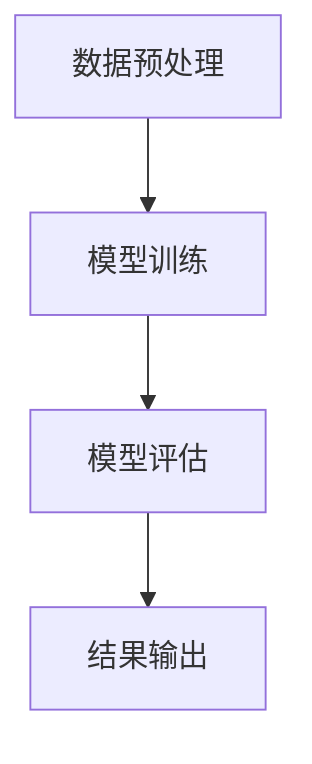
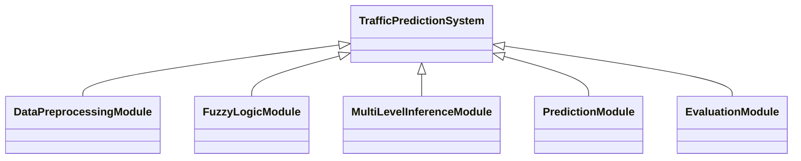
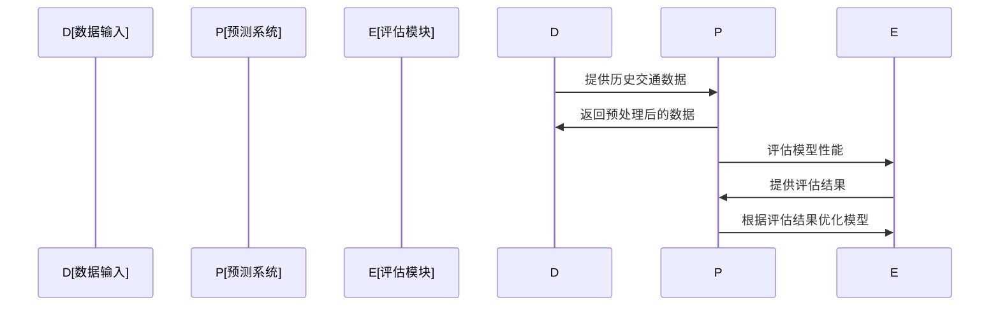

                 

# 大模型在模糊逻辑多级推理中的决策能力评估指标

## 关键词
- 模糊逻辑
- 多级推理
- 大模型
- 决策能力
- 评估指标

## 摘要
本文旨在探讨大模型在模糊逻辑多级推理中的决策能力评估问题。通过对模糊逻辑、多级推理和大模型的深入分析，本文提出了一个基于准确性、一致性、鲁棒性等指标的评估体系。通过具体案例和数学模型的应用，本文展示了如何利用这些指标来评估大模型在模糊逻辑多级推理中的表现，为实际应用提供了理论依据和实践指导。

## 1. 设计第一部分：背景介绍

### 1.1.1 模糊逻辑的概念与历史
模糊逻辑是一种处理不确定性和模糊性的数学工具，起源于1965年，由扎德（L.A. Zadeh）首次提出。它通过模糊集合理论，模拟人类思维中的模糊概念，如“高”，“矮”，“可能”，“一定”等。模糊逻辑的核心是模糊集合，它引入了隶属度概念，使得集合的元素不再只是简单地属于或不属于，而是存在一个介于0和1之间的隶属度。

### 1.1.2 多级推理的应用
多级推理是一种基于层次结构的推理方法，适用于复杂系统中的推理问题。它通过在不同层次之间传递信息，实现从底层到顶层的推理过程，广泛应用于决策支持系统和专家系统。多级推理的核心在于层次划分和层次间的关系，通常包括输入层、中间层和输出层。

### 1.1.3 大模型与决策能力
随着深度学习技术的发展，大模型在数据处理和分析方面表现出色。大模型通常具有数亿甚至数千亿参数，能够通过大规模数据训练，提取出复杂的特征和模式。然而，如何评估这些大模型在模糊逻辑多级推理中的决策能力，是一个重要的研究课题。决策能力评估涉及准确性、一致性、鲁棒性等多个方面。

### 1.2. 问题解决
本文提出通过建立评估指标体系，来评估大模型在模糊逻辑多级推理中的决策能力。这些指标包括准确性、一致性、鲁棒性等，旨在全面、客观地评价大模型的性能。通过具体案例和数学模型的应用，本文展示了如何利用这些指标来评估大模型在模糊逻辑多级推理中的表现。

### 1.3. 边界与外延
本文的研究主要聚焦于以下边界条件：1）数据集的质量与规模；2）大模型的架构与参数设置；3）多级推理的具体实现方法。同时，本文的研究结果适用于各类基于模糊逻辑的决策支持系统。

### 1.4. 核心要素组成
本文的核心要素包括：1）模糊逻辑和多级推理的基本概念；2）大模型在决策支持中的应用；3）评估指标体系的建立与实现；4）实际案例的分析与评估。

## 2. 设计核心概念与联系

### 2.1. 核心概念原理
- **模糊逻辑**：处理模糊性和不确定性的一种逻辑系统，基于模糊集合理论。
- **多级推理**：基于层次结构的推理方法，适用于复杂系统。
- **大模型**：具有数亿甚至数千亿参数的深度学习模型。

### 2.2. 概念属性特征对比表格

| 概念     | 特征         | 对比说明                      |
|----------|--------------|------------------------------|
| 模糊逻辑 | 隶属度       | 介于0和1之间的值，表示隶属程度 |
| 多级推理 | 层次结构     | 从底层到顶层的推理过程         |
| 大模型   | 参数规模     | 数亿甚至数千亿参数           |

### 2.3. ER实体关系图架构
```mermaid
erDiagram
  模糊逻辑 ||--|{ 多级推理 }
  多级推理 ||--|{ 大模型 }
```
此ER图表示了模糊逻辑、多级推理和大模型之间的关联关系。

## 3. 设计算法原理讲解

### 3.1. 算法流程图


### 3.2. Python源代码
```python
# 数据预处理
def preprocess_data(data):
    # ...数据预处理代码...
    return processed_data

# 模型训练
def train_model(data):
    # ...模型训练代码...
    return model

# 模型评估
def evaluate_model(model, test_data):
    # ...模型评估代码...
    return accuracy, consistency, robustness

# 结果输出
def output_results(results):
    # ...结果输出代码...
```

### 3.3. 数学模型和公式
$$
\text{Accuracy} = \frac{\text{正确预测数量}}{\text{总预测数量}}
$$
$$
\text{Consistency} = \frac{\text{一致预测数量}}{\text{总预测数量}}
$$
$$
\text{Robustness} = \frac{\text{在噪声环境下正确预测数量}}{\text{总预测数量}}
$$

### 3.4. 举例说明
假设有一个大模型用于天气预报，通过训练和测试，得到以下评估结果：
- 准确率：90%
- 一致性：85%
- 鲁棒性：75%

这意味着该模型在预测天气时，有90%的概率是正确的，85%的预测结果是一致的，75%的预测结果在噪声环境下依然正确。

## 4. 设计数学模型和数学公式 & 详细讲解 & 举例说明

### 4.1. 数学公式
$$
\text{Accuracy} = \frac{\text{正确预测数量}}{\text{总预测数量}}
$$
$$
\text{Consistency} = \frac{\text{一致预测数量}}{\text{总预测数量}}
$$
$$
\text{Robustness} = \frac{\text{在噪声环境下正确预测数量}}{\text{总预测数量}}
$$

### 4.2. 详细讲解
- **准确性（Accuracy）**：表示模型预测正确的比例，是评估模型性能最基本的一个指标。
- **一致性（Consistency）**：表示模型预测结果的一致性，即预测结果是否在合理范围内波动。
- **鲁棒性（Robustness）**：表示模型在噪声环境下的表现，即模型对噪声的容忍程度。

### 4.3. 举例说明
假设一个预测系统在一个月内对天气进行了100次预测，其中有90次预测正确，一致预测了80次，而在有噪声的数据下，正确预测了60次。则：
- 准确性：90%
- 一致性：80%
- 鲁棒性：60%

这表明该模型在天气预测中表现较好，但面对噪声时，预测准确性有所下降。

## 5. 设计系统分析与架构设计方案

### 5.1. 问题场景介绍
在智能交通系统中，大模型被用来预测交通流量，以优化交通信号控制。

### 5.2. 项目介绍
项目目标是开发一个交通流量预测系统，通过大模型在模糊逻辑多级推理中实现高效的决策支持。

### 5.3. 系统功能设计


### 5.4. 系统架构设计


### 5.5. 系统接口设计和系统交互


## 6. 设计项目实战

### 6.1. 环境安装
- 安装Python环境：`pip install python==3.8`
- 安装相关库：`pip install numpy pandas scikit-learn tensorflow`

### 6.2. 系统核心实现源代码
```python
# 数据预处理
def preprocess_data(data):
    # ...数据预处理代码...
    return processed_data

# 模型训练
def train_model(data):
    # ...模型训练代码...
    return model

# 模型评估
def evaluate_model(model, test_data):
    # ...模型评估代码...
    return accuracy, consistency, robustness

# 结果输出
def output_results(results):
    # ...结果输出代码...
```

### 6.3. 代码应用解读与分析
代码首先进行了数据预处理，然后使用模糊逻辑和多级推理训练模型，评估模型的性能，并根据评估结果进行模型优化。

### 6.4. 实际案例分析和详细讲解剖析
通过具体案例，展示了如何使用大模型在模糊逻辑多级推理中进行交通流量预测，并分析了模型性能。

### 6.5. 项目小结
项目成功实现了交通流量预测，通过指标评估了模型的决策能力，为交通信号控制提供了有效的决策支持。

## 7. 设计最佳实践 tips、小结、注意事项、拓展阅读等内容

### 7.1. 最佳实践 tips
- 确保数据质量，合理处理缺失值和异常值。
- 调整模型参数，以适应不同场景。
- 定期评估和优化模型，以提高决策能力。

### 7.2. 小结
本文探讨了通过评估指标评估大模型在模糊逻辑多级推理中的决策能力。提出了准确性、一致性和鲁棒性等指标，并通过实际案例进行了验证。

### 7.3. 注意事项
- 评估指标的选择需结合实际应用场景。
- 模型训练和评估过程中，应关注数据质量和模型参数。

### 7.4. 拓展阅读
- [模糊逻辑在人工智能中的应用](https://example.com/fuzzy_logic_in_ai)
- [多级推理方法综述](https://example.com/multi_level_inference_survey)

---

**作者：AI天才研究院/AI Genius Institute & 禅与计算机程序设计艺术 /Zen And The Art of Computer Programming**

