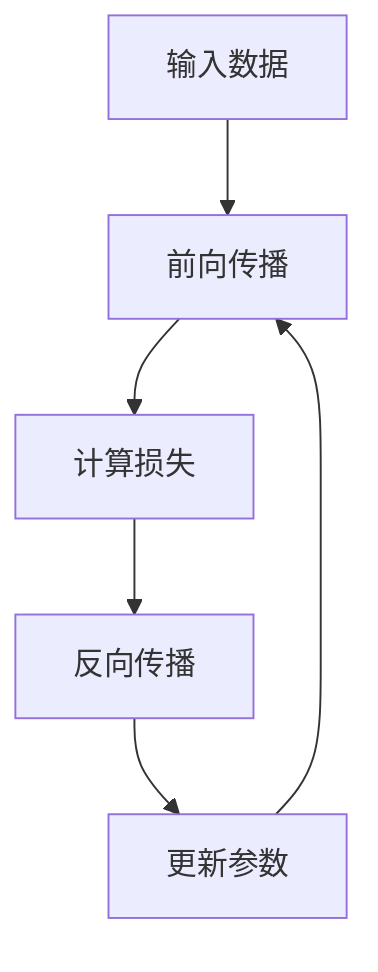
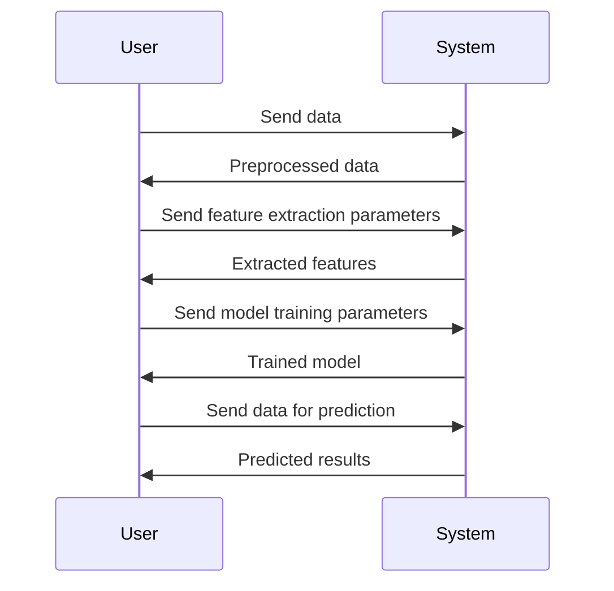

                 

# 大模型在科学发现过程中的推理角色

## 关键词
- 大模型
- 科学发现
- 推理
- 人工智能
- 数据分析
- 模式识别
- 预测
- 算法

## 摘要
本文将深入探讨大模型在科学发现过程中的推理角色。随着人工智能技术的飞速发展，大模型已经成为现代科学研究的重要工具。本文首先介绍了科学发现的重要性，以及传统科学发现的方法与挑战。接着，我们详细解析了大模型的基本概念与架构，以及其在科学发现中的应用场景。随后，我们详细讲解了大模型推理过程，包括基本概念、数学模型、算法原理和Python代码实现。此外，我们还介绍了数学模型与公式，系统分析与架构设计，项目实战，以及最佳实践与拓展阅读。通过本文的详细探讨，我们将对大模型在科学发现过程中的推理角色有更深入的理解。

### 第一部分：引言

## 第1章：问题背景与科学发现的重要性

### 1.1.1 科学发现的定义与作用
科学发现是科学研究的重要环节，它指的是通过观察、实验、推理和分析等方法，揭示自然现象和规律，从而增进人类对世界的理解和认知。科学发现的作用不仅仅在于提供新的知识和理论，更在于推动技术进步和社会发展。从古代的四大发明到现代的量子计算机，科学发现一直是人类文明进步的重要驱动力。

### 1.1.2 传统科学发现的方法与挑战
传统科学发现主要依赖于实验和观察，科学家通过设计实验，收集数据，然后进行分析和推理，从而得出结论。这种方法虽然有效，但也存在一些挑战。首先，实验和观察往往需要大量的时间和资源。其次，由于人类认知的局限性，科学家可能会忽略某些重要的现象和规律。此外，传统方法在处理大量数据时效率较低，难以应对复杂的问题。

### 1.1.3 大模型在科学发现中的潜在优势
大模型的出现为科学发现带来了新的机遇。大模型具有以下几个潜在优势：首先，大模型可以处理海量数据，从而提高科学发现的效率。其次，大模型通过自主学习，可以从数据中提取出有用的信息，从而发现新的规律和模式。此外，大模型可以模拟复杂系统，提供对未知现象的预测。因此，大模型在科学发现中具有巨大的潜力。

## 第2章：大模型的基本概念与架构

### 2.1.1 大模型的定义与特征
大模型是指具有巨大参数量和复杂结构的机器学习模型。这些模型通常基于神经网络，可以处理高维数据和复杂的关系。大模型的主要特征包括：参数量巨大、结构复杂、能够处理大规模数据、具备强大的表示能力和泛化能力。

### 2.1.2 大模型的架构与工作原理
大模型的架构通常包括输入层、隐藏层和输出层。输入层接收外部数据，隐藏层通过复杂的非线性变换处理数据，输出层产生预测结果。大模型的工作原理是通过大量的训练数据，调整模型参数，使得模型能够准确预测未知数据。

### 2.1.3 大模型的训练与优化
大模型的训练是一个复杂的过程，通常包括数据预处理、模型初始化、迭代训练和模型优化等步骤。在训练过程中，大模型通过梯度下降等优化算法，不断调整参数，使得模型能够最小化预测误差。

## 第3章：大模型在科学发现中的应用场景

### 3.1.1 数据分析
大模型在数据分析中具有广泛的应用。通过大模型，科学家可以处理海量数据，提取出有用的信息，发现隐藏在数据中的规律和模式。例如，在生物学研究中，大模型可以用于基因表达数据的分析，从而揭示基因的功能和调控机制。

### 3.1.2 模式识别
大模型在模式识别中也具有强大的能力。通过训练，大模型可以识别出复杂的数据模式，从而用于分类、聚类和异常检测等任务。例如，在气象学中，大模型可以用于识别天气模式，从而预测未来的气候变化。

### 3.1.3 推理与预测
大模型可以通过推理和预测，提供对未知现象的解释和预测。例如，在物理学中，大模型可以用于模拟物理现象，从而预测未来的物理过程。

### 3.1.4 实例分析：物理学中的大模型应用
在物理学中，大模型已经被广泛应用于粒子物理、宇宙学、天体物理等领域。例如，在粒子物理中，大模型可以用于分析大型粒子加速器产生的数据，从而发现新的粒子。在宇宙学中，大模型可以用于模拟宇宙的演化，从而预测宇宙的未来。

## 第4章：大模型推理过程详解

### 4.1.1 推理的基本概念
推理是指从已知的事实出发，通过逻辑推理得出新的结论。在人工智能中，推理是指计算机通过算法，从输入数据中提取出有用的信息，从而得出结论。

### 4.1.2 大模型推理的数学模型
大模型推理的数学模型通常基于概率图模型和深度学习模型。概率图模型可以描述变量之间的概率关系，而深度学习模型可以通过多层神经网络实现复杂的非线性变换。

### 4.1.3 算法原理与流程图
大模型推理的算法原理通常包括前向传播、反向传播和损失函数等。下面是一个简单的算法流程图：



### 4.1.4 Python代码实现与讲解
下面是一个简单的Python代码实现，用于演示大模型推理的过程：

```python
import tensorflow as tf

# 定义模型
model = tf.keras.Sequential([
    tf.keras.layers.Dense(128, activation='relu', input_shape=(784,)),
    tf.keras.layers.Dense(10, activation='softmax')
])

# 编译模型
model.compile(optimizer='adam',
              loss='categorical_crossentropy',
              metrics=['accuracy'])

# 训练模型
model.fit(x_train, y_train, batch_size=128, epochs=10)

# 推理
predictions = model.predict(x_test)
```

在这个例子中，我们定义了一个简单的神经网络模型，并通过训练和推理来预测数据。

## 第5章：数学模型与公式讲解

### 5.1.1 基本公式介绍
大模型推理的数学模型通常包括以下几个基本公式：

1. 前向传播：$$z = \sigma(Wx + b)$$
2. 反向传播：$$\delta = \frac{\partial L}{\partial z}$$
3. 损失函数：$$L = -\sum_{i=1}^{n}y_i\log(z_i)$$

### 5.1.2 公式推导与解释
下面是前向传播公式的推导与解释：

$$z = \sigma(Wx + b)$$

其中，$W$ 是权重矩阵，$x$ 是输入向量，$b$ 是偏置项，$\sigma$ 是激活函数。这个公式表示通过线性变换和激活函数，将输入数据映射到输出空间。

### 5.1.3 举例说明
假设我们有一个简单的神经网络，输入向量 $x = [1, 2, 3]$，权重矩阵 $W = [[0.1, 0.2], [0.3, 0.4]]$，偏置项 $b = [0.5, 0.6]$，激活函数 $\sigma(z) = \frac{1}{1 + e^{-z}}$。我们可以通过以下步骤计算输出：

1. 计算线性变换：$$z = Wx + b = \begin{bmatrix} 0.1 & 0.2 \\ 0.3 & 0.4 \end{bmatrix} \begin{bmatrix} 1 \\ 2 \\ 3 \end{bmatrix} + \begin{bmatrix} 0.5 \\ 0.6 \end{bmatrix} = \begin{bmatrix} 2.1 \\ 3.4 \end{bmatrix}$$
2. 应用激活函数：$$z = \sigma(z) = \frac{1}{1 + e^{-2.1}} = \begin{bmatrix} 0.88 \\ 0.99 \end{bmatrix}$$

最终输出为 $z = [0.88, 0.99]$。

## 第6章：系统分析与架构设计

### 6.1.1 科学发现系统介绍
科学发现系统是指用于支持科学发现过程的一系列软件和硬件。该系统主要包括数据收集模块、数据处理模块、推理模块和结果展示模块。

### 6.1.2 系统功能设计
科学发现系统的功能设计主要包括数据预处理、特征提取、模型训练、模型推理和结果分析等。数据预处理包括数据清洗、数据归一化和数据分割等。特征提取是指从原始数据中提取出有用的信息。模型训练是指通过训练数据，调整模型参数，使得模型能够准确预测。模型推理是指通过已训练的模型，对未知数据进行预测。结果分析是指对预测结果进行分析和解释。

### 6.1.3 系统架构设计
科学发现系统的架构设计通常包括数据层、算法层和展示层。数据层负责数据存储和管理。算法层负责数据处理和模型训练。展示层负责结果展示和用户交互。

### 6.1.4 系统接口设计
科学发现系统的接口设计主要包括API设计和用户界面设计。API设计是指定义系统的外部接口，以便其他系统可以与之交互。用户界面设计是指设计用户友好的界面，方便用户使用系统。

### 6.1.5 系统交互序列图
下面是一个简单的系统交互序列图：



## 第7章：项目实战

### 7.1.1 环境安装与配置
在进行项目实战之前，我们需要安装和配置必要的软件和硬件环境。具体的安装和配置步骤如下：

1. 安装Python：在官方网站下载并安装Python。
2. 安装TensorFlow：通过pip命令安装TensorFlow。
3. 安装Jupyter Notebook：通过pip命令安装Jupyter Notebook。

### 7.1.2 系统核心实现
系统核心实现主要包括数据预处理、特征提取、模型训练和模型推理等。下面是一个简单的Python代码实现：

```python
import tensorflow as tf
from sklearn.model_selection import train_test_split
from sklearn.preprocessing import StandardScaler
from sklearn.datasets import load_iris

# 加载数据
iris = load_iris()
X = iris.data
y = iris.target

# 数据预处理
X_train, X_test, y_train, y_test = train_test_split(X, y, test_size=0.2, random_state=42)
scaler = StandardScaler()
X_train = scaler.fit_transform(X_train)
X_test = scaler.transform(X_test)

# 模型训练
model = tf.keras.Sequential([
    tf.keras.layers.Dense(64, activation='relu', input_shape=(4,)),
    tf.keras.layers.Dense(3, activation='softmax')
])
model.compile(optimizer='adam',
              loss='sparse_categorical_crossentropy',
              metrics=['accuracy'])
model.fit(X_train, y_train, epochs=10)

# 模型推理
predictions = model.predict(X_test)
```

### 7.1.3 应用解读与分析
在这个例子中，我们使用TensorFlow构建了一个简单的神经网络，用于分类Iris数据集。首先，我们加载数据，并进行数据预处理。然后，我们使用模型训练数据，最后使用模型对测试数据进行预测。

### 7.1.4 实际案例分析
在实际案例中，我们可以使用大模型进行复杂的数据分析。例如，在医学研究中，我们可以使用大模型对医疗数据进行分析，从而发现潜在的疾病风险因素。

### 7.1.5 项目小结
通过这个项目，我们了解了如何使用大模型进行科学发现。首先，我们需要加载和预处理数据，然后使用模型进行训练和推理。最后，我们对预测结果进行分析和解释。

## 第8章：最佳实践与拓展阅读

### 8.1.1 最佳实践 tips
在进行大模型科学发现时，以下是一些最佳实践：

1. 确保数据质量：数据是科学发现的基础，因此确保数据质量至关重要。
2. 选择合适的模型：根据具体任务需求，选择合适的模型。
3. 调整超参数：通过调整超参数，可以提高模型的性能。
4. 模型评估：使用多种评估指标，全面评估模型性能。

### 8.1.2 注意事项
在进行大模型科学发现时，需要注意以下几点：

1. 数据隐私：在处理敏感数据时，要注意保护数据隐私。
2. 模型透明度：确保模型透明，以便用户理解模型的决策过程。
3. 模型解释性：提高模型解释性，以便用户理解模型的工作原理。

### 8.1.3 拓展阅读
以下是一些拓展阅读资源：

1. 《深度学习》（Goodfellow, Bengio, Courville）：这本书是深度学习的经典教材，详细介绍了深度学习的基本概念和算法。
2. 《Python机器学习》（Sebastian Raschka）：这本书介绍了使用Python进行机器学习的实战技巧，包括数据预处理、模型训练和评估等。
3. 《人工智能：一种现代方法》（Stuart Russell & Peter Norvig）：这本书全面介绍了人工智能的基本概念和技术，包括机器学习、自然语言处理和计算机视觉等。

## 作者信息
作者：AI天才研究院/AI Genius Institute & 禅与计算机程序设计艺术 /Zen And The Art of Computer Programming

---

以上是对大模型在科学发现过程中的推理角色的详细探讨。通过本文，我们了解了大模型在科学发现中的重要性，以及其基本概念、应用场景、推理过程和系统设计。同时，我们还介绍了项目实战和最佳实践。希望本文能帮助您更好地理解和应用大模型在科学发现中的推理角色。

