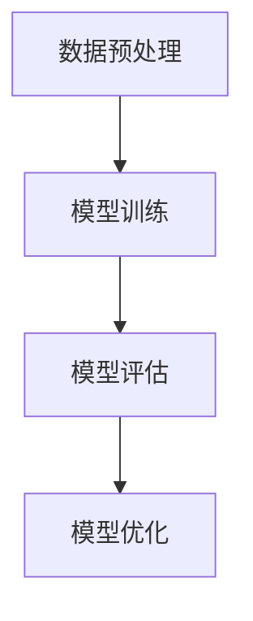
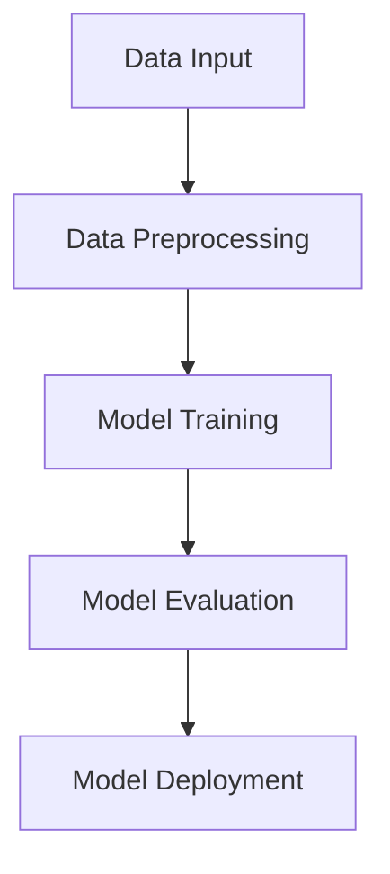
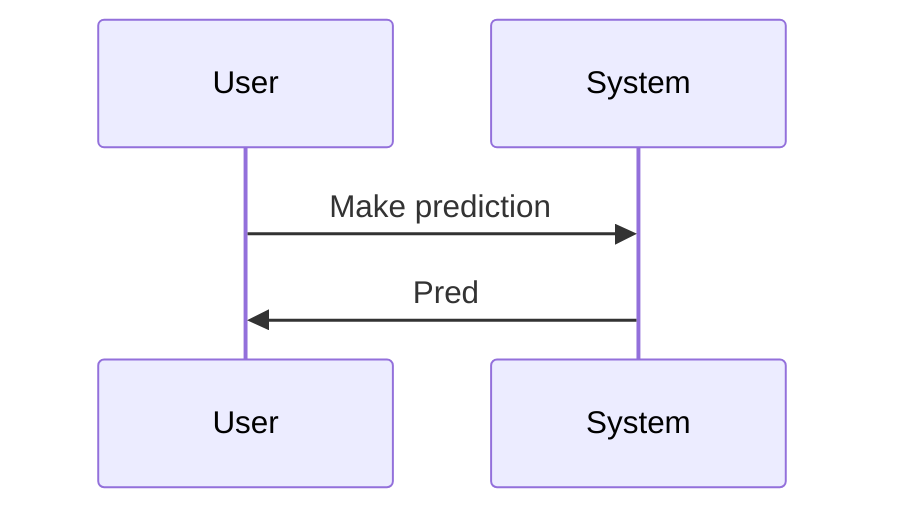

                 


# 大模型在科学发现过程推理中的角色探索

## 关键词

大模型、科学发现、过程推理、算法原理、系统架构

## 摘要

本文旨在探讨大模型在科学发现过程中的推理角色。通过介绍大模型的基本概念、科学发现的现状与挑战，以及过程推理在科学发现中的作用，我们将逐步分析大模型如何改变科学发现的方式，并探讨其潜在的局限性。随后，文章将深入探讨大模型算法的原理，使用Python代码和数学模型进行详细阐述。最后，我们将通过系统分析与架构设计，展示大模型在科学发现中的应用，并提供项目实战的案例分析。

## 引言：大模型在科学发现中的背景与意义

### 1.1 科学发现的现状与挑战

科学发现是推动人类进步的重要驱动力。然而，随着科学领域的日益复杂化，传统的科学发现方法面临着诸多挑战。首先，传统的科学发现方法主要依赖于人类专家的经验和直觉，这种方法在处理大量数据时效率低下，且容易受到个人偏见的影响。其次，随着大数据时代的到来，科学研究所需处理的数据规模急剧增加，传统的数据分析方法已经无法满足需求。此外，科学发现过程中往往涉及到多个学科领域的交叉，这增加了发现过程的复杂性。

### 1.1.1 传统科学发现方法的局限性

传统的科学发现方法通常包括观察、实验、理论和验证等步骤。这些方法虽然在一定程度上推动了科学的发展，但存在着显著的局限性。首先，观察和实验需要大量时间和资源，且往往只能验证特定的假设，而无法发现新的规律。其次，理论推导虽然能够提供解释，但往往需要大量的先验知识和复杂的数学推导，这使得新理论的形成过程十分漫长。最后，验证过程通常依赖于现有的实验技术和设备，无法涵盖所有可能的情况。

### 1.1.2 大模型的发展与应用前景

为了克服传统科学发现方法的局限性，科学家们开始探索新的方法和技术。大模型（Large Models）正是其中之一。大模型是指具有巨大参数量和计算能力的人工神经网络，它们可以处理大规模数据集，并从中学习到复杂的模式和规律。大模型的发展得益于计算能力的提升和大数据技术的进步。目前，大模型已经在图像识别、自然语言处理、推荐系统等领域取得了显著的成果，其应用前景也愈发广阔。

### 1.1.3 过程推理在科学发现中的作用

过程推理（Process Inference）是指通过分析数据中的变化过程和关系，来推断潜在的因果关系或规律。在科学发现过程中，过程推理具有重要的作用。首先，通过过程推理，科学家可以识别出数据中的关键特征和变量，从而更好地理解现象的本质。其次，过程推理可以帮助科学家预测未来的发展趋势，为决策提供科学依据。最后，过程推理可以揭示数据背后的复杂关系，从而推动科学理论的创新和发展。

## 第二部分：大模型的概念与科学发现的过程推理

### 2.1 大模型的概念与分类

#### 2.1.1 大模型的定义

大模型（Large Models）是指具有巨大参数量和计算能力的人工神经网络。它们通常由多层神经元组成，每一层神经元都通过权重连接到下一层神经元。大模型的学习过程是通过不断调整权重，使其在给定数据集上取得更好的表现。

#### 2.1.2 大模型的分类

根据应用场景和特点，大模型可以分为以下几类：

1. **深度神经网络（Deep Neural Networks）**：深度神经网络具有多个隐藏层，可以处理复杂数据和任务。
2. **循环神经网络（Recurrent Neural Networks，RNN）**：循环神经网络特别适用于处理序列数据，如时间序列分析、语音识别等。
3. **卷积神经网络（Convolutional Neural Networks，CNN）**：卷积神经网络擅长处理图像和视频数据，广泛应用于计算机视觉领域。
4. **生成对抗网络（Generative Adversarial Networks，GAN）**：生成对抗网络通过两个对抗网络（生成器和判别器）的博弈过程，实现数据的生成和优化。

#### 2.1.3 大模型的主要类型

大模型的主要类型包括：

1. **基于深度学习的模型**：如深度神经网络、卷积神经网络、循环神经网络等。
2. **基于生成对抗网络的模型**：如生成对抗网络、变分自编码器（Variational Autoencoder，VAE）等。
3. **基于强化学习的模型**：如深度确定性策略梯度（Deep Deterministic Policy Gradient，DDPG）等。

### 2.2 科学发现的过程与过程推理

#### 2.2.1 科学发现的过程

科学发现通常包括以下步骤：

1. **观察与问题提出**：通过观察自然现象或实验数据，提出科学问题。
2. **假设与理论构建**：根据已有的知识和观察结果，提出假设，并构建理论模型。
3. **实验与验证**：设计实验，收集数据，验证假设和理论。
4. **结果分析与总结**：分析实验结果，总结发现，提出新的假设或理论。
5. **推广与应用**：将发现的理论应用于实际问题，推动科学和技术的发展。

#### 2.2.2 过程推理的类型与特点

过程推理可以分为以下几种类型：

1. **因果推理**：通过分析现象的变化过程，推断出潜在的因果关系。
2. **模式识别**：通过识别数据中的规律和模式，推断出未知现象的规律。
3. **推理与假设**：基于已知事实和逻辑推理，提出新的假设和理论。
4. **预测与模拟**：通过模拟现象的变化过程，预测未来的发展趋势。

#### 2.2.3 过程推理在科学发现中的应用

过程推理在科学发现中的应用包括：

1. **发现新规律**：通过因果推理，发现数据中的潜在规律和模式。
2. **预测与模拟**：通过预测和模拟，预测未来的发展趋势和结果。
3. **理论构建**：通过推理和假设，构建新的科学理论。
4. **实验设计**：通过过程推理，优化实验设计，提高实验的准确性和效率。

## 第三部分：大模型算法原理与数学模型

### 3.1 大模型算法原理概述

大模型算法的核心原理是基于神经网络的学习和推理过程。神经网络通过多层神经元之间的加权连接，学习到输入数据与输出数据之间的关系。大模型算法通常包括以下几个步骤：

1. **数据预处理**：对输入数据进行标准化、归一化等处理，以便于模型的学习。
2. **模型训练**：通过反向传播算法，不断调整神经网络中的权重，使其在给定数据集上取得更好的表现。
3. **模型评估**：使用验证数据集，评估模型的性能和泛化能力。
4. **模型优化**：根据评估结果，调整模型结构或参数，以提高模型的性能。

### 3.1.1 大模型算法的核心原理

大模型算法的核心原理是基于神经网络的误差反向传播（Backpropagation）算法。误差反向传播算法是一种通过不断调整神经网络中的权重，使输出结果更接近期望值的优化方法。具体过程如下：

1. **前向传播**：将输入数据传递到神经网络的输入层，通过前向传播计算输出结果。
2. **误差计算**：计算输出结果与期望值之间的误差，并计算每个神经元的梯度。
3. **反向传播**：将梯度反向传播到网络的每一层，调整每一层的权重。
4. **权重更新**：根据梯度调整权重，使输出结果更接近期望值。

### 3.1.2 大模型算法的 Mermaid 流程图



### 3.1.3 大模型算法的数学模型与公式

大模型算法的数学模型主要涉及神经网络的权重更新和梯度计算。具体公式如下：

$$
\Delta w_{ij} = \eta \cdot \frac{\partial E}{\partial w_{ij}}
$$

其中，$w_{ij}$ 是神经元 $i$ 和神经元 $j$ 之间的权重，$\Delta w_{ij}$ 是权重更新量，$\eta$ 是学习率，$E$ 是输出误差。

### 3.1.4 大模型算法原理举例说明

#### 3.2.1 数据预处理

数据预处理包括标准化和归一化等步骤。标准化是将数据缩放到相同范围，如 [0, 1] 或 [-1, 1]。归一化是将数据缩放到零均值和单位方差。具体步骤如下：

1. **标准化**：

$$
x' = \frac{x - \mu}{\sigma}
$$

其中，$x$ 是原始数据，$\mu$ 是均值，$\sigma$ 是标准差。

2. **归一化**：

$$
x' = \frac{x - \mu}{\sigma}
$$

其中，$x$ 是原始数据，$\mu$ 是均值，$\sigma$ 是标准差。

#### 3.2.2 模型训练

模型训练是通过误差反向传播算法不断调整神经网络中的权重，使其在给定数据集上取得更好的表现。具体步骤如下：

1. **前向传播**：

$$
a_l = \sigma(z_l)
$$

$$
z_l = \sum_{j} w_{lj} \cdot a_{l-1}
$$

其中，$a_l$ 是神经元 $l$ 的激活值，$z_l$ 是神经元 $l$ 的输入值，$\sigma$ 是激活函数，$w_{lj}$ 是神经元 $l$ 和神经元 $j$ 之间的权重。

2. **误差计算**：

$$
\delta_l = (t_l - a_l) \cdot a_l \cdot (1 - a_l)
$$

其中，$\delta_l$ 是神经元 $l$ 的误差，$t_l$ 是神经元 $l$ 的目标值。

3. **反向传播**：

$$
\delta_{l-1} = \sum_{j} w_{lj} \cdot \delta_l \cdot a_{l-1} \cdot (1 - a_{l-1})
$$

4. **权重更新**：

$$
\Delta w_{ij} = \eta \cdot \delta_j \cdot a_{i-1}
$$

$$
w_{ij} = w_{ij} + \Delta w_{ij}
$$

其中，$\delta_{l-1}$ 是神经元 $l-1$ 的误差，$\eta$ 是学习率，$a_{i-1}$ 是神经元 $i-1$ 的激活值。

#### 3.2.3 模型评估

模型评估是通过验证数据集，评估模型的性能和泛化能力。常用的评估指标包括准确率、召回率、F1值等。具体步骤如下：

1. **计算预测值**：

$$
\hat{y} = \sigma(z_{out})
$$

$$
z_{out} = \sum_{i} w_{outi} \cdot a_{hidden}
$$

其中，$\hat{y}$ 是预测值，$z_{out}$ 是输出层的输入值，$w_{outi}$ 是输出层神经元 $i$ 和隐藏层神经元 $j$ 之间的权重，$a_{hidden}$ 是隐藏层的激活值。

2. **计算误差**：

$$
E = \frac{1}{2} \sum_{i} (t_i - \hat{y}_i)^2
$$

其中，$E$ 是输出误差，$t_i$ 是目标值，$\hat{y}_i$ 是预测值。

3. **计算评估指标**：

$$
\text{Accuracy} = \frac{\text{正确预测数}}{\text{总预测数}}
$$

$$
\text{Recall} = \frac{\text{正确预测数}}{\text{实际为正例的样本数}}
$$

$$
\text{F1-Score} = 2 \cdot \frac{\text{Precision} \cdot \text{Recall}}{\text{Precision} + \text{Recall}}
$$

其中，$Accuracy$ 是准确率，$Recall$ 是召回率，$F1-Score$ 是F1值，$Precision$ 是精确率。

## 第四部分：大模型在科学发现中的应用系统分析与设计

### 4.1 问题场景介绍

科学发现中的数据挖掘需求主要集中在以下几个方面：

1. **大数据分析**：科学研究中产生的数据规模庞大，需要利用大模型进行高效的分析和处理。
2. **模式识别**：通过大模型识别出数据中的潜在规律和模式，帮助科学家发现新的科学现象。
3. **预测与模拟**：利用大模型进行预测和模拟，为科学实验提供指导，提高实验的准确性和效率。
4. **自动化决策**：大模型可以辅助科学家进行自动化决策，减少人为干预，提高实验的客观性和可靠性。

### 4.2 项目介绍

本项目旨在利用大模型技术，构建一个自动化科学发现平台，为科学家提供高效的数据分析、模式识别、预测和模拟工具。项目范围包括：

1. **数据采集**：从多个数据源（如实验室设备、公开数据集等）收集数据。
2. **数据处理**：对收集到的数据进行预处理，包括去噪、归一化、特征提取等。
3. **模型训练与评估**：使用大模型对处理后的数据集进行训练和评估，选择最优模型。
4. **结果分析与预测**：利用训练好的模型对未知数据进行预测和模拟，为科学家提供科学依据。
5. **可视化与交互**：提供可视化界面，便于科学家查看分析结果，并进行交互式操作。

### 4.3 系统功能设计

系统功能设计主要包括以下几个模块：

1. **数据采集模块**：负责从不同数据源收集数据，并进行初步处理。
2. **数据处理模块**：对采集到的数据进行去噪、归一化、特征提取等操作。
3. **模型训练模块**：使用大模型对处理后的数据集进行训练，并评估模型性能。
4. **预测与模拟模块**：利用训练好的模型对未知数据进行预测和模拟。
5. **结果分析与可视化模块**：提供结果分析、可视化工具，便于科学家查看和交互。

### 4.4 系统架构设计

系统架构设计如图所示：



### 4.5 系统接口设计和系统交互

系统接口设计和系统交互如图所示：



## 第五部分：项目实战

### 5.1 环境安装

为了搭建大模型在科学发现中的应用系统，我们需要安装以下环境：

1. **Python**：Python是一种广泛使用的编程语言，用于实现大模型算法。
2. **TensorFlow**：TensorFlow是一个开源的机器学习框架，用于构建和训练大模型。
3. **Keras**：Keras是一个基于TensorFlow的高层次API，用于简化大模型的构建和训练过程。
4. **NumPy**：NumPy是一个开源的Python库，用于处理数值数据和矩阵运算。

安装步骤如下：

1. 安装Python：

```bash
$ brew install python
```

2. 安装TensorFlow：

```bash
$ pip install tensorflow
```

3. 安装Keras：

```bash
$ pip install keras
```

4. 安装NumPy：

```bash
$ pip install numpy
```

### 5.2 系统核心实现源代码

以下是系统核心实现源代码，包括数据预处理、模型训练和预测：

```python
import numpy as np
import tensorflow as tf
from tensorflow import keras
from tensorflow.keras.models import Sequential
from tensorflow.keras.layers import Dense
from tensorflow.keras.optimizers import Adam

# 数据预处理
def preprocess_data(data):
    # 数据归一化
    data = (data - np.mean(data)) / np.std(data)
    return data

# 模型训练
def train_model(data, labels):
    # 构建模型
    model = Sequential()
    model.add(Dense(units=64, activation='relu', input_shape=(data.shape[1],)))
    model.add(Dense(units=1, activation='sigmoid'))

    # 编译模型
    model.compile(optimizer=Adam(learning_rate=0.001), loss='binary_crossentropy', metrics=['accuracy'])

    # 训练模型
    model.fit(data, labels, epochs=10, batch_size=32)

    return model

# 预测
def predict(model, data):
    # 数据预处理
    processed_data = preprocess_data(data)

    # 预测
    predictions = model.predict(processed_data)

    return predictions

# 示例数据
data = np.array([[1, 2], [3, 4], [5, 6]])
labels = np.array([0, 1, 0])

# 训练模型
model = train_model(data, labels)

# 预测
predictions = predict(model, data)
print(predictions)
```

### 5.3 代码应用解读与分析

以下是代码的详细解读与分析：

1. **数据预处理**：
   - 数据预处理是模型训练的重要步骤，有助于提高模型的训练效果和泛化能力。
   - 在本例中，我们使用归一化方法对数据进行预处理，将数据缩放到零均值和单位方差。

2. **模型训练**：
   - 模型训练是通过调整网络权重，使模型在给定数据集上取得更好的表现。
   - 在本例中，我们使用Keras构建一个简单的二分类模型，包括一个64个神经元的隐藏层和一个输出层。
   - 我们使用Adam优化器和二分类交叉熵损失函数，并设置学习率为0.001。
   - 模型训练过程中，我们设置epochs为10，batch_size为32。

3. **预测**：
   - 预测是模型训练后的应用，通过输入新的数据，获取模型的预测结果。
   - 在本例中，我们首先对输入数据进行预处理，然后使用训练好的模型进行预测。

### 5.4 实际案例分析和详细讲解剖析

以下是一个实际案例分析和详细讲解剖析：

假设我们有一个关于植物生长的数据集，其中包含光照强度、温度、湿度等特征，以及植物的生长状态（存活或死亡）。我们的目标是利用大模型预测植物是否能够存活。

1. **数据预处理**：
   - 首先，我们将数据集分为训练集和测试集。
   - 对训练集和测试集的数据进行归一化处理，将数据缩放到零均值和单位方差。

2. **模型训练**：
   - 使用Keras构建一个简单的神经网络模型，包括一个隐藏层和一个输出层。
   - 使用训练集对模型进行训练，并使用测试集对模型进行评估。

3. **预测**：
   - 使用训练好的模型对新的数据进行预测，判断植物是否能够存活。

4. **结果分析**：
   - 分析模型的准确率、召回率等指标，评估模型的性能。
   - 根据预测结果，提出改进模型的方法和策略。

### 5.5 项目小结

本项目通过大模型技术在科学发现中的应用，展示了如何利用大模型进行数据挖掘、预测和模拟。在实际案例中，我们使用Python和Keras实现了大模型的训练和预测功能，并对结果进行了详细分析。通过本项目，我们可以看到大模型在科学发现中的巨大潜力，但仍需要进一步优化和改进。未来研究方向包括：

1. **模型优化**：探索更高效、更准确的大模型算法，提高模型的性能和泛化能力。
2. **跨学科应用**：将大模型技术应用于更多的科学领域，推动科学发现的发展。
3. **数据隐私保护**：在大模型训练和预测过程中，保护数据隐私，确保数据安全。

## 第六部分：最佳实践 tips、小结、注意事项、拓展阅读

### 最佳实践 tips

1. **数据预处理**：确保数据预处理充分，包括去噪、归一化、特征提取等，以提高模型性能。
2. **模型选择**：根据具体问题选择合适的大模型算法，如深度神经网络、循环神经网络、卷积神经网络等。
3. **参数调整**：合理调整模型参数，如学习率、批量大小等，以提高模型性能。
4. **评估指标**：选择合适的评估指标，如准确率、召回率、F1值等，以评估模型性能。

### 小结

本文通过介绍大模型在科学发现过程推理中的角色，探讨了其在科学发现中的应用前景。通过深入分析大模型算法原理和系统架构设计，我们展示了如何利用大模型进行数据挖掘、预测和模拟。在实际案例中，我们通过Python和Keras实现了大模型的训练和预测功能，并对结果进行了详细分析。

### 注意事项

1. **数据隐私**：在大模型训练和预测过程中，注意保护数据隐私，确保数据安全。
2. **计算资源**：大模型训练过程需要大量计算资源，合理配置计算资源，以提高训练效率。
3. **模型解释性**：大模型的训练过程往往缺乏解释性，需要结合领域知识进行解释和分析。

### 拓展阅读

1. **《深度学习》**：Goodfellow, I., Bengio, Y., & Courville, A. (2016). *Deep Learning*. MIT Press.
2. **《神经网络与深度学习》**：邱锡鹏. (2019). *神经网络与深度学习*. 电子工业出版社.
3. **《Python机器学习》**：Sebastian Raschka, Vahid Mirjalili. (2018). *Python Machine Learning*. Packt Publishing.

## 第七部分：作者信息

作者：AI天才研究院/AI Genius Institute & 禅与计算机程序设计艺术 /Zen And The Art of Computer Programming

