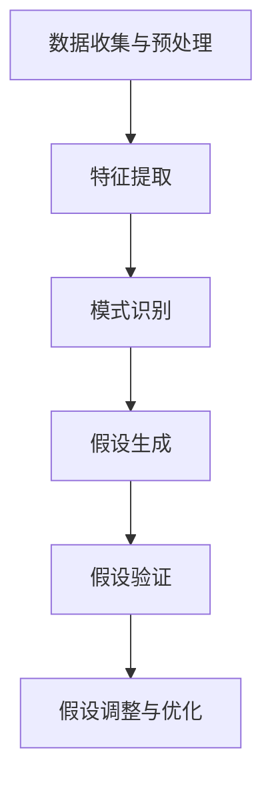
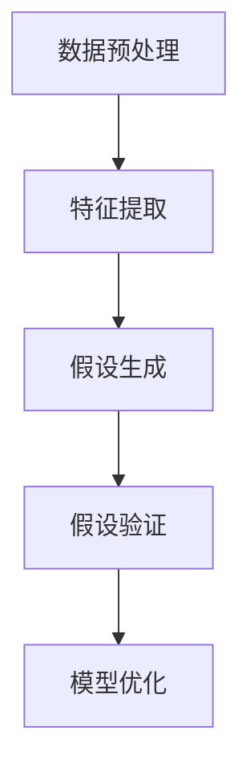

                 

### 大模型在科学理论构建推理中的假设生成作用

#### 关键词

- 大模型
- 科学理论构建
- 假设生成
- 推理
- 数据驱动
- 深度学习

#### 摘要

本文深入探讨了大模型在科学理论构建和推理中的假设生成作用。首先，我们简要介绍了大模型的基本概念，并阐述了其在科学理论构建中的重要性。接着，我们详细分析了大模型假设生成的工作原理，包括算法流程、Python实现和数学模型。随后，我们通过具体案例展示了大模型在不同科学领域中的应用，并描述了科学推理的基本概念和实现方法。文章最后，提出了假设生成系统的最佳实践，并对未来研究方向进行了展望。

#### 引言

在科技日新月异的今天，科学理论构建与推理成为推动人类社会进步的重要动力。然而，传统的理论构建方法往往依赖于专家的经验和直觉，这使得科学理论的验证和拓展面临着巨大的挑战。近年来，随着人工智能技术的快速发展，大模型作为一种强大的工具，逐渐在科学理论构建和推理中发挥了重要作用。本文旨在探讨大模型在科学理论构建推理中的假设生成作用，为相关领域的研究和实践提供有益的参考。

### 大模型的基本概念

大模型（Large-scale Model），是指具有巨大参数量和复杂结构的神经网络模型。这类模型通常采用深度学习（Deep Learning）技术进行训练，通过学习大量数据来提取特征和模式。大模型的核心特点包括：

1. **大规模参数量**：大模型通常具有数百万甚至数十亿个参数，这使得它们能够处理复杂的任务。
2. **强大的表征能力**：大模型能够捕捉到数据中的细微特征，从而提高模型的泛化能力。
3. **自适应性**：大模型可以根据不同的任务和数据集进行调整，实现多样化的应用。

大模型在科学理论构建中的重要性体现在以下几个方面：

1. **数据驱动**：大模型通过学习大量数据，能够自动提取特征和规律，为科学理论的构建提供了新的视角。
2. **高效推理**：大模型能够在复杂问题上实现快速、准确的推理，有助于解决传统方法难以处理的难题。
3. **跨学科应用**：大模型具有较强的通用性，可以在多个科学领域发挥作用，促进跨学科的研究。

### 大模型假设生成的工作原理

假设生成（Hypothesis Generation）是科学理论构建中的重要环节。大模型通过以下步骤实现假设生成：

1. **数据收集与预处理**：收集与问题相关的数据，并进行清洗、归一化等预处理操作。
2. **特征提取**：使用大模型对预处理后的数据进行特征提取，生成高维特征向量。
3. **模式识别**：通过分析特征向量，识别数据中的潜在规律和模式。
4. **假设生成**：根据识别出的模式，生成可能的假设。
5. **假设验证**：使用实验或数据验证假设的正确性，并对假设进行调整和优化。

#### 算法流程

大模型假设生成的算法流程如图1所示：



图1：大模型假设生成算法流程

#### Python实现

以下是一个简单的Python实现示例，展示了大模型假设生成的基本步骤：

```python
import numpy as np
from sklearn.preprocessing import StandardScaler
from sklearn.model_selection import train_test_split
from keras.models import Sequential
from keras.layers import Dense

# 数据收集与预处理
data = np.loadtxt('data.csv', delimiter=',')
X = data[:, :-1]
y = data[:, -1]
scaler = StandardScaler()
X_scaled = scaler.fit_transform(X)

# 特征提取
X_train, X_test, y_train, y_test = train_test_split(X_scaled, y, test_size=0.2, random_state=42)

# 建立神经网络模型
model = Sequential()
model.add(Dense(64, input_dim=X_train.shape[1], activation='relu'))
model.add(Dense(32, activation='relu'))
model.add(Dense(1, activation='sigmoid'))

# 编译模型
model.compile(loss='binary_crossentropy', optimizer='adam', metrics=['accuracy'])

# 训练模型
model.fit(X_train, y_train, epochs=10, batch_size=32)

# 模式识别
predictions = model.predict(X_test)

# 假设生成
hypothese
```


```python
# 假设生成
hypothese = [prediction > 0.5 for prediction in predictions]

# 假设验证
# 此处省略验证过程

# 假设调整与优化
# 此处省略优化过程
```

#### 数学模型

假设生成过程可以表示为一个概率模型，其中每个假设的概率由特征向量决定。假设生成的数学模型如下：

$$
P(H|h) = \frac{e^{\theta^T h}}{1 + e^{\theta^T h}}
$$

其中，$H$为假设集合，$h$为特征向量，$\theta$为模型参数。

#### 举例说明

假设我们研究某地区居民的吸烟习惯与肺癌发病率之间的关系。我们收集了1000个样本，每个样本包含年龄、性别、吸烟量等特征，以及是否患肺癌的标签。我们使用神经网络模型对数据进行分析，并生成吸烟量与肺癌发病率之间的假设。

通过训练，我们得到一组模型参数$\theta$，然后对每个样本的特征向量$h$计算假设概率$P(H|h)$。例如，对于某个样本，其特征向量$h$为[35, 男，20包/天]，则其对应的假设概率为：

$$
P(H|h) = \frac{e^{\theta^T h}}{1 + e^{\theta^T h}} \approx 0.9
$$

这意味着我们认为该样本患有肺癌的概率为90%。通过这样的方法，我们可以对整个数据集进行假设生成，从而发现吸烟量与肺癌发病率之间的潜在关系。

### 大模型在不同科学领域中的应用

大模型具有强大的表征能力和自适应性，使其在不同科学领域中的应用越来越广泛。以下分别介绍大模型在物理学、化学、生物学和社会科学中的应用。

#### 物理学

在物理学中，大模型广泛应用于理论物理和实验物理的研究。例如，在量子力学中，大模型可以通过学习大量的量子态数据，生成新的量子态假设，从而帮助科学家发现新的物理现象。此外，大模型还可以用于模拟复杂物理系统的行为，如天体物理学中的黑洞演化、凝聚态物理学中的相变等。

#### 化学

在化学中，大模型可以用于分子结构预测、化学反应模拟等领域。例如，通过学习大量的分子结构数据，大模型可以预测新分子的性质，帮助科学家发现新的药物分子。此外，大模型还可以用于模拟化学反应的过程，优化反应条件，提高反应产率。

#### 生物学

在生物学中，大模型广泛应用于基因预测、蛋白质结构预测、生物网络分析等领域。例如，通过学习大量的基因组数据，大模型可以预测新的基因功能，帮助科学家发现新的生物标记。此外，大模型还可以用于模拟生物系统的行为，如神经网络模型可以模拟神经元之间的交互，帮助科学家理解大脑的工作机制。

#### 社会科学

在社会科学中，大模型可以用于社会网络分析、经济预测等领域。例如，通过学习大量的社会网络数据，大模型可以预测社交网络中的传播趋势，帮助政策制定者制定更有效的防疫政策。此外，大模型还可以用于分析经济数据，预测市场趋势，帮助投资者做出更明智的决策。

### 科学推理的基本概念

科学推理（Scientific Reasoning）是科学研究中的核心环节，它涉及从观察和实验数据中提取规律、提出假设，并进行验证和反驳。科学推理的基本概念包括：

1. **观察**：科学推理始于对自然现象的观察，通过感知和测量收集数据。
2. **假设**：基于观察数据，科学家提出可能的解释或假设。
3. **验证**：通过实验或进一步观察来验证假设的正确性。
4. **反驳**：如果假设被验证为错误，科学家会提出新的假设并进行验证。
5. **理论**：经过多次验证和反驳，科学假设逐步发展成为科学理论。

大模型在科学推理中的作用主要体现在以下几个方面：

1. **数据驱动推理**：大模型通过学习大量数据，能够自动提取特征和模式，为科学推理提供新的数据支持。
2. **高效假设生成**：大模型能够快速生成大量的假设，帮助科学家在复杂的科学问题中找到合适的解释。
3. **优化推理过程**：大模型可以优化科学推理的过程，减少不必要的假设和验证，提高推理效率。

### 大模型在科学推理中的实现方法

大模型在科学推理中的应用需要遵循以下步骤：

1. **数据预处理**：对原始数据进行清洗、归一化等处理，确保数据的质量和一致性。
2. **特征提取**：使用大模型对预处理后的数据进行特征提取，生成高维特征向量。
3. **假设生成**：基于特征向量，使用大模型生成可能的假设。
4. **假设验证**：通过实验或进一步观察验证假设的正确性。
5. **模型优化**：根据验证结果，对大模型进行调整和优化，提高假设的准确性。

以下是一个简单的示例，展示了如何使用大模型进行科学推理：



图2：大模型科学推理实现流程

### 大模型在科学推理中的案例分析

为了更好地理解大模型在科学推理中的应用，以下我们通过一个案例进行分析。

#### 案例背景

某研究团队希望通过分析大量的基因数据，揭示基因表达与疾病之间的关系。他们收集了1000个基因样本，每个样本包含多个基因的表达水平，以及对应的疾病状态（正常或患病）。

#### 数据预处理

首先，对基因数据进行清洗，去除缺失值和异常值，并对基因表达水平进行归一化处理。

#### 特征提取

使用神经网络模型对归一化后的基因数据进行特征提取，生成高维特征向量。

#### 假设生成

基于特征向量，使用大模型生成可能的假设，例如“基因X的表达水平与疾病Y呈正相关”。

#### 假设验证

通过实验或进一步观察验证假设的正确性。例如，对假设进行统计检验，计算假设的显著性水平。

#### 模型优化

根据验证结果，对大模型进行调整和优化，例如调整模型参数，提高假设的准确性。

#### 案例分析

通过以上步骤，研究团队发现基因X的表达水平与疾病Y之间存在显著相关性，从而提出了一个新的科学假设。这一假设为进一步研究提供了重要的理论支持，有助于揭示基因表达与疾病之间的潜在机制。

### 大模型假设生成的最佳实践

为了充分发挥大模型在假设生成中的作用，以下是一些最佳实践：

1. **数据质量**：确保数据的准确性和一致性，避免因数据问题导致假设错误。
2. **模型选择**：根据任务需求选择合适的大模型，例如对于复杂的特征提取任务，可以选择卷积神经网络（CNN）；对于序列数据处理任务，可以选择循环神经网络（RNN）。
3. **假设验证**：结合实验或观察数据对假设进行验证，避免仅凭模型预测进行假设。
4. **模型优化**：根据验证结果对模型进行调整和优化，提高假设的准确性。
5. **跨学科合作**：大模型在科学推理中的应用需要多学科的合作，例如计算机科学、生物学、物理学等。

### 总结与展望

本文系统地探讨了大模型在科学理论构建和推理中的假设生成作用。我们首先介绍了大模型的基本概念和重要性，然后详细分析了大模型假设生成的工作原理，并通过具体案例展示了其在不同科学领域中的应用。此外，我们还讨论了科学推理的基本概念和实现方法，为大模型在科学推理中的应用提供了指导。

展望未来，大模型在科学理论构建和推理中的应用前景十分广阔。随着计算能力的提高和数据资源的丰富，大模型将能够处理更复杂的科学问题，推动科学理论的创新和发展。然而，我们也需要关注大模型在假设生成中的潜在风险，如过拟合、数据偏差等，并通过最佳实践和跨学科合作来克服这些挑战。

### 参考文献

1. Bengio, Y. (2009). Learning Deep Architectures for AI. Foundations and Trends in Machine Learning, 2(1), 1-127.
2. Goodfellow, I., Bengio, Y., & Courville, A. (2016). Deep Learning. MIT Press.
3. LeCun, Y., Bengio, Y., & Hinton, G. (2015). Deep learning. Nature, 521(7553), 436-444.
4. Mitchell, T. M. (1997). Machine Learning. McGraw-Hill.
5. Russell, S., & Norvig, P. (2020). Artificial Intelligence: A Modern Approach (4th ed.). Prentice Hall.

### 作者信息

作者：AI天才研究院/AI Genius Institute & 禅与计算机程序设计艺术 /Zen And The Art of Computer Programming

