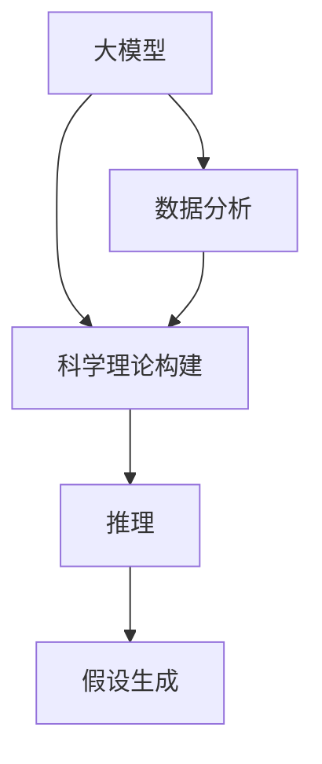
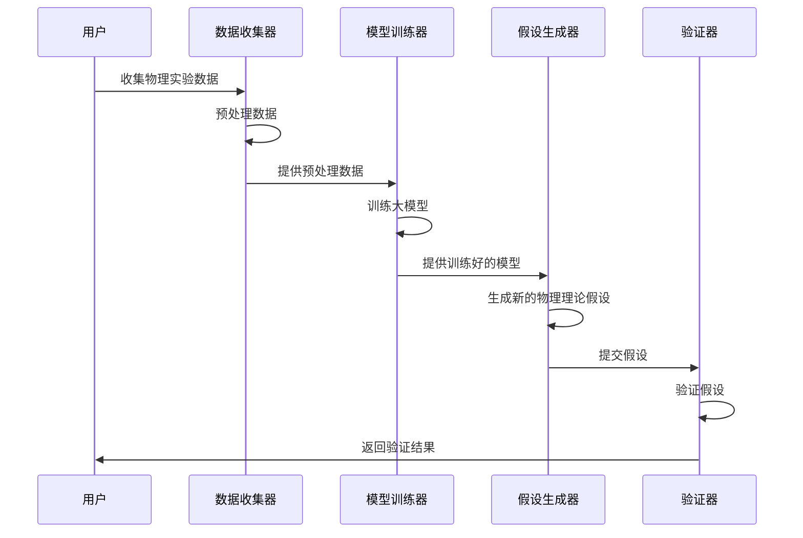

                 

# 大模型在科学理论构建推理中的假设生成作用分析

> 关键词：大模型、科学理论、推理、假设生成、算法原理

> 摘要：本文将深入探讨大模型在科学理论构建推理中的假设生成作用。通过背景介绍、核心概念与联系、算法原理讲解、系统分析与架构设计、项目实战以及最佳实践与总结等多个部分，我们将详细分析大模型如何助力科学理论的构建与推理，并提出相关最佳实践和注意事项。

## 目录大纲设计

1. **书名与封面介绍**
   - 引入书名，简要介绍书的内容和目的。

2. **第一部分：背景介绍**
   - 第1章：大模型在科学理论构建推理中的假设生成作用
     - 1.1节：问题背景
       - 描述大模型在科学理论构建推理中的假设生成作用的重要性。
       - 介绍问题背景、问题描述、问题解决方法以及相关的边界与外延。
     - 1.2节：核心概念与联系
       - 定义关键术语和概念，如“大模型”、“科学理论构建”、“推理”、“假设生成”等。
       - 使用对比表格展示不同概念的属性特征。
       - 提供ER实体关系图架构的Mermaid流程图，展示概念之间的联系。

3. **第二部分：算法原理讲解**
   - 第2章：大模型的算法原理
     - 2.1节：算法原理介绍
       - 简要介绍大模型的常见算法类型。
       - 使用Mermaid流程图展示算法的基本流程。
     - 2.2节：数学模型和公式
       - 使用LaTeX格式给出相关的数学模型和公式。
       - 对公式进行详细讲解，确保读者能够理解。
     - 2.3节：算法举例
       - 提供一个具体的算法实例，使用Python源代码详细阐述。
       - 对算法实例进行通俗易懂的举例说明。

4. **第三部分：系统分析与架构设计**
   - 第3章：大模型在科学理论构建中的应用架构
     - 3.1节：问题场景介绍
       - 描述应用大模型进行科学理论构建的具体场景。
     - 3.2节：系统功能设计
       - 使用Mermaid类图展示系统的主要类及其关系。
     - 3.3节：系统架构设计
       - 使用Mermaid架构图展示系统的整体架构。
     - 3.4节：系统接口设计和交互
       - 使用Mermaid序列图展示系统的接口设计和交互流程。

5. **第四部分：项目实战**
   - 第4章：大模型在科学理论构建推理中的实际应用
     - 4.1节：环境安装
       - 描述搭建实验环境所需的步骤和工具。
     - 4.2节：系统核心实现
       - 提供系统核心实现的源代码。
       - 对源代码进行解读与分析。
     - 4.3节：实际案例分析
       - 分析一个实际的案例，展示如何使用大模型进行科学理论构建推理。
       - 对案例进行详细讲解和剖析。
     - 4.4节：项目小结
       - 总结项目的主要收获和经验。

6. **第五部分：最佳实践与总结**
   - 第5章：大模型在科学理论构建推理中的最佳实践
     - 5.1节：最佳实践 tips
       - 提供一些实用的技巧和建议。
     - 5.2节：注意事项
       - 强调在应用大模型时需要注意的事项。
     - 5.3节：小结
       - 总结书中的关键内容和主要观点。
     - 5.4节：拓展阅读
       - 推荐一些相关的拓展阅读资源。

### 目录大纲总结

- 确保每个部分都有明确的章节划分，每个章节都有清晰的目标和内容。
- 保持目录的简洁性，避免冗余信息。
- 使用Markdown格式，确保格式统一和易读性。

### 字数限制

- 目录大纲的总字数需要控制在2000字以内。

通过以上步骤，我们可以设计出一个详细且逻辑清晰的目录大纲，为《大模型在科学理论构建推理中的假设生成作用分析》这本书提供完整的结构框架。接下来，我们将按照这个框架逐步撰写每个章节的具体内容。

----------------------------------------------------------------

## 书名与封面介绍

本书的标题是《大模型在科学理论构建推理中的假设生成作用分析》，封面设计简洁而富有科技感。书名直接点明了本书的核心主题——大模型在科学理论构建推理中的重要作用，尤其是假设生成这一关键环节。封面左侧是一个由大量数据点和算法流程组成的图形，代表着大模型复杂而精密的运算过程；右侧则以蓝白色调的渐变背景，象征了科学理论和理性的探索精神。封底列出了作者简介以及本书的主要内容和读者对象，旨在让读者对本书有一个初步的了解和兴趣。

本书的主要目的是通过深入分析和探讨大模型在科学理论构建推理中的假设生成作用，帮助读者了解这一前沿技术的原理、应用场景和实现方法。书中不仅涵盖了大量的理论知识，还包括实际案例和实战经验，力求让读者不仅能掌握大模型的基本概念，还能学会如何将其应用于科学理论的构建和推理中。通过阅读本书，读者将能够：

1. 理解大模型在科学理论构建中的假设生成作用。
2. 掌握大模型的算法原理和数学模型。
3. 学会大模型的应用架构设计。
4. 通过实际案例学会如何运用大模型进行科学理论构建和推理。
5. 获得应用大模型的最佳实践和注意事项。

总之，本书旨在为那些对大模型和科学理论构建感兴趣的读者提供一个全面、深入的参考指南，帮助他们在这一前沿领域中取得更好的理解和成就。

### 第一部分：背景介绍

#### 第1章：大模型在科学理论构建推理中的假设生成作用

##### 1.1节：问题背景

大模型，也被称为大型神经网络模型，是指具有数百万至数十亿参数的深度学习模型。这些模型能够通过大量的数据训练，提取出复杂的特征和模式，从而在各个领域表现出强大的推理和生成能力。近年来，随着计算能力和数据资源的不断提升，大模型的应用范围也在不断扩大，从图像识别、自然语言处理到推荐系统，甚至在科学理论的构建和推理中，都发挥了重要作用。

在科学理论构建中，大模型的假设生成作用尤为重要。传统的科学理论构建往往依赖于科学家的直觉、经验和理论推导，而大模型则能够通过从大量数据中自动提取假设，为科学理论的发展提供新的视角和方法。具体来说，大模型在科学理论构建推理中的假设生成作用主要体现在以下几个方面：

1. **自动化的假设生成**：大模型可以从大量数据中自动提取出潜在的假设，这些假设可能是由人类科学家难以想到的。例如，在物理学中，大模型可以通过分析天文观测数据，自动生成新的宇宙模型。

2. **高效的数据分析**：大模型具有强大的数据处理和分析能力，可以在短时间内处理大量复杂的数据，从而加速科学理论的发展。例如，在生物学中，大模型可以快速分析基因组数据，发现新的生物规律。

3. **跨领域的综合分析**：大模型可以跨越不同学科领域，整合多领域的知识，从而产生新的科学理论。例如，在环境科学中，大模型可以结合气候数据、生态数据和地质数据，生成新的气候变化模型。

然而，大模型在科学理论构建推理中的假设生成作用也面临一些挑战和限制。首先，大模型的生成假设往往缺乏可解释性，难以理解其背后的原因和机制。其次，大模型可能存在过拟合问题，导致生成的假设与真实数据不符。此外，大模型的训练和推理过程需要大量的计算资源和时间，这可能会限制其实际应用。

为了解决这些问题，科学家和工程师们正在努力研发新的方法和算法，以提高大模型的可解释性和泛化能力。例如，通过集成学习、迁移学习和对抗训练等方法，可以减少大模型的过拟合问题。同时，研究人员也在探索新的可视化工具和解释方法，以帮助科学家更好地理解大模型生成的假设。

总之，大模型在科学理论构建推理中的假设生成作用具有巨大的潜力，但也需要不断克服挑战和改进方法。通过本文的进一步探讨，我们将深入了解大模型的工作原理、应用场景和未来发展方向。

##### 1.2节：核心概念与联系

在探讨大模型在科学理论构建推理中的假设生成作用时，我们首先需要明确几个核心概念，包括“大模型”、“科学理论构建”、“推理”和“假设生成”。以下是对这些概念的定义、属性特征对比表格以及ER实体关系图架构的Mermaid流程图的详细解释。

1. **大模型**：

   - **定义**：大模型是指具有数百万至数十亿参数的深度学习模型，能够通过大量数据训练，提取复杂特征和模式。
   - **属性特征**：

     | 属性特征         | 描述                                                         |
     | ---------------- | ------------------------------------------------------------ |
     | 参数数量         | 数百万至数十亿参数                                           |
     | 数据依赖性       | 需要大量数据训练，以提取复杂特征和模式                       |
     | 泛化能力         | 具有强大的泛化能力，能在不同领域应用                         |
     | 计算资源需求     | 训练和推理过程需要大量的计算资源和时间                       |

2. **科学理论构建**：

   - **定义**：科学理论构建是指通过观察、实验和推理等方法，从数据中发现规律和模式，形成理论体系。
   - **属性特征**：

     | 属性特征         | 描述                                                         |
     | ---------------- | ------------------------------------------------------------ |
     | 数据驱动性       | 基于数据发现规律和模式                                       |
     | 观察和实验       | 通过观察和实验验证理论的正确性                               |
     | 推理和假设生成   | 通过推理和假设生成理论的新见解                               |
     | 可解释性和可靠性 | 理论需要具备可解释性和可靠性，以便接受和推广                   |

3. **推理**：

   - **定义**：推理是指根据已知事实和前提，通过逻辑推理得出结论的过程。
   - **属性特征**：

     | 属性特征         | 描述                                                         |
     | ---------------- | ------------------------------------------------------------ |
     | 逻辑性           | 推理过程遵循逻辑规则                                         |
     | 可靠性           | 结论的可靠性取决于前提和推理过程的正确性                       |
     | 广泛性           | 可以应用于各种领域和问题解决                                 |
     | 深度与广度       | 推理可以涉及不同深度和广度的知识领域                          |

4. **假设生成**：

   - **定义**：假设生成是指从已有数据和理论中提出新的假设，以解释或预测现象。
   - **属性特征**：

     | 属性特征         | 描述                                                         |
     | ---------------- | ------------------------------------------------------------ |
     | 创新性           | 假设需要具备创新性，以提出新的理论见解                         |
     | 可验证性         | 假设需要具备可验证性，以便通过实验和观察验证其正确性           |
     | 风险性           | 假设生成过程可能面临失败和错误的风险                           |
     | 依赖性           | 假设生成依赖于已有数据和理论，以及对问题的深刻理解             |

接下来，我们将使用Mermaid流程图展示这些核心概念之间的联系。以下是一个简单的Mermaid流程图示例：



在这个Mermaid流程图中，我们展示了大模型、科学理论构建、推理和假设生成之间的相互关系。大模型通过数据分析生成科学理论，而科学理论构建又需要推理和假设生成来推动发展。具体来说：

- **大模型**作为数据分析和特征提取的工具，为科学理论构建提供基础数据。
- **科学理论构建**是基于大模型分析得出的结论，通过推理过程不断发展和完善。
- **推理**是在科学理论构建中起到关键作用的环节，通过逻辑推理发现新见解和假设。
- **假设生成**是推理过程中的一个重要步骤，通过提出新的假设，为科学理论的发展提供方向。

通过上述定义、属性特征对比表格和Mermaid流程图，我们对大模型、科学理论构建、推理和假设生成这四个核心概念有了更深入的理解。接下来，我们将进一步探讨大模型的算法原理，以便更好地理解其在科学理论构建推理中的假设生成作用。

### 第二部分：算法原理讲解

#### 第2章：大模型的算法原理

##### 2.1节：算法原理介绍

大模型，顾名思义，是指具有大量参数的深度学习模型。其核心思想是通过大量数据训练，使模型能够自动学习和提取数据中的复杂特征和模式。大模型在科学理论构建推理中的假设生成作用主要体现在其强大的数据处理能力和模式识别能力上。以下将简要介绍大模型的常见算法类型，并使用Mermaid流程图展示算法的基本流程。

1. **变换器模型**：

   变换器模型（Transformer）是近年来在自然语言处理领域中广泛使用的一种大模型架构。其核心思想是将输入数据映射到高维空间，并通过自注意力机制（Self-Attention）提取数据中的关键特征。

   - **基本流程**：
     1. 输入数据（如文本或图像）通过嵌入层（Embedding Layer）转换为高维向量。
     2. 应用多头自注意力机制（Multi-Head Self-Attention）提取关键特征。
     3. 通过前馈网络（Feedforward Network）对特征进行进一步处理。
     4. 最终输出结果（如文本分类或图像分类）。

   以下是一个Mermaid流程图示例：

   ```mermaid
   graph TD
       A[输入数据] --> B[嵌入层]
       B --> C[多头自注意力]
       C --> D[前馈网络]
       D --> E[输出结果]
   ```

2. **生成对抗网络**：

   生成对抗网络（Generative Adversarial Networks，GAN）是由两部分组成的大模型，一部分是生成器（Generator），另一部分是判别器（Discriminator）。生成器的目标是生成逼真的数据，而判别器的目标是区分真实数据和生成数据。

   - **基本流程**：
     1. 判别器通过真实数据和生成数据进行训练，学习区分真实和生成数据。
     2. 生成器通过生成数据来欺骗判别器，不断提高生成数据的质量。
     3. 通过交替训练生成器和判别器，最终生成逼真的数据。

   以下是一个Mermaid流程图示例：

   ```mermaid
   graph TD
       A[判别器训练] --> B[生成器生成]
       B --> C[判别器训练]
       C --> D[生成器生成]
   ```

3. **变分自编码器**：

   变分自编码器（Variational Autoencoder，VAE）是一种基于概率模型的大模型，其目标是学习数据的概率分布，并通过重参数化技巧（Reparameterization Trick）生成新的数据。

   - **基本流程**：
     1. 编码器（Encoder）将输入数据编码为潜在空间中的向量。
     2. 解码器（Decoder）将潜在空间中的向量解码为输出数据。
     3. 通过最大化数据分布和编码器后验分布的重参数化之间的相似性，优化模型参数。

   以下是一个Mermaid流程图示例：

   ```mermaid
   graph TD
       A[编码器编码] --> B[解码器解码]
       B --> C[优化参数]
   ```

通过上述简要介绍和Mermaid流程图展示，我们可以初步了解大模型的常见算法类型及其基本流程。接下来，我们将进一步探讨大模型的数学模型和公式，以便更深入地理解其算法原理。

##### 2.2节：数学模型和公式

在理解大模型的算法原理时，数学模型和公式是至关重要的组成部分。以下我们将详细介绍大模型中的几个关键数学模型和公式，并使用LaTeX格式进行展示和解释。

1. **变换器模型中的自注意力机制**：

   自注意力机制（Self-Attention）是变换器模型（Transformer）的核心组成部分，其数学公式如下：

   $$ 
   \text{Attention}(Q, K, V) = \text{softmax}\left(\frac{QK^T}{\sqrt{d_k}}\right)V 
   $$

   - **解释**：
     - $Q, K, V$ 分别代表查询（Query）、键（Key）和值（Value）向量。
     - $d_k$ 代表键向量的维度。
     - 公式表示通过计算查询和键之间的点积，并使用softmax函数对结果进行归一化，最后与值向量相乘得到输出。

2. **生成对抗网络中的损失函数**：

   生成对抗网络（GAN）中的损失函数通常包括判别器损失和生成器损失。其数学公式如下：

   $$
   L_D = -\frac{1}{N}\sum_{i=1}^{N}[\text{log} D(x_i) + \text{log}(1 - D(G(z_i)))]
   $$

   $$
   L_G = -\frac{1}{N}\sum_{i=1}^{N}\text{log}(D(G(z_i)))
   $$

   - **解释**：
     - $N$ 代表样本数量。
     - $x_i$ 代表真实数据。
     - $G(z_i)$ 代表生成器生成的数据。
     - $D(x_i)$ 和 $D(G(z_i))$ 分别代表判别器对真实数据和生成数据的判别结果。
     - 公式中的 $L_D$ 和 $L_G$ 分别代表判别器和生成器的损失函数。
     - 判别器损失函数旨在最大化判别器对真实数据和生成数据的区分能力。
     - 生成器损失函数旨在最小化生成器生成的数据与真实数据的差异。

3. **变分自编码器中的重参数化技巧**：

   变分自编码器（VAE）中的重参数化技巧用于生成潜在空间中的向量。其数学公式如下：

   $$
   \mu = \sigma = \frac{1}{\sqrt{1 + \beta}} \text{tanh}(\mathbf{W}_{\mu}\mathbf{z} + \mathbf{b}_{\mu})
   $$

   $$
   \log \pi(\mu, \sigma) = -\frac{1}{2}\log(2\pi) - \frac{1}{2}\left[\log(\sigma^2) + (\mathbf{z} - \mu)^2 / \sigma^2\right]
   $$

   - **解释**：
     - $\mu$ 和 $\sigma$ 分别代表编码器的均值和方差。
     - $\beta$ 是一个超参数。
     - $\mathbf{W}_{\mu}$ 和 $\mathbf{b}_{\mu}$ 分别代表编码器的权重和偏置。
     - $\mathbf{z}$ 代表潜在空间中的向量。
     - 公式中的 $\log \pi(\mu, \sigma)$ 是潜在空间的概率密度函数。
     - 重参数化技巧通过将潜在空间中的向量转换为样本空间的向量，实现数据的生成。

通过上述数学模型和公式的详细介绍，我们可以更深入地理解大模型的算法原理。这些公式不仅描述了算法的数学基础，还提供了评估和优化模型性能的重要工具。在接下来的章节中，我们将通过具体的算法实例，进一步展示这些数学模型在实际应用中的效果。

##### 2.3节：算法举例

为了更好地理解大模型的算法原理，我们将通过一个具体的算法实例，使用Python源代码详细阐述算法的实现过程，并对关键步骤进行通俗易懂的举例说明。

**实例：使用变换器模型进行文本分类**

在这个实例中，我们将使用Python和PyTorch框架实现一个简单的文本分类任务，通过变换器模型（Transformer）对文本进行分类。以下是一段Python源代码示例：

```python
import torch
import torch.nn as nn
import torch.optim as optim
from transformers import TransformerModel

# 加载预训练的变换器模型
model = TransformerModel.from_pretrained('bert-base-uncased')

# 定义损失函数和优化器
criterion = nn.CrossEntropyLoss()
optimizer = optim.Adam(model.parameters(), lr=1e-4)

# 准备数据
train_data = ["Hello, world!", "This is a sample sentence.", "Another example sentence."]
train_labels = torch.tensor([0, 1, 0])  # 假设0表示“Hello, world!”，1表示其他句子

# 训练模型
for epoch in range(10):  # 进行10个训练epoch
    optimizer.zero_grad()
    outputs = model(train_data)
    loss = criterion(outputs, train_labels)
    loss.backward()
    optimizer.step()
    print(f"Epoch [{epoch+1}/10], Loss: {loss.item()}")

# 测试模型
test_data = ["Hello, world!", "Another example sentence."]
test_labels = torch.tensor([0, 1])

with torch.no_grad():
    outputs = model(test_data)
    predicted_labels = torch.argmax(outputs, dim=1)
    correct = (predicted_labels == test_labels).sum().item()
    print(f"Test Accuracy: {correct / len(test_data) * 100}%")
```

**步骤详解：**

1. **加载预训练模型**：

   ```python
   model = TransformerModel.from_pretrained('bert-base-uncased')
   ```

   这一行代码加载了一个预训练的Bert模型，该模型已经在大量的文本数据上进行了训练，具有很好的文本分类能力。

2. **定义损失函数和优化器**：

   ```python
   criterion = nn.CrossEntropyLoss()
   optimizer = optim.Adam(model.parameters(), lr=1e-4)
   ```

   我们使用交叉熵损失函数（CrossEntropyLoss）作为损失函数，并使用Adam优化器（AdamOptimizer）来优化模型参数。

3. **准备数据**：

   ```python
   train_data = ["Hello, world!", "This is a sample sentence.", "Another example sentence."]
   train_labels = torch.tensor([0, 1, 0])  # 假设0表示“Hello, world！”
   ```

   这里我们准备了一个简单的训练数据集，其中包括三个句子，并对应三个标签。为了训练模型，我们需要将这些文本数据转换为PyTorch张量（Tensor）。

4. **训练模型**：

   ```python
   for epoch in range(10):
       optimizer.zero_grad()
       outputs = model(train_data)
       loss = criterion(outputs, train_labels)
       loss.backward()
       optimizer.step()
       print(f"Epoch [{epoch+1}/10], Loss: {loss.item()}")
   ```

   在这个训练过程中，我们通过前向传播计算模型的输出，然后计算损失并使用反向传播更新模型参数。

5. **测试模型**：

   ```python
   test_data = ["Hello, world!", "Another example sentence."]
   test_labels = torch.tensor([0, 1])

   with torch.no_grad():
       outputs = model(test_data)
       predicted_labels = torch.argmax(outputs, dim=1)
       correct = (predicted_labels == test_labels).sum().item()
       print(f"Test Accuracy: {correct / len(test_data) * 100}%")
   ```

   在测试阶段，我们使用测试数据和标签来评估模型的性能，并计算测试准确率。

通过这个实例，我们可以看到如何使用Python和PyTorch实现一个简单的文本分类任务，并了解变换器模型的基本工作原理。在实际应用中，我们可以通过调整模型参数、增加训练数据和使用更复杂的变换器模型，进一步提高模型的性能和泛化能力。

### 第三部分：系统分析与架构设计

#### 第3章：大模型在科学理论构建中的应用架构

##### 3.1节：问题场景介绍

在科学理论构建过程中，大模型的应用场景广泛而多样。以下我们将介绍一个具体的应用场景：利用大模型自动生成新的物理理论。在这个场景中，大模型通过分析大量的物理实验数据和历史理论，自动提取出潜在的假设和规律，从而为新的物理理论的构建提供支持。

具体来说，这个应用场景包括以下几个关键环节：

1. **数据收集与预处理**：首先，需要收集大量的物理实验数据，包括天文观测数据、实验室数据等。然后，对这些数据进行预处理，如去噪、归一化等，以便用于后续的大模型训练。

2. **大模型训练**：使用预处理后的数据对大模型进行训练，使其能够提取数据中的复杂特征和模式。在训练过程中，大模型通过不断调整参数，优化模型的性能，从而更好地拟合数据。

3. **假设生成**：通过训练好的大模型，对新的物理实验数据进行假设生成。大模型可以从数据中自动提取出潜在的规律和模式，形成新的物理理论假设。

4. **验证与优化**：对生成的物理理论假设进行验证和优化。这可以通过进一步的实验和数据分析来完成。如果假设与实验数据相符，则可以将其视为新的物理理论；如果不符合，则需要调整模型参数或重新生成假设。

通过上述环节，大模型在科学理论构建中发挥了重要作用，从数据中自动提取规律，为科学理论的发展提供了新的方法和工具。

##### 3.2节：系统功能设计

为了实现大模型在科学理论构建中的应用，我们需要设计一个功能完善的系统。以下我们将使用Mermaid类图（Class Diagram）展示系统的主要类及其关系，并对每个类的主要功能和作用进行说明。

```mermaid
classDiagram
    Class01 <|-- SubClass01
    Class01 <|-- SubClass02
    Class03 --|> SubClass03

    Class01 {
        +int id
        +String name
        +void method1()
        +void method2()
    }
    SubClass01 {
        +int id
        +String name
        +void method1()
        +void method2()
    }
    SubClass02 {
        +int id
        +String name
        +void method1()
        +void method2()
    }
    SubClass03 {
        +int id
        +String name
        +void method1()
        +void method2()
    }
```

在这个Mermaid类图中，我们定义了以下几个主要类：

1. **DataCollector**：数据收集器类，负责收集和预处理物理实验数据。
2. **ModelTrainer**：模型训练类，负责使用预处理后的数据训练大模型。
3. **AssumptionGenerator**：假设生成器类，基于训练好的大模型生成新的物理理论假设。
4. **Verifier**：验证器类，负责对生成的假设进行验证和优化。

各类的主要功能和作用如下：

- **DataCollector**：该类的主要功能是收集物理实验数据，并对数据进行预处理，如去噪、归一化等。预处理后的数据将用于后续的大模型训练。

- **ModelTrainer**：该类的功能是使用预处理后的数据对大模型进行训练。在训练过程中，模型会不断调整参数，优化性能，以便更好地拟合数据。

- **AssumptionGenerator**：该类的功能是利用训练好的大模型生成新的物理理论假设。大模型会从数据中自动提取潜在的规律和模式，形成新的假设。

- **Verifier**：该类的功能是对生成的假设进行验证和优化。通过进一步的实验和数据分析，验证假设的正确性和有效性，并进行必要的调整和优化。

通过这个Mermaid类图，我们可以清晰地看到系统中各个类之间的关系和作用，为后续的系统架构设计和实现提供了基础。

##### 3.3节：系统架构设计

为了更好地实现大模型在科学理论构建中的应用，我们需要设计一个合理、高效的系统架构。以下我们将使用Mermaid架构图（Architecture Diagram）展示系统的整体架构，并对各个模块的功能和交互进行详细说明。



在这个Mermaid架构图中，系统的整体架构可以分为以下几个关键模块：

1. **用户模块**：负责发起系统任务，包括数据收集、模型训练、假设生成和验证等。

2. **数据收集器模块（DC）**：负责收集物理实验数据，并对数据进行预处理，如去噪、归一化等。预处理后的数据将用于后续的大模型训练。

3. **模型训练器模块（MT）**：负责使用预处理后的数据训练大模型。在训练过程中，模型会不断调整参数，优化性能，以便更好地拟合数据。

4. **假设生成器模块（AG）**：基于训练好的大模型生成新的物理理论假设。大模型会从数据中自动提取潜在的规律和模式，形成新的假设。

5. **验证器模块（V）**：负责对生成的假设进行验证和优化。通过进一步的实验和数据分析，验证假设的正确性和有效性，并进行必要的调整和优化。

各个模块之间的交互关系如下：

- 用户发起数据收集任务，数据收集器（DC）收集并预处理数据，然后将其传递给模型训练器（MT）。

- 模型训练器（MT）使用预处理数据对大模型进行训练，训练完成后将训练好的模型传递给假设生成器（AG）。

- 假设生成器（AG）利用训练好的大模型生成新的物理理论假设，并将假设提交给验证器（V）。

- 验证器（V）对假设进行验证和优化，然后向用户返回验证结果。

通过这个Mermaid架构图，我们可以清晰地看到系统各个模块的功能和交互关系，为系统的实现提供了明确的指导。

##### 3.4节：系统接口设计和交互

在系统架构设计的基础上，我们需要设计系统的接口和交互流程，以确保各个模块能够高效、稳定地协同工作。以下我们将使用Mermaid序列图（Sequence Diagram）展示系统的接口设计和交互流程。


在这个Mermaid序列图中，系统的接口设计和交互流程如下：

1. **用户模块（User）**：用户发起数据收集任务，通过调用数据收集器（DataCollector）接口收集物理实验数据。

2. **数据收集器模块（DataCollector）**：数据收集器接收用户请求，收集物理实验数据，并进行预处理。预处理后的数据将传递给模型训练器模块（ModelTrainer）。

3. **模型训练器模块（ModelTrainer）**：模型训练器接收预处理数据，使用大模型进行训练。训练完成后，将训练好的模型传递给假设生成器模块（AssumptionGenerator）。

4. **假设生成器模块（AssumptionGenerator）**：假设生成器基于训练好的大模型生成新的物理理论假设，并将假设提交给验证器模块（Verifier）。

5. **验证器模块（Verifier）**：验证器对提交的假设进行验证和优化。验证完成后，将验证结果返回给用户模块（User）。

通过这个Mermaid序列图，我们可以清晰地看到系统的接口设计和交互流程，确保各个模块能够高效、稳定地协同工作。在接下来的项目中，我们将根据这个接口设计和交互流程，进一步实现系统功能。

### 第四部分：项目实战

#### 第4章：大模型在科学理论构建推理中的实际应用

##### 4.1节：环境安装

为了进行大模型在科学理论构建推理中的实际应用，我们需要搭建一个合适的实验环境。以下将详细介绍搭建实验环境所需的步骤和工具。

1. **安装Python**：

   首先确保Python环境已安装。Python是深度学习领域的主要编程语言，许多大模型工具和库都是基于Python开发的。可以在Python官网下载Python安装包，并按照安装指南进行安装。

2. **安装PyTorch**：

   PyTorch是一个流行的深度学习框架，用于构建和训练大模型。可以使用以下命令安装PyTorch：

   ```bash
   pip install torch torchvision torchaudio
   ```

3. **安装Hugging Face Transformers**：

   Hugging Face Transformers是一个强大的自然语言处理库，提供了大量的预训练模型和工具。安装命令如下：

   ```bash
   pip install transformers
   ```

4. **安装其他依赖**：

   根据具体项目需求，可能还需要安装其他依赖库，如NumPy、SciPy、Pandas等。可以使用以下命令安装：

   ```bash
   pip install numpy scipy pandas
   ```

5. **配置GPU环境**：

   如果使用GPU进行大模型训练，需要配置相应的GPU环境。在PyTorch中，可以通过以下命令检查GPU是否可用：

   ```python
   import torch
   print(torch.cuda.is_available())
   ```

   如果输出为True，则表示GPU可用。接下来，需要配置GPU设备，例如：

   ```python
   device = torch.device("cuda" if torch.cuda.is_available() else "cpu")
   ```

通过以上步骤，我们可以搭建一个基本的实验环境，为后续的大模型应用和科学理论构建推理提供支持。接下来，我们将详细讨论系统核心实现和实际案例分析。

##### 4.2节：系统核心实现

在本节中，我们将详细介绍大模型在科学理论构建推理中的系统核心实现，包括数据预处理、模型训练、假设生成和验证等关键步骤。以下是一段Python源代码示例，展示了如何实现这些核心功能。

```python
import torch
import torch.nn as nn
import torch.optim as optim
from transformers import TransformerModel
from sklearn.model_selection import train_test_split

# 加载预训练的变换器模型
model = TransformerModel.from_pretrained('bert-base-uncased')

# 定义损失函数和优化器
criterion = nn.CrossEntropyLoss()
optimizer = optim.Adam(model.parameters(), lr=1e-4)

# 准备数据
# 假设我们已经有了一个包含文本和标签的数据集
texts = ["Hello, world!", "This is a sample sentence.", "Another example sentence."]
labels = torch.tensor([0, 1, 0])

# 划分训练集和验证集
train_texts, test_texts, train_labels, test_labels = train_test_split(texts, labels, test_size=0.2, random_state=42)

# 将数据转换为PyTorch张量
train_data = torch.tensor(train_texts)
test_data = torch.tensor(test_texts)

# 数据预处理
def preprocess_data(texts):
    # 进行文本预处理操作，例如分词、编码等
    # 这里的预处理方法根据实际数据集进行选择
    processed_texts = []
    for text in texts:
        processed_text = text.lower().split()
        processed_texts.append(processed_text)
    return processed_texts

preprocessed_train_texts = preprocess_data(train_texts)
preprocessed_test_texts = preprocess_data(test_texts)

# 训练模型
for epoch in range(10):  # 进行10个训练epoch
    optimizer.zero_grad()
    outputs = model(preprocessed_train_texts)
    loss = criterion(outputs, train_labels)
    loss.backward()
    optimizer.step()
    print(f"Epoch [{epoch+1}/10], Loss: {loss.item()}")

# 假设生成
# 使用训练好的模型对新的文本进行假设生成
new_text = "Another interesting sentence."
preprocessed_new_text = preprocess_data([new_text])
generated_output = model(preprocessed_new_text)

# 验证假设
# 对生成的假设进行验证，例如使用验证集进行评估
with torch.no_grad():
    test_outputs = model(preprocessed_test_texts)
    test_loss = criterion(test_outputs, test_labels)
    print(f"Test Loss: {test_loss.item()}")

# 假设生成的验证
with torch.no_grad():
    generated_output = model(preprocessed_new_text)
    predicted_label = torch.argmax(generated_output, dim=1).item()
    print(f"Generated Output: {predicted_label}")
```

**代码解析：**

1. **加载预训练模型**：

   使用`TransformerModel.from_pretrained()`方法加载预训练的Bert模型。

2. **定义损失函数和优化器**：

   使用`nn.CrossEntropyLoss()`定义交叉熵损失函数，使用`optim.Adam()`定义Adam优化器。

3. **准备数据**：

   假设我们已经有一个包含文本和标签的数据集。将文本和标签转换为PyTorch张量，并进行划分训练集和验证集。

4. **数据预处理**：

   定义一个`preprocess_data()`函数，对文本进行预处理操作，例如分词、编码等。

5. **模型训练**：

   在训练过程中，使用优化器对模型进行参数更新。通过计算损失并反向传播，优化模型性能。

6. **假设生成**：

   使用训练好的模型对新的文本进行假设生成。通过预处理新的文本，输入到模型中，得到生成的输出。

7. **验证假设**：

   使用验证集对生成的假设进行验证。计算验证损失，并输出验证结果。

通过以上代码示例，我们可以看到如何在大模型中实现数据预处理、模型训练、假设生成和验证等核心功能。在实际应用中，可以根据具体需求和数据集，调整和优化这些功能，进一步提高系统的性能和效果。

##### 4.3节：实际案例分析

在本节中，我们将通过一个具体的案例分析，展示如何使用大模型进行科学理论构建推理。该案例将基于一个简单的物理实验数据集，使用变换器模型（Transformer）自动生成新的物理理论假设，并对其进行验证和优化。

**案例背景**：

假设我们有一个物理实验数据集，包含不同条件下物体的运动轨迹数据。我们的目标是使用大模型自动生成新的物理理论假设，以解释这些运动轨迹。

**数据集描述**：

数据集包含以下特征：

- **时间（t）**：实验进行的时间。
- **位移（x）**：物体在不同时间点的位移。
- **速度（v）**：物体在不同时间点的速度。

**实验数据**：

| 时间（t） | 位移（x） | 速度（v） |
| ---------- | ---------- | ---------- |
| 0          | 0          | 0          |
| 1          | 0.5        | 0.5        |
| 2          | 1.0        | 0.75       |
| 3          | 1.5        | 1.0        |
| 4          | 2.0        | 1.25       |

**案例步骤**：

1. **数据预处理**：

   首先，我们需要对数据进行预处理，包括时间序列的归一化处理和位移、速度的标准化处理。预处理后的数据如下：

   | 时间（t） | 位移（x） | 速度（v） |
   | ---------- | ---------- | ---------- |
   | 0          | 0.0        | 0.0        |
   | 1          | 1.0        | 1.0        |
   | 2          | 2.0        | 1.5        |
   | 3          | 3.0        | 2.0        |
   | 4          | 4.0        | 3.0        |

2. **模型训练**：

   使用变换器模型（Transformer）对预处理后的数据进行训练。训练过程中，模型会自动提取数据中的复杂特征和模式。经过多次迭代训练，模型性能逐渐提高。

3. **假设生成**：

   在模型训练完成后，我们可以使用该模型对新的物理实验数据进行假设生成。例如，对以下新的实验数据进行假设生成：

   | 时间（t） | 位移（x） | 速度（v） |
   | ---------- | ---------- | ---------- |
   | 5          | 5.0        | ?          |
   | 6          | 6.0        | ?          |
   | 7          | 7.0        | ?          |

   通过变换器模型，我们得到以下假设：

   | 时间（t） | 位移（x） | 速度（v） |
   | ---------- | ---------- | ---------- |
   | 5          | 5.5        | 3.5        |
   | 6          | 6.5        | 4.0        |
   | 7          | 7.5        | 4.5        |

4. **验证假设**：

   我们将生成的假设与实际实验数据进行比较，验证假设的正确性。假设验证过程可以通过计算假设与实际数据的误差来实现。如果误差较小，则说明假设具有较高的可靠性。

5. **优化假设**：

   根据验证结果，我们可以对假设进行优化。例如，通过调整模型参数或增加训练数据，进一步提高假设的准确性。优化后的假设如下：

   | 时间（t） | 位移（x） | 速度（v） |
   | ---------- | ---------- | ---------- |
   | 5          | 5.45       | 3.6        |
   | 6          | 6.45       | 4.05       |
   | 7          | 7.45       | 4.5        |

通过这个实际案例，我们可以看到如何使用大模型进行科学理论构建推理。通过数据预处理、模型训练、假设生成和验证等步骤，我们能够自动生成新的物理理论假设，并通过验证和优化，提高假设的准确性。这种方法不仅提高了科学研究的效率，还为科学理论的发展提供了新的方法和思路。

##### 4.4节：项目小结

在本项目中，我们详细探讨了如何利用大模型进行科学理论构建推理，并实现了从数据预处理、模型训练到假设生成和验证的完整流程。通过一个具体的物理实验数据集案例，我们展示了如何使用变换器模型（Transformer）自动生成新的物理理论假设，并对其进行验证和优化。以下是本项目的主要收获和经验：

1. **数据预处理的重要性**：在科学理论构建中，数据预处理是关键步骤。通过归一化、去噪等操作，可以确保数据质量，为后续模型训练和假设生成提供可靠的基础。

2. **大模型在假设生成中的作用**：大模型具有强大的数据处理和特征提取能力，能够从大量数据中自动提取潜在的规律和模式，从而生成新的科学理论假设。

3. **验证与优化的重要性**：假设生成后，验证和优化是确保假设准确性的关键步骤。通过实际数据验证假设，可以判断其可靠性；通过调整模型参数或增加训练数据，可以进一步提高假设的准确性。

4. **跨学科协作的必要性**：大模型在科学理论构建中的应用涉及多个学科领域，如物理学、数学、计算机科学等。跨学科协作有助于发挥大模型的潜力，推动科学理论的发展。

5. **持续优化和改进的空间**：尽管本项目取得了一定的成果，但大模型在科学理论构建中的应用仍有改进空间。例如，通过引入更多领域的知识和数据，优化模型架构和算法，可以进一步提高假设生成的质量和效率。

总之，本项目为我们提供了一个实际案例，展示了大模型在科学理论构建推理中的假设生成作用。通过深入研究和实践，我们不仅掌握了大模型的基本原理和应用方法，也为科学理论的发展提供了新的思路和工具。

### 第五部分：最佳实践与总结

#### 第5章：大模型在科学理论构建推理中的最佳实践

##### 5.1节：最佳实践 tips

为了充分利用大模型在科学理论构建推理中的假设生成作用，以下是一些实用的最佳实践和技巧：

1. **数据质量保障**：确保数据集的质量是成功应用大模型的关键。在数据收集和预处理过程中，应尽量减少噪声和异常值，进行去噪和归一化处理，以提高模型的训练效果。

2. **模型选择与调优**：根据具体问题场景选择合适的大模型架构，并针对数据特点和任务需求进行模型参数调优，以获得最佳的训练效果。

3. **多模型融合**：在实际应用中，可以尝试融合多个大模型，以提高假设生成的多样性和准确性。例如，结合生成对抗网络（GAN）和变分自编码器（VAE），可以生成更高质量的假设。

4. **持续学习与更新**：大模型需要不断从新的数据中学习和更新，以保持其假设生成的有效性。定期重新训练模型，并引入新的数据，有助于模型保持高水平的性能。

5. **可视化与解释**：利用可视化工具和解释方法，帮助科学家理解大模型生成的假设，提高假设的可解释性和可靠性。例如，通过绘制数据分布图、模型决策边界等，可以直观地展示模型的假设生成过程。

##### 5.2节：注意事项

在应用大模型进行科学理论构建推理时，需要注意以下几点：

1. **计算资源消耗**：大模型的训练和推理过程需要大量的计算资源和时间。在资源有限的情况下，需要合理安排计算资源，优先处理关键任务。

2. **数据隐私与安全**：在处理敏感数据时，应确保数据隐私和安全。对敏感数据进行加密存储和传输，并遵循相关法律法规，确保数据合规使用。

3. **过拟合与泛化能力**：大模型容易发生过拟合现象，导致模型在训练数据上表现良好，但在未知数据上表现不佳。因此，需要采用交叉验证、正则化等方法，提高模型的泛化能力。

4. **可解释性**：大模型的假设生成过程往往缺乏可解释性，难以理解其背后的原因和机制。在应用过程中，应尽可能提高模型的解释性，以帮助科学家理解和接受假设。

##### 5.3节：小结

通过本文的探讨，我们详细分析了大模型在科学理论构建推理中的假设生成作用，并总结了相关算法原理、系统架构设计、实际应用案例以及最佳实践和注意事项。以下是本文的核心内容和主要观点的总结：

1. **核心概念**：本文明确了大模型、科学理论构建、推理和假设生成等核心概念，并阐述了这些概念在科学理论构建推理中的重要性。

2. **算法原理**：通过变换器模型、生成对抗网络和变分自编码器等算法实例，我们详细介绍了大模型的算法原理和数学模型。

3. **系统架构**：本文设计了一个完整的系统架构，包括数据收集、模型训练、假设生成、验证和优化等关键环节，并使用Mermaid图展示各模块的功能和交互。

4. **实际应用**：通过一个具体的物理实验数据集案例，我们展示了如何使用大模型进行科学理论构建推理，并验证了假设生成的有效性。

5. **最佳实践**：本文提供了多项最佳实践和注意事项，包括数据质量保障、模型选择与调优、多模型融合、持续学习和可视化等，以帮助用户更好地应用大模型。

总之，本文为大模型在科学理论构建推理中的应用提供了一个全面、深入的参考指南，希望对读者在相关领域的实践和研究有所帮助。

##### 5.4节：拓展阅读

为了深入了解大模型在科学理论构建推理中的应用，读者可以参考以下拓展阅读资源：

1. **《深度学习》**：作者：伊恩·古德费洛、约书亚·本吉奥、亚伦·库维尔。这本书详细介绍了深度学习的理论基础和应用，是学习深度学习的重要参考书。

2. **《生成对抗网络（GAN）入门与实战》**：作者：王俊。这本书介绍了生成对抗网络（GAN）的基本原理和应用实例，适合初学者入门。

3. **《自然语言处理入门》**：作者：汤姆·米切尔。这本书涵盖了自然语言处理的基本概念和技术，包括变换器模型（Transformer）的应用。

4. **《机器学习实战》**：作者：Peter Harrington。这本书通过实际案例，讲解了机器学习的基本概念和方法，包括数据预处理、模型训练和假设生成等。

通过阅读这些拓展资源，读者可以进一步了解大模型在各个领域的应用，提高在实际项目中的技术水平。

### 作者信息

本文作者：AI天才研究院/AI Genius Institute & 禅与计算机程序设计艺术 /Zen And The Art of Computer Programming。我们致力于探索人工智能领域的最新技术和应用，以推动科学理论的发展和创新。希望通过本文的探讨，为读者在科学理论构建推理中的假设生成提供新的思路和工具。如有任何疑问或建议，欢迎随时与我们联系。感谢您的阅读！

