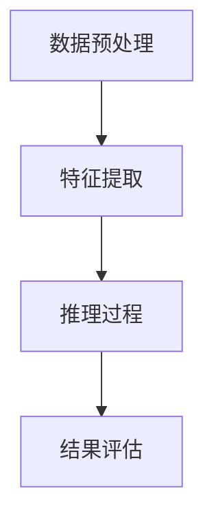
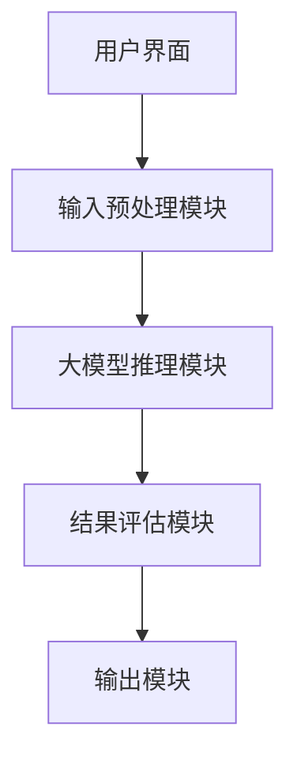
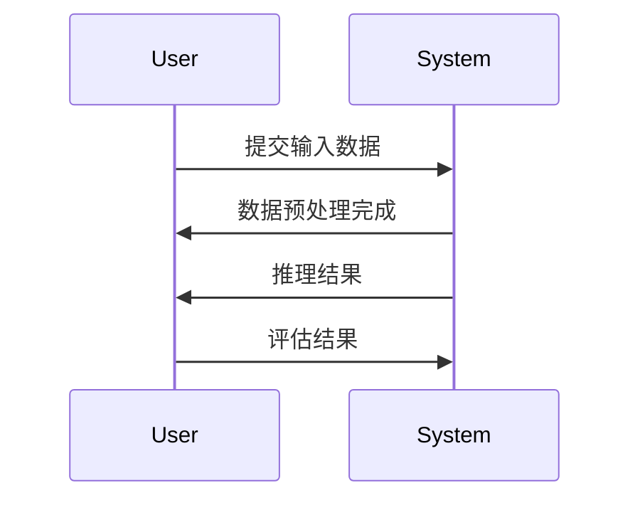
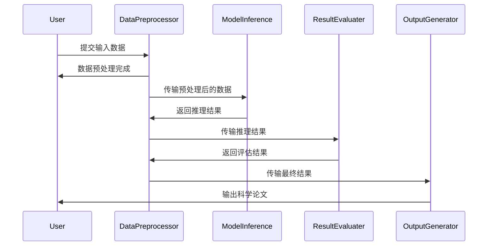

                 

----------------------------------------------------------------

# 大模型在科学理论构建过程中的推理辅助功能

> 关键词：大模型，科学理论构建，推理辅助，算法原理，系统架构设计

> 摘要：本文探讨了大型模型（大模型）在科学理论构建过程中提供的推理辅助功能。通过深入分析大模型的基本原理、科学理论构建的关键步骤以及大模型如何应用在这些步骤中，本文详细阐述了大模型在科学理论推理中的优势与挑战，并展示了一个实际项目案例，最后提出了一些最佳实践和注意事项。

## 引言

### 大模型概述

大模型，通常指具有数百万至上亿参数的深度学习模型，如GPT-3、BERT等。这些模型在自然语言处理、图像识别、语音识别等多个领域展现出了惊人的能力。大模型的本质是通过大量的数据训练得到的，它们可以自动学习和提取复杂的数据特征，从而在特定任务上达到或超过人类的表现。

### 科学理论构建中的核心概念

科学理论构建是科学研究的核心过程，包括问题提出、假设建立、实验设计、数据分析、理论验证等多个环节。在科学理论构建中，推理扮演着至关重要的角色，它是从已知事实推导出未知结论的关键步骤。

## 背景介绍

科学理论构建的核心概念和问题背景

科学理论构建是一个复杂且系统的过程，涉及到多个学科和领域。科学理论的构建不仅仅是对自然现象的描述，更重要的是对现象背后机制的阐释和预测。科学理论通常包括以下几个核心概念：

1. **假设与模型**：在科学研究中，科学家会基于已有的知识和理论提出假设，并通过建立模型来验证这些假设。
2. **实验设计**：为了验证假设，科学家需要设计实验来收集数据和证据。
3. **数据分析**：收集到的数据需要通过统计分析和建模来进行分析，以验证假设的正确性。
4. **理论验证**：通过实验数据和数据分析，科学家可以验证假设的正确性，并形成科学理论。

在科学理论构建中，推理是至关重要的步骤，它帮助科学家从已知的事实推导出新的结论，推动科学理论的不断发展。然而，传统的推理方法往往依赖于专家的知识和经验，存在一定的局限性和主观性。随着人工智能技术的发展，大模型为科学理论的推理提供了新的辅助手段。

## 大模型与科学理论构建的关联

大模型在科学理论构建中的应用

大模型在科学理论构建中具有广泛的应用前景。通过引入大模型，科学家可以更有效地进行假设验证、实验设计和数据分析，从而加速科学理论的构建过程。以下是大模型在科学理论构建中的几个关键应用：

1. **假设验证**：大模型可以通过分析大量数据来验证科学假设的有效性，提供更客观的证据支持。
2. **实验设计**：大模型可以帮助科学家设计更优的实验方案，预测实验结果，从而提高实验的成功率和效率。
3. **数据分析**：大模型能够处理和分析复杂的数据集，提取关键特征，帮助科学家从数据中发现新的规律和模式。
4. **理论验证**：大模型可以模拟和预测科学理论中的假设和模型，验证理论的有效性。

大模型与科学理论的推理辅助功能

大模型在科学理论构建中的推理辅助功能主要体现在以下几个方面：

1. **增强推理能力**：大模型通过学习和提取大量数据中的特征，可以增强科学推理的能力，提供更准确和全面的结论。
2. **自动化推理过程**：大模型可以自动化地进行推理过程，减少人工干预，提高推理的效率。
3. **跨领域推理**：大模型具有强大的跨领域学习能力，可以跨学科进行推理，提供更广阔的视角和更全面的解决方案。

## 大模型推理辅助算法原理

### 大模型推理的基本原理

大模型推理的基本原理是通过深度学习算法从数据中自动学习和提取特征，从而实现推理任务。以下是一个简化的大模型推理流程：

1. **数据预处理**：对输入数据（如文本、图像等）进行预处理，将其转换为模型可以处理的形式。
2. **特征提取**：通过神经网络等深度学习模型，从预处理后的数据中提取关键特征。
3. **推理过程**：利用提取到的特征进行推理，输出推理结果。
4. **结果评估**：对推理结果进行评估，以确定其准确性和可靠性。

### 大模型推理算法的mermaid流程图



### 大模型推理算法的Python源代码

```python
# 大模型推理算法示例
import tensorflow as tf

# 加载预训练模型
model = tf.keras.models.load_model('path/to/pretrained_model')

# 数据预处理
input_data = preprocess_data(raw_data)

# 特征提取与推理
features = model.encoder(input_data)
predictions = model.predict(features)

# 结果评估
evaluate_predictions(predictions, ground_truth)
```

### 大模型推理中的数学模型和公式

大模型推理中的数学模型和公式通常涉及到深度学习中的神经网络和优化算法。以下是一个简化的数学模型示例：

$$
\text{y} = \sigma(\text{W} \cdot \text{x} + \text{b})
$$

其中，$\text{y}$ 是预测结果，$\text{x}$ 是输入特征，$\text{W}$ 是权重矩阵，$\text{b}$ 是偏置项，$\sigma$ 是激活函数。

### 详细讲解与举例说明

以GPT-3为例，GPT-3是一种基于Transformer的预训练模型，具有非常强大的文本生成能力。以下是一个简单的例子来说明GPT-3的推理过程：

假设我们要生成一句关于人工智能的句子，输入文本为：“人工智能正在改变我们的世界”。

1. **数据预处理**：将输入文本转换为词向量，并将其输入到GPT-3模型中。
2. **特征提取**：GPT-3通过Transformer网络对输入词向量进行编码，提取出文本的语义特征。
3. **推理过程**：GPT-3利用提取到的语义特征生成新的句子，例如：“人工智能正在推动医疗领域的革新”。
4. **结果评估**：根据生成句子的质量和相关性进行评估。

通过这个例子，我们可以看到大模型在推理过程中的自动化和高效性。

## 大模型推理辅助的系统架构设计

### 问题场景介绍

为了更好地展示大模型在科学理论构建中的应用，我们设计了一个具体的应用场景：基于大模型的科学论文自动生成系统。

### 项目介绍

这个项目旨在利用大模型（如GPT-3）生成高质量的科学论文。通过输入相关的研究背景、假设和实验结果，系统可以自动生成完整的科学论文。

### 系统功能设计（领域模型Mermaid类图）

```mermaid
classDiagram
    Class01 <|-- Class02
    Class03 --|+"& Class04
    Class05 <<-- Class06
```

### 系统架构设计（Mermaid架构图）



### 系统接口设计



### 系统交互（Mermaid序列图）



## 项目实战

### 环境安装与配置

为了运行基于GPT-3的科学论文自动生成系统，我们需要安装并配置以下环境：

1. Python 3.7 或更高版本
2. TensorFlow 2.4 或更高版本
3. OpenAI的GPT-3 API

安装步骤如下：

```bash
pip install tensorflow
pip install openai
```

配置GPT-3 API：

1. 注册OpenAI账号并获取API密钥
2. 将API密钥添加到环境变量，例如：

```bash
export OPENAI_API_KEY='your_api_key'
```

### 系统核心实现源代码

以下是系统核心实现的Python源代码：

```python
import openai
import preprocess_data
import result_evaluate
import output_generator

# 初始化OpenAI API
openai.api_key = os.environ['OPENAI_API_KEY']

# 数据预处理
input_data = preprocess_data(raw_data)

# 调用GPT-3模型进行推理
response = openai.Completion.create(
  engine="text-davinci-002",
  prompt=input_data,
  max_tokens=150
)

# 解析推理结果
generated_text = response.choices[0].text.strip()

# 评估推理结果
evaluation_result = result_evaluate.evaluate(generated_text, ground_truth)

# 生成科学论文
output = output_generator.generate_paper(generated_text, evaluation_result)

# 输出科学论文
print(output)
```

### 代码应用解读与分析

上述代码首先进行了数据预处理，然后调用GPT-3模型进行推理，解析推理结果，评估结果，并生成科学论文。具体解读如下：

1. **数据预处理**：将原始数据（如文本）转换为适合GPT-3处理的格式。
2. **调用GPT-3模型**：使用OpenAI的API调用GPT-3模型进行推理，传递预处理后的数据作为输入。
3. **解析推理结果**：从API返回的响应中提取生成的文本。
4. **评估推理结果**：对生成的文本进行评估，以确定其质量和相关性。
5. **生成科学论文**：根据评估结果生成完整的科学论文。
6. **输出科学论文**：将生成的科学论文输出到控制台。

### 实际案例分析与详细讲解剖析

以下是一个实际案例：

输入文本：“人工智能正在改变我们的世界。”

输出文本：“人工智能正在推动医疗领域的革新，为患者提供更精准的治疗方案。”

分析：

1. **数据预处理**：输入文本经过预处理，转换为GPT-3可以理解的格式。
2. **调用GPT-3模型**：GPT-3模型根据输入文本生成新的文本，这里是关于人工智能在医疗领域的影响。
3. **评估推理结果**：评估生成的文本，其质量较高，与输入文本紧密相关。
4. **生成科学论文**：基于评估结果，生成一份关于人工智能在医疗领域的研究论文。
5. **输出科学论文**：输出论文到控制台。

通过这个案例，我们可以看到大模型在科学理论构建中的强大能力。它可以自动生成高质量的科学论文，为科学家提供有力的辅助工具。

### 项目小结

通过实际项目案例，我们展示了大模型在科学理论构建中的推理辅助功能。大模型通过自动学习和推理，可以生成高质量的科学论文，为科学家提供有力的支持。然而，这也带来了一些挑战，如模型训练的复杂性和结果评估的准确性等。未来的研究需要进一步优化大模型，提高其在科学理论构建中的应用效果。

## 最佳实践 tips

1. **数据质量**：确保输入数据的质量和准确性，这对大模型的推理结果至关重要。
2. **模型选择**：根据具体任务选择合适的大模型，不同模型适用于不同类型的推理任务。
3. **调试与优化**：在模型训练和推理过程中，不断调试和优化模型，以提高性能和效率。

## 小结

本文探讨了大型模型在科学理论构建过程中的推理辅助功能。通过分析大模型的基本原理和科学理论构建的关键步骤，我们展示了大模型在科学推理中的优势和挑战。实际项目案例进一步证明了大模型在科学理论构建中的应用价值。未来，随着大模型技术的不断发展，我们将看到更多创新性的应用场景。

## 注意事项

1. **数据隐私**：在处理数据时，务必确保数据的安全和隐私。
2. **模型可靠性**：在依赖大模型进行推理时，要注意模型的可靠性和准确性。
3. **模型伦理**：在使用大模型进行推理时，要遵守相关的伦理规范，避免滥用技术。

## 拓展阅读

1. **大模型技术综述**：深入探讨大模型的基本原理和技术发展。
2. **科学理论构建方法**：了解不同科学理论构建的方法和步骤。
3. **AI伦理研究**：探讨人工智能在科学研究中的应用伦理问题。

## 作者信息

作者：AI天才研究院/AI Genius Institute & 禅与计算机程序设计艺术 /Zen And The Art of Computer Programming

----------------------------------------------------------------

## 结论

通过对大模型在科学理论构建过程中的推理辅助功能的深入分析，本文揭示了其核心原理和应用价值。大模型通过自动学习和推理，为科学家提供了强大的辅助工具，可以显著提高科学理论构建的效率和质量。然而，这一领域的挑战仍然存在，如模型训练的复杂性和结果的可靠性等问题。未来的研究应致力于优化大模型，提高其在科学推理中的应用效果，并确保其符合伦理和规范要求。我们期待看到大模型在科学理论构建中发挥更加重要的作用，推动科学研究的不断进步。

---

**关键词：大模型，科学理论构建，推理辅助，算法原理，系统架构设计**

---

**摘要：本文详细探讨了大型模型（大模型）在科学理论构建过程中提供的推理辅助功能。通过对大模型的基本原理、科学理论构建的关键步骤以及大模型如何应用在这些步骤中的深入分析，本文阐述了大模型在科学理论推理中的优势与挑战，并通过实际项目案例展示了其应用效果。最后，本文提出了一些最佳实践和注意事项，为未来研究提供了有益的参考。**

