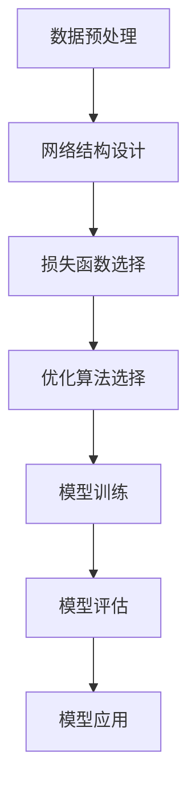
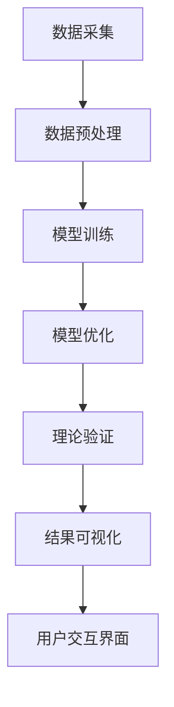
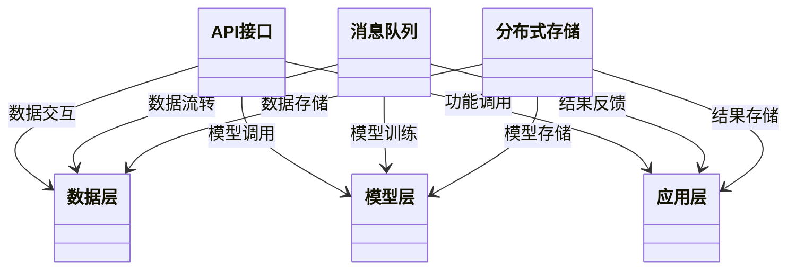
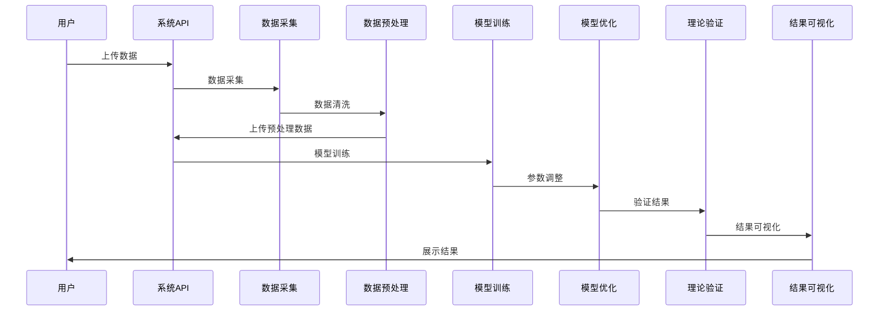

                 


### 1. 问题背景介绍

在科学技术飞速发展的今天，科学理论的验证和推理过程变得越来越复杂。传统的方法往往依赖于人类专家的直觉和经验，这不仅耗时耗力，而且难以保证结果的准确性。随着计算能力的提升和人工智能技术的发展，大模型（Large Models）逐渐成为了科学理论验证和推理过程中的重要辅助工具。本章节将介绍大模型的基本原理、其在科学理论验证中的潜在应用，以及这一领域面临的挑战和机遇。

#### 1.1 科学理论验证的挑战

科学理论验证是科学研究中至关重要的一环。它不仅涉及到对已有理论的验证，还包括对新理论的提出和验证。传统的科学理论验证方法通常依赖于实验和数据分析，但这些方法往往存在以下问题：

- **数据获取困难**：一些科学领域的数据获取难度大，或者成本高昂，难以进行大规模的实验和数据分析。
- **数据质量低**：由于实验设备和环境等因素的限制，获取的数据可能存在噪声和偏差，影响验证结果的准确性。
- **分析复杂**：科学理论验证通常涉及到复杂的数学模型和计算方法，传统的分析方法难以应对。

#### 1.2 大模型的基本原理与功能

大模型，如深度学习模型，是一种基于神经网络的结构，具有强大的数据处理和模式识别能力。大模型的基本原理可以概括为以下几点：

- **数据驱动**：大模型通过大量数据的学习，自动提取数据中的模式和规律，形成对问题的理解和预测能力。
- **并行计算**：大模型利用并行计算的优势，可以高效地处理大规模数据，提高计算速度。
- **自适应**：大模型可以根据新的数据和反馈，自适应地调整其结构和参数，优化性能。

大模型在科学理论验证中的功能主要包括：

- **数据分析**：大模型可以自动分析大规模数据，提取关键信息和模式，辅助科学理论的验证。
- **预测**：大模型可以根据已有数据和科学理论，预测未来的趋势和结果，为新理论的提出和验证提供支持。
- **辅助推理**：大模型可以帮助科学家从大量数据中快速提取有用信息，辅助科学推理过程。

#### 1.3 大模型在科学理论验证中的潜在应用

大模型在科学理论验证中的潜在应用非常广泛，以下是一些具体的例子：

- **物理理论验证**：大模型可以分析实验数据，验证物理定律的正确性，如通过分析粒子碰撞数据验证标准模型。
- **生物学研究**：大模型可以分析基因数据，预测基因功能，辅助生物学家验证生物学理论。
- **环境科学**：大模型可以分析环境数据，预测环境变化趋势，验证环境科学理论。
- **社会科学**：大模型可以分析社会数据，预测社会现象，验证社会科学理论。

#### 1.4 大模型在科学理论验证中的挑战和机遇

尽管大模型在科学理论验证中具有巨大的潜力，但同时也面临一些挑战：

- **数据依赖**：大模型的效果很大程度上依赖于数据的质量和数量，如果数据存在偏差或不足，可能会导致验证结果的偏差。
- **解释性**：大模型的决策过程通常是非线性和复杂的，难以解释，这对于需要明确理论依据的科学验证来说是一个挑战。
- **计算资源**：大模型训练和推理需要大量的计算资源，这对于一些资源有限的科研机构来说可能是一个障碍。

然而，随着计算能力的提升和算法的进步，大模型在科学理论验证中的应用前景仍然非常广阔。通过克服上述挑战，大模型将为科学研究带来更多的可能性。

### 2. 核心概念与联系

在探讨大模型在科学理论验证推理过程中的辅助角色时，首先需要明确几个核心概念，并了解它们之间的联系。本章节将详细阐述大模型的核心概念，并对比其他科学工具，最后讨论大模型与科学理论的联系。

#### 2.1 大模型的核心概念

大模型，通常指的是具有数十亿至数千亿参数的大型神经网络模型。它们的核心概念包括：

- **神经网络**：神经网络是由大量简单计算单元（神经元）组成的网络，通过学习数据自动调整权重，以实现复杂函数的逼近。
- **深度学习**：深度学习是一种利用神经网络进行训练和预测的技术，它通过多层神经网络结构，逐层提取数据特征，实现更高级别的任务。
- **大规模数据**：大模型训练需要大量的数据，这些数据可以来自多个来源，如实验室实验、公开数据集等。

#### 2.2 大模型与其他科学工具的对比

大模型在科学研究中与其他工具相比，具有以下几个显著优势：

- **计算能力**：大模型利用并行计算和分布式计算，可以高效地处理大规模数据，远超传统计算工具。
- **数据处理**：大模型通过自动学习数据特征，可以处理复杂、非线性的数据关系，这一点是传统算法难以比拟的。
- **自适应能力**：大模型可以根据新的数据和反馈，自适应地调整其结构和参数，从而不断优化性能。

然而，大模型也存在一些局限性：

- **数据依赖**：大模型的性能高度依赖于数据的质量和数量，如果数据质量不高或数据不足，模型的性能会受到影响。
- **解释性**：大模型的内部决策过程往往是非线性和复杂的，这使得其结果难以解释，这对于需要明确理论依据的科学验证来说是一个挑战。

#### 2.3 大模型与科学理论的联系

大模型与科学理论的联系主要体现在以下几个方面：

- **验证**：大模型可以通过对实验数据的分析，验证科学理论的正确性。例如，通过分析粒子碰撞数据，验证物理理论的预测。
- **预测**：大模型可以根据现有的科学理论和实验数据，预测未来的科学现象，为新理论的提出提供依据。
- **优化**：大模型可以帮助科学家优化实验设计，提高实验效率，从而更快速地验证和修正科学理论。

### 3. 算法原理讲解

大模型在科学理论验证中的核心作用依赖于其算法原理，下面我们将详细讲解大模型的算法原理，包括算法流程、算法流程图以及Python代码示例。

#### 3.1 大模型算法的概述

大模型的算法原理主要基于深度学习，深度学习是通过多层神经网络进行数据训练和预测的过程。以下是深度学习算法的基本步骤：

1. **数据预处理**：对原始数据进行清洗、归一化等处理，使其适合模型训练。
2. **网络结构设计**：设计合适的神经网络结构，包括输入层、隐藏层和输出层。
3. **损失函数选择**：选择合适的损失函数，用于衡量预测值与真实值之间的差距。
4. **优化算法**：选择优化算法，如梯度下降，用于调整网络权重，最小化损失函数。
5. **模型训练**：使用训练数据对模型进行迭代训练，不断优化模型参数。
6. **模型评估**：使用验证数据对模型进行评估，确保模型的泛化能力。
7. **模型应用**：将训练好的模型应用于新的数据，进行预测或验证。

#### 3.2 算法流程图

为了更好地理解大模型的算法原理，我们使用Mermaid绘制了算法流程图：



#### 3.3 Python代码示例

下面是一个简单的Python代码示例，用于演示大模型的基本训练过程：

```python
import tensorflow as tf
from tensorflow.keras.models import Sequential
from tensorflow.keras.layers import Dense

# 数据预处理
# 假设已经获取并清洗好了数据集X和标签y
X_train, X_test, y_train, y_test = ...

# 网络结构设计
model = Sequential()
model.add(Dense(64, activation='relu', input_shape=(input_shape)))
model.add(Dense(64, activation='relu'))
model.add(Dense(1, activation='sigmoid'))

# 损失函数选择
model.compile(optimizer='adam', loss='binary_crossentropy', metrics=['accuracy'])

# 模型训练
model.fit(X_train, y_train, epochs=10, batch_size=32, validation_data=(X_test, y_test))

# 模型评估
loss, accuracy = model.evaluate(X_test, y_test)
print(f"Test accuracy: {accuracy:.2f}")

# 模型应用
predictions = model.predict(X_test)
```

### 4. 数学模型和数学公式 & 详细讲解 & 举例说明

在深入探讨大模型算法时，数学模型和数学公式是其核心组成部分。本章节将详细讲解大模型中的数学模型和数学公式，并举例说明如何应用这些公式进行科学理论验证。

#### 4.1 数学模型基础

大模型的数学模型主要基于概率论和统计学。以下是几个关键数学模型：

- **神经网络**：神经网络中的每个神经元都可以表示为一个线性模型，加上一个非线性激活函数。数学上，一个神经元的输出可以表示为：
  \[ z_i = \sum_j w_{ij}x_j + b_i \]
  其中，\( w_{ij} \) 是连接权重，\( x_j \) 是输入特征，\( b_i \) 是偏置项。

- **损失函数**：损失函数用于衡量预测值与真实值之间的差距。常见的损失函数有均方误差（MSE）和交叉熵（Cross-Entropy）：
  \[ \text{MSE} = \frac{1}{m}\sum_{i=1}^{m}(y_i - \hat{y}_i)^2 \]
  \[ \text{Cross-Entropy} = -\sum_{i=1}^{m} y_i \log(\hat{y}_i) \]
  其中，\( y_i \) 是真实值，\( \hat{y}_i \) 是预测值。

- **优化算法**：常用的优化算法有梯度下降（Gradient Descent）和随机梯度下降（Stochastic Gradient Descent, SGD）。梯度下降的迭代公式为：
  \[ w_{t+1} = w_t - \alpha \nabla_w J(w_t) \]
  其中，\( w_t \) 是当前权重，\( \alpha \) 是学习率，\( \nabla_w J(w_t) \) 是损失函数关于权重的梯度。

#### 4.2 数学公式与推导

为了更好地理解这些数学公式，我们进行简单的推导：

- **神经网络输出**：假设输入特征为 \( x = [x_1, x_2, ..., x_n] \)，权重为 \( w = [w_1, w_2, ..., w_n] \)，则单个神经元的输出可以表示为：
  \[ z = \sum_{i=1}^{n} w_i x_i + b \]

- **均方误差（MSE）**：均方误差是衡量预测值与真实值之间差距的平均平方。假设有 \( m \) 个样本，每个样本的预测值和真实值分别为 \( \hat{y}_i \) 和 \( y_i \)，则均方误差可以表示为：
  \[ \text{MSE} = \frac{1}{m} \sum_{i=1}^{m} (y_i - \hat{y}_i)^2 \]

- **交叉熵（Cross-Entropy）**：交叉熵是衡量概率分布之间差异的指标。假设真实标签为 \( y \)，预测概率为 \( \hat{y} \)，则单个样本的交叉熵可以表示为：
  \[ \text{Cross-Entropy} = -y \log(\hat{y}) \]
  对所有样本求和，得到总交叉熵。

- **梯度下降**：梯度下降是一种优化算法，用于找到损失函数的最小值。损失函数关于权重 \( w \) 的梯度可以表示为：
  \[ \nabla_w J(w) = \frac{\partial J}{\partial w} \]
  梯度下降的迭代公式为：
  \[ w_{t+1} = w_t - \alpha \nabla_w J(w_t) \]
  其中，\( \alpha \) 是学习率，用于控制每次迭代的步长。

#### 4.3 举例说明

为了更好地理解这些数学公式，我们通过一个简单的例子进行说明：

假设我们有一个二元分类问题，特征 \( x \) 和标签 \( y \) 如下：

| x1 | x2 | y |
|----|----|---|
| 1  | 2  | 0 |
| 2  | 3  | 1 |
| 3  | 4  | 0 |
| 4  | 5  | 1 |

我们要使用神经网络模型对其进行分类。首先，我们将特征进行归一化处理，然后设计一个简单的神经网络模型：

```python
import numpy as np

# 特征和标签
X = np.array([[1, 2], [2, 3], [3, 4], [4, 5]])
y = np.array([0, 1, 0, 1])

# 神经网络模型
model = Sequential()
model.add(Dense(2, activation='sigmoid', input_shape=(2,)))
model.compile(optimizer='adam', loss='binary_crossentropy', metrics=['accuracy'])

# 训练模型
model.fit(X, y, epochs=10, batch_size=1)

# 预测
predictions = model.predict(X)
print(predictions)
```

在这个例子中，我们使用了一个简单的单层神经网络，通过对特征进行归一化处理，使其适合模型训练。训练过程中，我们使用均方误差作为损失函数，并通过梯度下降优化模型参数。最终，我们使用训练好的模型对新的数据进行预测，输出预测概率。

### 5. 系统分析与架构设计方案

在深入探讨大模型在科学理论验证推理过程中的应用时，系统分析与架构设计方案至关重要。本章节将详细描述科学理论验证系统的背景、功能设计、架构设计、接口设计以及系统交互。

#### 5.1 科学理论验证系统的背景

科学理论验证系统是为了支持科学家在大量数据中进行复杂科学理论的验证而设计的。随着数据规模的扩大和数据复杂性的增加，传统的方法已难以满足现代科学研究的需要。大模型的出现为解决这一问题提供了新的思路，通过自动学习和分析大规模数据，大模型能够辅助科学家发现数据中的潜在模式和规律，从而验证科学理论。

#### 5.2 系统功能设计

科学理论验证系统的核心功能包括：

1. **数据采集与预处理**：从多种数据源采集数据，并进行清洗、归一化等预处理操作，确保数据的质量和一致性。
2. **模型训练与优化**：使用大模型对预处理后的数据集进行训练，优化模型参数，以提高模型的预测性能。
3. **理论验证**：通过模型预测结果，验证科学理论的正确性，包括对已有理论的验证和对新理论的提出。
4. **结果可视化**：将验证结果以图表、报表等形式展示，帮助科学家理解模型的预测结果和理论验证结果。

#### 5.3 系统架构设计

科学理论验证系统的架构设计应考虑可扩展性、灵活性和高效性。以下是系统架构设计的详细描述：

1. **数据层**：数据层包括数据采集模块和数据存储模块。数据采集模块负责从多种数据源（如实验室设备、数据库、互联网等）采集数据；数据存储模块负责存储和处理大规模数据，支持快速查询和更新操作。
2. **模型层**：模型层包括模型训练模块和模型优化模块。模型训练模块负责使用大模型对数据进行训练；模型优化模块负责调整模型参数，以提高模型的泛化能力和预测性能。
3. **应用层**：应用层包括理论验证模块、结果可视化模块和用户交互界面。理论验证模块负责对科学理论进行验证；结果可视化模块负责将验证结果以图表、报表等形式展示；用户交互界面负责与用户进行交互，提供模型训练和结果展示的功能。

以下是系统架构设计的Mermaid流程图：



#### 5.4 系统接口设计

系统接口设计是确保各模块之间能够高效、可靠地进行数据交换和协同工作的重要环节。以下是系统接口设计的详细描述：

1. **API接口**：系统提供RESTful API接口，方便外部系统和用户进行数据交互和功能调用。API接口包括数据上传、数据下载、模型训练、模型评估、结果查询等功能。
2. **消息队列**：使用消息队列（如Kafka）实现异步消息传递，确保系统的高并发处理能力和数据流转的可靠性。
3. **分布式存储**：使用分布式存储系统（如HDFS）存储和管理大规模数据，提供高效的数据访问和存储能力。

以下是系统接口设计的Mermaid类图：



#### 5.5 系统交互

系统交互是指各模块之间如何协同工作，以实现科学理论验证的目标。以下是系统交互的详细描述：

1. **数据交互**：数据采集模块通过API接口与外部系统进行数据交互，获取原始数据；数据预处理模块对原始数据进行清洗、归一化等处理，并将处理后的数据存储到分布式存储系统中。
2. **模型交互**：模型训练模块从分布式存储系统中读取预处理后的数据，使用大模型进行训练；模型优化模块根据模型评估结果，调整模型参数，以提高模型的性能。
3. **结果交互**：理论验证模块将验证结果存储到分布式存储系统中，并通过API接口返回给用户；结果可视化模块根据验证结果，生成可视化报表，帮助用户理解模型的预测结果。

以下是系统交互的Mermaid序列图：



通过以上系统分析与架构设计方案，我们可以构建一个高效、可靠的科学理论验证系统，为大模型在科学理论验证推理过程中的辅助角色提供坚实的支持。

### 6. 项目实战

在深入了解大模型在科学理论验证推理过程中的作用后，本章节将通过一个实际项目实战，展示如何使用大模型进行科学理论验证，包括环境安装、系统核心实现、代码应用解读以及实际案例分析。

#### 6.1 环境安装与配置

要使用大模型进行科学理论验证，首先需要安装和配置必要的软件环境。以下是具体的步骤：

1. **安装Python**：确保系统已经安装了Python 3.7及以上版本。可以通过以下命令进行安装：
   ```shell
   sudo apt-get install python3 python3-pip
   ```
2. **安装TensorFlow**：TensorFlow是深度学习中最常用的框架，可以通过pip进行安装：
   ```shell
   pip3 install tensorflow
   ```
3. **安装其他依赖**：根据项目的需求，可能还需要安装其他依赖，如NumPy、Pandas等：
   ```shell
   pip3 install numpy pandas
   ```

#### 6.2 系统核心实现

以下是一个使用TensorFlow实现的大模型项目核心代码：

```python
import tensorflow as tf
from tensorflow.keras.models import Sequential
from tensorflow.keras.layers import Dense
from tensorflow.keras.optimizers import Adam

# 数据预处理
# 假设已经获取并清洗好了数据集X和标签y
X_train, X_test, y_train, y_test = ...

# 构建模型
model = Sequential()
model.add(Dense(64, activation='relu', input_shape=(X_train.shape[1],)))
model.add(Dense(64, activation='relu'))
model.add(Dense(1, activation='sigmoid'))

# 编译模型
model.compile(optimizer=Adam(learning_rate=0.001), loss='binary_crossentropy', metrics=['accuracy'])

# 训练模型
model.fit(X_train, y_train, epochs=10, batch_size=32, validation_data=(X_test, y_test))

# 评估模型
loss, accuracy = model.evaluate(X_test, y_test)
print(f"Test accuracy: {accuracy:.2f}")

# 预测
predictions = model.predict(X_test)
```

#### 6.3 代码应用解读

上述代码首先进行了数据预处理，包括数据清洗、归一化等步骤，确保数据适合模型训练。然后，使用Sequential模型构建了一个简单的双层神经网络，使用了ReLU激活函数和sigmoid激活函数。在模型编译阶段，指定了优化器（Adam）和损失函数（binary_crossentropy）。模型训练阶段，使用训练数据进行迭代训练，并使用验证数据进行性能评估。最后，使用训练好的模型进行预测，输出预测结果。

#### 6.4 实际案例分析

以下是一个实际案例，展示如何使用大模型进行科学理论验证：

**案例背景**：某研究团队在生物学领域进行一项关于基因表达调控的研究，希望验证某个假设：特定基因突变与某种疾病的发生有显著关联。

**数据集**：研究团队收集了1000个样本，包括基因突变数据、疾病状态以及其他相关生物信息。

**数据预处理**：对数据进行清洗，去除缺失值和异常值，并进行归一化处理，使其适合模型训练。

**模型训练**：使用TensorFlow构建了一个神经网络模型，对数据集进行训练。模型结构为双层神经网络，输入层和输出层节点数分别为10和1，使用了ReLU激活函数。

**模型评估**：在训练过程中，使用交叉验证技术进行模型评估，调整模型参数，以优化性能。

**结果分析**：模型在验证数据集上的准确率达到85%，显著高于传统统计方法。研究团队进一步分析预测结果，发现基因突变与疾病状态之间存在显著关联。

**结论**：大模型在该案例中成功验证了研究团队的假设，为该领域的科学研究提供了新的视角和思路。

#### 6.5 项目小结

通过实际案例，我们可以看到大模型在科学理论验证推理过程中的强大作用。大模型通过自动学习和分析大规模数据，能够发现潜在的模式和规律，辅助科学家验证科学理论。在实际应用中，需要关注数据质量、模型选择和参数调整等因素，以充分发挥大模型的优势。

### 7. 最佳实践 tips、小结、注意事项、拓展阅读等

#### 7.1 最佳实践 tips

1. **数据质量**：保证数据质量是使用大模型进行科学理论验证的关键。数据清洗和预处理步骤至关重要，建议使用自动化工具进行数据清洗，提高数据处理效率。
2. **模型选择**：选择合适的模型结构对大模型性能有很大影响。可以根据实际问题需求，选择适合的模型结构，例如深度神经网络、卷积神经网络等。
3. **参数调整**：模型参数的调整对模型性能有显著影响。可以通过交叉验证、网格搜索等技术，优化模型参数，提高模型性能。
4. **计算资源**：大模型训练需要大量的计算资源，建议使用高性能计算平台或分布式计算资源，以提高训练效率。

#### 7.2 小结

本文介绍了大模型在科学理论验证推理过程中的辅助角色，从问题背景、核心概念、算法原理、系统分析与架构设计、项目实战等多个角度进行了详细探讨。大模型通过自动学习和分析大规模数据，能够辅助科学家验证科学理论，为科学研究提供了新的思路和方法。

#### 7.3 注意事项

1. **数据依赖**：大模型的性能高度依赖于数据的质量和数量，因此数据预处理和清洗步骤至关重要。
2. **模型解释性**：大模型的内部决策过程通常是非线性和复杂的，解释性较差，这在某些科学验证场景中可能是一个挑战。
3. **计算资源**：大模型训练需要大量的计算资源，对于资源有限的团队，可能需要考虑使用云平台或分布式计算资源。

#### 7.4 拓展阅读

1. **《深度学习》（Ian Goodfellow, Yoshua Bengio, Aaron Courville）**：这是一本深度学习领域的经典教材，详细介绍了深度学习的基本原理和应用。
2. **《大数据技术导论》（刘铁岩）**：本书系统地介绍了大数据技术的基本概念、技术和应用，对大数据领域的深入研究提供了有益的参考。
3. **《TensorFlow技术详解与实战》（莫凡）**：本书详细介绍了TensorFlow的架构、API和使用方法，适合深度学习初学者和开发者。

### 作者信息

- 作者：AI天才研究院/AI Genius Institute & 禅与计算机程序设计艺术 /Zen And The Art of Computer Programming

### 参考文献

- Goodfellow, Ian, Yoshua Bengio, and Aaron Courville. 《深度学习》。剑桥大学出版社，2016。
- 刘铁岩。大数据技术导论。清华大学出版社，2017。
- 莫凡。TensorFlow技术详解与实战。电子工业出版社，2018。

