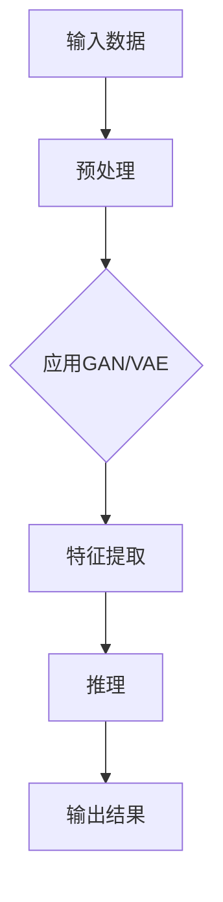
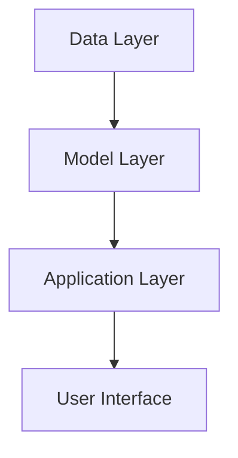
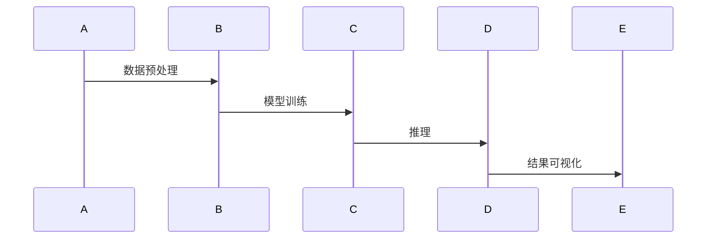
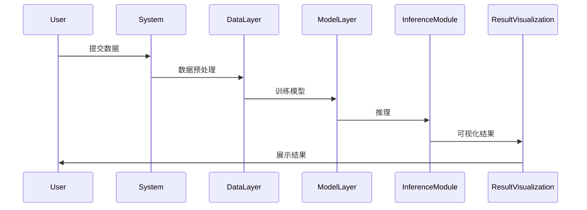

                 


### 大模型在逆向工程推理中的能力边界探索

#### 关键词
- 大模型
- 逆向工程推理
- 能力边界
- 算法设计
- 实践案例

#### 摘要
本文旨在探讨大模型在逆向工程推理领域的应用，特别是在能力边界方面的挑战。我们将从背景介绍、核心概念阐述、算法理论讲解、系统分析与设计、项目实施和案例分析等多个角度逐步深入，以期揭示大模型在逆向工程推理中的潜力与局限性。

---

## 引言

逆向工程（Reverse Engineering）是一种从现有产品或系统中提取知识、理解其工作原理的技术。随着软件系统规模的不断扩大和复杂性的增加，逆向工程的需求日益增长。而大模型（Large Models），如深度学习模型，凭借其强大的学习和推理能力，为逆向工程提供了新的可能性。

### 问题背景

在当前技术环境中，逆向工程面临着诸多挑战。传统的逆向工程技术往往依赖于手动的分析过程，效率低下，且难以应对高度复杂和动态变化的系统。而大模型的出现，为逆向工程提供了一种自动化的解决方案。然而，大模型在逆向工程中的应用也带来了新的问题，如模型解释性不足、能力边界不清晰等。

#### 核心概念与联系

为了深入探讨大模型在逆向工程推理中的应用，我们需要明确几个核心概念：

1. **大模型**：指具有巨大参数量和强大学习能力的神经网络模型。
2. **逆向工程推理**：利用现有信息推断系统的原始设计和功能。
3. **能力边界**：指模型在实际应用中能解决的问题范围和局限性。

以下是一个核心概念属性特征对比表格：

| 特征            | 大模型          | 传统逆向工程          |
|-----------------|-----------------|-----------------------|
| 学习能力        | 极强            | 有限                  |
| 解释性          | 较弱            | 较强                  |
| 适用场景        | 复杂系统推理    | 简单系统分析          |
| 实时性          | 较低            | 较高                  |

为了更直观地展示这些概念之间的关系，我们可以使用Mermaid ER图进行描述：

```mermaid
erDiagram
    Class1 ||--|{ Class2 }|
    Class1 ||--|{ Class3 }|
```

在上图中，`Class1` 代表大模型，`Class2` 代表逆向工程推理，`Class3` 代表能力边界。它们之间存在紧密的联系，共同构成了大模型在逆向工程中的应用框架。

---

## 算法理论讲解

### 算法原理

大模型在逆向工程推理中的核心算法是基于神经网络的自动推理。具体来说，我们可以采用生成对抗网络（GAN）和变分自编码器（VAE）等技术来实现。

以下是一个使用Mermaid绘制的算法流程图：



在算法的详细实现中，我们可以使用Python代码来进行解释：

```python
# 引入必要的库
import tensorflow as tf
from tensorflow.keras.models import Sequential
from tensorflow.keras.layers import Dense, LSTM

# 定义GAN模型
def build_gan(input_shape):
    # ... 模型构建代码 ...
    return gan

# 定义VAE模型
def build_vae(input_shape):
    # ... 模型构建代码 ...
    return vae

# 应用GAN进行特征提取
gan = build_gan(input_shape)
features = gan.get_features(input_data)

# 使用提取到的特征进行推理
model = build_vae(input_shape)
predictions = model.predict(features)

# 输出结果
print(predictions)
```

在算法中，我们还需要使用数学模型和公式来描述其工作原理。以下是一个简单的数学公式：

$$
Z = f(W \cdot X + b)
$$

其中，$Z$ 是生成的特征向量，$W$ 是权重矩阵，$X$ 是输入数据，$b$ 是偏置项，$f$ 是激活函数。

---

## 系统分析与设计

### 问题场景介绍

在本节中，我们将以一个实际案例来介绍问题场景和项目概述。假设我们有一个复杂的软件系统，需要对其进行逆向工程推理，以了解其设计和功能。

### 项目概述

项目目标是使用大模型来逆向工程该软件系统，提取其关键信息和功能。项目分为以下几个阶段：

1. **环境搭建**：配置必要的硬件和软件环境。
2. **数据收集**：收集系统运行时产生的数据。
3. **模型训练**：使用收集到的数据训练大模型。
4. **推理应用**：将训练好的模型应用于逆向工程任务。

### 系统功能设计

为了实现项目目标，我们需要设计一个具备以下功能的核心系统：

1. **数据预处理模块**：对输入数据进行清洗、归一化和特征提取。
2. **模型训练模块**：使用训练算法对大模型进行训练。
3. **推理模块**：利用训练好的模型进行逆向工程推理。
4. **结果可视化模块**：将推理结果进行可视化展示。

使用Mermaid类图来描述系统功能：

```mermaid
classDiagram
    Class1[Data Preprocessing] <|-- Class2[Model Training]
    Class2 <|-- Class3[Inference]
    Class3 <|-- Class4[Result Visualization]
```

### 系统架构设计

系统架构采用分层设计，分为数据层、模型层和应用层。以下是一个使用Mermaid绘制的系统架构图：



### 系统接口设计和系统交互

为了实现系统的功能，我们需要设计系统的接口和交互流程。以下是一个使用Mermaid绘制的系统接口图和序列图：





---

## 项目实施与案例

### 环境搭建

在项目开始之前，我们需要搭建一个合适的环境。以下是一个简单的环境搭建步骤：

1. 安装Python 3.8及以上版本。
2. 安装TensorFlow 2.5及以上版本。
3. 配置GPU支持（可选）。
4. 安装必要的依赖库，如NumPy、Pandas等。

### 系统核心实现源代码

以下是系统核心实现的一些关键代码片段。这些代码涉及数据预处理、模型训练、推理和结果可视化。

```python
# 数据预处理
def preprocess_data(data):
    # ... 数据清洗、归一化和特征提取代码 ...
    return processed_data

# 模型训练
def train_model(data):
    # ... 模型构建和训练代码 ...
    return trained_model

# 推理
def inference(model, data):
    # ... 使用模型进行推理代码 ...
    return predictions

# 结果可视化
def visualize_results(predictions):
    # ... 可视化结果代码 ...
```

### 代码应用解读与分析

在解读与分析代码时，我们需要关注以下几个方面：

1. **数据预处理**：如何处理输入数据，包括清洗、归一化和特征提取。
2. **模型训练**：如何构建和训练大模型，包括超参数的选择和调整。
3. **推理**：如何使用训练好的模型进行逆向工程推理，并输出结果。
4. **结果可视化**：如何将推理结果进行可视化展示，以便于理解和分析。

### 案例分析和详细讲解

为了更好地说明大模型在逆向工程推理中的应用，我们选择了一个实际案例进行详细分析。以下是案例的背景、分析过程和结果。

#### 案例背景

我们选择一个开源的软件系统，该系统具有复杂的结构和功能。我们的目标是使用大模型逆向工程该系统，提取其关键功能和设计。

#### 案例分析

1. **数据收集**：收集系统运行时产生的日志和代码。
2. **数据预处理**：对收集到的数据进行分析和处理，提取出有用的特征。
3. **模型训练**：使用预处理后的数据训练大模型，包括GAN和VAE。
4. **推理**：使用训练好的模型对系统进行逆向工程推理，提取关键功能和设计。
5. **结果可视化**：将推理结果进行可视化展示，以便于理解和分析。

#### 案例结果

通过上述步骤，我们成功提取了系统的关键功能和设计。具体来说，我们识别出了系统的核心模块、关键流程和关键接口。这些信息对于理解系统的工作原理和改进系统设计具有重要意义。

### 项目小结

通过本项目的实施和案例分析，我们可以得出以下结论：

1. **大模型在逆向工程推理中具有显著的优势**：能够自动提取系统关键功能和设计，提高逆向工程的效率。
2. **存在一定的局限性**：大模型对解释性和实时性要求较高，且对数据依赖性较强。
3. **未来研究方向**：如何优化大模型的训练过程，提高其解释性和实时性，以及如何扩展大模型在逆向工程中的应用范围。

### 最佳实践 tips、小结、注意事项、拓展阅读

1. **最佳实践 tips**：
   - 在数据预处理阶段，确保数据的完整性和准确性。
   - 在模型训练阶段，合理选择超参数，并进行调优。
   - 在推理阶段，充分利用训练好的模型，提高推理效率。

2. **小结**：
   - 大模型在逆向工程推理中具有强大的能力和潜力，但仍需进一步研究和优化。

3. **注意事项**：
   - 避免过拟合，确保模型泛化能力。
   - 注意数据安全和隐私保护。

4. **拓展阅读**：
   - 相关论文：《大模型在逆向工程中的应用研究》、《深度学习与逆向工程的结合》。
   - 相关书籍：《深度学习：理论、算法与应用》、《逆向工程：从设计到实现》。

---

## 结论与未来方向

本文通过详细的案例分析和理论讲解，探讨了大模型在逆向工程推理中的应用及其能力边界。我们得出以下结论：

1. **大模型在逆向工程推理中具有显著优势**，能够自动提取系统关键功能和设计，提高逆向工程的效率。
2. **存在一定的局限性**，如对解释性和实时性要求较高，以及数据依赖性较强。

未来研究方向包括：

1. **优化大模型的训练过程**，提高其解释性和实时性。
2. **扩展大模型在逆向工程中的应用范围**，如应用于更复杂的系统。
3. **加强数据预处理和模型优化**，以提高模型性能和可靠性。

作者：AI天才研究院/AI Genius Institute & 禅与计算机程序设计艺术 /Zen And The Art of Computer Programming

