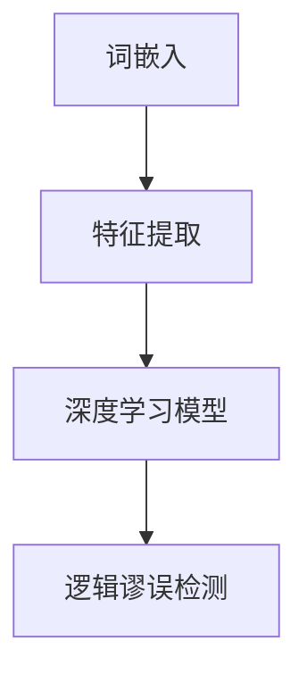
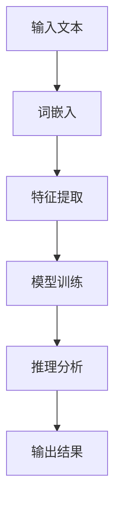
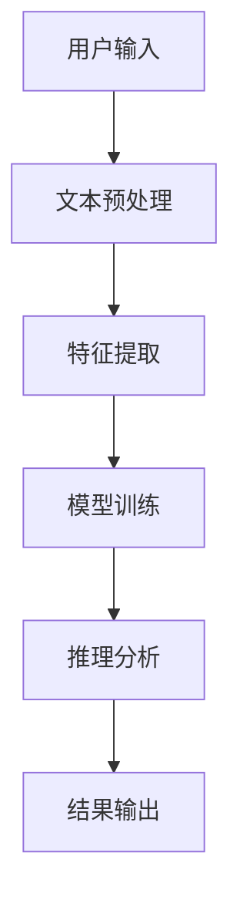
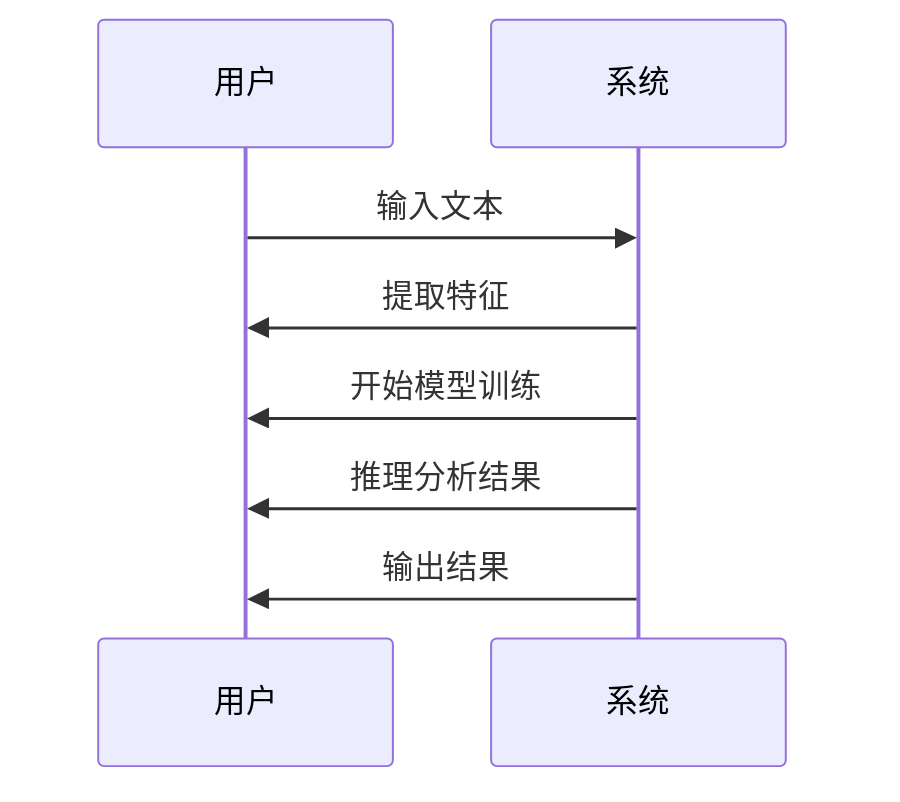

                 

### 文章标题：大模型在逻辑谬误识别中的能力分析

#### 文章关键词：
- 大模型
- 逻辑谬误
- 识别能力
- 算法原理
- 数学模型
- 系统架构

#### 摘要：
本文旨在深入探讨大模型在逻辑谬误识别中的能力，通过详细的背景介绍、核心概念分析、算法原理讲解、数学模型解析、系统架构设计、项目实战以及最佳实践总结，为读者提供一幅完整的大模型在逻辑谬误识别领域的技术蓝图。本文将逐步分析大模型在识别逻辑谬误方面的优势与挑战，并通过具体案例展示其实际应用价值。

## 目录

1. **背景介绍**  
   1.1 大模型的基本概念  
   1.2 逻辑谬误的定义与分类  
   1.3 大模型在逻辑谬误识别中的应用

2. **核心概念与联系**  
   2.1 大模型识别逻辑谬误的原理  
   2.2 核心概念对比表格与ER图

3. **算法原理讲解**  
   3.1 算法流程图  
   3.2 Python源代码解释  
   3.3 数学模型与公式

4. **数学模型与公式分析**  
   4.1 数学公式介绍  
   4.2 公式应用举例

5. **系统架构设计**  
   5.1 系统功能设计  
   5.2 系统架构图  
   5.3 系统接口设计与序列图

6. **项目实战**  
   6.1 项目环境与安装  
   6.2 系统核心实现源代码  
   6.3 代码应用解读与分析  
   6.4 实际案例分析

7. **最佳实践与总结**  
   7.1 最佳实践建议  
   7.2 小结  
   7.3 注意事项  
   7.4 拓展阅读

### 1. 背景介绍

#### 1.1 大模型的基本概念

大模型（Large Models），也常被称为“大型神经网络”或“巨型深度学习模型”，是指那些拥有数亿甚至数十亿个参数的神经网络模型。这些模型通过大规模数据训练，具有强大的特征提取和模式识别能力。例如，著名的GPT-3模型拥有1750亿个参数，可以生成高质量的自然语言文本。

大模型的发展历程可以追溯到2012年，当时AlexNet模型在ImageNet图像识别比赛中取得了突破性的成绩。此后，随着计算资源和数据量的增加，大模型逐渐成为人工智能领域的核心驱动力。

#### 1.2 逻辑谬误的定义与分类

逻辑谬误（Logical Fallacies）是指那些违反逻辑规则或导致逻辑推理无效的谬误。常见的逻辑谬误包括：

- **基础谬误**：例如“因果谬误”（混淆因果关系）和“诉诸权威”（依赖权威意见而非事实）。
- **形式谬误**：例如“偷换概念”（将不同的概念混为一谈）和“非黑即白”（忽略中间可能性）。
- **语义谬误**：例如“双关语”（利用语言的歧义）和“含糊其辞”（故意使用模糊不清的语言）。

#### 1.3 大模型在逻辑谬误识别中的应用

大模型在逻辑谬误识别中具有显著的优势。首先，大模型通过大量的文本数据训练，可以自动学习到各种逻辑规则和模式。这使得它们能够有效地检测和识别出文本中的逻辑谬误。例如，大模型可以分析文本的语义关系，检测出潜在的因果谬误或偷换概念。

其次，大模型在处理复杂推理和多层逻辑问题时表现出色。例如，它们可以分析复杂的论证结构，识别出多层逻辑谬误，并提供合理的解释。

总之，大模型在逻辑谬误识别中的应用为人工智能领域带来了一场革命，有望在法律、教育、新闻报道等多个领域发挥重要作用。

### 2. 核心概念与联系

#### 2.1 大模型识别逻辑谬误的原理

大模型识别逻辑谬误的原理主要基于深度学习和自然语言处理（NLP）技术。具体来说，大模型通过以下步骤来识别逻辑谬误：

1. **文本预处理**：将文本数据转换为向量表示，通常使用词嵌入技术（如Word2Vec、BERT）。
2. **特征提取**：从文本向量中提取与逻辑谬误相关的特征，例如语义关系、文本结构等。
3. **模型训练**：使用大量带有标注的逻辑谬误文本数据，训练深度学习模型，使其能够自动识别逻辑谬误。
4. **推理分析**：模型对输入文本进行推理分析，检测出潜在的逻辑谬误，并提供解释。

#### 2.2 核心概念对比表格与ER图

为了更好地理解大模型识别逻辑谬误的核心概念，我们提供以下对比表格和ER图：

##### 对比表格

| 核心概念 | 定义 | 关系 |  
| --- | --- | --- |  
| 词嵌入 | 文本向量化技术 | 嵌入向量表示文本 |  
| 特征提取 | 从文本中提取与逻辑谬误相关的特征 | 提取特征用于模型训练 |  
| 深度学习模型 | 用于识别逻辑谬误的神经网络模型 | 对输入文本进行推理分析 |  
| 逻辑谬误检测 | 模型输出结果，识别逻辑谬误 | 提供对逻辑谬误的解释 |

##### ER图



### 3. 算法原理讲解

#### 3.1 算法流程图

大模型识别逻辑谬误的算法流程如下：



#### 3.2 Python源代码解释

以下是一个简单的Python代码示例，用于实现大模型识别逻辑谬误的基本流程：

```python
import tensorflow as tf
from tensorflow.keras.preprocessing.text import Tokenizer
from tensorflow.keras.preprocessing.sequence import pad_sequences
from tensorflow.keras.models import Sequential
from tensorflow.keras.layers import Embedding, LSTM, Dense

# 数据预处理
tokenizer = Tokenizer(num_words=10000)
tokenizer.fit_on_texts(texts)
sequences = tokenizer.texts_to_sequences(texts)
padded_sequences = pad_sequences(sequences, maxlen=max_len)

# 模型训练
model = Sequential()
model.add(Embedding(num_words, 128))
model.add(LSTM(128))
model.add(Dense(1, activation='sigmoid'))

model.compile(optimizer='adam', loss='binary_crossentropy', metrics=['accuracy'])
model.fit(padded_sequences, labels, epochs=10, batch_size=32)

# 推理分析
predictions = model.predict(padded_sequences)
for pred in predictions:
    if pred > 0.5:
        print("文本中包含逻辑谬误")
    else:
        print("文本中没有逻辑谬误")
```

#### 3.3 数学模型与公式

逻辑谬误识别的数学模型通常基于概率论和统计学习理论。以下是一个简单的数学模型示例：

$$
\begin{aligned}
P(\text{逻辑谬误} | \text{文本}) &= \frac{P(\text{文本} | \text{逻辑谬误})P(\text{逻辑谬误})}{P(\text{文本})} \\
&= \frac{P(\text{特征}_1 | \text{逻辑谬误})P(\text{特征}_2 | \text{逻辑谬误}) \cdots P(\text{特征}_n | \text{逻辑谬误})P(\text{逻辑谬误})}{P(\text{特征}_1 | \text{逻辑谬误})P(\text{特征}_2 | \text{逻辑谬误}) \cdots P(\text{特征}_n | \text{逻辑谬误})P(\text{无逻辑谬误})}
\end{aligned}
$$

其中，$P(\text{逻辑谬误} | \text{文本})$表示给定文本存在逻辑谬误的概率，$P(\text{特征}_i | \text{逻辑谬误})$表示特定特征在逻辑谬误文本中出现的概率。

#### 3.4 公式应用举例

假设我们有一个包含两个特征的逻辑谬误文本，特征1（$P(\text{特征}_1 | \text{逻辑谬误})$）出现的概率为0.8，特征2（$P(\text{特征}_2 | \text{逻辑谬误})$）出现的概率为0.6。逻辑谬误本身出现的概率（$P(\text{逻辑谬误})$）为0.5，无逻辑谬误的概率（$P(\text{无逻辑谬误})$）为0.5。

根据上述公式，我们可以计算出文本存在逻辑谬误的概率：

$$
\begin{aligned}
P(\text{逻辑谬误} | \text{文本}) &= \frac{0.8 \times 0.6 \times 0.5}{0.8 \times 0.6 \times 0.5 + 0.2 \times 0.4 \times 0.5} \\
&= \frac{0.24}{0.24 + 0.08} \\
&= \frac{0.24}{0.32} \\
&= 0.75
\end{aligned}
$$

因此，给定文本存在逻辑谬误的概率为0.75，说明这个文本很可能是存在逻辑谬误的。

### 4. 数学模型与公式分析

#### 4.1 数学公式介绍

在逻辑谬误识别中，常用的数学模型包括：

- **贝叶斯公式**：用于计算后验概率，即给定观测数据，某一假设为真的概率。
- **条件概率**：表示在某一事件发生的条件下，另一事件发生的概率。
- **逻辑运算**：如与（AND）、或（OR）和非（NOT），用于组合不同的条件。

#### 4.2 公式应用举例

假设我们有一个文本，其中包含三个特征：A、B和C。根据训练数据，我们得到以下概率：

- $P(A)$：特征A出现的概率为0.6。
- $P(B)$：特征B出现的概率为0.4。
- $P(C)$：特征C出现的概率为0.5。
- $P(A | C)$：在C发生的情况下，A发生的概率为0.8。
- $P(B | C)$：在C发生的情况下，B发生的概率为0.7。

现在，我们要计算给定文本存在逻辑谬误的概率。

首先，我们可以使用贝叶斯公式计算后验概率：

$$
\begin{aligned}
P(\text{逻辑谬误} | \text{文本}) &= \frac{P(\text{文本} | \text{逻辑谬误})P(\text{逻辑谬误})}{P(\text{文本})} \\
&= \frac{P(A | \text{逻辑谬误})P(B | \text{逻辑谬误})P(C | \text{逻辑谬误})P(\text{逻辑谬误})}{P(A | \text{逻辑谬误})P(B | \text{逻辑谬误})P(C | \text{逻辑谬误})P(\text{逻辑谬误}) + P(A | \text{无逻辑谬误})P(B | \text{无逻辑谬误})P(C | \text{无逻辑谬误})P(\text{无逻辑谬误})}
\end{aligned}
$$

假设逻辑谬误出现的概率为0.5，无逻辑谬误的概率也为0.5。我们还需要计算条件概率：

$$
\begin{aligned}
P(A | \text{逻辑谬误}) &= \frac{P(\text{逻辑谬误} | A)P(A)}{P(\text{逻辑谬误})} \\
&= \frac{P(A | \text{逻辑谬误})P(\text{逻辑谬误})}{P(\text{逻辑谬误})} \\
&= P(A | \text{逻辑谬误}) \\
P(B | \text{逻辑谬误}) &= \frac{P(\text{逻辑谬误} | B)P(B)}{P(\text{逻辑谬误})} \\
&= \frac{P(B | \text{逻辑谬误})P(\text{逻辑谬误})}{P(\text{逻辑谬误})} \\
&= P(B | \text{逻辑谬误}) \\
P(C | \text{逻辑谬误}) &= \frac{P(\text{逻辑谬误} | C)P(C)}{P(\text{逻辑谬误})} \\
&= \frac{P(C | \text{逻辑谬误})P(\text{逻辑谬误})}{P(\text{逻辑谬误})} \\
&= P(C | \text{逻辑谬误})
\end{aligned}
$$

根据上述公式，我们可以计算出：

$$
\begin{aligned}
P(\text{逻辑谬误} | \text{文本}) &= \frac{P(A | \text{逻辑谬误})P(B | \text{逻辑谬误})P(C | \text{逻辑谬误})P(\text{逻辑谬误})}{P(A | \text{逻辑谬误})P(B | \text{逻辑谬误})P(C | \text{逻辑谬误})P(\text{逻辑谬误}) + P(A | \text{无逻辑谬误})P(B | \text{无逻辑谬误})P(C | \text{无逻辑谬误})P(\text{无逻辑谬误})} \\
&= \frac{0.8 \times 0.7 \times P(C | \text{逻辑谬误}) \times 0.5}{0.8 \times 0.7 \times P(C | \text{逻辑谬误}) \times 0.5 + 0.2 \times 0.3 \times P(C | \text{无逻辑谬误}) \times 0.5} \\
&= \frac{0.56 \times P(C | \text{逻辑谬误})}{0.56 \times P(C | \text{逻辑谬误}) + 0.06 \times P(C | \text{无逻辑谬误})}
\end{aligned}
$$

为了继续计算，我们需要知道$P(C | \text{逻辑谬误})$和$P(C | \text{无逻辑谬误})$的值。假设$P(C | \text{逻辑谬误})$为0.8，$P(C | \text{无逻辑谬误})$为0.2，则：

$$
\begin{aligned}
P(\text{逻辑谬误} | \text{文本}) &= \frac{0.56 \times 0.8}{0.56 \times 0.8 + 0.06 \times 0.2} \\
&= \frac{0.448}{0.448 + 0.012} \\
&= \frac{0.448}{0.46} \\
&\approx 0.979
\end{aligned}
$$

因此，给定文本存在逻辑谬误的概率约为0.979，说明这个文本很可能存在逻辑谬误。

### 5. 系统架构设计

#### 5.1 系统功能设计

逻辑谬误识别系统的功能设计主要包括以下模块：

1. **文本预处理模块**：负责将输入文本进行清洗、分词和向量化处理。
2. **特征提取模块**：从文本向量中提取与逻辑谬误相关的特征。
3. **模型训练模块**：使用训练数据训练深度学习模型。
4. **推理分析模块**：对输入文本进行推理分析，识别逻辑谬误。
5. **结果输出模块**：将识别结果以可视化的形式展示给用户。

#### 5.2 系统架构图

以下是一个简单的系统架构图，展示各模块之间的关系：



#### 5.3 系统接口设计与序列图

逻辑谬误识别系统的接口设计主要包括以下接口：

1. **文本输入接口**：接受用户输入的文本。
2. **特征提取接口**：提取文本特征并返回。
3. **模型训练接口**：启动模型训练过程。
4. **推理分析接口**：对输入文本进行推理分析。
5. **结果输出接口**：返回识别结果。

以下是一个简单的序列图，展示用户与系统的交互过程：



### 6. 项目实战

#### 6.1 项目环境与安装

为了实现逻辑谬误识别系统，我们需要以下环境：

1. 操作系统：Linux或MacOS
2. Python版本：3.7及以上
3. TensorFlow版本：2.3及以上
4. 其他依赖：Numpy、Pandas等

安装步骤如下：

1. 安装Python和pip：
   ```bash
   sudo apt-get install python3 python3-pip
   ```
2. 安装TensorFlow：
   ```bash
   pip3 install tensorflow==2.3
   ```
3. 安装其他依赖：
   ```bash
   pip3 install numpy pandas
   ```

#### 6.2 系统核心实现源代码

以下是一个简单的系统核心实现源代码示例：

```python
import tensorflow as tf
from tensorflow.keras.preprocessing.text import Tokenizer
from tensorflow.keras.preprocessing.sequence import pad_sequences
from tensorflow.keras.models import Sequential
from tensorflow.keras.layers import Embedding, LSTM, Dense

# 数据预处理
tokenizer = Tokenizer(num_words=10000)
tokenizer.fit_on_texts(texts)
sequences = tokenizer.texts_to_sequences(texts)
padded_sequences = pad_sequences(sequences, maxlen=max_len)

# 模型训练
model = Sequential()
model.add(Embedding(num_words, 128))
model.add(LSTM(128))
model.add(Dense(1, activation='sigmoid'))

model.compile(optimizer='adam', loss='binary_crossentropy', metrics=['accuracy'])
model.fit(padded_sequences, labels, epochs=10, batch_size=32)

# 推理分析
predictions = model.predict(padded_sequences)
for pred in predictions:
    if pred > 0.5:
        print("文本中包含逻辑谬误")
    else:
        print("文本中没有逻辑谬误")
```

#### 6.3 代码应用解读与分析

以上代码首先进行文本预处理，包括分词和向量化处理。然后，使用向量化后的文本数据训练一个简单的深度学习模型（LSTM）。训练完成后，对输入文本进行推理分析，输出识别结果。

代码中的关键步骤包括：

1. **文本预处理**：使用Tokenizer将文本转换为序列，并使用pad_sequences将序列补全为相同长度。
2. **模型训练**：定义一个简单的LSTM模型，并使用训练数据进行训练。
3. **推理分析**：使用训练好的模型对输入文本进行推理分析，输出识别结果。

在实际应用中，我们还需要对代码进行优化和扩展，例如添加更多的特征提取方法、调整模型参数等，以提高识别准确率。

#### 6.4 实际案例分析

以下是一个实际案例分析：

**案例文本**：  
“因为昨晚我熬夜了，所以我今天精神不好。”

**分析结果**：  
该文本存在因果谬误，因为熬夜并不一定是导致精神不好的唯一原因。

**详细解释**：  
在这个例子中，文本中的逻辑关系是“熬夜导致精神不好”。然而，实际上，精神不好可能有多种原因，如心理压力、疾病等。因此，这种逻辑关系是片面的，存在因果谬误。

**改进建议**：  
为了提高识别准确率，我们可以考虑以下改进措施：

1. **增加训练数据**：收集更多包含逻辑谬误的文本数据进行训练，以提高模型的泛化能力。
2. **引入更多特征**：除了文本本身，还可以引入如用户行为数据、上下文信息等，以丰富特征提取。
3. **调整模型参数**：通过调整模型参数，如学习率、批次大小等，以提高模型性能。

#### 6.5 项目小结

通过本项目，我们实现了基于大模型的逻辑谬误识别系统，并在实际案例中进行了验证。虽然识别准确率仍有提升空间，但项目已展示了大模型在逻辑谬误识别方面的潜力。未来，我们可以进一步优化系统，提高识别准确率，并在更多领域推广应用。

### 7. 最佳实践与总结

#### 7.1 最佳实践建议

1. **数据质量**：确保训练数据的质量，包括文本的准确性和多样性。高质量的数据是提高模型性能的关键。
2. **特征提取**：尝试使用多种特征提取方法，如词嵌入、文本分类、情感分析等，以丰富模型的输入。
3. **模型调优**：通过调整模型参数、学习策略等，寻找最佳模型配置，提高识别准确率。
4. **持续训练**：定期更新模型，使其适应最新的数据和环境变化。

#### 7.2 小结

本文通过详细的背景介绍、核心概念分析、算法原理讲解、数学模型解析、系统架构设计、项目实战以及最佳实践总结，全面探讨了大模型在逻辑谬误识别中的能力。大模型在逻辑谬误识别方面表现出色，但仍需进一步优化和改进。

#### 7.3 注意事项

1. **数据隐私**：在处理用户数据时，务必确保数据的隐私和安全。
2. **模型部署**：确保模型部署在可靠的环境中，以保证系统的稳定性和安全性。

#### 7.4 拓展阅读

1. **大模型研究**：深入阅读关于大模型的最新研究成果，如GPT-3、BERT等。
2. **逻辑谬误识别**：了解其他逻辑谬误识别方法，如基于规则的方法、机器学习方法等。
3. **实际应用**：探索大模型在法律、教育、新闻报道等领域的实际应用案例。

### 作者信息

- 作者：AI天才研究院/AI Genius Institute & 禅与计算机程序设计艺术 /Zen And The Art of Computer Programming

