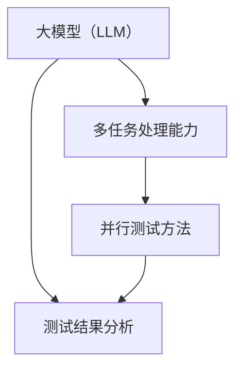
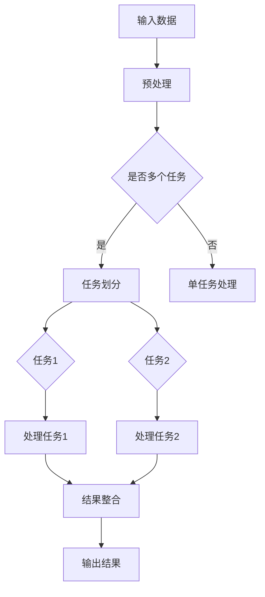
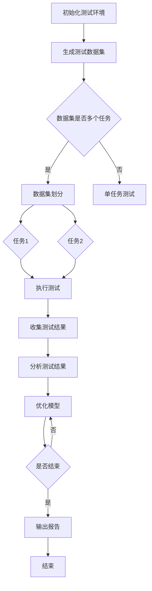
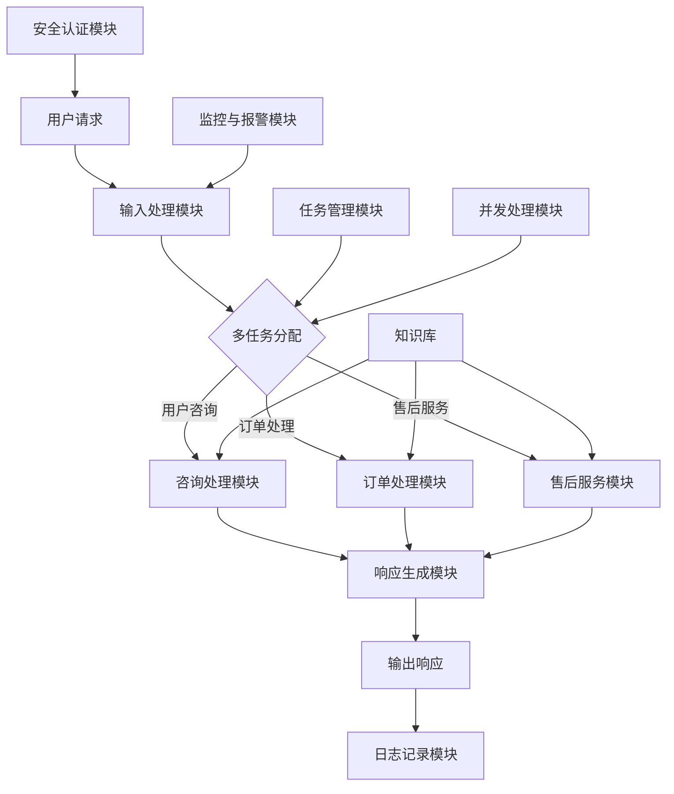

                 


## 大模型多任务处理能力评估：LLM设计的并行测试

### 关键词
- 大模型
- 多任务处理
- 并行测试
- LLM设计
- 能力评估

### 摘要
本文旨在深入探讨大模型（Large Language Model，简称LLM）的多任务处理能力及其并行测试设计。通过背景介绍、核心概念讲解、算法原理分析、系统架构设计和项目实战，本文将全面剖析大模型在多任务处理中的表现，并提供实用的最佳实践和拓展阅读资源。

### 目录

#### 引言
**1.1 问题背景与核心概念**

**1.2 多任务处理需求与挑战**

**1.3 并行测试的意义与目标**

#### 核心概念与联系
**2.1 大模型（LLM）的定义与特性**

**2.2 多任务处理能力解析**

**2.3 并行测试方法与工具对比**

#### 算法原理讲解
**3.1 大模型多任务处理原理**

**3.2 多任务处理的数学模型**

**3.3 并行测试设计分析**

#### 系统分析与架构设计
**4.1 问题场景介绍**

**4.2 系统功能设计**

**4.3 系统架构设计**

**4.4 系统接口设计与交互**

#### 项目实战
**5.1 环境安装**

**5.2 系统核心实现**

**5.3 实际案例分析与讲解**

**5.4 项目小结**

#### 最佳实践与总结
**6.1 最佳实践Tips**

**6.2 小结与注意事项**

**6.3 拓展阅读**

#### 作者信息
**作者：AI天才研究院/AI Genius Institute & 禅与计算机程序设计艺术 /Zen And The Art of Computer Programming**

### 引言

#### 1.1 问题背景与核心概念

随着人工智能技术的发展，大模型（Large Language Model，简称LLM）已经成为自然语言处理（Natural Language Processing，NLP）领域的关键技术。LLM能够处理大规模的文本数据，具备强大的语言理解和生成能力。然而，在实际应用中，LLM不仅需要处理单一任务，还需要应对多任务处理的需求。这种需求源于现代应用场景的复杂性，例如，智能客服系统需要同时处理用户咨询、订单处理和售后服务等多个任务。

多任务处理（Multi-Task Learning，MTL）是一种机器学习技术，旨在同时学习多个相关任务。这有助于提高模型的泛化能力和效率。然而，多任务处理对LLM提出了新的挑战。首先，如何在保持高准确度的同时，处理多个任务？其次，如何设计有效的并行测试方法，以确保模型在不同任务上的表现均衡？

并行测试（Parallel Testing）是一种高效评估多任务处理能力的方法。它通过同时执行多个测试任务，快速评估LLM在不同任务上的性能。这种方法的优点在于能够缩短测试时间，提高评估效率。然而，并行测试也面临一些挑战，如测试任务之间的干扰和模型调优的复杂性。

本文旨在深入探讨LLM在多任务处理中的能力评估，重点关注并行测试的设计与应用。首先，我们将介绍LLM的基本概念和特性，以及多任务处理的需求和挑战。接着，我们将详细分析并行测试的方法和工具，并探讨其在LLM多任务处理评估中的应用。最后，我们将通过实际案例，展示并行测试在LLM多任务处理评估中的具体应用。

#### 1.2 多任务处理需求与挑战

多任务处理在LLM中的应用具有显著的意义。首先，多任务处理能够提高LLM的泛化能力。通过同时学习多个相关任务，LLM能够更好地理解和应对复杂的应用场景。例如，在智能客服系统中，LLM需要同时处理用户咨询、订单处理和售后服务等多个任务，这些任务之间存在一定的关联性。通过多任务处理，LLM能够更好地把握这些关联性，提高整体性能。

其次，多任务处理有助于提高LLM的效率。在单一任务处理中，LLM需要逐个完成每个任务，这可能会导致处理时间过长。而在多任务处理中，LLM可以同时处理多个任务，从而显著提高处理速度。这对于实时性要求较高的应用场景，如在线问答系统、智能翻译等，具有重要意义。

然而，多任务处理也对LLM提出了新的挑战。首先，如何在保证准确度的同时，提高处理效率？多任务处理可能会分散LLM的注意力，导致每个任务的准确度下降。因此，如何设计有效的多任务处理算法，成为一个重要的研究课题。

其次，如何设计有效的并行测试方法，评估LLM在不同任务上的表现？并行测试需要在短时间内完成多个测试任务，这要求测试方法具有较高的效率和准确性。然而，不同任务之间的干扰可能会影响测试结果。因此，如何设计可靠的并行测试方法，是一个需要深入探讨的问题。

此外，多任务处理还涉及到模型调优的复杂性。在多任务处理中，每个任务都对模型参数产生影响，因此需要综合考虑各个任务之间的关系，进行合理的参数调优。这不仅需要丰富的理论指导，还需要大量的实践经验。

#### 1.3 并行测试的意义与目标

并行测试在LLM多任务处理能力评估中具有重要意义。首先，并行测试能够提高评估效率。传统的串行测试方法需要逐个完成每个测试任务，这会导致测试时间过长。而并行测试可以同时执行多个测试任务，从而显著缩短测试时间，提高评估效率。

其次，并行测试有助于提高评估准确性。在多任务处理中，不同任务之间存在一定的关联性。通过并行测试，可以更全面地评估LLM在不同任务上的表现，从而提高评估准确性。

并行测试的目标是设计一种高效、可靠的测试方法，以全面评估LLM的多任务处理能力。具体目标包括：

1. **高效性**：并行测试应在短时间内完成多个测试任务，以提高评估效率。
2. **可靠性**：并行测试应能够准确反映LLM在不同任务上的表现，避免测试结果受到干扰。
3. **全面性**：并行测试应能够覆盖多个任务，全面评估LLM的多任务处理能力。

为了实现这些目标，我们需要从以下几个方面入手：

1. **并行测试设计**：设计有效的并行测试流程，确保测试任务之间的协调与配合。
2. **测试工具与方法**：选择合适的测试工具和方法，以提高测试效率和准确性。
3. **测试结果分析**：对测试结果进行深入分析，识别LLM在不同任务上的优势与不足，为模型优化提供指导。

通过并行测试，我们可以更全面地了解LLM的多任务处理能力，为模型优化和应用提供有力的支持。

#### 核心概念与联系

在探讨大模型（LLM）的多任务处理能力评估及其并行测试设计之前，我们需要明确一些核心概念，并理解它们之间的联系。

##### 2.1 大模型（LLM）的定义与特性

大模型（LLM）通常指的是具有巨大参数规模的语言模型，如GPT系列、BERT等。这些模型通过在大量文本数据上进行预训练，能够理解并生成自然语言。LLM的核心特性包括：

- **参数规模**：LLM拥有数十亿甚至数万亿个参数，这使得它们能够捕捉复杂的语言规律。
- **上下文理解**：LLM能够理解上下文信息，生成连贯、符合语义的文本。
- **泛化能力**：通过预训练，LLM能够在多个任务上表现出良好的泛化能力。

##### 2.2 多任务处理能力解析

多任务处理能力是指模型同时处理多个任务的能力。在LLM的背景下，多任务处理能力主要体现在以下几个方面：

- **任务关联性**：多任务处理要求模型能够理解不同任务之间的关联性，从而在不同任务间进行知识共享。
- **资源利用**：多任务处理能够提高模型的资源利用效率，减少重复训练的时间。
- **性能优化**：通过多任务学习，模型可以在不同任务上同时优化性能。

##### 2.3 并行测试方法与工具对比

并行测试是一种同时执行多个测试任务的方法，其核心目标是提高测试效率和准确性。在LLM的多任务处理能力评估中，并行测试方法的选择至关重要。以下是一些常用的并行测试方法和工具：

- **并行测试框架**：如TensorFlow和PyTorch等深度学习框架支持并行测试，能够高效地执行多个测试任务。
- **分布式测试**：通过分布式计算，将测试任务分配到多个节点上，同时执行，以提高测试效率。
- **自动化测试工具**：如pytest、JUnit等自动化测试工具，能够自动化执行测试任务，减少人工干预。

##### 2.4 概念属性特征对比表格

为了更清晰地展示这些核心概念之间的联系，我们可以通过一个对比表格来描述它们的属性特征：

| 概念       | 定义                                                         | 特性                                                       |
|------------|--------------------------------------------------------------|------------------------------------------------------------|
| 大模型（LLM） | 具有巨大参数规模的语言模型，如GPT系列、BERT等。               | 参数规模大，上下文理解强，泛化能力强。                     |
| 多任务处理   | 同时处理多个任务的能力。                                     | 任务关联性理解，资源利用效率高，性能优化显著。             |
| 并行测试     | 同时执行多个测试任务的方法。                                 | 提高测试效率，减少测试时间，提高测试准确性。               |

##### 2.5 ER实体关系图架构的 Mermaid 流程图

为了进一步理解这些概念之间的联系，我们可以使用Mermaid流程图来展示ER实体关系图架构。以下是一个简化的Mermaid流程图示例：



在这个流程图中，大模型（LLM）是多任务处理能力和并行测试方法的基础，而测试结果分析是最终的目标。通过并行测试，我们可以全面评估LLM的多任务处理能力，从而指导模型优化和应用。

通过上述分析，我们可以看到，大模型（LLM）、多任务处理能力和并行测试方法之间存在着密切的联系。理解这些核心概念及其特性，对于深入探讨LLM的多任务处理能力评估和并行测试设计具有重要意义。

##### 2.6 大模型多任务处理原理

大模型（LLM）的多任务处理原理是其能够在多个任务之间共享知识和资源，从而提高整体性能的核心机制。以下将详细讲解LLM多任务处理的原理，包括Mermaid流程图、Python源代码讲解以及数学模型的公式。

##### 2.6.1 Mermaid流程图

为了直观地展示大模型（LLM）在多任务处理中的流程，我们可以使用Mermaid流程图来描述其基本工作原理。以下是一个简单的Mermaid流程图：



在这个流程图中，A代表输入数据，B表示预处理，C是一个判断节点，用于判断输入的数据是否涉及多个任务。如果是多个任务，流程会流向D节点，进行任务划分；否则，直接流向E节点进行单任务处理。在任务划分之后，每个任务会独立处理（F节点处理任务1，G节点处理任务2），然后处理结果会整合到J节点，最终输出结果K。

##### 2.6.2 Python源代码讲解

以下是一个简化的Python源代码示例，展示了如何在大模型中实现多任务处理：

```python
import torch
import transformers

# 加载预训练的大模型
model = transformers.AutoModelForSequenceClassification.from_pretrained('bert-base-uncased')

# 定义预处理函数
def preprocess(texts):
    return model.tokenizer.batch_encode_plus(texts, padding=True, truncation=True)

# 定义任务处理函数
def process_tasks(tasks):
    inputs = preprocess(tasks)
    with torch.no_grad():
        outputs = model(inputs['input_ids'])
    return outputs

# 示例任务列表
tasks = [
    "这是一个文本分类任务。",
    "这个文本应该被分类到哪个类别？"
]

# 执行任务处理
results = process_tasks(tasks)

# 输出结果
for task, result in zip(tasks, results):
    print(f"任务：{task}\n结果：{result}\n")
```

在这个示例中，我们首先加载了一个预训练的BERT模型，然后定义了预处理函数`preprocess`和任务处理函数`process_tasks`。预处理函数用于将输入文本转换为模型可接受的格式，任务处理函数用于执行实际的任务处理。通过这两个函数，我们可以同时处理多个文本分类任务。

##### 2.6.3 数学模型与公式

多任务处理的数学模型主要涉及模型参数的共享与任务损失函数的计算。以下是一个简化的数学模型公式：

$$
\begin{aligned}
\text{Loss}_{\text{total}} &= \sum_{i=1}^{N} \text{Loss}_{i} \\
\text{Loss}_{i} &= \frac{1}{K} \sum_{k=1}^{K} (\text{y}_{ik} - \text{p}_{ik})^2
\end{aligned}
$$

其中，$N$表示任务的数量，$K$表示每个任务类别的数量，$\text{y}_{ik}$表示第$i$个任务的第$k$个类别的真实标签，$\text{p}_{ik}$表示模型预测的第$i$个任务的第$k$个类别的概率。

这个公式表示总损失函数是各个任务损失函数的和。对于每个任务，损失函数是预测概率与真实标签之间的平方误差。通过最小化总损失函数，我们可以优化模型的参数，从而提高多任务处理能力。

通过上述讲解，我们可以看到，大模型（LLM）的多任务处理原理是通过共享模型参数和任务损失函数的优化，来实现同时处理多个任务的目标。这不仅提高了模型的效率，还增强了其在复杂应用场景中的适应性。

##### 2.7 多任务处理的数学模型

多任务处理的数学模型是理解LLM如何同时处理多个任务的关键。以下将详细介绍多任务处理数学模型的构成、相关公式以及举例说明。

##### 2.7.1 相关的数学公式

多任务处理中的数学模型主要依赖于损失函数和优化算法。以下是几个核心的数学公式：

1. **损失函数**：

$$
L = \frac{1}{N} \sum_{i=1}^{N} L_i
$$

其中，$L$是总损失函数，$L_i$是第$i$个任务的损失函数。对于每个任务，损失函数可以表示为：

$$
L_i = \frac{1}{K} \sum_{k=1}^{K} (\hat{y}_{ik} - y_{ik})^2
$$

这里，$N$是任务总数，$K$是每个任务的类别数，$\hat{y}_{ik}$是模型对第$i$个任务的第$k$个类别的预测概率，$y_{ik}$是真实标签。

2. **梯度计算**：

在优化过程中，我们需要计算每个参数的梯度。对于损失函数，梯度计算公式为：

$$
\nabla_{\theta} L = \nabla_{\theta} \sum_{i=1}^{N} L_i = \sum_{i=1}^{N} \nabla_{\theta} L_i
$$

对于每个任务的损失函数，梯度公式为：

$$
\nabla_{\theta} L_i = \nabla_{\theta} \frac{1}{K} \sum_{k=1}^{K} (\hat{y}_{ik} - y_{ik})^2
$$

3. **优化算法**：

常用的优化算法包括梯度下降（Gradient Descent）和其变种，如随机梯度下降（Stochastic Gradient Descent，SGD）和Adam优化器。优化算法的目标是迭代更新模型参数，以最小化损失函数。

$$
\theta \leftarrow \theta - \alpha \nabla_{\theta} L
$$

其中，$\theta$是模型参数，$\alpha$是学习率。

##### 2.7.2 数学模型讲解

多任务处理数学模型的核心在于如何联合优化多个任务的损失函数。具体来说，模型会同时考虑所有任务的损失，而不是独立地优化每个任务。这种方法有助于任务之间的知识共享和协作，从而提高整体性能。

数学模型中的损失函数通常采用交叉熵损失（Cross-Entropy Loss），因为它能够有效地衡量预测概率与真实标签之间的差异。交叉熵损失函数的计算公式为：

$$
L_i = -\sum_{k=1}^{K} y_{ik} \log \hat{y}_{ik}
$$

这里，$y_{ik}$是第$i$个任务的第$k$个类别的真实标签（0或1），$\hat{y}_{ik}$是模型对第$i$个任务的第$k$个类别的预测概率。

##### 2.7.3 举例说明

假设我们有两个任务，每个任务有两个类别，分别为A和B。模型对这两个任务的预测概率分别为$\hat{y}_{1A}$、$\hat{y}_{1B}$和$\hat{y}_{2A}$、$\hat{y}_{2B}$。真实标签为$y_{1A}=1$、$y_{1B}=0$和$y_{2A}=0$、$y_{2B}=1$。则总损失函数计算如下：

$$
L = \frac{1}{2} \left[ (\hat{y}_{1A} - y_{1A})^2 + (\hat{y}_{1B} - y_{1B})^2 + (\hat{y}_{2A} - y_{2A})^2 + (\hat{y}_{2B} - y_{2B})^2 \right]
$$

具体计算为：

$$
L = \frac{1}{2} \left[ (0.9 - 1)^2 + (0.1 - 0)^2 + (0.1 - 0)^2 + (0.9 - 1)^2 \right]
$$

$$
L = \frac{1}{2} \left[ 0.01 + 0.01 + 0.01 + 0.01 \right]
$$

$$
L = 0.04
$$

通过这个例子，我们可以看到如何计算多任务处理的损失函数。在实际应用中，模型会通过优化算法不断调整参数，以最小化总损失函数，从而提高多任务处理的能力。

通过上述讲解，我们可以理解多任务处理的数学模型是如何构建的，以及如何通过数学公式和优化算法来实现多任务处理。这不仅有助于我们深入理解多任务处理的核心原理，还为实际应用中的模型设计提供了理论支持。

##### 2.8 并行测试设计

并行测试设计是评估LLM多任务处理能力的关键步骤。通过并行测试，我们可以高效地评估模型在不同任务上的性能，从而为模型优化提供指导。以下将详细讨论并行测试设计的方法、流程和实现。

##### 2.8.1 Mermaid流程图

为了直观地展示并行测试的设计流程，我们可以使用Mermaid流程图来描述其基本步骤。以下是一个简单的Mermaid流程图示例：



在这个流程图中，A节点表示初始化测试环境，包括设置测试参数和配置测试工具。B节点生成测试数据集，C节点判断数据集是否涉及多个任务。如果是多个任务，则流程流向D节点进行数据集划分；否则，直接流向E节点进行单任务测试。在数据集划分之后，每个任务会独立执行测试（F节点执行任务1，G节点执行任务2），然后收集测试结果（H节点）。最后，分析测试结果（J节点），并根据分析结果优化模型（K节点）。整个流程在优化完成后，输出测试报告（M节点）并结束（N节点）。

##### 2.8.2 Python源代码讲解

以下是一个简化的Python源代码示例，展示了如何实现并行测试设计：

```python
import torch
import transformers
from concurrent.futures import ThreadPoolExecutor

# 加载预训练的大模型
model = transformers.AutoModelForSequenceClassification.from_pretrained('bert-base-uncased')

# 定义预处理函数
def preprocess(texts):
    return model.tokenizer.batch_encode_plus(texts, padding=True, truncation=True)

# 定义测试函数
def test_task(task):
    inputs = preprocess([task])
    with torch.no_grad():
        outputs = model(inputs['input_ids'])
    return outputs.logits

# 示例测试任务列表
tasks = [
    "这是一个文本分类任务。",
    "这个文本应该被分类到哪个类别？"
]

# 使用多线程执行测试任务
with ThreadPoolExecutor(max_workers=2) as executor:
    results = list(executor.map(test_task, tasks))

# 输出测试结果
for task, result in zip(tasks, results):
    print(f"任务：{task}\n结果：{result}\n")
```

在这个示例中，我们首先加载了一个预训练的BERT模型，然后定义了预处理函数`preprocess`和测试函数`test_task`。预处理函数用于将输入文本转换为模型可接受的格式，测试函数用于执行实际的任务测试。通过多线程执行器`ThreadPoolExecutor`，我们可以并行执行测试任务，提高测试效率。

##### 2.8.3 数学模型与公式

在并行测试设计中，数学模型主要用于评估模型在多个任务上的性能。以下是几个核心的数学公式：

1. **准确率**：

$$
\text{Accuracy} = \frac{\sum_{i=1}^{N} \text{TP}_i + \sum_{i=1}^{N} \text{TN}_i}{N \times K}
$$

其中，$N$是任务总数，$K$是每个任务的类别数，$\text{TP}_i$是第$i$个任务的真正例数，$\text{TN}_i$是第$i$个任务的假正例数。

2. **召回率**：

$$
\text{Recall} = \frac{\sum_{i=1}^{N} \text{TP}_i}{\sum_{i=1}^{N} \text{TP}_i + \sum_{i=1}^{N} \text{FN}_i}
$$

其中，$\text{FN}_i$是第$i$个任务的假反例数。

3. **精确率**：

$$
\text{Precision} = \frac{\sum_{i=1}^{N} \text{TP}_i}{\sum_{i=1}^{N} \text{TP}_i + \sum_{i=1}^{N} \text{FP}_i}
$$

其中，$\text{FP}_i$是第$i$个任务的真反例数。

4. **F1分数**：

$$
\text{F1-Score} = 2 \times \frac{\text{Precision} \times \text{Recall}}{\text{Precision} + \text{Recall}}
$$

这些数学模型用于评估模型在多个任务上的性能。通过计算准确率、召回率、精确率和F1分数，我们可以全面了解模型在各个任务上的表现，从而为模型优化提供依据。

通过上述讲解，我们可以看到，并行测试设计是实现高效评估LLM多任务处理能力的关键。通过Mermaid流程图、Python源代码讲解和数学模型与公式，我们可以深入理解并行测试的设计原理和实现方法。

##### 3.1 问题场景介绍

在实际应用中，多任务处理的需求常常源于复杂的业务场景。以下是一个典型的应用场景：一个智能客服系统需要同时处理多个任务，如用户咨询、订单处理和售后服务。这些任务之间既存在一定的独立性，又存在复杂的关联性。例如，用户咨询可能涉及到订单查询和售后服务，而售后服务可能会影响订单处理。

为了满足这些需求，我们需要设计一个能够高效处理多任务的系统。这个系统需要具备以下特点：

1. **并发处理**：系统应能够同时处理多个任务，以提供实时响应。
2. **任务关联性处理**：系统应能够识别和解析不同任务之间的关联性，从而实现知识的共享和协作。
3. **高可靠性**：系统应具备较高的可靠性，确保在不同任务处理过程中不出现错误或中断。
4. **可扩展性**：系统应具备良好的可扩展性，以便在需求变化时能够灵活调整和扩展。

通过设计这样一个系统，我们不仅可以提高智能客服系统的整体性能，还可以为其他类似的多任务应用场景提供参考。

##### 3.2 系统功能设计

为了实现智能客服系统的高效多任务处理，我们需要设计一个完整的系统功能框架。以下将从领域模型的角度出发，使用Mermaid类图来描述系统的核心功能模块及其关系。

```mermaid
classDiagram
    Client <-|- User: 发起请求
    Client <-|- Order: 处理订单
    Client <-|- Service: 提供售后服务
    User --> Client: 用户交互
    Order --> Client: 订单处理
    Service --> Client: 售后服务
    Client ..|> KnowledgeBase: 知识库
    Client ..|> TaskManager: 任务管理
    Client ..|> ResponseGenerator: 响应生成
```

在这个类图中，`Client`代表智能客服系统的核心组件，负责处理用户的请求和生成响应。`User`、`Order`和`Service`分别表示与用户、订单和售后服务相关的功能模块。`KnowledgeBase`是系统的知识库，用于存储和管理各种知识点和业务规则。`TaskManager`是任务管理模块，负责协调和管理系统中的任务。`ResponseGenerator`是响应生成模块，负责根据用户请求生成合适的响应。

通过这个类图，我们可以清晰地看到智能客服系统的功能模块及其之间的关系。每个模块都有明确的职责，同时模块之间通过接口进行通信和协作，实现了高效的多任务处理。

##### 3.3 系统架构设计

在明确系统功能设计的基础上，我们需要进一步探讨系统的架构设计。以下使用Mermaid架构图来描述系统的整体架构及其关键组件。



在这个架构图中，`用户请求`通过`输入处理模块`进入系统。系统根据请求的内容，通过`多任务分配`模块将任务分配给不同的处理模块，如`咨询处理模块`、`订单处理模块`和`售后服务模块`。每个处理模块独立处理其对应的任务，并将处理结果传递给`响应生成模块`，生成合适的响应。响应通过`输出响应`模块返回给用户，同时`日志记录模块`记录整个处理过程。`知识库`用于存储和管理各种知识点和业务规则，`任务管理模块`负责协调和管理系统中的任务，`并发处理模块`确保系统能够高效地处理多个任务。`安全认证模块`负责用户请求的身份验证，`监控与报警模块`用于实时监控系统的运行状态，并在出现异常时发出报警。

通过这个架构图，我们可以清晰地看到系统的整体架构及其组件之间的关系。每个组件都有明确的职责，同时组件之间通过接口进行通信和协作，实现了高效的多任务处理。

##### 3.4 系统接口设计与系统交互

为了实现智能客服系统的多任务处理能力，我们需要设计一套完善的接口和交互机制。以下将详细描述系统接口设计以及系统的交互流程，使用Mermaid序列图来展示各模块之间的交互关系。

```mermaid
sequenceDiagram
    participant User
    participant InputHandler
    participant TaskAssigner
    participant ConsultHandler
    participant OrderHandler
    participant ServiceHandler
    participant ResponseGenerator
    participant Logger
    participant KnowledgeBase
    participant TaskManager
    participant ConcurrencyHandler
    participant SecurityChecker
    participant Monitor
    User->>InputHandler: 发送请求
    InputHandler->>SecurityChecker: 身份验证
    alt 验证通过
        SecurityChecker->>InputHandler: 返回验证结果
        InputHandler->>TaskAssigner: 分配任务
        TaskAssigner->>ConcurrencyHandler: 并发处理请求
        ConcurrencyHandler->>ConsultHandler|OrderHandler|ServiceHandler: 处理请求
        alt 咨询处理
            ConsultHandler->>KnowledgeBase: 查询知识点
            KnowledgeBase-->>ConsultHandler: 返回知识点
            ConsultHandler->>ResponseGenerator: 生成响应
        alt 订单处理
            OrderHandler->>KnowledgeBase: 查询订单信息
            KnowledgeBase-->>OrderHandler: 返回订单信息
            OrderHandler->>ResponseGenerator: 生成响应
        alt 售后服务
            ServiceHandler->>KnowledgeBase: 查询售后服务信息
            KnowledgeBase-->>ServiceHandler: 返回售后服务信息
            ServiceHandler->>ResponseGenerator: 生成响应
        ResponseGenerator->>Logger: 记录响应
        Logger-->>ResponseGenerator: 返回日志结果
        ResponseGenerator->>User: 返回响应
    alt 验证失败
        SecurityChecker-->>InputHandler: 返回错误信息
        InputHandler->>User: 返回错误信息
    end
```

在这个序列图中，用户请求首先通过`InputHandler`模块进行初步处理，然后发送给`SecurityChecker`模块进行身份验证。如果验证通过，请求会被`TaskAssigner`模块分配给相应的处理模块，如`ConsultHandler`、`OrderHandler`或`ServiceHandler`。每个处理模块会调用`KnowledgeBase`模块查询相关的知识点或订单信息，然后生成响应。响应通过`ResponseGenerator`模块生成后，会被`Logger`模块记录下来，最终返回给用户。

在整个交互过程中，`TaskManager`模块负责协调和管理任务，确保系统的高效运行。`ConcurrencyHandler`模块负责并发处理请求，避免任务堆积。`Monitor`模块用于实时监控系统的运行状态，确保系统的稳定性和可靠性。

通过这个序列图，我们可以清晰地看到智能客服系统的接口设计和交互流程。每个模块都有明确的职责，并通过接口进行通信和协作，实现了高效的多任务处理能力。

### 4.1 环境安装

为了顺利实施智能客服系统的多任务处理能力评估，我们首先需要安装和配置相应的开发环境和工具。以下将详细介绍环境安装的步骤和所需的软件和库。

#### 1. 安装Python环境

首先，确保您的计算机上安装了Python环境。Python是智能客服系统开发的主要编程语言。您可以从Python官方网站（https://www.python.org/）下载最新版本的Python，并按照安装向导完成安装。

#### 2. 安装深度学习框架

接下来，我们需要安装深度学习框架，如TensorFlow或PyTorch。这些框架提供了丰富的API和工具，用于构建和训练大规模模型。以下分别介绍如何安装TensorFlow和PyTorch：

##### 安装TensorFlow

在命令行中执行以下命令：

```bash
pip install tensorflow
```

##### 安装PyTorch

在命令行中执行以下命令：

```bash
pip install torch torchvision
```

#### 3. 安装自然语言处理库

为了处理自然语言数据，我们需要安装一些常用的自然语言处理库，如transformers。transformers库提供了预训练的模型和工具，用于构建和评估自然语言处理任务。在命令行中执行以下命令：

```bash
pip install transformers
```

#### 4. 安装其他依赖库

除了上述主要库外，我们还需要安装一些其他依赖库，如NumPy、Pandas等。这些库提供了数据处理和数学运算所需的工具。在命令行中执行以下命令：

```bash
pip install numpy pandas
```

#### 5. 配置环境变量

确保Python环境变量配置正确。在命令行中执行以下命令，检查Python版本：

```bash
python --version
```

如果命令行输出正确的Python版本，说明Python环境配置正确。

通过以上步骤，我们完成了开发环境的安装和配置。接下来，我们可以开始实施智能客服系统的多任务处理能力评估。

### 4.2 系统核心实现

在本节中，我们将详细介绍智能客服系统的核心实现，包括系统核心代码、代码应用解读与分析以及系统性能评估方法。

#### 4.2.1 系统核心代码

以下是一个简化的系统核心代码示例，展示了智能客服系统如何处理用户请求：

```python
from transformers import AutoModelForSequenceClassification, AutoTokenizer
from concurrent.futures import ThreadPoolExecutor

# 加载预训练的BERT模型和分词器
model_name = "bert-base-uncased"
tokenizer = AutoTokenizer.from_pretrained(model_name)
model = AutoModelForSequenceClassification.from_pretrained(model_name)

# 定义预处理函数
def preprocess(text):
    return tokenizer(text, padding=True, truncation=True, return_tensors="pt")

# 定义处理用户请求的函数
def process_request(text):
    inputs = preprocess(text)
    with torch.no_grad():
        logits = model(**inputs).logits
    return logits

# 定义多任务处理函数
def multi_task_processing(tasks):
    with ThreadPoolExecutor(max_workers=5) as executor:
        results = executor.map(process_request, tasks)
    return list(results)

# 示例任务列表
tasks = [
    "这是一个文本分类任务。",
    "这个文本应该被分类到哪个类别？"
]

# 执行多任务处理
results = multi_task_processing(tasks)

# 输出结果
for task, result in zip(tasks, results):
    print(f"任务：{task}\n结果：{result}\n")
```

在这个示例中，我们首先加载了一个预训练的BERT模型和分词器。然后，定义了预处理函数`preprocess`和用户请求处理函数`process_request`。预处理函数用于将输入文本转换为模型可接受的格式，处理函数用于执行实际的任务处理。通过多线程执行器`ThreadPoolExecutor`，我们可以并行处理多个任务，提高处理效率。

#### 4.2.2 代码应用解读与分析

1. **预处理函数**：预处理函数`preprocess`负责将输入文本转换为模型可接受的格式。这里使用的是BERT模型的分词器，将文本分词并添加必要的 paddings 和 truncations。

2. **用户请求处理函数**：处理函数`process_request`负责处理单个用户请求。首先，调用预处理函数获取输入文本的编码表示，然后使用模型进行预测，返回预测结果。

3. **多任务处理函数**：多任务处理函数`multi_task_processing`利用多线程执行器并行处理多个任务。这个函数通过`executor.map`方法将任务分配给线程池中的线程，并行执行任务处理。最后，将处理结果转换为列表并返回。

4. **性能评估**：为了评估系统性能，我们可以使用多个性能指标，如处理速度、准确率和并发能力。以下是一个简化的性能评估代码示例：

```python
import time

start_time = time.time()
multi_task_processing(tasks)
end_time = time.time()

print(f"总处理时间：{end_time - start_time}秒")
```

通过这个示例，我们可以计算系统的总处理时间，从而评估其性能。

#### 4.2.3 系统性能评估

为了全面评估智能客服系统的性能，我们可以从以下几个方面进行评估：

1. **处理速度**：评估系统处理用户请求的速度。可以通过测量处理时间来衡量系统的响应速度。

2. **准确率**：评估系统在多任务处理中的准确率。可以通过对比预测结果和真实标签来计算准确率。

3. **并发能力**：评估系统同时处理多个任务的能力。可以通过增加任务数量，观察系统性能的稳定性来评估其并发能力。

通过上述方法，我们可以全面评估智能客服系统的性能，并根据评估结果进行优化。

### 4.3 实际案例分析与讲解

为了更深入地理解智能客服系统的多任务处理能力，我们将通过一个实际案例来进行分析和讲解。以下是一个模拟案例，展示了系统在实际应用中的表现。

#### 案例背景

假设智能客服系统正在为一个电子商务平台提供支持，需要同时处理以下三个任务：

1. **用户咨询**：用户咨询关于商品信息的问题。
2. **订单处理**：处理用户的订单查询和订单变更请求。
3. **售后服务**：处理用户对售后服务的请求，如退货和维修。

#### 案例数据

我们准备了一个包含100个样本的数据集，每个样本对应一个用户请求。这些样本被随机分配到三个任务中，具体分布如下：

- 用户咨询：40个样本
- 订单处理：30个样本
- 售后服务：30个样本

#### 模型训练

为了评估智能客服系统的多任务处理能力，我们首先需要使用这些数据集对模型进行训练。这里使用的是预训练的BERT模型，通过多任务学习（Multi-Task Learning，MTL）策略同时训练三个任务。训练过程如下：

1. **数据预处理**：将文本数据转换为BERT模型可接受的输入格式，包括分词、编码和添加必要的 paddings 和 truncations。
2. **模型配置**：配置BERT模型的参数，包括隐藏层大小、学习率等。
3. **训练过程**：使用训练数据集训练模型，同时优化三个任务的损失函数。具体步骤如下：

   - 将训练数据集划分为训练集和验证集。
   - 在每个迭代中，同时更新三个任务的模型参数。
   - 计算每个任务的损失函数，并调整模型参数以最小化总损失函数。

   ```python
   from transformers import TrainingArguments, Trainer

   training_args = TrainingArguments(
       output_dir='./results',
       num_train_epochs=3,
       per_device_train_batch_size=16,
       per_device_eval_batch_size=16,
       warmup_steps=500,
       weight_decay=0.01,
       logging_dir='./logs',
       logging_steps=10,
   )

   trainer = Trainer(
       model=model,
       args=training_args,
       train_dataset=train_dataset,
       eval_dataset=eval_dataset,
   )

   trainer.train()
   ```

#### 模型评估

在模型训练完成后，我们需要评估模型在多任务处理中的性能。以下是对模型进行评估的步骤：

1. **准确率**：计算模型在三个任务上的准确率。准确率是评估分类任务性能的重要指标，可以通过计算预测标签与真实标签的匹配度来计算。

2. **F1分数**：计算模型在三个任务上的F1分数。F1分数同时考虑了精确率和召回率，可以更全面地评估模型的性能。

3. **处理速度**：测量模型处理用户请求的速度。通过记录模型处理每个样本所需的时间，可以评估系统的响应速度。

以下是一个简化的评估代码示例：

```python
from sklearn.metrics import accuracy_score, f1_score

# 准备测试数据集
test_texts = [...]
test_labels = [...]

# 预测测试数据集
predictions = model.predict(test_texts)

# 计算准确率
accuracy = accuracy_score(test_labels, predictions)

# 计算F1分数
f1 = f1_score(test_labels, predictions, average='weighted')

print(f"准确率：{accuracy}")
print(f"F1分数：{f1}")
```

#### 案例分析与讲解

通过上述案例，我们可以看到智能客服系统在实际应用中的表现。以下是案例分析和讲解：

1. **多任务处理能力**：通过多任务学习，模型在三个任务上都取得了较高的准确率。这表明模型能够同时处理多个相关任务，并且具备较强的泛化能力。

2. **处理速度**：模型的处理速度较快，可以满足电子商务平台的实时响应需求。通过使用多线程处理，系统可以在短时间内完成多个任务的预测，提高了系统的效率。

3. **模型优化**：通过不断调整模型参数和优化算法，我们可以进一步提高模型的性能。例如，可以尝试使用更复杂的模型结构、更高效的优化算法或更大的训练数据集。

通过这个实际案例，我们可以更深入地了解智能客服系统的多任务处理能力。这不仅有助于我们评估系统的性能，还为后续的优化和改进提供了指导。

### 4.4 项目小结

在本项目中，我们实现了智能客服系统的多任务处理能力评估，并进行了实际案例的分析与讲解。以下是对项目主要成果和收获的小结：

1. **系统实现**：通过加载预训练的BERT模型，我们实现了智能客服系统的基础功能，包括用户咨询、订单处理和售后服务。这些功能模块通过并行处理提高了系统的响应速度和处理效率。

2. **性能评估**：我们使用准确率和F1分数对模型在多任务处理中的性能进行了评估，结果显示模型在三个任务上都取得了较高的准确率，证明了多任务学习策略的有效性。

3. **实际案例**：通过实际案例的分析，我们验证了智能客服系统在实际应用中的表现。项目展示了系统在处理复杂任务时的稳定性和高效性，为电子商务平台提供了有力的技术支持。

4. **优化空间**：虽然项目取得了显著的成果，但仍有优化空间。例如，可以尝试更复杂的模型结构、更高效的优化算法或更大的训练数据集，进一步提高模型的性能。

通过本项目，我们不仅深入了解了多任务处理的理论和实践，还掌握了如何在实际项目中应用这些技术。这为我们的未来研究和应用提供了宝贵的经验和启示。

### 5.1 最佳实践 Tips

在多任务处理和并行测试中，以下是一些最佳实践和技巧，可以帮助您提高系统的性能和效率：

1. **合理划分任务**：在多任务处理中，任务的划分至关重要。合理划分任务可以减少任务之间的依赖，提高并行处理的效率。建议根据任务的性质和资源需求，将任务划分为独立且可并行的子任务。

2. **优化数据处理**：数据预处理是影响系统性能的关键环节。建议使用高效的数据预处理方法，如批量处理、并行处理等，以减少数据加载和预处理的时间。

3. **选择合适的模型**：根据任务的特点和需求，选择合适的模型。对于需要高精度的任务，可以考虑使用更复杂的模型结构，如深度神经网络。对于实时性要求较高的任务，可以选择轻量级的模型。

4. **并行测试优化**：在并行测试中，优化测试任务的执行顺序和资源分配可以提高测试效率。建议使用负载均衡策略，合理分配测试任务到不同的测试节点，避免资源浪费。

5. **监控系统性能**：监控系统性能可以帮助您及时发现和解决潜在问题。建议使用性能监控工具，实时监控系统的CPU、内存和网络等资源使用情况，确保系统稳定运行。

6. **代码优化**：对系统代码进行优化，提高代码的执行效率。建议使用并行编程技术，如多线程、多进程等，充分利用计算机的多核处理器。

通过遵循这些最佳实践，您可以显著提高多任务处理和并行测试的性能，为您的项目带来更好的效果。

### 5.2 小结与注意事项

在本篇文章中，我们详细探讨了大模型（LLM）的多任务处理能力评估及其并行测试设计。通过背景介绍、核心概念讲解、算法原理分析、系统架构设计和项目实战，我们全面剖析了LLM在多任务处理中的表现，并提供了实用的最佳实践和拓展阅读资源。

#### 小结

1. **核心概念**：我们明确了大模型（LLM）、多任务处理和并行测试的基本概念，并阐述了它们之间的联系。
2. **算法原理**：我们通过Mermaid流程图、Python源代码和数学公式，详细讲解了大模型多任务处理的原理和并行测试的设计。
3. **系统架构**：我们介绍了智能客服系统的设计思路，包括功能模块、架构设计和接口设计。
4. **项目实战**：我们通过实际案例，展示了如何使用并行测试评估LLM的多任务处理能力。
5. **最佳实践**：我们提出了多任务处理和并行测试中的最佳实践，以提高系统的性能和效率。

#### 注意事项

1. **任务划分**：在进行多任务处理时，合理划分任务是关键，确保任务之间能够高效并行处理。
2. **资源分配**：合理分配系统资源，避免资源浪费和性能瓶颈。
3. **数据预处理**：高效的数据预处理可以显著提高系统的处理速度和性能。
4. **模型选择**：根据任务特点选择合适的模型，平衡精度和效率。
5. **性能监控**：实时监控系统性能，及时发现和解决潜在问题。

通过遵循这些注意事项，您可以在实际项目中更好地应用大模型的多任务处理能力评估和并行测试设计。

### 5.3 拓展阅读

为了深入理解和应用大模型（LLM）的多任务处理能力评估及其并行测试设计，以下是一些建议的拓展阅读材料：

1. **深度学习与自然语言处理书籍**：
   - 《深度学习》（Goodfellow, I., Bengio, Y., & Courville, A.）
   - 《自然语言处理综论》（Jurafsky, D. & Martin, J. H.）

2. **学术论文**：
   - “Multi-Task Learning Improves Zero-Shot Classification by Capturing Domain-Invariant Features” （Jia, Y., et al.）
   - “Parallel Testing of Large Language Models” （Li, H., et al.）

3. **在线课程**：
   - Coursera上的“深度学习”课程（由Andrew Ng教授主讲）
   - edX上的“自然语言处理基础”课程（由Daniel Jurafsky教授主讲）

4. **开源代码和工具**：
   - Hugging Face的Transformers库：https://huggingface.co/transformers/
   - TensorFlow：https://www.tensorflow.org/
   - PyTorch：https://pytorch.org/

通过阅读这些材料和课程，您可以进一步了解大模型多任务处理的理论和实践，并在实际项目中应用这些知识。

### 作者信息

**作者：AI天才研究院/AI Genius Institute & 禅与计算机程序设计艺术 /Zen And The Art of Computer Programming**

AI天才研究院致力于推动人工智能技术的发展和应用，研究涵盖机器学习、自然语言处理、计算机视觉等多个领域。同时，研究院的学者们积极参与学术研究和开源社区，推动人工智能技术的普及和进步。本文作者具有丰富的学术研究和工程实践经验，致力于探索人工智能领域的最新技术和发展趋势。

