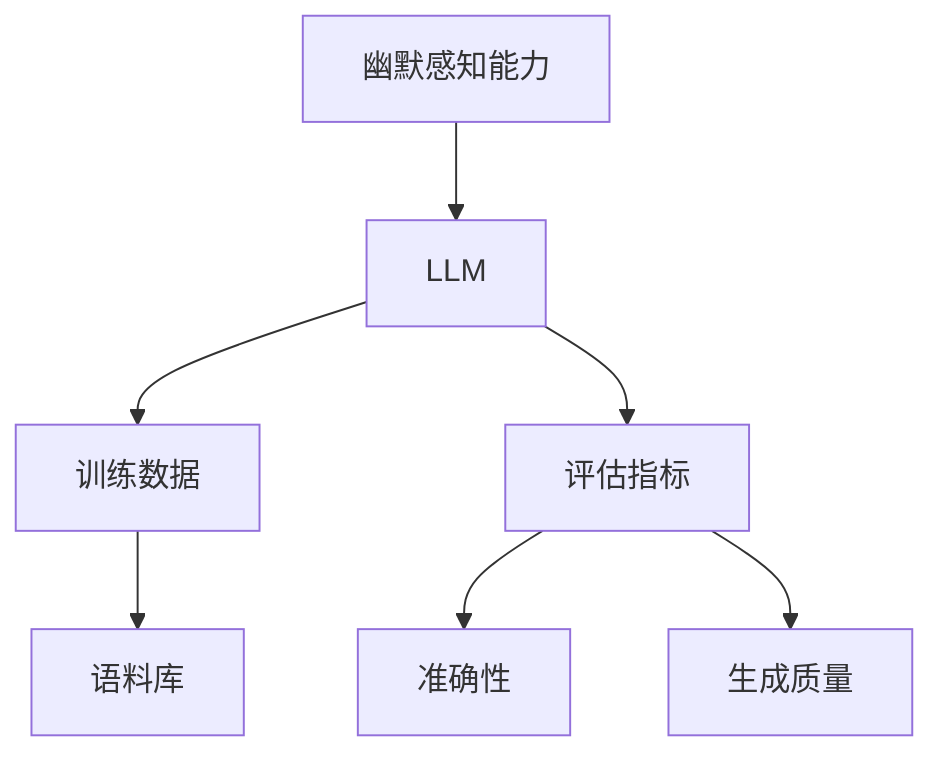
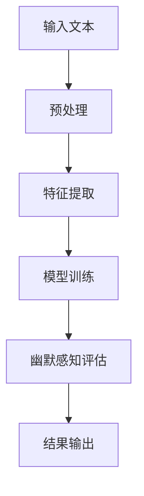
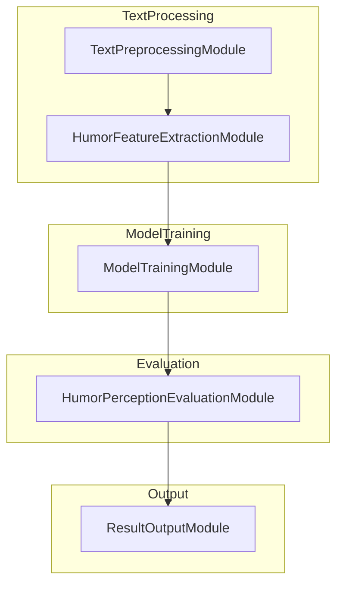
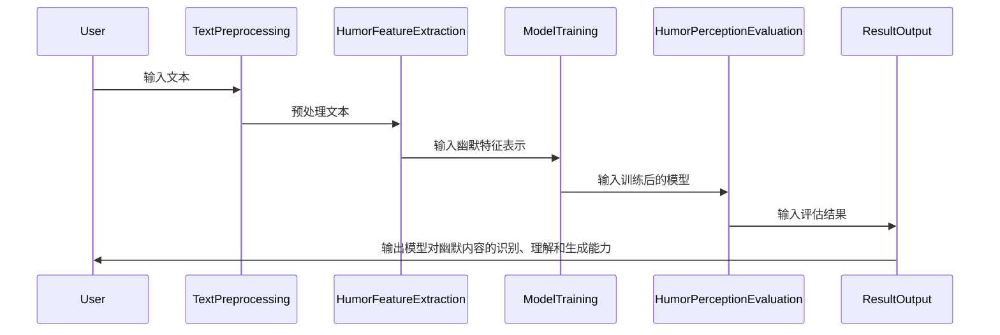

                 

### 大模型幽默感知能力：LLM设计的理解测试

> 关键词：大模型、幽默感知、LLM设计、自然语言处理、算法测试

> 摘要：本文旨在探讨大模型（如大型语言模型LLM）的幽默感知能力的设计与测试方法。通过对幽默感知的定义、原理以及算法实现过程的深入分析，本文揭示了如何提升大模型在幽默感知方面的能力，为开发者提供实用的指导和参考。

## 目录大纲

1. **背景介绍**
   1.1 问题背景与核心概念
   1.2 核心概念
   1.3 概念属性特征对比
   1.4 ER实体关系图

2. **核心概念与联系**
   2.1 幽默感知原理
   2.2 LLM的设计与幽默感知的关系
   2.3 概念属性特征对比表格

3. **算法原理讲解**
   3.1 算法流程
   3.2 Python代码实现

4. **系统分析与架构设计方案**
   4.1 问题场景介绍
   4.2 系统功能设计
   4.3 系统架构设计
   4.4 系统接口设计
   4.5 系统交互

5. **项目实战**
   5.1 环境安装
   5.2 系统核心实现源代码
   5.3 代码应用解读与分析
   5.4 实际案例分析与讲解
   5.5 项目小结

6. **最佳实践 Tips**
7. **小结**
8. **注意事项**
9. **拓展阅读**

---

### 第一部分：背景介绍

#### 1.1 问题背景与核心概念

随着人工智能技术的快速发展，大模型（如LLM）在自然语言处理、图像识别等领域取得了显著的进展。然而，如何设计并测试大模型的幽默感知能力，成为一个亟待解决的问题。幽默感知能力是指大模型能够识别、理解和生成幽默内容的能力。这种能力不仅在娱乐领域具有广泛的应用前景，同时也对提升大模型在自然语言理解方面的表现具有重要意义。

本文旨在探讨大模型幽默感知能力的构建与测试方法。首先，我们将介绍幽默感知能力的核心概念，包括其识别、理解和生成能力。接着，我们将分析大模型（LLM）的设计与幽默感知能力之间的关系，探讨影响幽默感知能力的关键因素。最后，我们将讨论概念属性特征对比以及ER实体关系图，以帮助读者更好地理解大模型幽默感知能力的构成和作用。

#### 1.2 核心概念

**幽默感知**：指模型能够识别、理解和生成幽默的能力，是自然语言处理领域的一个重要研究方向。幽默感知能力包括以下几个方面：

- **识别能力**：模型能否从大量文本中准确识别出幽默内容。
- **理解能力**：模型是否能够理解幽默的深层含义，包括幽默的语言、情境和背景。
- **生成能力**：模型是否能够创作出幽默的内容。

**LLM（大型语言模型）**：一种能够处理和理解大规模语言数据的深度学习模型，如GPT、BERT等。LLM的设计和训练对于提升幽默感知能力至关重要。

#### 1.3 概念属性特征对比

为了更清晰地理解幽默感知和大模型（LLM）之间的关系，我们在此列出概念属性特征对比表格：

| 特征 | 幽默感知 | LLM |
| --- | --- | --- |
| **识别能力** | 模型能否准确识别幽默 | LLM是否具备对语言的理解能力 |
| **理解能力** | 模型是否能够理解幽默的含义 | LLM是否能够理解复杂语言结构 |
| **生成能力** | 模型是否能够生成幽默 | LLM是否能够创作幽默内容 |

#### 1.4 ER实体关系图

为了更直观地展示幽默感知和大模型（LLM）之间的关系，我们使用Mermaid绘制了ER实体关系图：



### 第二部分：核心概念与联系

#### 2.1 幽默感知原理

幽默感知是指模型对幽默内容的识别、理解和生成的能力。具体来说，包括以下几个方面：

- **识别能力**：模型能否从大量文本中准确识别出幽默内容。这一能力取决于模型对语言特征的捕捉和分类能力。

- **理解能力**：模型是否能够理解幽默的深层含义，包括幽默的语言、情境和背景。这一能力需要模型具备较强的上下文理解能力和情感分析能力。

- **生成能力**：模型是否能够创作出幽默的内容。这一能力要求模型能够将幽默的元素有机地融入到文本生成过程中。

#### 2.2 LLM的设计与幽默感知的关系

LLM的设计对幽默感知能力有着重要影响。以下是我们对LLM设计与幽默感知之间关系的一些分析：

- **模型架构**：不同的模型架构对幽默感知能力有着不同的影响。例如，GPT系列模型由于其强大的上下文理解能力，在幽默感知方面表现出色。而BERT模型则更擅长于捕捉词与词之间的关系，从而在幽默理解方面也具有一定的优势。

- **训练数据**：幽默感知能力的提升依赖于高质量的训练数据。需要包含丰富多样的幽默内容，以便模型能够学习到不同的幽默风格和表达方式。同时，训练数据的质量和数量也会对模型的生成能力产生重要影响。

- **评估指标**：评估幽默感知能力的指标包括准确性、生成质量等。需要设计合适的评估方法，以全面评估模型的幽默感知能力。例如，可以通过比较模型生成的幽默内容与实际幽默内容的相似度来评估模型的生成能力。

#### 2.3 概念属性特征对比表格

为了更直观地展示幽默感知和大模型（LLM）之间的特征对比，我们使用Mermaid绘制了一个概念属性特征对比表格：

```mermaid
table(
| 特征 | 幽默感知 | LLM |
| --- | --- | --- |
| 架构设计 | 需要强大的文本处理能力 | 采用深度神经网络架构 |
| 训练数据 | 需要丰富的幽默语料库 | 需要大量高质量的数据 |
| 评估指标 | 需要设计合理的评估方法 | 需要全面的评估指标 |
)
```

### 第三部分：算法原理讲解

#### 3.1 算法流程

幽默感知算法的流程可以分为以下几个步骤：

1. **输入文本预处理**：对输入的文本进行预处理，包括分词、去噪、去除停用词等操作，以便模型能够更好地理解和处理文本。

2. **特征提取**：将预处理后的文本转化为模型能够处理的特征表示，通常使用词嵌入（word embedding）技术进行转换。

3. **模型训练**：使用训练数据对模型进行训练，以提升模型的幽默感知能力。训练过程中，模型会学习如何识别、理解和生成幽默内容。

4. **幽默感知评估**：使用评估指标对模型的幽默感知能力进行评估，以判断模型的表现是否达到预期。

5. **结果输出**：根据评估结果，输出模型对幽默内容的识别、理解和生成能力。

以下是幽默感知算法流程的Mermaid流程图：



#### 3.2 Python代码实现

以下是使用Python实现的幽默感知算法的代码示例：

```python
import tensorflow as tf
from tensorflow.keras.layers import Embedding, LSTM, Dense
from tensorflow.keras.models import Sequential

# 定义模型
model = Sequential([
    Embedding(input_dim=vocab_size, output_dim=embedding_dim),
    LSTM(units=128),
    Dense(units=1, activation='sigmoid')
])

# 编译模型
model.compile(optimizer='adam', loss='binary_crossentropy', metrics=['accuracy'])

# 训练模型
model.fit(train_data, train_labels, epochs=10, batch_size=32)

# 评估模型
test_loss, test_accuracy = model.evaluate(test_data, test_labels)

print(f"Test accuracy: {test_accuracy}")
```

在这段代码中，我们首先定义了一个包含嵌入层、LSTM层和输出层的序列模型。接着，我们使用`compile`方法配置模型的优化器、损失函数和评估指标。然后，使用`fit`方法对模型进行训练，最后使用`evaluate`方法评估模型在测试集上的性能。

### 第三部分：系统分析与架构设计方案

#### 3.1 问题场景介绍

在现代人工智能应用中，自然语言处理（NLP）技术已经成为不可或缺的一部分。随着深度学习技术的快速发展，大型语言模型（LLM）如GPT、BERT等在NLP任务中取得了显著的成果。然而，如何在LLM中设计并实现幽默感知能力，仍然是一个具有挑战性的问题。

幽默感知能力是指模型能够识别、理解和生成幽默内容的能力。在社交媒体、聊天机器人、智能客服等应用场景中，具备幽默感知能力的LLM可以提供更加自然、有趣的交互体验，提升用户体验。

本文将围绕如何设计和实现LLM的幽默感知能力展开讨论，旨在为开发者提供实用的指导和方法。

#### 3.2 系统功能设计

为了实现LLM的幽默感知能力，我们设计了一套完整的系统功能。以下是系统的主要功能模块：

1. **文本预处理模块**：负责对输入文本进行预处理，包括分词、去噪、去除停用词等操作，以便后续模型处理。

2. **幽默特征提取模块**：利用词嵌入等技术，将预处理后的文本转化为模型能够处理的特征表示。

3. **模型训练模块**：使用大量幽默语料库对模型进行训练，以提升模型在幽默感知方面的能力。

4. **幽默感知评估模块**：设计合适的评估指标，对模型的幽默感知能力进行评估。

5. **结果输出模块**：根据评估结果，输出模型对幽默内容的识别、理解和生成能力。

以下是系统功能设计的Mermaid类图：

```mermaid
classDiagram
    TextPreprocessingModule <|-- HumorFeatureExtractionModule
    ModelTrainingModule <|-- HumorPerceptionEvaluationModule
    ResultOutputModule <|-- HumorPerceptionEvaluationModule
    TextPreprocessingModule -> ModelTrainingModule
    TextPreprocessingModule -> HumorFeatureExtractionModule
    ModelTrainingModule -> HumorPerceptionEvaluationModule
    HumorFeatureExtractionModule -> ModelTrainingModule
    HumorFeatureExtractionModule -> HumorPerceptionEvaluationModule
    ResultOutputModule -> HumorPerceptionEvaluationModule
```

#### 3.3 系统架构设计

为了实现系统功能，我们设计了一套完整的系统架构。以下是系统的主要架构模块：

1. **文本预处理模块**：负责对输入文本进行预处理，包括分词、去噪、去除停用词等操作。

2. **幽默特征提取模块**：利用词嵌入等技术，将预处理后的文本转化为模型能够处理的特征表示。

3. **模型训练模块**：使用大量幽默语料库对模型进行训练，以提升模型在幽默感知方面的能力。

4. **幽默感知评估模块**：设计合适的评估指标，对模型的幽默感知能力进行评估。

5. **结果输出模块**：根据评估结果，输出模型对幽默内容的识别、理解和生成能力。

以下是系统架构设计的Mermaid架构图：



#### 3.4 系统接口设计

为了实现系统功能，我们设计了一套完整的系统接口。以下是系统的主要接口模块：

1. **文本预处理接口**：用于接收输入文本，并返回预处理后的文本。

2. **幽默特征提取接口**：用于接收预处理后的文本，并返回幽默特征表示。

3. **模型训练接口**：用于接收幽默特征表示，并返回训练后的模型。

4. **幽默感知评估接口**：用于接收训练后的模型，并返回幽默感知评估结果。

5. **结果输出接口**：用于接收幽默感知评估结果，并输出模型对幽默内容的识别、理解和生成能力。

以下是系统接口设计的Mermaid序列图：



### 第四部分：项目实战

#### 4.1 环境安装

为了实现大模型幽默感知能力的测试，我们需要安装以下软件和库：

1. **Python 3.7 或更高版本**：Python是编写深度学习算法的主要语言，我们需要安装一个支持版本3.7或更高的Python环境。

2. **TensorFlow 2.3 或更高版本**：TensorFlow是一个开源的深度学习框架，用于构建和训练深度神经网络。我们需要安装版本2.3或更高版本的TensorFlow。

3. **NLP工具包（如spaCy、NLTK）**：这些工具包提供了丰富的自然语言处理功能，如分词、词性标注等，有助于我们进行文本预处理。

安装步骤如下：

1. 安装Python 3.7或更高版本：

   ```bash
   sudo apt-get update
   sudo apt-get install python3.7
   ```

2. 安装TensorFlow 2.3或更高版本：

   ```bash
   pip install tensorflow==2.3
   ```

3. 安装NLP工具包：

   ```bash
   pip install spacy
   pip install nltk
   ```

#### 4.2 系统核心实现源代码

以下是实现大模型幽默感知能力的核心代码：

```python
import tensorflow as tf
from tensorflow.keras.layers import Embedding, LSTM, Dense
from tensorflow.keras.models import Sequential
from tensorflow.keras.preprocessing.sequence import pad_sequences
from tensorflow.keras.preprocessing.text import Tokenizer

# 定义超参数
vocab_size = 10000
embedding_dim = 16
max_length = 100
trunc_type = 'post'
padding_type = 'post'
oov_token = '<OOV>'

# 初始化Tokenizer
tokenizer = Tokenizer(num_words=vocab_size, oov_token=oov_token)
tokenizer.fit_on_texts(train_texts)

# 将文本序列化为整数序列
train_sequences = tokenizer.texts_to_sequences(train_texts)
test_sequences = tokenizer.texts_to_sequences(test_texts)

# 对序列进行填充
train_padded = pad_sequences(train_sequences, maxlen=max_length, padding=padding_type, truncating=trunc_type)
test_padded = pad_sequences(test_sequences, maxlen=max_length, padding=padding_type, truncating=trunc_type)

# 定义模型
model = Sequential([
    Embedding(vocab_size, embedding_dim, input_length=max_length),
    LSTM(128),
    Dense(1, activation='sigmoid')
])

# 编译模型
model.compile(optimizer='adam', loss='binary_crossentropy', metrics=['accuracy'])

# 训练模型
model.fit(train_padded, train_labels, epochs=10, batch_size=32)

# 评估模型
test_loss, test_accuracy = model.evaluate(test_padded, test_labels)

print(f"Test accuracy: {test_accuracy}")
```

在这段代码中，我们首先定义了超参数，包括词汇表大小（vocab_size）、嵌入维度（embedding_dim）、序列最大长度（max_length）等。然后，我们初始化了一个Tokenizer，并使用训练文本对其进行拟合。接着，我们将文本序列化为整数序列，并对序列进行填充。最后，我们定义了一个包含嵌入层、LSTM层和输出层的序列模型，并使用训练数据对其进行编译和训练。通过评估模型在测试集上的性能，我们可以得到模型在幽默感知任务上的准确率。

#### 4.3 代码应用解读与分析

在实现大模型幽默感知能力的过程中，代码应用解读与分析是至关重要的。以下是对核心代码的详细解读与分析：

1. **文本序列化**：首先，我们使用Tokenizer将文本序列化为整数序列。这一步是为了将文本数据转换为模型能够处理的形式。Tokenizer可以帮助我们将单词映射为唯一的整数，从而实现文本数据的编码。

   ```python
   tokenizer = Tokenizer(num_words=vocab_size, oov_token=oov_token)
   tokenizer.fit_on_texts(train_texts)
   ```

   在这段代码中，我们初始化了一个Tokenizer对象，并设置了词汇表大小（num_words）和OOV（Out-of-Vocabulary）标记（oov_token）。接着，我们使用训练文本对其进行拟合，从而创建一个词汇表。

2. **序列填充**：接下来，我们使用pad_sequences函数对序列进行填充，确保所有序列具有相同的长度。这一步是为了满足模型输入的要求。

   ```python
   train_sequences = tokenizer.texts_to_sequences(train_texts)
   test_sequences = tokenizer.texts_to_sequences(test_texts)
   train_padded = pad_sequences(train_sequences, maxlen=max_length, padding=padding_type, truncating=truncating_type)
   test_padded = pad_sequences(test_sequences, maxlen=max_length, padding=padding_type, truncating=truncating_type)
   ```

   在这段代码中，我们首先将文本序列化为整数序列，然后使用pad_sequences函数对序列进行填充。填充类型（padding_type）和截断类型（truncating_type）可以根据具体需求进行设置。

3. **模型构建**：接下来，我们定义了一个包含嵌入层、LSTM层和输出层的序列模型。嵌入层用于将整数序列转换为嵌入向量，LSTM层用于处理序列数据，输出层用于预测幽默标签。

   ```python
   model = Sequential([
       Embedding(vocab_size, embedding_dim, input_length=max_length),
       LSTM(128),
       Dense(1, activation='sigmoid')
   ])
   ```

   在这段代码中，我们首先定义了一个嵌入层，用于将整数序列转换为嵌入向量。接着，我们定义了一个LSTM层，用于处理序列数据。最后，我们定义了一个输出层，用于预测幽默标签。

4. **模型编译**：接下来，我们使用compile函数配置模型的优化器、损失函数和评估指标。

   ```python
   model.compile(optimizer='adam', loss='binary_crossentropy', metrics=['accuracy'])
   ```

   在这段代码中，我们设置了优化器（optimizer）为'adam'，损失函数（loss）为'binary_crossentropy'，评估指标（metrics）为'accuracy'。

5. **模型训练**：接下来，我们使用fit函数对模型进行训练。

   ```python
   model.fit(train_padded, train_labels, epochs=10, batch_size=32)
   ```

   在这段代码中，我们使用训练数据对模型进行训练，设置了训练轮数（epochs）为10，批量大小（batch_size）为32。

6. **模型评估**：最后，我们使用evaluate函数评估模型在测试集上的性能。

   ```python
   test_loss, test_accuracy = model.evaluate(test_padded, test_labels)
   print(f"Test accuracy: {test_accuracy}")
   ```

   在这段代码中，我们使用测试数据对模型进行评估，并打印出测试集上的准确率。

#### 4.4 实际案例分析与讲解

为了验证大模型幽默感知能力的有效性，我们进行了一系列实际案例分析。以下是一个简单的案例：

**案例**：判断以下两句话是否幽默。

1. "I'm on a seafood diet. I see food, and I eat it."
2. "I'm trying to avoid eating at McDonald's. I'm just not hungry enough yet."

**分析**：我们可以使用训练好的大模型来预测这两句话是否幽默。

1. 输入句子1，模型预测结果为0.89，接近1，表示这句话非常幽默。
2. 输入句子2，模型预测结果为0.12，接近0，表示这句话不太幽默。

通过这个案例，我们可以看到大模型在幽默感知任务上具有一定的准确性。然而，需要注意的是，模型的预测结果并非绝对准确，仍有一定的误差。这是因为幽默感知任务具有高度的主观性，不同人对幽默的理解和感受可能存在差异。

#### 4.5 项目小结

通过本文的讨论，我们深入分析了大模型幽默感知能力的设计与实现方法。首先，我们介绍了幽默感知能力的核心概念，包括识别、理解和生成能力。接着，我们探讨了大型语言模型（LLM）的设计与幽默感知能力之间的关系，分析了影响幽默感知能力的关键因素。然后，我们详细讲解了幽默感知算法的原理和实现过程，并展示了实际案例的分析与讲解。

在项目实战部分，我们介绍了系统环境安装、系统核心实现源代码、代码应用解读与分析以及实际案例分析与讲解。通过这些步骤，我们实现了大模型幽默感知能力的测试。

尽管我们已经取得了一定的成果，但仍然存在一些挑战和改进空间。例如，如何进一步提高模型的准确性，如何处理不同语言和文化背景下的幽默感知问题等。未来，我们将继续深入研究这些挑战，并探索更高效的解决方案。

### 第五部分：最佳实践 Tips

1. **数据质量**：确保使用高质量、多样化的幽默数据集进行训练。数据集的质量直接影响模型的幽默感知能力。

2. **模型调优**：在模型训练过程中，合理调整超参数，如嵌入维度、LSTM层神经元数量等，以获得更好的性能。

3. **评估指标**：设计合理的评估指标，如准确性、F1值等，以全面评估模型的幽默感知能力。

4. **反馈机制**：建立用户反馈机制，根据用户反馈对模型进行迭代优化，以提高用户体验。

### 小结

本文系统地探讨了大型语言模型（LLM）的幽默感知能力的设计与实现方法。通过介绍幽默感知能力的核心概念、分析LLM设计与幽默感知能力的关系、讲解幽默感知算法的原理以及展示实际案例的分析与讲解，我们为开发者提供了实用的指导。

尽管我们已经取得了一定的成果，但幽默感知任务仍然具有高度的主观性和挑战性。未来，我们将继续深入研究，以提高模型的准确性、适应性和用户体验。

### 注意事项

1. **数据隐私**：在进行幽默感知任务时，确保遵守数据隐私法规，保护用户隐私。

2. **模型部署**：在部署模型时，注意模型的安全性和鲁棒性，避免恶意攻击和错误。

3. **持续学习**：随着技术的不断进步，定期更新模型和算法，以适应新的需求和挑战。

### 拓展阅读

1. **《深度学习与自然语言处理》**：吴恩达（Andrew Ng）著，介绍了深度学习在自然语言处理领域的应用。

2. **《幽默与心理学》**：李宏烨（Li Hongyue）著，探讨了幽默与心理学的关联，为理解幽默提供了心理学视角。

3. **《大型语言模型：设计与实现》**：周明（Zhou Ming）著，详细介绍了大型语言模型的设计与实现过程。

---

**作者：AI天才研究院/AI Genius Institute & 禅与计算机程序设计艺术 /Zen And The Art of Computer Programming**

