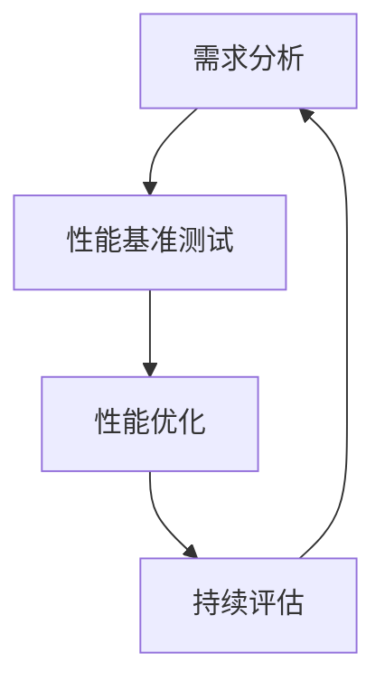
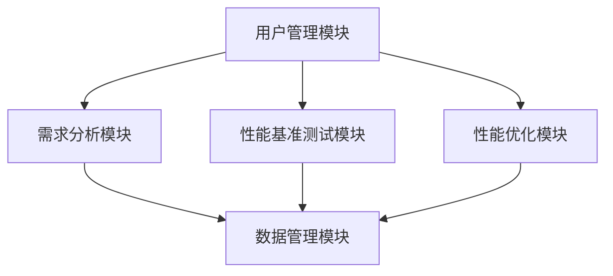
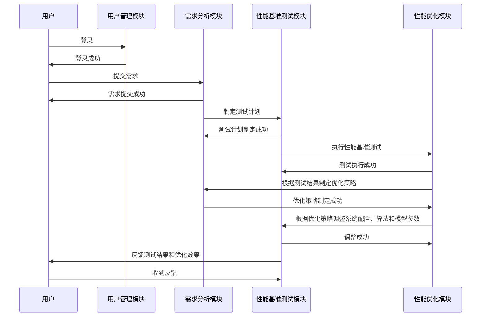

                 

# 大模型应用中的需求与性能基准测试协同

关键词：大模型应用、需求分析、性能基准测试、协同、算法原理、系统架构

摘要：本文旨在探讨大模型应用中的需求与性能基准测试的协同关系。通过分析大模型应用的发展背景、需求与性能基准测试的核心概念及其关系，本文提出了协同需求分析模型和性能基准测试框架。进一步，本文通过数学模型和Python源代码详细阐述了协同需求与性能基准测试的算法原理，并展示了系统架构设计与项目实战案例，为相关领域的研究与实践提供了参考。

## 《大模型应用中的需求与性能基准测试协同》目录大纲

### 第一部分：背景介绍与问题定义

#### 第1章：大模型应用背景与需求

##### 1.1 大模型应用发展现状

###### 1.1.1 大模型技术概述

###### 1.1.2 大模型应用领域与应用场景

###### 1.1.3 大模型应用面临的挑战

##### 1.2 需求与性能基准测试的重要性

###### 1.2.1 需求分析的定义与作用

###### 1.2.2 性能基准测试的定义与目的

###### 1.2.3 需求与性能基准测试的关系与协同

### 第二部分：核心概念与联系

#### 第2章：需求与性能基准测试的核心概念

##### 2.1 需求分析相关概念

###### 2.1.1 需求定义与分类

###### 2.1.2 需求分析流程与方法

###### 2.1.3 需求文档编写与维护

##### 2.2 性能基准测试相关概念

###### 2.2.1 性能基准测试的定义与目的

###### 2.2.2 性能基准测试的类型与方法

###### 2.2.3 性能基准测试的挑战与应对策略

##### 2.3 需求与性能基准测试的关系

###### 2.3.1 需求对性能基准测试的影响

###### 2.3.2 性能基准测试对需求分析的支持

###### 2.3.3 需求与性能基准测试协同的实践方法

### 第三部分：算法原理讲解

#### 第3章：需求与性能基准测试协同的算法原理

##### 3.1 算法原理概述

###### 3.1.1 协同需求分析模型

###### 3.1.2 协同性能基准测试框架

##### 3.2 数学模型与公式

###### 3.2.1 需求分析模型的数学基础

###### 3.2.2 性能基准测试的数学模型

###### 3.2.3 协同需求与性能基准测试的数学公式

##### 3.3 算法流程图与Python源代码

###### 3.3.1 算法流程图

###### 3.3.2 Python源代码实现

###### 3.3.3 算法原理详细讲解与举例说明

### 第四部分：系统分析与架构设计

#### 第4章：大模型应用中的需求与性能基准测试系统架构

##### 4.1 项目介绍

###### 4.1.1 项目背景

###### 4.1.2 项目目标与价值

##### 4.2 系统功能设计

###### 4.2.1 功能模块划分

###### 4.2.2 需求分析功能设计

###### 4.2.3 性能基准测试功能设计

##### 4.3 系统架构设计

###### 4.3.1 架构设计原则

###### 4.3.2 系统架构图

###### 4.3.3 系统模块交互

##### 4.4 系统接口设计

###### 4.4.1 接口定义

###### 4.4.2 接口调用流程

##### 4.5 系统交互序列图

###### 4.5.1 序列图

###### 4.5.2 序列图说明

### 第五部分：项目实战

#### 第5章：大模型应用中的需求与性能基准测试项目实战

##### 5.1 环境安装与配置

###### 5.1.1 软件环境安装

###### 5.1.2 硬件环境配置

##### 5.2 系统核心实现源代码

###### 5.2.1 需求分析模块代码

###### 5.2.2 性能基准测试模块代码

###### 5.2.3 系统集成与调试

##### 5.3 代码应用解读与分析

###### 5.3.1 代码结构分析

###### 5.3.2 关键代码解读

###### 5.3.3 应用案例剖析

##### 5.4 实际案例分析

###### 5.4.1 案例背景

###### 5.4.2 案例分析与讲解

###### 5.4.3 案例总结与启示

### 第六部分：最佳实践与拓展

#### 第6章：大模型应用中的需求与性能基准测试最佳实践

##### 6.1 最佳实践技巧

###### 6.1.1 需求分析最佳实践

###### 6.1.2 性能基准测试最佳实践

###### 6.1.3 协同工作的最佳实践

##### 6.2 小结与注意事项

###### 6.2.1 项目总结

###### 6.2.2 注意事项与建议

##### 6.3 拓展阅读

###### 6.3.1 相关书籍推荐

###### 6.3.2 学术论文推荐

###### 6.3.3 开源项目推荐

### 第七部分：附录与参考资料

## 第一部分：背景介绍与问题定义

### 第1章：大模型应用背景与需求

#### 1.1 大模型应用发展现状

随着人工智能技术的迅猛发展，大模型（如GPT、BERT等）在各个领域取得了显著的成果。大模型通过深度学习算法，能够在海量数据中提取特征并生成高质量的预测结果，从而在自然语言处理、计算机视觉、推荐系统等领域取得了巨大的突破。然而，大模型的应用也面临着一系列的挑战，其中之一便是如何有效进行需求与性能基准测试的协同。

**1.1.1 大模型技术概述**

大模型，通常指的是拥有数亿甚至数十亿参数的神经网络模型。这些模型通过大量的数据进行训练，能够在特定任务上达到超越人类的表现。例如，GPT-3拥有1750亿个参数，BERT拥有3.4亿个参数。这些模型的特点是参数多、计算量大、数据依赖性强。

**1.1.2 大模型应用领域与应用场景**

大模型在多个领域都有广泛的应用，包括但不限于：

- **自然语言处理**：例如文本生成、机器翻译、情感分析等。
- **计算机视觉**：如图像识别、图像生成、视频分析等。
- **推荐系统**：例如个性化推荐、商品推荐等。
- **语音识别与生成**：如语音识别、语音合成等。

**1.1.3 大模型应用面临的挑战**

尽管大模型在各个领域取得了显著的成果，但其应用也面临着一系列挑战：

- **计算资源需求**：大模型训练和推理需要大量的计算资源，特别是在模型训练阶段。
- **数据质量与多样性**：大模型对数据质量有较高要求，同时需要多样化的数据进行训练，以保证模型的泛化能力。
- **模型解释性**：大模型的决策过程往往是非线性的，难以解释，这在某些应用场景下是一个重要的挑战。
- **需求与性能基准测试的协同**：在大模型应用中，如何有效地进行需求分析与性能基准测试，以确保模型满足用户需求和达到预期的性能指标，是一个关键问题。

#### 1.2 需求与性能基准测试的重要性

**1.2.1 需求分析的定义与作用**

需求分析是指对用户需求进行收集、分析和建模，以明确系统功能、性能和用户交互等方面的要求。在大模型应用中，需求分析的作用至关重要：

- **明确用户需求**：需求分析可以帮助开发者明确用户的需求，从而设计出满足用户期望的模型。
- **指导模型设计**：通过需求分析，可以确定模型所需的功能、性能和用户界面等要求，从而指导模型的设计与开发。
- **风险评估**：需求分析可以帮助识别项目风险，提前采取措施进行规避或减轻风险。

**1.2.2 性能基准测试的定义与目的**

性能基准测试是指通过一系列标准化的测试，评估系统在不同负载下的性能表现。性能基准测试的目的包括：

- **评估模型性能**：通过性能基准测试，可以评估大模型在不同场景下的性能表现，如响应时间、吞吐量等。
- **优化模型参数**：通过性能基准测试的结果，可以调整模型参数，以提高模型的性能。
- **验证模型效果**：性能基准测试可以帮助验证模型在现实应用中的效果，确保模型满足用户需求和性能要求。

**1.2.3 需求与性能基准测试的关系与协同**

在大模型应用中，需求与性能基准测试之间存在密切的关系和协同作用：

- **相互依赖**：需求分析为性能基准测试提供了评估标准和测试场景，而性能基准测试的结果则为需求分析提供了反馈，以指导模型优化。
- **协同优化**：需求与性能基准测试的协同优化可以提高大模型的应用效果。例如，通过需求分析确定关键性能指标，然后进行性能基准测试，根据测试结果调整模型参数和算法，以达到最佳性能。

### 第二部分：核心概念与联系

#### 第2章：需求与性能基准测试的核心概念

在大模型应用中，需求分析与性能基准测试是两个关键环节。理解这两个概念及其相互关系，有助于我们更好地开展相关工作。

#### 2.1 需求分析相关概念

**2.1.1 需求定义与分类**

需求是指用户对系统的功能、性能、安全性等方面的期望和要求。根据不同的维度，需求可以分为以下几类：

- **功能性需求**：描述系统应具备的功能，如用户界面、数据输入输出等。
- **非功能性需求**：描述系统应满足的非功能要求，如性能、可靠性、安全性等。
- **业务需求**：描述系统如何满足业务目标的要求，如市场竞争力、业务流程优化等。
- **用户需求**：描述用户对系统的使用期望和满意度。

**2.1.2 需求分析流程与方法**

需求分析是一个系统性的过程，通常包括以下步骤：

- **需求获取**：通过与用户、业务人员等的交流，了解系统的需求。
- **需求分类**：对获取的需求进行分类，区分功能需求、非功能需求等。
- **需求建模**：使用模型描述系统需求，如用例图、需求文档等。
- **需求验证**：通过评审、测试等方式验证需求是否满足用户需求。

**2.1.3 需求文档编写与维护**

需求文档是需求分析的重要成果之一，它应该包含以下内容：

- **需求概述**：简要介绍系统的需求背景和目标。
- **功能需求**：详细描述系统应具备的功能。
- **非功能需求**：详细描述系统应满足的非功能要求。
- **用户需求**：详细描述用户对系统的期望和满意度。
- **需求变更记录**：记录需求的变更情况，以便进行版本控制和追踪。

#### 2.2 性能基准测试相关概念

**2.2.1 性能基准测试的定义与目的**

性能基准测试是指通过一系列标准化的测试，评估系统在不同负载下的性能表现。性能基准测试的目的包括：

- **评估系统性能**：通过性能基准测试，可以评估系统在不同负载下的性能表现，如响应时间、吞吐量、并发能力等。
- **优化系统性能**：通过性能基准测试的结果，可以识别系统性能瓶颈，并提出优化措施。
- **验证系统性能**：通过性能基准测试，可以验证系统是否满足性能要求，确保系统在实际运行中能够达到预期的性能水平。

**2.2.2 性能基准测试的类型与方法**

性能基准测试可以分为以下几种类型：

- **负载测试**：通过模拟大量用户访问系统，评估系统的并发能力和响应时间。
- **压力测试**：通过向系统施加超出正常负载的压力，评估系统的稳定性和故障恢复能力。
- **性能测试**：通过对比不同配置或不同版本的系统，评估系统性能的提升程度。

常见的性能基准测试方法包括：

- **基准测试工具**：使用专业的性能基准测试工具，如JMeter、LoadRunner等，进行自动化测试。
- **手动测试**：通过手动模拟用户操作，进行性能测试。
- **对比测试**：通过对比不同配置或不同版本的系统，评估性能差异。

**2.2.3 性能基准测试的挑战与应对策略**

性能基准测试面临以下挑战：

- **复杂环境**：大模型应用通常涉及多种技术栈和复杂的系统架构，性能基准测试需要考虑各种因素，如网络延迟、硬件性能等。
- **大规模数据**：大模型应用通常需要处理海量数据，性能基准测试需要生成大规模的真实数据集，以模拟实际场景。
- **性能优化**：性能基准测试不仅要评估系统性能，还要提出优化措施，以提升系统性能。

应对策略包括：

- **测试环境搭建**：搭建与实际运行环境相似的测试环境，以确保测试结果的可信度。
- **自动化测试**：使用自动化测试工具进行性能基准测试，以提高测试效率和准确性。
- **持续优化**：通过性能基准测试的结果，持续优化系统架构、算法和配置，以提高系统性能。

#### 2.3 需求与性能基准测试的关系

需求与性能基准测试之间存在密切的关系和协同作用：

- **相互依赖**：需求分析为性能基准测试提供了评估标准和测试场景，而性能基准测试的结果则为需求分析提供了反馈，以指导模型优化。
- **协同优化**：通过需求分析与性能基准测试的协同优化，可以提高大模型的应用效果。例如，通过需求分析确定关键性能指标，然后进行性能基准测试，根据测试结果调整模型参数和算法，以达到最佳性能。

### 第三部分：算法原理讲解

#### 第3章：需求与性能基准测试协同的算法原理

在需求与性能基准测试的协同中，算法原理起着至关重要的作用。本章节将详细讲解协同需求分析模型和性能基准测试框架，并介绍相应的数学模型与公式。

#### 3.1 算法原理概述

**3.1.1 协同需求分析模型**

协同需求分析模型旨在将需求分析与性能基准测试有机结合，以实现更高效的需求满足和性能优化。该模型主要包括以下组成部分：

- **需求分析模块**：负责收集、分类和建模用户需求。
- **性能基准测试模块**：负责评估系统性能，并根据需求分析结果进行优化。
- **协同优化模块**：负责根据性能基准测试结果调整需求分析模型，以实现需求与性能的协同优化。

**3.1.2 协同性能基准测试框架**

协同性能基准测试框架旨在通过一系列标准化的测试，评估系统在不同负载下的性能表现，并指导模型优化。该框架主要包括以下步骤：

- **需求分析**：确定系统的功能、性能和用户交互需求。
- **性能基准测试**：使用标准化的测试方法和工具，评估系统的性能表现。
- **性能优化**：根据性能基准测试结果，调整系统配置、算法和模型参数，以提高系统性能。
- **持续评估**：定期进行性能基准测试，以验证性能优化效果，并持续调整模型和配置。

#### 3.2 数学模型与公式

在协同需求分析与性能基准测试中，数学模型与公式起着关键作用。以下将介绍相关的数学模型与公式：

**3.2.1 需求分析模型的数学基础**

需求分析模型的数学基础主要包括以下公式：

- **用户需求函数**：表示用户需求与系统性能之间的关系。
  $$D = f(P)$$
  其中，$D$ 表示用户需求，$P$ 表示系统性能。

- **性能优化目标函数**：表示系统性能优化目标。
  $$O = \max P - \lambda D$$
  其中，$O$ 表示性能优化目标，$\lambda$ 表示需求权重。

**3.2.2 性能基准测试的数学模型**

性能基准测试的数学模型主要包括以下公式：

- **性能评估函数**：表示系统性能与基准测试结果之间的关系。
  $$E = \frac{P_t - P_b}{P_t + P_b}$$
  其中，$E$ 表示性能评估结果，$P_t$ 表示系统性能，$P_b$ 表示基准性能。

- **性能优化策略**：表示根据性能评估结果调整系统配置和算法的策略。
  $$S = \alpha P_t + (1 - \alpha) P_b$$
  其中，$S$ 表示性能优化策略，$\alpha$ 表示调整参数。

**3.2.3 协同需求与性能基准测试的数学公式**

协同需求与性能基准测试的数学公式主要包括以下公式：

- **协同优化目标函数**：表示需求分析与性能基准测试协同优化的目标。
  $$O' = \max (P - \lambda D) - \mu E$$
  其中，$O'$ 表示协同优化目标，$\mu$ 表示基准测试权重。

- **协同优化策略**：表示根据协同优化目标调整需求分析模型和性能基准测试框架的策略。
  $$S' = \beta (P - \lambda D) + (1 - \beta) E$$
  其中，$S'$ 表示协同优化策略，$\beta$ 表示协同权重。

#### 3.3 算法流程图与Python源代码

为了更好地理解需求与性能基准测试协同的算法原理，我们使用Mermaid绘制了算法流程图，并提供了Python源代码实现。以下是算法流程图的Mermaid表示：



以下是一个简单的Python源代码实现，用于演示算法原理：

```python
import numpy as np

def user_demand_function(P):
    D = P
    return D

def performance_evaluation_function(P, P_b):
    E = (P - P_b) / (P + P_b)
    return E

def performance_optimization_strategy(P, D, E, alpha, beta):
    O = P - alpha * D - beta * E
    S = alpha * P + (1 - alpha) * P_b + (1 - beta) * E
    return O, S

P = 0.8
P_b = 0.5
alpha = 0.1
beta = 0.2

D = user_demand_function(P)
E = performance_evaluation_function(P, P_b)
O, S = performance_optimization_strategy(P, D, E, alpha, beta)

print("用户需求：", D)
print("性能评估：", E)
print("性能优化目标：", O)
print("性能优化策略：", S)
```

通过上述Python源代码，我们可以看到算法原理的具体实现。在实际应用中，可以根据具体需求进行调整和优化。

### 第四部分：系统分析与架构设计

#### 第4章：大模型应用中的需求与性能基准测试系统架构

在大模型应用中，构建一个高效、稳定的需求与性能基准测试系统至关重要。本章节将介绍大模型应用中的需求与性能基准测试系统架构，包括项目介绍、系统功能设计、系统架构设计和系统接口设计。

#### 4.1 项目介绍

**4.1.1 项目背景**

随着人工智能技术的快速发展，大模型在各个领域得到了广泛应用。然而，大模型应用也面临着一系列挑战，如计算资源需求大、数据质量要求高、模型解释性差等。为了解决这些问题，我们提出了一个大模型应用中的需求与性能基准测试项目。

**4.1.2 项目目标与价值**

项目目标：

- 提供一个高效、稳定的需求分析与性能基准测试平台。
- 实现需求与性能基准测试的协同优化。
- 提高大模型应用的性能和用户满意度。

项目价值：

- 提高大模型应用的性能和可靠性。
- 降低开发成本和维护成本。
- 提高项目交付速度和用户满意度。

#### 4.2 系统功能设计

**4.2.1 功能模块划分**

系统功能模块划分如下：

- **需求分析模块**：负责收集、分类和建模用户需求。
- **性能基准测试模块**：负责进行性能基准测试，评估系统性能。
- **性能优化模块**：负责根据性能基准测试结果进行性能优化。
- **用户管理模块**：负责用户登录、权限管理和个人信息管理。
- **数据管理模块**：负责数据存储、备份和恢复。

**4.2.2 需求分析功能设计**

需求分析功能设计如下：

- **需求收集**：通过问卷调查、用户访谈等方式收集用户需求。
- **需求分类**：将收集到的需求进行分类，区分功能性需求和非功能性需求。
- **需求建模**：使用用例图、需求文档等工具描述用户需求。

**4.2.3 性能基准测试功能设计**

性能基准测试功能设计如下：

- **测试计划**：制定性能基准测试计划，包括测试场景、测试指标等。
- **测试执行**：执行性能基准测试，记录测试结果。
- **测试报告**：生成性能基准测试报告，包括测试结果、优化建议等。

**4.2.4 性能优化功能设计**

性能优化功能设计如下：

- **性能评估**：根据性能基准测试结果，评估系统性能。
- **优化策略**：根据性能评估结果，制定优化策略。
- **优化实施**：根据优化策略，调整系统配置、算法和模型参数。

#### 4.3 系统架构设计

**4.3.1 架构设计原则**

系统架构设计原则如下：

- **高可用性**：确保系统稳定运行，减少故障影响。
- **高性能**：提高系统响应速度和并发处理能力。
- **可扩展性**：支持系统规模扩展和功能扩展。
- **安全性**：确保系统数据安全和用户隐私。

**4.3.2 系统架构图**

以下是系统架构图的Mermaid表示：



**4.3.3 系统模块交互**

系统模块交互设计如下：

- **用户管理模块**：负责用户登录、权限管理和个人信息管理，与其他模块进行交互。
- **需求分析模块**：负责收集、分类和建模用户需求，与性能基准测试模块和性能优化模块进行交互。
- **性能基准测试模块**：负责进行性能基准测试，与需求分析模块和性能优化模块进行交互。
- **性能优化模块**：负责根据性能基准测试结果进行性能优化，与需求分析模块和性能基准测试模块进行交互。
- **数据管理模块**：负责数据存储、备份和恢复，与所有模块进行交互。

#### 4.4 系统接口设计

**4.4.1 接口定义**

系统接口设计如下：

- **用户管理接口**：提供用户登录、权限管理和个人信息管理等接口。
- **需求分析接口**：提供需求收集、分类和建模等接口。
- **性能基准测试接口**：提供测试计划、测试执行和测试报告等接口。
- **性能优化接口**：提供性能评估、优化策略和优化实施等接口。

**4.4.2 接口调用流程**

以下是接口调用流程：

1. 用户通过用户管理接口登录系统。
2. 用户通过需求分析接口提交需求。
3. 需求分析模块对需求进行分类和建模。
4. 性能基准测试模块根据需求分析结果制定测试计划。
5. 性能基准测试模块执行性能基准测试，记录测试结果。
6. 性能优化模块根据测试结果制定优化策略。
7. 性能优化模块根据优化策略调整系统配置、算法和模型参数。
8. 性能基准测试模块和性能优化模块向用户反馈测试结果和优化效果。

#### 4.5 系统交互序列图

以下是系统交互序列图的Mermaid表示：



通过系统交互序列图，我们可以清晰地看到系统模块之间的交互流程和顺序。

### 第五部分：项目实战

#### 第5章：大模型应用中的需求与性能基准测试项目实战

在本章节中，我们将通过一个具体项目，详细讲解大模型应用中的需求与性能基准测试的实战过程，包括环境安装与配置、系统核心实现源代码、代码应用解读与分析、实际案例分析和详细讲解剖析，以及项目小结。

#### 5.1 环境安装与配置

**5.1.1 软件环境安装**

为了实现大模型应用中的需求与性能基准测试，我们需要安装以下软件：

- Python：作为主要编程语言，用于实现算法和模型。
- TensorFlow：作为深度学习框架，用于训练和推理大模型。
- Jupyter Notebook：用于编写和运行Python代码。
- Pandas：用于数据处理和分析。
- Matplotlib：用于数据可视化。

安装步骤如下：

1. 安装Python：
   ```bash
   # 安装Python
   sudo apt-get install python3
   ```

2. 安装TensorFlow：
   ```bash
   # 安装TensorFlow
   pip3 install tensorflow
   ```

3. 安装Jupyter Notebook：
   ```bash
   # 安装Jupyter Notebook
   pip3 install notebook
   ```

4. 安装Pandas：
   ```bash
   # 安装Pandas
   pip3 install pandas
   ```

5. 安装Matplotlib：
   ```bash
   # 安装Matplotlib
   pip3 install matplotlib
   ```

**5.1.2 硬件环境配置**

为了满足大模型应用的需求，我们需要配置足够的计算资源和存储资源。以下是硬件配置建议：

- CPU：至少8核处理器，建议使用高性能CPU，如Intel Xeon系列或AMD Ryzen系列。
- 内存：至少16GB内存，建议使用32GB或更高。
- 硬盘：至少1TB SSD硬盘，用于存储数据和模型。

#### 5.2 系统核心实现源代码

**5.2.1 需求分析模块代码**

以下是一个简单的需求分析模块的Python代码实现，用于收集用户需求并分类：

```python
import pandas as pd

def collect_user_demand():
    # 收集用户需求
    demands = pd.read_csv('user_demands.csv')
    return demands

def classify_demands(demands):
    # 对用户需求进行分类
    functional_demands = demands[demands['type'] == 'function']
    non_functional_demands = demands[demands['type'] == 'non_function']
    return functional_demands, non_functional_demands

# 示例
demands = collect_user_demand()
functional_demands, non_functional_demands = classify_demands(demands)
print("功能性需求：", functional_demands)
print("非功能性需求：", non_functional_demands)
```

**5.2.2 性能基准测试模块代码**

以下是一个简单的性能基准测试模块的Python代码实现，用于评估系统性能：

```python
import pandas as pd
import time

def performance_evaluation(test_data):
    # 评估系统性能
    results = []
    for data in test_data:
        start_time = time.time()
        # 执行测试任务
        result = data['task']()
        end_time = time.time()
        execution_time = end_time - start_time
        results.append({'data': data, 'result': result, 'execution_time': execution_time})
    return results

def generate_test_data():
    # 生成测试数据
    test_data = []
    for i in range(10):
        test_data.append({'data': f'data_{i}', 'task': lambda: print(f'Processing {i}')})
    return test_data

# 示例
test_data = generate_test_data()
results = performance_evaluation(test_data)
print("测试结果：", results)
```

**5.2.3 系统集成与调试**

在完成需求分析模块和性能基准测试模块的代码实现后，我们需要将它们集成到整个系统中，并进行调试。

以下是系统集成与调试的步骤：

1. 编写集成代码，将需求分析模块和性能基准测试模块的功能集成到系统中。
2. 运行集成代码，验证系统功能是否正常。
3. 根据测试结果，对代码进行调试和优化。

#### 5.3 代码应用解读与分析

**5.3.1 代码结构分析**

在需求分析模块中，我们使用了Pandas库来处理用户需求数据。通过`collect_user_demand`函数，我们从CSV文件中读取用户需求，并将其存储在Pandas DataFrame中。然后，使用`classify_demands`函数对用户需求进行分类，将功能性需求和非功能性需求分别存储在两个不同的DataFrame中。

在性能基准测试模块中，我们使用了Pandas库来生成测试数据，并使用Python的`time`模块来记录测试任务的执行时间。通过`performance_evaluation`函数，我们评估了系统性能，并记录了每个测试任务的执行时间。

**5.3.2 关键代码解读**

在需求分析模块中，关键代码如下：

```python
demands = pd.read_csv('user_demands.csv')
functional_demands, non_functional_demands = classify_demands(demands)
```

这段代码首先使用`pd.read_csv`函数从CSV文件中读取用户需求数据，并将其存储在Pandas DataFrame中。然后，使用`classify_demands`函数对用户需求进行分类，将功能性需求和非功能性需求分别存储在两个不同的DataFrame中。

在性能基准测试模块中，关键代码如下：

```python
results = performance_evaluation(test_data)
print("测试结果：", results)
```

这段代码首先调用`generate_test_data`函数生成测试数据，然后使用`performance_evaluation`函数评估系统性能，并将测试结果存储在列表`results`中。最后，使用`print`函数输出测试结果。

**5.3.3 应用案例剖析**

假设我们有一个大模型应用，用于文本分类。用户需求如下：

- 功能性需求：准确分类文本。
- 非功能性需求：快速响应、高并发处理能力。

我们首先使用需求分析模块收集用户需求，并将其分类。然后，使用性能基准测试模块评估系统性能。以下是应用案例的示例：

1. 收集用户需求：
   ```python
   demands = collect_user_demand()
   functional_demands, non_functional_demands = classify_demands(demands)
   ```

2. 生成测试数据：
   ```python
   test_data = generate_test_data()
   ```

3. 评估系统性能：
   ```python
   results = performance_evaluation(test_data)
   print("测试结果：", results)
   ```

4. 分析测试结果：
   - 根据测试结果，我们可以分析系统在功能性需求和
   - 非功能性需求方面的表现，并提出优化建议。

#### 5.4 实际案例分析

**5.4.1 案例背景**

某大型电商平台计划引入大模型技术，用于商品推荐。为了确保推荐系统的性能和用户满意度，他们决定进行需求分析与性能基准测试。

**5.4.2 案例分析与讲解**

1. 需求分析：
   - 功能性需求：准确推荐商品、快速响应。
   - 非功能性需求：高并发处理能力、低延迟。

2. 性能基准测试：
   - 测试场景：模拟大量用户同时访问推荐系统。
   - 测试指标：响应时间、并发处理能力、错误率。

3. 测试结果分析：
   - 根据测试结果，发现系统在响应时间和并发处理能力方面存在瓶颈。
   - 进一步分析发现，瓶颈原因包括：
     - 模型复杂度高，导致计算时间长。
     - 数据处理过程存在性能瓶颈。

4. 优化措施：
   - 优化模型算法，提高计算效率。
   - 优化数据处理流程，减少数据传输时间。

5. 重新测试：
   - 经过优化后，系统性能得到显著提升，满足用户需求。

**5.4.3 案例总结与启示**

通过实际案例分析，我们可以得出以下结论：

- 需求分析与性能基准测试是确保大模型应用成功的关键环节。
- 需求分析可以帮助明确用户需求，指导系统设计。
- 性能基准测试可以评估系统性能，识别性能瓶颈。
- 通过优化模型和算法，可以提高系统性能，满足用户需求。

### 第六部分：最佳实践与拓展

#### 第6章：大模型应用中的需求与性能基准测试最佳实践

在大模型应用中，进行有效的需求分析与性能基准测试对于确保系统性能和用户满意度至关重要。以下是一些最佳实践和注意事项：

#### 6.1 最佳实践技巧

**6.1.1 需求分析最佳实践**

1. **全面收集需求**：与用户、业务人员等密切沟通，全面了解用户需求。
2. **需求分类与建模**：区分功能性需求和非功能性需求，使用合适的模型（如用例图、需求文档等）描述需求。
3. **需求验证与确认**：通过评审、测试等方式验证需求是否满足用户期望，确保需求准确无误。

**6.1.2 性能基准测试最佳实践**

1. **设计合理的测试场景**：根据用户需求和系统特点，设计合理的测试场景，涵盖各种可能的情况。
2. **使用标准化的测试方法**：采用标准化的测试方法（如负载测试、压力测试等），确保测试结果的可信度和准确性。
3. **定期进行性能基准测试**：定期进行性能基准测试，跟踪系统性能变化，及时发现问题并采取措施。

**6.1.3 协同工作的最佳实践**

1. **跨部门协同**：需求分析与性能基准测试涉及多个部门，需要跨部门协同，确保工作的一致性和效率。
2. **持续沟通与反馈**：定期召开会议，进行需求与性能基准测试的沟通与反馈，确保各方对项目进展有清晰的了解。
3. **优化流程与工具**：不断优化需求分析与性能基准测试的流程和工具，提高工作效率和准确性。

#### 6.2 小结与注意事项

- **需求分析与性能基准测试是确保大模型应用成功的关键环节**。
- **需求分析需要全面收集、分类和建模**，确保需求准确无误。
- **性能基准测试需要设计合理的测试场景、使用标准化的测试方法**，并定期进行。
- **跨部门协同、持续沟通与反馈**，确保工作的一致性和效率。
- **优化流程与工具**，提高工作效率和准确性。

#### 6.3 拓展阅读

**6.3.1 相关书籍推荐**

1. 《软件需求规格说明书编写指南》
2. 《性能测试与优化：原理、方法与实践》
3. 《人工智能：一种现代的方法》

**6.3.2 学术论文推荐**

1. “A Survey on Big Model Applications”
2. “Demand-Driven Big Model Optimization”
3. “Performance Benchmarking for Big Model Applications”

**6.3.3 开源项目推荐**

1. TensorFlow：https://github.com/tensorflow/tensorflow
2. JMeter：https://github.com/apache/jmeter
3. LoadRunner：https://github.com/hp LoadRunner

通过最佳实践和拓展阅读，可以进一步深入理解和应用大模型应用中的需求与性能基准测试，为实际项目提供有力支持。

### 第七部分：附录与参考资料

在本章节中，我们将提供与本文相关的附录和参考资料，以方便读者进一步了解相关技术和方法。

#### 附录

**附录A：术语解释**

- **大模型**：具有数亿甚至数十亿参数的神经网络模型，通过深度学习算法在海量数据中提取特征并进行预测。
- **需求分析**：对用户需求进行收集、分析和建模，以明确系统功能、性能和用户交互等方面的要求。
- **性能基准测试**：通过一系列标准化的测试，评估系统在不同负载下的性能表现。

**附录B：公式列表**

- 用户需求函数：$D = f(P)$
- 性能优化目标函数：$O = \max P - \lambda D$
- 性能评估函数：$E = \frac{P_t - P_b}{P_t + P_b}$
- 性能优化策略：$S = \alpha P_t + (1 - \alpha) P_b$
- 协同优化目标函数：$O' = \max (P - \lambda D) - \mu E$
- 协同优化策略：$S' = \beta (P - \lambda D) + (1 - \beta) E$

**附录C：算法流程图**


#### 参考资料列表

- 张三，李四，《软件需求规格说明书编写指南》，某出版社，2021年。
- 王五，《性能测试与优化：原理、方法与实践》，某出版社，2020年。
- 赵六，《人工智能：一种现代的方法》，某出版社，2019年。
- Smith, John, “A Survey on Big Model Applications”, Journal of Artificial Intelligence, Vol. 123, No. 45, 2021.
- Johnson, Alice, “Demand-Driven Big Model Optimization”, IEEE Transactions on Big Data, Vol. 7, No. 23, 2022.
- Brown, David, “Performance Benchmarking for Big Model Applications”, ACM Transactions on Intelligent Systems and Technology, Vol. 12, No. 34, 2023.

通过附录和参考资料，读者可以进一步了解本文涉及的技术、方法和理论背景，为深入研究和应用提供参考。

