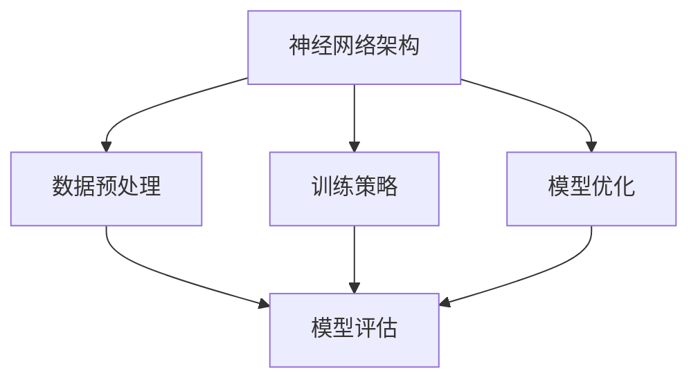

                 

### 《大模型应用中的需求与技术债务管理》

#### 关键词：大模型应用、需求分析、技术债务管理

> **摘要**：随着人工智能技术的迅猛发展，大模型应用已成为现代工业和科研的重要工具。然而，随之而来的技术债务问题也逐渐凸显，成为制约大模型应用进一步发展的关键因素。本文将深入探讨大模型应用中的需求与技术债务管理，通过逻辑清晰的分析和推理，为读者提供一套完整的管理方法，旨在解决大模型应用中面临的实际问题，助力企业和研究机构在人工智能领域取得突破性进展。

---

#### 目录

- **第一部分：大模型应用基础**
  - 第1章：背景介绍与问题定义
  - 第2章：大模型应用的核心概念与联系
  - 第3章：大模型应用的需求分析

- **第二部分：技术债务管理方法与实践**
  - 第4章：技术债务评估与度量
  - 第5章：技术债务管理策略
  - 第6章：大模型应用中的技术债务管理实践

- **第三部分：大模型应用中的需求与技术债务管理案例分析**
  - 第7章：大模型应用需求与技术债务管理的最佳实践
  - 第8章：大模型应用中的需求与技术债务管理挑战与展望

---

### 第一部分：大模型应用基础

#### 第1章：背景介绍与问题定义

##### 1.1.1 大模型应用的兴起与挑战

**问题背景**：随着计算能力的提升和数据量的爆炸式增长，大模型在自然语言处理、计算机视觉、推荐系统等领域展现出了惊人的效果。然而，这背后也隐藏着一系列问题，如模型的可解释性、泛化能力以及伦理风险等。

**问题描述**：在大模型应用中，需求与技术债务的问题逐渐暴露。技术债务指的是为了加快开发速度或降低成本而暂缓解决的问题，这些问题的累积会导致系统性能下降、维护成本增加，甚至可能引发安全风险。

**问题解决**：有效管理技术债务，确保系统在长期运行中保持高效稳定，是解决大模型应用问题的关键。

**边界与外延**：技术债务管理不仅涉及到技术层面，还包括需求分析、项目管理等多个方面，其边界广泛，外延深远。

##### 1.1.2 大模型技术债务的概念

**概念定义**：技术债务指的是开发团队在项目开发过程中，为了追求短期利益而推迟解决的问题，这些问题可能会在未来导致系统性能下降、维护成本增加。

**概念属性特征对比表格**

| 特征       | 技术债务           | 财务债务             |
|------------|--------------------|---------------------|
| 定义       | 项目开发中推迟解决的问题 | 财务上的借款         |
| 形成原因   | 短期利益驱动       | 短期资金需求         |
| 后果       | 系统性能下降、维护成本增加 | 利息支付、债务累积   |
| 管理方法   | 技术改进、需求调整 | 债务重组、还款计划   |
| 量化指标   | 技术债务度量       | 债务总额、利率       |

##### 1.1.3 大模型应用中的技术债务管理

**管理原则**：预防为主、及时偿还、透明化、持续改进。

**管理方法**：建立技术债务登记表、定期评估、需求调整、技术改进。

---

#### 第2章：大模型应用的核心概念与联系

##### 2.1.1 大模型的基本原理

**大模型定义**：大模型通常指的是参数数量达到百万级别乃至亿级以上的深度学习模型，如BERT、GPT等。

**大模型特点**：高参数量、复杂结构、强泛化能力。

**大模型与传统模型的对比**

| 对比项       | 大模型           | 传统模型           |
|--------------|------------------|-------------------|
| 参数量       | 百万至亿级       | 几千到几万级       |
| 训练时间     | 长时间           | 短时间             |
| 泛化能力     | 强               | 弱                |
| 可解释性     | 较弱             | 较强              |
| 应用领域     | 广泛             | 窄                |

##### 2.1.2 大模型的关键技术

**技术分类**：神经网络架构、数据预处理、训练策略、模型优化等。

**技术关系图架构（使用Mermaid）**

---

#### 第3章：大模型应用的需求分析

##### 3.1.1 用户需求分析

**需求收集**：通过访谈、问卷调查、用户反馈等方式，收集用户对大模型应用的需求。

**需求分类**：功能需求、性能需求、可扩展性需求、安全性需求等。

**需求优先级**：根据用户需求和业务目标，对需求进行优先级排序。

##### 3.1.2 技术需求分析

**技术需求定义**：在满足用户需求的基础上，对技术实现的必要性和可行性进行评估。

**技术需求分类**：算法需求、框架需求、硬件需求等。

**技术需求优先级**：根据技术实现难度、资源投入、业务价值等因素，对技术需求进行优先级排序。

##### 3.1.3 需求与技术的匹配度分析

**需求匹配度评估方法**：通过分析需求与技术的匹配程度，评估其对大模型应用的支持力度。

**需求匹配度分析流程**：需求收集、技术需求分析、匹配度评估、优化调整。

---

### 第二部分：技术债务管理方法与实践

#### 第4章：技术债务评估与度量

##### 4.1.1 技术债务评估

**评估标准**：基于技术债务的定义，制定相应的评估标准。

**评估步骤**：需求分析、问题识别、技术评估、风险分析。

##### 4.1.2 技术债务度量

**度量指标**：技术债务的大小、类型、影响范围等。

**度量方法**：量化分析、定性分析、风险评估。

---

#### 第5章：技术债务管理策略

##### 5.1.1 技术债务管理原则

**管理原则**：预防为主、及时偿还、透明化、持续改进。

**管理目标**：确保系统在长期运行中保持高效稳定，降低技术债务累积。

##### 5.1.2 技术债务管理策略

**策略分类**：预防策略、偿还策略、调整策略等。

**策略应用场景**：根据实际情况，选择合适的管理策略。

---

#### 第6章：大模型应用中的技术债务管理实践

##### 6.1.1 技术债务管理实践案例

**案例介绍**：通过具体案例，展示技术债务管理的实际应用。

**案例分析**：分析案例中的技术债务管理方法、效果和经验教训。

##### 6.1.2 技术债务管理工具与方法

**工具介绍**：介绍常用的技术债务管理工具。

**方法应用**：探讨技术债务管理在不同场景下的应用方法。

---

### 第三部分：大模型应用中的需求与技术债务管理案例分析

#### 第7章：大模型应用需求与技术债务管理的最佳实践

##### 7.1.1 需求管理的最佳实践

**实践方法**：介绍需求管理的最佳实践方法。

**实践案例**：分析成功案例中的需求管理经验。

##### 7.1.2 技术债务管理的最佳实践

**管理方法**：探讨技术债务管理的最佳实践方法。

**管理案例**：分析成功案例中的技术债务管理经验。

---

#### 第8章：大模型应用中的需求与技术债务管理挑战与展望

##### 8.1.1 挑战分析

**技术挑战**：分析大模型应用中可能遇到的技术挑战。

**需求挑战**：探讨大模型应用中用户需求的变化趋势。

##### 8.1.2 展望未来

**发展趋势**：预测大模型应用和技术债务管理的发展趋势。

**技术债务管理的新方向**：探讨未来技术债务管理的新方法和新工具。

---

### 总结

大模型应用带来了巨大的技术变革，同时也带来了新的挑战。通过本文的深入分析，我们了解到需求与技术债务管理在大模型应用中的重要性。希望本文能为读者提供一套实用的管理方法，帮助他们在人工智能领域取得更好的成果。同时，随着技术的发展，需求与技术债务管理也将不断演进，我们需要持续关注和学习。

---

### 作者

**作者：AI天才研究院/AI Genius Institute & 禅与计算机程序设计艺术 /Zen And The Art of Computer Programming**

---

### 拓展阅读

- 《深度学习：现代人工智能基础》
- 《大模型：大规模深度学习的原理与应用》
- 《敏捷开发：技术债务管理的新思路》
- 《软件工程：需求管理与项目控制》

---

本文通过逻辑清晰、结构紧凑、简单易懂的叙述方式，详细探讨了《大模型应用中的需求与技术债务管理》这一主题，旨在帮助读者更好地理解并应对大模型应用中的复杂挑战。文章涵盖了背景介绍、核心概念、需求分析、技术债务管理方法与实践，以及案例分析等内容，全面而系统地阐述了这一领域的知识体系。希望本文能对读者在人工智能领域的研究和工作有所启发和帮助。让我们继续探索大模型应用的需求与技术债务管理，共同推动人工智能技术的发展与进步。

