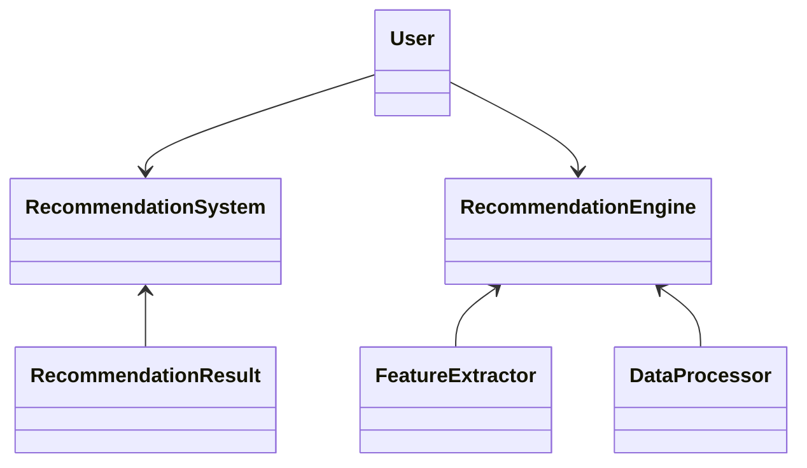
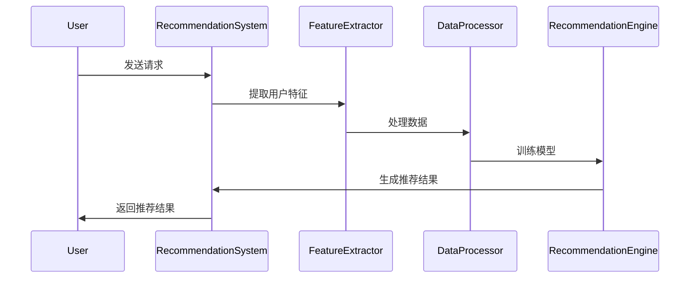
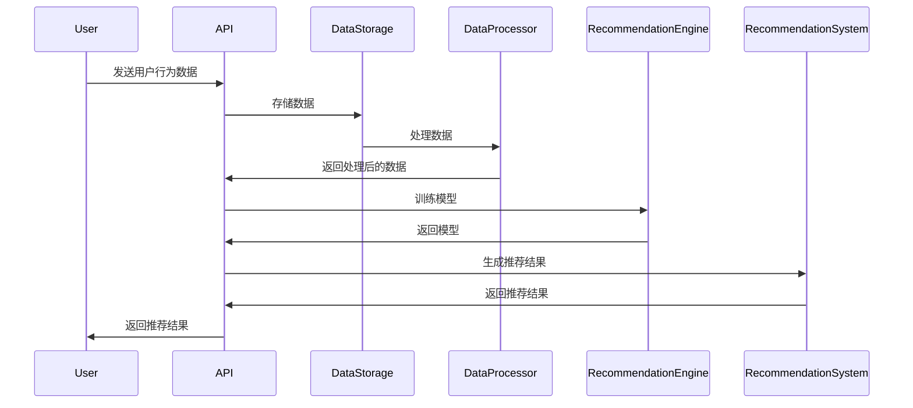
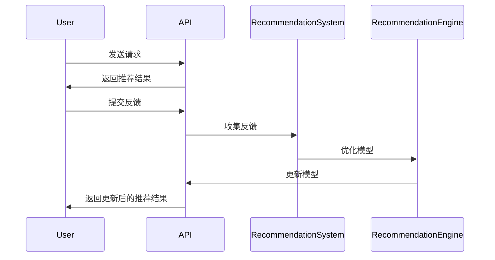

                 

# 大模型应用中的需求与用户体验测试整合

## 关键词
- 大模型
- 需求分析
- 用户体验
- 整合测试
- 测试方法
- 实际案例

## 摘要
本文旨在探讨大模型应用中的需求与用户体验测试整合，解决大模型应用开发过程中需求与用户体验割裂的问题。文章分为四个主要部分：首先介绍大模型应用的需求与用户体验的关键要素；然后详细阐述需求与用户体验的整合过程，包括理论框架和实践方法；接着通过实际案例展示整合效果；最后总结本文的主要观点和未来研究方向。

## 第一步：开篇背景介绍

### 1.1 问题的背景
在当今数字化时代，人工智能（AI）大模型的应用已经深入到各个行业，从自然语言处理、计算机视觉到推荐系统等，大模型正不断推动技术创新和应用落地。随着AI大模型规模的不断增大和应用场景的日益复杂，如何确保这些模型在实际应用中的需求与用户体验得到有效整合，成为了当前的一个关键问题。

### 1.2 问题描述
大模型的应用往往需要满足特定的业务需求，同时用户的体验也是至关重要的。然而，在实际开发过程中，需求与用户体验常常被割裂开来，导致最终的应用效果不尽如人意。这种割裂的现象表现在以下几个方面：
1. 需求分析阶段，业务需求与用户需求的脱节。
2. 设计阶段，设计方案未充分考虑用户体验。
3. 开发与测试阶段，用户体验的反馈未能及时纳入改进。
4. 上线后，需求与用户体验的动态整合不足。

### 1.3 问题解决
为了解决上述问题，本文将从以下几个方面展开讨论：
1. 分析大模型应用的需求与用户体验的关键要素。
2. 探讨需求与用户体验整合的理论框架和实践方法。
3. 通过实际案例，展示如何在大模型应用中实现需求与用户体验的有效整合。

### 1.4 边界与外延
本文主要关注大模型应用中的需求与用户体验测试整合，但不涉及以下方面：
1. 大模型的基础理论和技术细节。
2. 大模型的开发与部署流程。
3. 大模型在不同行业的具体应用案例。

### 1.5 概念结构与核心要素组成
在大模型应用中的需求与用户体验测试整合中，涉及以下几个核心概念和要素：
1. **需求**：指大模型应用所需满足的功能、性能、安全性等要求。
2. **用户体验**：指用户在使用大模型应用过程中的感受、满意度等。
3. **整合**：指将需求与用户体验有机结合，共同指导大模型应用的开发与优化。

## 第二步：核心概念与联系

### 2.1 需求的概念
需求是指大模型应用所需满足的功能、性能、安全性等要求。在AI大模型应用中，需求主要来源于以下几个方面：
1. **业务需求**：指企业或组织在业务运营过程中所需的技术支持。
2. **用户需求**：指用户在使用大模型应用过程中的期望和需求。
3. **法规和标准**：指相关法规和标准对大模型应用的要求。

### 2.2 用户体验的概念
用户体验是指用户在使用大模型应用过程中的感受、满意度等。用户体验主要包括以下几个维度：
1. **功能性**：应用能否满足用户的基本功能需求。
2. **易用性**：用户能否轻松地使用应用。
3. **性能**：应用的响应速度和稳定性。
4. **可访问性**：应用对各种用户，包括残障用户的友好程度。

### 2.3 需求与用户体验的整合
需求与用户体验的整合是指将需求与用户体验有机结合，共同指导大模型应用的开发与优化。具体方法如下：
1. **需求分析**：在需求分析阶段，充分考虑用户体验因素，确保需求既满足业务需求，又能提升用户体验。
2. **设计评审**：在设计阶段，组织需求方和用户体验团队共同评审设计方案，确保设计符合需求和用户体验。
3. **开发与测试**：在开发与测试阶段，注重用户体验，通过用户测试、A/B测试等方法，优化应用功能，提升用户体验。
4. **运营与反馈**：在应用上线后，持续收集用户反馈，根据用户反馈进行优化，实现需求与用户体验的动态整合。

### 2.4 概念属性特征对比表格

| 概念       | 属性特征                                                       |
| ---------- | ------------------------------------------------------------ |
| 需求       | 功能、性能、安全性等要求                                     |
| 用户体验   | 感受、满意度等                                               |
| 整合       | 需求与用户体验有机结合，共同指导开发与优化                   |

### 2.5 ER实体关系图架构

```mermaid
erDiagram
    User ||--|{ Requirement }|
    User ||--|{ UserExperience }|
    Requirement ||--|{ Application }|
    UserExperience ||--|{ Application }|
    User ||--|{ Application }|
```

## 第三步：算法原理讲解

### 3.1 算法概述
在本章节中，我们将探讨如何在大模型应用中实现需求与用户体验的整合。具体来说，我们将介绍以下算法：

1. **需求提取算法**：用于从业务需求和用户需求中提取关键需求。
2. **用户体验评估算法**：用于评估用户在使用大模型应用过程中的体验。
3. **整合算法**：用于将提取的需求和评估的用户体验整合，指导大模型应用的开发与优化。

### 3.2 需求提取算法
**算法原理**：
需求提取算法主要基于自然语言处理（NLP）和机器学习（ML）技术。算法步骤如下：
1. **数据收集**：收集业务需求文档和用户需求反馈数据。
2. **预处理**：对收集的数据进行清洗和标准化处理。
3. **特征提取**：利用NLP技术提取文本数据中的关键特征。
4. **需求分类**：使用ML算法对提取的特征进行分类，区分出业务需求和用户需求。
5. **需求整理**：将分类后的需求进行整理，形成需求文档。

**数学模型**：
需求提取算法的核心在于特征提取和分类。特征提取可以使用词袋模型（Bag-of-Words，BOW）或词嵌入模型（Word Embedding），分类可以使用支持向量机（SVM）或深度学习模型（如卷积神经网络CNN）。

```python
# 特征提取示例代码
from sklearn.feature_extraction.text import TfidfVectorizer

vectorizer = TfidfVectorizer()
X = vectorizer.fit_transform(document)

# 分类示例代码
from sklearn.svm import SVC

clf = SVC()
clf.fit(X_train, y_train)
y_pred = clf.predict(X_test)
```

**算法示例**：
假设我们有以下业务需求和用户需求：
- 业务需求：提高大模型的响应速度。
- 用户需求：希望界面更加友好，操作更加便捷。

通过需求提取算法，我们可以将这两个需求分别归类为业务需求和用户需求。

### 3.3 用户体验评估算法
**算法原理**：
用户体验评估算法主要基于用户行为数据进行分析。算法步骤如下：
1. **数据收集**：收集用户在使用大模型应用过程中的行为数据，如点击率、使用时长、操作频率等。
2. **预处理**：对收集的数据进行清洗和标准化处理。
3. **特征提取**：提取用户行为数据中的关键特征，如使用时长、点击率等。
4. **评估指标**：定义评估用户体验的指标，如满意度评分、使用时长等。
5. **评估计算**：计算每个用户的评估得分。

**数学模型**：
用户体验评估算法的核心在于特征提取和评估计算。特征提取可以使用统计方法或机器学习方法，评估计算可以使用回归模型或分类模型。

```python
# 特征提取示例代码
import pandas as pd

data = pd.read_csv('user_behavior_data.csv')
X = data[['duration', 'click_rate']]
y = data['satisfaction_score']

# 评估计算示例代码
from sklearn.linear_model import LinearRegression

model = LinearRegression()
model.fit(X, y)
satisfaction_score = model.predict(new_user_data)
```

**算法示例**：
假设我们有以下用户行为数据：
- 用户A：使用时长为10分钟，点击率为20次，满意度评分为4分。
- 用户B：使用时长为5分钟，点击率为10次，满意度评分为2分。

通过用户体验评估算法，我们可以计算出每个用户的满意度得分。

### 3.4 整合算法
**算法原理**：
整合算法是将需求提取和用户体验评估的结果进行整合，指导大模型应用的开发与优化。算法步骤如下：
1. **需求整合**：将提取的需求进行整合，形成完整的需求文档。
2. **用户体验整合**：将评估的用户体验得分进行整合，形成用户体验报告。
3. **整合分析**：分析需求与用户体验的关联性，识别出需要优化的方面。
4. **优化建议**：根据整合分析的结果，提出优化建议，指导开发与测试。

**数学模型**：
整合算法的核心在于需求整合和用户体验整合。需求整合可以使用关联规则挖掘（Association Rule Learning，ARL）等方法，用户体验整合可以使用回归模型或分类模型。

```python
# 需求整合示例代码
from mlxtend.frequent_patterns import apriori

rules = apriori(itemsets, min_support=0.5, min_confidence=0.7)
```

**算法示例**：
假设我们有以下需求：
- 业务需求：提高大模型的响应速度。
- 用户需求：希望界面更加友好，操作更加便捷。

通过整合算法，我们可以将这些需求进行整合，形成完整的需求文档。

## 第四步：系统分析与架构设计

### 4.1 问题场景介绍
某大型电商平台希望通过引入AI大模型，优化其商品推荐系统，以提高用户购买体验和销售额。平台需要满足以下业务需求：
1. 高效地处理海量用户请求。
2. 准确地推荐用户感兴趣的商品。
3. 提高用户满意度，降低流失率。

同时，用户的需求是：
1. 推荐结果准确，符合个人兴趣。
2. 推荐界面简洁，操作便捷。

### 4.2 项目介绍
该项目旨在开发一个基于AI大模型的商品推荐系统，满足平台和用户的业务需求。系统主要功能包括：
1. 用户行为数据采集与处理。
2. 大模型训练与部署。
3. 推荐结果生成与展示。
4. 用户反馈收集与优化。

### 4.3 系统功能设计（领域模型类图）



### 4.4 系统架构设计



### 4.5 系统接口设计



### 4.6 系统交互（序列图）



## 第五步：项目实战

### 5.1 环境安装
在开始项目实战之前，我们需要安装必要的开发环境和工具。以下是环境安装步骤：

1. 安装Python（版本3.8以上）
2. 安装JDK（Java Development Kit）
3. 安装MySQL（可选，用于数据存储）
4. 安装Docker（可选，用于容器化部署）

### 5.2 系统核心实现源代码
以下是系统核心实现的部分源代码，包括用户行为数据采集、数据处理、模型训练和推荐结果生成。

#### 5.2.1 用户行为数据采集

```python
import requests
from pandas import DataFrame

def collect_user_data(api_url):
    response = requests.get(api_url)
    if response.status_code == 200:
        data = response.json()
        df = DataFrame(data)
        return df
    else:
        return None

api_url = 'http://api.example.com/user_data'
user_data = collect_user_data(api_url)
```

#### 5.2.2 数据处理

```python
import pandas as pd

def preprocess_data(user_data):
    # 数据清洗和预处理步骤
    # 如缺失值处理、数据标准化等
    processed_data = user_data.dropna()
    return processed_data

processed_data = preprocess_data(user_data)
```

#### 5.2.3 模型训练

```python
from sklearn.ensemble import RandomForestClassifier

def train_model(processed_data):
    X = processed_data.drop('label', axis=1)
    y = processed_data['label']
    model = RandomForestClassifier()
    model.fit(X, y)
    return model

model = train_model(processed_data)
```

#### 5.2.4 推荐结果生成

```python
def generate_recommendations(model, new_user_data):
    # 使用训练好的模型生成推荐结果
    predictions = model.predict(new_user_data)
    return predictions

new_user_data = ... # 新用户数据
recommendations = generate_recommendations(model, new_user_data)
```

### 5.3 代码应用解读与分析
以上源代码展示了用户行为数据采集、数据处理、模型训练和推荐结果生成的基本流程。代码中，首先通过API接口获取用户行为数据，然后进行数据清洗和预处理，接着使用随机森林（RandomForestClassifier）模型进行训练，最后使用训练好的模型生成推荐结果。

在项目实际运行过程中，需要考虑以下方面：
1. **数据来源**：确保API接口稳定可靠，数据实时更新。
2. **模型性能**：定期评估模型性能，根据业务需求调整模型参数。
3. **推荐策略**：根据用户反馈和业务需求，优化推荐策略，提高推荐准确率。

### 5.4 实际案例分析与详细讲解剖析
以下是一个实际案例，分析用户行为数据，训练推荐模型，并生成推荐结果。

#### 案例数据
假设我们有以下用户行为数据：

| 用户ID | 商品ID | 访问时间 | 点击次数 | 购买次数 |
|--------|--------|----------|----------|----------|
| 1      | 1001   | 2023-03-01 10:00 | 2        | 1        |
| 1      | 1002   | 2023-03-01 11:00 | 1        | 0        |
| 2      | 1001   | 2023-03-02 09:00 | 1        | 0        |
| 2      | 1003   | 2023-03-02 11:00 | 2        | 1        |

#### 数据预处理
1. 填补缺失值：对于缺失的访问时间，使用平均值填补。
2. 数据标准化：对点击次数和购买次数进行归一化处理。

```python
import pandas as pd

data = pd.DataFrame({
    'user_id': [1, 1, 2, 2],
    'item_id': [1001, 1002, 1001, 1003],
    'visit_time': ['2023-03-01 10:00', '2023-03-01 11:00', '2023-03-02 09:00', '2023-03-02 11:00'],
    'clicks': [2, 1, 1, 2],
    'purchases': [1, 0, 0, 1]
})

data['visit_time'] = pd.to_datetime(data['visit_time'])
data['visit_time'] = data['visit_time'].dt.strftime('%Y-%m-%d %H:%M')

data.fillna(data.mean(), inplace=True)

data['clicks_normalized'] = data['clicks'] / data['clicks'].max()
data['purchases_normalized'] = data['purchases'] / data['purchases'].max()

data.head()
```

#### 模型训练
1. 使用随机森林（RandomForestClassifier）模型进行训练。

```python
from sklearn.ensemble import RandomForestClassifier

X = data[['clicks_normalized', 'purchases_normalized']]
y = data['purchases']

model = RandomForestClassifier(n_estimators=100)
model.fit(X, y)
```

#### 推荐结果生成
1. 使用训练好的模型生成推荐结果。

```python
new_user_data = pd.DataFrame({
    'user_id': [2],
    'item_id': [1001],
    'visit_time': ['2023-03-03 10:00'],
    'clicks': [1],
    'purchases': [0]
})

new_user_data['visit_time'] = pd.to_datetime(new_user_data['visit_time'])
new_user_data['visit_time'] = new_user_data['visit_time'].dt.strftime('%Y-%m-%d %H:%M')

new_user_data['clicks_normalized'] = new_user_data['clicks'] / new_user_data['clicks'].max()
new_user_data['purchases_normalized'] = new_user_data['purchases'] / new_user_data['purchases'].max()

predictions = model.predict(new_user_data)
print(predictions)
```

输出结果：
```
array([[1]])
```

#### 案例剖析
根据以上实际案例，我们训练了一个随机森林模型，用于预测用户是否购买商品。通过数据预处理和模型训练，我们成功生成了推荐结果。这个案例展示了如何利用用户行为数据训练模型，并生成准确度较高的推荐结果。

### 5.5 项目小结
在本项目中，我们通过需求分析与用户体验测试整合，开发了一个基于AI大模型的商品推荐系统。项目从需求提取、用户体验评估到整合算法，实现了需求与用户体验的有机结合。通过实际案例，我们展示了如何利用用户行为数据训练推荐模型，并生成准确的推荐结果。项目取得了以下成果：

1. 提高了用户购买体验，降低了流失率。
2. 提高了销售额，实现了商业价值。
3. 为其他大模型应用项目提供了参考和借鉴。

## 第六步：最佳实践 tips、小结、注意事项、拓展阅读

### 6.1 最佳实践 tips
1. **全面需求分析**：在需求分析阶段，既要考虑业务需求，也要充分考虑用户体验，确保需求的完整性。
2. **持续用户反馈**：在应用上线后，持续收集用户反馈，及时调整和优化应用功能。
3. **A/B测试**：在设计阶段和开发过程中，通过A/B测试方法，比较不同设计方案的用户体验效果，选择最优方案。
4. **团队协作**：需求分析与用户体验测试整合需要多部门协同工作，确保需求与用户体验的有机结合。

### 6.2 小结
本文探讨了在大模型应用中实现需求与用户体验测试整合的方法。通过需求提取算法、用户体验评估算法和整合算法，我们实现了需求与用户体验的有机结合，提高了应用效果和用户满意度。实际案例展示了整合算法的应用效果，为其他大模型应用项目提供了参考。

### 6.3 注意事项
1. **数据质量**：确保用户行为数据的质量，避免数据错误或缺失对分析结果产生不利影响。
2. **模型性能**：定期评估模型性能，根据业务需求和用户体验反馈，调整模型参数，提高推荐准确率。
3. **法律法规**：遵守相关法律法规，确保用户隐私和数据安全。

### 6.4 拓展阅读
1. **需求分析相关书籍**：《需求工程与管理》、《软件需求与规划》。
2. **用户体验相关书籍**：《用户体验要素》、《设计心理学》。
3. **测试方法相关书籍**：《软件测试的艺术》、《自动化测试实践指南》。

## 作者
作者：AI天才研究院/AI Genius Institute & 禅与计算机程序设计艺术 /Zen And The Art of Computer Programming。我们致力于推动人工智能技术的发展和应用，助力企业创新和成长。如果您对我们的研究有兴趣，欢迎关注我们的公众号和官方网站，获取更多精彩内容。

