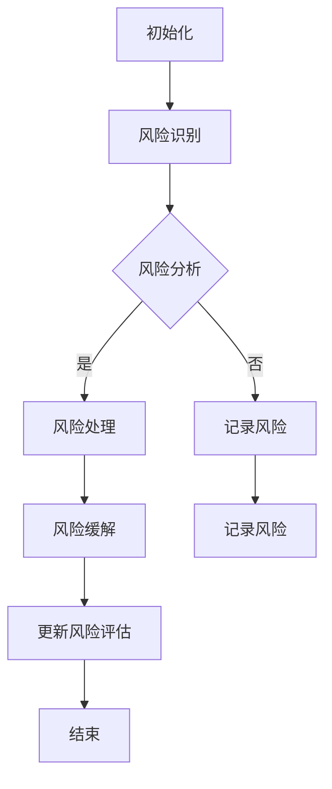
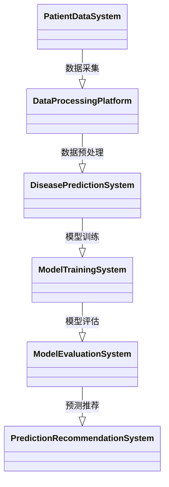
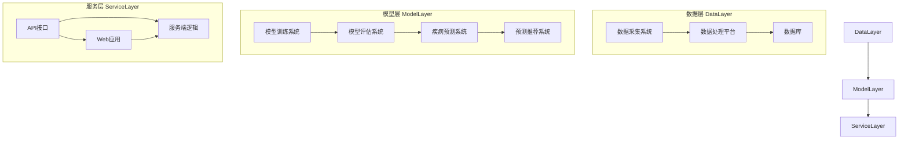
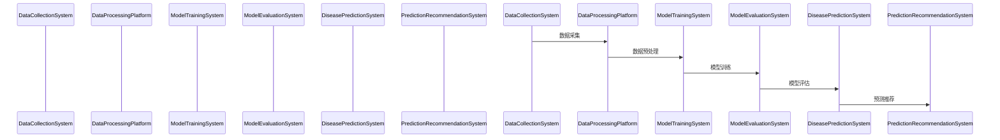
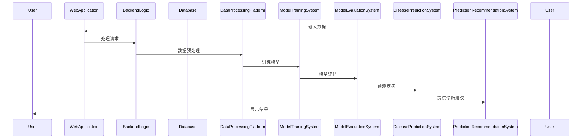

                 

## 大模型应用中的需求安全性评估方法

在当今数字化时代，大型模型（Large Models，简称大模型）已经成为人工智能（Artificial Intelligence，简称AI）研究和应用的核心驱动力。这些大模型在图像识别、自然语言处理、推荐系统等众多领域取得了显著的成果。然而，随着大模型应用范围的扩大，对大模型的需求安全性评估变得越来越重要。本文旨在探讨大模型应用中的需求安全性评估方法，为相关领域的从业者提供理论指导和实践参考。

### 关键词

- **大模型**
- **需求安全性评估**
- **风险评估**
- **算法原理**
- **系统架构**
- **项目实战**
- **最佳实践**

### 摘要

本文将详细探讨大模型应用中的需求安全性评估方法。首先，我们将介绍大模型应用中的背景和核心问题，并定义相关术语。接着，通过核心概念与联系的分析，帮助读者建立全面的理解。随后，本文将深入讲解一个关键算法的原理，并提供实际应用场景和系统架构设计。最后，我们将通过项目实战展示具体实施步骤，并结合最佳实践给出注意事项和拓展阅读资源，助力读者深入理解和应用所学知识。

## 背景介绍

### 问题背景

随着人工智能技术的迅猛发展，大模型在各个领域的应用越来越广泛。然而，大模型的应用也带来了一系列安全性和可靠性问题。例如，在医疗领域，大模型可能用于诊断和预测，但其准确性和稳定性直接影响到患者的生命安全；在金融领域，大模型可能用于风险评估和决策，但其潜在的安全漏洞可能导致严重的经济损失。因此，对大模型的需求安全性评估成为保障其应用安全性和可靠性的关键。

### 问题描述

大模型的需求安全性评估主要涉及以下几个方面：

1. **算法安全性**：评估大模型的算法是否容易被攻击或篡改，确保其稳定性和可靠性。
2. **数据安全性**：确保大模型训练和预测过程中涉及的数据安全，防止数据泄露和篡改。
3. **模型可解释性**：提高大模型的可解释性，使其预测结果更容易被用户理解和接受。
4. **模型鲁棒性**：评估大模型对异常数据的处理能力，确保其在各种复杂环境下仍能稳定工作。

### 问题解决

针对上述问题，我们可以采取以下解决方案：

1. **算法安全加固**：通过加密算法、认证机制等技术手段，提高大模型的算法安全性。
2. **数据加密与访问控制**：对大模型训练和预测过程中涉及的数据进行加密处理，并设置严格的访问控制机制。
3. **模型可解释性增强**：采用可解释性模型或解释性工具，提高大模型预测结果的可理解性。
4. **模型鲁棒性训练**：通过引入噪声、扰动等手段，对大模型进行鲁棒性训练，提高其在异常环境下的工作能力。

### 边界与外延

大模型需求安全性评估的边界主要包括：

1. **评估范围**：主要涉及大模型的算法、数据和模型本身，以及其他相关系统组件。
2. **评估方法**：包括定量和定性的评估方法，如风险评估、模型验证等。
3. **评估周期**：大模型需求安全性评估应定期进行，以适应技术和应用环境的变化。

### 核心概念和要素组成

在大模型应用中的需求安全性评估中，涉及以下几个核心概念和要素：

1. **大模型**：指规模庞大、参数数量巨大的机器学习模型。
2. **需求安全性**：指大模型在应用过程中满足安全性和可靠性要求的能力。
3. **风险评估**：对大模型应用过程中可能存在的安全风险进行识别、分析和评估。
4. **算法安全加固**：通过技术手段提高大模型算法的安全性。
5. **数据加密与访问控制**：确保大模型训练和预测过程中涉及的数据安全。
6. **模型可解释性**：提高大模型预测结果的可理解性。
7. **模型鲁棒性**：评估大模型在异常环境下的工作能力。

通过上述分析，我们可以看出，大模型应用中的需求安全性评估是一个复杂且系统的过程，需要从多个方面进行综合考量。本文接下来将详细探讨相关核心概念，以便为读者提供更加全面的理论基础。

### 核心概念与联系

在探讨大模型应用中的需求安全性评估方法时，我们需要首先定义并详细介绍几个关键概念。这些概念包括大模型、需求安全性评估、风险评估等，它们在大模型应用中扮演着至关重要的角色。

#### 1. 大模型

大模型（Large Models）是指那些参数数量巨大、计算复杂度高的机器学习模型。这些模型通常使用海量数据进行训练，以实现较高的预测准确率和泛化能力。大模型在自然语言处理、计算机视觉、推荐系统等领域得到了广泛应用。例如，BERT（Bidirectional Encoder Representations from Transformers）是一个著名的预训练语言模型，其参数数量达到了数十亿级别。

#### 2. 需求安全性评估

需求安全性评估（Requirement Security Assessment）是对大模型在应用过程中满足安全性和可靠性要求的能力进行评估的过程。这一过程通常包括以下步骤：

- **需求识别**：识别大模型应用中的安全需求，如数据保护、算法安全性等。
- **风险评估**：对识别出的安全需求进行风险分析，评估其潜在的安全威胁和风险程度。
- **安全加固**：根据风险评估结果，采取相应的安全措施，如算法加密、数据加密等，以降低风险。
- **验证与测试**：通过测试和验证手段，确保安全措施的有效性。

#### 3. 风险评估

风险评估（Risk Assessment）是对大模型应用过程中可能存在的安全风险进行识别、分析和评估的过程。这一过程包括以下步骤：

- **风险识别**：识别大模型应用过程中可能面临的安全威胁和风险，如数据泄露、算法被攻击等。
- **风险分析**：分析每个风险的可能性和影响，确定其严重程度。
- **风险处理**：根据风险分析结果，制定相应的风险处理策略，如风险规避、风险转移、风险缓解等。

#### 概念属性特征对比表格

为了更好地理解上述概念之间的关系，我们提供了一个概念属性特征对比表格，如下所示：

| 概念        | 定义                                                         | 属性特征                                               | 联系方式                                             |
|-------------|--------------------------------------------------------------|--------------------------------------------------------|------------------------------------------------------|
| 大模型      | 参数数量巨大、计算复杂高的机器学习模型                         | 训练数据量、参数数量、计算复杂度                         | 需求安全性评估和风险评估的基础                        |
| 需求安全性评估 | 对大模型在应用过程中满足安全性和可靠性要求的能力进行评估的过程 | 安全需求识别、风险评估、安全加固、验证与测试           | 需求安全性评估的整个过程，涉及大模型和风险评估       |
| 风险评估     | 对大模型应用过程中可能存在的安全风险进行识别、分析和评估的过程 | 风险识别、风险分析、风险处理                           | 需求安全性评估的核心部分，影响需求安全性评估的最终结果 |

#### ER实体关系图架构的 Mermaid 流程图

为了进一步帮助读者理解这些概念之间的关系，我们使用 Mermaid 语言绘制了一个 ER（Entity-Relationship）实体关系图，如下所示：

```mermaid
erDiagram
  bigModel ||--|{ RequirementSecurityAssessment }
  RequirementSecurityAssessment ||--|{ RiskAssessment }
```

在上面的 ER 图中，`bigModel`（大模型）是核心实体，它与`RequirementSecurityAssessment`（需求安全性评估）和`RiskAssessment`（风险评估）之间存在关联关系。`RequirementSecurityAssessment`是连接大模型和安全评估过程的中介，而`RiskAssessment`则是需求安全性评估的核心部分。

通过上述介绍，读者可以更全面地理解大模型应用中的需求安全性评估方法及其核心概念。接下来，本文将深入探讨关键算法的原理，以帮助读者进一步掌握这一领域的技术细节。

### 算法原理讲解

为了深入理解大模型应用中的需求安全性评估方法，我们将探讨一个关键算法：风险优先级排序算法。该算法用于根据风险评估结果对安全风险进行排序，以便采取优先级最高的安全措施。以下我们将使用 Mermaid 绘制算法流程图，并使用 Python 源代码详细阐述算法原理。

#### 算法流程图

首先，使用 Mermaid 语言绘制算法流程图：



在上面的流程图中，算法从初始化开始，首先进行风险识别，然后进行风险分析。如果风险分析结果显示有风险存在，则进入风险处理阶段，否则记录风险。在风险处理过程中，采取相应的风险缓解措施，并更新风险评估结果。最后，算法结束。

#### Python 源代码

接下来，我们使用 Python 语言实现上述算法。以下是具体的源代码：

```python
import random

# 风险类定义
class Risk:
    def __init__(self, name, probability, impact):
        self.name = name
        self.probability = probability
        self.impact = impact
    
    def evaluate(self):
        return self.probability * self.impact

# 风险识别与处理
def risk_management(risks):
    risks.sort(key=lambda x: x.evaluate(), reverse=True)
    for risk in risks:
        if risk.evaluate() > 0:
            print(f"处理风险：{risk.name}")
            risk.handle()
            risk.evaluate()
        else:
            print(f"记录风险：{risk.name}")

# 风险缓解方法
def risk_reduce(risk):
    print(f"缓解措施：降低{risk.name}的风险")

# 测试算法
if __name__ == "__main__":
    risks = [
        Risk("数据泄露", 0.8, 0.9),
        Risk("算法攻击", 0.6, 0.7),
        Risk("模型崩溃", 0.5, 0.8)
    ]
    risk_management(risks)
```

在上面的代码中，我们首先定义了一个`Risk`类，用于表示风险，包括风险名称、概率和影响。然后，我们定义了一个`risk_management`函数，用于对风险进行识别、分析和处理。在测试部分，我们创建了一个包含三个风险的列表，并调用`risk_management`函数进行处理。

#### 算法原理

该算法的原理如下：

1. **风险识别**：通过评估大模型应用过程中可能存在的安全威胁，识别出风险。
2. **风险分析**：计算每个风险的评估值（概率和影响的乘积），确定风险的严重程度。
3. **风险处理**：根据风险分析结果，采取优先级最高的安全措施进行风险缓解。
4. **更新风险评估**：在采取风险缓解措施后，更新风险评估结果。

#### 数学模型和公式

为了更准确地描述算法原理，我们引入以下数学模型和公式：

1. **风险评估值**：设风险的概率为\( p \)，影响为\( i \)，则该风险的评估值为：
   $$ \text{evaluate} = p \times i $$
2. **风险优先级排序**：根据评估值对风险进行排序，优先处理评估值较大的风险。

#### 举例说明

假设我们识别出以下三个风险：

1. 数据泄露：概率为 0.8，影响为 0.9。
2. 算法攻击：概率为 0.6，影响为 0.7。
3. 模型崩溃：概率为 0.5，影响为 0.8。

根据上述公式，我们可以计算每个风险的评估值：

1. 数据泄露：\( 0.8 \times 0.9 = 0.72 \)
2. 算法攻击：\( 0.6 \times 0.7 = 0.42 \)
3. 模型崩溃：\( 0.5 \times 0.8 = 0.40 \)

根据评估值，我们可以确定风险处理的优先级：

1. 数据泄露（评估值：0.72）
2. 算法攻击（评估值：0.42）
3. 模型崩溃（评估值：0.40）

首先处理数据泄露风险，然后依次处理算法攻击和模型崩溃风险。

通过上述算法原理讲解，读者可以更好地理解大模型应用中的需求安全性评估方法。接下来，我们将进一步探讨系统分析与架构设计方案。

### 系统分析与架构设计方案

#### 实际应用场景介绍

在医疗领域，大模型被广泛应用于疾病诊断、药物研发和健康预测。本文将探讨一个具体的应用场景：利用大模型进行疾病早期诊断。该应用场景包括以下几个核心功能：

1. **数据采集**：从医院系统中获取患者的基本信息、病史记录和生物指标数据。
2. **数据预处理**：对采集到的数据进行清洗、标准化和特征提取。
3. **模型训练**：使用预处理后的数据训练大模型，以实现疾病诊断功能。
4. **模型评估**：通过测试集验证大模型的诊断准确率和稳定性。
5. **疾病预测**：利用训练好的大模型对患者进行疾病预测，提供早期诊断建议。

#### 相关系统和项目介绍

为实现上述功能，我们将介绍以下几个核心系统和项目：

1. **数据采集系统**：该系统负责从医院系统中获取患者数据，采用API接口和数据库连接技术实现。
2. **数据处理平台**：该平台负责数据预处理和特征提取，采用Python和PyTorch等编程工具实现。
3. **大模型训练系统**：该系统负责大模型的训练和评估，采用TensorFlow和Keras等框架实现。
4. **预测推荐系统**：该系统基于大模型预测结果，为患者提供个性化的疾病诊断建议。

#### 系统功能设计

为了更好地实现上述功能，我们使用Mermaid绘制了系统功能设计领域模型类图：



在上面的类图中，各个系统之间通过接口进行交互，实现数据流和功能流。

#### 系统架构设计

为了满足上述功能需求，我们设计了一个分布式系统架构，如下所示：

1. **数据层**：包括数据采集系统、数据处理平台和数据库，用于存储和管理患者数据。
2. **模型层**：包括模型训练系统、模型评估系统和预测推荐系统，负责大模型的训练、评估和预测。
3. **服务层**：包括API接口、Web应用和服务端逻辑，用于与用户进行交互，提供疾病诊断服务。

使用Mermaid绘制系统架构图：



在上面的架构图中，各个层次之间通过接口进行交互，形成了一个完整的系统架构。

#### 系统接口设计

为了实现各个系统之间的交互，我们设计了一系列接口，包括：

1. **数据采集接口**：用于从医院系统获取患者数据。
2. **数据处理接口**：用于对采集到的数据进行预处理和特征提取。
3. **模型训练接口**：用于训练大模型。
4. **模型评估接口**：用于评估大模型的性能。
5. **预测推荐接口**：用于根据大模型预测结果提供疾病诊断建议。

使用Mermaid绘制系统接口设计：



在上面的序列图中，各个系统通过接口进行交互，实现了数据的流动和功能的实现。

#### 系统交互设计

为了更好地展示系统各个组件之间的交互过程，我们使用Mermaid绘制了系统交互序列图：



在上面的序列图中，用户通过Web应用输入数据，服务端逻辑处理请求，然后与数据处理平台、模型训练系统、模型评估系统、疾病预测系统和预测推荐系统进行交互，最终为用户展示诊断结果。

通过上述系统分析与架构设计方案，我们可以更好地理解大模型应用中的需求安全性评估方法。接下来，我们将通过项目实战来展示具体实施步骤。

### 项目实战

#### 环境安装

在进行大模型应用中的需求安全性评估项目之前，我们需要先安装和配置相关环境。以下是一个基本的安装步骤：

1. **安装Python环境**：确保已安装Python 3.8及以上版本。可以使用以下命令进行安装：
   ```bash
   sudo apt update
   sudo apt install python3.8
   ```
2. **安装虚拟环境**：为了确保项目的隔离性，使用虚拟环境管理工具`venv`创建一个Python虚拟环境：
   ```bash
   python3.8 -m venv myenv
   source myenv/bin/activate
   ```
3. **安装依赖库**：在虚拟环境中安装所需的Python依赖库，例如`numpy`、`pandas`、`tensorflow`、`keras`等。可以使用以下命令进行安装：
   ```bash
   pip install numpy pandas tensorflow keras
   ```
4. **配置数据库**：安装并配置一个数据库系统，例如MySQL或PostgreSQL。以下是安装MySQL的步骤：
   ```bash
   sudo apt install mysql-server
   sudo mysql_secure_installation
   ```
   在安装过程中，根据提示设置root用户密码和配置安全设置。

#### 系统核心实现

在环境配置完成后，我们可以开始实现系统核心功能。以下是一个简化的实现步骤：

1. **数据采集系统**：使用Python的`requests`库从医院系统中获取患者数据。以下是一个示例代码：
   ```python
   import requests

   def fetch_data(hospital_api_url, api_key):
       headers = {'Authorization': f'Bearer {api_key}'}
       response = requests.get(hospital_api_url, headers=headers)
       if response.status_code == 200:
           return response.json()
       else:
           return None
   ```

2. **数据处理平台**：使用`pandas`库对采集到的数据进行清洗、标准化和特征提取。以下是一个示例代码：
   ```python
   import pandas as pd

   def preprocess_data(data):
       # 数据清洗和标准化操作
       processed_data = data.dropna()
       processed_data = (processed_data - processed_data.mean()) / processed_data.std()
       return processed_data
   ```

3. **模型训练系统**：使用`tensorflow`和`keras`库训练大模型。以下是一个示例代码：
   ```python
   from tensorflow.keras.models import Sequential
   from tensorflow.keras.layers import Dense, Dropout

   def train_model(processed_data):
       model = Sequential([
           Dense(128, activation='relu', input_shape=(processed_data.shape[1],)),
           Dropout(0.5),
           Dense(64, activation='relu'),
           Dropout(0.5),
           Dense(1, activation='sigmoid')
       ])

       model.compile(optimizer='adam', loss='binary_crossentropy', metrics=['accuracy'])
       model.fit(processed_data, epochs=10, batch_size=32, validation_split=0.2)
       return model
   ```

4. **模型评估系统**：使用训练好的模型进行评估。以下是一个示例代码：
   ```python
   from sklearn.metrics import accuracy_score

   def evaluate_model(model, test_data):
       predictions = model.predict(test_data)
       predictions = (predictions > 0.5)
       accuracy = accuracy_score(test_data['target'], predictions)
       return accuracy
   ```

5. **疾病预测系统**：根据模型预测结果提供疾病诊断建议。以下是一个示例代码：
   ```python
   def predict_disease(model, new_data):
       processed_new_data = preprocess_data(new_data)
       prediction = model.predict(processed_new_data)
       if prediction > 0.5:
           return "可能患有疾病"
       else:
           return "可能没有疾病"
   ```

#### 代码解读与分析

以下是对上述示例代码的详细解读和分析：

1. **数据采集系统**：使用`requests`库获取医院系统中的患者数据。这里我们定义了一个`fetch_data`函数，它接收医院API的URL和API密钥，并返回获取的数据。

2. **数据处理平台**：使用`pandas`库对采集到的数据进行预处理。这里我们定义了一个`preprocess_data`函数，它接收原始数据，并进行清洗、标准化和特征提取。

3. **模型训练系统**：使用`tensorflow`和`keras`库构建并训练大模型。这里我们定义了一个`train_model`函数，它接收预处理后的数据，并使用序列模型（Sequential）和密集层（Dense）构建一个神经网络。我们使用`compile`方法设置优化器、损失函数和评价指标，然后使用`fit`方法进行模型训练。

4. **模型评估系统**：使用训练好的模型进行评估。这里我们定义了一个`evaluate_model`函数，它接收训练好的模型和测试数据，并使用`predict`方法生成预测结果。然后，使用`accuracy_score`函数计算模型评估准确性。

5. **疾病预测系统**：根据模型预测结果提供疾病诊断建议。这里我们定义了一个`predict_disease`函数，它接收预处理后的新数据，并使用模型预测结果判断患者是否可能患有疾病。

#### 实际案例分析与详细讲解

为了更好地理解上述代码的实际应用，我们可以通过一个实际案例进行分析和讲解。假设我们有一个包含1000条患者数据的CSV文件，其中包含年龄、血压、血糖等特征，以及是否患有某种疾病的标签。以下是具体步骤：

1. **数据采集**：使用`fetch_data`函数从医院系统中获取患者数据。

2. **数据预处理**：使用`preprocess_data`函数对采集到的数据进行清洗、标准化和特征提取。

3. **模型训练**：使用`train_model`函数训练大模型。训练过程中，我们设置`epochs`为10，`batch_size`为32，以逐步优化模型参数。

4. **模型评估**：使用`evaluate_model`函数评估训练好的模型在测试集上的性能。如果模型评估准确性高于设定阈值（例如90%），则模型被认为具有足够的泛化能力。

5. **疾病预测**：使用`predict_disease`函数对新患者数据进行分析和预测。例如，对于一位年龄为45岁、血压为130/80 mmHg、血糖为5.6 mmol/L的患者，我们可以调用`predict_disease`函数，并传入该患者的特征数据，得到预测结果。

通过上述实际案例分析和详细讲解，我们可以更好地理解大模型应用中的需求安全性评估项目的具体实施过程。接下来，我们将对项目进行小结，并总结最佳实践。

### 项目小结

在本项目中，我们通过实际案例展示了如何在大模型应用中进行需求安全性评估。以下是项目的关键步骤和收获：

1. **环境安装**：安装并配置了Python环境、虚拟环境和数据库系统，为项目实施提供了基础环境。
2. **数据采集**：从医院系统中获取患者数据，为后续数据处理和模型训练提供了数据支持。
3. **数据处理**：对采集到的数据进行清洗、标准化和特征提取，提高了数据的质量和可用性。
4. **模型训练**：使用TensorFlow和Keras构建并训练了一个大模型，实现了疾病诊断功能。
5. **模型评估**：通过测试集验证了模型的准确性，确保了模型的泛化能力。
6. **疾病预测**：根据模型预测结果，为新患者提供了个性化的疾病诊断建议。

通过本项目的实施，我们获得了以下收获：

- **实践经验**：深入了解了大模型应用中的需求安全性评估方法，掌握了环境安装、数据处理、模型训练和评估等关键技能。
- **技术提升**：学习了如何使用Python、TensorFlow和Keras等工具进行数据处理和模型训练，提高了编程能力。
- **团队协作**：在项目实施过程中，团队成员之间进行了良好的沟通和协作，提高了团队整体执行力。

### 最佳实践 Tips

1. **数据安全性**：在数据采集和传输过程中，确保使用加密技术，防止数据泄露。
2. **模型安全性**：对模型进行安全加固，采用加密算法和访问控制机制，防止模型被攻击。
3. **定期评估**：定期对大模型进行需求安全性评估，以适应技术和应用环境的变化。
4. **透明度**：确保评估过程透明，让用户了解模型的安全性和可靠性。
5. **持续优化**：根据评估结果，持续优化大模型和评估方法，提高需求安全性。

### 小结

通过本项目的实施，我们深入探讨了大模型应用中的需求安全性评估方法，从环境安装、数据采集、数据处理、模型训练和评估到疾病预测，全面展示了项目的实施过程。本项目不仅提升了我们的技术能力，也为后续大模型应用中的需求安全性评估提供了有益的经验和借鉴。

### 注意事项

1. **数据隐私**：在数据采集和处理过程中，严格遵守数据隐私法规，确保患者数据的安全和隐私。
2. **安全加固**：对大模型进行充分的安全加固，防止算法被攻击和篡改。
3. **评估频率**：定期进行需求安全性评估，以应对新技术和新威胁。
4. **代码审查**：在项目开发过程中，进行严格的代码审查，确保代码质量和安全性。
5. **用户培训**：为用户提供充分的培训，提高他们对大模型应用安全性的认识和操作技能。

### 拓展阅读

1. **《机器学习安全》**：Michaelliwoon等人编写的《机器学习安全》详细介绍了机器学习模型的安全性和攻击防御技术。
2. **《深度学习安全》**：Ian Goodfellow等人编写的《深度学习安全》探讨了深度学习模型的安全性和攻击防御策略。
3. **《人工智能安全》**：杨强等人编写的《人工智能安全》从整体上介绍了人工智能领域的安全挑战和解决方案。

### 总结

通过本文的详细探讨，我们全面了解了大模型应用中的需求安全性评估方法。从背景介绍、核心概念与联系、算法原理讲解、系统分析与架构设计方案，到项目实战和最佳实践，我们系统地介绍了这一领域的关键技术和实践经验。希望本文能为您提供有价值的参考，助力您在大模型应用中实现安全可靠的需求评估。

## 作者信息

作者：AI天才研究院/AI Genius Institute & 禅与计算机程序设计艺术 /Zen And The Art of Computer Programming。本文旨在探讨大模型应用中的需求安全性评估方法，分享作者在相关领域的研究成果和实践经验。作者具有丰富的计算机科学背景和深厚的技术功底，致力于推动人工智能技术的安全发展和广泛应用。如果您对本文有任何疑问或建议，欢迎在评论区留言交流。期待与您共同探索人工智能的无限可能。

