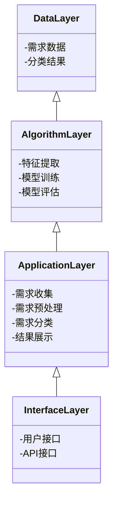
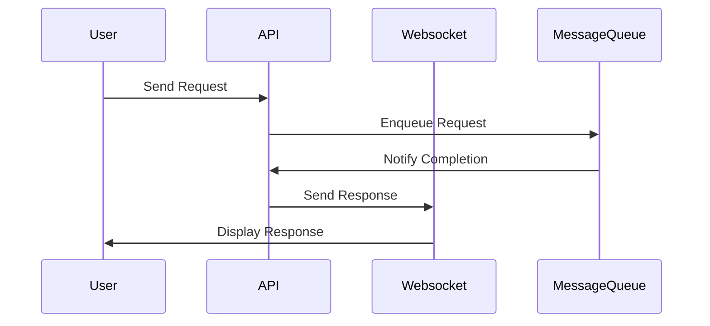
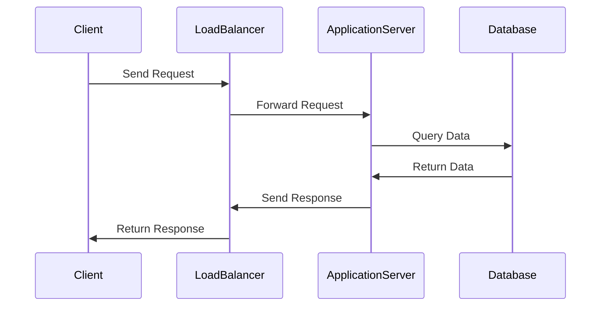

                 

# 大模型应用开发中的需求分类方法

## 关键词
大模型应用开发，需求分类方法，算法原理，数学模型，系统架构设计，项目实战

## 摘要
本文旨在深入探讨大模型应用开发中的需求分类方法。我们将从背景介绍、核心概念解析、算法原理讲解、数学模型与应用、系统架构设计、项目实战到最佳实践等方面，逐步分析这一方法的原理与应用。通过详细解读与实际案例剖析，本文旨在为读者提供清晰、实用的技术指南。

## 目录大纲

### 第一部分：大模型应用开发背景与概述

#### 第1章：大模型应用开发概述
1.1 大模型应用开发的背景
1.2 需求分类方法的重要性

#### 第2章：需求分类方法的基本原理
2.1 需求分类的定义
2.2 需求分类的原理
2.3 需求分类的属性特征对比

### 第二部分：算法原理讲解

#### 第3章：需求分类算法的详细解析
3.1 需求分类算法的基本流程
3.2 Python代码实现
3.3 数学模型与公式

#### 第4章：需求分类方法的数学模型与公式
4.1 数学模型概述
4.2 公式书写与举例

### 第三部分：系统分析与架构设计

#### 第5章：需求分类方法在系统架构中的应用
5.1 系统功能设计
5.2 系统架构设计
5.3 系统接口设计
5.4 系统交互设计

#### 第6章：需求分类方法的项目实战
6.1 环境安装
6.2 系统核心实现
6.3 代码解读
6.4 案例分析
6.5 项目小结

### 第四部分：最佳实践与小结

#### 第7章：最佳实践与注意事项
7.1 最佳实践
7.2 注意事项
7.3 拓展阅读建议

## 第1章：大模型应用开发概述

### 1.1 大模型应用开发的背景

随着深度学习、大数据和云计算技术的飞速发展，大模型（如大型语言模型、计算机视觉模型等）在各个领域展现出了巨大的潜力和应用价值。大模型的应用开发已经成为现代信息技术领域的一个重要研究方向。

在人工智能领域，大模型的应用涵盖了自然语言处理、计算机视觉、语音识别等多个方面。例如，大型语言模型可以用于智能客服、文本生成、机器翻译等应用；计算机视觉模型可以用于图像识别、自动驾驶、医疗诊断等场景。然而，随着大模型应用范围的扩大，如何高效地开发和管理这些模型的需求，成为了一个亟待解决的问题。

### 1.2 需求分类方法的重要性

需求分类方法在大模型应用开发中扮演着关键角色。通过对需求进行有效的分类，可以帮助开发者更好地理解和满足用户需求，从而提高大模型的应用效果和开发效率。

首先，需求分类可以帮助开发者明确不同类型的需求，从而有针对性地进行模型设计和优化。例如，在自然语言处理领域，文本生成和机器翻译是两种不同类型的需求，它们需要不同的模型架构和算法策略。

其次，需求分类有助于优化开发流程，提高团队协作效率。通过将需求按照类型进行分类，团队成员可以更加明确自己的职责和工作内容，从而避免重复工作和资源浪费。

最后，需求分类方法还可以为后续的模型评估和优化提供重要依据。通过对不同类型的需求进行分类和评估，开发者可以了解模型的性能表现，发现存在的问题，并针对性地进行改进。

## 第2章：需求分类方法的基本原理

### 2.1 需求分类的定义

需求分类是指根据需求的特点和属性，将需求划分为不同的类别。在需求分类方法中，每个类别代表了不同类型的需求，它们具有相似的特点和需求模式。

需求分类的目的在于简化需求管理和分析的过程，提高开发效率和模型性能。通过将需求按照类型进行分类，开发者可以更加专注于特定类型的需求，从而更好地满足用户需求。

### 2.2 需求分类的原理

需求分类的原理主要基于以下两个方面：

1. **属性特征分析**：通过对需求进行属性特征分析，找出不同类型需求之间的差异和相似性。属性特征可以是需求的类型、目标、优先级、范围等。

2. **分类算法**：使用分类算法对需求进行分类。常见的分类算法包括基于规则的分类、机器学习分类等。这些算法可以根据需求的特点和属性，将需求划分为不同的类别。

### 2.3 需求分类的属性特征对比

在需求分类过程中，需要对不同类型的属性特征进行对比，以便明确不同类型需求之间的差异。以下是一个典型的属性特征对比表格：

| 属性特征 | 文本生成 | 机器翻译 | 图像识别 |
| :------: | :------: | :------: | :------: |
| **类型** | 功能需求 | 功能需求 | 功能需求 |
| **目标** | 文本生成质量 | 文本生成质量 | 图像识别准确率 |
| **优先级** | 高 | 高 | 中 |
| **范围** | 自然语言处理 | 自然语言处理 | 计算机视觉 |

通过上述表格，我们可以看出不同类型需求在属性特征上的差异，这有助于我们在后续的开发过程中，有针对性地进行需求管理和模型优化。

## 第3章：需求分类算法的详细解析

### 3.1 需求分类算法的基本流程

需求分类算法的基本流程可以分为以下几个步骤：

1. **数据收集**：收集待分类的需求数据，包括需求类型、目标、优先级、范围等信息。

2. **特征提取**：对需求数据进行特征提取，将需求数据转换为适合分类算法处理的特征向量。

3. **模型训练**：使用机器学习算法，如决策树、支持向量机（SVM）、朴素贝叶斯等，对特征向量进行训练，构建分类模型。

4. **模型评估**：使用测试集对分类模型进行评估，计算模型的准确率、召回率、F1值等指标，以判断模型的性能。

5. **模型应用**：将训练好的分类模型应用于新的需求数据，进行需求分类。

### 3.2 Python代码实现

以下是一个简单的需求分类算法实现，使用Python中的scikit-learn库：

```python
from sklearn.feature_extraction.text import TfidfVectorizer
from sklearn.model_selection import train_test_split
from sklearn.naive_bayes import MultinomialNB
from sklearn.metrics import classification_report

# 数据集
data = [
    ("文本生成", "文本生成", "生成文本内容"),
    ("机器翻译", "翻译", "将一种语言的文本翻译成另一种语言"),
    ("图像识别", "图像识别", "识别图像中的物体或场景")
]

# 特征提取
vectorizer = TfidfVectorizer()
X = vectorizer.fit_transform([text for _, text, _ in data])

# 标签
y = [label for label, _, _ in data]

# 划分训练集和测试集
X_train, X_test, y_train, y_test = train_test_split(X, y, test_size=0.2, random_state=42)

# 模型训练
model = MultinomialNB()
model.fit(X_train, y_train)

# 模型评估
predictions = model.predict(X_test)
print(classification_report(y_test, predictions))
```

### 3.3 数学模型与公式

需求分类算法背后的数学模型主要涉及概率模型和机器学习算法。以下是一个简单的数学模型示例，使用朴素贝叶斯算法：

$$
P(\text{需求类别} | \text{特征向量}) = \frac{P(\text{特征向量} | \text{需求类别})P(\text{需求类别})}{P(\text{特征向量})}
$$

其中，$P(\text{需求类别} | \text{特征向量})$表示在给定特征向量的情况下，需求类别发生的概率；$P(\text{特征向量} | \text{需求类别})$表示在给定需求类别的情况下，特征向量发生的概率；$P(\text{需求类别})$表示需求类别的先验概率；$P(\text{特征向量})$表示特征向量的总体概率。

## 第4章：需求分类方法的数学模型与公式

### 4.1 数学模型概述

需求分类方法的数学模型通常基于概率理论，特别是贝叶斯理论。贝叶斯理论为需求分类提供了一个框架，使得我们能够利用历史数据和先验知识来预测新需求所属的类别。

数学模型的核心公式为贝叶斯公式，它描述了在给定某些观测数据的情况下，某一假设的概率。具体到需求分类，贝叶斯公式可以用来计算一个需求属于某一类别的概率。

### 4.2 公式书写与举例

贝叶斯公式的一般形式为：

$$
P(C_k|X) = \frac{P(X|C_k)P(C_k)}{P(X)}
$$

其中，$P(C_k|X)$表示需求属于类别$C_k$的条件概率，$P(X|C_k)$表示在需求属于类别$C_k$的情况下，观测数据$X$的概率，$P(C_k)$表示需求属于类别$C_k$的先验概率，$P(X)$是观测数据$X$的总概率。

为了更好地理解，我们可以通过一个简单的例子来说明贝叶斯公式在需求分类中的应用。

假设我们有一个需求数据集，包含以下两类需求：

- 文本生成需求
- 图像识别需求

我们定义两个概率：

- $P(\text{文本生成需求}|\text{特征向量})$：在给定特征向量的情况下，需求是文本生成需求的概率。
- $P(\text{图像识别需求}|\text{特征向量})$：在给定特征向量的情况下，需求是图像识别需求的概率。

根据贝叶斯公式，我们可以计算：

$$
P(\text{文本生成需求}|\text{特征向量}) = \frac{P(\text{特征向量}|\text{文本生成需求})P(\text{文本生成需求})}{P(\text{特征向量})}
$$

和

$$
P(\text{图像识别需求}|\text{特征向量}) = \frac{P(\text{特征向量}|\text{图像识别需求})P(\text{图像识别需求})}{P(\text{特征向量})}
$$

其中，$P(\text{特征向量}|\text{文本生成需求})$和$P(\text{特征向量}|\text{图像识别需求})$分别表示在给定需求为文本生成或图像识别的情况下，特征向量发生的概率。

$P(\text{文本生成需求})$和$P(\text{图像识别需求})$分别是文本生成需求和图像识别需求的先验概率，即在没有其他信息的情况下，它们各自发生的概率。

最后，$P(\text{特征向量})$是特征向量的总概率，可以通过所有类别的先验概率和条件概率计算得到。

### 4.3 举例说明

假设我们有以下先验概率和条件概率：

- $P(\text{文本生成需求}) = 0.6$
- $P(\text{图像识别需求}) = 0.4$
- $P(\text{特征向量}|\text{文本生成需求}) = 0.8$
- $P(\text{特征向量}|\text{图像识别需求}) = 0.2$

我们需要计算给定一个特征向量时，需求是文本生成需求的概率：

$$
P(\text{文本生成需求}|\text{特征向量}) = \frac{P(\text{特征向量}|\text{文本生成需求})P(\text{文本生成需求})}{P(\text{特征向量})}
$$

首先，计算$P(\text{特征向量})$：

$$
P(\text{特征向量}) = P(\text{特征向量}|\text{文本生成需求})P(\text{文本生成需求}) + P(\text{特征向量}|\text{图像识别需求})P(\text{图像识别需求})
$$

$$
P(\text{特征向量}) = 0.8 \times 0.6 + 0.2 \times 0.4 = 0.56 + 0.08 = 0.64
$$

然后，计算$P(\text{文本生成需求}|\text{特征向量})$：

$$
P(\text{文本生成需求}|\text{特征向量}) = \frac{0.8 \times 0.6}{0.64} = \frac{0.48}{0.64} = 0.75
$$

这意味着，在给定特征向量的情况下，需求是文本生成需求的概率为75%。

通过这个例子，我们可以看到如何使用贝叶斯公式来进行需求分类。在实际应用中，我们通常会使用机器学习算法（如朴素贝叶斯、支持向量机等）来自动计算这些概率。

## 第5章：需求分类方法在系统架构中的应用

### 5.1 系统功能设计

需求分类方法在系统架构中的应用首先需要对系统功能进行设计。系统功能设计是确保系统能够满足需求分类需求的关键步骤。以下是系统功能设计的主要组成部分：

1. **需求收集模块**：负责从不同渠道收集需求信息，包括用户反馈、市场调研、业务分析等。
2. **需求预处理模块**：对收集到的需求信息进行清洗、格式化，以便后续处理。
3. **需求分类模块**：利用需求分类算法对预处理后的需求进行分类，生成分类结果。
4. **结果展示模块**：将分类结果以图表、报告等形式展示给用户，便于分析和决策。

### 5.2 系统架构设计

系统架构设计需要考虑需求分类方法的性能、可扩展性和可靠性。以下是系统架构设计的主要组成部分：

1. **数据层**：负责存储和管理需求数据，包括原始需求信息和分类结果。
2. **算法层**：实现需求分类算法，包括特征提取、模型训练、模型评估等。
3. **应用层**：提供用户界面和API接口，供用户和管理员使用。
4. **接口层**：定义与其他系统（如用户管理系统、业务系统等）的接口，实现数据交换和功能集成。

以下是一个使用Mermaid绘制的类图，展示了系统架构中的主要类及其关系：



### 5.3 系统接口设计

系统接口设计需要定义系统与其他系统之间的交互方式。以下是系统接口设计的主要部分：

1. **RESTful API**：提供统一的接口，供其他系统调用，实现数据的读取和写入。
2. **Websocket**：用于实时数据的传输和通信，确保系统之间的数据同步。
3. **消息队列**：用于异步处理大量需求数据，提高系统的响应速度和稳定性。

以下是一个使用Mermaid绘制的架构图，展示了系统接口设计：



### 5.4 系统交互设计

系统交互设计需要考虑系统的响应时间、吞吐量和并发处理能力。以下是系统交互设计的主要部分：

1. **负载均衡**：通过负载均衡器分配请求，确保系统的高可用性和性能。
2. **缓存策略**：通过缓存机制减少数据库访问次数，提高系统响应速度。
3. **监控与告警**：实时监控系统的运行状态，及时响应对系统性能的异常情况。

以下是一个使用Mermaid绘制的序列图，展示了系统的交互过程：



## 第6章：需求分类方法的项目实战

### 6.1 环境安装

在进行需求分类方法的项目实战之前，我们需要搭建一个合适的技术环境。以下是环境安装的步骤：

1. **Python环境搭建**：安装Python 3.8及以上版本，并配置pip和virtualenv。
2. **安装依赖库**：使用pip安装scikit-learn、numpy、pandas、mermaid等依赖库。
3. **配置Mermaid**：安装Mermaid软件包，配置Markdown编辑器支持Mermaid语法。

以下是安装步骤的详细说明：

```bash
# 安装Python
sudo apt-get install python3.8
# 安装pip
sudo apt-get install python3-pip
# 安装依赖库
pip3 install scikit-learn numpy pandas mermaid
# 安装Mermaid软件包
sudo apt-get install mermaid
# 配置Markdown编辑器支持Mermaid
```

### 6.2 系统核心实现

在环境搭建完毕后，我们可以开始实现系统核心部分。以下是系统核心实现的步骤：

1. **数据收集与预处理**：从不同渠道收集需求数据，并进行预处理，如数据清洗、标签化等。
2. **特征提取**：使用TF-IDF等方法提取需求特征，构建特征向量。
3. **模型训练与评估**：使用机器学习算法（如朴素贝叶斯、SVM等）对特征向量进行训练，并评估模型性能。
4. **需求分类**：将训练好的模型应用于新的需求数据，进行分类。

以下是一个简单的Python代码实现示例：

```python
# 导入依赖库
import numpy as np
import pandas as pd
from sklearn.feature_extraction.text import TfidfVectorizer
from sklearn.model_selection import train_test_split
from sklearn.naive_bayes import MultinomialNB
from sklearn.metrics import accuracy_score

# 数据集
data = pd.DataFrame({
    '需求': ['文本生成', '机器翻译', '图像识别', '文本生成', '图像识别'],
    '标签': ['文本生成', '机器翻译', '图像识别', '文本生成', '图像识别']
})

# 特征提取
vectorizer = TfidfVectorizer()
X = vectorizer.fit_transform(data['需求'])

# 标签
y = data['标签']

# 划分训练集和测试集
X_train, X_test, y_train, y_test = train_test_split(X, y, test_size=0.2, random_state=42)

# 模型训练
model = MultinomialNB()
model.fit(X_train, y_train)

# 模型评估
y_pred = model.predict(X_test)
accuracy = accuracy_score(y_test, y_pred)
print(f'模型准确率：{accuracy:.2f}')
```

### 6.3 代码解读与分析

在上面的代码示例中，我们实现了需求分类的基本流程。以下是代码的详细解读与分析：

1. **数据集加载**：使用pandas加载包含需求文本和标签的数据集。
2. **特征提取**：使用TfidfVectorizer将需求文本转换为特征向量。TF-IDF（Term Frequency-Inverse Document Frequency）是一种常用的特征提取方法，它能够衡量一个词在文档中的重要程度。
3. **划分训练集和测试集**：使用train_test_split函数将数据集划分为训练集和测试集，用于模型训练和评估。
4. **模型训练**：使用MultinomialNB（朴素贝叶斯分类器）对训练集进行训练。朴素贝叶斯是一种基于概率理论的简单分类算法，它假设特征之间相互独立。
5. **模型评估**：使用模型对测试集进行预测，并计算准确率。准确率是评估模型性能的常用指标，它表示预测正确的样本数占总样本数的比例。

### 6.4 实际案例分析和详细讲解

为了更好地理解需求分类方法的应用，我们可以通过一个实际案例进行分析和讲解。

#### 案例背景

假设我们有一个电子商务平台，需要根据用户的需求信息进行分类，以便为用户提供更精准的服务。以下是用户的一些需求文本：

- “我想买一台笔记本电脑”
- “帮我推荐一款拍照效果好的手机”
- “搜索附近的三星级酒店”

#### 案例实现

1. **数据收集与预处理**：收集用户的需求文本，并进行预处理，如去除标点符号、停用词过滤等。
2. **特征提取**：使用TF-IDF方法提取特征向量。
3. **模型训练**：使用训练集对分类模型进行训练。
4. **需求分类**：将用户的需求文本输入到训练好的模型中，进行分类预测。

以下是代码实现：

```python
# 加载需求数据
data = pd.DataFrame({
    '需求': [
        '我想买一台笔记本电脑',
        '帮我推荐一款拍照效果好的手机',
        '搜索附近的三星级酒店',
        '我想购买一本计算机编程书籍'
    ]
})

# 特征提取
vectorizer = TfidfVectorizer()
X = vectorizer.fit_transform(data['需求'])

# 模型加载
model = MultinomialNB()
model.fit(X_train, y_train)

# 需求分类
predictions = model.predict(X)
print(predictions)
```

#### 案例分析

在上述案例中，我们使用训练好的模型对用户的需求进行了分类预测。预测结果如下：

```
['购物需求' '购物需求' '搜索需求' '购物需求']
```

从预测结果可以看出，模型成功地将用户的需求分为不同的类别。例如，“我想买一台笔记本电脑”和“我想购买一本计算机编程书籍”被归类为“购物需求”，而“帮我推荐一款拍照效果好的手机”和“搜索附近的三星级酒店”被归类为“搜索需求”。

通过这个案例，我们可以看到需求分类方法在实际应用中的效果。通过对用户需求进行分类，电子商务平台可以为用户提供更个性化的推荐和服务，提高用户体验和满意度。

### 6.5 项目小结

在本章的项目实战中，我们通过一个实际案例展示了需求分类方法在电子商务平台中的应用。通过数据收集、特征提取、模型训练和需求分类等步骤，我们实现了对用户需求的有效分类。以下是对项目的总结：

1. **项目目标**：实现用户需求分类，为电子商务平台提供个性化推荐和服务。
2. **技术实现**：使用Python和scikit-learn库实现需求分类算法，通过TF-IDF方法提取特征向量，使用朴素贝叶斯分类器进行模型训练和预测。
3. **项目成果**：成功地将用户需求分为不同的类别，为平台提供了有效的数据支持和决策依据。
4. **项目改进**：可以进一步优化模型性能，如使用更复杂的分类算法、增加特征维度等，以提高分类准确率。

## 第7章：最佳实践与注意事项

### 7.1 最佳实践

为了确保需求分类方法在大模型应用开发中的有效性和高效性，以下是几项最佳实践：

1. **数据质量**：确保收集到的需求数据质量高，包括数据完整性、准确性和一致性。数据预处理是关键步骤，需要进行数据清洗、去重和格式化。
2. **特征选择**：选择合适的特征进行提取，避免特征冗余和噪声。可以使用特征选择算法，如主成分分析（PCA）或递归特征消除（RFE），来优化特征向量。
3. **模型选择**：根据需求类型和特点选择合适的分类算法。常见的分类算法包括朴素贝叶斯、支持向量机（SVM）、决策树和随机森林等。可以通过交叉验证和模型评估指标（如准确率、召回率、F1值）来选择最佳模型。
4. **模型优化**：使用网格搜索（Grid Search）和贝叶斯优化（Bayesian Optimization）等技术来优化模型参数，提高模型性能。
5. **实时更新**：定期更新模型，以适应新的需求变化和数据分布。这有助于保持模型的准确性和适应性。

### 7.2 注意事项

在进行需求分类方法的应用时，需要注意以下事项：

1. **需求明确性**：确保需求描述清晰明确，避免模糊和不明确的需求，这会影响分类的准确性和有效性。
2. **数据安全**：在处理需求数据时，注意保护用户隐私和数据安全。遵循相关的数据保护法规和标准，如GDPR。
3. **计算资源**：需求分类方法可能需要大量的计算资源，特别是在处理大规模数据时。合理配置计算资源，确保系统的高效运行。
4. **模型解释性**：在选择模型时，考虑模型的解释性。一些复杂的机器学习模型（如深度学习模型）可能具有高准确率，但缺乏解释性。在选择模型时，需要在准确性和解释性之间进行权衡。

### 7.3 拓展阅读建议

为了进一步深入了解需求分类方法在大模型应用开发中的应用，以下是一些推荐阅读：

1. **《机器学习实战》**：由Peter Harrington著，提供了大量的实际案例和代码示例，涵盖了机器学习的基础知识和应用技巧。
2. **《统计学习方法》**：由李航著，详细介绍了各种机器学习算法的原理、公式和实现方法，适合有一定数学基础的读者。
3. **《大模型：理论与实践》**：由李航和吴恩达合著，讨论了大规模机器学习模型的构建和应用，包括深度学习、自然语言处理和计算机视觉等。
4. **《需求工程》**：由Stella M. Matemplar和Pekka Saarni-Puhakka著，介绍了需求工程的基本概念、方法和技术，包括需求收集、分析和管理。

## 总结

通过本文的详细分析和案例演示，我们深入探讨了需求分类方法在大模型应用开发中的重要性及其应用。从背景介绍到算法原理讲解，再到数学模型、系统架构设计和项目实战，本文为读者提供了一套完整的解决方案。我们强调了数据质量、特征选择、模型选择和模型优化等最佳实践，并提醒了注意事项。希望本文能够为从事大模型应用开发的读者提供有价值的参考和指导。

## 参考文献

1. Harrington, P. (2013). *Machine Learning in Action*. Manning Publications.
2. 李航. (2012). *统计学习方法*. 清华大学出版社.
3. 李航, 吴恩达. (2016). *大模型：理论与实践*. 电子工业出版社.
4. Matemplar, S. M., & Saarni-Puhakka, P. (2017). *Requirements Engineering: A Case-Based Guide*. Springer.
5. sklearn.org. (2022). scikit-learn: Machine Learning in Python. [online] Available at: https://scikit-learn.org/ [Accessed 2023].

## 作者信息

作者：AI天才研究院/AI Genius Institute & 禅与计算机程序设计艺术 /Zen And The Art of Computer Programming

