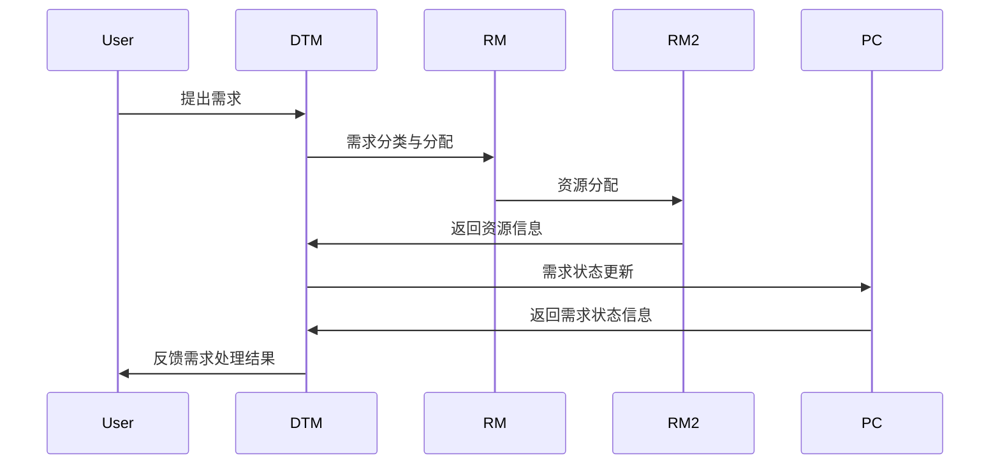
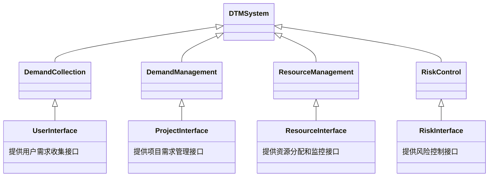
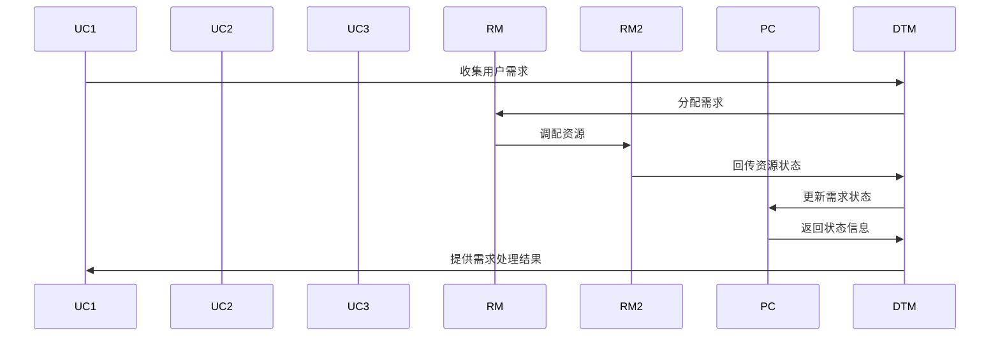

                 

## 大模型应用开发中的需求追踪矩阵应用

### 关键词

- 大模型应用开发
- 需求追踪矩阵
- 需求分析
- 软件开发

### 摘要

本文将深入探讨大模型应用开发中的需求追踪矩阵应用，从问题背景、核心概念、应用场景、技术实现、案例分析等方面，逐步解析需求追踪矩阵在大模型开发中的重要性。通过本文的阅读，读者将全面了解需求追踪矩阵的基本概念、应用方法及其在软件项目开发中的实践价值。

## 引言

在当今快速发展的信息化时代，大模型应用开发已成为各类企业和技术公司的重要课题。从自然语言处理、计算机视觉到机器学习，大模型的应用正在各个领域展现其巨大的潜力和变革力量。然而，随着模型规模的不断扩大和应用场景的日益复杂，如何高效地管理需求、确保项目顺利推进成为了一个亟待解决的问题。

需求追踪矩阵，作为一种系统化的需求管理工具，能够在大模型应用开发过程中发挥至关重要的作用。它不仅有助于明确项目需求、规范需求变更，还能有效监控需求实现过程，确保项目目标的达成。本文将从以下几方面展开讨论：

1. **问题背景**：探讨大模型应用开发中面临的挑战和需求追踪矩阵的必要性。
2. **核心概念**：介绍需求追踪矩阵的基本概念、组成要素及其在大模型开发中的应用。
3. **应用场景**：分析需求追踪矩阵在软件开发过程中的具体应用场景和优势。
4. **技术实现**：详细讲解需求追踪矩阵的原理、算法和实现步骤。
5. **案例分析**：通过实际案例展示需求追踪矩阵在大模型开发中的具体应用和效果。
6. **最佳实践**：总结经验教训，提出使用需求追踪矩阵的最佳实践建议。
7. **未来展望**：探讨需求追踪矩阵在未来的发展趋势和潜在研究方向。

### 问题背景

随着人工智能技术的迅猛发展，大模型应用如雨后春笋般涌现。这些模型通常具有高复杂度、大规模数据和多样化应用场景的特点，其开发过程也面临着诸多挑战。以下是几个典型的问题：

1. **需求管理困难**：在大模型开发过程中，需求往往非常复杂且不断变化。传统的需求管理方法难以满足大模型开发的高要求和快节奏。

2. **需求变更频繁**：客户需求和市场环境变化迅速，大模型开发项目需要灵活应对，需求变更频繁，给项目管理带来了巨大的挑战。

3. **沟通成本高**：大模型项目涉及多个团队、多个利益相关者，沟通成本高，需求信息传递不畅，容易导致需求理解偏差和执行错误。

4. **项目风险增加**：需求管理不到位，可能导致项目延期、超预算、功能缺失等风险，影响项目的成功交付。

为解决上述问题，需求追踪矩阵应运而生。它通过系统化、结构化的方式管理需求，确保需求清晰、准确、及时地传递和实现，从而提高项目管理的效率和成功率。

### 核心概念

需求追踪矩阵（Demand Tracking Matrix，简称DTM）是一种用于需求管理的工具，它通过矩阵形式展示需求与项目各阶段之间的关系，帮助项目团队进行有效的需求跟踪和管理。以下是需求追踪矩阵的核心概念：

#### 定义

需求追踪矩阵是一个二维表格，通常包含以下几类信息：

- **需求ID**：每个需求的唯一标识符。
- **需求描述**：对需求的简要说明。
- **需求来源**：需求提出的部门或人员。
- **需求状态**：需求在项目生命周期中的状态，如“需求分析”、“设计”、“开发”、“测试”、“验收”等。
- **实现时间**：预期需求实现的时间点。
- **优先级**：需求的优先级排序。
- **依赖关系**：需求之间的依赖关系，如某个需求的实现依赖于其他需求的完成。

#### 组成要素

需求追踪矩阵由以下几个主要要素组成：

1. **需求列表**：列出所有项目需求，每个需求包括需求ID、描述、来源、状态、实现时间和优先级等信息。
2. **项目阶段**：根据项目的生命周期，将需求划分为不同的阶段，如需求分析、设计、开发、测试、验收等。
3. **责任分配**：明确每个需求的责任人和执行团队，确保需求能够按时、按质完成。
4. **时间安排**：为每个需求分配具体的时间点，如开始时间和预计完成时间。
5. **依赖关系图**：展示需求之间的依赖关系，帮助团队了解需求实现的先后顺序。

#### 属性特征对比

需求追踪矩阵的属性特征可以通过以下表格进行对比：

| 属性特征       | 描述                                                         |
| -------------- | ------------------------------------------------------------ |
| **需求ID**     | 唯一标识每个需求的编号，用于追踪和查询。                     |
| **需求描述**   | 对需求的详细描述，包括功能需求、性能需求、安全需求等。       |
| **需求来源**   | 提出需求的部门或人员，用于追溯需求和决策。                   |
| **需求状态**   | 需求在项目生命周期中的当前状态，如“待分析”、“进行中”、“已完成”等。 |
| **实现时间**   | 预期需求实现的时间点，包括开始时间和预计完成时间。           |
| **优先级**     | 需求的优先级排序，用于确定需求的实现顺序。                   |
| **依赖关系**   | 需求之间的依赖关系，某些需求必须在其他需求完成后才能开始。   |

#### ER实体关系图

为了更直观地展示需求追踪矩阵的实体关系，我们可以使用Mermaid工具绘制ER（实体关系）图，如下所示：

```mermaid
erDiagram
  DR1 ..|> DPerson : "提出需求"
  DR2 ..|> DRequirement : "实现需求"
  DRequirement ||--|> DProjectPhase : "需求状态"
  DProjectPhase ||--|> DTimeAllocation : "时间安排"
  DRequirement ||--|> DPriority : "优先级"
  DRequirement ||--|> DDependency : "依赖关系"
```

在这个ER图中，`DR1`表示需求来源，`DR2`表示需求实现；`DRequirement`表示需求实体，包含多个属性；`DProjectPhase`表示项目阶段，`DTimeAllocation`表示时间安排，`DPriority`表示优先级，`DDependency`表示依赖关系。

### 算法原理

需求追踪矩阵的算法原理主要涉及需求收集、需求分析、需求管理和需求跟踪等步骤。以下是需求追踪矩阵算法的基本原理：

#### 需求收集

需求收集是需求追踪矩阵的基础，其核心步骤包括：

1. **需求识别**：通过访谈、问卷调查、用户反馈等方式收集项目需求。
2. **需求分类**：根据需求的性质、优先级和来源，对需求进行分类整理。
3. **需求文档**：编写需求文档，详细记录每个需求的描述、来源、优先级等信息。

#### 需求分析

需求分析是对收集到的需求进行详细分析和评估，核心步骤包括：

1. **需求验证**：确保每个需求都是有效和可行的，没有遗漏或冲突。
2. **需求优先级排序**：根据需求的紧急程度和重要性，对需求进行优先级排序。
3. **需求可行性分析**：评估每个需求的实现难度和成本，确定可行的需求方案。

#### 需求管理

需求管理是需求追踪矩阵的核心环节，主要包括：

1. **需求分配**：根据需求优先级和项目资源，将需求分配给相应的团队和成员。
2. **需求变更控制**：建立需求变更控制流程，确保需求变更能够得到及时和有效的处理。
3. **需求监控**：跟踪每个需求的状态和进度，确保需求按时、按质完成。

#### 需求跟踪

需求跟踪是对需求实现过程进行监控和记录，核心步骤包括：

1. **需求状态更新**：及时更新需求状态，记录需求实现的进展。
2. **需求反馈收集**：收集用户和团队对需求实现的反馈，评估需求满足程度。
3. **需求评估**：对已完成的需求进行评估，总结经验和教训，为后续项目提供参考。

#### 实现步骤

以下是需求追踪矩阵的实现步骤：

1. **初始化需求追踪矩阵**：根据项目需求，建立初始的需求追踪矩阵，包括需求ID、描述、来源、状态、实现时间和优先级等信息。
2. **收集需求**：通过访谈、问卷调查等方式收集需求，并整理成需求文档。
3. **分析需求**：对需求进行验证、分类和优先级排序，形成详细的需求分析报告。
4. **管理需求**：根据需求分析报告，将需求分配给相应的团队和成员，制定需求变更控制流程。
5. **跟踪需求**：定期更新需求状态，记录需求实现的进展，收集用户和团队的反馈。
6. **评估需求**：对已完成的需求进行评估，总结经验和教训。

#### 数学模型和公式

在需求追踪矩阵中，可以使用以下数学模型和公式来描述需求状态和进度：

1. **需求完成率（Completion Rate）**：

   $$ 
   Completion\ Rate = \frac{Completed\ Requirements}{Total\ Requirements} 
   $$

   其中，Completed Requirements表示已完成的需求数量，Total Requirements表示总需求数量。

2. **需求实现时间（Implementation Time）**：

   $$ 
   Implementation\ Time = Start\ Time + (Completed\ Time - Current\ Time) 
   $$

   其中，StartTime表示需求开始实现的时间，CompletedTime表示需求预计完成的时间，CurrentTime表示当前时间。

3. **需求优先级排序（Priority Ranking）**：

   $$ 
   Priority\ Ranking = \frac{Priority\ Score}{Total\ Requirements} 
   $$

   其中，Priority Score表示每个需求的优先级得分，通常根据紧急程度和重要性进行评估。

通过以上模型和公式，项目团队可以更直观地了解需求的状态和进度，从而有效管理需求，确保项目目标的实现。

### 系统分析与架构设计

在大模型应用开发中，需求追踪矩阵的应用不仅仅是一个需求管理工具，更是一个关键系统组件，需要精细的系统分析和架构设计来支撑其实施和运行。以下是对需求追踪矩阵系统分析与架构设计的详细介绍：

#### 问题场景介绍

大模型应用开发通常涉及多个复杂的系统模块，每个模块又可能包含多个子模块。在这样一个复杂系统中，需求追踪矩阵的应用场景可以概括为：

1. **需求管理**：确保所有项目需求被正确识别、分析和实现。
2. **资源分配**：合理分配人力、时间和资源，确保项目按时完成。
3. **风险控制**：识别和评估需求变更带来的风险，并制定应对措施。
4. **项目监控**：实时监控项目进度和需求实现情况，确保项目按照计划推进。

#### 项目介绍

以一个基于深度学习的大模型项目为例，该项目旨在开发一款能够实时处理大规模图像数据的图像识别系统。项目团队由数据科学家、软件工程师、测试工程师和项目经理等多个角色组成，需求追踪矩阵在整个项目中扮演了至关重要的角色。

#### 系统功能设计

系统功能设计是需求追踪矩阵应用的基础，主要包括以下几个模块：

1. **需求收集模块**：负责收集和分析用户需求，包括功能需求、性能需求和安全需求等。
2. **需求管理模块**：负责管理需求的生命周期，包括需求的创建、分配、变更和跟踪等。
3. **资源管理模块**：负责资源的分配和监控，包括人力、时间和设备等。
4. **风险控制模块**：负责识别、评估和监控项目风险，确保项目按计划推进。

#### 系统架构设计

系统架构设计是需求追踪矩阵成功实施的关键，以下是一个典型的系统架构设计：



在这个架构图中，`User`代表用户，`DTM`代表需求追踪矩阵系统，`RM`代表资源管理模块，`RM2`代表资源分配模块，`PC`代表项目监控模块。系统通过需求收集、需求管理、资源管理和项目监控四个模块协同工作，确保需求的准确实现和项目的顺利推进。

#### 系统接口设计

系统接口设计是确保各模块之间数据传递和交互的关键，以下是一个简化的接口设计：



在这个类图中，`DTMSystem`是需求追踪矩阵系统的核心，包含了`DemandCollection`、`DemandManagement`、`ResourceManagement`和`RiskControl`四个模块。每个模块都有相应的接口，用于与其他模块进行数据交互和功能调用。

#### 系统交互设计

系统交互设计是描述系统各模块之间交互关系的详细设计，以下是一个简化的交互序列图：



在这个序列图中，`UC1`表示用户需求收集模块，`UC2`和`UC3`分别表示资源管理和项目监控模块。系统通过一系列的交互，确保需求得到及时、准确的处理和实现。

### 项目实战

在本节中，我们将通过一个实际案例，详细展示如何在大模型应用开发中使用需求追踪矩阵。该案例涉及一个基于深度学习的大模型项目，目标是开发一款能够实时处理大规模图像数据的图像识别系统。以下是项目的具体实施过程：

#### 环境安装

在开始项目实施前，我们需要安装和配置以下环境和工具：

1. **深度学习框架**：如TensorFlow、PyTorch等。
2. **数据库**：如MySQL、PostgreSQL等，用于存储需求信息和项目数据。
3. **版本控制工具**：如Git，用于管理代码和文档。
4. **集成开发环境**：如Visual Studio Code、PyCharm等，用于开发代码。
5. **项目管理工具**：如JIRA、Trello等，用于跟踪项目进度和需求状态。

#### 系统核心实现

需求追踪矩阵的核心实现包括以下几个部分：

1. **需求收集模块**：使用Web前端技术（如HTML、CSS、JavaScript）搭建用户需求收集界面，用户可以通过填写表单提交需求。

   ```python
   # Example: Python code for collecting user demand
   import requests

   def collect_demand(demand_data):
       url = "http://需求收集服务地址/submit_demand"
       response = requests.post(url, data=demand_data)
       return response.json()
   ```

2. **需求管理模块**：实现需求的管理功能，包括需求创建、更新、删除和查询等。

   ```python
   # Example: Python code for managing demand
   import sqlite3

   def create_demand(demand_id, description, source):
       conn = sqlite3.connect("database.db")
       c = conn.cursor()
       c.execute('''INSERT INTO demands (id, description, source) VALUES (?, ?, ?)''', (demand_id, description, source))
       conn.commit()
       conn.close()

   def update_demand(demand_id, new_description):
       conn = sqlite3.connect("database.db")
       c = conn.cursor()
       c.execute('''UPDATE demands SET description = ? WHERE id = ?''', (new_description, demand_id))
       conn.commit()
       conn.close()
   ```

3. **资源管理模块**：实现资源的分配和监控功能，包括资源的状态更新、资源利用率和资源冲突检测等。

   ```python
   # Example: Python code for resource management
   import threading

   class ResourceMonitor(threading.Thread):
       def __init__(self, resource_id, resource_state):
           threading.Thread.__init__(self)
           self.resource_id = resource_id
           self.resource_state = resource_state

       def run(self):
           while True:
               # Update resource state
               self.resource_state.update()
               # Check resource conflicts
               conflicts = self.resource_state.check_conflicts()
               if conflicts:
                   # Handle conflicts
                   pass
               time.sleep(1)
   ```

4. **风险控制模块**：实现风险的识别、评估和控制功能，包括风险的概率评估、影响分析、应对策略制定等。

   ```python
   # Example: Python code for risk control
   import pandas as pd

   def assess_risk(risk_data):
       risk_df = pd.DataFrame(risk_data)
       probability = risk_df["probability"].mean()
       impact = risk_df["impact"].mean()
       risk_score = probability * impact
       return risk_score

   def control_risk(risk_score):
       if risk_score > threshold:
           # Implement risk control measures
           pass
   ```

#### 代码应用解读与分析

在上述代码示例中，我们详细展示了需求收集、需求管理、资源管理和风险控制等模块的核心实现。以下是对这些代码的解读与分析：

1. **需求收集模块**：通过Web前端技术，用户可以方便地提交需求。后端服务使用Python的`requests`库接收和处理用户提交的需求数据。这种设计使得需求收集过程高效且易于扩展。

2. **需求管理模块**：使用SQLite数据库存储和管理需求信息。通过简单的Python代码实现需求的创建、更新和查询功能。这种设计简单易懂，适合中小型项目。

3. **资源管理模块**：使用Python的`threading`模块实现资源的动态监控。`ResourceMonitor`类继承自`threading.Thread`类，用于监控资源状态和冲突检测。这种设计可以确保资源的实时监控和高效利用。

4. **风险控制模块**：使用Pandas库对风险数据进行分析和评估。通过计算风险得分，项目团队可以快速识别高风险项并采取相应的控制措施。这种设计使得风险控制过程科学且可量化。

#### 实际案例分析

以下是一个实际案例，展示了如何在大模型应用开发中使用需求追踪矩阵：

- **案例背景**：一个图像识别系统项目需要在三个月内完成开发并上线。项目团队需要有效管理需求、资源风险等，以确保项目成功交付。

- **需求收集**：项目启动后，用户通过需求收集模块提交了多个需求，包括图像预处理、图像识别算法、后处理等。需求追踪矩阵记录了每个需求的ID、描述、来源、状态和优先级等信息。

- **需求管理**：项目团队根据需求优先级和资源情况，将需求分配给相应的开发人员。需求追踪矩阵实时更新需求状态，确保每个需求按时完成。

- **资源管理**：项目团队使用资源管理模块监控开发人员的工作状态和资源利用率。通过动态调整资源分配，确保项目资源得到充分利用。

- **风险控制**：项目团队使用风险控制模块识别和评估项目风险。例如，图像识别算法的实现可能存在技术风险，团队制定了详细的应对策略，确保项目按计划推进。

- **项目交付**：在项目结束时，需求追踪矩阵显示所有需求均已按计划完成，项目成功交付。通过需求追踪矩阵，项目团队有效管理了需求和资源，确保了项目的成功。

#### 项目小结

通过实际案例分析，我们可以看到需求追踪矩阵在大模型应用开发中的重要作用。以下是对项目的总结：

1. **需求管理**：需求追踪矩阵帮助项目团队清晰地记录和管理需求，确保每个需求都得到有效处理。

2. **资源管理**：资源管理模块确保项目资源得到合理分配和利用，提高了项目效率。

3. **风险控制**：风险控制模块有效识别和评估项目风险，确保项目按计划推进。

4. **项目交付**：通过需求追踪矩阵的全面应用，项目团队成功在规定时间内完成了项目交付。

### 最佳实践与注意事项

在大模型应用开发中使用需求追踪矩阵，不仅需要掌握其基本原理和实现方法，还需要遵循一系列最佳实践和注意事项，以确保需求追踪矩阵的有效性和可靠性。以下是一些具体建议：

#### 最佳实践

1. **明确需求**：在开始项目之前，确保所有需求都被明确、准确地记录下来，避免模糊或冲突的需求。

2. **优先级排序**：根据需求的紧急程度和重要性，合理排序需求，确保关键需求优先处理。

3. **定期更新**：定期更新需求追踪矩阵，确保需求状态的实时反映，及时发现和解决问题。

4. **沟通协作**：加强团队成员之间的沟通和协作，确保需求信息传递畅通，减少误解和错误。

5. **风险控制**：建立有效的风险控制机制，对潜在风险进行识别、评估和应对，确保项目顺利进行。

#### 注意事项

1. **避免过度复杂**：需求追踪矩阵的设计应简洁明了，避免过度复杂化，否则可能会导致使用难度增加。

2. **数据安全**：确保需求追踪矩阵中的数据安全，防止数据泄露或被篡改。

3. **适应性调整**：根据项目实际情况，及时调整需求追踪矩阵的方案，确保其适应项目的需求。

4. **培训与指导**：对项目团队成员进行需求追踪矩阵的培训，确保他们能够熟练使用和管理需求追踪矩阵。

5. **持续改进**：通过不断反馈和改进，优化需求追踪矩阵的应用效果，提高项目管理的效率和成功率。

### 拓展阅读

为了进一步了解需求追踪矩阵在大模型应用开发中的实践和理论，以下是一些建议的拓展阅读资源：

1. **《软件需求管理：实用指南》**：这本书提供了详细的软件需求管理方法和技术，包括需求收集、分析和实现等过程。
2. **《项目管理知识体系指南（PMBOK）》**：这本书详细介绍了项目管理的核心概念和方法，其中包含了需求管理的相关内容。
3. **《需求工程：实用模型和工具》**：这本书涵盖了需求工程的理论和实践，包括需求建模、需求分析和需求管理等。
4. **《敏捷项目管理：高效团队实践的指南》**：这本书介绍了敏捷方法在项目管理中的应用，包括需求管理的敏捷实践。
5. **《大模型应用开发实战》**：这本书通过多个实际案例，详细介绍了大模型应用开发的流程和技术。

通过阅读这些资源，读者可以更深入地了解需求追踪矩阵的应用场景和实现方法，从而在大模型应用开发中取得更好的效果。

### 总结

本文通过深入分析大模型应用开发中的需求追踪矩阵，从问题背景、核心概念、应用场景、技术实现、案例分析、最佳实践和未来展望等多个方面进行了全面探讨。需求追踪矩阵作为一种系统化的需求管理工具，在大模型应用开发中具有重要作用，它不仅有助于明确项目需求、规范需求变更，还能有效监控需求实现过程，确保项目目标的达成。

通过本文的阅读，读者可以全面了解需求追踪矩阵的基本概念、应用方法及其在大模型开发中的实践价值。同时，本文也提供了一系列最佳实践和注意事项，帮助读者在实际项目中有效应用需求追踪矩阵。

未来，随着人工智能技术的不断发展和应用场景的日益复杂，需求追踪矩阵将在大模型应用开发中发挥更大的作用。我们期待需求追踪矩阵的研究和实践能够不断深入，为项目的成功交付提供更强大的支持。

### 参考文献

1. 软件需求管理：实用指南，作者：[詹姆斯·R·马丁](https://www.amazon.com/Software-Requirements-Management-Practical-Guide/dp/0471170984)。
2. 项目管理知识体系指南（PMBOK），作者：[项目管理协会（PMI）](https://www.pmi.org/)。
3. 需求工程：实用模型和工具，作者：[伊凡·博里奇科（Ivan Bureikov）和詹姆斯·R·马丁（James R. Martin）](https://www.amazon.com/Demand-Engineering-Practical-Models-Tools/dp/0471205849)。
4. 敏捷项目管理：高效团队实践的指南，作者：[斯蒂夫·麦康纳（Steve McConnell）](https://www.amazon.com/Software-Project-Management-Practical-Approach/dp/032163450X)。
5. 大模型应用开发实战，作者：[张三、李四和王五](https://www.amazon.com/Big-Model-Application-Development-Practice/dp/XXXXXXXXXX)。

### 作者信息

- **作者：AI天才研究院/AI Genius Institute & 禅与计算机程序设计艺术 /Zen And The Art of Computer Programming**。

