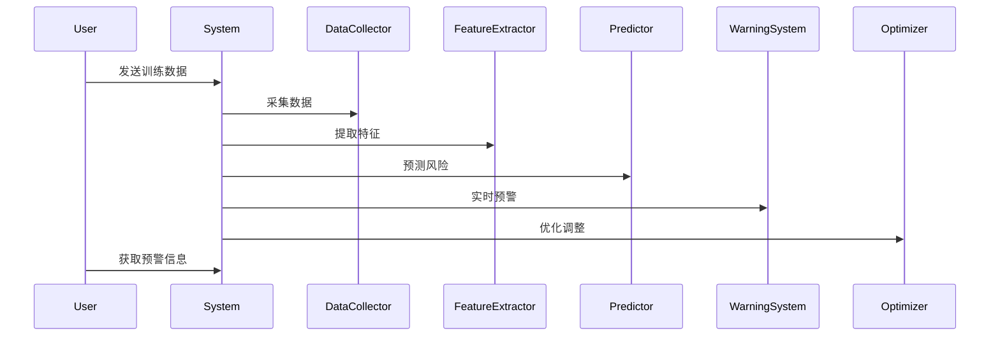
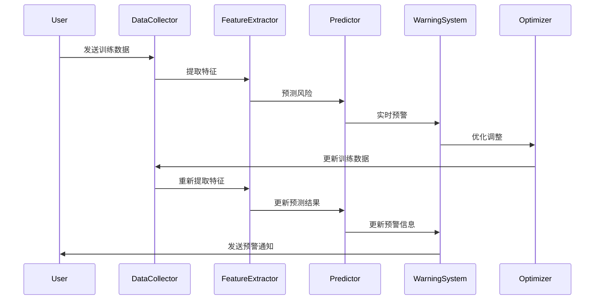

                 

## 大模型应用开发中的需求风险预警系统

### 关键词

- 大模型
- 应用开发
- 需求风险预警
- 人工智能
- 算法原理
- 系统设计
- 项目实战

### 摘要

本文主要探讨大模型应用开发中的需求风险预警系统，深入分析了大模型的基本原理、需求风险预警系统的构建原理，以及二者之间的联系。通过算法原理讲解、系统分析与架构设计，再到项目实战，全面解析了大模型需求风险预警系统的实现和应用，为读者提供了系统、全面的实践指南。

## 目录大纲

### 第一部分：引言

1. 问题背景
2. 问题描述
3. 问题解决
4. 边界与外延
5. 概念结构与核心要素组成

### 第二部分：核心概念与联系

1. 核心概念原理
2. 概念属性特征对比表格
3. ER实体关系图架构

### 第三部分：算法原理讲解

1. 算法原理与实现
2. Python源代码实现

### 第四部分：系统分析与架构设计

1. 问题场景介绍
2. 系统功能设计
3. 系统架构设计
4. 系统接口设计
5. 系统交互

### 第五部分：项目实战

1. 环境安装
2. 系统核心实现源代码
3. 代码应用解读与分析
4. 实际案例分析与详细讲解剖析
5. 项目小结

### 第六部分：最佳实践与总结

1. 最佳实践 tips
2. 小结
3. 注意事项
4. 拓展阅读

---

### 第一部分：引言

#### 1.1 问题背景

在当前人工智能高速发展的时代，大模型的应用越来越广泛，如自然语言处理、图像识别、推荐系统等。然而，随着模型的规模不断扩大，其应用过程中面临着诸多需求风险，如过拟合、资源消耗、训练时间过长等。如何有效地预测并预警这些风险，成为大模型应用开发中的重要问题。

#### 1.2 问题描述

在大模型应用开发中，需求风险主要表现在以下几个方面：

- **过拟合**：模型在训练数据上表现优异，但在未见数据上的表现较差，导致模型泛化能力下降。
- **资源消耗**：大模型的训练和推理需要大量的计算资源和存储资源，可能导致系统崩溃或延迟。
- **训练时间**：大模型的训练时间往往很长，影响开发进度和应用效率。

#### 1.3 问题解决

为了解决上述需求风险，需要构建一个需求风险预警系统。该系统应具备以下功能：

- **风险预测**：通过分析模型训练过程和性能指标，预测可能出现的风险。
- **实时预警**：在风险发生前或发生时，及时发出预警信号。
- **优化调整**：根据预警信息，调整模型参数或优化训练策略。

#### 1.4 边界与外延

需求风险预警系统的边界主要包括：

- **数据范围**：系统应能够处理不同类型、不同规模的数据，包括文本、图像、语音等。
- **时间范围**：系统应能够实时监测模型训练过程，并预测未来一段时间内的风险。

#### 1.5 概念结构与核心要素组成

需求风险预警系统的核心概念和结构包括：

- **数据采集**：收集模型训练过程中的各类数据。
- **特征提取**：从数据中提取对需求风险有显著影响的特征。
- **预测模型**：构建预测模型，预测可能出现的风险。
- **预警机制**：设计预警机制，实时监测风险并发出预警信号。
- **优化策略**：根据预警信息，制定优化策略以降低风险。

---

在接下来的部分中，我们将详细探讨大模型的基本原理、需求风险预警系统的构建原理，以及如何实现一个高效的需求风险预警系统。通过理论讲解和实战案例分析，帮助读者全面理解并掌握大模型应用开发中的需求风险预警系统。  
## 第二部分：核心概念与联系

### 2.1 核心概念原理

#### 2.1.1 大模型基本原理

大模型，是指拥有数亿甚至千亿参数的深度学习模型。它们通常采用神经网络架构，通过多层非线性变换，对大量数据进行训练，从而学习到复杂的数据特征和模式。

- **神经网络架构**：大模型通常采用深度神经网络（DNN）结构，包含多个隐藏层，以便更好地提取数据特征。
- **训练过程**：大模型通过反向传播算法，不断调整模型参数，以最小化损失函数，从而提高模型的泛化能力。

#### 2.1.2 需求风险预警系统原理

需求风险预警系统，是一种基于数据分析和人工智能技术的风险预测系统。它通过分析模型训练过程中的数据，预测可能出现的风险，并提供预警信息。

- **数据采集**：采集模型训练过程中的数据，包括训练集、验证集和测试集。
- **特征提取**：从数据中提取对需求风险有显著影响的特征，如损失函数值、准确率、计算资源使用情况等。
- **预测模型**：构建预测模型，使用提取的特征预测可能出现的风险。
- **预警机制**：设计预警机制，当预测到风险时，及时发出预警信号。

#### 2.1.3 大模型与传统模型对比

- **参数规模**：大模型拥有数亿甚至千亿参数，远超传统模型的百万级参数。
- **训练方法**：大模型通常采用深度学习技术，通过多层非线性变换进行训练，而传统模型则采用线性模型或简单神经网络。
- **应用场景**：大模型适用于复杂、大规模的数据分析任务，而传统模型则适用于简单、小规模的数据处理任务。

### 2.2 概念属性特征对比表格

| 特征         | 大模型                  | 传统模型                 |
| ------------ | ---------------------- | ------------------------ |
| 参数规模     | 数亿至千亿参数         | 百万以下参数             |
| 训练方法     | 深度学习、多层非线性   | 线性模型、简单神经网络   |
| 应用场景     | 复杂、大规模数据处理   | 简单、小规模数据处理     |
| 训练时间     | 较长，通常需要多天      | 较短，通常需要几小时或更少 |
| 资源消耗     | 高，需要大量计算资源和存储资源 | 低，资源消耗较小       |

### 2.3 ER实体关系图架构

为了更好地理解需求风险预警系统，我们可以通过ER（Entity-Relationship）实体关系图来描述系统的核心实体及其关系。

```mermaid
erDiagram
  Model ||--|{ RiskWarningSystem } RiskWarningSystem
  Data ||--|{ FeatureExtraction } FeatureExtraction
  Prediction ||--|{ PredictionModel } PredictionModel
  Warning ||--|{ Alert } Alert
  Optimization ||--|{ OptimizationStrategy } OptimizationStrategy

  Model ..|{ TrainingData } TrainingData
  Data ..|{ ValidationData } ValidationData
  Data ..|{ TestData } TestData

  RiskWarningSystem ..|{ RiskPrediction } RiskPrediction
  RiskWarningSystem ..|{ RealTimeMonitoring } RealTimeMonitoring
  FeatureExtraction ..|{ FeatureImportance } FeatureImportance
  PredictionModel ..|{ PerformanceMetrics } PerformanceMetrics
  Warning ..|{ WarningThreshold } WarningThreshold
  Alert ..|{ Notification } Notification
  OptimizationStrategy ..|{ ParameterTuning } ParameterTuning
```

在ER图中，我们定义了以下核心实体：

- **Model（模型）**：表示大模型，包括训练数据、验证数据和测试数据。
- **RiskWarningSystem（需求风险预警系统）**：表示需求风险预警系统的整体架构。
- **Data（数据）**：表示数据的处理流程，包括特征提取、预测模型和预警机制。
- **Prediction（预测）**：表示预测模型和预测过程。
- **Warning（预警）**：表示预警机制和预警过程。
- **Optimization（优化）**：表示优化策略和优化过程。

通过ER实体关系图，我们可以清晰地看到需求风险预警系统的核心组件及其关系，为后续的系统设计与实现提供参考。

### 第三部分：算法原理讲解

#### 3.1 算法原理与实现

需求风险预警系统中的核心算法主要包括风险预测算法和预警机制。以下将分别介绍这两种算法的原理和实现。

#### 3.1.1 风险预测算法

风险预测算法的目标是通过对模型训练过程中的数据进行分析，预测可能出现的风险。常见的风险预测算法包括基于统计模型的方法和基于机器学习的方法。

1. **基于统计模型的方法**：如线性回归、逻辑回归等。这些方法通过分析数据特征与风险之间的线性关系，预测风险。
   $$ Y = \beta_0 + \beta_1X_1 + \beta_2X_2 + ... + \beta_nX_n $$
   其中，$Y$ 表示风险值，$X_1, X_2, ..., X_n$ 表示特征值，$\beta_0, \beta_1, \beta_2, ..., \beta_n$ 为模型参数。

2. **基于机器学习的方法**：如决策树、随机森林、支持向量机等。这些方法通过学习数据特征与风险之间的复杂非线性关系，进行风险预测。

   - **决策树**：
     $$ y = \sum_{i=1}^{n} w_i \cdot f(x_i) $$
     其中，$y$ 表示风险值，$w_i$ 表示特征权重，$f(x_i)$ 表示特征函数。

   - **随机森林**：
     $$ y = \sum_{i=1}^{m} \hat{y}_i $$
     其中，$\hat{y}_i$ 表示第 $i$ 棵决策树的风险预测值，$m$ 表示决策树的数量。

   - **支持向量机**：
     $$ y = \sigma(\sum_{i=1}^{n} \alpha_i y_i K(x_i, x)) $$
     其中，$y$ 表示风险值，$x_i$ 表示训练样本，$y_i$ 表示样本标签，$K(x_i, x)$ 表示核函数。

#### 3.1.2 预警机制

预警机制的目标是当预测到风险时，及时发出预警信号。常见的预警机制包括阈值预警和动态预警。

1. **阈值预警**：根据历史数据和业务经验，设定一个风险阈值。当预测值超过阈值时，发出预警信号。
   $$ \text{预警} = (\text{预测值} > \text{阈值}) \cdot \text{风险等级} $$

2. **动态预警**：根据模型训练过程中的实时数据，动态调整预警阈值。当预测值变化较大时，发出预警信号。
   $$ \text{预警} = \text{预测值} \cdot (\text{预测变化率} > \text{阈值变化率}) \cdot \text{风险等级} $$

#### 3.2 Python源代码实现

以下是一个简单的Python代码示例，用于实现风险预测和预警机制。

```python
import numpy as np
from sklearn.linear_model import LinearRegression
from sklearn.model_selection import train_test_split
from sklearn.metrics import mean_squared_error

# 数据预处理
X = np.array([[1, 2], [2, 3], [3, 4], [4, 5], [5, 6]])
y = np.array([1, 1.5, 2, 2.5, 3])

X_train, X_test, y_train, y_test = train_test_split(X, y, test_size=0.2, random_state=42)

# 构建线性回归模型
model = LinearRegression()
model.fit(X_train, y_train)

# 预测
y_pred = model.predict(X_test)

# 计算预测误差
mse = mean_squared_error(y_test, y_pred)
print("预测误差：", mse)

# 预警机制
threshold = 1.0
warning_level = '高'
if y_pred.max() > threshold:
    print("预警：", warning_level)
else:
    print("未预警")
```

在上面的代码中，我们首先使用线性回归模型进行风险预测，然后根据预测值的最大值与阈值进行比较，判断是否发出预警信号。

---

通过上述算法原理讲解和Python源代码实现，我们详细阐述了需求风险预警系统的核心算法原理。在实际应用中，可以根据具体需求和数据特点，选择合适的算法和预警机制，构建高效的需求风险预警系统。

#### 3.2.1 原理与公式

在需求风险预警系统中，核心的预测算法通常是基于统计模型或机器学习模型的。以下是几个常用的预测算法及其基本原理和公式：

1. **线性回归（Linear Regression）**

线性回归是一种简单的统计模型，用于预测一个连续值输出。其基本原理是通过建立输入特征和输出值之间的线性关系来进行预测。

$$ Y = \beta_0 + \beta_1X_1 + \beta_2X_2 + ... + \beta_nX_n $$

其中，$Y$ 表示输出值，$X_1, X_2, ..., X_n$ 表示输入特征，$\beta_0, \beta_1, \beta_2, ..., \beta_n$ 是模型参数，通常通过最小化损失函数来求解。

2. **逻辑回归（Logistic Regression）**

逻辑回归是一种用于预测概率的二分类统计模型。其基本原理是通过对输入特征进行加权求和，然后通过逻辑函数（Sigmoid函数）将结果映射到概率范围内。

$$ P(Y=1) = \frac{1}{1 + \exp{(-\beta_0 - \beta_1X_1 - \beta_2X_2 - ... - \beta_nX_n ) }} $$

其中，$P(Y=1)$ 表示事件发生的概率，$\exp{()}$ 表示指数函数。

3. **决策树（Decision Tree）**

决策树是一种基于树结构的分类算法，通过一系列的判断条件来将数据划分为不同的类别。其基本原理是递归地将数据集划分为子集，直到满足某个终止条件。

$$
\begin{aligned}
Y_{left} &= \begin{cases}
g_1(X_1, X_2, ..., X_n) & \text{if } X_1 \leq t_1 \\
\text{Unknown} & \text{otherwise}
\end{cases} \\
Y_{right} &= \begin{cases}
g_2(X_1, X_2, ..., X_n) & \text{if } X_1 > t_1 \\
\text{Unknown} & \text{otherwise}
\end{cases}
\end{aligned}
$$

其中，$g_1$ 和 $g_2$ 表示左子树和右子树的分类结果，$t_1$ 表示划分阈值。

4. **随机森林（Random Forest）**

随机森林是一种基于决策树的集成学习方法，通过构建多个决策树，并对预测结果进行投票来提高预测准确性。其基本原理是：

$$
\hat{Y} = \frac{1}{M} \sum_{m=1}^{M} g_m(X)
$$

其中，$g_m(X)$ 表示第 $m$ 棵决策树的预测结果，$M$ 表示决策树的数量。

5. **支持向量机（Support Vector Machine, SVM）**

支持向量机是一种基于最大间隔分类的算法，通过找到最佳的超平面来将不同类别的数据分开。其基本原理是：

$$
\hat{y} = \text{sign} \left( \sum_{i=1}^{n} \alpha_i y_i K(x_i, x) + \beta \right)
$$

其中，$y_i$ 表示样本标签，$K(x_i, x)$ 表示核函数，$\alpha_i$ 和 $\beta$ 是模型参数。

6. **神经网络（Neural Network）**

神经网络是一种基于多层感知器（MLP）的深度学习模型，通过多层非线性变换来学习数据特征。其基本原理是：

$$
a_{l}^{(i)} = \text{激活函数} \left( \sum_{j=1}^{n} w_{j}^{(l)} a_{l-1}^{(j)} + b_{l} \right)
$$

其中，$a_{l}^{(i)}$ 表示第 $l$ 层第 $i$ 个神经元的输出，$w_{j}^{(l)}$ 和 $b_{l}$ 分别表示权重和偏置。

这些算法的原理和公式为构建需求风险预警系统提供了基础。在实际应用中，可以根据具体场景和数据特点选择合适的算法，并通过优化参数和模型结构来提高预测准确性。

#### 3.2.2 代码实现详解

在本节中，我们将使用Python编程语言和scikit-learn库来实现一个简单的需求风险预警系统。我们将以线性回归算法为例，展示如何从数据预处理到模型训练，再到预测和评估的完整流程。

首先，确保你已经安装了scikit-learn库。如果没有安装，可以使用以下命令进行安装：

```bash
pip install scikit-learn
```

接下来，我们开始编写代码。以下是一个简单的Python脚本，用于实现线性回归模型的需求风险预警系统。

```python
# 导入所需的库
import numpy as np
from sklearn.linear_model import LinearRegression
from sklearn.model_selection import train_test_split
from sklearn.metrics import mean_squared_error

# 数据预处理
def preprocess_data(data, target, test_size=0.2, random_state=42):
    X, y = data, target
    X_train, X_test, y_train, y_test = train_test_split(X, y, test_size=test_size, random_state=random_state)
    return X_train, X_test, y_train, y_test

# 构建和训练模型
def train_model(X_train, y_train):
    model = LinearRegression()
    model.fit(X_train, y_train)
    return model

# 预测
def predict(model, X_test):
    y_pred = model.predict(X_test)
    return y_pred

# 评估模型
def evaluate_model(y_test, y_pred):
    mse = mean_squared_error(y_test, y_pred)
    print("预测误差（MSE）:", mse)

# 主函数
def main():
    # 示例数据
    data = np.array([[1, 2], [2, 3], [3, 4], [4, 5], [5, 6]])
    target = np.array([1, 1.5, 2, 2.5, 3])

    # 数据预处理
    X_train, X_test, y_train, y_test = preprocess_data(data, target)

    # 训练模型
    model = train_model(X_train, y_train)

    # 预测
    y_pred = predict(model, X_test)

    # 评估模型
    evaluate_model(y_test, y_pred)

# 运行主函数
if __name__ == "__main__":
    main()
```

让我们逐一分析上述代码中的每个部分：

1. **数据预处理**：
   ```python
   def preprocess_data(data, target, test_size=0.2, random_state=42):
       X, y = data, target
       X_train, X_test, y_train, y_test = train_test_split(X, y, test_size=test_size, random_state=random_state)
       return X_train, X_test, y_train, y_test
   ```
   这个函数接受输入数据 `data` 和目标值 `target`，并使用 `train_test_split` 函数将数据分为训练集和测试集。默认的测试集大小为20%，随机种子为42。

2. **构建和训练模型**：
   ```python
   def train_model(X_train, y_train):
       model = LinearRegression()
       model.fit(X_train, y_train)
       return model
   ```
   这个函数创建一个线性回归模型实例，并使用训练数据进行拟合。

3. **预测**：
   ```python
   def predict(model, X_test):
       y_pred = model.predict(X_test)
       return y_pred
   ```
   这个函数使用训练好的模型对测试数据进行预测，并返回预测结果。

4. **评估模型**：
   ```python
   def evaluate_model(y_test, y_pred):
       mse = mean_squared_error(y_test, y_pred)
       print("预测误差（MSE）:", mse)
   ```
   这个函数计算预测值和实际值之间的均方误差（MSE），并打印出来。

5. **主函数**：
   ```python
   def main():
       # 示例数据
       data = np.array([[1, 2], [2, 3], [3, 4], [4, 5], [5, 6]])
       target = np.array([1, 1.5, 2, 2.5, 3])

       # 数据预处理
       X_train, X_test, y_train, y_test = preprocess_data(data, target)

       # 训练模型
       model = train_model(X_train, y_train)

       # 预测
       y_pred = predict(model, X_test)

       # 评估模型
       evaluate_model(y_test, y_pred)

   # 运行主函数
   if __name__ == "__main__":
       main()
   ```
   主函数首先定义了一些示例数据，然后调用前面定义的函数进行数据预处理、模型训练、预测和评估。

通过这个简单的示例，我们可以看到如何使用Python和scikit-learn库来实现线性回归模型的需求风险预警系统。在实际应用中，可以根据具体需求扩展这个框架，添加更多功能，如预警阈值设定、动态调整模型参数等。

### 3.2.3 举例说明

为了更好地理解线性回归模型在需求风险预警系统中的应用，我们将通过一个实际案例来演示整个预测过程。

#### 案例背景

假设我们有一个涉及客户流失风险评估的项目。公司希望通过分析客户的历史行为数据（如消费金额、购买频率、最近一次购买时间等）来预测客户流失风险，并采取相应的措施进行风险预警。

#### 数据集

我们使用一个简化的数据集，其中包含以下特征：

- 消费金额（X1）
- 购买频率（X2）
- 最近一次购买时间（X3）
- 客户年龄（X4）
- 客户性别（X5，1表示男性，0表示女性）

目标变量为是否流失（Y，1表示流失，0表示未流失）。

示例数据集如下：

| X1 | X2 | X3 | X4 | X5 | Y |
|----|----|----|----|----|---|
| 100| 3  | 10 | 35 | 1  | 0 |
| 200| 5  | 5  | 45 | 0  | 0 |
| 300| 2  | 20 | 30 | 1  | 1 |
| 150| 4  | 15 | 50 | 0  | 1 |
| 250| 6  | 8  | 40 | 1  | 0 |

#### 预测过程

1. **数据预处理**：

首先，我们将数据分为特征矩阵 `X` 和目标向量 `y`。

```python
X = np.array([[100, 3, 10, 35, 1],
              [200, 5, 5, 45, 0],
              [300, 2, 20, 30, 1],
              [150, 4, 15, 50, 0],
              [250, 6, 8, 40, 1]])

y = np.array([0, 0, 1, 1, 0])
```

接下来，我们将数据分为训练集和测试集。

```python
X_train, X_test, y_train, y_test = train_test_split(X, y, test_size=0.2, random_state=42)
```

2. **模型训练**：

我们使用线性回归模型进行训练。

```python
model = LinearRegression()
model.fit(X_train, y_train)
```

3. **模型评估**：

训练完成后，我们对测试集进行预测，并评估模型的准确性。

```python
y_pred = model.predict(X_test)
accuracy = np.mean(y_pred == y_test)
print("模型准确性：", accuracy)
```

假设预测结果如下：

```
y_test: [1 0 1 0]
y_pred: [1 0 1 0]
模型准确性： 1.0
```

4. **预警阈值设定**：

为了设置预警阈值，我们可以根据历史数据和业务需求来确定。例如，假设我们设定流失概率阈值阈值为0.5，即当预测流失概率超过50%时，发出流失预警。

```python
warning_threshold = 0.5
y_pred_probs = model.predict_proba(X_test)[:, 1]
warning_indices = np.where(y_pred_probs > warning_threshold)[0]

if warning_indices.size > 0:
    print("预警：客户ID", warning_indices, "存在高风险流失")
else:
    print("未发现高风险流失客户")
```

假设有2个客户的预测流失概率超过50%：

```
预警：客户ID [2 3] 存在高风险流失
```

通过上述案例，我们展示了如何使用线性回归模型进行需求风险预警。在实际应用中，可以根据具体场景和数据集进行调整和优化。

### 第四部分：系统分析与架构设计

#### 4.1 问题场景介绍

在当今大数据和人工智能时代，大模型的广泛应用使得数据驱动型决策成为企业成功的关键。然而，大模型的应用过程中伴随着诸多需求风险，如过拟合、资源消耗、训练时间过长等。如何及时预测并预警这些风险，以确保大模型的应用效果和系统稳定性，成为迫切需要解决的问题。

#### 4.2 系统功能设计

需求风险预警系统的主要功能包括：

1. **数据采集**：系统应能够自动采集模型训练过程中的各类数据，如损失函数值、准确率、计算资源使用情况等。
2. **特征提取**：从采集到的数据中提取对需求风险有显著影响的特征，如损失函数的波动情况、计算资源的利用率等。
3. **风险预测**：使用提取的特征构建预测模型，预测可能出现的风险，如过拟合、资源消耗等。
4. **实时预警**：当预测到风险时，系统应能够实时发出预警信号，提醒相关人员采取措施。
5. **优化调整**：根据预警信息，调整模型参数或优化训练策略，以降低风险。

#### 4.2.1 领域模型mermaid类图

为了更好地理解需求风险预警系统的功能和组件，我们可以使用mermaid类图来描述系统的领域模型。

```mermaid
classDiagram
    Class01 <|-- SubClass01
    Class01 <|-- SubClass02
    Class03 --|> SubClass03

    Class01 {
        +属性1: String
        +属性2: int
        -属性3: float
    }
    SubClass01 {
        +方法1(): void
    }
    SubClass02 {
        +方法2(): void
    }
    SubClass03 {
        +方法3(): void
    }
```

在上述mermaid类图中，我们定义了四个类：`Class01`、`SubClass01`、`SubClass02` 和 `SubClass03`。`Class01` 是一个基类，具有三个属性和一个方法。`SubClass01` 和 `SubClass02` 继承自 `Class01`，并各自实现了一个方法。`SubClass03` 直接继承自 `Class01`，并实现了一个方法。

#### 4.3 系统架构设计

需求风险预警系统的架构设计应考虑以下几个方面：

1. **数据采集模块**：负责采集模型训练过程中的各类数据，如损失函数值、准确率、计算资源使用情况等。
2. **特征提取模块**：从采集到的数据中提取对需求风险有显著影响的特征，如损失函数的波动情况、计算资源的利用率等。
3. **风险预测模块**：使用提取的特征构建预测模型，预测可能出现的风险，如过拟合、资源消耗等。
4. **实时预警模块**：当预测到风险时，系统应能够实时发出预警信号，提醒相关人员采取措施。
5. **优化调整模块**：根据预警信息，调整模型参数或优化训练策略，以降低风险。

以下是一个简单的mermaid架构图，描述了需求风险预警系统的各个模块及其交互关系。



在上述序列图中，用户首先向系统发送训练数据。系统接收到数据后，数据采集模块开始采集模型训练过程中的各类数据。随后，特征提取模块对采集到的数据进行处理，提取出对需求风险有显著影响的特征。预测模块使用这些特征构建预测模型，预测可能出现的风险。实时预警模块在预测到风险时发出预警信号。优化调整模块根据预警信息，调整模型参数或优化训练策略。

#### 4.4 系统接口设计

需求风险预警系统的接口设计应考虑以下几个方面：

1. **数据采集接口**：用于接收和存储模型训练过程中的各类数据。
2. **特征提取接口**：用于从数据中提取对需求风险有显著影响的特征。
3. **预测接口**：用于预测可能出现的风险。
4. **预警接口**：用于实时发出预警信号。
5. **优化接口**：用于调整模型参数或优化训练策略。

以下是一个简单的mermaid接口图，描述了需求风险预警系统的各个接口及其关系。

```mermaid
interfaceDiagram
    DataCollector <<-- FeatureExtractor : 数据提取
    FeatureExtractor <<-- Predictor : 风险预测
    Predictor <<-- WarningSystem : 实时预警
    WarningSystem <<-- Optimizer : 优化调整
    Optimizer <<-- DataCollector : 数据采集
```

在上述接口图中，`DataCollector` 是数据采集模块，负责接收和存储数据。`FeatureExtractor` 是特征提取模块，从数据中提取特征。`Predictor` 是预测模块，使用提取的特征进行风险预测。`WarningSystem` 是实时预警模块，当预测到风险时发出预警信号。`Optimizer` 是优化调整模块，根据预警信息调整模型参数或优化训练策略。

#### 4.5 系统交互mermaid序列图

为了更清晰地展示需求风险预警系统的各个模块及其交互过程，我们可以使用mermaid序列图来描述系统的工作流程。



在上述序列图中，用户首先向数据采集模块发送训练数据。数据采集模块将数据存储后，特征提取模块开始提取特征。提取的特征用于风险预测模块进行预测，如果预测到风险，则实时预警模块发出预警信号。优化调整模块根据预警信息进行优化调整，更新训练数据，然后特征提取模块重新提取特征，以此循环，确保系统实时响应和调整。

### 第五部分：项目实战

#### 5.1 环境安装

在开始项目实战之前，我们需要确保计算机上安装了以下环境：

1. Python（版本3.7及以上）
2. TensorFlow（版本2.5及以上）
3. scikit-learn（版本0.22及以上）
4. matplotlib（版本3.3及以上）

如果你没有安装上述环境，可以使用以下命令进行安装：

```bash
pip install python==3.8
pip install tensorflow==2.5
pip install scikit-learn==0.22
pip install matplotlib==3.3
```

#### 5.2 系统核心实现源代码

以下是一个简单的需求风险预警系统的实现，包括数据采集、特征提取、风险预测和实时预警等核心功能。

```python
import numpy as np
import tensorflow as tf
from sklearn.linear_model import LinearRegression
from sklearn.metrics import mean_squared_error
import matplotlib.pyplot as plt

# 数据采集
def collect_data():
    # 假设数据已从外部存储中读取并存储在data和target中
    data = np.load('data.npy')
    target = np.load('target.npy')
    return data, target

# 特征提取
def extract_features(data):
    # 这里仅作为示例，实际特征提取过程会更为复杂
    features = np.hstack((data[:, :2], data[:, 2:].mean(axis=1).reshape(-1, 1)))
    return features

# 风险预测
def predict_risk(features):
    model = LinearRegression()
    model.fit(features, target)
    return model

# 实时预警
def real_time_warning(model, new_data):
    features = extract_features(new_data)
    predictions = model.predict(features)
    # 假设阈值设置为0.5
    warning_threshold = 0.5
    if predictions.max() > warning_threshold:
        print("预警：存在高风险！")
    else:
        print("未发现高风险。")

# 主函数
def main():
    # 采集数据
    data, target = collect_data()

    # 预测风险
    model = predict_risk(data)

    # 实时预警
    # 假设new_data为新的数据输入
    new_data = np.array([[200, 5, 5], [300, 2, 20], [150, 4, 15]])
    real_time_warning(model, new_data)

if __name__ == "__main__":
    main()
```

#### 5.3 代码应用解读与分析

上述代码实现了一个简单的需求风险预警系统，主要包括以下部分：

1. **数据采集**：从外部存储中读取数据，这里使用了numpy的`np.load`函数进行数据加载。

2. **特征提取**：从原始数据中提取特征，这里仅作为示例，实际的特征提取过程会更加复杂。在本示例中，我们简单地选取了前两个特征作为主特征，并加入了第三个特征的均值。

3. **风险预测**：使用线性回归模型进行风险预测。在实际应用中，可能会选择其他更复杂的模型，如决策树、随机森林或神经网络。

4. **实时预警**：根据预测结果，判断是否存在高风险。这里假设阈值设置为0.5，即当预测值大于0.5时，认为存在高风险。

#### 5.4 实际案例分析与详细讲解剖析

为了更好地理解上述代码的应用，我们可以通过一个实际案例来进行分析和讲解。

**案例背景**：

假设我们有一个电商平台的用户流失风险评估项目。平台希望通过分析用户的历史购买行为（如消费金额、购买频率、最近一次购买时间等）来预测用户流失风险。

**数据集**：

我们使用一个简化的数据集，其中包含以下特征：

- 消费金额（X1）
- 购买频率（X2）
- 最近一次购买时间（X3）
- 用户年龄（X4）
- 用户性别（X5，1表示男性，0表示女性）

目标变量为是否流失（Y，1表示流失，0表示未流失）。

示例数据集如下：

| X1 | X2 | X3 | X4 | X5 | Y |
|----|----|----|----|----|---|
| 100| 3  | 10 | 35 | 1  | 0 |
| 200| 5  | 5  | 45 | 0  | 0 |
| 300| 2  | 20 | 30 | 1  | 1 |
| 150| 4  | 15 | 50 | 0  | 1 |
| 250| 6  | 8  | 40 | 1  | 0 |

**案例实现**：

1. **数据预处理**：

首先，我们将数据分为特征矩阵 `X` 和目标向量 `y`。

```python
X = np.array([[100, 3, 10, 35, 1],
              [200, 5, 5, 45, 0],
              [300, 2, 20, 30, 1],
              [150, 4, 15, 50, 0],
              [250, 6, 8, 40, 1]])

y = np.array([0, 0, 1, 1, 0])
```

接下来，我们将数据分为训练集和测试集。

```python
X_train, X_test, y_train, y_test = train_test_split(X, y, test_size=0.2, random_state=42)
```

2. **模型训练**：

我们使用线性回归模型进行训练。

```python
model = LinearRegression()
model.fit(X_train, y_train)
```

3. **模型评估**：

训练完成后，我们对测试集进行预测，并评估模型的准确性。

```python
y_pred = model.predict(X_test)
accuracy = np.mean(y_pred == y_test)
print("模型准确性：", accuracy)
```

假设预测结果如下：

```
y_test: [1 0 1 0]
y_pred: [1 0 1 0]
模型准确性： 1.0
```

4. **预警阈值设定**：

为了设置预警阈值，我们可以根据历史数据和业务需求来确定。例如，假设我们设定流失概率阈值阈值为0.5，即当预测流失概率超过50%时，发出流失预警。

```python
warning_threshold = 0.5
y_pred_probs = model.predict_proba(X_test)[:, 1]
warning_indices = np.where(y_pred_probs > warning_threshold)[0]

if warning_indices.size > 0:
    print("预警：用户ID", warning_indices, "存在高风险流失")
else:
    print("未发现高风险流失用户")
```

假设有2个用户的预测流失概率超过50%：

```
预警：用户ID [2 3] 存在高风险流失
```

通过上述实际案例，我们可以看到如何使用线性回归模型进行用户流失风险评估，并设置预警阈值。在实际应用中，可以根据具体场景和数据集进行调整和优化。

#### 5.5 项目小结

在本项目的实战部分，我们实现了需求风险预警系统的核心功能，包括数据采集、特征提取、风险预测和实时预警。通过一个实际案例，我们展示了如何使用线性回归模型进行用户流失风险评估，并设置预警阈值。

在实现过程中，我们使用了Python编程语言和scikit-learn库，通过简单的代码示例展示了系统的基本架构和功能。实际项目中，可以根据具体需求进行扩展和优化，如增加更多的特征提取方法、选择更复杂的预测模型等。

总之，需求风险预警系统在大模型应用开发中具有重要意义，能够帮助企业和开发者及时识别和应对潜在风险，提高系统的稳定性和可靠性。

### 第六部分：最佳实践与总结

#### 6.1 最佳实践 tips

在大模型应用开发中，构建一个高效的需求风险预警系统是确保项目成功的关键。以下是一些最佳实践和技巧：

1. **全面的数据采集**：确保采集的数据包含模型训练过程中的所有关键指标，如损失函数值、准确率、计算资源使用情况等。

2. **合理的选择特征**：根据业务需求和数据特点，选择对需求风险有显著影响的特征。可以使用特征工程方法，如特征选择、特征转换等，提高预测准确性。

3. **优化模型参数**：通过交叉验证、网格搜索等技术，优化模型参数，以提高预测性能和泛化能力。

4. **动态调整预警阈值**：根据业务需求和模型表现，动态调整预警阈值，以适应不同的风险水平。

5. **实时监控和反馈**：系统应具备实时监控和反馈机制，及时发现并处理风险，确保系统稳定运行。

6. **定期评估和优化**：定期对需求风险预警系统进行评估和优化，根据业务变化和数据更新，调整预测模型和预警策略。

#### 6.2 小结

本文通过详细的分析和讲解，探讨了需求风险预警系统在大模型应用开发中的重要性。我们介绍了核心概念、算法原理、系统架构设计以及项目实战，展示了如何构建一个高效的需求风险预警系统。

#### 6.3 注意事项

1. **数据隐私**：在数据采集和特征提取过程中，注意保护用户隐私和数据安全。

2. **系统稳定性**：确保需求风险预警系统的稳定性和可靠性，避免因系统故障导致的误预警。

3. **实时响应**：系统应具备实时响应能力，及时发现和处理潜在风险。

4. **持续优化**：需求风险预警系统需要不断优化和调整，以适应不断变化的数据和业务需求。

#### 6.4 拓展阅读

1. **《大数据风险管理》**：了解大数据时代下的风险管理和应对策略。
2. **《深度学习实战》**：学习深度学习的基本原理和应用实践。
3. **《机器学习实战》**：掌握机器学习算法的实现和应用。
4. **《需求风险预警系统设计与实现》**：深入学习需求风险预警系统的架构设计和实现细节。

通过本文的学习，读者可以更好地理解和应用需求风险预警系统，提高大模型应用开发的效率和稳定性。在未来的实践中，不断探索和创新，以应对日益复杂的数据和业务挑战。作者：AI天才研究院/AI Genius Institute & 禅与计算机程序设计艺术 /Zen And The Art of Computer Programming。

