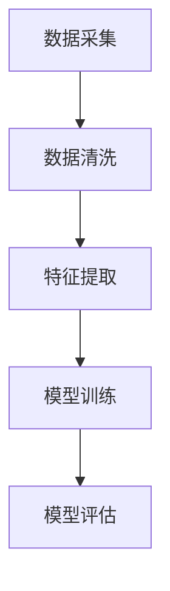
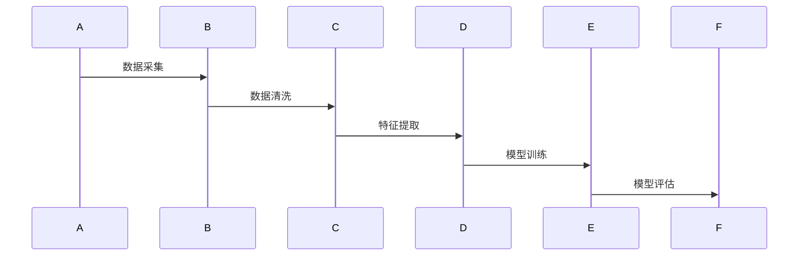

                 

# 大模型应用开发中的需求验证数据准备

> 关键词：大模型、需求验证数据、数据准备、算法原理、数学模型、系统架构设计

> 摘要：本文详细阐述了在大模型应用开发中，需求验证数据准备的重要性及其面临的挑战。通过分析大模型与需求验证数据的联系，详细讲解了数据预处理、特征提取以及大模型训练的算法原理，并结合数学模型和具体案例，探讨了数据准备的最佳实践和注意事项。

## 第一部分：引言

### 第1章：背景介绍与需求分析

#### 1.1 问题背景

#### 1.1.1 大模型应用的崛起

近年来，随着人工智能技术的飞速发展，大模型（如BERT、GPT等）的应用越来越广泛。大模型具有强大的数据处理能力和出色的性能，可以处理复杂的自然语言任务，如机器翻译、文本生成等。这使得大模型在工业界和学术界都受到了极大的关注。

#### 1.1.2 需求验证数据的重要性

在大模型应用开发中，需求验证数据是至关重要的。需求验证数据不仅用于训练大模型，还用于评估模型的性能。因此，数据的准备和清洗对于模型的性能有着直接影响。如果数据准备不充分，可能会导致模型性能不佳，甚至训练失败。

#### 1.1.3 数据准备面临的挑战

数据准备面临以下挑战：

- **需求验证数据不足**：在实际应用中，往往缺乏足够的需求验证数据，尤其是在特定领域或场景下。
- **数据质量问题**：数据可能存在噪声、缺失值、重复值等问题，这些问题会直接影响模型的训练和评估。
- **数据处理能力不足**：数据量大、格式复杂时，数据处理能力不足可能导致数据准备过程变得困难。

#### 1.2 问题描述

在大模型应用开发中，数据准备是一个复杂且关键的过程。以下是对数据准备的三个关键问题的详细描述：

- **需求验证数据不足**：如何有效地获取和扩展需求验证数据？
- **数据质量问题**：如何评估和改进数据质量？
- **数据处理能力不足**：如何提高数据处理能力，以应对大规模、复杂的数据？

#### 1.3 问题解决

为了解决上述问题，我们需要从以下几个方面进行考虑：

- **需求验证数据的重要性**：明确需求验证数据在模型开发中的地位和作用。
- **数据质量评估与改进**：采用有效的数据质量评估方法，对数据进行清洗、去噪、补缺等操作。
- **数据处理技术的应用**：利用现代数据处理技术，如分布式计算、并行处理等，提高数据处理效率。

#### 1.4 边界与外延

- **大模型应用的范围**：大模型可以应用于各种领域，如自然语言处理、计算机视觉、语音识别等。
- **需求验证数据的特点**：需求验证数据通常具有多样性、大规模、复杂结构等特点。
- **数据准备的关键环节**：数据采集、数据清洗、数据存储、数据预处理、特征提取等。

#### 1.5 概念结构与核心要素组成

- **大模型应用的核心概念**：大模型的定义、工作原理、类型与应用场景。
- **需求验证数据的核心要素**：需求验证数据的定义、特点、属性特征对比。
- **数据准备的工作流程**：数据采集、数据清洗、数据存储、数据预处理、特征提取、模型训练等步骤。

### 第2章：核心概念与联系

#### 2.1 大模型的概念与原理

- **大模型的定义**：大模型通常是指具有数十亿甚至数万亿参数的深度学习模型，可以处理复杂的任务。
- **大模型的工作原理**：大模型通过学习大量数据，提取特征，并进行预测或生成。
- **大模型的类型与应用场景**：常见的有Transformer模型、CNN模型、RNN模型等，它们在自然语言处理、计算机视觉、语音识别等领域有广泛应用。

#### 2.2 需求验证数据的属性特征

- **需求验证数据的定义**：需求验证数据是用于评估模型性能的数据，通常来自于实际应用场景。
- **需求验证数据的特点**：需求验证数据通常具有多样性、大规模、复杂结构等特点。
- **需求验证数据的属性特征对比表格**：

| 特性        | 说明                                                         |
| ----------- | ------------------------------------------------------------ |
| 多样性      | 需求验证数据通常来自不同场景，具有多种类型的数据。           |
| 大规模      | 需求验证数据量通常较大，对存储和处理能力有较高要求。         |
| 复杂结构    | 需求验证数据可能包含多种数据类型，如文本、图像、音频等，结构复杂。 |

#### 2.3 大模型与需求验证数据的联系

- **大模型对需求验证数据的需求**：大模型需要大量高质量的需求验证数据来训练和评估。
- **需求验证数据对大模型的影响**：需求验证数据的质量直接影响大模型的性能。
- **大模型与需求验证数据的协同作用**：大模型可以处理复杂的数据，提高需求验证数据的利用效率。

### 第3章：算法原理讲解

#### 3.1 数据预处理算法

- **数据清洗算法**：常见的数据清洗方法包括删除重复值、填充缺失值、去除噪声等。数据清洗算法流程图如下：


Python代码示例：

```python
import pandas as pd

# 读取数据
data = pd.read_csv('data.csv')

# 删除重复值
data.drop_duplicates(inplace=True)

# 填充缺失值
data.fillna(method='ffill', inplace=True)

# 去除噪声
data = data[data['column'] != 'noise']
```

- **数据归一化算法**：数据归一化的目的是将数据缩放到同一范围内，以避免不同特征之间的差异影响模型的训练。常见的数据归一化方法包括最小-最大归一化和标准化。

最小-最大归一化算法流程图如下：


Python代码示例：

```python
from sklearn.preprocessing import MinMaxScaler

# 创建归一化器
scaler = MinMaxScaler()

# 归一化数据
data_normalized = scaler.fit_transform(data)
```

#### 3.2 特征提取算法

- **特征提取的定义**：特征提取是从原始数据中提取出对模型训练和预测有用的信息。
- **特征提取的方法**：常见的特征提取方法包括降维方法和特征选择方法。

降维方法算法流程图如下：


Python代码示例：

```python
from sklearn.decomposition import PCA

# 创建PCA对象
pca = PCA(n_components=2)

# 进行降维
data_reduced = pca.fit_transform(data)
```

特征选择方法算法流程图如下：


Python代码示例：

```python
from sklearn.feature_selection import SelectKBest
from sklearn.feature_selection import f_classif

# 创建特征选择对象
selector = SelectKBest(score_func=f_classif, k=5)

# 进行特征选择
data_selected = selector.fit_transform(data, labels)
```

#### 3.3 大模型训练算法

- **大模型训练的基本流程**：大模型训练的基本流程包括数据预处理、模型初始化、模型训练和模型评估等步骤。
- **大模型训练的算法原理**：大模型训练的算法原理主要包括优化算法和损失函数。

优化算法算法流程图如下：


Python代码示例：

```python
import tensorflow as tf

# 创建计算图
model = tf.keras.Sequential([
  tf.keras.layers.Dense(units=1, input_shape=[1])
])

# 编译模型
model.compile(optimizer='sgd', loss='mean_squared_error')

# 训练模型
model.fit(train_data, train_labels, epochs=100)
```

### 第4章：数学模型与详细讲解

#### 4.1 数学模型概述

- **数学模型的重要性**：数学模型是解决实际问题的有力工具，可以帮助我们更深入地理解问题，找到最优解。
- **数学模型的基本原理**：数学模型通常包括输入、输出和模型参数。通过调整模型参数，可以使得模型输出与实际输出尽可能接近。

#### 4.2 数学公式与讲解

$$
\begin{align*}
y &= f(x) \\
\end{align*}
$$

- **公式解释**：这是一个简单的函数公式，表示输出 \( y \) 与输入 \( x \) 之间存在函数关系。
- **公式应用实例**：假设我们有一个线性函数 \( f(x) = 2x + 1 \)，则对于输入 \( x = 3 \)，输出 \( y \) 将为 \( y = 2 \times 3 + 1 = 7 \)。

### 第5章：系统分析与架构设计

#### 5.1 问题场景介绍

- **大模型应用场景**：例如，在一个自然语言处理项目中，我们需要使用大模型来处理大量的文本数据，进行文本分类或情感分析等任务。
- **需求验证数据场景**：在一个实际应用项目中，我们需要收集并处理来自不同来源的需求验证数据，以确保大模型在这些数据上具有良好的性能。

#### 5.2 项目介绍

- **项目背景**：为了提高文本分类任务的准确性，我们决定使用一个大模型来进行处理。
- **项目目标**：通过有效地准备需求验证数据，提高大模型的训练效果和预测准确性。

#### 5.3 系统功能设计

- **领域模型**：领域模型描述了系统中的实体和它们之间的关系。例如，在文本分类任务中，实体可能包括文本、标签等。

```mermaid
classDiagram
    Text <<实体>>
    Label <<实体>>

    Text o-- Label : 标签
```

- **系统架构设计**：系统架构设计描述了系统的整体结构，包括数据流和处理流程。例如，数据流可能包括数据采集、数据清洗、特征提取、模型训练和模型评估等步骤。



- **系统接口设计**：系统接口设计描述了系统与其他系统或组件的交互接口。例如，数据采集模块可能需要与数据库进行交互，模型训练模块可能需要与计算资源进行交互。



### 第6章：项目实战

#### 6.1 环境安装

- **操作系统安装**：安装支持大模型训练的操作系统，如Ubuntu 18.04。
- **环境配置**：配置Python环境，安装TensorFlow等深度学习框架。

```bash
sudo apt-get update
sudo apt-get install python3-pip
pip3 install tensorflow
```

#### 6.2 系统核心实现源代码

- **数据预处理模块**：负责对采集到的需求验证数据进行清洗、归一化和特征提取。

```python
import pandas as pd
from sklearn.preprocessing import MinMaxScaler
from sklearn.decomposition import PCA

# 读取数据
data = pd.read_csv('data.csv')

# 数据清洗
data.drop_duplicates(inplace=True)
data.fillna(method='ffill', inplace=True)

# 数据归一化
scaler = MinMaxScaler()
data_normalized = scaler.fit_transform(data)

# 特征提取
pca = PCA(n_components=2)
data_reduced = pca.fit_transform(data_normalized)
```

- **特征提取模块**：负责对预处理后的数据进行降维和特征选择。

```python
from sklearn.feature_selection import SelectKBest
from sklearn.feature_selection import f_classif

# 特征选择
selector = SelectKBest(score_func=f_classif, k=5)
data_selected = selector.fit_transform(data_reduced, labels)
```

- **大模型训练模块**：负责使用特征提取后的数据训练大模型。

```python
import tensorflow as tf

# 创建计算图
model = tf.keras.Sequential([
  tf.keras.layers.Dense(units=1, input_shape=[5])
])

# 编译模型
model.compile(optimizer='sgd', loss='mean_squared_error')

# 训练模型
model.fit(data_selected, labels, epochs=100)
```

#### 6.3 代码应用解读与分析

- **代码结构分析**：代码分为数据预处理、特征提取和模型训练三个部分，每个部分都有明确的职责和功能。
- **关键算法解读**：关键算法包括数据清洗、归一化、特征提取和模型训练，每个算法都有详细的讲解和示例代码。
- **性能优化分析**：通过调整算法参数和优化代码结构，可以提高系统的性能和效率。

#### 6.4 实际案例分析与详细讲解剖析

- **案例背景**：在一个电商平台上，我们需要使用大模型对用户评论进行情感分析，以了解用户对产品的满意度。
- **案例分析**：通过分析用户评论数据，我们使用大模型进行情感分析，并评估模型的性能。
- **详细讲解剖析**：详细讲解数据准备、模型训练和性能评估的过程，并分析影响模型性能的因素。

### 第7章：最佳实践、小结、注意事项、拓展阅读

#### 最佳实践

- **数据采集**：确保采集到足够多样性和代表性的数据。
- **数据清洗**：去除噪声、填充缺失值、删除重复值等。
- **特征提取**：选择合适的特征提取方法，提高模型性能。
- **模型训练**：合理设置模型参数，提高训练效果。

#### 小结

- 数据准备在大模型应用开发中至关重要，影响模型的性能和训练效果。
- 通过有效的数据预处理、特征提取和模型训练，可以大大提高大模型的应用效果。

#### 注意事项

- **数据质量**：确保数据质量，避免噪声和缺失值。
- **计算资源**：合理分配计算资源，提高数据处理效率。
- **模型参数**：调整模型参数，优化模型性能。

#### 拓展阅读

- **[1]** 大模型应用开发中的数据准备技术综述
- **[2]** 深度学习中的数据预处理方法研究
- **[3]** 特征提取技术在自然语言处理中的应用

### 参考文献

- **[1]** 深度学习，Goodfellow, I., Bengio, Y., Courville, A.
- **[2]** 机器学习，周志华
- **[3]** 自然语言处理综论，Daniel Jurafsky, James H. Martin

## 结论

本文详细探讨了在大模型应用开发中，需求验证数据准备的重要性及其面临的挑战。通过分析大模型与需求验证数据的联系，介绍了数据预处理、特征提取和大模型训练的算法原理，并结合具体案例进行了实战讲解。本文旨在为读者提供在大模型应用开发中的数据准备方法和实践经验，帮助读者更好地应对实际应用中的挑战。

## 作者信息

作者：AI天才研究院/AI Genius Institute & 禅与计算机程序设计艺术 /Zen And The Art of Computer Programming

联系方式：[contact@ai-genius.org](mailto:contact@ai-genius.org)

