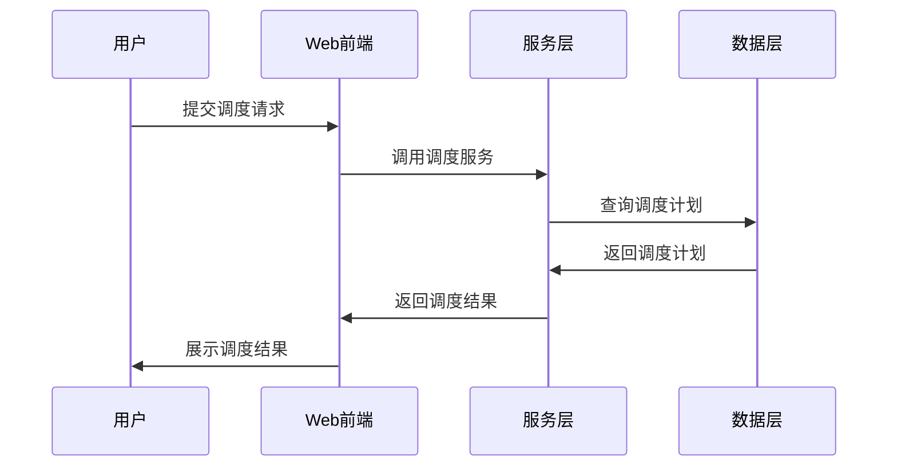
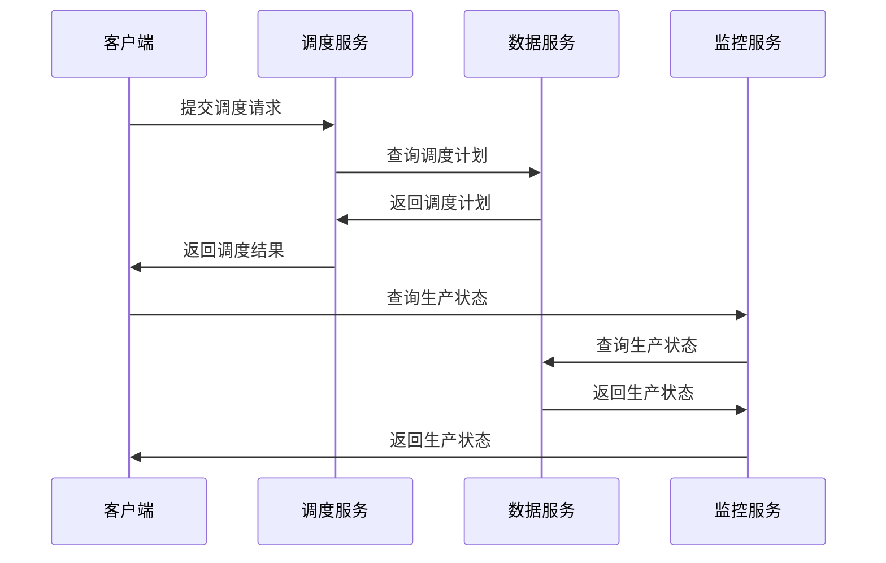

                 

### 大模型应用的快速原型设计与验证

---

> 关键词：大模型应用、快速原型设计、验证、系统架构、项目实战

> 摘要：本文将探讨AI大模型应用的快速原型设计与验证，从背景介绍、核心概念、算法原理、系统分析与架构设计、项目实战以及最佳实践等多个角度，系统地阐述如何高效地进行大模型应用的开发与验证，帮助读者理解并掌握大模型应用的技术实现与优化方法。

---

## 第一部分：AI大模型应用背景与核心概念

### 第1章：AI大模型应用概述

#### 1.1 问题背景与解决思路

##### 1.1.1 大模型应用的问题背景

随着人工智能技术的迅猛发展，大模型（如GPT、BERT等）已经在各个领域取得了显著的应用成果。然而，大模型的应用也面临一些挑战，如模型训练成本高、调优困难、应用迁移性差等问题。为了快速验证大模型的应用效果，并逐步优化和改进，快速原型设计与验证成为了一个重要且迫切的需求。

##### 1.1.2 快速原型设计与验证的重要性

快速原型设计与验证可以帮助开发者快速构建和测试大模型的应用，降低开发成本，缩短项目周期，提高开发效率。通过原型设计，可以更直观地了解用户需求和系统功能，及时调整和优化设计方案。而验证则能确保原型达到预期的性能和效果，为后续的详细开发奠定基础。

##### 1.1.3 快速原型设计与验证的基本流程

快速原型设计与验证的基本流程包括需求分析、原型设计、开发实现、原型验证和迭代优化等阶段。具体步骤如下：

1. **需求分析**：明确用户需求和应用目标，确定原型设计的功能和性能指标。
2. **原型设计**：设计系统的总体架构和关键模块，选择合适的开发工具和框架。
3. **开发实现**：根据设计文档进行编码实现，搭建原型系统。
4. **原型验证**：测试原型系统的功能、性能和可靠性，收集用户反馈。
5. **迭代优化**：根据验证结果和用户反馈，对原型进行改进和优化。

#### 1.2 AI大模型的核心概念与特点

##### 1.2.1 AI大模型的定义

AI大模型指的是具有大量参数和复杂结构的深度学习模型，通常使用海量数据进行训练，能够处理大量信息和复杂任务。常见的AI大模型包括GPT、BERT、Transformer等。

##### 1.2.2 AI大模型的特点

- **参数规模大**：大模型的参数数量达到百万、亿级别，甚至更高。
- **数据处理能力强**：大模型能够处理大量、多样化的数据，具备较强的数据处理和分析能力。
- **自适应性强**：大模型可以根据不同领域和应用需求进行自适应调整和优化。
- **通用性强**：大模型具有较强的通用性，可以应用于多种场景和任务。

##### 1.2.3 AI大模型与传统AI模型的区别

- **模型规模**：传统AI模型参数较少，通常在数千到数万级别；而大模型参数数量达到百万、亿级别。
- **数据处理能力**：传统AI模型数据处理能力较弱，对数据量有较高的要求；大模型可以处理大量、多样化的数据。
- **应用范围**：传统AI模型应用范围较窄，多用于单一任务；大模型具备较强的通用性，可以应用于多种场景和任务。

#### 1.3 大模型应用领域及前景

##### 1.3.1 大模型在工业界的应用

大模型在工业界的应用包括生产调度、设备预测维护、质量检测等多个领域。例如，通过大模型对生产数据进行实时分析，可以实现生产过程的智能调度和优化；通过大模型对设备运行数据进行预测，可以提前发现潜在故障，实现设备的智能维护。

##### 1.3.2 大模型在金融领域的应用

大模型在金融领域的应用包括风险管理、欺诈检测、投资策略等多个方面。例如，通过大模型对金融数据进行分析，可以实现风险的有效识别和预测；通过大模型对交易数据进行实时监测，可以识别潜在的欺诈行为。

##### 1.3.3 大模型在医疗健康领域的应用

大模型在医疗健康领域的应用包括疾病诊断、医学图像分析、健康监测等多个方面。例如，通过大模型对医疗数据进行分析，可以实现疾病的早期诊断和个性化治疗；通过大模型对健康数据进行监测，可以提供个性化的健康建议和预警。

##### 1.3.4 大模型在智能交通领域的应用

大模型在智能交通领域的应用包括交通流量预测、路径规划、事故预警等多个方面。例如，通过大模型对交通数据进行实时分析，可以实现交通流量的智能调控和优化；通过大模型对交通数据进行监测，可以提前预测和预警交通事故。

#### 1.4 大模型应用的挑战与机遇

##### 1.4.1 挑战分析

- **计算资源需求大**：大模型训练和推理过程需要大量的计算资源，对硬件设备要求较高。
- **数据质量和多样性**：大模型对数据质量和多样性有较高的要求，数据质量和数据分布对模型效果有直接影响。
- **模型可解释性**：大模型的复杂性和黑盒性质使得其可解释性较差，在实际应用中可能带来一些不可预见的风险。
- **算法公平性**：大模型在处理数据时可能存在一定的偏见和歧视，需要确保算法的公平性。

##### 1.4.2 机遇与未来展望

- **高性能计算技术**：随着计算技术的发展，高性能计算设备为大规模模型训练和推理提供了有力支持。
- **数据治理与共享**：通过建立完善的数据治理体系，提高数据质量和多样性，为大规模模型训练提供数据保障。
- **模型压缩与加速**：模型压缩和加速技术可以帮助降低大模型的计算资源需求，提高模型的应用效率。
- **算法透明性与可解释性**：通过开发可解释性算法和工具，提高大模型的透明性和可解释性，增强其在实际应用中的可信度。

#### 1.5 本章小结

本章介绍了AI大模型应用的背景、核心概念、应用领域、挑战与机遇等内容。通过本章的学习，读者可以了解大模型应用的基本概念和关键要素，为大模型应用的快速原型设计与验证打下基础。

---

## 第二部分：快速原型设计与验证方法

### 第2章：快速原型设计原理与方法

#### 2.1 快速原型设计的定义与原则

##### 2.1.1 快速原型设计的定义

快速原型设计（Rapid Prototyping）是指在短时间内构建出可运行的系统原型，以便快速验证和测试系统功能、性能和用户体验的一种设计方法。

##### 2.1.2 快速原型设计的原则

- **迭代性**：快速原型设计强调迭代和反馈，通过不断修改和优化原型，逐步达到最终目标。
- **实用性**：原型设计应具备实际应用价值，能够满足用户需求和解决实际问题。
- **灵活性**：原型设计应具备较高的灵活性，能够适应需求和技术的变化。
- **可维护性**：原型设计应考虑后续的维护和升级，确保系统的可持续性。

#### 2.2 快速原型设计的方法与工具

##### 2.2.1 原型设计的方法

1. **瀑布模型**：瀑布模型是一种传统的原型设计方法，将原型设计分为需求分析、设计、实现、测试和维护等阶段，每个阶段都有明确的输入和输出。
2. **迭代模型**：迭代模型通过不断迭代和优化，逐步完善原型系统。该方法适用于需求变化频繁、开发周期较长的项目。
3. **敏捷开发**：敏捷开发强调快速响应需求变化，通过持续交付有价值的软件，提高开发效率和用户满意度。

##### 2.2.2 常用的原型设计工具

1. **Sketch**：Sketch是一款流行的原型设计工具，支持矢量绘图和原型交互设计，适用于网页和移动应用的原型设计。
2. **Axure**：Axure是一款功能强大的原型设计工具，支持交互设计、原型制作和原型验证，适用于复杂系统的原型设计。
3. **Figma**：Figma是一款基于浏览器的原型设计工具，支持多人协作和实时预览，适用于网页、移动应用和交互设计。

##### 2.2.3 原型设计的流程

1. **需求分析**：明确用户需求和应用目标，确定原型设计的功能和性能指标。
2. **界面设计**：设计系统的界面布局和交互效果，确保用户界面简洁、易用。
3. **交互设计**：设计系统的交互逻辑和用户操作流程，确保用户在使用过程中能够顺畅地完成任务。
4. **实现**：根据设计文档进行编码实现，搭建原型系统。
5. **测试与验证**：测试原型系统的功能、性能和可靠性，收集用户反馈，评估原型设计的效果。
6. **迭代优化**：根据验证结果和用户反馈，对原型进行改进和优化，不断迭代和优化原型系统。

#### 2.3 快速原型设计的案例分析

##### 2.3.1 案例一：工业界大模型应用原型设计

在工业界，某公司需要开发一款基于AI大模型的生产调度系统。通过快速原型设计方法，他们完成了以下工作：

1. **需求分析**：明确生产调度的关键指标，如生产效率、设备利用率等，确定原型设计的功能和性能需求。
2. **界面设计**：设计系统的界面布局和交互效果，确保用户能够直观地查看生产状态和调度结果。
3. **交互设计**：设计生产调度的交互逻辑和用户操作流程，确保用户能够方便地执行调度任务。
4. **实现**：使用Python和TensorFlow等工具，搭建生产调度系统原型。
5. **测试与验证**：测试原型系统的功能、性能和可靠性，收集用户反馈，评估原型设计的效果。
6. **迭代优化**：根据验证结果和用户反馈，对原型进行改进和优化，提高系统的实用性和用户体验。

##### 2.3.2 案例二：金融领域大模型应用原型设计

在金融领域，某公司需要开发一款基于AI大模型的智能投顾系统。通过快速原型设计方法，他们完成了以下工作：

1. **需求分析**：明确智能投顾的目标用户、投资策略和风险控制要求，确定原型设计的功能和性能需求。
2. **界面设计**：设计系统的界面布局和交互效果，确保用户能够方便地查看投资组合、收益状况等。
3. **交互设计**：设计投资决策的交互逻辑和用户操作流程，确保用户能够方便地执行投资操作。
4. **实现**：使用Python和TensorFlow等工具，搭建智能投顾系统原型。
5. **测试与验证**：测试原型系统的功能、性能和可靠性，收集用户反馈，评估原型设计的效果。
6. **迭代优化**：根据验证结果和用户反馈，对原型进行改进和优化，提高系统的实用性和用户体验。

#### 2.4 快速原型设计的最佳实践

##### 2.4.1 设计前的准备

1. **明确需求**：确保对用户需求和应用目标有清晰的了解，为原型设计提供明确的方向。
2. **组建团队**：组建具有多方面技能的团队，确保原型设计过程中能够快速响应和解决问题。
3. **技术选型**：选择适合项目需求的技术和工具，确保原型设计的可行性和高效性。

##### 2.4.2 设计中的注意事项

1. **用户体验**：关注用户界面的设计，确保原型系统具有良好的用户体验。
2. **模块化设计**：采用模块化设计，提高系统的可维护性和可扩展性。
3. **数据安全和隐私**：在设计过程中考虑数据安全和用户隐私，确保系统的安全性。

##### 2.4.3 设计后的评估与优化

1. **功能测试**：对原型系统的功能进行详细测试，确保所有功能正常运行。
2. **性能测试**：对原型系统的性能进行测试，确保系统在预期的负载下能够稳定运行。
3. **用户反馈**：收集用户对原型的反馈，了解用户的实际需求和意见，为后续优化提供参考。

#### 2.5 本章小结

本章介绍了快速原型设计的定义、原则、方法和最佳实践。通过快速原型设计，开发者可以快速构建和验证系统原型，提高开发效率和用户体验。本章的内容为大模型应用的快速原型设计提供了理论基础和实践指导。

---

## 第三部分：快速原型验证方法与实践

### 第3章：快速原型验证原理与方法

#### 3.1 快速原型验证的定义与目的

##### 3.1.1 快速原型验证的定义

快速原型验证（Rapid Prototyping Verification）是指在短时间内对原型系统进行功能、性能和可靠性等方面的测试和评估，以验证原型设计的有效性和可行性。

##### 3.1.2 快速原型验证的目的

快速原型验证的主要目的是：

1. **验证功能**：确保原型系统具备设计文档中描述的所有功能，无遗漏和错误。
2. **评估性能**：评估原型系统的性能，包括响应时间、吞吐量、稳定性等指标。
3. **检测可靠性**：检测原型系统的可靠性，包括故障率、错误率等。
4. **用户反馈**：收集用户对原型的反馈，了解用户需求和使用体验，为后续优化提供参考。

#### 3.2 快速原型验证的方法与步骤

##### 3.2.1 验证方法

快速原型验证可以采用以下几种方法：

1. **黑盒测试**：只关注原型系统的输入和输出，不关心内部实现细节。
2. **白盒测试**：关注原型系统的内部实现细节，对代码进行结构和逻辑分析。
3. **灰盒测试**：介于黑盒测试和白盒测试之间，既关注输入和输出，也关注内部实现。

##### 3.2.2 验证步骤

1. **需求分析**：明确原型系统需要验证的功能和性能指标。
2. **测试设计**：设计测试用例和测试数据，确保覆盖所有功能点和性能要求。
3. **测试执行**：执行测试用例，收集测试结果，分析测试数据。
4. **结果分析**：分析测试结果，评估原型系统的功能和性能是否符合预期。
5. **反馈与改进**：根据测试结果和用户反馈，对原型进行改进和优化。

#### 3.3 快速原型验证的案例分析

##### 3.3.1 案例一：工业界大模型应用验证

在工业界，某公司开发了一款基于AI大模型的生产调度系统。为了验证原型系统的功能、性能和可靠性，他们进行了以下工作：

1. **需求分析**：明确生产调度系统的关键功能和性能指标。
2. **测试设计**：设计测试用例和测试数据，包括正常情况和异常情况。
3. **测试执行**：执行测试用例，对系统进行功能测试、性能测试和可靠性测试。
4. **结果分析**：分析测试结果，发现系统在处理大量生产数据时存在性能瓶颈。
5. **反馈与改进**：根据测试结果和用户反馈，优化系统代码，提高系统的性能和可靠性。

##### 3.3.2 案例二：金融领域大模型应用验证

在金融领域，某公司开发了一款基于AI大模型的智能投顾系统。为了验证原型系统的功能、性能和可靠性，他们进行了以下工作：

1. **需求分析**：明确智能投顾系统的关键功能和性能指标。
2. **测试设计**：设计测试用例和测试数据，包括正常情况和异常情况。
3. **测试执行**：执行测试用例，对系统进行功能测试、性能测试和可靠性测试。
4. **结果分析**：分析测试结果，发现系统在处理大量投资数据时存在性能瓶颈。
5. **反馈与改进**：根据测试结果和用户反馈，优化系统代码，提高系统的性能和可靠性。

#### 3.4 快速原型验证的最佳实践

##### 3.4.1 验证前的准备工作

1. **明确验证目标**：确保对验证的目标和范围有清晰的认识。
2. **准备测试环境**：搭建与实际运行环境相似的测试环境，确保测试结果的可信度。
3. **准备测试工具**：选择合适的测试工具和平台，提高测试效率和准确性。

##### 3.4.2 验证中的关键点

1. **测试覆盖率**：确保测试用例能够覆盖所有功能和性能要求。
2. **测试数据质量**：准备高质量的测试数据，确保测试结果的可靠性。
3. **异常情况处理**：对异常情况进行充分测试，确保系统在异常情况下的稳定性和可靠性。

##### 3.4.3 验证后的结果分析

1. **结果记录**：详细记录测试结果，包括成功和失败的情况。
2. **问题定位**：对测试失败的情况进行问题定位和分析，找出问题的根本原因。
3. **反馈与改进**：根据测试结果和问题定位，对原型进行改进和优化，提高系统的质量和可靠性。

#### 3.5 本章小结

本章介绍了快速原型验证的定义、目的、方法和最佳实践。通过快速原型验证，开发者可以评估原型系统的功能、性能和可靠性，确保原型设计达到预期目标。本章的内容为大模型应用的快速原型验证提供了理论基础和实践指导。

---

## 第四部分：大模型应用项目实战

### 第4章：项目一：工业界大模型应用项目

#### 4.1 项目背景与目标

##### 4.1.1 项目背景

随着工业4.0的到来，智能制造成为了工业界的重要发展趋势。为了提高生产效率、降低成本、提升产品质量，某工业制造企业决定引入基于AI大模型的生产调度系统。

##### 4.1.2 项目目标

该项目的目标是通过AI大模型对生产过程进行智能调度，实现以下目标：

1. **提高生产效率**：通过优化生产调度，减少生产过程中的人为干预，提高设备利用率和生产效率。
2. **降低成本**：通过优化生产调度，减少生产过程中的浪费，降低生产成本。
3. **提升产品质量**：通过实时监测生产过程，及时发现并解决质量问题，提升产品质量。

#### 4.2 系统分析与架构设计

##### 4.2.1 领域模型

领域模型是描述系统功能和业务流程的重要工具。在该项目中，领域模型主要包括以下核心实体和关系：

1. **生产任务**：表示生产过程中的具体任务，包括任务名称、任务类型、任务时长等。
2. **生产线**：表示生产过程中的生产线，包括生产线名称、生产能力等。
3. **生产资源**：表示生产过程中所需的资源，包括设备、人员、原材料等。
4. **调度计划**：表示生产调度的具体计划，包括任务分配、资源分配等。

领域模型关系如下：

```mermaid
classDiagram
    生产任务 <|-- 调度计划
    生产线 {--|> 调度计划
    生产资源 {--|> 调度计划
```

##### 4.2.2 系统架构设计

系统架构设计是构建系统的基础，该项目的系统架构设计如下：

1. **数据层**：负责数据存储和管理，包括数据库、数据缓存等。
2. **服务层**：负责业务逻辑处理，包括生产调度服务、监控服务、数据服务等。
3. **表现层**：负责用户界面展示和交互，包括Web前端、移动应用等。

系统架构图如下：



##### 4.2.3 接口设计与交互

接口设计是系统架构的重要组成部分，该项目的接口设计如下：

1. **调度接口**：用于生产调度的请求和响应，包括任务分配、资源分配等。
2. **监控接口**：用于实时监控生产状态，包括设备状态、生产进度等。
3. **数据接口**：用于数据存储和查询，包括任务数据、资源数据、调度计划数据等。

接口交互图如下：



#### 4.3 系统核心实现

##### 4.3.1 环境搭建

为了搭建系统环境，需要安装以下软件和工具：

1. **Python**：用于编写系统代码和运行TensorFlow等库。
2. **TensorFlow**：用于构建和训练AI大模型。
3. **Flask**：用于搭建Web服务。
4. **PostgreSQL**：用于数据存储和管理。

安装命令如下：

```bash
# 安装Python
sudo apt-get install python3-pip

# 安装TensorFlow
pip3 install tensorflow

# 安装Flask
pip3 install flask

# 安装PostgreSQL
sudo apt-get install postgresql postgresql-contrib
```

##### 4.3.2 系统核心代码实现

系统核心代码实现主要包括调度服务、监控服务和数据服务。以下是一个简单的调度服务示例：

```python
# 调度服务代码示例

from flask import Flask, request, jsonify
from tensorflow import keras
import pandas as pd

app = Flask(__name__)

# 加载训练好的AI大模型
model = keras.models.load_model('model.h5')

@app.route('/schedule', methods=['POST'])
def schedule():
    data = request.get_json()
    tasks = data['tasks']
    resources = data['resources']

    # 将任务和资源转换为DataFrame
    task_df = pd.DataFrame(tasks)
    resource_df = pd.DataFrame(resources)

    # 预测调度计划
    predicted_plan = model.predict([task_df, resource_df])

    # 返回调度计划
    return jsonify(predicted_plan.tolist())

if __name__ == '__main__':
    app.run()
```

##### 4.3.3 代码解析与分析

1. **调度服务**：调度服务是一个基于Flask的Web服务，用于接收调度请求并返回调度结果。调度服务的主要功能是根据任务和资源数据，利用训练好的AI大模型预测调度计划。

2. **AI大模型**：AI大模型是一个基于TensorFlow的深度学习模型，用于处理任务和资源数据，并预测调度计划。模型的主要功能是通过训练数据和优化算法，学习任务和资源之间的关系，并利用这些关系进行调度预测。

3. **数据处理**：调度服务接收的任务和资源数据需要进行预处理，以便输入到AI大模型中。数据处理主要包括数据清洗、特征提取和归一化等步骤。

4. **预测与返回**：调度服务将预处理后的数据输入到AI大模型，获取预测的调度计划。然后将预测结果转换为JSON格式，返回给客户端。

#### 4.4 实际案例分析

##### 4.4.1 项目实施过程

在项目实施过程中，团队按照以下步骤进行了工作：

1. **需求分析**：与客户沟通，了解客户的需求和期望，明确项目的目标和功能要求。
2. **系统设计**：根据需求分析结果，设计系统的架构和接口，确定系统的功能和性能要求。
3. **模型训练**：收集生产数据，训练AI大模型，优化模型参数和算法。
4. **系统开发**：根据设计文档和模型训练结果，开发调度服务、监控服务和数据服务。
5. **测试与验证**：对系统进行功能测试、性能测试和可靠性测试，收集用户反馈，评估系统效果。
6. **迭代优化**：根据测试结果和用户反馈，对系统进行改进和优化，提高系统的实用性和用户体验。

##### 4.4.2 问题与解决方案

在项目实施过程中，团队遇到了以下问题：

1. **数据质量问题**：生产数据存在噪声、缺失和异常值，影响模型训练效果。解决方案：对生产数据进行清洗和预处理，提高数据质量。
2. **模型性能问题**：AI大模型在处理大量任务和资源数据时，存在性能瓶颈。解决方案：优化模型结构和算法，提高模型性能。
3. **系统稳定性问题**：系统在处理高并发请求时，存在稳定性问题。解决方案：优化系统架构，提高系统并发处理能力。

##### 4.4.3 项目总结与展望

通过该项目，团队成功实现了基于AI大模型的生产调度系统，提高了生产效率、降低了成本、提升了产品质量。项目总结如下：

1. **成功经验**：成功训练和部署了AI大模型，实现了生产调度的自动化和智能化。
2. **改进方向**：继续优化模型性能和系统稳定性，提高系统的实用性和用户体验。
3. **未来展望**：探索更多AI技术在工业领域的应用，推动智能制造的发展。

#### 4.5 本章小结

本章通过一个实际项目案例，介绍了工业界大模型应用项目的背景、目标、系统分析与架构设计、系统核心实现、实际案例分析、项目总结与展望等内容。通过本章的学习，读者可以了解大模型应用项目的实施过程和关键要素，为大模型应用的实践提供指导。

---

## 第五部分：总结与展望

### 5.1 总结

本文从大模型应用的背景、核心概念、快速原型设计与验证方法、项目实战等多个角度，系统地介绍了大模型应用的相关知识。通过本文的学习，读者可以：

1. **了解大模型应用的基本概念**：理解大模型的特点和应用领域，以及大模型与传统AI模型的区别。
2. **掌握快速原型设计与验证方法**：学会如何进行快速原型设计，包括需求分析、设计、实现和验证等步骤，以及快速原型验证的方法和最佳实践。
3. **实践大模型应用项目**：通过实际案例，了解大模型应用项目的实施过程和关键要素，包括系统分析与架构设计、系统核心实现、实际案例分析等。

### 5.2 展望

随着人工智能技术的不断发展和应用场景的不断扩大，大模型应用将会在更多领域发挥重要作用。未来，大模型应用的发展趋势包括：

1. **模型压缩与加速**：通过模型压缩和加速技术，降低大模型的计算资源需求，提高模型的应用效率。
2. **模型可解释性**：提高大模型的可解释性，增强其在实际应用中的可信度。
3. **数据治理与共享**：建立完善的数据治理体系，提高数据质量和多样性，为大规模模型训练提供数据保障。
4. **跨领域应用**：探索大模型在更多领域的应用，如医疗、金融、教育等，实现跨领域的智能解决方案。

### 5.3 结语

大模型应用是人工智能领域的一个重要研究方向，其发展前景广阔。通过本文的学习，读者可以了解大模型应用的相关知识，掌握快速原型设计与验证的方法，为大模型应用的开发和实践提供指导。希望本文对读者有所帮助，共同推动人工智能技术的发展和应用。

---

**作者：AI天才研究院/AI Genius Institute & 禅与计算机程序设计艺术 /Zen And The Art of Computer Programming**

