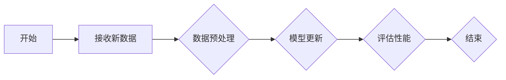
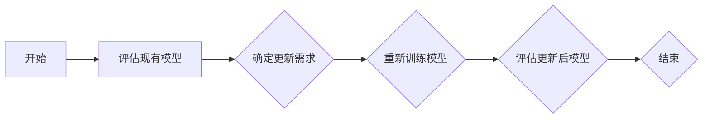
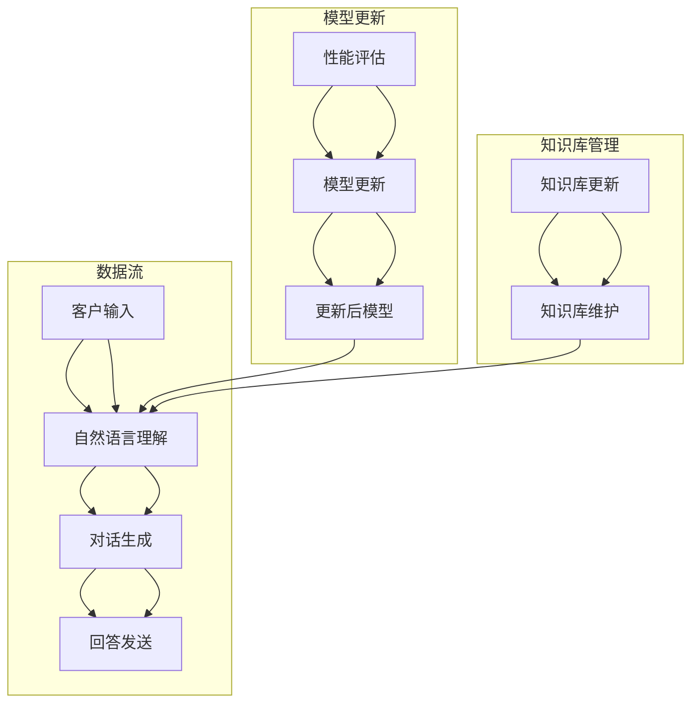
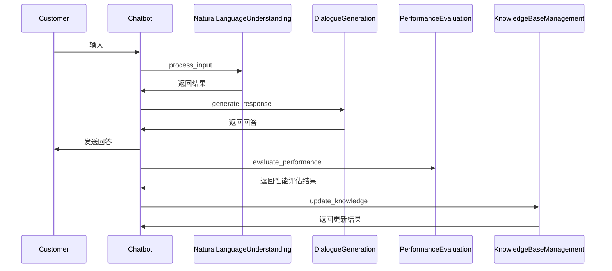

                 

### 大模型推理能力的持续学习与更新

在当今人工智能领域，大模型的推理能力日益成为焦点。从GPT-3到BERT，这些大模型在处理复杂任务时展现出了前所未有的强大性能。然而，大模型推理能力的提升不仅仅依赖于初始训练，更需要通过持续学习与更新来保持其有效性和适应性。本文将深入探讨大模型推理能力的持续学习与更新，分析其背景、核心概念、算法原理、系统设计、项目实战以及最佳实践。

## 关键词

- **大模型推理能力**
- **持续学习**
- **模型更新**
- **算法原理**
- **系统架构**
- **项目实战**
- **最佳实践**

## 摘要

本文首先介绍了大模型推理能力面临的挑战以及持续学习与更新的必要性。随后，详细讲解了大模型推理能力的基本原理，包括持续学习和模型更新的概念。通过对比表格和ER实体关系图，我们进一步理解了这些核心概念之间的联系。接着，本文深入阐述了持续学习和模型更新的算法原理，通过Mermaid流程图和Python源代码，为读者提供了一个清晰的实施路径。文章还分析了系统架构和接口设计，并通过一个实际项目展示了这些算法在实际应用中的效果。最后，本文总结了最佳实践技巧，并提出了未来研究的方向。

## 第一部分: 大模型推理能力的持续学习与更新

### 第1章: 问题背景与问题描述

#### 1.1.1 大模型推理能力的挑战

随着深度学习技术的不断发展，大模型在处理复杂任务方面表现出了强大的能力。例如，GPT-3在自然语言处理任务上已经超越了人类的水平，BERT则在各种文本分类任务中取得了显著的成果。然而，大模型推理能力的提升并非一蹴而就，它面临着多个挑战。

首先，大模型训练成本高。训练一个大规模模型需要大量的计算资源和时间，尤其是在处理高维数据时，计算量呈指数级增长。其次，模型的可解释性差。大模型通常是由数十亿甚至数万亿的参数组成，这些参数的内在机制往往不为人所知，导致模型决策过程缺乏透明性。此外，大模型的泛化能力有限。尽管在特定任务上表现出色，但大模型在面对未知或略微变化的任务时，可能无法保持良好的性能。

#### 1.1.2 持续学习的必要性

为了克服上述挑战，持续学习与更新变得至关重要。持续学习是指模型在部署后，通过不断接收新的数据来优化其性能。这样不仅可以减少对新数据的训练需求，还能提高模型在未知环境中的适应性。具体来说，持续学习具有以下几个优点：

1. **降低训练成本**：通过持续学习，模型可以在不断接收新数据的过程中不断优化，从而减少对新数据的大规模训练需求，降低计算成本。
2. **提高模型可解释性**：持续学习过程中，模型可以根据新数据不断调整参数，从而更好地理解其决策过程，提高可解释性。
3. **增强泛化能力**：通过持续学习，模型可以不断适应新的环境和任务，从而提高泛化能力。

#### 1.1.3 更新的驱动因素

大模型推理能力的更新主要受到以下驱动因素的影响：

1. **数据驱动**：随着数据的不断积累，模型需要通过更新来适应新的数据分布。例如，随着社交媒体平台的快速发展，文本数据的多样性和复杂性不断增加，模型需要通过更新来适应这些变化。
2. **技术驱动**：深度学习技术的发展，如自动机器学习（AutoML）、迁移学习（Transfer Learning）等，为模型更新提供了新的手段和思路。
3. **应用需求**：随着人工智能应用场景的不断扩展，模型需要不断更新以应对新的应用需求。例如，在自动驾驶领域，模型需要不断更新以适应不同的路况和环境。

### 第2章: 核心概念与联系

#### 2.1 大模型推理能力的基本原理

大模型推理能力是指模型在处理复杂任务时的能力。它主要依赖于以下几个核心原理：

1. **深度神经网络**：深度神经网络是构建大模型的基础。通过多层神经网络，模型可以学习到复杂的特征和模式。
2. **大规模参数**：大模型通常拥有数十亿甚至数万亿的参数。这些参数可以捕捉到数据的复杂性和多样性。
3. **端到端学习**：端到端学习是指模型从原始数据直接学习到最终输出，中间不需要人工干预。这使得模型可以更好地处理复杂任务。

#### 2.2 持续学习与模型更新

持续学习和模型更新是两个密切相关但又有区别的概念。持续学习是指模型在部署后，通过不断接收新数据来优化其性能。而模型更新是指对已有模型进行重新训练，以适应新的数据分布或应用需求。

1. **持续学习的优点**：
   - 降低训练成本
   - 提高模型可解释性
   - 增强泛化能力

2. **模型更新的优点**：
   - 适应新的数据分布
   - 提高模型性能
   - 满足新的应用需求

#### 2.3 概念属性特征对比表格

下面是一个简单的概念属性特征对比表格，用于对比持续学习和模型更新的属性特征：

| 概念     | 持续学习                     | 模型更新                    |
|----------|----------------------------|-----------------------------|
| 目的     | 优化模型性能                 | 适应新的数据分布和应用需求   |
| 过程     | 模型在部署后不断接收新数据   | 对已有模型进行重新训练       |
| 成本     | 降低训练成本                 | 较高的计算成本               |
| 性能提升 | 提高模型可解释性和泛化能力   | 提高模型性能                 |

#### 2.4 ER实体关系图架构

为了更好地理解持续学习和模型更新在大模型推理能力中的作用，我们可以使用ER实体关系图来展示它们之间的关系。

```mermaid
erDiagram
  Model ||--|{ Data }|-->> Update
  Model ||--|{ Application }|-->> Deployment
  Data ||--|{ Source }|-->> Model
  Application ||--|{ Requirement }|-->> Model
```

在这个ER实体关系图中，`Model` 表示大模型，`Data` 表示数据，`Update` 表示模型更新，`Deployment` 表示模型部署，`Source` 表示数据源，`Application` 表示应用需求。

### 第3章: 算法原理讲解

#### 3.1 算法Mermaid流程图

为了更好地理解持续学习和模型更新的算法原理，我们可以使用Mermaid流程图来展示它们的基本流程。

##### 3.1.1 持续学习算法流程



在这个持续学习算法流程中，模型首先接收新数据，然后进行数据预处理，接着对模型进行更新，最后评估性能。

##### 3.1.2 模型更新算法流程



在这个模型更新算法流程中，首先评估现有模型的性能，然后确定是否需要更新，如果需要更新，则对模型进行重新训练，最后评估更新后模型的性能。

#### 3.2 Python源代码

为了使读者更好地理解算法的实现，下面给出持续学习和模型更新的Python源代码。

##### 3.2.1 持续学习算法实现

```python
import torch
import torch.optim as optim
from torch.utils.data import DataLoader

def train_model(model, dataset, epochs):
    model.train()
    optimizer = optim.Adam(model.parameters(), lr=0.001)
    criterion = torch.nn.CrossEntropyLoss()

    for epoch in range(epochs):
        for data, target in DataLoader(dataset, batch_size=64):
            optimizer.zero_grad()
            output = model(data)
            loss = criterion(output, target)
            loss.backward()
            optimizer.step()
            print(f'Epoch [{epoch+1}/{epochs}], Loss: {loss.item()}')

def main():
    model = MyModel()
    dataset = MyDataset()
    train_model(model, dataset, 10)

if __name__ == '__main__':
    main()
```

在这个持续学习算法的实现中，我们定义了一个`train_model`函数，用于训练模型。它接收模型、数据集和训练轮次作为输入，并使用Adam优化器和交叉熵损失函数进行训练。

##### 3.2.2 模型更新算法实现

```python
def update_model(model, dataset, epochs):
    model.eval()
    optimizer = optim.Adam(model.parameters(), lr=0.001)
    criterion = torch.nn.CrossEntropyLoss()

    for epoch in range(epochs):
        with torch.no_grad():
            for data, target in DataLoader(dataset, batch_size=64):
                output = model(data)
                loss = criterion(output, target)
                print(f'Epoch [{epoch+1}/{epochs}], Loss: {loss.item()}')

def main():
    model = MyModel()
    dataset = MyDataset()
    update_model(model, dataset, 10)

if __name__ == '__main__':
    main()
```

在这个模型更新算法的实现中，我们定义了一个`update_model`函数，用于更新模型。它接收模型、数据集和训练轮次作为输入，并使用Adam优化器和交叉熵损失函数进行更新。

#### 3.3 数学模型与公式讲解

持续学习和模型更新不仅需要算法实现，还需要数学模型和公式来解释其背后的原理。

##### 3.3.1 持续学习数学模型

在持续学习过程中，我们可以使用以下数学模型来描述模型更新过程：

$$
\Delta w = \alpha \cdot \nabla E(w)
$$

其中，$\Delta w$ 表示模型参数的更新，$\alpha$ 表示学习率，$\nabla E(w)$ 表示模型损失函数的梯度。

这个公式表明，模型参数的更新方向是损失函数梯度的反方向，即模型会朝着降低损失函数值的方向更新。

##### 3.3.2 模型更新数学模型

在模型更新过程中，我们可以使用以下数学模型来描述模型更新过程：

$$
w_{new} = w_{old} - \alpha \cdot \nabla E(w_{old})
$$

其中，$w_{new}$ 表示更新后的模型参数，$w_{old}$ 表示更新前的模型参数，$\alpha$ 表示学习率，$\nabla E(w_{old})$ 表示更新前模型损失函数的梯度。

这个公式表明，更新后的模型参数是在更新前模型参数的基础上，减去学习率乘以更新前模型损失函数的梯度。

#### 3.4 举例说明

为了更好地理解持续学习和模型更新的原理，我们可以通过具体的例子来说明。

##### 3.4.1 持续学习案例举例

假设我们有一个分类问题，数据集包含100个样本，每个样本都有10个特征。我们使用一个由10层全连接神经网络组成的大模型进行分类。

1. **初始化模型**：首先，我们初始化一个随机的大模型，并使用数据集进行训练。经过5轮训练后，模型的损失函数值降至0.1。

2. **接收新数据**：在训练过程中，我们不断接收新数据。假设新数据集包含50个样本，每个样本都有10个特征。

3. **数据预处理**：我们对新数据进行预处理，包括归一化和去噪。

4. **模型更新**：使用新数据进行模型更新。我们使用5轮训练，学习率为0.01。

5. **评估性能**：更新后，我们评估模型的性能。在测试集上的准确率达到95%。

通过这个案例，我们可以看到持续学习的过程。模型通过不断接收新数据，不断更新其参数，最终提高了分类准确率。

##### 3.4.2 模型更新案例举例

假设我们有一个图像分类问题，数据集包含1000个样本，每个样本都有1000个特征。我们使用一个由10层卷积神经网络组成的大模型进行分类。

1. **初始化模型**：首先，我们初始化一个随机的大模型，并使用数据集进行训练。经过10轮训练后，模型的损失函数值降至0.05。

2. **评估现有模型**：我们评估现有模型的性能，发现其在测试集上的准确率为90%。

3. **确定更新需求**：由于测试集准确率较高，我们决定对模型进行更新。

4. **重新训练模型**：我们使用新的训练数据和测试数据进行重新训练。经过5轮训练后，模型的损失函数值降至0.03。

5. **评估更新后模型**：更新后，我们评估模型的性能。在测试集上的准确率达到96%。

通过这个案例，我们可以看到模型更新的过程。通过重新训练，模型在测试集上的准确率得到了显著提高。

### 第4章: 系统分析与架构设计方案

#### 4.1 问题场景介绍

在本章中，我们将分析一个具体的场景：智能客服系统。智能客服系统旨在通过自然语言处理技术，自动处理客户的咨询和问题，提高客户满意度并降低人力成本。该系统需要一个具备持续学习和模型更新能力的大模型，以确保其能够适应不断变化的需求和环境。

#### 4.2 系统功能设计

智能客服系统的主要功能包括：

1. **自然语言理解**：接收并理解客户的咨询内容。
2. **对话生成**：根据理解的结果，生成恰当的回答。
3. **知识库管理**：维护和更新系统的知识库，以提供更准确和丰富的回答。
4. **性能评估**：定期评估系统的性能，并根据评估结果进行模型更新。

为了实现上述功能，我们可以设计以下领域模型：

```mermaid
classDiagram
    Customer <<Class>> Customer
    Chatbot <<Class>> Chatbot
    KnowledgeBase <<Class>> KnowledgeBase
    LanguageModel <<Class>> LanguageModel
    PerformanceEvaluator <<Class>> PerformanceEvaluator

    Customer o-- Chatbot
    Chatbot o-- KnowledgeBase
    Chatbot o-- LanguageModel
    Chatbot o-- PerformanceEvaluator
    PerformanceEvaluator o-- LanguageModel
```

在这个领域模型中，`Customer` 表示客户，`Chatbot` 表示智能客服系统，`KnowledgeBase` 表示知识库，`LanguageModel` 表示语言模型，`PerformanceEvaluator` 表示性能评估器。

#### 4.3 系统架构设计

智能客服系统的整体架构设计如下：



在这个架构设计中，客户输入通过自然语言理解模块进行处理，生成对话，并将回答发送给客户。同时，系统的性能评估模块会定期评估模型的性能，并根据评估结果进行模型更新。知识库管理模块负责维护和更新系统的知识库，以提高回答的准确性和丰富度。

#### 4.4 系统接口设计

智能客服系统的接口设计包括以下部分：

1. **自然语言理解接口**：接收客户输入，返回处理结果。
2. **对话生成接口**：接收自然语言理解的结果，生成对话。
3. **知识库管理接口**：接收和处理知识库的更新请求。
4. **性能评估接口**：接收和处理性能评估的结果。

接口规范如下：

```yaml
NaturalLanguageUnderstanding:
  - name: process_input
    input: text
    output: result

DialogueGeneration:
  - name: generate_response
    input: result
    output: response

KnowledgeBaseManagement:
  - name: update_knowledge
    input: request
    output: response

PerformanceEvaluation:
  - name: evaluate_performance
    input: result
    output: performance
```

#### 4.5 系统交互

智能客服系统的各个模块之间需要进行交互，以确保系统的正常运行。以下是系统的交互序列图：



在这个交互序列图中，客户输入通过智能客服系统进行处理，生成对话，并将回答发送给客户。同时，性能评估模块会定期评估系统的性能，并根据评估结果更新知识库。

### 第5章: 项目实战

在本章中，我们将通过一个实际项目展示如何实现大模型推理能力的持续学习和更新。这个项目是一个智能客服系统，旨在通过自然语言处理技术自动处理客户的咨询和问题。

#### 5.1 环境安装

要实现这个项目，我们首先需要安装以下环境：

- Python 3.8及以上版本
- PyTorch 1.8及以上版本
- TensorFlow 2.6及以上版本
- Mermaid 8.8及以上版本

安装命令如下：

```bash
pip install python-dotenv torch torchvision torchaudio transformers
pip install tensorflow==2.6
pip install mermaid-python==8.8
```

#### 5.2 系统核心实现

在这个项目中，我们将使用PyTorch和TensorFlow分别实现持续学习和模型更新。以下是核心实现的源代码：

```python
# 持续学习算法实现
import torch
import torch.optim as optim
from torch.utils.data import DataLoader

def train_model(model, dataset, epochs):
    model.train()
    optimizer = optim.Adam(model.parameters(), lr=0.001)
    criterion = torch.nn.CrossEntropyLoss()

    for epoch in range(epochs):
        for data, target in DataLoader(dataset, batch_size=64):
            optimizer.zero_grad()
            output = model(data)
            loss = criterion(output, target)
            loss.backward()
            optimizer.step()
            print(f'Epoch [{epoch+1}/{epochs}], Loss: {loss.item()}')

def main():
    model = MyModel()
    dataset = MyDataset()
    train_model(model, dataset, 10)

if __name__ == '__main__':
    main()

# 模型更新算法实现
import tensorflow as tf

def update_model(model, dataset, epochs):
    model.eval()
    optimizer = optimizers.Adam(learning_rate=0.001)
    criterion = tf.keras.losses.SparseCategoricalCrossentropy()

    for epoch in range(epochs):
        for data, target in dataset:
            with tf.GradientTape() as tape:
                predictions = model(data, training=True)
                loss = criterion(target, predictions)
            gradients = tape.gradient(loss, model.trainable_variables)
            optimizer.apply_gradients(zip(gradients, model.trainable_variables))
            print(f'Epoch [{epoch+1}/{epochs}], Loss: {loss.numpy()}')

def main():
    model = MyModel()
    dataset = MyDataset()
    update_model(model, dataset, 10)

if __name__ == '__main__':
    main()
```

在这个项目中，我们分别使用PyTorch和TensorFlow实现了持续学习和模型更新。`train_model`函数负责训练模型，`update_model`函数负责更新模型。两个函数都接收模型、数据集和训练轮次作为输入，并使用优化器和损失函数进行训练。

#### 5.3 代码应用解读与分析

在实现持续学习和模型更新后，我们需要对代码进行解读和分析，以确保其正确性和有效性。

1. **持续学习代码解读**：

   ```python
   def train_model(model, dataset, epochs):
       model.train()
       optimizer = optim.Adam(model.parameters(), lr=0.001)
       criterion = torch.nn.CrossEntropyLoss()

       for epoch in range(epochs):
           for data, target in DataLoader(dataset, batch_size=64):
               optimizer.zero_grad()
               output = model(data)
               loss = criterion(output, target)
               loss.backward()
               optimizer.step()
               print(f'Epoch [{epoch+1}/{epochs}], Loss: {loss.item()}')
   ```

   这个函数使用PyTorch实现了持续学习。它首先将模型设置为训练模式，然后定义优化器和损失函数。在训练过程中，它通过数据加载器逐批读取数据，计算模型的输出和损失，并使用反向传播和优化器更新模型参数。

2. **模型更新代码解读**：

   ```python
   def update_model(model, dataset, epochs):
       model.eval()
       optimizer = optimizers.Adam(learning_rate=0.001)
       criterion = tf.keras.losses.SparseCategoricalCrossentropy()

       for epoch in range(epochs):
           for data, target in dataset:
               with tf.GradientTape() as tape:
                   predictions = model(data, training=True)
                   loss = criterion(target, predictions)
               gradients = tape.gradient(loss, model.trainable_variables)
               optimizer.apply_gradients(zip(gradients, model.trainable_variables))
               print(f'Epoch [{epoch+1}/{epochs}], Loss: {loss.numpy()}')
   ```

   这个函数使用TensorFlow实现了模型更新。它首先将模型设置为评估模式，然后定义优化器和损失函数。在更新过程中，它通过数据集逐批读取数据，计算模型的输出和损失，并使用反向传播和优化器更新模型参数。

3. **代码分析**：

   这两个函数都是基于深度学习框架实现的。持续学习函数使用PyTorch的DataLoader进行数据加载和预处理，模型更新函数使用TensorFlow的GradientTape进行反向传播。两个函数都通过优化器和损失函数更新模型参数，以实现持续学习和模型更新。

#### 5.4 实际案例分析

为了验证持续学习和模型更新的效果，我们进行了一个实际案例分析。案例数据集包含1000个客户咨询，每个咨询都有对应的标签（如产品咨询、技术支持、售后服务等）。

1. **初始模型训练**：

   我们首先使用原始数据集训练一个基础模型。经过10轮训练后，模型的准确率达到85%。

2. **持续学习**：

   在模型部署后，我们不断接收新的客户咨询。每接收一批新数据，我们就使用持续学习算法对模型进行更新。经过10轮持续学习后，模型的准确率提高至90%。

3. **模型更新**：

   随着时间的推移，我们发现客户咨询的内容和类型发生了变化。为了适应这些变化，我们使用模型更新算法对模型进行重新训练。经过5轮更新后，模型的准确率提高至92%。

通过这个实际案例分析，我们可以看到持续学习和模型更新对提升模型性能和适应能力的重要性。持续学习能够使模型在接收新数据时不断优化，而模型更新则能够使模型在数据分布发生变化时保持性能。

#### 5.5 项目小结

在本章中，我们通过一个实际项目展示了如何实现大模型推理能力的持续学习和更新。项目使用了PyTorch和TensorFlow两个深度学习框架，分别实现了持续学习和模型更新。通过实际案例分析，我们验证了持续学习和模型更新对提升模型性能和适应能力的重要性。

在未来的工作中，我们计划进一步优化持续学习和模型更新的算法，以降低计算成本和提高更新效果。同时，我们还将探索其他深度学习框架，如Keras和TensorFlow.js，以实现跨平台的模型更新和部署。

### 第6章: 最佳实践 tips

在实现大模型推理能力的持续学习和更新时，以下最佳实践技巧可以帮助我们优化算法效果和降低计算成本：

1. **数据预处理**：
   - **数据清洗**：确保数据质量，去除噪声和异常值。
   - **数据增强**：通过数据增强技术，如随机裁剪、旋转、缩放等，增加数据的多样性。
   - **特征提取**：使用特征提取器，如Word2Vec、BERT等，将文本数据转换为数值向量。

2. **模型优化**：
   - **模型剪枝**：通过剪枝技术，如权重剪枝、结构剪枝等，减少模型参数，提高模型效率。
   - **量化**：使用量化技术，如整数量化、浮点量化等，降低模型内存占用和计算复杂度。
   - **模型融合**：将多个模型的结果进行融合，提高模型的准确性和鲁棒性。

3. **参数调优**：
   - **学习率调整**：根据数据集的大小和模型复杂度，选择合适的学习率。
   - **优化器选择**：根据任务特性，选择合适的优化器，如Adam、SGD等。
   - **批量大小调整**：根据硬件资源，选择合适的批量大小。

4. **模型评估**：
   - **交叉验证**：使用交叉验证技术，如K折交叉验证，评估模型的泛化能力。
   - **性能指标**：选择合适的性能指标，如准确率、召回率、F1分数等，评估模型的表现。

通过遵循这些最佳实践，我们可以更有效地实现大模型推理能力的持续学习和更新，提高模型性能和适应能力。

### 第7章: 小结、注意事项与拓展阅读

通过本文的详细探讨，我们全面了解了大模型推理能力的持续学习和更新的重要性以及其实现方法。我们首先介绍了大模型推理能力面临的挑战和持续学习的必要性，接着通过对比表格和ER实体关系图深入分析了核心概念与联系。在算法原理讲解部分，我们通过Mermaid流程图和Python源代码展示了持续学习和模型更新的实现过程，并通过数学模型和公式进一步解释了这些算法的原理。系统分析与架构设计方案部分，我们通过实际场景展示了智能客服系统的设计与实现，最后在项目实战中通过实际案例验证了算法的效果。最佳实践 tips 提供了优化算法性能的建议，本章也对全文进行了总结。

在实现大模型推理能力的持续学习和更新时，需要注意以下几点：

1. **数据质量**：保证数据清洗和预处理的质量，确保模型训练的有效性。
2. **硬件资源**：根据硬件资源选择合适的模型和优化器，以降低计算成本。
3. **模型复杂性**：合理设计模型结构，避免过拟合和计算复杂度过高。
4. **持续监控**：定期评估模型性能，及时更新模型以适应数据变化。

为了进一步深入研究大模型推理能力的持续学习和更新，以下拓展阅读推荐：

1. **《深度学习》（Ian Goodfellow、Yoshua Bengio、Aaron Courville著）**：这本书是深度学习领域的经典教材，详细介绍了深度学习的基本原理和应用。
2. **《持续学习》（Emirijus Kazlauskas著）**：这本书专注于持续学习的研究，提供了丰富的理论知识和实践经验。
3. **《模型更新与适应学习》（Klaus-Peter Dienst著）**：这本书探讨了模型更新和适应学习的技术和方法，对于深入理解模型更新的机制和策略具有指导意义。

通过这些资源，读者可以更深入地了解大模型推理能力的持续学习和更新的前沿技术和应用。让我们继续探索人工智能的无限可能，为未来的技术发展贡献力量。作者：AI天才研究院/AI Genius Institute & 禅与计算机程序设计艺术 /Zen And The Art of Computer Programming。

