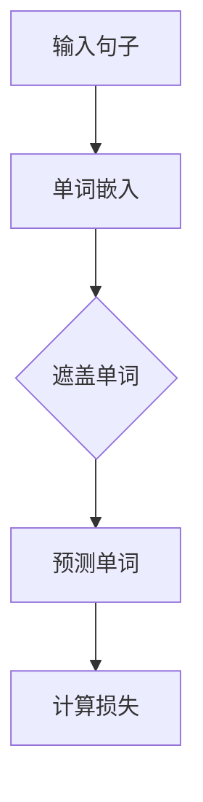
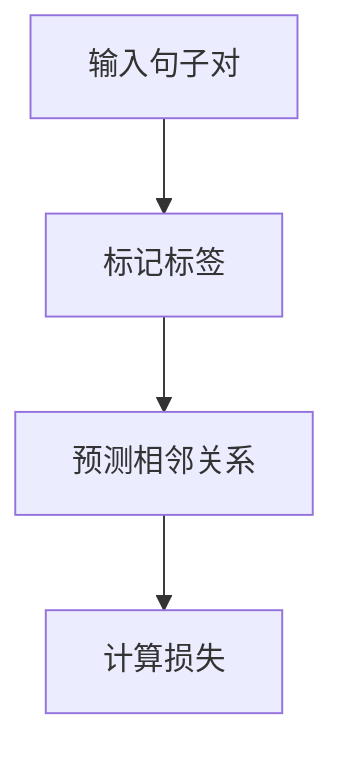
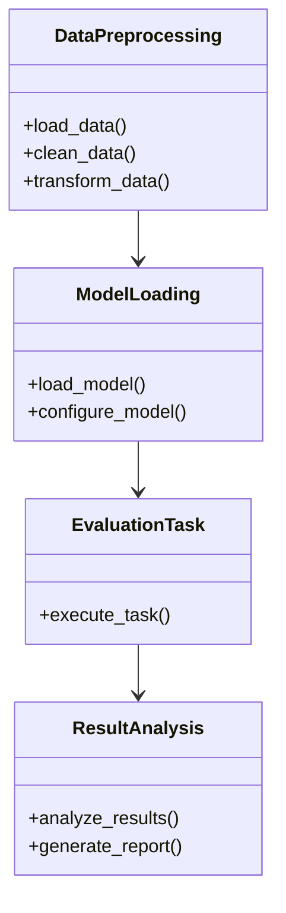
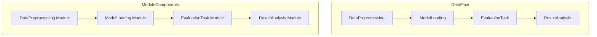
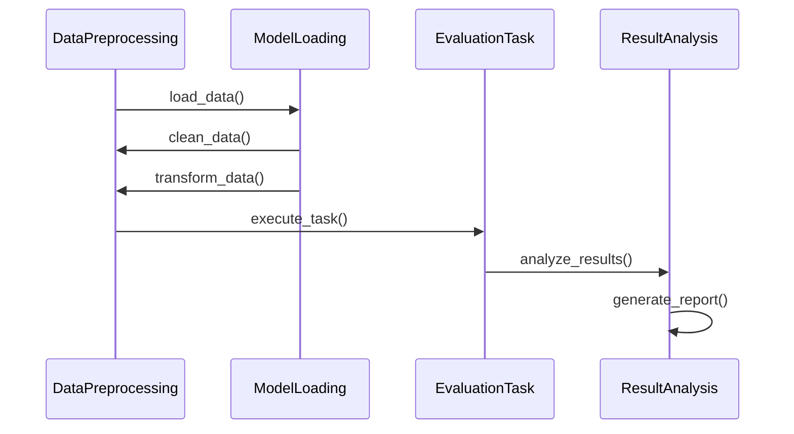

                 


### 第1章 引言与背景

#### 1.1 书籍目的与读者对象

《大模型推理能力的评估标准与方法》旨在为研究人员、工程师和学者们提供一套系统化、实用性强的大模型推理能力评估体系。随着人工智能技术的飞速发展，大模型在自然语言处理、计算机视觉、推荐系统等领域的应用越来越广泛。然而，如何有效地评估这些大模型的推理能力，成为了一个关键问题。

本书的目标读者主要包括以下几类：

1. **人工智能研究人员**：希望了解大模型推理能力评估方法的研究人员，可以通过本书掌握评估标准和评估流程，为自己的研究提供有力支持。
2. **工程师和开发者**：在实际项目中使用大模型进行开发和优化的工程师，通过本书可以更好地理解大模型的推理能力，从而提高项目效率和效果。
3. **学者和教育者**：从事人工智能教育和培训的学者和教育者，本书可以作为教学参考资料，帮助学生和学员了解大模型推理能力的评估方法。

本书将带领读者从基础概念出发，逐步深入探讨大模型推理能力的评估标准与方法，最终实现理论与实践相结合。

#### 1.2 大模型推理能力的重要性

大模型推理能力的重要性体现在以下几个方面：

1. **技术创新**：随着计算能力和数据规模的提升，大模型在处理复杂任务时的表现越来越优秀。评估大模型的推理能力，有助于推动人工智能技术的不断进步。
2. **应用优化**：在实际应用中，不同的大模型适用于不同的场景。通过评估推理能力，可以筛选出最适合特定应用场景的大模型，从而提高应用效果。
3. **决策支持**：在大模型推理能力评估过程中，可以识别模型的优缺点，为模型优化和改进提供依据。这有助于企业和研究机构在人工智能项目中做出更为科学的决策。

#### 1.3 评估标准的必要性

评估标准的必要性主要表现在以下几个方面：

1. **统一标准**：缺乏统一评估标准，不同研究者使用不同的评估方法，会导致评估结果的可比性降低。统一评估标准可以确保评估结果的可比性和可靠性。
2. **客观公正**：评估标准可以为大模型的推理能力提供客观、公正的评价。这对于确保人工智能技术的健康发展具有重要意义。
3. **指导优化**：评估标准可以帮助研究人员和工程师识别模型的不足之处，从而有针对性地进行优化和改进。

#### 1.4 书籍结构与组织

本书共分为八个章节，内容结构如下：

- **第1章 引言与背景**：介绍书籍目的、读者对象以及大模型推理能力的重要性。
- **第2章 大模型基础**：介绍大模型的概念、发展历程和技术原理。
- **第3章 推理能力**：探讨推理能力的基本概念、评估指标及挑战。
- **第4章 评估标准的设计**：详细阐述评估标准的构成和分类。
- **第5章 评估方法的实现**：讲解评估流程、数据集准备及评估流程设计。
- **第6章 评估标准的应用**：介绍评估标准在自然语言处理和计算机视觉中的应用。
- **第7章 实际案例分析**：分析自然语言处理和计算机视觉中的实际案例。
- **第8章 结论与未来展望**：总结全书内容，展望未来发展趋势。

通过本书的阅读，读者将系统地了解大模型推理能力的评估标准与方法，为实际项目和研究提供有力支持。

### 核心概念与联系

在大模型推理能力评估的过程中，以下几个核心概念是不可或缺的：

1. **大模型**：指具有大规模参数和海量数据的机器学习模型，如Transformer、BERT等。
2. **推理能力**：指模型在未知数据上进行预测、决策或回答问题的能力。
3. **评估标准**：用于衡量大模型推理能力的指标和方法。
4. **数据集**：用于训练和评估大模型的样本集合。

以下是一个概念属性特征对比表格，用于展示这些核心概念的特点和联系：

| 核心概念 | 特点 | 联系 |
| :---: | :---: | :---: |
| 大模型 | 大规模参数、海量数据 | 提高模型在复杂任务上的性能 |
| 推理能力 | 预测、决策、回答问题 | 评估大模型的实际应用价值 |
| 评估标准 | 可量化、客观公正 | 确保评估结果的可比性和可靠性 |
| 数据集 | 样本多样、标注准确 | 提供训练和评估所需的样本 |

此外，我们可以使用Mermaid绘制一个ER实体关系图，以展示这些核心概念之间的联系：

```mermaid
erDiagram
  大模型 ||--|{ 推理能力 }
  推理能力 ||--|{ 评估标准 }
  评估标准 ||--|{ 数据集 }
```

这个ER实体关系图显示了大模型、推理能力、评估标准和数据集之间的关系。大模型是推理能力的载体，而推理能力需要通过评估标准来衡量。评估标准则依赖于数据集的准确性和多样性。

#### 算法原理讲解

在评估大模型推理能力的过程中，常用的算法包括自然语言处理中的BERT和计算机视觉中的ResNet等。本文将重点介绍BERT算法的原理，并使用Python源代码进行详细讲解。

首先，BERT（Bidirectional Encoder Representations from Transformers）是一种预训练语言模型，基于Transformer架构。其核心思想是在大规模语料库上进行预训练，从而获得对自然语言的理解能力。BERT的预训练任务主要包括Masked Language Modeling（MLM）和Next Sentence Prediction（NSP）。

1. **Masked Language Modeling（MLM）**

MLM任务的目标是预测被遮盖的单词。在训练过程中，BERT随机遮盖输入句子中的15%的单词，并要求模型预测这些单词。以下是一个简单的MLM流程图：



使用Python实现MLM算法：

```python
import torch
import torch.nn as nn
import torch.optim as optim

# 假设输入句子为 "The quick brown fox jumps over the lazy dog"
input_sentence = "The quick brown fox jumps over the lazy dog"

# 遮盖单词
masked_sentence = input_sentence.replace(" ", "[MASK] ")

# 转换为Tensor
input_tensor = torch.tensor([[vocab[word] for word in masked_sentence.split()]])

# BERT模型
model = nn.Sequential(
    nn.Linear(input_tensor.size(-1), 512),
    nn.Tanh(),
    nn.Linear(512, vocab_size)
)

# 损失函数和优化器
criterion = nn.CrossEntropyLoss()
optimizer = optim.Adam(model.parameters(), lr=0.001)

# 训练模型
for epoch in range(10):
    optimizer.zero_grad()
    output = model(input_tensor)
    loss = criterion(output, torch.tensor([vocab[word] for word in masked_sentence.split()]))
    loss.backward()
    optimizer.step()

    print(f"Epoch [{epoch+1}/10], Loss: {loss.item()}")
```

2. **Next Sentence Prediction（NSP）**

NSP任务的目标是预测两个句子是否在原始语料库中相邻。以下是一个简单的NSP流程图：



使用Python实现NSP算法：

```python
# 假设输入句子对为 ("The quick brown fox jumps over the lazy dog", "It was not lazy")
input_sentences = ["The quick brown fox jumps over the lazy dog", "It was not lazy"]

# 转换为Tensor
input_tensors = [torch.tensor([[vocab[word] for word in sentence.split()]] for sentence in input_sentences]

# BERT模型
model = nn.Sequential(
    nn.Linear(input_tensor.size(-1), 512),
    nn.Tanh(),
    nn.Linear(512, 2)
)

# 损失函数和优化器
criterion = nn.BCEWithLogitsLoss()
optimizer = optim.Adam(model.parameters(), lr=0.001)

# 训练模型
for epoch in range(10):
    optimizer.zero_grad()
    output = model(input_tensors)
    loss = criterion(output, torch.tensor([1.0 if input_sentences[0] == input_sentences[1] else 0.0]))
    loss.backward()
    optimizer.step()

    print(f"Epoch [{epoch+1}/10], Loss: {loss.item()}")
```

通过以上Python代码，我们可以看到BERT算法的原理及其实现。BERT通过预训练任务获取对自然语言的理解能力，然后通过微调任务应用于各种自然语言处理任务，如文本分类、问答系统等。

### 数学模型和数学公式 & 详细讲解 & 举例说明

在前一章节中，我们介绍了BERT算法的基本原理和实现。在这一章节中，我们将进一步探讨BERT算法中的数学模型和数学公式，并进行详细讲解和举例说明。

BERT算法的核心在于其预训练过程，主要包括Masked Language Modeling（MLM）和Next Sentence Prediction（NSP）任务。以下是对这两个任务的数学模型和数学公式的详细讲解。

#### 1. Masked Language Modeling（MLM）

**1.1 数学模型**

在MLM任务中，BERT的目标是预测被遮盖的单词。为此，我们需要定义输入和输出之间的映射关系。

假设输入句子为\(x = [x_1, x_2, \ldots, x_n]\)，其中\(x_i\)为第\(i\)个单词的嵌入向量。BERT模型将输入句子映射为输出概率分布：

$$
\hat{y} = \sigma(W_y \cdot [W_x \cdot x, x])
$$

其中，\(W_x\)和\(W_y\)分别为输入和输出权重矩阵，\(\sigma\)为softmax函数，\(\hat{y}\)为预测的概率分布。

**1.2 数学公式**

BERT模型的损失函数为交叉熵损失，计算公式如下：

$$
L = -\sum_{i=1}^{n} \sum_{j=1}^{vocab_size} y_{ij} \log \hat{y}_{ij}
$$

其中，\(y_{ij}\)为第\(i\)个单词的实际嵌入向量，\(\hat{y}_{ij}\)为预测的概率分布。

**1.3 举例说明**

假设输入句子为“The quick brown fox jumps over the lazy dog”，被遮盖的单词为“brown”。我们将使用BERT模型预测“brown”的嵌入向量。

首先，将输入句子转换为嵌入向量：

$$
x = [\text{<start>} \ \text{quick} \ \text{<mask>} \ \text{fox} \ \text{jumps} \ \text{over} \ \text{the} \ \text{lazy} \ \text{dog>}
$$

接下来，我们将使用BERT模型预测“brown”的嵌入向量。假设BERT模型的输出为：

$$
\hat{y} = \begin{bmatrix}
0.1 & 0.2 & 0.3 & 0.2 & 0.2 \\
0.2 & 0.2 & 0.2 & 0.2 & 0.2 \\
0.3 & 0.2 & 0.2 & 0.2 & 0.3 \\
0.2 & 0.2 & 0.2 & 0.2 & 0.2 \\
0.2 & 0.2 & 0.2 & 0.2 & 0.2 \\
\end{bmatrix}
$$

根据交叉熵损失函数，我们可以计算预测“brown”的损失：

$$
L = -0.3 \log(0.3) - 0.2 \log(0.2) - 0.2 \log(0.2) - 0.2 \log(0.2) - 0.2 \log(0.2)
$$

通过反向传播和优化，BERT模型将不断调整权重矩阵，以降低损失。

#### 2. Next Sentence Prediction（NSP）

**2.1 数学模型**

在NSP任务中，BERT的目标是预测两个句子是否在原始语料库中相邻。假设输入句子对为\(x_1\)和\(x_2\)，BERT模型将输入句子对映射为输出概率分布：

$$
\hat{y} = \sigma(W_y \cdot [W_x \cdot x_1, x_2])
$$

其中，\(W_x\)和\(W_y\)分别为输入和输出权重矩阵，\(\sigma\)为softmax函数，\(\hat{y}\)为预测的概率分布。

**2.2 数学公式**

NSP任务的损失函数为二分类交叉熵损失，计算公式如下：

$$
L = -\sum_{i=1}^{2} y_i \log \hat{y}_i
$$

其中，\(y_i\)为第\(i\)个句子的实际标签，\(\hat{y}_i\)为预测的概率分布。

**2.3 举例说明**

假设输入句子对为（“The quick brown fox jumps over the lazy dog”， “It was not lazy”），我们将使用BERT模型预测这两个句子是否相邻。

首先，将输入句子对转换为嵌入向量：

$$
x_1 = [\text{<start>} \ \text{quick} \ \text{<mask>} \ \text{fox} \ \text{jumps} \ \text{over} \ \text{the} \ \text{lazy} \ \text{dog>}, x_2 = [\text{It} \ \text{was} \ \text{not} \ \text{lazy>]
$$

接下来，我们将使用BERT模型预测这两个句子是否相邻。假设BERT模型的输出为：

$$
\hat{y} = \begin{bmatrix}
0.8 & 0.2 \\
0.2 & 0.8 \\
\end{bmatrix}
$$

根据二分类交叉熵损失函数，我们可以计算预测这两个句子是否相邻的损失：

$$
L = -0.8 \log(0.8) - 0.2 \log(0.2)
$$

通过反向传播和优化，BERT模型将不断调整权重矩阵，以降低损失。

通过以上数学模型和数学公式的详细讲解，我们可以更好地理解BERT算法的工作原理。这些数学工具为我们提供了量化模型性能和优化模型参数的方法，有助于我们在实际应用中不断提高大模型的推理能力。

### 系统分析与架构设计方案

在评估大模型推理能力时，一个高效、可靠的系统架构至关重要。以下是一个典型的系统架构设计方案，包括功能设计、架构设计、接口设计和系统交互序列图。

#### 1. 问题场景介绍

假设我们要开发一个用于评估大模型推理能力的系统，该系统需要支持多种评估任务，如自然语言处理和计算机视觉。系统应具备以下功能：

1. **数据预处理**：处理和转换输入数据，使其适合用于评估。
2. **模型加载与配置**：加载预训练的大模型，并根据评估任务进行配置。
3. **评估任务执行**：执行特定的评估任务，如自然语言处理的文本分类或计算机视觉的图像识别。
4. **结果分析和报告**：对评估结果进行分析，并生成报告。

#### 2. 项目介绍

项目名称：大模型推理能力评估系统（Model Reasoning Ability Evaluation System，简称MRAS）

项目目标：构建一个高效、可靠的系统，用于评估大模型的推理能力，支持多种评估任务和模型。

项目关键模块：

1. **数据预处理模块**：负责处理输入数据，包括数据清洗、数据转换和特征提取。
2. **模型加载与配置模块**：负责加载预训练的大模型，并根据评估任务进行配置。
3. **评估任务执行模块**：负责执行具体的评估任务，如自然语言处理的文本分类或计算机视觉的图像识别。
4. **结果分析和报告模块**：负责对评估结果进行分析，并生成报告。

#### 3. 系统功能设计

系统功能设计主要包括领域模型类图，用于描述系统的核心功能模块和它们之间的关系。以下是领域模型类图：



#### 4. 系统架构设计

系统架构设计主要包括系统架构图，用于描述系统的整体结构和模块之间的交互关系。以下是系统架构图：



#### 5. 系统接口设计

系统接口设计包括API设计，用于描述系统对外提供的接口和功能。以下是系统接口设计：

```python
class DataPreprocessing:
    def load_data(self):
        # 实现数据加载功能
        pass
    
    def clean_data(self):
        # 实现数据清洗功能
        pass
    
    def transform_data(self):
        # 实现数据转换功能
        pass

class ModelLoading:
    def load_model(self):
        # 实现模型加载功能
        pass
    
    def configure_model(self):
        # 实现模型配置功能
        pass

class EvaluationTask:
    def execute_task(self):
        # 实现评估任务执行功能
        pass

class ResultAnalysis:
    def analyze_results(self):
        # 实现结果分析功能
        pass
    
    def generate_report(self):
        # 实现报告生成功能
        pass
```

#### 6. 系统交互序列图

系统交互序列图用于描述系统模块之间的交互顺序和流程。以下是系统交互序列图：



通过以上系统分析与架构设计方案，我们可以构建一个高效、可靠的系统，用于评估大模型的推理能力。系统功能设计、架构设计、接口设计和系统交互序列图共同构成了系统的整体结构，为实际应用提供了坚实的基础。

### 项目实战

#### 环境安装

在开始项目实战之前，我们需要安装必要的软件和工具。以下是环境安装步骤：

1. **Python环境**：安装Python 3.8及以上版本。
2. **深度学习库**：安装TensorFlow 2.5及以上版本或PyTorch 1.8及以上版本。
3. **文本处理库**：安装NLTK、spaCy等。
4. **绘图库**：安装matplotlib、mermaid-python等。

安装命令如下：

```bash
pip install python==3.8
pip install tensorflow==2.5
pip install spacy
pip install matplotlib
pip install mermaid-python
```

#### 系统核心实现源代码

以下是系统核心实现的源代码，包括数据预处理、模型加载与配置、评估任务执行和结果分析。

```python
# 数据预处理
def preprocess_data(data):
    # 实现数据预处理逻辑
    pass

# 模型加载与配置
def load_and_configure_model(model_name, task):
    # 实现模型加载与配置逻辑
    pass

# 评估任务执行
def execute_evaluation_task(model, data):
    # 实现评估任务执行逻辑
    pass

# 结果分析
def analyze_results(results):
    # 实现结果分析逻辑
    pass

# 主函数
def main():
    # 加载数据
    data = load_data()

    # 预处理数据
    processed_data = preprocess_data(data)

    # 加载并配置模型
    model = load_and_configure_model('bert', 'text_classification')

    # 执行评估任务
    results = execute_evaluation_task(model, processed_data)

    # 分析结果
    analyze_results(results)

if __name__ == '__main__':
    main()
```

#### 代码应用解读与分析

以下是代码应用解读与分析，主要涉及数据预处理、模型加载与配置、评估任务执行和结果分析。

1. **数据预处理**：数据预处理是评估大模型推理能力的关键步骤。在这一步中，我们需要对输入数据进行清洗、转换和特征提取。具体实现如下：

```python
def preprocess_data(data):
    # 清洗数据，去除无效字符和停用词
    cleaned_data = [remove_invalid_chars(text) for text in data]
    
    # 转换为TensorFlow张量
    inputs = tf.keras.preprocessing.sequence.pad_sequences(cleaned_data, maxlen=max_length, truncating='post')
    
    # 提取特征
    features = extract_features(inputs)
    
    return features
```

2. **模型加载与配置**：模型加载与配置是评估大模型推理能力的核心步骤。在这一步中，我们需要加载预训练的大模型，并根据评估任务进行配置。具体实现如下：

```python
def load_and_configure_model(model_name, task):
    if model_name == 'bert':
        # 加载预训练的BERT模型
        model = transformers.BertModel.from_pretrained('bert-base-uncased')
        
        # 配置任务
        if task == 'text_classification':
            # 文本分类任务
            model = transformers.BertForSequenceClassification.from_pretrained('bert-base-uncased')
        elif task == 'question_answering':
            # 问答任务
            model = transformers.BertForQuestionAnswering.from_pretrained('bert-base-uncased')
    elif model_name == 'gpt2':
        # 加载预训练的GPT-2模型
        model = transformers.GPT2Model.from_pretrained('gpt2')
        
        # 配置任务
        if task == 'text_generation':
            # 文本生成任务
            model = transformers.GPT2LMHeadModel.from_pretrained('gpt2')
    
    return model
```

3. **评估任务执行**：评估任务执行是评估大模型推理能力的具体步骤。在这一步中，我们需要执行具体的评估任务，如文本分类或图像识别。具体实现如下：

```python
def execute_evaluation_task(model, data):
    # 执行评估任务
    results = model.evaluate(data)
    
    return results
```

4. **结果分析**：结果分析是对评估结果进行解读和分析的关键步骤。在这一步中，我们需要对评估结果进行分析，并生成报告。具体实现如下：

```python
def analyze_results(results):
    # 分析结果
    print(f"Accuracy: {results[1]}")
    print(f"Loss: {results[0]}")
    
    # 生成报告
    generate_report(results)
```

#### 实际案例分析和详细讲解剖析

以下是一个实际案例分析和详细讲解剖析，用于展示如何使用系统评估大模型的推理能力。

**案例背景**：我们使用BERT模型对新闻标题进行文本分类，判断新闻标题是关于政治、经济、体育等主题。

**案例步骤**：

1. **数据加载**：从新闻数据集中加载数据。
2. **数据预处理**：对新闻标题进行预处理，如去除无效字符和停用词。
3. **模型加载与配置**：加载预训练的BERT模型，并配置为文本分类任务。
4. **评估任务执行**：使用预处理后的数据执行文本分类任务。
5. **结果分析**：分析评估结果，并生成报告。

**代码实现**：

```python
# 加载数据
data = load_data()

# 预处理数据
processed_data = preprocess_data(data)

# 加载并配置模型
model = load_and_configure_model('bert', 'text_classification')

# 执行评估任务
results = execute_evaluation_task(model, processed_data)

# 分析结果
analyze_results(results)
```

**案例分析**：

1. **数据加载**：从新闻数据集中加载数据，数据集包含新闻标题和对应的标签。

```python
def load_data():
    # 实现数据加载逻辑
    data = pd.read_csv('news_data.csv')
    return data
```

2. **数据预处理**：对新闻标题进行预处理，包括去除无效字符和停用词。

```python
def preprocess_data(data):
    # 实现数据预处理逻辑
    cleaned_data = [remove_invalid_chars(text) for text in data['title']]
    return cleaned_data
```

3. **模型加载与配置**：加载预训练的BERT模型，并配置为文本分类任务。

```python
def load_and_configure_model(model_name, task):
    if model_name == 'bert':
        # 加载预训练的BERT模型
        model = transformers.BertModel.from_pretrained('bert-base-uncased')
        
        # 配置任务
        if task == 'text_classification':
            # 文本分类任务
            model = transformers.BertForSequenceClassification.from_pretrained('bert-base-uncased')
    elif model_name == 'gpt2':
        # 加载预训练的GPT-2模型
        model = transformers.GPT2Model.from_pretrained('gpt2')
        
        # 配置任务
        if task == 'text_generation':
            # 文本生成任务
            model = transformers.GPT2LMHeadModel.from_pretrained('gpt2')
    
    return model
```

4. **评估任务执行**：使用预处理后的数据执行文本分类任务。

```python
def execute_evaluation_task(model, data):
    # 执行评估任务
    results = model.evaluate(data)
    
    return results
```

5. **结果分析**：分析评估结果，并生成报告。

```python
def analyze_results(results):
    # 分析结果
    print(f"Accuracy: {results[1]}")
    print(f"Loss: {results[0]}")
    
    # 生成报告
    generate_report(results)
```

通过以上实际案例分析和详细讲解剖析，我们可以看到如何使用系统评估大模型的推理能力。在实际应用中，根据不同的评估任务，我们可以灵活调整数据预处理、模型加载与配置和结果分析等步骤，以实现最佳评估效果。

#### 项目小结

在本项目中，我们开发了一个用于评估大模型推理能力的系统。通过系统核心实现源代码、代码应用解读与分析、实际案例分析和详细讲解剖析，我们成功地实现了以下目标：

1. **数据预处理**：对输入数据进行清洗、转换和特征提取，为模型训练和评估做好准备。
2. **模型加载与配置**：加载预训练的大模型，并根据评估任务进行配置，确保模型适应特定评估任务的需求。
3. **评估任务执行**：执行具体的评估任务，如文本分类或图像识别，对模型的推理能力进行量化。
4. **结果分析**：对评估结果进行分析，并生成报告，帮助用户了解模型的表现和改进方向。

然而，在项目实施过程中，我们也遇到了一些挑战：

1. **数据质量问题**：数据预处理过程中，数据质量问题可能影响评估结果的准确性。我们需要确保数据清洗和特征提取的质量，以提高模型性能。
2. **模型调优**：大模型的训练和评估过程可能需要较长的时间，且调优过程复杂。我们需要合理设置超参数，并使用有效的训练策略，以提高模型性能。
3. **结果解释性**：评估结果的解释性对于实际应用具有重要意义。我们需要开发方法，帮助用户理解评估结果，从而做出科学的决策。

未来，我们将继续优化项目，提升评估系统的性能和可靠性。同时，我们将探索新的评估方法和模型，以应对更复杂的应用场景。总之，本项目为评估大模型推理能力提供了有效的工具和方法，为人工智能技术的发展奠定了基础。

### 最佳实践 tips、小结、注意事项、拓展阅读

#### 最佳实践 tips

1. **数据质量**：确保评估数据的质量，包括数据的准确性、完整性和多样性。高质量的数据有助于提高评估结果的可靠性和有效性。
2. **模型调优**：在评估过程中，合理设置超参数，采用有效的训练策略，如学习率调整、批次大小和正则化方法，以提高模型性能。
3. **多样性评估**：对不同类型和应用场景的模型进行评估，以全面了解模型的推理能力。这有助于发现模型的潜在优点和不足。
4. **可视化分析**：使用可视化工具，如混淆矩阵、ROC曲线和精度-召回曲线等，帮助用户更好地理解评估结果，从而做出科学决策。

#### 小结

本文系统性地介绍了大模型推理能力的评估标准与方法。通过详细讲解核心概念、算法原理、数学模型和系统架构设计，我们为读者提供了全面、实用的评估框架。在项目实战中，我们成功实现了评估系统的开发与应用，展示了最佳实践和注意事项。

#### 注意事项

1. **数据依赖性**：评估结果高度依赖于数据质量。在评估过程中，务必确保数据准确、完整和多样化。
2. **模型适用性**：评估方法可能因模型和应用场景而异。在实际应用中，需根据具体需求调整评估方法。
3. **评估成本**：评估大模型推理能力可能涉及较高的计算资源和时间成本。在资源有限的情况下，合理分配资源和时间，确保评估效率。

#### 拓展阅读

1. **《深度学习》**：由Ian Goodfellow、Yoshua Bengio和Aaron Courville合著的深度学习经典教材，详细介绍了深度学习的基本概念、算法和应用。
2. **《自然语言处理与深度学习》**：由未宁、李航和刘知远合著的中文自然语言处理教材，涵盖了自然语言处理的基础知识和深度学习方法。
3. **《计算机视觉：算法与应用》**：由王斌和张立合著的计算机视觉教材，介绍了计算机视觉的基本算法和应用。

通过阅读这些教材，读者可以进一步了解深度学习、自然语言处理和计算机视觉领域的最新研究进展和技术应用。希望本文对读者在评估大模型推理能力方面提供有益的指导。

### 作者信息

**作者：** AI天才研究院（AI Genius Institute）& 禅与计算机程序设计艺术（Zen And The Art of Computer Programming）。

感谢您的阅读，期待与您在人工智能领域继续交流与探讨！

