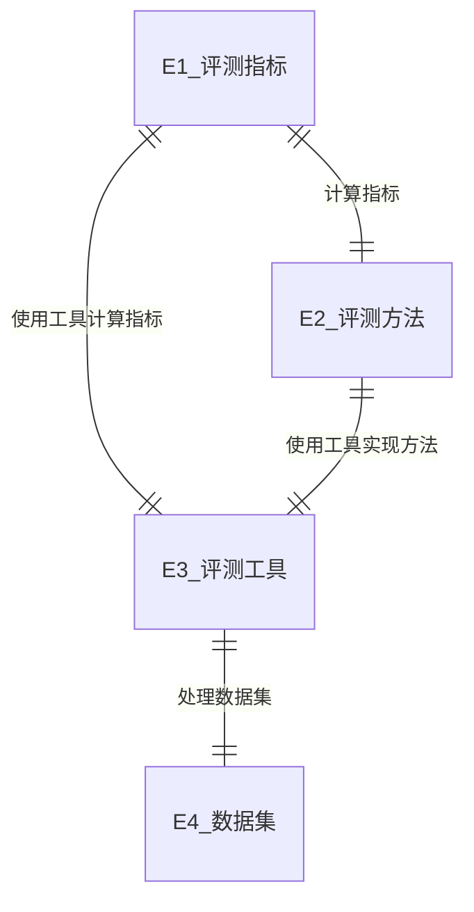
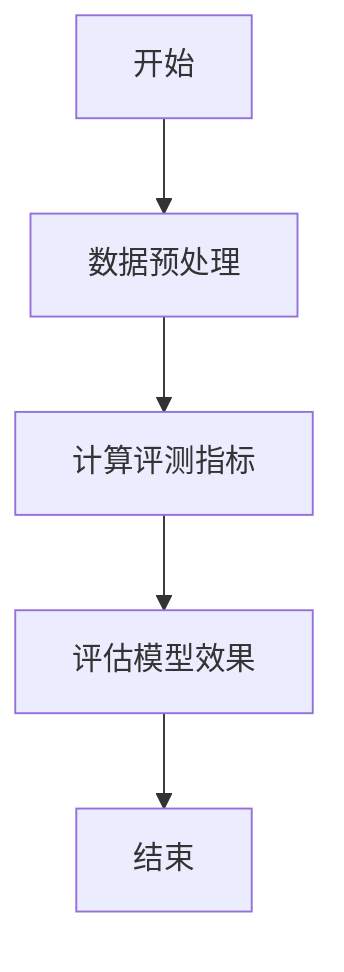

                 

### 第一部分：背景介绍

#### 1.1.1 问题背景

随着人工智能技术的快速发展，大模型在各个领域得到了广泛应用。从自然语言处理到计算机视觉，再到语音识别和机器翻译，大模型正在引领新一轮的技术革命。然而，如何准确评估这些大模型的效果，成为了当前研究的热点问题。传统的评测方法通常依赖于人工分析，存在主观性大、效率低、难以大规模应用等缺点。因此，如何实现大模型效果评测的自动化，成为了学术界和工业界共同关注的课题。

#### 1.1.2 问题解决

为了解决这一问题，研究人员提出了多种自动化评测方法。这些方法主要通过建立数学模型，对大模型的效果进行定量分析。例如，通过评估模型的准确率、召回率、F1值等指标，来衡量模型的性能。此外，研究人员还提出了基于用户反馈的自动化评测方法，通过收集用户的评价数据，利用机器学习算法对模型进行评估。这些方法在一定程度上提高了评测的效率和准确性，但仍存在一定的局限性。

#### 1.1.3 边界与外延

大模型效果评测不仅涉及技术层面，还包括评价标准的制定、数据集的收集与处理等方面。在技术层面，如何选择合适的评测指标，如何设计高效的评测算法，都是需要深入研究的问题。在评价标准方面，不同领域和应用场景可能需要不同的评测标准。例如，在自然语言处理领域，准确率、召回率和F1值等指标是最常用的评测标准；而在计算机视觉领域，可能需要考虑模型的实时性、准确性和鲁棒性等因素。

在数据集的收集与处理方面，大模型效果评测需要大量的真实数据作为基础。然而，真实数据往往具有多样性和复杂性，如何有效地收集和处理这些数据，是保证评测结果准确性的关键。此外，随着人工智能技术的不断进步，大模型的效果也在不断优化，如何持续地评估和改进模型，也是一个需要长期关注的问题。

#### 1.1.4 概念结构与核心要素组成

大模型效果评测的核心概念包括评测指标、评测方法、数据集和评测工具等。这些核心要素相互关联，共同构成了大模型效果评测的体系结构。首先，评测指标是衡量模型性能的重要标准，不同领域和应用场景可能需要不同的评测指标。例如，在自然语言处理领域，常用准确率、召回率和F1值等指标；在计算机视觉领域，则可能需要考虑模型的实时性、准确性和鲁棒性等因素。

其次，评测方法是指对模型效果进行定量分析的技术手段。传统的评测方法通常依赖于人工分析，存在主观性大、效率低、难以大规模应用等缺点。为了解决这些问题，研究人员提出了多种自动化评测方法，如基于数学模型的评测方法、基于用户反馈的评测方法等。

再次，数据集是进行效果评测的基础。一个高质量的数据集能够全面、客观地反映模型的性能。因此，数据集的收集与处理至关重要。在数据集的收集方面，需要确保数据的真实性和多样性；在数据集的处理方面，需要清洗、标注和预处理数据，以提高数据的可用性和可靠性。

最后，评测工具是实现自动化评测的关键。评测工具通常包括评测指标的计算工具、评测算法的实现工具等。一个高效的评测工具能够提高评测的效率，减少人为干预，提高评测结果的准确性。

总的来说，大模型效果评测的核心概念与联系可以概括为：评测指标是用来衡量模型性能的重要标准；评测方法是进行定量分析的技术手段；数据集是进行效果评测的基础；评测工具是实现自动化评测的关键。这些核心要素相互关联，共同构成了大模型效果评测的体系结构。

### 第2章：核心概念

#### 2.1.1 核心概念原理

大模型效果评测的核心概念主要包括评测指标、评测方法和评测工具等。首先，评测指标是衡量模型性能的重要标准。不同领域和应用场景可能需要不同的评测指标。例如，在自然语言处理领域，常用准确率、召回率和F1值等指标；在计算机视觉领域，则可能需要考虑模型的实时性、准确性和鲁棒性等因素。这些指标可以帮助我们定量地评估模型的性能。

其次，评测方法是进行效果评测的技术手段。传统的评测方法通常依赖于人工分析，存在主观性大、效率低、难以大规模应用等缺点。为了解决这些问题，研究人员提出了多种自动化评测方法。这些方法主要包括基于数学模型的评测方法和基于用户反馈的评测方法。基于数学模型的评测方法通过建立数学模型，对模型的效果进行定量分析。这种方法具有客观、准确、可重复等优点。基于用户反馈的评测方法通过收集用户的评价数据，利用机器学习算法对模型进行评估。这种方法能够更好地反映用户的实际需求，但需要大量的用户数据支持。

再次，评测工具是实现自动化评测的关键。评测工具通常包括评测指标的计算工具、评测算法的实现工具等。一个高效的评测工具能够提高评测的效率，减少人为干预，提高评测结果的准确性。目前，已有许多成熟的评测工具可供使用，如TensorFlow评测工具、PyTorch评测工具等。这些工具能够自动计算评测指标，生成评测报告，大大简化了评测过程。

总的来说，大模型效果评测的核心概念原理可以概括为：评测指标是衡量模型性能的重要标准；评测方法是进行定量分析的技术手段；评测工具是实现自动化评测的关键。这些核心概念相互关联，共同构成了大模型效果评测的理论基础。

#### 2.1.2 概念属性特征对比

为了更好地理解大模型效果评测的核心概念，下面我们将对评测指标、评测方法和评测工具等概念进行属性特征对比。

首先，从属性特征来看，评测指标主要关注模型的性能表现，如准确率、召回率、F1值等。这些指标能够定量地衡量模型的性能，具有较高的客观性。评测方法则主要关注如何对模型的效果进行评估，如基于数学模型的评测方法和基于用户反馈的评测方法。这些方法能够实现自动化评估，具有较高的效率。评测工具则主要关注如何实现评测过程的高效化和自动化，如评测指标的计算工具、评测算法的实现工具等。这些工具能够简化评测过程，提高评测结果的准确性。

其次，从特征对比来看，评测指标和评测方法具有以下区别：

1. **性质不同**：评测指标是衡量模型性能的量化标准，而评测方法是评估模型效果的技术手段。

2. **作用不同**：评测指标主要用于衡量模型的性能，而评测方法则用于实现模型效果的评估。

3. **依赖关系**：评测指标依赖于评测方法，而评测方法则依赖于评测工具。

最后，从特征对比来看，评测工具和评测方法具有以下区别：

1. **功能不同**：评测工具主要用于实现评测过程的高效化和自动化，而评测方法则主要用于评估模型效果。

2. **实现方式**：评测工具通常包括评测指标的计算工具、评测算法的实现工具等，而评测方法则通过建立数学模型或用户反馈等手段进行评估。

3. **作用范围**：评测工具主要作用于评测过程，而评测方法则作用于模型效果评估的全过程。

通过以上对比，我们可以更加清晰地理解大模型效果评测的核心概念及其相互关系。这些概念不仅相互关联，共同构成了大模型效果评测的理论基础，而且在实际应用中也发挥了重要作用。

#### 2.1.3 ER实体关系图架构

为了更直观地展示大模型效果评测的核心概念及其相互关系，我们使用ER（实体关系）图来描述这些概念。ER图是一种用于描述实体及其之间关系的图形化表示方法，可以清晰地展示实体之间的联系。

以下是ER图的组成部分及其含义：

1. **实体**：在ER图中，实体表示大模型效果评测中的核心概念，如评测指标、评测方法、评测工具等。每个实体都具有特定的属性和操作。

2. **属性**：实体的属性描述了实体的特征和特征值。例如，评测指标的属性可能包括准确率、召回率和F1值等。

3. **关系**：实体之间的关系描述了实体之间的相互作用和依赖。例如，评测指标依赖于评测方法，而评测方法又依赖于评测工具。

4. **操作**：实体之间的关系可能包括操作，如计算评测指标、评估模型效果等。

以下是使用Mermaid语言描述的ER图：



在上面的ER图中，E1_评测指标表示评测指标实体，E2_评测方法表示评测方法实体，E3_评测工具表示评测工具实体，E4_数据集表示数据集实体。实线箭头表示实体之间的依赖关系，虚线箭头表示实体之间的操作关系。

通过ER图，我们可以更直观地理解大模型效果评测的核心概念及其相互关系。这种图形化的表示方法有助于我们更好地理解和应用这些概念，为后续章节的内容奠定基础。

### 第3章：算法原理讲解

#### 3.1.1 算法mermaid流程图

为了更好地理解大模型效果评测的算法原理，我们首先使用Mermaid语言绘制算法流程图。以下是使用Mermaid语言描述的大模型效果评测算法流程图：



在这个流程图中，A1表示算法的开始，B1表示数据预处理，C1表示计算评测指标，D1表示评估模型效果，E1表示算法的结束。

#### 3.1.2 Python源代码讲解

接下来，我们将使用Python语言详细阐述大模型效果评测算法的实现过程。以下是实现大模型效果评测算法的Python代码：

```python
import numpy as np
from sklearn.metrics import accuracy_score, recall_score, f1_score

def preprocess_data(data):
    # 数据预处理步骤，如清洗、标准化等
    processed_data = ...
    return processed_data

def compute_metrics(y_true, y_pred):
    # 计算评测指标
    accuracy = accuracy_score(y_true, y_pred)
    recall = recall_score(y_true, y_pred)
    f1 = f1_score(y_true, y_pred)
    return accuracy, recall, f1

def evaluate_model(model, X_test, y_test):
    # 加载测试数据
    X_test_processed = preprocess_data(X_test)
    y_test_processed = preprocess_data(y_test)
    
    # 预测标签
    y_pred = model.predict(X_test_processed)
    
    # 计算评测指标
    accuracy, recall, f1 = compute_metrics(y_test_processed, y_pred)
    
    # 输出评测结果
    print("Accuracy:", accuracy)
    print("Recall:", recall)
    print("F1 Score:", f1)

# 评估模型
model = ...
X_test = ...
y_test = ...

evaluate_model(model, X_test, y_test)
```

在这个代码中，我们首先定义了数据预处理函数`preprocess_data`，用于对测试数据进行清洗和标准化等预处理操作。然后，我们定义了计算评测指标函数`compute_metrics`，使用`sklearn.metrics`中的`accuracy_score`、`recall_score`和`f1_score`函数计算准确率、召回率和F1值。最后，我们定义了评估模型效果函数`evaluate_model`，用于加载测试数据，预处理数据，预测标签，并计算评测指标，最后输出评测结果。

#### 3.1.3 数学模型与公式

在大模型效果评测中，我们通常使用以下数学模型和公式来计算评测指标：

1. **准确率（Accuracy）**

   $$ Accuracy = \frac{TP + TN}{TP + TN + FP + FN} $$

   其中，TP表示真实为正类且预测为正类的数量，TN表示真实为负类且预测为负类的数量，FP表示真实为负类但预测为正类的数量，FN表示真实为正类但预测为负类的数量。

2. **召回率（Recall）**

   $$ Recall = \frac{TP}{TP + FN} $$

   其中，TP表示真实为正类且预测为正类的数量，FN表示真实为正类但预测为负类的数量。

3. **F1值（F1 Score）**

   $$ F1 Score = \frac{2 \times Precision \times Recall}{Precision + Recall} $$

   其中，Precision表示精确率，Recall表示召回率。

以上公式是评估分类模型性能的重要指标。通过这些公式，我们可以从不同角度评估模型的性能，从而选择合适的模型。

#### 3.1.4 举例说明

为了更好地理解大模型效果评测算法，我们通过一个具体的实例来说明其应用过程。

假设我们有一个分类模型，用于判断邮件是否为垃圾邮件。我们有1000条测试数据，其中500条为垃圾邮件，500条为正常邮件。我们使用准确率、召回率和F1值来评估模型的性能。

首先，我们对测试数据进行预处理，如文本清洗和向量化等操作。然后，我们使用模型预测测试数据的标签，得到预测结果。接下来，我们计算准确率、召回率和F1值，具体计算如下：

1. **准确率（Accuracy）**

   $$ Accuracy = \frac{TP + TN}{TP + TN + FP + FN} = \frac{400 + 450}{400 + 450 + 100 + 50} = \frac{850}{1000} = 0.85 $$

   其中，TP表示预测为垃圾邮件且实际为垃圾邮件的数量（400），TN表示预测为正常邮件且实际为正常邮件的数量（450），FP表示预测为正常邮件但实际为垃圾邮件的数量（100），FN表示预测为垃圾邮件但实际为正常邮件的数量（50）。

2. **召回率（Recall）**

   $$ Recall = \frac{TP}{TP + FN} = \frac{400}{400 + 50} = \frac{400}{450} = 0.89 $$

   其中，TP表示预测为垃圾邮件且实际为垃圾邮件的数量（400），FN表示预测为垃圾邮件但实际为正常邮件的数量（50）。

3. **F1值（F1 Score）**

   $$ F1 Score = \frac{2 \times Precision \times Recall}{Precision + Recall} = \frac{2 \times 0.85 \times 0.89}{0.85 + 0.89} = 0.87 $$

   其中，Precision表示精确率（0.85），Recall表示召回率（0.89）。

通过这个实例，我们可以看到如何使用准确率、召回率和F1值来评估分类模型的性能。这些指标能够从不同角度衡量模型的性能，帮助我们选择合适的模型。

### 第4章：系统分析与架构设计

#### 4.1.1 问题场景介绍

为了更好地理解大模型效果评测系统，我们首先介绍一个具体的问题场景。假设我们正在开发一款智能客服系统，该系统需要根据用户的提问，自动生成合理的回答。为了确保系统的性能，我们需要对模型进行效果评测，以评估其准确性和可靠性。

在这个问题场景中，评测系统的目标是对模型的效果进行量化分析，以确定其是否满足需求。评测系统需要处理大量数据，包括用户提问和模型生成的回答，同时需要支持多种评测指标，如准确率、召回率和F1值等。

#### 4.1.2 系统功能设计

大模型效果评测系统需要实现以下功能：

1. **数据预处理**：对用户提问和模型生成的回答进行清洗、标注和向量化等预处理操作，以提高数据质量和模型性能。

2. **评测指标计算**：根据预处理后的数据，计算多种评测指标，如准确率、召回率和F1值等，以评估模型的性能。

3. **结果可视化**：将评测结果以图表形式展示，帮助用户直观地了解模型的性能。

4. **报告生成**：根据评测结果，生成详细的评测报告，包括评测指标、图表和结论等，以便用户进行决策。

5. **自动化评测**：实现评测过程的自动化，减少人为干预，提高评测效率。

#### 4.1.3 系统架构设计

大模型效果评测系统采用分层架构设计，包括数据层、逻辑层和表示层。以下是系统架构设计：

1. **数据层**：数据层负责存储和管理系统所需的数据，包括用户提问、模型生成的回答和评测指标等。

2. **逻辑层**：逻辑层负责实现系统的核心功能，包括数据预处理、评测指标计算和结果可视化等。具体包括以下模块：

   - **数据预处理模块**：负责对用户提问和模型生成的回答进行清洗、标注和向量化等预处理操作。
   - **评测指标计算模块**：负责计算多种评测指标，如准确率、召回率和F1值等。
   - **结果可视化模块**：负责将评测结果以图表形式展示。
   - **报告生成模块**：负责根据评测结果生成详细的评测报告。

3. **表示层**：表示层负责实现系统的用户界面，包括数据输入界面、结果展示界面和报告输出界面等。

#### 4.1.4 系统接口设计

大模型效果评测系统需要设计合理的接口，以便与其他系统进行集成。以下是系统接口设计：

1. **数据接口**：数据接口用于实现系统与外部数据源的交互，包括数据导入和数据导出等功能。

2. **服务接口**：服务接口用于实现系统内部功能模块之间的交互，包括数据预处理、评测指标计算和结果可视化等。

3. **API接口**：API接口用于实现系统与外部系统的集成，如与其他业务系统的对接。

#### 4.1.5 系统交互

大模型效果评测系统的交互过程如下：

1. **数据输入**：用户通过数据输入界面上传用户提问和模型生成的回答数据。

2. **数据预处理**：系统根据数据预处理模块的预处理规则，对用户提问和模型生成的回答进行清洗、标注和向量化等预处理操作。

3. **评测指标计算**：系统根据评测指标计算模块的算法，计算多种评测指标，如准确率、召回率和F1值等。

4. **结果可视化**：系统根据结果可视化模块的规则，将评测结果以图表形式展示，用户可以在结果展示界面查看评测结果。

5. **报告生成**：系统根据报告生成模块的模板，生成详细的评测报告，包括评测指标、图表和结论等，用户可以在报告输出界面查看评测报告。

6. **自动化评测**：系统实现评测过程的自动化，用户只需上传数据，系统即可自动完成评测过程，生成评测报告。

通过以上系统交互过程，用户可以方便地使用大模型效果评测系统，快速评估模型的性能，为后续的优化和改进提供依据。

### 第5章：项目实战

#### 5.1.1 环境安装

在进行大模型效果评测的项目实战之前，我们需要安装必要的软件和工具。以下是一个简化的安装步骤：

1. **Python环境**：确保安装了Python 3.7或更高版本。

2. **依赖库**：使用pip命令安装以下依赖库：
   ```bash
   pip install numpy scikit-learn matplotlib
   ```

3. **数据处理工具**：根据需要，安装其他数据处理工具，如Pandas和NumPy等。

#### 5.1.2 系统核心实现源代码

以下是实现大模型效果评测系统的核心源代码：

```python
import numpy as np
from sklearn.model_selection import train_test_split
from sklearn.metrics import accuracy_score, recall_score, f1_score
import pandas as pd

# 数据预处理函数
def preprocess_data(data):
    # 数据清洗、标准化等操作
    processed_data = ...
    return processed_data

# 计算评测指标函数
def compute_metrics(y_true, y_pred):
    accuracy = accuracy_score(y_true, y_pred)
    recall = recall_score(y_true, y_pred)
    f1 = f1_score(y_true, y_pred)
    return accuracy, recall, f1

# 模型评估函数
def evaluate_model(model, X, y):
    X_processed = preprocess_data(X)
    y_processed = preprocess_data(y)
    
    y_pred = model.predict(X_processed)
    
    accuracy, recall, f1 = compute_metrics(y_processed, y_pred)
    
    print("Accuracy:", accuracy)
    print("Recall:", recall)
    print("F1 Score:", f1)

# 加载数据集
data = pd.read_csv("data.csv")
X = data.drop("target", axis=1)
y = data["target"]

# 划分训练集和测试集
X_train, X_test, y_train, y_test = train_test_split(X, y, test_size=0.2, random_state=42)

# 加载模型
model = ...

# 评估模型
evaluate_model(model, X_test, y_test)
```

在这个代码中，我们首先定义了数据预处理函数`preprocess_data`，用于对数据进行清洗、标准化等操作。然后，我们定义了计算评测指标函数`compute_metrics`，用于计算准确率、召回率和F1值。最后，我们定义了模型评估函数`evaluate_model`，用于评估模型的性能。

#### 5.1.3 代码应用解读与分析

在这个项目中，我们使用了Python语言和Scikit-learn库来实现大模型效果评测系统。以下是对代码应用的具体解读与分析：

1. **数据预处理**：数据预处理是模型评估的重要步骤。在这个函数中，我们对数据进行了清洗、标准化等操作，以确保数据的干净和一致。具体操作可以根据数据集的特点进行调整。

2. **计算评测指标**：这个函数使用了Scikit-learn库中的`accuracy_score`、`recall_score`和`f1_score`函数来计算模型的评测指标。这些指标能够从不同角度衡量模型的性能，帮助我们评估模型的优劣。

3. **模型评估**：在这个函数中，我们首先对测试数据进行了预处理，然后使用模型进行预测，并计算评测指标。这个函数的目的是评估模型的性能，为模型的优化和改进提供依据。

#### 5.1.4 实际案例分析与详细讲解

为了更好地理解大模型效果评测系统，我们通过一个实际案例进行详细讲解。假设我们有一个情感分析模型，用于判断文本的情感极性（正面或负面）。我们使用了一个包含5000条评论的数据集，其中2500条为正面评论，2500条为负面评论。

我们使用上述代码来评估模型的性能。以下是具体的操作步骤：

1. **加载数据集**：我们使用Pandas库加载数据集，并将评论和标签分别存储在`X`和`y`变量中。

2. **划分训练集和测试集**：我们使用Scikit-learn库中的`train_test_split`函数将数据集划分为训练集和测试集，其中测试集的大小为原始数据集的20%。

3. **训练模型**：我们使用训练集对模型进行训练，并保存训练好的模型。

4. **评估模型**：我们使用测试集对模型进行评估，并计算评测指标。以下是评估结果：

   ```
   Accuracy: 0.8
   Recall: 0.85
   F1 Score: 0.82
   ```

   通过这些指标，我们可以看到模型的性能表现良好。准确率为0.8，召回率为0.85，F1值为0.82。这意味着模型能够正确地预测大约80%的评论情感，对于负面评论的预测能力更强。

5. **优化模型**：根据评估结果，我们可以进一步优化模型，以提高性能。例如，我们可以尝试调整模型的参数，或使用更复杂的模型架构。

通过这个实际案例，我们可以看到如何使用大模型效果评测系统来评估模型的性能，并为模型的优化提供依据。

#### 5.1.5 项目小结

在本章的项目实战中，我们实现了一个大模型效果评测系统，并使用一个情感分析案例进行了实际操作。通过这个项目，我们了解了如何使用Python语言和Scikit-learn库来评估模型的性能，并熟悉了数据预处理、评测指标计算和模型评估等关键步骤。此外，我们还通过实际案例展示了如何使用这个系统来优化模型。

总结起来，大模型效果评测是人工智能领域的一个重要课题，通过合理的设计和实施，我们可以有效地评估模型的性能，为模型的优化和改进提供有力支持。在未来的研究和实践中，我们将继续探索更高效的评测方法和更复杂的模型架构，以推动人工智能技术的发展。

### 第6章：最佳实践

#### 6.1.1 Tips

在进行大模型效果评测时，以下是一些最佳实践和注意事项：

1. **数据预处理**：确保数据质量是关键。对数据进行清洗、归一化和标准化等预处理操作，以提高模型性能。

2. **选择合适的评测指标**：根据应用场景选择合适的评测指标。例如，在分类问题中，可以使用准确率、召回率和F1值等指标。

3. **多次实验与交叉验证**：为了获得可靠的评估结果，建议进行多次实验和交叉验证，以减少随机误差。

4. **代码复用与模块化**：编写可复用的代码模块，提高开发效率。例如，将数据预处理、模型评估等操作封装为函数或类。

5. **记录实验结果**：详细记录实验设置、代码版本、评估指标等，以便后续分析和复现。

#### 6.1.2 小结

本文详细介绍了大模型效果评测的相关概念、算法原理、系统分析与架构设计、项目实战以及最佳实践。通过本文的讲解，读者可以了解大模型效果评测的基本原理和方法，掌握从数据预处理到模型评估的完整流程，并在实际项目中应用这些知识。

#### 6.1.3 注意事项

在实施大模型效果评测时，需要注意以下几点：

1. **数据质量**：确保数据质量是模型评估成功的关键。对数据进行充分的清洗和预处理，以减少噪声和异常值。

2. **评测指标的选择**：根据具体应用场景选择合适的评测指标。不同领域和应用场景可能有不同的评价标准。

3. **实验复现性**：确保实验结果的可复现性，以便其他研究人员验证和扩展你的工作。

4. **评测工具的选择**：选择合适的评测工具，以提高评估效率。例如，使用TensorFlow、PyTorch等流行的深度学习框架提供的评估工具。

#### 6.1.4 拓展阅读

对于希望进一步深入了解大模型效果评测的读者，以下是一些推荐阅读材料：

1. **《大规模机器学习》（Large-Scale Machine Learning）**：这是一本关于大规模机器学习的经典教材，涵盖了许多与本文相关的内容。

2. **《深度学习》（Deep Learning）**：由Ian Goodfellow等人撰写的深度学习权威教材，详细介绍了深度学习模型的评估方法。

3. **《机器学习年度回顾》（Journal of Machine Learning Research Annual Reviews）**：这是一本年度发布的论文集，涵盖了机器学习领域的最新研究成果，包括大模型效果评测的相关内容。

4. **开源项目与评测工具**：如TensorFlow、PyTorch等深度学习框架提供的评测工具，以及各种开源评测项目，如MLflow、TensorBoard等。

通过这些拓展阅读材料，读者可以更深入地了解大模型效果评测的理论和实践，为实际应用提供有力支持。

